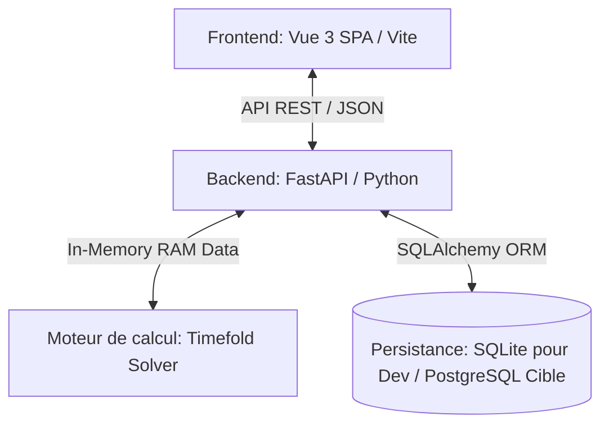
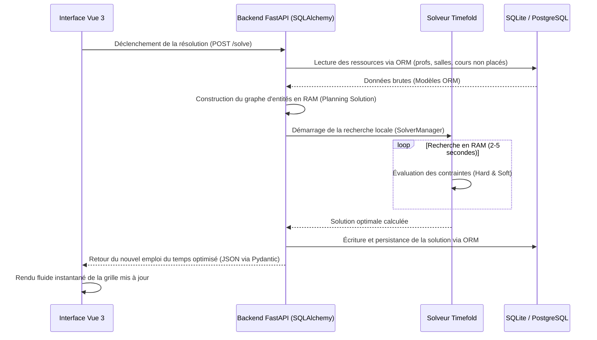
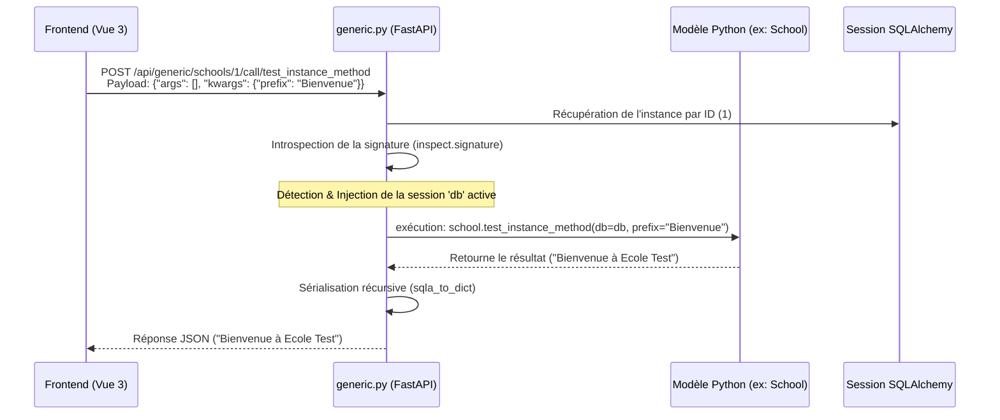
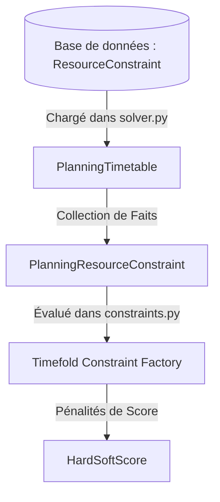
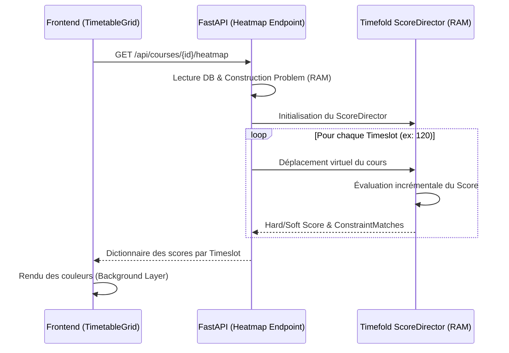
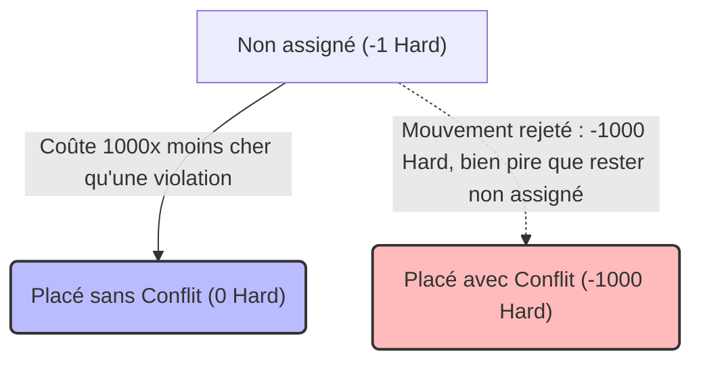

# Dossier d'Architecture Logicielle (DAL) : Klepsydrix

**Version** : 1.1.0  
**Statut** : Approuvé  
**Dernière mise à jour** : 2026-05-18  

Ce document décrit l'architecture globale cible du projet Klepsydrix, notre outil open-source d'aide à la conception et d'optimisation d'emplois du temps scolaires. Il sert de cadre technique pour tous les plans d'implémentation spécifiques (`plan.md`).

---

## 1. Vision et Objectifs Architecturaux

Le logiciel Klepsydrix doit résoudre un problème d'optimisation hautement complexe (NP-complet) tout en offrant une réactivité digne d'une application de bureau. 

### Objectifs Clés
- **Performance RAM (In-Memory)** : Le moteur de calcul doit travailler intégralement en mémoire vive pour évaluer des millions de combinaisons par seconde.
- **Fluidité de l'IHM (60 FPS)** : L'interface utilisateur de la grille horaire doit être ultra-réactive et gérer le glisser-déposer sans temps de latence visible.
- **Extensibilité** : Le modèle de données doit être capable d'absorber des structures de cours très complexes (barrettes, alignements, groupes, co-enseignement).

---

## 2. Architecture Globale (3-Tiers Découplée)

Le système est structuré selon un modèle classique découplé en trois couches distinctes :


```mermaid
graph TD
    UI[Frontend: Vue 3 SPA / Vite] <-->|API REST / JSON| API[Backend: FastAPI / Python]
    API <-->|In-Memory RAM Data| Solver[Moteur de calcul: Timefold Solver]
    API <-->|SQLAlchemy ORM| DB[(Persistance: SQLite pour Dev / PostgreSQL Cible)]
```

### A. Couche Présentation (Frontend - SPA)
- **Technologie** : Vue 3 (via Vite) et TypeScript.
- **Styling** : CSS moderne (TailwindCSS) reposant sur un design système premium (thème sombre, Glassmorphism, transitions natives Vue).
- **Rôle** : Rendre la grille horaire interactive, gérer le Drag & Drop côté client pour une manipulation manuelle, et consommer l'API du backend.

### B. Couche Service & Moteur (Backend - API & Solveur)
- **Technologie Backend** : Python (FastAPI).
- **Couche d'Abstraction & Validation** : SQLAlchemy ORM (pour l'accès aux données) et Pydantic (pour la validation des schémas d'API).
- **Rôle API** : Exposer les endpoints REST sécurisés, orchestrer les données et valider les modifications.
- **Moteur d'Optimisation** : Timefold Solver (version Python).
  - *Fonctionnement* : Le backend convertit les données persistées en un graphe d'objets en mémoire (Planning Solution), configure les variables (créneaux et salles) et les contraintes (Hard/Soft), puis délègue la résolution au moteur de recherche locale Timefold.
  - *Architecture de Validation Duale* : Pour des raisons de performance, lors de la sauvegarde de la solution, le Solveur accède directement aux attributs ORM (Direct Attribute Assignment) et fait un `commit()` brut, sans appeler les méthodes de validation de l'API (ex: `Course.validate_placement_conflicts()`). Celà éviter de vérifier à nouveau en Python une règle métier déjà vérifiée par le solver Timefold (ex: chevauchements, débordement de grille).

### C. Couche Données (Persistance)
- **Technologie de Persistance (Développement & V1)** : SQLite (Base locale et légère).
- **Technologie de Persistance (Cible Production)** : PostgreSQL.
- **Rôle** : Assurer la cohérence stricte des données et la persistance à long terme des ressources et des emplois du temps validés. L'utilisation de SQLAlchemy ORM garantit une transition transparente de SQLite vers PostgreSQL en modifiant simplement la chaîne de connexion.

---

## 3. Isolation des Environnements et Containerisation

Pour éviter de polluer le système hôte avec des dépendances globales et garantir la portabilité du projet, Klepsydrix implémente une isolation stricte des environnements de développement.

### A. Backend Python : Environnement Virtuel (`.venv`)
Le backend utilise un environnement virtuel local pour isoler les packages Python :
- **Mécanisme** : Création d'un dossier `.venv` à la racine du sous-projet backend (`python -m venv .venv`).
- **Activation** : `source .venv/bin/activate` (Linux/macOS) pour s'assurer que toutes les dépendances (FastAPI, SQLAlchemy, Timefold) restent confinées localement au projet.

### B. Frontend Vue 3 : Isolation Native via `node_modules`
- **Mécanisme** : Contrairement à Python, l'écosystème Node.js isole **nativement** les dépendances. Lorsque nous exécutons `npm install` (ou `pnpm install`), toutes les dépendances de Vue 3, Vite et TypeScript sont téléchargées exclusivement dans le dossier local `node_modules` à la racine du frontend.
- **Sécurité** : Aucun package n'est installé globalement sur ton OS. Supprimer le dossier `node_modules` suffit à nettoyer entièrement ta machine.

### C. Configuration Générale d'Instance (`instance.yaml`) et Compatibilité Multi-SGBD

La configuration de la base de données vit dans un fichier **`instance.yaml`**, à la racine du
dépôt (non versionné — voir `instance.example.yaml`, le gabarit documenté et versionné). Le chemin
peut être surchargé via la variable d'environnement `KLEPSYDRIX_CONFIG`. Ce fichier accueillera au
fil des chantiers d'autres sections indépendantes (`server`, `smtp`, `auth`, `identity_providers`,
`super_admins`...) — une seule imbrication par domaine, un seul fichier, pas de multiplication de
fichiers de config.

**Chargement** (`backend/app/core/config.py`) : `pydantic-settings` (`BaseSettings`) avec une
source YAML personnalisée (`YamlConfigSettingsSource`), qui reste prioritaire sur `.env` (celui-ci
ne porte plus que `SOLVER_TIME_LIMIT_SECONDS`/`SOLVER_UNIMPROVED_TIME_LIMIT_SECONDS`, backward
compatible). Convention `${env:NOM_VAR}` dans une valeur YAML : substituée par la variable
d'environnement correspondante — permet de référencer un secret (mot de passe SMTP, client OIDC...)
sans l'écrire en clair dans le fichier, valable pour n'importe quelle section future sans code
supplémentaire (substitution récursive sur tout le dict chargé).

**Section `database` :**
```yaml
database:
  backend: sqlite            # sqlite | postgresql
  directory: .                # obligatoire si backend=sqlite (répertoire des fichiers *.db)
  host: /var/run/postgresql   # obligatoire si backend=postgresql (socket local si commence par "/")
  port: 5432
  user: klepsydrix
  password: ${env:PGPASSWORD}
  database_prefix: klepsydrix_
```
Validation croisée (`DatabaseConfig`, `model_validator`) : `directory` exigé ssi `backend=sqlite`,
`host` exigé ssi `backend=postgresql` — pas deux champs indépendamment requis.

`build_database_url(db_name: str)` (`config.py`) construit l'URL SQLAlchemy selon le backend
sélectionné, pour une base nommée `db_name` — `database.py` l'appelle aujourd'hui avec un nom fixe
(`DEFAULT_DB_NAME = "timetable"`, reproduisant le comportement mono-base actuel) ; un futur registre
multi-base appellera cette même fonction avec le slug de base résolu par requête, sans dupliquer la
logique de construction d'URL.

**Portabilité du code** (au-delà du simple choix d'URL) :
- `CRUDMixin.read()` (`base.py`) applique désormais un tri explicite par défaut (`order_by(cls.id)`,
  surchargeable par modèle via `__default_order__`) : sans lui, l'ordre de retour "semblait" suivre
  l'ordre d'insertion sur SQLite, un hasard d'implémentation non garanti par le SGBD — et
  effectivement non respecté par PostgreSQL.
- Les colonnes `String(n)` sont ignorées en longueur par SQLite mais réellement appliquées par
  PostgreSQL (`StringDataRightTruncation`) — piège rencontré et corrigé dans plusieurs jeux de
  données de test (`backend/tests/`) qui dépassaient silencieusement la longueur déclarée.

**Suite de tests rejouable sur les deux backends** (`backend/tests/db_test_utils.py`) : chaque
fichier de test construit son moteur via `make_test_engine()` (SQLite en mémoire par défaut,
PostgreSQL local si `KLEPSYDRIX_TEST_DB_BACKEND=postgres`) au lieu de coder en dur
`sqlite:///:memory:` — factorise ce qui était dupliqué à l'identique dans 8 fichiers. Prérequis
PostgreSQL local (une fois, pas de CI pour ce chantier — voir §20.B) :
```bash
createdb -h /var/run/postgresql klepsydrix_test
```
Le rôle du système d'exploitation courant (authentification "peer" par socket unix, sans mot de
passe) est utilisé tel quel en local. `backend/tests/conftest.py` purge les tables au début de la
session en mode PostgreSQL (filet de sécurité si une exécution précédente a été interrompue avant
son `drop_all` — chaque fichier isole déjà correctement ses propres tests via `create_all`/
`drop_all` en `scope="function"`).

### D. Script d'automatisation unifié (`start_services.sh`)
Pour simplifier les redémarrages de la machine virtuelle (VM) ou de l'environnement de développement, un script d'automatisation complet est disponible à la racine du projet :
- **Chemin** : `./start_services.sh`
- **Fonctionnalités** :
  - `start` : Lance le backend FastAPI et le frontend Vite en tâche de fond, redirigeant les sorties dans `backend.log` et `frontend.log`.
  - `stop` : Arrête proprement les processus écoutant sur les ports standard (`8000` et `3000`).
  - `status` : Affiche l'état des ports et les PIDs des services en cours d'exécution.
  - `logs` : Affiche les 10 dernières lignes de logs pour chaque service.
  - `restart` : Enchaîne un arrêt et un démarrage propre des services.

---

## 4. Flux d'Optimisation de l'Emploi du Temps

Le cycle de vie de la génération d'un emploi du temps suit le flux suivant :


```mermaid
sequenceDiagram
    participant UI as Interface Vue 3
    participant API as Backend FastAPI (SQLAlchemy)
    participant TF as Solveur Timefold
    participant DB as SQLite / PostgreSQL

    UI->>API: Déclenchement de la résolution (POST /solve)
    API->>DB: Lecture des ressources via ORM (profs, salles, cours non placés)
    DB-->>API: Données brutes (Modèles ORM)
    API->>API: Construction du graphe d'entités en RAM (Planning Solution)
    API->>TF: Démarrage de la recherche locale (SolverManager)
    loop Recherche en RAM (2-5 secondes)
        TF->>TF: Évaluation des contraintes (Hard & Soft)
    end
    TF-->>API: Solution optimale calculée
    API->>DB: Écriture et persistance de la solution via ORM
    API-->>UI: Retour du nouvel emploi du temps optimisé (JSON via Pydantic)
    UI->>UI: Rendu fluide instantané de la grille mis à jour
```

---

## 5. Moteur d'API Générique Dynamique et RPC

Pour accélérer le développement et supprimer le code chaudière (boilerplate), Klepsydrix utilise un moteur d'API 100% dynamique et réfléchi dans [generic.py](file:///home/ubuntu/klepsydrix/backend/app/api/generic.py).

### A. Découverte et Cartographie Automatique (MODEL_MAP)
Au démarrage du serveur, tous les modèles Python du dossier `backend/app/models` sont importés dynamiquement via `pkgutil` et `importlib`. Le moteur introspecte ensuite :
1. **Les modèles physiques SQL** : En lisant le registre des mappers de `Base.registry.mappers` et leurs propriétés `__tablename__`.
2. **Les modèles virtuels transitoires (`TransientModel`)** : En découvrant récursivement toutes les sous-classes de `TransientModel` pour les ajouter à la cartographie `MODEL_MAP`.

### B. Schémas Pydantic et Endpoints CRUD Déclarés à la Volée
Pour chaque ressource détectée dans `MODEL_MAP` :
- Le moteur génère dynamiquement deux schémas Pydantic V2 distincts (`CreatePayload` et `UpdatePayload`) via `pydantic.create_model` en introspectant le type de chaque colonne SQL.
- Le moteur enregistre automatiquement auprès de FastAPI les 5 routes CRUD standards (`GET /api/generic/{resource_name}`, `GET /{id}`, `POST`, `PUT`, `DELETE`).
- Les `TransientModel` sont intégrés de manière transparente pour les opérations de lecture (`GET`), mais lèvent automatiquement une exception `405 Method Not Allowed` pour les requêtes d'écriture.

**Polymorphisme plutôt que branchement par type (`if issubclass(model, TransientModel)`)** : les endpoints génériques (`generic.py`) ne testent jamais le type concret du modèle pour décider quoi faire — ils appellent uniformément `model.read()`, `model.count()`, `model.clean_payload()`, `model.create()`/`instance.update()`/`instance.delete()`, et laissent chaque classe fournir sa propre implémentation :
- `CRUDMixin` (modèles réels) implémente ces méthodes avec de vraies requêtes SQL.
- `TransientModel` fournit ses propres versions : `count()` retombe sur `len(read(...))`, `clean_payload()` renvoie le payload tel quel (pas de colonne SQL à typer), et `create()`/`update()`/`delete()` lèvent `UnsupportedOperationError` — que `generic.py` traduit en `405` (à distinguer du `400` générique réservé aux erreurs de validation métier `ValueError`).
- **Limite connue, acceptée** : `update`/`delete` sur un `TransientModel` dont `read()` exige un domaine précis (ex: `TrmdSynthesis`, qui exige `school_id`) renvoient `404` ("introuvable") plutôt que `405` ("non supporté") si l'enregistrement n'est pas trouvable sans ce domaine — l'endpoint cherche l'enregistrement par `id` seul avant d'appeler `update()`/`delete()`, qui ne sont donc jamais atteints pour lever `UnsupportedOperationError`. Non corrigé délibérément : `trmd_syntheses` est le seul `TransientModel` du projet et n'est appelé nulle part dans le frontend (aucun menu, aucun composant) — corriger un code HTTP sur un chemin inatteignable en pratique ne justifiait pas le code supplémentaire (une méthode `supports_write()` sur les deux classes + deux gardes dans `generic.py`, testée puis retirée après discussion).
- Le filtre `?ids=1,2,3` (section 15.L) est lui aussi devenu générique à ce niveau : une valeur liste sur la clé `"id"` d'un `domain` est reconnue comme un `IN(...)` par `CRUDMixin._apply_domain`, au lieu d'une branche dédiée dans l'endpoint liste.

Seul le point d'entrée `make_pydantic_model` (génération du schéma OpenAPI, section B) garde un test de type explicite : il n'a pas de colonnes SQL à introspecter pour un `TransientModel`, ce qui est une différence structurelle (schéma vs CRUD à l'exécution), pas la même préoccupation.

**Nullabilité réelle vs. "Optional" du schéma (piège du bouton "effacer")** : `make_pydantic_model` enveloppe en `Optional[type]` tout champ possédant un default Python (pour permettre son omission d'un payload de mise à jour partiel), y compris des colonnes SQL déclarées `nullable=False` avec `default=0` (ex: `Service.weekly_duration_split_minutes`). Le JSON Schema résultant (`anyOf: [type, null]`) ne dit donc **pas** si `null` est une valeur de domaine valide — seulement si le champ peut être omis. Pour cette information réelle, chaque propriété de colonne porte désormais un champ `nullable` distinct, copié directement depuis `column.nullable` (pas déduit du wrapping `Optional`). Le frontend (`App.vue::getFormFieldsConfig`) le propage sur chaque définition de champ et les widgets `SearchableSelect.vue`/le `<select>` natif de `GenericForm.vue` n'affichent leur option/bouton "effacer" (→ `null`) que si `field.nullable !== false` — un champ non-nullable n'expose que ses vraies options (ex: l'entrée "Aucune" à `0` injectée par `get_duration_options(include_zero=True)`), qui est sa véritable représentation d'"absence" au niveau métier.

Côté écriture, `CRUDMixin.clean_payload(payload_dict, allow_null=False)` ignore par défaut toute valeur `None` du payload (utile en création : laisser les defaults SQL s'appliquer). `make_update_endpoint` appelle `clean_payload(..., allow_null=True)` : les éditeurs génériques (édition en ligne de `GenericList.vue`, formulaire de `GenericForm.vue`) renvoient l'enregistrement complet, donc un champ que l'utilisateur vient d'effacer arrive à `None` dans ce payload précis — le filtrer silencieusement rendait le bouton "×" inopérant sans aucun retour visible. Avec `allow_null=True`, ce `None` atteint réellement `instance.update()` ; s'il cible une colonne `NOT NULL`, l'`IntegrityError` SQL remonte normalement en `400` — un vrai message d'erreur plutôt qu'un silence trompeur, filet de sécurité pour tout champ dont le frontend aurait, par erreur, quand même proposé l'effacement.

### C. Moteur RPC Générique (Appels de Méthodes)
N'importe quelle méthode métier (de classe ou d'instance) déclarée sur un modèle peut être invoquée directement par le frontend via :
- **Méthodes de classe** : `POST /api/generic/{resource_name}/call/{method_name}`
- **Méthodes d'instance** : `POST /api/generic/{resource_name}/{item_id}/call/{method_name}`


```mermaid
sequenceDiagram
    participant Client as Frontend (Vue 3)
    participant API as generic.py (FastAPI)
    participant Model as Modèle Python (ex: School)
    participant DB as Session SQLAlchemy

    Client->>API: POST /api/generic/schools/1/call/test_instance_method <br> Payload: {"args": [], "kwargs": {"prefix": "Bienvenue"}}
    API->>DB: Récupération de l'instance par ID (1)
    API->>API: Introspection de la signature (inspect.signature)
    Note over API: Détection & Injection de la session 'db' active
    API->>Model: exécution: school.test_instance_method(db=db, prefix="Bienvenue")
    Model-->>API: Retourne le résultat ("Bienvenue à Ecole Test")
    API->>API: Sérialisation récursive (sqla_to_dict)
    API-->>Client: Réponse JSON ("Bienvenue à Ecole Test")
```

- **Injection Automatique de Session** : Le moteur utilise `inspect.signature` pour détecter si la méthode attend l'argument nommé `db` (Session). Si c'est le cas, la session active du pool de connexions est injectée automatiquement.
- **Sérialisation Récursive** : Le résultat de l'exécution est sérialisé dynamiquement (objets SQLAlchemy ou `TransientModel` individuels ou en listes, types primitifs), éliminant le besoin de schémas de sortie codés en dur.

### D. Abstraction ORM et Validation Métier (`CRUDMixin` & `@constrains`)
Le routeur d'API générique délègue l'intégralité de sa logique de persistance à une classe utilitaire fondamentale : le `CRUDMixin`. Hérité par l'ensemble des modèles SQLAlchemy du projet, ce mixin joue le rôle d'un composant intelligent agissant comme pont entre le JSON brut et l'ORM.

**1. Traitement Intelligent des Payloads (Relations N-à-N)**
- Plutôt que d'assigner manuellement chaque champ, l'API invoque simplement `Model.create(db, payload)` ou `instance.update(db, payload)`.
- Le `CRUDMixin` inspecte dynamiquement la requête. S'il détecte un attribut se terminant par `_ids` (ex: `teacher_ids`), il comprend automatiquement qu'il s'agit d'une relation *Many-to-Many*. Il exécute de lui-même les requêtes pour récupérer les objets cibles et met à jour les liaisons (rattachement ou détachement) sans aucune ligne de code supplémentaire dans les contrôleurs.
  - **Ordre des Collections (Nouveau)** : Si la relation `Many-to-Many` porte la métadonnée `"ordered_by": "sequence_order"` dans son dictionnaire `info`, le `CRUDMixin` respecte scrupuleusement l'ordre des `ids` envoyés par le frontend. Il mettra à jour automatiquement la colonne `sequence_order` de la table d'association `secondary` pour persister cet ordre.

**2. Validation Métier Déclarative (`@constrains`)**
Pour garantir l'intégrité métier des données avant leur enregistrement en base, le `CRUDMixin` intègre nativement un moteur de validation déclaratif (inspiré d'Odoo) qui s'exécute juste avant la fin de l'opération :
- **Déclaration sur le modèle** : Les règles d'intégrité strictes (ex: "impossible de lier deux parties de classe d'une même partition") sont codées sous forme de méthodes directement dans la classe du modèle SQLAlchemy (ex: `ClassPartLink`), annotées avec le décorateur `@constrains("champ_a", "champ_b")`.
- **Exécution automatique** : Lors d'un `.create()` ou d'un `.update()`, le `CRUDMixin` filtre les méthodes annotées par `@constrains`. Si les champs modifiés par le payload font partie de ceux surveillés par le décorateur, la méthode est automatiquement invoquée.
- **Sécurité et Feedback UI** : Si la règle métier est violée, la méthode lève explicitement une `ValueError`. Cette exception remonte jusqu'au gestionnaire de transaction (`get_db`) qui exécute un `db.rollback()` pour annuler l'intégralité des modifications. L'erreur est finalement transmise au frontend sous forme de code `HTTP 400 Bad Request`, affichant le texte de l'erreur directement dans le composant `GenericForm.vue` de l'utilisateur.
- **Génération automatique de relations/données dérivées** : Les méthodes de contraintes ou événements de cycle de vie sont également utilisés pour propager automatiquement des modifications de structure. Par exemple, la création d'une `ClassPart` au sein d'une partition engendre automatiquement la création de liens `ClassPartLink` d'exclusion avec toutes les autres parties de classe des autres partitions de la même division.
- **Piège découvert : un `create()` surchargé qui ne passe jamais par `CRUDMixin.create()` ne déclenche JAMAIS `@constrains`** (`ResourcePreference.create()`, `backend/app/models/preference.py`, voir `attribution_week_type_auto.md` Échange 9). Certains modèles ont une logique de création trop spécifique pour la boucle générique (ici : upsert, scission et fusion de plages A/B/W en une grille de préférences) — leur `create()` construit alors les instances `cls(...)` directement et fait `db.add()`/`db.flush()` sans jamais appeler `super().create()`. Comme le dispatch `@constrains` vit *dans* `CRUDMixin.create()`/`update()`, un tel `create()` personnalisé ne le traverse jamais : une règle purement déclarée en `@constrains` y reste silencieusement lettre morte, sans erreur ni avertissement à l'écriture de la méthode. Le correctif générique n'est pas d'éviter ce pattern (l'upsert/scission reste le plus clair pour ce cas), mais de **valider explicitement en tête d'un tel `create()` personnalisé**, en plus (pas à la place) du `@constrains` classique qui continue de couvrir `update()` — une méthode statique partagée entre les deux évite la duplication de la règle elle-même. Avant de faire confiance à un `@constrains` sur un modèle donné, vérifier que son `create()` (s'il est surchargé) appelle bien `super().create()` quelque part.

**3. Alternative native : `@validates` (SQLAlchemy), quand `@constrains` arrive trop tard**

`@constrains` est un mécanisme entièrement maison ; `sqlalchemy.orm.validates` est natif, et répond à un besoin différent : comparer fiablement l'ANCIENNE et la NOUVELLE valeur d'un attribut précis au moment exact où il change, plutôt que de valider l'état final une fois tous les champs déjà posés.

```python
from sqlalchemy.orm import validates

@validates('classroom_id')
def _validate_classroom_id_immutable(self, key, value):
    if sa_inspect(self).transient:
        return value  # première affectation, à la création : toujours autorisée
    if self.classroom_id == value:
        return value  # valeur resoumise identique : rien à rejeter
    raise ValueError("...")
```

- **Timing radicalement différent** : `@constrains` s'exécute TARD — `CRUDMixin.create()`/`update()` applique d'abord TOUS les `setattr()` des `vals` soumis, puis boucle sur `dir(instance)` (ordre alphabétique) pour invoquer chaque méthode `@constrains` concernée. `@validates`, lui, s'exécute de façon SYNCHRONE, à l'instant précis du `setattr` — avant même que le reste de la boucle de `create()`/`update()` ne continue.
- **Piège concret qui a motivé ce choix** (`CourseClassroomRequirement._validate_classroom_id_immutable`, plan salles) : `_cascade_decrement_parent_group_line` (`@constrains`, nom commençant par 'c') s'exécutait AVANT le contrôle d'immuabilité (nom commençant par 'v') dans l'ordre alphabétique de la boucle — et cette première méthode fait sa propre requête, ce qui déclenche un autoflush SQLAlchemy qui écrit la nouvelle valeur en base avant même que le contrôle d'immuabilité ne tourne. Conséquence vérifiée empiriquement : `get_history(passive=PASSIVE_OFF)` retombait à `has_changes()=False` juste après cet autoflush intermédiaire, rendant impossible de distinguer "valeur inchangée" de "valeur changée puis déjà flushée" — un changement réel aurait été laissé passer. En passant à `@validates`, `self.classroom_id` vaut encore l'ANCIENNE valeur au moment de la comparaison avec `value` (la nouvelle), quel que soit l'ordre des autres méthodes ou un flush intermédiaire ailleurs.
- **Signature et portée différentes** : `@validates` reçoit `(self, key, value)` — pas de `db` en paramètre direct (accessible via `object_session(self)` si vraiment nécessaire, mais rarement utile pour ce genre de contrôle). Il se déclenche sur **n'importe quel** `setattr` Python de l'attribut concerné, y compris une écriture directe qui bypass `Course.update()`/`CRUDMixin` entièrement (ex: un write-back solveur qui fait `db_course.timeslot_id = ...` en direct, voir section 15.G) — contrairement à `@constrains`, qui ne se déclenche QUE via la boucle interne de `CRUDMixin.create()`/`update()`.
- **Pas un remplaçant général de `@constrains`** : `@constrains` reste le choix par défaut de ce projet pour toute logique métier multi-étapes (requêtes, cascades, création/modification d'autres enregistrements) — un `@validates` n'a que `(key, value)`, mal adapté à ce genre de logique. `@validates` n'est le bon outil que pour ce cas précis et étroit : détecter fiablement un changement réel de valeur, immunisé contre l'ordre d'exécution d'autres méthodes ou un autoflush intermédiaire.

### E. Formulaires Réactifs et Pattern `@onchange` (Draft in-memory)
Pour offrir une expérience utilisateur ultra-réactive sans pour autant dupliquer la logique métier entre le frontend et le backend, Klepsydrix implémente un pattern inspiré de l'ORM Odoo : l'évaluation en mémoire des brouillons (Drafts) via le décorateur `@onchange`.

**1. Logique Backend Centralisée**
Les règles de synchronisation des champs (ex: décocher automatiquement "même journée" si l'utilisateur coche "demi-journées d'écart") sont écrites directement sur le modèle SQLAlchemy sous forme de méthodes de classe annotées avec `@onchange('champ_declencheur')`.
- Lorsqu'une modification intervient côté frontend, l'API générique (endpoint `POST /api/generic/{resource}/onchange`) est appelée avec les valeurs brutes du formulaire (le Draft) et le nom du champ modifié.
- Le `CRUDMixin` instancie alors un objet en mémoire (sans aucune transaction en base de données), peuple ses attributs, exécute dynamiquement les méthodes `@onchange` rattachées au champ déclencheur, puis calcule un "diff" des champs qui ont été altérés par la logique métier.
- Ce delta est renvoyé instantanément au frontend.

### F. Mécanisme des Actions Personnalisées (`__actions__`)
Klepsydrix permet d'enrichir les interfaces génériques (`GenericForm.vue`, `GenericList.vue`) en injectant des boutons d'actions contextuels directement pilotés par le modèle backend.

**Déclaration sur le modèle**
L'attribut de classe `__actions__` définit la liste des actions disponibles pour la ressource. L'API générique lit cet attribut et l'envoie au frontend en même temps que le schéma.
```python
    __actions__ = [
        {
            "id": "compose_course",
            "label": "Décomposer le cours",
            "type": "wizard",
            "component": "CourseCompositionWizard",
            "icon": "fa-sitemap",
            "condition": "record.is_composed === true && record.status !== 'COMPLETELY_PLACED'"
        }
    ]
```

**Types d'actions supportées**
- **Type `api`** : Déclenche un appel RPC asynchrone vers une méthode backend d'instance via l'endpoint générique `POST /api/generic/.../call/{id}`. C'est idéal pour un bouton d'action simple ("Valider", "Générer", etc.).
- **Type `wizard`** : Ouvre une modale contenant soit un composant Vue.js bespoke (déclaré via `component`, échappatoire pour un besoin qui ne rentrerait pas dans le moule générique), soit — cas par défaut quand `component` est absent — `GenericWizard.vue`, piloté par une liste `steps` déclarée sur l'action elle-même. Voir section 15.M pour le détail du mécanisme `steps`.

**Affichage dynamique (Condition)**
La clé `condition` accepte une expression JavaScript brute. Le frontend l'évalue dynamiquement à chaque rendu (via une sandbox basique) en lui passant l'état actuel du `record`. Cela permet d'afficher ou de cacher instantanément un bouton selon les valeurs du formulaire (ex: afficher le bouton uniquement si le cours est composé et non placé).

**2. Synchronisation Frontend Debouncée**
Côté Vue 3 (`GenericForm.vue`), un `watcher` intelligent observe les modifications locales du formulaire (`localModel`). Pour éviter de surcharger le réseau lors d'une saisie rapide, l'appel à l'API `/onchange` est "debouncé" (ex: 250ms). Dès réception de la réponse, le frontend fusionne le diff, ce qui déclenche la mise à jour réactive de l'interface (cases qui se cochent/décochent, valeurs forcées) sans aucun enregistrement manuel de la part de l'utilisateur.

**3. Expressions Dynamiques UI (`readOnlyExpr`, `requiredExpr`, `invisibleExpr`)**
Certains comportements purement visuels (comme griser un champ, rendre sa saisie obligatoire, ou le masquer entièrement si une certaine condition est remplie) ne nécessitent pas un aller-retour avec le backend. Ils sont gérés directement via des expressions JavaScript stockées dans le dictionnaire `info` du modèle Python (sous les clés `readOnlyExpr`, `requiredExpr`, et `invisibleExpr`) ou dans le fichier de structure `ui.json`.
- **Note importante sur le suffixe `*Expr`** : 
  - **Dans les modèles Python (`dict info`)** : L'utilisation des clés suffixées `readOnlyExpr`, `requiredExpr`, `invisibleExpr` est **obligatoire**. Les mots-clés standards `readOnly` et `required` sont strictement typés comme booléens (ou listes) par Pydantic et l'OpenAPI. Y passer une chaîne de caractères (l'expression) ferait crasher la génération du schéma (`500 Internal Server Error`).
  - **Dans le fichier `ui.json`** : Puisque ce fichier n'est pas soumis à la validation stricte de l'OpenAPI, le suffixe `*Expr` est optionnel. Vous pouvez très bien écrire `"readOnly": "model.type === '...'"` ; le frontend (`GenericForm.vue`) est conçu pour détecter que si la valeur de `readOnly` est une chaîne de caractères, il doit l'interpréter comme une expression dynamique.
- Exemple : `"readOnlyExpr": "model.target_subject_a_id !== model.target_subject_b_id"`
- Exemple masquage : `"invisibleExpr": "model.scope !== 'CUSTOM_HALF_DAYS'"`
- Ces expressions sont évaluées de manière sécurisée côté frontend (via `new Function()`) à chaque cycle de rendu pour ajuster l'état visuel et les règles de validation du formulaire en temps réel.

**4. Composants Widgets Spécifiques (ex: `many2many_ordered_list`)**
L'interface `GenericForm.vue` prend en charge l'attribut optionnel `widget` (et `widgetParams`) dans `ui.json` ou dans les informations du modèle.
- **Widget `many2many_ordered_list`** : Conçu spécifiquement pour les champs "Many-to-Many". Ce widget remplace le champ multi-sélection classique par une mini-vue liste. 
  - Il permet de visualiser plusieurs colonnes d'informations en interrogeant la propriété `rawData` injectée côté frontend.
  - Il inclut des contrôles pour **ordonner** les éléments de l'association. Les modifications d'ordre modifient l'ordre du tableau envoyé au backend.
  - Côté backend, grâce à la généricité du `CRUDMixin`, il suffit d'ajouter `"ordered_by": "sequence_order"` dans le dictionnaire `info` du modèle Python pour que ce nouvel ordre soit sauvegardé silencieusement dans la table d'association `secondary`.

- **Mode association (`widgetParams.pickResource`)** : Extension du même widget pour les relations One-to-Many pointant vers un **objet de liaison possédé** (ex: `MefDivision`, qui porte ses propres attributs comme `forecast_student_count`), par opposition à une vraie relation `secondary=` où l'on rattache des lignes déjà existantes. Contrairement au mode standard, il n'existe ici aucune ligne "libre" à sélectionner : chaque ligne appartient dès sa création à l'enregistrement parent.
  - Déclenché dès que `widgetParams.pickResource` est renseigné (ex: `"mefs"`) : le sélecteur "Ajouter" interroge alors ce `pickResource` (au lieu des options de la relation elle-même) et exclut les éléments déjà liés.
  - `widgetParams.parentField` / `widgetParams.pickField` indiquent respectivement la clé étrangère vers le parent (ex: `division_id`) et vers l'élément choisi (ex: `mef_id`) à envoyer lors de la création.
  - **Ajouter** déclenche un `POST` direct sur la ressource de la relation (ex: `/api/generic/mef_divisions`), créant immédiatement une nouvelle ligne — pas un simple ajout dans le tableau en attente de l'enregistrement du formulaire parent.
  - **Retirer** déclenche un `DELETE` immédiat de la ligne (et non un simple détachement), car la ligne n'a pas d'existence en dehors de cette association.
  - Une colonne peut être marquée `"editable": true` : elle se rend alors comme un champ `<input>` et déclenche un `PATCH` direct sur la ligne au changement (ex: la saisie de l'effectif prévu), indépendamment du bouton "Enregistrer" du formulaire parent.
  - **Invalidation du cache FK après écriture directe** : puisque `Ajouter`/`Retirer`/l'édition de colonne écrivent directement sur `field.resource` (ex: `mef_services`) en dehors du cycle de soumission du formulaire parent, ce dernier n'invalide jamais ce cache (il n'invalide que sa propre ressource, ex: `mefs`). Le widget émet donc lui-même un `window.dispatchEvent(new CustomEvent('resource:mutated', { detail: { resource_name: field.resource } }))` après chaque écriture réussie ; le listener global dans `App.vue` (`onMounted`) invalide alors systématiquement `fkOptionsCache`/le cache TanStack Query de cette ressource. Sans ce signal, tout consommateur de `fkOptionsCache[resource]` (y compris le repli `field.options` du widget lui-même pour les lignes pas encore éditées dans la session en cours) affiche des données périmées jusqu'au prochain changement de menu actif — un bug réel rencontré et corrigé sur le widget "Services MEF".
  - Exemple (`Division.mef_links`, dans `backend/app/models/division.py`) :
    ```python
    info={
        "widget": "many2many_ordered_list",
        "widgetParams": {
            "pickResource": "mefs",
            "pickField": "mef_id",
            "parentField": "division_id",
            "columns": [
                {"key": "mef_id", "label": "MEF"},
                {"key": "forecast_student_count", "label": "Effectif prévu", "editable": True},
                {"key": "computed_student_count", "label": "Effectif calculé"}
            ]
        }
    }
    ```

### G. Garde-fou de Réentrance sur Cascades ORM (drapeau ambiant sur `db`, pendant du contexte Odoo)
Certains `@constrains` (section D) déclenchent, en cascade, des écritures sur d'AUTRES enregistrements du même modèle (ex: propager une modification vers des enregistrements liés). Or ces écritures repassent elles-mêmes par `create()`/`update()`/`delete()`, donc redéclenchent potentiellement le même `@constrains` — boucle infinie, ou pire, un calcul dérivé exécuté sur un état intermédiaire (incomplet) d'une cascade encore en cours plutôt que sur son état final.

**1. Le mécanisme : un attribut dynamique posé sur l'objet `Session`**
Python autorise à poser n'importe quel attribut sur n'importe quel objet — `db._nom_du_drapeau = True` fonctionne sans déclaration préalable, purement en mémoire. Puisque `db` (la `Session` SQLAlchemy) est déjà systématiquement passée en paramètre à chaque `create()`/`update()`/`delete()`/méthode `@constrains` de ce code, l'accrocher directement dessus évite d'introduire un second paramètre de contexte partout :
```python
def _fonction_sensible_a_la_reentrance(db: Session, ...):
    if getattr(db, "_drapeau", False):
        return  # une cascade équivalente est déjà en cours plus haut dans la pile
    db._drapeau = True
    try:
        ...  # écritures qui peuvent redéclencher cette même fonction, en toute sécurité
    finally:
        db._drapeau = False
```
Le `try`/`finally` garantit que le drapeau retombe même si une exception interrompt la cascade.

**2. Portée : la durée de vie de `db`, jamais partagée entre utilisateurs**
`get_db()` (`backend/app/core/database.py`) crée une instance de `Session` **par requête HTTP** et la détruit à la fin (`finally: db.close()`). Le drapeau ne vit donc que le temps d'une requête, sur l'objet `db` de cette requête précise — deux utilisateurs (ou deux onglets) travaillant en parallèle ont chacun leur propre `db`, donc leur propre drapeau, sans aucune interférence possible. C'est l'équivalent fonctionnel du dictionnaire de contexte d'Odoo (`self.env.context`), lui-même scopé à l'`Environment`/transaction courante — la différence est le support : Odoo transporte un `context` explicite en paramètre de chaque appel ORM, alors qu'ici on réutilise `db`, déjà omniprésent, plutôt que d'ajouter un paramètre dédié partout.

**3. Variante : identifiant plutôt que booléen, pour de la réentrance imbriquée mais distincte**
Un simple booléen bloque *toute* réentrance, y compris légitime (ex: une cascade sur le service A qui doit normalement continuer à déclencher un traitement sur un service B différent). Quand il faut distinguer "je suis en train de traiter CET enregistrement précis" de "un traitement quelconque est en cours ailleurs", on stocke un identifiant plutôt qu'un booléen, avec sauvegarde/restauration de la valeur précédente (pile implicite via une variable locale) :
```python
if getattr(db, "_traitement_en_cours_pour_id", None) == self.id:
    return
precedent = getattr(db, "_traitement_en_cours_pour_id", None)
db._traitement_en_cours_pour_id = self.id
try:
    ...
finally:
    db._traitement_en_cours_pour_id = precedent
```
Ceci autorise un traitement imbriqué sur un AUTRE enregistrement (id différent) à s'exécuter normalement, tout en bloquant la boucle immédiate sur le même enregistrement.

**4. Piège associé : ne pas laisser un recalcul dérivé s'exécuter sur un état intermédiaire**
Quand une cascade fait plusieurs écritures successives (ex: supprimer puis recréer plusieurs lignes liées) et qu'une fonction dérivée dépend de l'ENSEMBLE de ces lignes, la garder « auto-déclenchée » à chaque écriture individuelle expose des états transitoires incomplets (ex: 0 ligne juste après la suppression, 1 ligne sur 2 après la première recréation). La garde de réentrance suffit à éviter la boucle infinie, mais pas ce problème-là : il faut en plus **suspendre totalement** le recalcul dérivé pendant toute la durée de la cascade, puis l'appeler explicitement **une seule fois**, une fois la cascade stabilisée — plutôt que de compter sur ses déclenchements automatiques.

**Implémentation de référence** : `_sync_aligned_repartitions` / `_recompute_service_weekly_durations` (`backend/app/models/service.py`) combinent les trois techniques ci-dessus — garde par identifiant (`db._weekly_duration_sync_service_id`) pour la réentrance directe, garde booléenne (`db._syncing_alignment_repartitions`) pour suspendre un recalcul dérivé pendant toute une cascade multi-écritures, puis appel explicite unique de ce recalcul une fois la cascade terminée.

---

## 6. Bibliothèques Frontend Tierces Adoptées

Pour ne pas réinventer la roue, certains composants UI standard sont délégués à des bibliothèques spécialisées et légères, intégrées via `npm`.

### A. `vue3-swatches` — Sélecteur de Couleurs par Palette

| Attribut | Valeur |
|---|---|
| **Package** | `vue3-swatches` v1.2.4 |
| **Usage** | Sélection d'une couleur dans une palette finie prédéfinie |
| **Composant encapsulant** | `frontend/src/components/ColorSwatchPicker.vue` |
| **Utilisé dans** | `GenericList.vue` (cellule éditable en ligne), `GenericForm.vue` (champ de formulaire) |

**Raisonnement** : Plutôt que de maintenir un composant custom fragile (popover, gestion du click-outside, accessibilité), ce package standard offre un widget éprouvé, accessible, et entièrement configurable. Le composant `ColorSwatchPicker.vue` agit comme un adaptateur mince qui pré-configure la palette de 30 couleurs communes et expose une interface `v-model`-compatible (`modelValue` / `@change`) pour s'intégrer sans friction dans le reste de l'application.

```
frontend/src/components/
└── ColorSwatchPicker.vue   ← adaptateur de vue3-swatches (palette 30 couleurs, v-model)
```

---

## 7. Principes de Développement Rattachés
- **Agnosticisme de la spécification** : Les besoins sont écrits sans mentionner cette stack.
- **Liaison avec la Constitution** : Cette architecture respecte scrupuleusement la constitution (Performance in-memory, typage strict, TDD).
- **Pas de réinvention de la roue** : Tout widget UI standard doit d'abord être recherché sous forme de package npm maintenu, avant d'envisager une implémentation maison.

---

## 8. Intégration des Contraintes Réglementaires (Enseignants & Divisions) dans Timefold

Nous avons modélisé et intégré l'ensemble des contraintes administratives et réglementaires des enseignants et des divisions (classes) au sein du solveur **Timefold**.

### A. Aperçu de l'Architecture

Pour maintenir la compatibilité générique et maximiser les performances de calcul, ces règles sont modélisées comme des **Faits de Problème** (Problem Facts) statiques au sein du solveur, chargés dynamiquement à partir de la base de données.


```mermaid
graph TD
    DB[(Base de données : ResourceConstraint)] -->|Chargé dans solver.py| PT[PlanningTimetable]
    PT -->|Collection de Faits| PC[PlanningResourceConstraint]
    PC -->|Évalué dans constraints.py| TF[Timefold Constraint Factory]
    TF -->|Pénalités de Score| HS[HardSoftScore]
```

### B. Contraintes Intégrées

Chaque contrainte est analysée de manière dynamique et évaluée à l'aide d'opérations d'ensembles Python hautement optimisées (via `to_set()`) pour rester 100% conforme aux types Python natifs et contourner toutes les limitations de conversion de types JVM lors de l'exécution.

#### 1. Réglementations des Enseignants
* **Limites d'Heures Journalières (`max_hours_per_day`)** : Le nombre total de sessions planifiées par jour ne doit pas dépasser la limite personnalisée de l'enseignant.
* **Limites d'Heures Matin / Après-midi (`max_hours_per_am` / `max_hours_per_pm`)** : Restreindre le volume horaire du matin (heure < 12) ou de l'après-midi (heure >= 12) sur chaque journée.
* **Limitation à une Demi-Journée (`only_one_half_day_per_day`)** : Interdiction stricte de travailler à la fois le matin et l'après-midi le même jour.
* **Heures de Début Tardif / Fin Anticipée (`late_start_limit` / `early_end_limit`)** : Imposer des restrictions d'heures limites de début ou de fin de journée sur la semaine.
* **Jours de Présence & Libérés (`max_presence_days` / `min_free_days`)** : Garantir le respect des quotas contractuels de jours travaillés et de jours libres.
* **Demi-Journées Travaillées (`max_worked_am` / `max_worked_pm`)** : Limiter le nombre total de matinées ou d'après-midi travaillés par semaine.

#### 2. Réglementations des Divisions
* **Limites d'Heures Journalières (`max_hours_per_day`)** : Encadrement de la charge de cours quotidienne totale subie par une classe.
* **Volume Horaire Matin / Après-midi (`max_hours_per_am` / `max_hours_per_pm`)** : Équilibrage standardisé des heures sur les demi-journées.

---

### C. Modèle d'Implémentation Technique

#### 1. Fait de Planification `PlanningResourceConstraint`
Nous avons introduit un fait de planification générique mappé directement sur le modèle ORM `ResourceConstraint`, évitant ainsi toute duplication de code :

```python
@dataclass
class PlanningResourceConstraint:
    id: int
    resource_type: str
    resource_id: typing.Optional[int]
    # Attributs réglementaires...
```

#### 2. Exposition des Faits via `PlanningTimetable`
La classe `@planning_solution` porte désormais la collection complète :
```python
resource_constraints: Annotated[List[PlanningResourceConstraint], ProblemFactCollectionProperty] = field(default_factory=list)
```

#### 3. Formulation de Contraintes Python Ultra-Optimisées
En utilisant `to_set()` sur le flux `UniConstraintStream` (avant de joindre les contraintes), nous obtenons des évaluations élégantes, extrêmement rapides et totalement sécurisées contre les conflits de types JPype :

```python
def teacher_late_start_limit(constraint_factory: ConstraintFactory) -> Constraint:
    return (
        constraint_factory.for_each(PlanningCourse)
        .filter(lambda course: course.timeslot is not None and course.teacher is not None)
        .group_by(
            lambda course: course.teacher,
            ConstraintCollectors.to_set(lambda course: course.timeslot)
        )
        .join(
            PlanningResourceConstraint,
            Joiners.equal(lambda teacher, timeslots_set: "Teacher", lambda rc: rc.resource_type),
            Joiners.equal(lambda teacher, timeslots_set: teacher.id, lambda rc: rc.resource_id)
        )
        .filter(lambda teacher, timeslots_set, rc: rc.late_start_time is not None and rc.late_start_days_per_week is not None)
        .filter(lambda teacher, timeslots_set, rc: len({ts.day_of_week for ts in timeslots_set if ts.hour < int(rc.late_start_time.split(':')[0])}) > (5 - rc.late_start_days_per_week))
        .penalize(
            HardSoftScore.of_hard(1000),
            lambda teacher, timeslots_set, rc: (len({ts.day_of_week for ts in timeslots_set if ts.hour < int(rc.late_start_time.split(':')[0])}) - (5 - rc.late_start_days_per_week)) * 10
        )
        .as_constraint("Teacher late start limit")
    )
```

---

## 9. Stratégie de Test et Prévention des Régressions (Timefold & Core)

La validation de la traduction du modèle en contraintes et la communication avec **Timefold** reposent sur une suite de tests unitaires et d'intégration très robuste et structurée, localisée dans `test_solver.py`.

Voici comment ces tests sont organisés pour garantir une non-régression absolue :

### A. Isolation Totale en Mémoire Vive (SQLite RAM)
Pour éliminer les effets de bord et garantir des temps d'exécution extrêmement rapides, les tests n'utilisent pas la base de données physique.
* Une base de données **SQLite en mémoire** (`sqlite:///:memory:`) est instanciée à chaque test.
* Une fixture pytest (`db_session`) s'occupe de créer les tables à blanc, d'injecter les données de socle obligatoires (structure de l'établissement, matières, disciplines) et de purger intégralement la mémoire après chaque exécution.

### B. Typage et Traduction Fidèle des Modèles en Faits
Chaque test simule le flux complet de production d'un emploi du temps :
* **Étape 1 (Base de données ORM)** : Insertion d'objets standard via SQLAlchemy (`Teacher`, `ResourceConstraint`, `Course`, etc.).
* **Étape 2 (Mapping de Faits de Planification)** : Appel à `_solve_timetable_job` qui exécute `_build_planning_problem` (dans `solver.py`). C'est cette fonction qui extrait les données et instancie les objets Python intermédiaires (`PlanningCourse`, `PlanningResourceConstraint`).
* **Étape 3 (Résolution Timefold)** : Lancement du solveur en mémoire et évaluation des règles par le Constraint Factory.
* **Étape 4 (Écriture & Assertions)** : Rechargement des objets persistés et assertions mathématiques sur le résultat final.

### C. Les Différents Scénarios Validés
* **Résolution de Base (`test_solver_resolves_timetable`)** : Garantit que deux cours partageant le même professeur ou la même division (classe) ne peuvent jamais être positionnés sur le même créneau horaire (règle dure de non-superposition).
* **Gestion des Liens de Groupes et Alternances de Semaines (`test_solver_group_link_and_week_alternation`)** :
  * Valide que des sous-groupes exclus (`ClassPartLink`) ne peuvent pas être planifiés en même temps.
  * Valide que si deux cours sont alternés (ex : Semaine A et Semaine B), ils peuvent coexister sur le même créneau horaire sans conflit.
* **Respect des Vœux et Préférences (`test_solver_respects_preferences`)** : S'assure que le solveur récompense le positionnement sur les créneaux préférés (`Preferred`) et évite les créneaux inadaptés (`Unsuited`).
* **Arbitrage de Score (`test_solver_preference_overrides_stability`)** : Valide la hiérarchie des scores (Soft Score) : un vœu d'enseignant (+10 soft) doit l'emporter sur la pénalité de stabilité (-1 soft) pour déplacer un cours.

### D. Taux de Couverture et Mesures Spécifiques
La couverture de code (Backend total à **88 %**) démontre l'excellence de la conception de la suite de tests :
* **`constraints.py`** : **98 %** de couverture de code (la totalité des fonctions et règles d'évaluation).
* **`solver.py`** : **79 %** de couverture de code (alimentation et instanciation du solveur).

> [!NOTE]
> **Limite technique de mesure JPype (JVM/Python)** : La fonction `weeks_overlap` ou d'autres petits segments exécutés au sein des threads d'arrière-plan natifs gérés par la Machine Virtuelle Java (JVM) ne sont pas toujours traçables par le traceur standard Python (`coverage.py` via `sys.settrace`), car les callbacks sont invoqués directement par la JVM. Ils sont néanmoins exécutés avec succès et testés de bout en bout par la suite d'assertions logiques.

### E. Pourquoi ce système protège efficacement votre application
* **Détection immédiate des régressions JVM/JPype** : Si un type de données converti en Python (par exemple via `to_set()`) n'était pas supporté par le moteur Java sous-jacent, le test lèverait immédiatement une erreur d'invocation de signature JPype.
* **Rapidité** : La totalité des résolutions unitaires s'exécute en moins de 20 secondes grâce à la configuration RAM.

### F. Fichiers de crash JVM (`hs_err_pid*.log`) redirigés vers `log_jvm/`

Timefold démarre la JVM (via JPype) implicitement, au premier `ensure_init()` réellement atteint —
vérifié empiriquement : `import timefold.solver`/`timefold.solver.config` seuls ne la démarrent
PAS (aucun appel Java à ce stade, uniquement des classes Python pures/énumérations), seul le
`ensure_init()` explicite en tête de `constraints.py` (juste avant le premier VRAI import Java,
`from ai.timefold... import HardSoftLongScore`) le fait. Sans configuration explicite, la JVM écrit
un `hs_err_pid<N>.log` en cas de crash natif (rare — jamais observé en usage normal, mais un bug de
la JVM elle-même ou de l'intégration Java expérimentale de la heatmap, § ci-dessus, resterait
possible) dans le répertoire COURANT du process — la racine du dépôt, puisque `start_services.sh`
lance uvicorn sans `cd` préalable dans `backend/` — jamais nettoyé automatiquement.

**Corrigé** : `constraints.py` appelle explicitement `timefold.solver.init(get_default_jvm_path(),
"-XX:ErrorFile=<repo_root>/log_jvm/hs_err_pid%p.log", "-Xmx<SOLVER_JVM_MAX_HEAP_MB>m")` AVANT le
premier `ensure_init()` (qui lève `RuntimeError` si appelé après coup, si la JVM est déjà démarrée —
d'où l'obligation de le poser strictement avant). `<repo_root>` est calculé depuis `Path(__file__)`
(pas depuis le `cwd` du process) — fiable quel que soit le répertoire d'où le backend est lancé.
Vérifié en conditions réelles (pas seulement supposé) : `ManagementFactory.getRuntimeMXBean().
getInputArguments()` côté Java confirme bien `-XX:ErrorFile=.../log_jvm/hs_err_pid%p.log` et
`-Xmx2048m` (valeur par défaut) une fois la JVM démarrée. Le répertoire `log_jvm/` est créé à la
volée (`Path.mkdir(exist_ok=True)`) ; son contenu (`*.log`) est déjà couvert par la règle `*.log` du
`.gitignore` racine, aucune entrée dédiée nécessaire. Le `-Xmx` (`settings.SOLVER_JVM_MAX_HEAP_MB`,
défaut 2048 Mo, `.env`) protège contre l'épuisement de la RAM de l'hôte si plusieurs résolutions
volumineuses tournaient en même temps — voir § G ci-dessous pour la limite qui borne justement ce
risque en amont.

### G. Concurrence des résolutions — sémaphore global, file d'attente

Timefold s'arrête sur un budget de **temps** (`SOLVER_TIME_LIMIT_SECONDS`/
`SOLVER_UNIMPROVED_TIME_LIMIT_SECONDS`), pas un nombre d'itérations, et chaque résolution est
mono-thread côté JVM mais CPU-intensive pendant toute sa durée. Sans limite, une dizaine de bases
qui demandent une résolution à la même seconde lanceraient une dizaine de threads Java concurrents,
qui se partageraient les mêmes cœurs CPU — la résolution ne durerait pas plus longtemps (le budget
de temps reste fixe), mais chacune recevrait proportionnellement moins de calcul RÉEL dans ce même
budget, donc un score final probablement moins bon pour tout le monde (vérifié empiriquement avant
d'écrire ce correctif : JPype libère le GIL Python pendant un appel Java bloquant — 4 `Thread.sleep`
concurrents prennent bien ~2s au total, pas 8s — donc rien n'empêchait techniquement la contention
CPU réelle de s'installer sans un tel garde-fou).

**`_SOLVE_SEMAPHORE`** (`solver.py`) : sémaphore global (toutes bases confondues, pas par base),
taille `settings.SOLVER_MAX_CONCURRENT_SOLVES` (défaut : nombre de cœurs de la machine, `.env`) —
créé une fois au démarrage du process, comme `_SOLVER_FACTORY_CACHE`. Au-delà de cette limite, une
nouvelle demande passe en file d'attente plutôt que de démarrer immédiatement.

**À quel moment les données sont-elles lues, et l'écriture bloquée ?** — question posée explicitement
avant l'implémentation, tranchée ainsi : **seulement une fois un emplacement du sémaphore réellement
obtenu, jamais à l'entrée dans la file.** `_solve_timetable_job` (solver.py) enregistre d'abord le
statut `QUEUED` (`SolverState.enqueue`), puis attend le sémaphore (boucle `acquire(timeout=0.5)`,
voir plus bas pour l'annulation) — `enter_exclusive_mode`/`_build_planning_problem` ne sont appelés
qu'APRÈS cette attente, jamais avant. Deux raisons :
1. Une base dont la résolution est seulement en attente reste **normalement modifiable** — aucune
   raison de bloquer l'écriture d'une base qui n'a même pas commencé à résoudre, juste parce que
   d'autres bases occupent tous les emplacements du sémaphore. Vérifié en conditions réelles (pas
   seulement supposé) : avec `SOLVER_MAX_CONCURRENT_SOLVES=1`, deux bases en concurrence, un
   `PATCH /api/generic/teachers/1` sur la base encore `QUEUED` répond bien `200 OK` pendant que
   l'autre `SOLVING` bloquerait la même requête avec `423`.
2. Une fois la résolution effectivement lancée, elle travaille toujours sur les données les plus
   FRAÎCHES à cet instant précis — jamais un instantané pris au moment de la demande, potentiellement
   périmé après une longue attente derrière d'autres bases.

**Annulation d'une résolution encore en file** (`SolverState.stop_solving`) : `POST /api/timetable/
stop` essaie d'abord `request_cancel_queued(slug)` — si la base est encore dans `_queue_order`, son
attente est interrompue (la boucle `acquire(timeout=0.5)` sort dès que `is_cancel_requested` devient
vrai) SANS jamais avoir lu la base ni bloqué son écriture ; sinon (déjà en cours), retombe sur
`active_solver.terminate_early()` (comportement inchangé). Vérifié en conditions réelles : annuler une
base encore `QUEUED` la ramène directement à `NOT_SOLVING`, sans qu'aucune ligne `Solving started`
n'apparaisse jamais pour elle dans les logs Timefold.

**IHM** (`App.vue::checkStatus`, `TimetableGrid.vue`) : `/api/timetable/status` expose désormais
`queue_position`/`queue_length` en plus de `status` (`NOT_SOLVING`/`QUEUED`/`SOLVING`). L'overlay de
chargement affiche « En file d'attente... » + la position pendant `QUEUED`, bascule sur le message de
calcul + score/temps écoulé une fois `SOLVING`. Un bouton « Arrêter le calcul » apparaît directement
sous cette information (pas seulement dans la barre d'outils, potentiellement masquée par l'overlay
lui-même) — émet le même événement `stop-solve` que le bouton « Arrêter » existant, fonctionne aussi
bien pour annuler une attente que pour interrompre une résolution en cours.

⚠️ **Ce que cette limite NE garantit PAS** : c'est un simple compteur, pas une priorité OS. Tous les
threads (requêtes API comme résolutions) restent égaux devant l'ordonnanceur Linux — rien n'empêche
`SOLVER_MAX_CONCURRENT_SOLVES` résolutions simultanées de ralentir l'API par contention CPU (pas de
blocage dur, juste une latence accrue). Une garantie dure ("l'API reste réactive quoi qu'il arrive")
nécessiterait d'isoler les résolutions dans un process séparé (cgroups/`nice`, applicables au niveau
process, jamais à des threads individuels d'un même process) — décision explicite de ne PAS faire ce
choix pour l'instant, tout reste dans le même process.

**La heatmap (`GET /courses/{id}/heatmap`, `calculate_course_heatmap`) NE PASSE JAMAIS par
`_SOLVE_SEMAPHORE`/cette file d'attente** — délibéré, question posée explicitement avant de conclure
(pas juste supposé) : elle n'exécute aucune résolution complète (jamais `solver.solve()`), seulement
un calcul de score répété sur chaque créneau candidat via `HeatmapEvaluator.
calculateIsofunctionalHeatmap` — nettement moins coûteux qu'une résolution, et surtout SYNCHRONE
dans le thread de la requête HTTP (pas un thread d'arrière-plan comme `_solve_timetable_job`) : la
mettre derrière la même file qu'un solve de plusieurs minutes la ferait attendre potentiellement
aussi longtemps, alors qu'elle doit rester réactive (appelée en direct par l'IHM au survol/à la
sélection d'un cours). **Deux queues séparées n'ont donc pas été nécessaires : il n'y en a qu'une
seule, et la heatmap n'y entre jamais.** Elle reste néanmoins soumise à la contention CPU RÉELLE
d'une résolution concurrente sur une AUTRE base (même JVM partagée par tout le process) — ralentie
le cas échéant, jamais mise en attente.

### H. Écritures exemptées du mode exclusif — gestion des comptes et de la sécurité

**Erreur commise puis corrigée, à ne pas reproduire** : une première version faisait échapper
`last_login_at` (voir § G, le "bug" alors documenté ici) en l'IGNORANT purement et simplement
pendant le mode exclusif — silencieusement, sans jamais écrire la donnée. Signalé comme faux dès la
relecture : le mode exclusif protège les données de PLANNING dont le solveur dépend (cours,
contraintes, préférences...), pas la gestion des comptes ou de la sécurité — ce sont deux
préoccupations orthogonales. Une connexion, un jeton de réinitialisation de mot de passe, un
changement d'appartenance à un groupe doivent rester des écritures RÉELLES, y compris pendant une
résolution en cours ailleurs — jamais des écritures silencieusement perdues.

**Corrigé à la racine** : `__exclusive_mode_exempt__ = True`, posé sur les modèles
`User`/`UserIdentityProvider` (`models/user.py`), `PasswordResetToken` (`models/
password_reset_token.py`), `ResGroup`/`IrModelAccess` (`models/access.py`) — lu par
`core/exclusive_mode.py::_check_exclusive_mode` (le listener `before_flush`, voir § D/§16.F) :
```python
pending = list(session.new) + list(session.dirty) + list(session.deleted)
if all(getattr(obj, "__exclusive_mode_exempt__", False) for obj in pending):
    return  # tout écrit normalement, mode exclusif ou pas
```
Exemption **tout ou rien PAR FLUSH**, pas par écriture individuelle : si TOUS les objets en attente
sont exemptés, le flush entier passe sans même consulter `is_exclusive_mode_active` ; dès qu'UN SEUL
objet ne l'est pas (une écriture mêlant, par exemple, une donnée de compte et une donnée de
planning dans le même flush), le blocage habituel s'applique à tout le flush — plus sûr que de
trier écriture par écriture au sein d'un même flush.

Vérifié en conditions réelles (pas seulement supposé) : une écriture sur un modèle exempté (voir §I
juste en dessous — `login_local`, qui met à jour `last_login_at`) réussit bien pendant qu'une
résolution est active sur cette même base ; aucune `ExclusiveModeActiveError`/500 sur ce chemin.

### I. `last_login_at` — date du dernier PARCOURS DE CONNEXION, pas de la dernière requête

**Deuxième erreur, distincte de celle du § H, sur le même champ** : le correctif du § H avait bien
réglé le blocage par le mode exclusif, mais laissait intacte la cause racine du problème —
`current_db_user` (`database.py`) mettait à jour `last_login_at` sur **CHAQUE requête authentifiée**
pour une identité déjà connue de la base, y compris un simple `GET /api/timetable/status` pollé
toutes les 3 secondes. Signalé en relecture : `last_login_at` désigne la date du dernier PARCOURS DE
CONNEXION (soumission du formulaire local, ou retour du fournisseur OIDC) — jamais une date
"dernière requête vue", que `current_db_user` (une dépendance qui tourne sur PRESQUE toutes les
routes, voir `main.py`) n'a de toute façon aucune raison de connaître.

**Décalage constaté ensuite entre local et OIDC, et corrigé à la racine** : une première version de
ce correctif faisait avancer `last_login_at` directement dans `login_local` — correct pour le
provider local (qui connaît la base dès la connexion, voir §17.F), mais sans aucun équivalent pour
OIDC, qui authentifie au niveau INSTANCE, avant tout choix de base (`oidc_callback` ne touche jamais
le `UserIdentityProvider` d'une base précise). Signalé comme un décalage à ne pas garder tel quel —
corrigé en unifiant les deux providers derrière **un seul mécanisme, porté par la session
elle-même** plutôt que dupliqué par provider :

- `InstanceSession` (`core/instance_session.py`) porte désormais un champ `logged_in_at` — fixé
  **une seule fois**, par `set_session_cookie`, au moment du VRAI parcours de connexion
  (`login_local`, `oidc_callback`, `login_master`). La fenêtre glissante (§17.D) le REPORTE tel quel
  à chaque réémission du cookie (`require_instance_session`) — un glissement d'inactivité n'est pas
  une reconnexion, `logged_in_at` ne doit pas en être affecté.
- `current_db_user` (`database.py`), pour une identité déjà connue de la base, compare
  `idp.last_login_at` à `session.logged_in_at` : si plus ancien (ou `None`), il avance
  `last_login_at` sur la valeur de la SESSION (pas `datetime.now()`, pour que l'horodatage reflète
  le moment réel du login, pas celui — potentiellement un peu plus tardif — de la première
  résolution sur cette base précise) — une seule fois par connexion, quelle que soit la base,
  **local et OIDC traités de façon identique**, sans code séparé pour chacun.
- `login_local` n'écrit donc plus RIEN elle-même : dès la requête suivante sur cette base (le
  rechargement de page qui suit immédiatement le login), `current_db_user` s'en charge via le
  mécanisme générique ci-dessus.

**Corrigé au passage, trouvé en creusant ce décalage** : `oidc_callback` déclarait `db: Session =
Depends(get_db)` sans jamais l'utiliser dans son corps — vestige qui exigeait l'en-tête
`X-Klepsydrix-Database` (`resolve_database`, sinon `428`) alors que ce callback est atteint par une
redirection NAVIGATEUR classique (retour du fournisseur d'identité), qui ne peut porter aucun
en-tête personnalisé. Ce chemin était donc structurellement inatteignable tel quel. Retiré — ce
callback n'a de toute façon besoin d'aucune base (il opère au niveau instance). Vérifié en
conditions réelles : `curl` direct sur `/api/auth/oidc/callback/educonnect` échoue désormais sur
`MismatchingStateError` (Authlib, attendu — CSRF `state` absent hors du vrai flux de redirection),
plus sur le `428 DATABASE_REQUIRED` d'avant ce correctif.

Vérifié en conditions réelles (provider local, le seul testable sans dépendance externe) :
`last_login_at` avance à la connexion, reste STRICTEMENT identique après plusieurs requêtes
authentifiées supplémentaires sans nouvelle connexion, puis avance de nouveau après une seconde
connexion réelle.

---

## 10. Gestion du Temps et Granularité de la Grille

Le système opère une distinction fondamentale entre le stockage des créneaux temporels (Timeslots) et leur utilisation par le solveur afin de conjuguer flexibilité et performance.

### A. Stockage BDD : Génération à la Demande, Pilotée par `GridDaySettings` (revu, voir §D)
Une base neuve démarre **sans aucun `Timeslot`** — contrairement à la version antérieure de cette section (grille pré-générée d'office au pas le plus fin, 15 minutes), les `Timeslot` sont désormais générés par le wizard « Grille horaire » (`WizardGridSettings`, voir spec.md §0bis), à partir des heures d'ouverture par jour (`GridDaySettings`) et du pas horaire courant (`STANDARD_TIMESLOT_DURATION`) — jamais une combinatoire fixe indépendante de la configuration réelle de l'établissement.
**Conséquence assumée de ce changement** : la grille est désormais **unique pour toute la base** (une seule amplitude par jour, partagée par tous les `School` qui y coexistent) — la capacité historique à donner des sonneries décalées par établissement au sein d'une même Cité Scolaire (ex: 8h00 pour le lycée, 8h15 pour le collège) n'existe plus dans cette itération. Décision produit explicite (une grille par établissement serait un chantier séparé, non demandé à ce stade), pas un oubli.
Voir §D ci-dessous pour le mécanisme de réconciliation qui remplace l'ancienne stratégie « pré-générer au pas le plus fin, filtrer à l'exécution ».

### B. Solveur : Filtrage par le Pas de la Grille (STANDARD_TIMESLOT_DURATION)
Avant de lancer le calcul d'optimisation, le solveur filtre les créneaux récupérés depuis la base pour ne conserver que ceux qui respectent la configuration de l'établissement (`STANDARD_TIMESLOT_DURATION`, ex: 30 minutes).
**Objectif : Contrôle de l'explosion combinatoire.**
Le solveur réduit drastiquement le champ des possibles en n'autorisant les cours à démarrer qu'à des heures rondes (8h00, 8h30, 9h00...). S'il devait évaluer chaque point de départ possible toutes les 15 minutes, le temps de calcul augmenterait de manière exponentielle.

### C. Couplage Strict entre le Pas de la Grille et la Durée
Contrairement à une approche libre, Klepsydrix impose un couplage fort entre le pas de la grille de l'établissement et la durée réelle des cours pour garantir la stabilité algorithmique, notamment lors des décompositions complexes (barrettes, chevauchements).
- **Pas de la grille (`STANDARD_TIMESLOT_DURATION`)** : Détermine la taille des blocs de construction de l'emploi du temps (ex: 5, 10, 15, 30 ou 60 minutes).
- **Durée réelle du cours (`c.duration_minutes`)** : Doit obligatoirement être un **multiple exact** du pas de la grille. Par exemple, avec un pas de 60 minutes, un cours peut durer 60, 120, ou 180 minutes, mais pas 90. Cette règle assure que chaque cours occupe un nombre entier de "créneaux de base", permettant au solveur d'utiliser des matrices d'occupation binaires et garantissant l'intégrité des découpages (offsets entiers) lors des compositions mathématiques (ex: Modes 3 et 4).

### D. Réconciliation Différentielle des `Timeslot` (`GridDaySettings` → grille, wizard « Grille horaire »)
Quand l'amplitude d'un jour (`GridDaySettings.hour_day_start/end_minutes_after_midnight`) ou le pas horaire (`STANDARD_TIMESLOT_DURATION`) changent, la tentation naïve est de tout supprimer et tout régénérer pour ce jour — ce qui dépositionnerait 100% des cours du jour même pour un changement qui n'en affecte réellement aucun (ex: élargir l'amplitude, ou réduire le pas vers un sous-multiple du précédent, ex: 60→30). `Timeslot.update_timeslot_on_weekgrid_change(db, day_of_week)` procède par **différence** entre l'ancien et le nouvel ensemble de minutes valides pour ce jour :
- minute présente dans les deux ensembles → la ligne `Timeslot` garde son `id` (aucune écriture) → tout `Course.timeslot_id` qui la référence reste posé tel quel.
- minute nouvelle → simple insertion (`Timeslot.create`, revalidée par `_validate_hour_overflow` comme n'importe quelle création).
- minute disparue → les `Course` dont `timeslot_id` pointe dessus sont dépositionnés (`c.update(db, {"timeslot_id": None})`) puis la ligne est supprimée.

**Pourquoi dépositionner le PARENT suffit pour un cours composé** : seul un cours "parent" (ou simple) porte un `timeslot_id` réel — un enfant se positionne toujours par décalage (`parent_timeslot_offset`) depuis le timeslot de son parent (voir `Course._sync_vals_from_parent`), jamais par son propre `timeslot_id` (toujours `None`). Dépositionner le parent invalide donc toute la composition sans avoir à parcourir les enfants.

**Contexte ambiant pour les champs calculés dérivés de la grille** (`Timeslot._grid_context`, §15.V) : `intraday_sequence_number`/`public_display_start/end_minutes_after_midnight` ont besoin du pas horaire, de la plus petite heure d'ouverture tous jours confondus, et de `PUBLIC_DISPLAY_HOURS_BY_SEQUENCE` — mémorisés une fois sur `db._grid_context_cache` (même piège que `Timeslot.active`, §10.B) plutôt que requêtés à chaque ligne d'un listing. Toute écriture qui modifie une de ces trois sources (`GridDaySettings.update()`, `SystemSetting.update()`/`create()` sur `STANDARD_TIMESLOT_DURATION`/`PUBLIC_DISPLAY_HOURS_BY_SEQUENCE`) appelle `Timeslot.invalidate_grid_context(db)` pour ne jamais laisser une lecture ultérieure dans la MÊME requête (ex: la réponse du wizard, qui modifie puis sérialise) voir un état obsolète.

**`bypass_grid_checks` (`SystemSetting.update()`/`create()`)** : le wizard applique pas horaire → jours → récréations dans une seule transaction ; les validations croisées de `SystemSetting` (ex: la récréation doit rester dans la grille) traverseraient sinon des états intermédiaires transitoirement incohérents. Le wizard désactive ces vérifications pendant la transition (`bypass_grid_checks=True`) puis les rejoue explicitement une fois l'état stabilisé — la transaction entière (`get_db`) rollback automatiquement si cette revalidation finale échoue, donc rien n'est jamais persisté à moitié.

**Rotation de l'ordre des jours (`FIRST_DAY_OF_THE_WEEK`)** : `backend/app/core/time_utils.py` (`day_of_week_sort_key`) et son mirroir `frontend/src/utils/date.ts` (`dayOfWeekSortKey`) sont l'UNIQUE point de tri par jour — `useTimeslotGrid.ts::days` (donc `BaseGrid.vue`/`PreferenceGrid.vue`) et `course_list.py` (rapport imprimé) l'utilisent tous les deux, sans dupliquer la logique de rotation. Convention `day_of_week` partagée par `Timeslot`, `GridDaySettings` : 1=lundi ... 7=dimanche.

**`Timeslot.get_noon_boundary_minutes(db)` dérivée de la grille, pas figée à midi** : consommée par le solveur (`solver.py`, un seul appel par résolution — valeur globale à toute la grille, pas par jour — plutôt qu'un appel par créneau dans la compréhension qui construit `PlanningTimeslot`) pour classer un créneau matin/après-midi (`max_pedagogic_weight_per_morning/afternoon`, contraintes `HALF_DAY`). Calculée comme le point milieu **absolu** de l'amplitude globale (`min(hour_day_start) + (max(hour_day_end) - min(hour_day_start)) / 2`, tous jours confondus) — PAS la simple demi-durée `(max_end - min_start) / 2` seule, qui comparée telle quelle à un `minutes_from_midnight` absolu classerait tout l'après-midi comme antérieur à la césure (ex: grille 8h-18h → demi-durée seule = 5h du matin, alors que le point milieu réel est 13h). Repli sur 12h00 tant qu'aucune `GridDaySettings` n'est configurée — préserve le comportement historique dans les tests qui ne seedent pas la grille.

**Récréations en surimpression (`BaseGrid.vue`)** : une ligne grise fine, `position: absolute` à l'intérieur de `.timetable-grid` (qui reçoit `position: relative` pour cela), calculée en pixels depuis `--grid-cell-height` (hauteur d'une ligne d'heure, déjà mesurée par `ResizeObserver` pour `Sidebar.vue`) plutôt qu'insérée dans le flux de la grille CSS — évite de perturber la correspondance minutes → pixels dont dépend la hauteur des cours. Les HORAIRES des récréations (`HOUR_MORNING/AFTERNOON_BREAK_START_MINUTES_AFTER_MIDNIGHT`) sont une donnée métier (`SystemSetting`), mais leur AFFICHAGE est une simple préférence du composant : prop `displayBreaks` (défaut `true`), pas un réglage système — distinction volontaire entre « la donnée existe » et « ce composant précis choisit de la dessiner ».

**Édition inline dans un `list_preview` (`ListPreviewField.vue`)** : jusqu'ici toujours en lecture seule ou à sélection multiple (voir §22, `wizard_teacher_assignment.py`). Relayer `@update-item` (`GenericList.vue`) vers `modelValue` — en remplaçant la ligne par son `id` — permet à un wizard de proposer une `GenericList` réellement éditable sur des lignes **transitoires** (jamais persistées avant l'étape de confirmation finale du wizard, voir `wizard_grid_settings.py`), sans aucun changement dans `GenericList.vue`/`GenericForm.vue`/`GenericWizard.vue`. Piège corrigé au passage : `GenericList.vue` lit `widget`/`readOnlyExpr`/`options` sur la prop `fields` (pas `columns`, qui ne porte que label/largeur) — un `list_preview` n'ayant pas de schéma OpenAPI dont dériver `fields` séparément, `ListPreviewField.vue` réutilise désormais le même tableau `widgetParams.columns` pour les deux props.

**Deux nouveaux widgets de champ génériques** (registre `widgets/registry.ts`, contexts `['list', 'form']`) : `timeslot_picker` (liste déroulante calée sur `STANDARD_TIMESLOT_DURATION` courant, `widgetParams.includeEmpty` pour une option "Aucune") et `clock_time` (`<input type="time">` natif). `clock_time` est délibérément **générique, sans aucune connaissance de créneau/grille/pas horaire** : `widgetParams.{minField, maxField}` désignent le nom de deux champs frères de la même ligne (`parentRecord`) qui portent déjà les bornes min/max **calculées par l'appelant** — le widget se contente de les lire et d'écrêter la saisie, réutilisable pour n'importe quel champ heure borné par deux valeurs d'une ligne, sans rapport avec une grille horaire.

Pour `PUBLIC_DISPLAY_HOURS_BY_SEQUENCE` (`wizard_grid_settings.py::_render_display_rows`), c'est `_display_bounds(ancre, pas)` — côté SERVEUR — qui calcule ces bornes : l'intervalle entier le plus large strictement contenu dans `]ancre - pas/2, ancre + pas/2[` (formule valable même si le pas horaire est impair, demi-pas fractionnaire). Chaque ligne porte 4 champs jamais montrés en colonne (`start_display_min/max_minutes_after_midnight`, `end_display_min/max_minutes_after_midnight`) — la colonne "Début public" lit les deux premiers, "Fin publique" les deux derniers. Ancrées sur des heures réelles distantes exactement du pas horaire (début réel, puis fin réelle = début réel + pas), ces deux fenêtres sont disjointes et ne se touchent qu'au point milieu : la fin publique reste donc structurellement toujours postérieure au début public, sans validation croisée à écrire ni à dupliquer côté serveur (vérifié numériquement pour les 8 valeurs de pas horaire valides, `TestDisplayBounds`).

**`null` explicite = « ne pas afficher », pas un trou à combler** (`Timeslot.public_display_start/end_minutes_after_midnight`, `wizard_grid_settings.py::_render_display_rows`) : le repli sur l'heure réelle se déclenche UNIQUEMENT si la séquence n'a AUCUNE entrée dans `PUBLIC_DISPLAY_HOURS_BY_SEQUENCE` (`if entry:`, pas `if entry and entry[i] is not None:`) — grille élargie depuis la dernière saisie de ce réglage. Si l'entrée existe mais qu'une de ses deux valeurs est `null` (ex: `[début, null]` ou `[null, fin]`), c'est une valeur **voulue** : la propriété renvoie `None` telle quelle (type `Optional[int]`), jamais un repli sur l'heure réelle — le consommateur (écran, impression) doit alors ne rien afficher pour cette moitié du couple. `init_db.py` seed délibérément ce motif (séquences impaires : `[début réel, null]` ; séquences paires : `[null, fin réelle]`) pour exercer ce cas dès l'installation. `_render_display_rows` (aperçu de l'étape 4 du wizard) applique exactement la même règle, pour que l'aperçu montre fidèlement ce que la grille affichera une fois appliquée.

---

## 11. Gestion des Transactions et Cycle de Vie (Unit of Work)

Klepsydrix utilise un modèle de transaction lié au cycle de vie de la requête HTTP (**Session per Request** ou **Unit of Work**). Ce mécanisme garantit l'atomicité des opérations : soit l'intégralité des modifications de la base de données effectuées durant une requête HTTP est sauvegardée, soit rien n'est conservé en cas d'erreur.

### A. Le mécanisme d'injection de dépendance (`yield db`)

Dans FastAPI, ce comportement est orchestré par le générateur `get_db()` utilisé comme dépendance (`Depends(get_db)`) dans les routes.

```python
def get_db():
    db = SessionLocal()
    try:
        yield db         # <--- PAUSE ICI pendant l'exécution de la route
        db.commit()      # <--- Exécuté si la route réussit
    except Exception:
        db.rollback()    # <--- Exécuté si la route lève une exception
        raise
    finally:
        db.close()       # <--- Toujours exécuté pour libérer la connexion
```

### B. Cycle de vie détaillé

1. **Avant la route (l'aller)** :
   Lorsqu'une requête arrive, FastAPI exécute `get_db()`. La fonction ouvre une session base de données, entre dans le bloc `try`, et atteint `yield db`.
   À cet instant, la fonction se met en **pause**. L'objet `db` généré est passé en tant que paramètre à la route HTTP (le *endpoint*).

2. **Pendant l'exécution de la route** :
   Le backend exécute sa logique métier. Il utilise `db.add()`, `db.delete()`, ou la méthode ORM `db.flush()` pour envoyer les requêtes SQL préparatoires à la base (ce qui permet d'obtenir les IDs auto-générés ou lever des erreurs d'intégrité précoces). **Aucun `db.commit()` n'est appelé manuellement dans la route.**

3. **Après la route (le retour)** :
   Une fois la route terminée (retour réussi ou levée d'une exception), FastAPI reprend l'exécution de `get_db()` exactement là où il s'était arrêté (juste après le `yield`).
   - **En cas de succès** : Le code continue, exécute le `db.commit()` final pour valider atomiquement toutes les opérations, puis ferme la session dans le bloc `finally`.
   - **En cas d'erreur (Exception)** : FastAPI "injecte" l'erreur déclenchée par la route à l'endroit du `yield`. Cela déclenche immédiatement le bloc `except Exception:`, qui exécute un `db.rollback()` pour annuler l'ensemble des modifications non confirmées, assurant ainsi qu'aucun état partiel n'est enregistré.

### C. Schéma d'exécution

```text
Requête HTTP reçue
       │
       ▼
[1] Exécution de get_db()
    db = SessionLocal()
    yield db ──────────────┐ (pause)
                           │
                           ▼
               [2] Exécution de la route (ex: update_course)
                   course.update(db, vals)
                   return {"status": "success"}
                           │
    ┌──────────────────────┘
    │
    ▼ (reprise)
[3] Si succès : db.commit()
    Si erreur : db.rollback()
    Toujours  : db.close()
       │
       ▼
Réponse HTTP envoyée au client
```

Cette architecture centralisée rend le code des endpoints purement métier, très lisible, et garantit une résilience totale aux pannes inattendues.

---

## 12. Stratégie d'Affectation des Salles et Cours Composés (Timefold)

L'intégration du solveur Timefold au sein de Klepsydrix soulève des défis spécifiques concernant l'affectation des salles (qui est une variable de planification au même titre que les créneaux horaires) et la gestion des cours complexes (Pôle Sciences, Co-enseignement).

### A. Phase de Construction (CH) vs Optimisation (LS)
Timefold procède systématiquement en deux phases :
1. **Construction Heuristic (CH)** : Le solveur construit le premier brouillon de l'emploi du temps en évaluant de manière exhaustive (produit cartésien) chaque créneau horaire et chaque salle pour chaque cours, sans jamais revenir en arrière. En raison de la complexité des contraintes Python (surcoût JPype), cette phase demande un temps incombressable (ex: 20 à 30 secondes).
2. **Local Search (LS)** : Le solveur permute des cours existants pour améliorer le score global.
*Corollaire* : Une limite de temps trop stricte (`SOLVER_TIME_LIMIT_SECONDS=5`) forcera le solveur à s'arrêter en plein milieu de la phase CH, générant un emploi du temps partiellement vide. La limite doit être dimensionnée pour permettre aux deux phases de s'exécuter (ex: 60 secondes).

### B. Mémorisation et Immobilisation des Salles Pré-assignées
Dans Timefold, la variable `classroom` est une `@PlanningVariable`. Par défaut, le solveur a la liberté totale d'écraser une salle saisie manuellement s'il trouve une meilleure optimisation globale.
Pour gérer et protéger le placement manuel des salles tout en laissant de la flexibilité au solveur, deux mécanismes distincts coexistent :

1. **Le Cours est Épinglé (`is_pinned = True` via l'icône de Punaise dans l'IHM)** :
   - L'entité `PlanningCourse` complète est annotée avec `@PlanningPin`.
   - **Comportement** : Le solveur a l'interdiction absolue de modifier cette entité. **Le créneau horaire (`timeslot`) et la salle (`classroom`) sont 100 % gelés** et ne bougeront jamais lors du solving.

2. **Le Cours n'est pas Épinglé, mais possède une Salle Initiale** :
   - Le créneau et la salle servent de point de départ pour la recherche du solveur.
   - **Comportement** : Le solveur a techniquement le droit de modifier la salle pour optimiser le planning. Cependant, nous utilisons une règle d'immobilité :
     - **Mémorisation** : Lors de l'instanciation de `PlanningCourse`, on enregistre la salle initiale dans `original_classroom_id`.
     - **Règle Forte (`classroom_immobility`)** : Une contrainte stricte (Hard Score -100) pénalise toute altération de cette salle. Ainsi, le solveur n'écrasera une salle manuelle que dans une situation extrêmement critique (par exemple pour résoudre une contrainte plus grave), garantissant une très haute stabilité du placement manuel des salles.

### C. Le Modèle des Cours Composés (Optimisation Architecturale)
L'outil a été conçu autour d'une optimisation critique : **seul le cours parent est envoyé au solveur**.
- *Pourquoi ?* Si l'on envoyait les cours enfants au solveur, il faudrait créer de lourdes contraintes forçant leur synchronisation temporelle stricte, ce qui ferait exploser l'espace de recherche (la combinatoire).
- *La limite du modèle* : Un cours parent n'est représenté que par une seule entité `PlanningCourse`, et n'a donc physiquement la place que pour contenir **une seule salle** (`classroom`).
- *La protection BDD* : Les cours composés (ex: Pôle Sciences) ont besoin de plusieurs salles (héritées des enfants). Si le solveur tente de sauvegarder son unique salle, il corrompra la base de données en écrasant la liste des salles du parent. Pour contrer cela, le mécanisme de sauvegarde dans `solver.py` **ignore délibérément l'affectation de salle renvoyée par le solveur si le cours est composé (`if not db_course.is_composed`)**. 
Cette architecture est un choix assumé : elle retire la complexité d'affectation spatiale au solveur pour les cours très complexes (qui sont de toute façon paramétrés manuellement via l'IHM) afin de garantir des performances optimales sur le placement temporel.

### D. Résolution de l'Alternance A/B pour les Cours "Q" (Phase C)

Le `week_type` (`A`/`B`/`W`/`Q`, voir `attribution_week_type_auto.md`) peut être résolu automatiquement par le solveur, en plus du placement manuel par glisser-déposer (§ ci-dessous, IHM), aussi bien pour un cours simple qu'un cours composé. Ceci s'appuie sur une capacité Timefold jusqu'ici inutilisée dans le projet : le **`ValueRangeProvider` à portée ENTITÉ**.

- **Différence avec `timeslotRange`/`classroomRange`** : ces derniers sont déclarés une seule fois, au niveau de `PlanningTimetable` (`@planning_solution`), et partagés par tous les `PlanningCourse` — l'espace de valeurs possibles est identique pour chaque cours. Pour `week_type`, l'espace de valeurs légales dépend de CE cours précis (un cours en semaine `W` n'a par définition aucune raison de pouvoir devenir `A`/`B`, voir `spec.md`). Timefold permet de déclarer un `ValueRangeProvider(id=...)` directement sur un champ *stocké* de l'entité elle-même (`week_type_range: Annotated[List[str], ValueRangeProvider(id='weekTypeRange')]`, dans `PlanningCourse`, `backend/app/solver/constraints.py`), peuplé à la construction — chaque instance a alors son propre range. **Vérifié par un spike dédié** (deux scripts autonomes exécutés directement contre le `timefold` réel du projet, 1.24.0b0) avant toute implémentation : (1) le mécanisme fonctionne bien via un champ stocké — PAS une méthode/`@property` calculée (`@ValueRangeProvider(...)` sur une méthode lève `TypeError: 'ValueRangeProvider' object is not callable`, ce n'est pas un décorateur) ; (2) le type doit être un générique paramétré (`List[str]`, pas `list` nu — sinon `IllegalArgumentException: ... has no generic parameters` côté JVM) ; (3) `@PlanningPin` gèle une variable à portée entité exactement comme les variables à portée globale, sans code additionnel.
- **Calcul du range** (`_build_planning_problem`, `backend/app/solver/solver.py`) : tout cours — simple OU composé — dont le `week_type` BDD (`c.week_type`, agrégat `_sync_parent_week_type` pour un composé) vaut `A`, `B` ou `Q` reçoit `week_type_range = ["A", "B"]`. Seul `W` reste singleton (`["W"]`) — jamais de choix, comportement identique à avant cette phase. Ceci ne distingue plus `is_composed` : la règle `_sync_parent_week_type` (§ ci-dessous, `course.py`) garantit qu'un parent composé n'affiche `A`/`B`/`Q` QUE si TOUS ses enfants partagent uniformément cette même valeur — un cours composé porte donc, exactement comme un cours simple, une ambiguïté A/B réellement résoluble par le solveur dès que son agrégat n'est pas `W`.
- **Valeur de départ** : `None` pour un cours `Q` (comme `timeslot`/`classroom`), sa valeur actuelle pour un cours déjà résolu `A`/`B` (point de départ naturel pour la recherche, comme pour `classroom` § B ci-dessus — rien n'empêche pour autant le solveur de la faire basculer si c'est meilleur). Important : la valeur de départ doit toujours être `None` ou un membre du range déclaré — une valeur hors range (ex: laisser `"Q"` alors que le range est `["A","B"]`) n'est pas reprise en compte par le solveur et peut y rester bloquée indéfiniment.
- **`_sync_parent_week_type` (`course.py`)** : le parent remonte en `W` en cas de vrai conflit (un enfant `W`, ou à la fois un enfant `A` et un enfant `B`) ; s'il n'y a pas de conflit et que tous les enfants partagent exactement `A` (ou exactement `B`), le parent prend cette valeur ; dans tous les autres cas (tous `Q`, ou un mélange `A`+`Q`, ou `B`+`Q`), le parent est `Q` (voir `spec.md`, tableau de vérité complet). Un parent `Q` peut donc regrouper des enfants déjà individuellement résolus (`A` ou `B`) aux côtés d'enfants encore `Q` : la cascade ci-dessous peut alors faire basculer un enfant déjà résolu si c'est la lettre retenue pour l'ensemble du groupe.
- **Écriture en retour et cascade** (`_solve_timetable_job`) : `db_course.week_type = pc.week_type` pour le cours de premier niveau (vérifié empiriquement que SQLAlchemy coerce correctement une chaîne Python brute vers la colonne `Enum(CourseWeekType, ...)`). Pour un cours **composé**, la lettre résolue est ensuite reportée à tous les enfants — même boucle que la cascade de `timeslot_id` déjà existante (`for child in db_course.children: ...`) — mais uniquement si le `week_type` du parent a changé pendant le solving (comparaison avec sa valeur avant écriture, capturée juste avant). Un cours composé resté stable (déjà sur sa lettre) ne touche donc jamais ses enfants.

### E. Entités Non Initialisées : le Piège Général, et son Application à l'Épinglage (US2)

**Le principe général** (Timefold, indépendant de tout contexte précis — épinglage, heatmap, ou autre) : une entité dont AU MOINS UNE variable de planification requise vaut encore `None`, alors que cette variable n'autorise pas l'absence de valeur (`allows_unassigned` non déclaré), est considérée **non initialisée**. Deux conséquences distinctes, toutes deux réelles et rencontrées dans ce projet :
1. Si l'entité est en plus **épinglée** (`@PlanningPin`), c'est un état structurellement **illégal** — `IllegalStateException: ... pinned to null, even though unassigned values are not allowed`, levée dès `setWorkingSolution`. Application concrète : juste ci-dessous (multi-établissement, US2).
2. Que l'entité soit épinglée ou non, elle devient **invisible aux flux `for_each()`/`for_each_unique_pair()` ordinaires** — pas seulement pour les contraintes qui s'intéressent à cette variable précise, mais pour TOUTES (`teacher_conflict`, `division_conflict`, les contraintes de matière...), qui n'utilisent pas `for_each_including_unassigned`. Application concrète : § 13.C ci-dessous (Heatmap interactive), où AUCUN épinglage n'est en cause — c'est l'absence totale de phase de Construction Heuristic qui laisse l'entité dans cet état pendant tout le calcul.

**Pourquoi ne pas simplement ajouter `allows_unassigned=True`** à `classroom`/`week_type`, comme c'est déjà le cas pour `timeslot` ? **Vérifié par spike dédié, et c'est dangereux** : rendre une variable `allows_unassigned=True` ne fait qu'AJOUTER un cas où l'entité peut légitimement se retrouver non initialisée (conséquence 2 ci-dessus) — donc invisible à toutes les autres contraintes, dès que cette variable n'est pas encore décidée. `classroom`/`week_type` non-assignables avaient ainsi rendu des cours invisibles à `teacher_conflict` dans un test de la suite, sans lien apparent avec les salles — régression sérieuse et non intuitive, détectée uniquement parce que la suite de tests existante l'a révélée. `timeslot`, seul à porter ce flag, l'assume délibérément (un cours non placé est un état métier légitime, voir § 14) — ce n'est pas gratuit, c'est un choix pesé une seule fois, pas un pattern à généraliser à la légère.

**Application à la protection multi-établissement (US2)** — Quand `school_id` est précisé (`_build_planning_problem`, `_solve_timetable_job`, `calculate_course_heatmap`), tout cours n'appartenant PAS à cette école est forcé à `is_pinned = True`, **inconditionnellement** — placé ou non. `@PlanningPin` gèle toutes ses variables de planification d'un coup (§ 12.D) et, surtout, **exclut structurellement l'entité de la recherche** (CH et LS ne la considèrent jamais comme candidate à un mouvement) — pas seulement une garantie de non-modification, un vrai gain de performance : sans ce forçage, chaque cours d'une autre école serait librement exploré par CH/LS (`classroom`, `timeslot`, `week_type`) alors qu'il n'est de toute façon **jamais réécrit en base** (`_solve_timetable_job` ignore tout cours dont `school_id` diffère du `school_id` demandé). Le forçage n'est donc pas qu'une protection : c'est aussi ce qui évite de gaspiller du temps de recherche sur des cours dont le résultat sera systématiquement jeté.

Deux cas concrets d'entité forcée épinglée mais non initialisée (conséquence 1 ci-dessus) :
- Un cours étranger déjà placé mais **sans salle** (`classroom = None`).
- Un cours étranger **non placé**, encore `Q` (`week_type = None`) — rien n'empêche une autre école d'avoir un cours dans cet état ; `Course.validate_pinned_requires_timeslot` (voir § modèle `course.py`) protège bien la cohérence de CETTE école, mais ne concerne pas le forçage `is_pinned` fait par LE SOLVEUR d'une AUTRE école.

**La solution retenue : une valeur sentinelle, jamais `None`, fabriquée uniquement pour un cours épinglé qui n'en a pas** :
- **`classroom`** (`_build_planning_problem`) : un `PlanningClassroom` **virtuel**, `id` négatif (jamais un vrai id `Classroom`, toujours positif en base) — jamais ajouté à `classroomRange`, donc jamais sélectionnable par un autre cours : aucun risque de conflit fantôme via `classroom_conflict` (qui compare des `id`). Au retour, `db.get(Classroom, id_négatif)` ne trouve aucune ligne réelle — le write-back existant (`if db_classroom: ...`, sans `else`) laisse alors `classrooms` intact, déjà vide au départ.
- **`week_type`** (`_build_planning_problem`) : **pas besoin d'une valeur hors-range** — simplement `week_type_range[0]` (`"A"` ou `"B"`). Asymétrie assumée avec `classroom` : `week_type` n'est qu'un label comparé par paire de cours (`weeks_overlap`), sans notion d'identité/unicité globale comme un `id` de salle — et `_courses_overlap_in_time` exclut de toute façon tout cours non placé (`timeslot is None`) de toute comparaison réelle. Aucun risque de conflit fantôme à écarter, donc pas besoin de sortir du range déclaré.

Dans les deux cas, la valeur ne bouge jamais (le cours est épinglé) et n'est jamais réécrite en base (garde `school_id` du write-back) — la sentinelle ne sert qu'à satisfaire la validation d'intégrité de Timefold au démarrage du solving.

---

## 13. Aide au Placement (Interactive Heatmap) & Explicabilité

Pour faciliter l'interaction homme-machine (IHM) et le placement manuel des cours, Klepsydrix intègre une architecture d'évaluation incrémentale en mémoire (Heatmap).

### A. Architecture d'Évaluation en RAM (Stateless)
Lorsqu'un utilisateur sélectionne un cours et active l'Aide au placement, le système doit calculer le score de placement de ce cours sur l'intégralité des créneaux temporels de l'établissement (ex: 120 créneaux). Pour garantir une réponse sous les 100ms :
1. **Aucun `commit` en BDD** : Le backend effectue un "snapshot" de la base de données (une lecture seule via SQLAlchemy) et reconstruit l'objet `PlanningProblem` en RAM.
2. **ScoreDirector Incrémental** : Au lieu de relancer un `Solver` complet, l'API instancie un `ScoreDirector` jetable. Le moteur déplace virtuellement l'entité `Course` d'un créneau à l'autre en RAM, évalue les contraintes incrémentalement (`calculateScore()`), et annule l'opération.


```mermaid
sequenceDiagram
    participant UI as Frontend (TimetableGrid)
    participant API as FastAPI (Heatmap Endpoint)
    participant SD as Timefold ScoreDirector (RAM)

    UI->>API: GET /api/courses/{id}/heatmap
    API->>API: Lecture DB & Construction Problem (RAM)
    API->>SD: Initialisation du ScoreDirector
    loop Pour chaque Timeslot (ex: 120)
        API->>SD: Déplacement virtuel du cours
        SD->>SD: Évaluation incrémentale du Score
        SD-->>API: Hard/Soft Score & ConstraintMatches
    end
    API-->>UI: Dictionnaire des scores par Timeslot
    UI->>UI: Rendu des couleurs (Background Layer)
```

### B. Explicabilité des Contraintes (Tooltips)
Au-delà de la simple couleur (Vert/Orange/Rouge) induite par les scores `Hard` et `Soft`, le système exploite la fonction d'explicabilité (Explainability) native de Timefold.
Le `ScoreDirector` extrait la liste des `ConstraintMatch` (les contraintes enfreintes ou récompensées). L'API filtre cette liste pour ne renvoyer à l'interface que les justifications impliquant explicitement le cours ciblé. L'IHM affiche ces justifications dans des infobulles au survol, transformant un outil purement répressif en un assistant de planification pédagogique.

### C. Cours Non Initialisés : Régression Corrigée (Sentinelles, pas d'Épinglage ici)

Application concrète, côté Heatmap, du piège général décrit § 12.E (conséquence 2 : entité non initialisée invisible aux contraintes) — **sans aucun rapport avec l'épinglage** cette fois. L'implémentation réelle de ce module (§ 2 de `backend/experimental_java_heatmap/README.md`) appelle directement `setWorkingSolution()` puis `calculateScore()` sur les données telles que chargées depuis la base, **sans jamais exécuter la phase de Construction Heuristic** — celle qui, normalement, assigne une valeur à chaque variable de planification encore indécise. Un cours dont `classroom` (ou `week_type`, pour un cours encore `Q`) vaut `None` reste donc non initialisé, et invisible à `teacher_conflict`/`division_conflict`/`resource_preference_*`, pendant toute la durée du calcul — que ce cours soit le cours CIBLE ou un simple AUTRE cours déjà placé avec lequel il pourrait entrer en conflit.

**Symptôme observé** (cas très fréquent : la majorité des cours n'ont pas encore de salle avant leur premier passage par le solveur) : grille de suggestion entièrement neutre, aucun impact des préférences de ressources ni des cours déjà placés, quel que soit le créneau testé.

**Correctif** (`heatmap_proxy.py`, avant l'envoi à la JVM) : la même sentinelle qu'en § 12.E (salle virtuelle à `id` négatif, `week_type_range[0]`), fabriquée cette fois pour TOUS les cours du problème dont la variable est encore `None` — pas seulement les cours épinglés. Détail voir § D du README du module.

---

## 14. Gestion des Problèmes Surcontraints (Overconstrained Planning)

Dans la réalité des établissements scolaires, il arrive fréquemment que les contraintes soient contradictoires (ex: volume d'heures d'un enseignant supérieur à ses disponibilités). Plutôt que de bloquer la résolution en renvoyant un échec ou un emploi du temps rempli de conflits durs physiques, Klepsydrix implémente le patron d'**Overconstrained Planning** (Planification surcontrainte).

### A. Variables Nullables (`allows_unassigned`)
La variable de planification `timeslot` de la classe `PlanningCourse` est configurée avec `allows_unassigned=True`. Cela autorise le solveur à laisser la variable à `None` (cours non placé), ce qui se traduit dans l'IHM par un cours dans l'état `UNPLACED` sans créneau horaire associé.

### B. Le Piège du Score Trap (Pénalité Soft vs Hard)
Une implémentation classique de l'Overconstrained Planning consiste à pénaliser la non-assignation dans le score `Soft` (ex: `-1 000 000 Soft`) pour donner une priorité absolue à l'assignation par rapport aux vœux. Cependant, en présence de contraintes `Hard` strictes, cette configuration crée un **piège de score (score trap)** :
* Un cours non placé a un score de `0 Hard / -1 000 000 Soft`.
* Le placer sur un créneau occupé (conflit de professeur) dégrade le score à `-1 Hard / 0 Soft`.
* Les scores `Hard` étant strictement prioritaires sur les `Soft` dans Timefold, le solveur considère `-1 Hard` comme infiniment pire que `0 Hard`. Il refuse donc de faire passer temporairement un cours à l'état conflictuel pour réorganiser l'emploi du temps, ce qui bloque la recherche locale dans un minimum local.

### C. Alignement des Pénalités sur le Score Hard (`ONE_HARD` pour la non-assignation, `of_hard(1000)` pour tout le reste)
Pour surmonter cette impasse, Klepsydrix applique une pénalité de non-assignation directement dans le score **`Hard`** via la contrainte `penalize_unassigned_course` (`COURSE_PLACEMENT`) / `unassigned_room_assignment_penalty` (`CLASSROOM_ASSIGNMENT`), avec un poids de `1` (`HardSoftScore.ONE_HARD`) — ce sont les DEUX SEULES contraintes dures de tout le solveur à rester à ce poids, délibérément : ce sont les valves d'échappement de l'Overconstrained Planning, la référence par rapport à laquelle tout le reste doit être strictement plus cher.


```mermaid
graph TD
    classDef state fill:#f9f,stroke:#333,stroke-width:2px;
    classDef good fill:#bbf,stroke:#333,stroke-width:2px;
    classDef bad fill:#fbb,stroke:#333,stroke-width:2px;

    A["Non assigné (-1 Hard)"] -->|Coûte 1000x moins cher qu'une violation| C("Placé sans Conflit (0 Hard)")
    A -.->|Mouvement rejeté : -1000 Hard, bien pire que rester non assigné| B("Placé avec Conflit (-1000 Hard)")

    class C good;
    class B bad;
```

* **Historique (première version, révisée après audit)** : la version initiale de ce patron laissait *toutes* les contraintes dures à `ONE_HARD`, y compris les conflits génériques (professeur/salle/division déjà occupés) — non-assignation et conflit coûtaient alors tous deux `-1 Hard`, permettant au hill-climbing de transiter temporairement par un état en conflit (« plateau », mouvement à coût nul) avant de le résoudre en décalant le cours gênant. Un audit complet du fichier de contraintes (suite à l'introduction de l'option `Course.forbid_break_overlap`, voir `spec.md` BR-004) a montré que ce plateau était en réalité un piège : à égalité stricte de score, rien ne garantit qu'un hill-climbing sans mouvement latéral choisisse de résoudre le conflit plutôt que de s'y arrêter durablement — constaté empiriquement sur plusieurs contraintes (`leaf_classroom_unsuited`, `resource_preference_hard`, `room_preference_hard`, puis généralisé) et confirmé par deux régressions découvertes dans `test_solver.py` (`test_solver_subject_constraint_optionality`/`_division_scope` validaient sans le vouloir un débordement de journée silencieusement toléré, exactement à cause de cette égalité).
* **Politique actuelle** : toutes les contraintes dures, dans les deux domaines (`COURSE_PLACEMENT` et `CLASSROOM_ASSIGNMENT`), sont à `HardSoftScore.of_hard(1000)`, à l'exception des deux valves d'échappement ci-dessus. Un cours/une affectation non assigné(e) est donc **toujours** strictement moins coûteux que n'importe quelle violation de contrainte dure — le hill-climbing dispose d'un gradient net vers « laisser non placé » chaque fois qu'aucun créneau valide n'existe, sans jamais de mouvement latéral ambigu. Pour les contraintes à poids variable (ex: `teacher_max_hours_per_day`, pondérée par l'ampleur du dépassement × 10), seul le poids de base passe à `of_hard(1000)` — le multiplicateur par match (2ᵉ argument de `.penalize`) reste inchangé, donc les proportions internes à chaque contrainte (1h de dépassement vs 3h) sont préservées, seulement mises à l'échelle globalement.
* **Résilience** : si le problème est réellement insoluble, le solveur choisit systématiquement de laisser le cours non placé (`-1 Hard`) plutôt que de forcer son affectation sur un créneau qui générerait une violation (`-1000 Hard` ou pire en cas de cumul).

---

## 15. Architecture Frontend (Performance et Design System)

Le frontend a été réarchitecturé pour garantir des performances d'affichage (60 FPS) même avec de gros volumes de données, tout en réduisant la dette technique.

### A. Gestion d'État Centralisée (Pinia)
Les ressources métiers de base (Cyles, Classes, Enseignants, Salles, etc.) sont chargées une seule fois via l'API et stockées dans des stores Pinia (`stores/data.ts`).
- **Indexation O(1)** : Plutôt que de rechercher dans des listes via `Array.find()` (complexité O(N)), le store maintient des index sous forme de dictionnaires ou de `Map` indexés par ID. Cela accélère de manière exponentielle le rendu des grosses grilles.
- **Réactivité Ciblée** : Les composants ne s'abonnent qu'aux fragments d'état nécessaires.

### B. Stratégie de Cache SWR (TanStack Vue Query)
Pour soulager le backend et améliorer l'expérience utilisateur, les appels d'API (listes génériques, options de filtres) sont interceptés par **TanStack Vue Query**.
- **Stale-While-Revalidate (SWR)** : Les données sont considérées "fraîches" (`staleTime: 60000` par défaut). Si l'utilisateur navigue entre plusieurs vues, la réponse est servie instantanément depuis le cache en RAM.
- **Invalidation Fine** : Lors de la modification d'une ressource (via un formulaire), seules les requêtes associées à cette ressource sont invalidées, déclenchant un refetch silencieux en arrière-plan.

### C. Rendu Virtuel (Virtual Scrolling)
Pour l'affichage de tables très volumineuses (ex: des milliers de créneaux temporels générés), l'utilisation d'une simple pagination a été remplacée ou complétée par du **Virtual Scrolling** (`GenericList.vue`).
- Seules les lignes du DOM physiquement visibles à l'écran (plus une petite marge de pré-rendu `overscan`) sont générées. 
- Au fil du défilement, les éléments du DOM sont recyclés avec de nouvelles données, maintenant un compte d'éléments DOM bas et constant.

### D. Design System Atomique et Tokens CSS
Afin d'éviter la prolifération de CSS dupliqué ou de couleurs en dur, l'application repose sur un ensemble strict de tokens CSS et de composants de base (Atomes).
- **Fichier de Tokens Centralisé (`main.css`)** : L'ensemble des couleurs (`--accent-primary`, `--bg-surface`, etc.), des espacements (`--spacing-md`) et des ombres (`--shadow-lg`) sont définis comme des variables natives (`:root`) dans `frontend/src/assets/main.css`. Il est strictement interdit d'utiliser des couleurs hexadécimales en dur ailleurs dans le projet.
- **Composants `Base*`** : Toute interaction utilisateur passe par des composants mutualisés (ex: `BaseButton.vue`, `BaseInput.vue`, `BaseModal.vue`, `BaseToggle.vue`).
- **Thème 100% CSS Variables** : Les couleurs et opacités sont construites de manière dynamique avec la fonction native CSS `color-mix()` (ex: `color-mix(in srgb, var(--accent-primary) 20%, transparent)`), garantissant qu'un changement de variable dans `main.css` se répercute uniformément dans toute l'application sans casser le design (ex: les halos de focus, les backgrounds de modales).

### E. Panneaux Maître/Détail (`GenericList` avec `role: "detail"`)
Pour afficher deux listes liées côte à côte dans un même onglet (ex: les classes à gauche, filtrées vers les services de la classe sélectionnée à droite), `App.vue` supporte un second type de panneau `GenericList`, entièrement piloté par `ui.json` — aucun composant Vue dédié n'est nécessaire pour un nouveau menu de cette forme.

**Déclaration** : un panneau avec `"component": "GenericList"` et `"role": "detail"` devient automatiquement le panneau détail de l'onglet. Sa configuration porte deux clés supplémentaires dans `listConfig` :
- `filterFromMasterField` : le champ de l'élément sélectionné dans la liste maître à utiliser comme filtre (accepte un scalaire ou un tableau de valeurs, ex: `service_ids`)
- `filterByField` : le champ de la ressource détail à comparer à ces valeurs (ex: `id`)

**Fonctionnement** (`App.vue`) : dès qu'une seule ligne est sélectionnée côté maître, `loadDetailListItems()` récupère la ressource détail dans son intégralité (`limit: 1000`, comme le reste de l'application) puis filtre **côté client** par appartenance (`Set.has`) — pas de filtre `IN` côté API générique. Ce choix évite de dépendre d'un seul filtre scalaire quand le champ maître est un tableau à plusieurs valeurs (ex: une classe liée à plusieurs MEF).

**Édition en ligne** : contrairement au panneau maître (`GenericList` standard), le panneau détail n'a par défaut aucun gestionnaire d'événement câblé. Pour le rendre éditable, il faut à la fois `"editableInline": true` dans son `listConfig` et un handler `@update-item` explicite côté `App.vue` (`onUpdateDetailGenericInline`, calqué sur `onUpdateGenericInline` mais opérant sur `detailListItems` plutôt que `genericItems`).

**Protection des champs structurants** : `isColumnReadOnly` (`GenericList.vue`) respecte désormais aussi le `readOnly` déclaré côté backend (via `info={"readOnly": True}` sur un `related_field`, propagé au schéma OpenAPI), en plus des surcharges `listConfig.columns[key].readOnly` de `ui.json`. Pour les champs sans déclaration backend (propriétés calculées, relations à cascade destructrice type `delete-orphan`), il reste nécessaire de forcer `"readOnly": true` explicitement dans `ui.json`.

**`readOnlyExpr` en repli, évalué PAR LIGNE** : même mécanisme que `readOnly`, mais pour une expression JS plutôt qu'un booléen figé — `info={"readOnlyExpr": "..."}` sur une colonne backend (ex: `CourseClassroomRequirement.classroom_id`, immuable seulement une fois la ligne créée : `"model.id != null && !String(model.id).startsWith('new_')"`, `model` = la ligne courante) est repris par `isColumnReadOnly` en repli, exactement comme `readOnly`, et évalué avec `new Function('model', ...)` — identique à la convention déjà en place côté formulaire (`GenericForm.vue`, ex. `Teacher.preferred_subject_id`, voir section 15.G). Déclarée une seule fois sur le modèle Python, l'expression s'applique alors identiquement à toute vue qui liste ou édite cette ressource (popin de collection possédée, panneau générique, formulaire), sans rien à redéclarer côté appelant. `listConfig.columns[key].readOnly` (`ui.json`) reste prioritaire quand il est fourni.

**`info={"hidden": True}` — champ calculé exclu des colonnes/champs auto-générés** : pour une propriété `@exposed` qui n'existe que pour nourrir le `readOnlyExpr` d'un AUTRE champ de la même ligne (ex: `CourseClassroomRequirement.classroom_is_group`, qui expose "la salle référencée par `classroom_id` est-elle un groupe ?" pour que `quantity.readOnlyExpr` — `"!model.classroom_is_group"` — puisse le lire sans aller-retour serveur supplémentaire), sans jamais devoir apparaître comme sa propre colonne ou son propre champ de formulaire. Respecté par les trois boucles qui énumèrent `schema.properties` pour construire une liste de colonnes/champs auto-générée (`App.vue` ×2 — colonnes de liste et champs de formulaire —, `GenericListModal.vue` pour les popins de collection possédée), au même titre que l'exclusion historique de `id`/`display_name`. `GenericForm.vue`/`GenericPivot.vue` n'ont pas leur propre énumération de `schema.properties` (ils consomment des `fields`/`pivotConfig` déjà construits ou explicitement déclarés par l'appelant) : rien à y ajouter, la donnée sous-jacente reste simplement disponible dans `model` pour toute expression qui la référence, jamais promue en colonne/champ à part entière.

**Ajout de ligne depuis le panneau détail** : comme pour l'édition, le panneau détail n'a par défaut aucun handler `@add` câblé (le bouton "Ajouter" du `GenericList` reste un no-op tant que rien n'écoute l'événement) — il faut à la fois `"disableAdd": false` dans son `listConfig` et un handler `@add` explicite (`onAddDetailGeneric`, calqué sur `onAddGeneric` mais opérant sur `detailListItems`). La ligne créée est un brouillon local (`id` préfixé `new_`) non persisté tant qu'aucune cellule n'a été éditée — la création réelle (`createGenericItem`) n'a lieu qu'à la première édition inline, exactement comme pour le panneau maître. Pour pré-remplir automatiquement une FK structurante à partir de l'élément maître sélectionné, voir la section I (`default_get`) — pas de config `ui.json` dédiée à ce panneau, le mécanisme est générique et s'applique à tout point d'entrée de création. `onAddDetailGeneric` reste câblé même si aucun panneau détail actuel ne l'active (voir ci-dessous) : c'est une capacité générique prête pour un futur panneau, pas du code mort.

**Masquer l'ajout et la suppression pour une ressource "gérée par propagation"** : certaines ressources ne doivent jamais être créées/supprimées à la main dans l'IHM parce qu'un autre mécanisme s'en charge entièrement (ex: `Service`, toujours généré/supprimé via la propagation `MEFService`/`MefDivision` — voir modèle `Service` et `project_service_layer.md`). Deux flags symétriques dans `listConfig`, tous deux à `false` par défaut :
- `disableAdd` : masque la ligne "Ajouter" (déjà existant)
- `disableDelete` : masque le bouton de suppression par ligne (`GenericList.vue`, ajouté à cette occasion)

Ce sont des restrictions **UI uniquement** — l'API générique (`POST`/`DELETE /api/generic/{resource}`) reste fonctionnelle (utile pour l'administration directe, les scripts, les migrations). La garantie de fond (ex: "un `Service` a toujours un `mef_service_id`") doit être imposée séparément au niveau du modèle (`nullable=False`, `@constrains()`) — `ui.json` ne fait que guider l'utilisateur vers le bon flux, il ne remplace jamais la validation métier.

### F. Champs Calculés et Stockés (pattern `@constrains()` sans validation)
Certains champs doivent être **recalculés à chaque création/modification et persistés** (contrairement aux propriétés `@exposed` classiques, calculées à la demande et jamais stockées) — ex: `ServiceRepartition.name` (`"2x1h(H)"`, dérivé de `occurrence_count`/`duration_minutes`/`periodicity`).

Le `CRUDMixin` exécute un second `db.flush()` juste après la boucle des méthodes `@constrains`, ce qui permet de détourner ce mécanisme de validation pour du calcul-et-stockage : une méthode `@constrains()` (sans argument, donc toujours exécutée) qui se contente d'assigner `self.name = ...` au lieu de lever une exception voit sa valeur automatiquement persistée par ce flush, aussi bien en création qu'en modification. Toute donnée insérée en SQL brut (seed `init_db.py`/`init_demo.py`) contourne ce mécanisme et doit donc porter la valeur calculée à la main.

### G. Génération en Cascade à la Création, Propagation Forcée sur Modification (gabarit → objets générés)
Quand la création d'un objet A doit automatiquement engendrer des objets B liés (ex: un `MefService` génère un `Service` par `MefDivision` déjà rattachée à son MEF, et symétriquement un `MefDivision` génère un `Service` par `MefService` déjà existant), le pattern est de surcharger `create()` sur le modèle A plutôt que d'ajouter une méthode séparée à appeler manuellement :

```python
@classmethod
def create(cls, db, vals: dict):
    instance = super().create(db, vals)
    # ... requêtes pour trouver les objets liés déjà existants, puis génération de B ...
    return instance
```

**Points clés (création)** :
- La **génération de nouvelles lignes B** n'a lieu **qu'à la création de A** — un `MefService`/`MefDivision` supplémentaire ne va jamais faire apparaître de nouveaux `Service` en dehors de ce moment-là.
- Factoriser les champs copiés dans un tuple partagé (ex: `Service._MEF_SERVICE_MIRROR_FIELDS`), réutilisé à la fois par le générateur et par l'indicateur de dérive, pour éviter que les deux listes divergent silencieusement.
- Extraire la génération elle-même dans un `classmethod` dédié sur le modèle B (ex: `Service.generate_from_mef_service(db, mef_service, mef_division)`), appelé par les deux sens de la cascade — évite de dupliquer la logique de construction du dict `vals`.
- **Ajouter une contrainte d'unicité** (`@constrains()` interrogeant `db.query(...)` pour un doublon) sur la clé qui identifie l'objet B généré (ici le couple `(mef_service_id, mef_division_id)`), dès qu'une cascade automatique existe : sans elle, une création manuelle redondante du même B passe silencieusement et produit un doublon. Ce garde-fou a d'ailleurs immédiatement révélé un test existant qui recréait manuellement un `Service` déjà auto-généré.
- Les seeds (`init_db.py`, `init_demo.py`) insèrent en SQL brut et ne passent jamais par `create()` : la cascade ne s'y déclenche donc pas, cohérent avec le reste du seed qui contourne systématiquement la logique métier ORM.

**Propagation forcée sur `update()`** : contrairement à la génération de lignes (create-only), la **valeur des champs miroirs** peut rester autoritaire côté gabarit A même après la création de B — c'est un choix produit à trancher explicitement, pas une évidence technique. Pour `MefService` → `Service`, le choix retenu est que le gabarit reste autoritaire à vie : toute modification d'un `MefService` réécrase les champs miroirs sur **tous** ses `Service` déjà générés, y compris ceux ayant déjà divergé manuellement — la dérive détectée par `is_synced_with_mef_service` n'est donc jamais durable, seulement le reflet de l'écart jusqu'à la prochaine modification du gabarit :

```python
def update(self, db, vals: dict):
    instance = super().update(db, vals)
    mirror_vals = {field: getattr(self, field) for field in Service._MEF_SERVICE_MIRROR_FIELDS}
    for service in db.query(Service).filter(Service.mef_service_id == self.id).all():
        service.update(db, dict(mirror_vals))
    return instance
```
- Surcharge de l'**instance method** `update()` (pas un `classmethod` comme `create()`), puisqu'on modifie un objet A déjà existant.
- Requêter les `Service` liés via `db.query(...)` plutôt que via la collection de relation `self.services` : cette dernière peut rester obsolète en mémoire dans la même session après une mise à jour de FK faite depuis l'« autre côté » de la relation (piège déjà rencontré sur `Course.children`, `Alignment.services`).
- La propagation reste asymétrique : modifier un `Service` n'impacte jamais son `MefService` d'origine, dans aucun des deux sens de la relation.

### H. Suppression en Cascade Pilotée par le Schéma (`CRUDMixin._cascade_delete_dependents`)

**Le problème de fond** : `Base` porte un listener global `before_delete`/`before_update` qui rejette (`RuntimeError`) toute écriture ne passant pas par `CRUDMixin.update()`/`delete()` (repérée via les flags d'instance `_via_crud_mixin_update`/`_via_crud_mixin_delete`) — un garde-fou contre les écritures directes (`db.delete(obj)`/`setattr` sans passer par l'API). Mais SQLAlchemy propose DEUX mécanismes de suppression totalement indépendants et souvent mal alignés :
- **Côté base de données**, le `ondelete=` du `ForeignKey(...)` (`CASCADE`, `SET NULL`, `RESTRICT`, `NO ACTION`) — systématiquement déclaré sur chaque FK de ce projet.
- **Côté ORM**, le `cascade=` du `relationship(...)` (`delete`, `delete-orphan`, absent par défaut) — déclaré seulement sur quelques relations (`Course.children`, `Service.repartitions` avant ce correctif), et surtout combiné dans ce projet à `passive_deletes="all"` sur la quasi-totalité des relations 1-N, qui dit explicitement à l'ORM *« ne charge pas les enfants, laisse la BDD gérer via `ondelete=` »*.

Conséquence concrète : dès que `passive_deletes` est utilisé (la norme ici), une suppression en cascade `CASCADE`/`SET NULL` se produit **entièrement en SQL**, sans jamais instancier les objets Python concernés — donc sans jamais déclencher `@constrains()` ni les listeners `before_update`/`before_delete`. C'est exactement ce qui laissait `MefDivision → Service` non protégé : supprimer un `MefDivision` mettait silencieusement `Service.mef_division_id` à `NULL` en BDD, pouvant laisser un `Service` sans aucune structure (ni Division, ni Groupe) sans que `_check_structure_exclusivity` ne s'en aperçoive jamais.

**Pourquoi pas un correctif par relation (`cascade="all, delete-orphan"` + surcharge de `delete()` au cas par cas)** : ça a été la première approche (voir historique), mais elle a deux défauts rédhibitoires : (1) toute relation *déclarée* comme `delete-orphan` fait toujours l'objet d'un doublon de traitement avec le `before_delete` (la cascade ORM native ne pose jamais le flag `_via_crud_mixin_delete`) — donc il aurait fallu un correctif par modèle, un par un, en espérant n'en oublier aucun ; (2) et surtout, une relation qui n'a **jamais été déclarée côté ORM** (le cas `MefDivision → Service`, qui n'a même pas de collection `services` sur `MefDivision`) reste invisible à toute solution basée sur `mapper.relationships` — aucun audit, aussi rigoureux soit-il, ne garantit qu'on ne l'oubliera pas pour un futur modèle.

**La solution retenue, générique et indépendante de toute déclaration ORM** : `CRUDMixin._cascade_delete_dependents()` (`backend/app/models/base.py`) parcourt, avant chaque suppression, le **schéma** lui-même (`Base.metadata`) — pas les `relationship()` — à la recherche de toute table portant une FK vers la table de l'objet supprimé, et traite chaque ligne trouvée selon le `ondelete=` de cette FK :

```python
def _cascade_delete_dependents(self, db):
    table = self.__class__.__table__
    table_to_class = {m.local_table: m.class_ for m in Base.registry.mappers}
    for other_table in Base.metadata.tables.values():
        for fk in other_table.foreign_keys:
            if fk.column.table is not table or fk.ondelete not in ("CASCADE", "SET NULL"):
                continue
            child_cls = table_to_class.get(other_table)
            if child_cls is None:
                continue  # table d'association pure (secondary=) : pas de logique métier à protéger
            fk_attr = class_mapper(child_cls).get_property_by_column(fk.parent).key
            for child in db.query(child_cls).filter(getattr(child_cls, fk_attr) == self.id).all():
                if fk.ondelete == "CASCADE":
                    child.delete(db)                    # cascade réelle, récursive
                else:
                    child.update(db, {fk_attr: None})   # vrai update() : @constrains() s'exécute

def delete(self, db):
    self._via_crud_mixin_delete = True
    self._cascade_delete_dependents(db)
    db.delete(self)
    db.flush()
```

**Ce que ça garantit, structurellement** :
- Fonctionne pour **toute** FK du projet, déclarée ou non côté `relationship()` — plus de zone d'ombre possible pour un futur modèle : le mécanisme se base sur une information (`ondelete=`) déjà systématiquement obligatoire dans ce projet, jamais sur une convention à retenir en plus.
- `ondelete="CASCADE"` → suppression réelle et récursive (chaque enfant traite à son tour ses propres dépendants via son propre `.delete()`).
- `ondelete="SET NULL"` → passe par un vrai `.update()`, donc `@constrains()` s'exécute réellement : si la mise à `NULL` violerait un invariant métier (`_check_structure_exclusivity` sur `Service`), l'`update()` lève une erreur qui annule toute la suppression (transaction entière annulée) — la corruption silencieuse devient un échec bloquant et explicite, sans qu'aucune règle n'ait eu besoin d'être écrite spécifiquement pour `MefDivision`.
- `RESTRICT`/`NO ACTION` : depuis l'enrichissement des données Enseignant (tables `ref_*`), le mécanisme ne se contente plus de laisser la BDD bloquer — il vérifie lui-même, *avant* toute tentative SQL, si au moins une ligne référence encore `self` et lève une `ValueError` métier explicite le cas échéant (`Impossible de supprimer : au moins un enregistrement dans « {table} » y fait encore référence.`). Sans ce correctif, une suppression bloquée remontait une `IntegrityError` brute (message technique Postgres/SQLite) via le catch générique de `make_delete_endpoint` — techniquement une erreur est bien retournée, mais illisible pour l'utilisateur. Même philosophie que le reste de la méthode : piloté par le schéma, zéro code par modèle, s'applique automatiquement à toute FK `RESTRICT` existante ou future (ex: `Subject.discipline_id`, `TeacherAra.ref_ara_id`).
- Les tables d'association pures (`secondary=`, ex: `service_teachers`) sont ignorées : aucune classe mappée, donc aucune logique métier possible sur ces lignes — leur propre `ondelete=CASCADE` suffit.

**Conséquence sur les déclarations existantes** : les `cascade="all, delete-orphan"` de `Course.children` et `Service.repartitions` ont été retirés (devenus redondants et risquant un double traitement/avertissement SQLAlchemy) — la suppression en cascade de ces deux relations est désormais entièrement portée par ce mécanisme générique, pilotée par le `ondelete="CASCADE"` déjà présent sur `Course.parent_id`/`ServiceRepartition.service_id`. `passive_deletes="all"` reste présent ailleurs dans le projet sans risque : ce mécanisme traite tout **avant** que SQLAlchemy n'ait la moindre chance de gérer quoi que ce soit lui-même, donc `passive_deletes` (qui ne fait que désactiver la gestion *native* de l'ORM) n'entre jamais en conflit avec lui.

**Cas concret résolu par ce mécanisme sans code dédié** : `Service.mef_service_id` porte désormais `ondelete="CASCADE"` (changé depuis `SET NULL`, décision métier explicite : un `Service` généré ne doit jamais survivre à la suppression de son gabarit) — supprimer un `MefService` supprime donc ses `Service` (et transitivement leurs `ServiceRepartition`) sans aucune surcharge `delete()` sur `MefService`. `Service.mef_division_id` reste en `SET NULL` ; supprimer un `MefDivision` est désormais **bloqué** tant qu'un `Service` généré en dépend encore (aucun `group_id` de repli), avec le message d'erreur métier existant (`_check_structure_exclusivity`), sans qu'aucune ligne de code n'ait été écrite spécifiquement pour ce cas.

### I. Valeurs par Défaut Dépendantes d'un Contexte (`default_get`, pendant d'Odoo)

**Le besoin** : lors de la création d'un nouvel enregistrement depuis un écran filtré/contextuel (ex: ajouter un `Service` depuis le panneau détail "Services par classe", filtré par la classe sélectionnée à gauche), certains champs devraient se pré-remplir automatiquement à partir de ce contexte (ex: `mef_division_id`) — pas seulement à partir d'une valeur statique (`column.default` côté SQLAlchemy) qui, elle, ne peut jamais dépendre de la sélection courante de l'utilisateur.

**Solution rejetée** : une première version passait par deux clés `ui.json` dédiées au panneau détail (`masterFillField`/`masterFillSourceField`) calculant le pré-remplissage **côté frontend**. Rejetée explicitement ("c'est lourdingue") au profit d'un mécanisme générique, symétrique à `default_get()` côté Odoo, où le calcul reste entièrement en Python sur le modèle concerné — pas de config déclarative par écran.

**Mécanisme retenu** :
- `CRUDMixin.default_get(cls, db, context) -> dict` (`backend/app/models/base.py`) : point d'extension à surcharger par modèle, retourne `{}` par défaut. Reçoit une vraie session `db` et peut donc interroger la base — comme `@onchange`, désormais, pour les méthodes qui le demandent explicitement (voir §15.R).
- `POST /api/generic/{resource}/defaults` (`backend/app/api/generic.py`, `make_defaults_endpoint`) : fusionne les défauts statiques déjà connus du schéma (même extraction que `make_pydantic_model`, `column.default.arg`) avec le résultat de `model.default_get(db, payload.context)`.
- `api.fetchDefaults(resource, context)` (`frontend/src/services/api.ts`) : appelle cet endpoint ; retourne `{}` silencieusement en cas d'échec (un défaut manquant ne doit jamais bloquer un ajout, contrairement à un vrai échec de `create`/`update`).
- Exemple (`Service.default_get`, `backend/app/models/service.py`) :
  ```python
  @classmethod
  def default_get(cls, db, context: dict) -> dict:
      if context.get("resource") == "divisions" and context.get("id"):
          mef_division = db.query(MefDivision).filter(MefDivision.division_id == context["id"]).first()
          if mef_division:
              return {"mef_division_id": mef_division.id}
      return {}
  ```

**Placé haut dans la pile frontend, appelé par TOUT point d'entrée de création** (exigence explicite : ne pas limiter l'appel au seul panneau détail) — `onAddGeneric` (panneau maître/liste standard) et `onAddDetailGeneric` (panneau détail) appellent tous les deux `api.fetchDefaults(...)` avant de construire le brouillon local, avec un `context` différent selon le point d'entrée (`{}` pour une liste standalone, `{resource, id}` de l'élément maître sélectionné pour un panneau détail). N'importe quel modèle bénéficie donc automatiquement de son propre `default_get()`, depuis n'importe quel écran qui l'affiche, sans que le frontend ait besoin de connaître la logique métier concernée.

**`context` est un contrat libre**, pas un schéma déclaré : chaque `default_get()` lit les clés qui l'intéressent (ici `resource`/`id`) et ignore le reste — pas de validation Pydantic stricte sur sa forme, à l'image du `context` dict d'Odoo.

### J. Popin CRUD pour une Relation Possédée (`parentField` + `GenericListModal`)

**Le besoin** : une colonne `_ids` de type liste (ex: `Service.repartition_ids`) peut représenter deux choses très différentes, qui appellent des IHM opposées :
- un **many-to-many vers des enregistrements indépendants** (ex: `teacher_ids` — les profs existent en dehors du service, on *choisit* parmi eux) → le picker `SearchableMultiSelect` déjà en place est le bon outil ;
- une **relation 1-à-N "possédée"** (ex: `repartition_ids` — une `ServiceRepartition` n'a aucun sens hors de son `Service`) → il ne faut jamais un picker de sélection, mais un vrai CRUD (créer/modifier/supprimer les enregistrements enfants eux-mêmes).

**Solution rejetée** : un nouveau type de `widget` à déclarer par colonne dans `ui.json` (ex: `"widget": "related_list_popin"`). Rejetée explicitement (déjà assez de widgets qui font la même chose) au profit d'une distinction **automatique**, dérivée du schéma déjà généré par le moteur générique — zéro configuration `ui.json` à écrire au-delà de retirer un éventuel `readOnly: true`.

**Mécanisme retenu** :
- `make_pydantic_model` (`backend/app/api/generic.py`), dans la boucle qui génère les champs `_ids` pour chaque relation `uselist`, ajoute désormais `"parentField": <nom de la FK de retour>` **uniquement quand `rel.secondary is None`** (donc jamais pour un vrai m2m comme `teacher_ids`) — la FK est déduite de `rel.local_remote_pairs`, exactement comme pour `CRUDMixin._cascade_delete_dependents` (section H) :
  ```python
  if rel.secondary is None:
      for local_col, remote_col in rel.local_remote_pairs:
          if remote_col.table is rel.mapper.class_.__table__:
              rel_schema_extra["parentField"] = rel.mapper.get_property_by_column(remote_col).key
              break
  ```
- `GenericList.vue` : toute colonne dont le `FormField` porte à la fois `resource` **et** `parentField` (et qui n'est pas en lecture seule) affiche un résumé (`getDisplayValue`, déjà existant) + un bouton crayon (œil si lecture seule) au lieu du picker multiselect par défaut. Le clic ouvre `relatedListModal` (état local du composant).
- `GenericListModal.vue` (nouveau composant, léger) : `BaseModal` + `GenericList` réutilisés tels quels. Charge ses propres données via `fetchGenericList(resource, 0, 1000, undefined, {[parentField]: item.id})` — le filtrage par FK arbitraire est déjà supporté nativement par l'endpoint liste générique (`generic.py`, boucle sur `request.query_params`), aucun changement backend necessaire pour ça. Dérive `fields`/`columns` depuis le schéma OpenAPI de la ressource enfant (même logique que `App.vue::getFormFieldsConfig`, réimplémentée en version minimale plutôt que partagée — voir "Pourquoi pas un composable partagé" ci-dessous). Add/update/delete passent par les mêmes fonctions génériques que partout ailleurs (`createGenericItem`/`updateGenericItem`/`deleteGenericItem`), et émettent `resource:mutated` (section E) pour invalider le cache FK au bon endroit.

**Pourquoi pas un composable partagé avec `App.vue::getFormFieldsConfig`** : cette fonction gère aussi des cas propres à `App.vue` (options d'heures dérivées de la grille de créneaux, listes globales `schoolsList`/`periodTypesList`) qui n'ont pas de sens dans une popin générique. Plutôt que de la refactoriser (risque élevé, fonction utilisée par tous les écrans de l'appli) pour un seul nouveau composant, `GenericListModal.vue` réimplémente une version volontairement réduite de la même logique schéma-driven (pas de gestion des colonnes `time`, pas de largeur dynamique de colonne) — accepté comme compromis pragmatique, à réévaluer si un troisième besoin similaire apparaît.

**Ce que ça garantit** : toute future relation 1-à-N "possédée" exposée en `_ids` (peu importe le modèle) obtient automatiquement le bouton crayon + popin CRUD dès qu'elle n'est pas `readOnly` — aucun code à écrire, à la différence du m2m vers des enregistrements indépendants qui garde le picker `SearchableMultiSelect` comme aujourd'hui.

**Configurer les colonnes de la popin (`ColumnConfig.listConfig`)** : par défaut, la popin affiche tous les champs de la ressource enfant. Pour restreindre/réordonner/relabelliser (ex: masquer `name` et `course_ids` de la popin `ServiceRepartition`, y compris de son propre sélecteur de colonnes), une solution ad-hoc a été tentée puis rejetée (`popinHiddenColumns: string[]`, une clé dédiée avec sa propre sémantique) — remplacée par le **même mécanisme, empaqueté** : `ColumnConfig` (l'objet déjà utilisé pour configurer chaque colonne d'un `listConfig`) accepte maintenant une clé `listConfig`, dont la valeur est un `ListConfig` **complet**, structurellement identique à celui de n'importe quel panneau `GenericList` :
```json
"repartition_ids": {
  "overrideLabel": "Répartitions",
  "listConfig": {
    "editableInline": true,
    "columns": {
      "occurrence_count": { "visibleByDefault": true, "overrideLabel": "Occurrences" },
      "duration_minutes": { "visibleByDefault": true, "overrideLabel": "Durée" },
      "periodicity": { "visibleByDefault": true, "overrideLabel": "Périodicité" }
    }
  }
}
```
`GenericList.vue` transmet ce `listConfig` tel quel à `GenericListModal`, qui le fusionne uniquement avec l'état `readOnly` (calculé côté parent, toujours prioritaire) avant de le repasser à sa propre instance interne de `GenericList`. Le masquage complet des colonnes non listées (y compris du sélecteur) ne demande **aucun code nouveau** : c'est le comportement déjà existant de `internalColumns` (watcher sur `props.columns`/`props.listConfig`) — quand `listConfig.columns` est fourni, il sert d'allowlist stricte (seules les clés qu'il contient deviennent des colonnes), exactement comme pour n'importe quel panneau `GenericList` classique aujourd'hui. Aucune interface TypeScript ni aucun composant n'a eu besoin d'un traitement spécial pour la popin — `ColumnConfig.listConfig: ListConfig` est une simple référence récursive vers un type qui existait déjà.

**Extraction en widget partagé (`OwnedRelationField.vue`) — IMPLÉMENTÉ, corrige un trou réel** : ce mécanisme n'existait qu'à l'intérieur du template de `GenericList.vue` — un champ `_ids` possédé apparaissant dans un **formulaire** (`GenericForm.vue`/`FormLayoutGrid`) n'était couvert par rien : n'ayant pas de `widget` déclaré explicitement, il tombait dans la branche `type === 'multiselect'` générique (un champ `_ids` possédé porte le même `ui_type` qu'un vrai m2m dans le schéma — seuls `resource`+`parentField` les distinguent) et affichait un picker de sélection global. Vérifié en pratique (pas seulement en théorie) : **9 panneaux `GenericForm` actifs aujourd'hui** exposent au moins un champ touché (`divisions_form`/`partition_ids`, `subjects_form`, `courses_form`/`children_ids`, `mefs_form`, `schools_form` — 5 champs à lui seul, `disciplines_form`, `missions_form`, `election_methods_form`). Pour au moins un cas (`Partition.division_id`), le modèle interdit explicitement de réassigner la FK parent après création (`Partition.update()`) — donc le picker ne se contentait pas d'être trompeur, toute tentative d'ajout/retrait y échouait avec une erreur 400 garantie.

Correctif : le contenu du `<div class="inline-related-list-wrapper">` de `GenericList.vue` (résumé + crayon + `GenericListModal`) est extrait dans `frontend/src/components/widgets/OwnedRelationField.vue`, utilisé par les deux vues :
- Dans `GenericList.vue` : même position dans le dispatch de cellule (juste après le registre de widgets explicite, avant `multiselect`), `listConfig` résolu comme avant (`props.listConfig?.columns?.[key]?.listConfig`) et transmis via `widgetParams.listConfig`.
- Dans `FormLayoutGrid` (`GenericForm.vue`) : nouvelle branche `field.resource && field.parentField`, positionnée entre le registre de widgets et `type === 'multiselect'` — la détection reste structurelle (schéma), pas une déclaration `widget` à ajouter manuellement à chaque champ concerné.
- **Non inscrit dans `WIDGET_REGISTRY`** : contrairement à `many2many_ordered_list` (déclenché par une clé `widget` explicite), ce widget se déclenche automatiquement dès que `resource`+`parentField` sont présents — un signal structurel du schéma, pas un choix de configuration. Les deux mécanismes coexistent à des niveaux de priorité différents (`widget` explicite toujours prioritaire, vérifié en premier).

**Changement d'affichage assumé (tags plutôt que résumé texte)** : l'ancien rendu (`getDisplayValue`, une seule chaîne des libellés joints par `, `) est remplacé par une liste de badges façon tag — un par enregistrement lié — réutilisant l'habillage visuel déjà en place pour `SearchableMultiSelect` (classes `.tag-badge`/`.tag-label`), pour rester cohérent avec l'affichage des autres champs multi-valeurs de l'application plutôt que d'introduire un troisième style de rendu. Contrairement aux tags de `SearchableMultiSelect`, ceux-ci ne portent pas de bouton de suppression individuel — la modification reste exclusivement via la popin (crayon), pour ne pas dupliquer deux façons différentes de retirer un élément.

**Bug corrigé, puis refonte complète du mécanisme d'écriture (architecture "commandes" façon Odoo one2many)** :

Le bug initial : `IntegrityError` (FK `NOT NULL`) en sauvegardant le formulaire parent après édition via la popin. Un champ `_ids` possédé (ex: `Teacher.discipline_line_ids`) restait présent dans `localModel` (chargé une fois à l'ouverture du formulaire) même si la popin avait entre-temps créé/modifié/supprimé des lignes **en direct** (`createGenericItem`/`updateGenericItem`/`deleteGenericItem`, hors de tout cycle du formulaire parent — c'était alors le comportement de `GenericListModal`). `GenericForm.vue::handleSubmit()` réémettait le `localModel` complet à la sauvegarde — donc un tableau d'ids **périmé**. Côté serveur, `CRUDMixin.update()` traitait alors toute ligne réellement en base mais absente de ce tableau périmé comme "retirée de la collection" et tentait de mettre sa FK parent à `NULL` — échec garanti quand cette colonne est `NOT NULL` (`teacher_disciplines.teacher_id`, `service_repartitions.service_id`, etc. — n'importe quelle relation possédée à FK obligatoire). Reproduit et confirmé par appels `curl` directs.

Un premier correctif (exclure ces champs du payload de soumission) a été écarté après discussion : il masquait le symptôme sans traiter la cause — la popin restait un **second écrivain** sur la collection, ce qui posait un problème distinct et plus grave : "Annuler" sur le formulaire ne défaisait jamais les mutations déjà persistées par la popin, et une ligne ne pouvait pas être ajoutée avant que le parent existe en base (la popin, filtrée sur un `parentRecord?.id` encore `undefined`, interrogeait la ressource enfant **sans filtre** — toutes les lignes de tous les parents confondus).

**Architecture retenue : un seul écrivain, le formulaire, à sa soumission — comme le widget `one2many` d'Odoo.** La popin (`GenericListModal`) ne fait plus aucun appel API en mode "relation possédée" : ses créations/modifications/suppressions restent purement en mémoire, portées par `OwnedRelationField.vue`, qui les remonte au formulaire sous forme de **commandes** — un tableau où chaque élément est soit un id nu (garder/rattacher tel quel), soit un dict `{id?, **champs}` (`id` reconnu = mise à jour de cet enfant ; sans `id` = création). Rien n'est envoyé au serveur avant la soumission du formulaire ; "Annuler" redevient une vraie annulation ; une ligne peut être ajoutée avant même que le parent existe.

- **`generic.py::make_pydantic_model`** : le type Pydantic d'un champ `_ids` devient `Optional[List[Union[int, Dict[str, Any]]]]` quand `rel.secondary is None` (relation possédée — même condition que `parentField`), au lieu de `Optional[List[int]]` strict. Un vrai many-to-many (`rel.secondary is not None`, ex: `Service.teachers`) reste une liste d'ids stricte : ses enregistrements existent indépendamment du parent, la sémantique "commande" n'a pas de sens pour lui.
- **`CRUDMixin._apply_owned_collection_commands`** (`base.py`, nouvelle méthode statique, appelée depuis `create()` ET `update()`) : traite ces commandes — un `id` reconnu (résolu par une requête **globale**, pas restreinte au parent courant : un enfant déjà existant mais pas encore rattaché doit pouvoir l'être, voir `Course.rpc_save_composition` qui crée d'abord chaque enfant isolément puis les rattache tous par id) déclenche `child.update()` si des champs l'accompagnent ; l'absence d'`id` (ou un `id` non résolu) déclenche `target_cls.create()` avec la FK parent renseignée automatiquement ; tout enfant actuellement rattaché mais absent de la liste déclenche `item.delete()` — jamais de mise à `NULL` d'une FK, qui n'a de toute façon aucun sens pour un enfant qui n'existe pas indépendamment de son parent. **Routage systématique** : `create()`/`update()` envoient désormais TOUTE relation à `rel.secondary is None` vers ce mécanisme, quel que soit le contenu de la liste (dicts, ids nus, ou liste vide) — un premier essai qui routait seulement "si la liste contient au moins un dict" échouait silencieusement sur une liste vide (aucun dict à détecter → retombait sur l'ancien chemin, qui retentait de mettre la FK à `NULL`).
- **`OwnedRelationField.vue`** : porte l'état brouillon (`draftRows`), hydraté une fois depuis le serveur au premier besoin (le formulaire ne reçoit initialement qu'un tableau d'ids "à plat", sans les champs — nécessaires pour l'édition en popin), puis remonté via `update:modelValue`. Filtre `display_name` (propriété calculée en lecture seule côté serveur — la renvoyer ferait planter le `setattr` sans setter) et la FK parent (calculée côté serveur, jamais fournie par le client) avant émission. Un garde anti-boucle (`lastEmittedJson`) distingue un écho de sa propre émission d'une resynchronisation externe légitime (ex: "Annuler", qui restaure `localModel` depuis son instantané initial — recapturé automatiquement à la bonne forme grâce au cycle de synchronisation `props.modelValue` ↔ `localModel` déjà existant dans `GenericForm.vue`).
- **Colonne de liste (`GenericList.vue`) — mode différent, `liveSync`** : une ligne de liste existe déjà indépendamment de ce widget (pas de "soumission" à différer) — comportement historique conservé via un prop `liveSync` sur `OwnedRelationField.vue` : la popin reste en mode direct/serveur (persistance immédiate de chaque action), et le widget se contente d'écouter `resource:mutated` pour rafraîchir l'affichage des tags après chaque mutation externe.

### J.1 Widget `relation_browser` — Parcourir/Gérer une Relation Indépendante (one2many ou many2many, jamais many2one), en Popin

**Différence de fond avec la section J** : `OwnedRelationField` (ci-dessus) traite des enfants **possédés** — un `ServiceRepartition` n'a aucun sens hors de son `Service`, la FK retour est obligatoire. `relation_browser` traite l'AUTRE cas déjà identifié en tête de section J : un many-to-many vers des enregistrements **indépendants** (ex: `Teacher`, `ServiceRepartition` référencés par `TrmdLine.def_teacher_ids`/`need_ids`) — ils existent et gardent un sens complet en dehors du parent qui les référence. `SearchableMultiSelect` reste le widget par défaut pour ce cas ; `relation_browser` est une présentation alternative — un bouton icône loupe ouvrant une popin en lieu et place des tags+dropdown inline — utile quand la ressource liée a assez de champs propres pour justifier une vraie vue liste plutôt que de simples tags (cas d'usage déclencheur : les colonnes "détail" de la synthèse TRMD, `trmd_synthesis.py::_field_info`).

**Déclaration explicite, jamais structurelle** : contrairement à `OwnedRelationField` (déclenché automatiquement dès que `resource`+`parentField` sont présents), `relation_browser` est un widget classique du registre (`widgets/registry.ts`, `contexts: ['list', 'form']`) — ne s'applique qu'où `"widget": "relation_browser"` est explicitement déclaré (dans `ui.json` ou, comme pour TRMD, directement dans le `info={}`/`_field_info` du modèle backend, propagé tel quel par `generic.py`).

**Un seul mode, contrairement à `OwnedRelationField`, et pourquoi** : `OwnedRelationField` a besoin de deux modes (`liveSync`) parce que ses enfants dépendent du parent — en formulaire de création, le parent peut ne pas encore exister, donc aucune écriture directe n'est possible tant qu'il n'est pas sauvegardé. `relation_browser` n'a pas ce problème pour la donnée qu'il manipule : le "lien" n'est qu'une valeur de champ sur le parent (un tableau d'ids), exactement comme n'importe quel autre champ — sa persistance suit donc déjà, dans tous les contextes, le même mécanisme que n'importe quel autre champ édité (sauvegarde de la ligne en liste, ou soumission du formulaire). `RelationBrowserField.vue` fonctionne donc en un seul mode, toujours : hydrater une copie locale (`draftRows`) depuis `modelValue` (une requête `GET`, même principe que l'hydratation initiale d'`OwnedRelationField` — lire pour afficher n'a pas le problème du parent pas encore créé, seules les MUTATIONS de membership l'ont), puis ne remonter les changements que via `update:modelValue`.

**La popin ne fait jamais de requête pour lier/délier** — nouvelle prop `manageMembership` sur `GenericListModal.vue`, qui réutilise presque intégralement le mode `draftItems` déjà en place (section J ci-dessus) :
- **Délier** (`onDelete`) : **aucun changement de code** — en mode `draftItems`, `onDelete` fait déjà un filtrage 100% local + `emit('update:draftItems', ...)`, jamais d'appel `DELETE` : c'est exactement le comportement "détacher" voulu ici, gratuit.
- **Lier un enregistrement existant** : un bandeau dédié (`SearchableSelect`, affiché seulement si `manageMembership` et que l'ajout n'est pas désactivé), alimenté par `fkOptions(resourceKey)` — le cache FK déjà chargé globalement par `App.vue::loadFkOptionsForModel` dès l'ouverture de l'onglet, donc zéro requête. Sélectionner une option pousse une ligne minimale (`{id, display_name}`) et émet `update:draftItems` (`onAttachExisting`, nouvelle fonction — distincte de `onAdd`, qui crée une ligne vierge et reste réservé au cas "enfant possédé").
- **Éditer un champ propre d'une ligne déjà liée** : SEULE exception qui persiste immédiatement (`onUpdateItem`, condition affinée en `isDraftMode && !manageMembership` pour la branche 100% locale) — cet enregistrement existe indépendamment du parent, éditer son propre champ (ex: le nom d'un `Teacher` depuis `def_teacher_ids`) n'a aucun rapport avec l'état de sauvegarde du parent. Un `emit('update:draftItems', ...)` après succès garde la copie locale du widget appelant synchronisée (sans quoi l'édition serait perdue à la fermeture/réouverture de la popin, `RelationBrowserField.vue` ne la voyant jamais autrement).

**Affichage minimal, volontairement** : juste le bouton icône loupe, sans les tags qu'affiche `OwnedRelationField` — un choix délibéré (pas une simplification par défaut) pour rester un composant compact utilisable aussi bien en cellule de tableau qu'en champ de formulaire.

### K. Dropdowns Tronqués dans une Popin Peu Remplie — puis Correctif Général (Floating UI) une fois le Symptôme Réapparu Ailleurs

**Le symptôme** : dans une popin peu remplie (ex: `GenericListModal` avec 2-3 lignes), un dropdown ouvert depuis une cellule (`SearchableSelect`/`SearchableMultiSelect`) ou le sélecteur de colonnes de `GenericList` peut apparaître tronqué, avec un ascenseur pour voir la fin de la liste.

**Cause identifiée** : ces dropdowns sont en `position: absolute` (jamais en `Teleport`), donc soumis au découpage (`overflow: hidden`/`auto`) de tout ancêtre — ici `BaseModal.modal-body` et `GenericList.table-wrapper`. Quand le conteneur est petit, la partie du dropdown qui dépasse visuellement est coupée. Un ancien correctif (`z-index: 9999 !important` sur la variante inline) ne réglait pas ce problème : le `z-index` ne joue que sur l'ordre d'empilement, jamais sur le découpage `overflow` d'un ancêtre — piège CSS classique.

**Deux solutions envisagées** :
1. **Correctif général** (`Teleport` + positionnement viewport via `getBoundingClientRect()`, sur `SearchableSelect`/`SearchableMultiSelect`/le sélecteur de colonnes de `GenericList`) — implémenté puis **retiré** après relecture : trop de surface touchée (3 composants partagés, utilisés dans tout l'écran) pour un besoin observé à un seul endroit, sans possibilité de vérification réelle en navigateur (règle du projet — voir `constitution.md` Principe II). Le risque de régression sur des composants aussi transverses a été jugé disproportionné par rapport au problème constaté.
2. **Correctif local, ciblé sur la popin** (retenu) — donner à `GenericListModal` une taille suffisante pour que les dropdowns qu'elle contient (peu d'options dans ce cas d'usage : périodicité, durée) ne soient jamais tronqués en pratique.

**Pourquoi ce choix, à l'époque** : le correctif général restait la solution techniquement correcte si ce même symptôme réapparaissait ailleurs dans l'app (plusieurs endroits touchés indépendamment serait un signal fort qu'investir dans le correctif générique en vaut la peine) — mais tant que le besoin observé restait isolé à cette popin, la solution locale était nettement moins risquée pour un résultat équivalent dans ce cas précis. Ne pas confondre "solution la plus élégante en théorie" et "solution la mieux dimensionnée pour le besoin réel" : sur ce coup-ci, ces critères n'allaient pas dans le même sens.

**Piège rencontré en implémentant la solution 2** : un premier essai a donné `min-height: 420px` à `.generic-list-modal-content` (le wrapper autour de `GenericList` dans `GenericListModal.vue`). Insuffisant : `GenericList.vue` repose sur `.generic-list-container { height: 100%; }` pour que son `.table-wrapper` (`flex: 1`, la zone scrollable où les dropdowns de cellule s'ancrent) s'étire — et la résolution CSS d'un `height: 100%` exige que le parent direct ait une hauteur *définie*. Un `min-height` seul sur un bloc `display: block` ne fournit pas cette garantie de façon fiable : le `min-height` ajoutait de l'espace vide *autour* de la liste (toujours petite) plutôt que d'agrandir la liste elle-même. Correctif : remplacer `min-height` par une `height` fixe (`height: 420px`) sur `.generic-list-modal-content`, qui *est* une hauteur définie — `height: 100%` de `.generic-list-container` s'y résout alors correctement, et `.table-wrapper` s'étire réellement. Le scroll interne déjà présent sur `.table-wrapper` (`overflow: auto`) continue de gérer le cas où il y a plus de lignes que ne peut en afficher 420px, donc aucune régression pour les listes plus longues.

**Le symptôme a réapparu ailleurs (`wizard_specialty_group_generation`, un `GenericWizard` dans une `BaseModal`) — le correctif général a été fait à ce moment-là**, exactement le signal annoncé ci-dessus. `SearchableSelect.vue`/`SearchableMultiSelect.vue` téléportent désormais leur dropdown dans `<body>` (`<Teleport to="body">`) et le positionnent via **Floating UI** (`@floating-ui/dom`, nouvelle dépendance — successeur de Popper.js, ~5 Ko, pure utilitaire de calcul de position, pas une lib de composants), dans un composable partagé `useFloatingDropdown.ts` (`frontend/src/composables/`) :
- `strategy: 'fixed'` + `placement: 'bottom-start'` : coordonnées écran plutôt que coordonnées de conteneur, échappe à l'overflow de N'IMPORTE QUEL ancêtre scrollable.
- Middleware `flip` : retourne le dropdown au-dessus de l'ancre s'il n'y a pas assez de place en dessous — cas que la première tentative "maison" (`getBoundingClientRect` posé à la main, sans Floating UI) ne gérait pas.
- Middleware `shift` : recale horizontalement pour ne jamais déborder du viewport.
- `autoUpdate(anchor, floating, updateFn)` : remplace des listeners `scroll`/`resize` posés à la main (capture=true sur `window`, seule façon d'intercepter le scroll d'un ancêtre quelconque puisque l'évènement `scroll` ne bubble jamais) — recalcule aussi sur toute mutation de layout (ResizeObserver interne à Floating UI), pas seulement scroll/resize.
- `handleClickOutside` (les deux composants) étendu pour reconnaître aussi un clic dans `dropdownRef` (plus seulement `containerRef`), puisque le dropdown téléporté n'est plus un descendant DOM du conteneur.
- Le `z-index: 9999 !important` de la variante inline (workaround qui ne réglait pas le vrai problème, voir plus haut) reste inoffensif mais n'est plus la ligne de défense : le point flottant se pose désormais toujours au-dessus de `BaseModal` (`z-index: 1000`) via un `z-index: 2000` sur `.options-dropdown` de base.

**Ce que ce fix ne fait toujours pas** : le sélecteur de colonnes de `GenericList.vue`, qui avait le même symptôme dans la description originale, n'a pas été migré — resté hors du périmètre de cette itération (`SearchableSelect`/`SearchableMultiSelect` uniquement). À reprendre si le même symptôme s'y observe concrètement.

### L. Vue Pivot Générique (Tableau Croisé Configurable) — IMPLÉMENTÉ

> Conception discutée et validée avec l'utilisateur avant tout code (voir l'historique de la discussion), puis implémentée. Les points 1 à 5 ci-dessous reflètent la conception d'origine (toujours valable) ; le point 6 a été mis à jour avec la forme **réellement construite** de `pivotConfig`, qui diffère sur plusieurs points de l'esquisse initiale (raisons expliquées en fin de section).

**Le besoin** : un nouveau type de vue générique — un tableau où une colonne peut être "explosée" en une colonne par valeur distincte d'un champ (un peu comme un TCD/pivot), avec un champ à la croisée ligne × colonne. Point de départ de la réflexion : le module Odoo `web_grid_view` (grille temps/employé façon feuille d'heures).

**Rejet du modèle Odoo (`read_grid` + méthode d'ajustement)** : la vue grid d'Odoo est un **pivot d'agrégation serveur** — `read_grid` fait un group-by lignes × colonnes avec une mesure agrégée (somme), et l'édition d'une cellule agrégée appelle une méthode Python métier dédiée par modèle (`adjust_name`) qui "réconcilie" la valeur cible en créant/scindant les enregistrements réels. Ce mécanisme suppose du code Python spécifique à chaque modèle voulant une grille — à l'opposé du moteur générique de Klepsydrix (zéro code par modèle, piloté par le schéma OpenAPI + `ui.json`). Décision : **ne jamais éditer une cellule agrégée directement** — l'édition continue de se faire sur les enregistrements réels (`Service`/`ServiceRepartition`), ailleurs dans l'app. Ça élimine le besoin d'un équivalent à `adjust_name`.

**Principe fondateur** : le pivot se construit toujours à partir d'**une seule ressource de base** (dans tous les cas d'usage validés : `services`), jamais en filtrant directement une ressource enfant. Toutes les briques ci-dessous s'appliquent sur les enregistrements de cette ressource, chargés une fois puis regroupés côté client.

**1. Axe lignes** : par défaut, "un enregistrement de la ressource de base = une ligne" (comme `GenericList` aujourd'hui). Nouveauté : une ligne peut aussi être **explosée** sur un champ many-to-many de la ressource de base (ex: `Service.teachers` → une ligne par professeur lié, le service étant crédité en entier à chacun — règle métier confirmée : pas de répartition du volume horaire entre co-enseignants).

**2. Axe colonnes** : toujours explosé sur les valeurs distinctes d'un champ `select` ou many-to-one de la ressource de base (ex: une colonne par MEF, ou par Division). Ces valeurs distinctes sont déjà disponibles génériquement côté frontend sans nouvel endpoint : options statiques du schéma pour un `select`, `fkOptionsCache` déjà chargé pour un many-to-one — aucune agrégation serveur nécessaire pour *lister* les colonnes.

**3. Contenu de cellule — deux modes, configurables par mesure** :
   - **Mode agrégat (lecture seule)** : la cellule affiche une valeur calculée (ex: `SUM` d'un champ numérique, y compris un champ `@exposed` comme `total_weekly_duration_minutes`) sur tous les enregistrements du croisement ligne × colonne. Jamais éditable directement (voir ci-dessus).
   - **Mode liste + popin** : la cellule affiche un résumé (nombre d'éléments, ou libellés concaténés) d'un champ `_ids` ou m2m de la ressource de base sur les enregistrements du croisement (ex: la liste des profs, ou des `ServiceRepartition`), avec un bouton crayon si non-readonly. Le crayon ouvre **`GenericListModal`, réutilisé tel quel**, filtré sur la ressource de base avec **le couple (valeur de ligne, valeur de colonne)** au lieu du `parentField` unique actuel — extension mineure de son prop de filtre (un dict à N clés au lieu d'une seule), et un `listConfig.columns` qui restreint l'affichage à la seule colonne pertinente pour cette mesure (ex: `teacher_ids`, ou `repartition_ids` — dans ce dernier cas, la popin-dans-popin déjà existante sur `repartition_ids` fonctionne sans rien ajouter). Chaque enregistrement du croisement reste sa propre ligne éditable normalement dans cette popin, même s'il y en a plusieurs (pas de notion de "multi-parent" à inventer : c'est juste une `GenericList` filtrée dont le filtre peut retourner 0, 1 ou N lignes, comme n'importe où ailleurs).

**4. Couleur de fond de cellule** : dérivée d'un champ couleur porté par un enregistrement lié (ex: `Alignment.color`, via `Service.alignment_id` — **prérequis à ajouter**, `Alignment` n'a aujourd'hui que `code`/`name`). Si les enregistrements du croisement pointent vers des `Alignment` de couleurs différentes (ne devrait pas arriver, contrainte métier à poser plutôt qu'à gérer dans l'UI), repli visuel : fond hachuré gris/blanc (`repeating-linear-gradient`).

**5. Sélection groupée et actions groupées** : extension du mécanisme `__actions__` existant (section 15.F) plutôt qu'un nouveau système. Aujourd'hui `condition` est une expression JS évaluée sur un `record` unique, rendue uniquement dans `GenericForm.vue`. Pour le pivot :
   - La sélection de cellules du pivot se résout vers un ensemble plat d'IDs de la ressource de base (`Set<id>`) — le même type de donnée que `GenericList.selectedIds` aujourd'hui (row multi-select déjà existant), juste peuplé différemment (une cellule peut représenter plusieurs enregistrements).
   - `condition` doit pouvoir s'évaluer sur un **tableau** de records (`records.every(...)`) en plus du `record` singulier actuel, et être rendue dans un nouvel emplacement : une barre d'actions au-dessus du pivot, visible dès que la sélection est non vide.
   - L'action elle-même (ex: bouton "Aligner") reste une `classmethod` Python bespoke sur `Service` (créer un nouvel `Alignment`, y rattacher tous les `Service` sélectionnés, contrainte de signature de répartition déjà appliquée par `_check_alignment_repartition_match`), invoquée via l'endpoint générique d'appel de méthode de classe déjà existant (`POST /api/generic/{resource}/call/{method_name}`, section 15.C) — aucune nouvelle route backend nécessaire. Décision confirmée : "Aligner" crée **toujours** un nouvel `Alignment` (jamais de fusion avec un `Alignment` existant).

**Cas d'usage validés avec l'utilisateur** (traçabilité, tous vérifiés couverts par les briques ci-dessus) :
1. Lignes = discipline, colonnes = MEF, cellule = somme des heures pour la discipline et le MEF (mode agrégat, lecture seule) — incohérence initiale de l'énoncé (qui mentionnait "la division") tranchée : c'est bien le MEF sur les deux axes.
2. Lignes = professeur (explosion sur `Service.teachers`), colonnes = matière/heures totales (agrégat) + une colonne par division (agrégat), couleur = `Alignment.color`.
3. Lignes = discipline, colonne heures totales (agrégat) + une colonne par division = liste des profs (mode liste + popin sur `teacher_ids`), couleur = `Alignment.color`.
4. Identique au cas 3 mais la cellule porte la liste des `ServiceRepartition` (mode liste + popin sur `repartition_ids`, popin-dans-popin), couleur = `Alignment.color`. Sélection groupée de cellules à répartition identique → bouton "Aligner".

**6. Nom du composant et forme de `ui.json` (tels que construits)** : `frontend/src/components/GenericPivot.vue` (`"component": "GenericPivot"`, chargé en lazy via `defineAsyncComponent` dans `App.vue`, même pattern que `GenericList`/`GenericForm`). Contrairement aux autres panneaux `GenericList`/`GenericForm`, il est **totalement autonome** — il ne dépend d'aucun état global d'`App.vue` (pas d'`activeAdminModel`, pas de `genericItems`), sur le même principe d'indépendance que `GenericListModal.vue` : il reçoit `resourceKey` + `pivotConfig` et charge lui-même tout ce dont il a besoin (schéma OpenAPI via `inject('openApiSpec')`, liste complète de la ressource de base, listes des ressources liées pour résoudre les libellés).

```json
{
  "id": "services_by_discipline_mef",
  "component": "GenericPivot",
  "resourceKey": "services",
  "pivotConfig": {
    "row": { "field": "discipline_id" },
    "columns": [
      { "key": "total_hours", "field": "total_weekly_duration_minutes", "agg": "sum", "overrideLabel": "Total heures (min)" }
    ],
    "matrix": {
      "field": "mef_id",
      "cell": { "type": "aggregate", "field": "total_weekly_duration_minutes", "agg": "sum" }
    }
  }
}
```

- `row` : un objet `{field, explode?, overrideLabel?}`, ou un **tableau** de tels objets pour un groupement composé (cas 2 : `[{"field": "teacher_ids", "explode": true, "overrideLabel": "Professeur"}, {"field": "subject_id", "overrideLabel": "Matière"}]` — une ligne par couple (professeur explosé, matière), pas juste par professeur ; l'énoncé du cas 2 listait "professeur" ET "matière" comme deux colonnes fixes distinctes, ce qui n'a de sens que si elles forment ensemble la clé de groupement). Une colonne d'en-tête est générée automatiquement par dimension, dans l'ordre du tableau — pas besoin d'entrées `type: "label"` dans `columns`.
- `columns` : uniquement les mesures agrégées fixes (non explosées en colonnes), ex. "Total heures". Un seul type existe en pratique (`agg: "sum"` sur un champ numérique, y compris un champ `@exposed`) — les 4 cas validés n'ont jamais eu besoin d'un type `"field"`/`"label"` distinct, donc il n'a pas été construit (pas de code pour un besoin qui ne s'est pas présenté).
- `matrix.field` / `matrix.cell` : identique à la conception d'origine.
- `colorField` : **pas un chemin imbriqué** (`"alignment.color"` envisagé initialement) mais le nom d'un champ **à plat** sur la ressource de base, résolu via un `related_field` côté modèle — ex. `Service.alignment_color = related_field("alignment", "color", ...)`, exactement le même pattern que `division_id`/`mef_id`. Plus simple à résoudre côté frontend (un `recordsById.value[id][colorField]` direct, pas de traversée de chemin), et cohérent avec le reste du moteur générique qui aplatit déjà systématiquement les champs liés de cette façon.
- **Aucune notion de "resource" à déclarer dans `pivotConfig`** : contrairement à l'esquisse initiale (`{"field": "discipline_id", "resource": "disciplines"}`), la ressource liée d'un champ (pour résoudre ses libellés) est lue directement depuis le schéma OpenAPI (`prop.resource`, déjà présent pour tout champ FK réel, `related_field`, ou relation m2m — voir sections 15.G/J) — la dupliquer dans `ui.json` aurait été une redondance pure.

**Écart le plus significatif par rapport à la conception d'origine — la popin d'édition (mode liste)** : l'esquisse prévoyait de filtrer `GenericListModal` sur `{ligne, colonne}` via un dict de filtres à N clés passé à l'endpoint liste générique. En pratique, `division_id`/`mef_id` (les axes de colonne des 4 cas) sont des `related_field` — de simples `property` Python, pas des colonnes SQL — donc **pas filtrables côté serveur** (`getattr(Model, key)` à froid sur la classe ne renvoie pas une expression SQL). Plutôt que de rendre `related_field` filtrable en SQL (changement risqué, `hybrid_property` sur un mécanisme utilisé par de nombreux modèles), la solution retenue est plus simple et évite complètement le problème : `GenericPivot` connaît déjà, pour chaque cellule, l'ensemble exact des IDs `Service` qui la composent (calculé côté client pour l'affichage) — il les transmet donc directement à `GenericListModal` via un nouveau prop `ids: number[]` (alternative à `filterField`/`filterValue`, les deux modes coexistent), lequel s'appuie sur un nouveau filtre générique `?ids=1,2,3` ajouté à l'endpoint liste (`model.id.in_(...)`, une vraie colonne, toujours filtrable). Bénéfice secondaire : ce filtre `ids` est un ajout générique réutilisable par n'importe quel futur besoin de "popin sur un ensemble d'IDs déjà connu", pas seulement le pivot.

**Actions groupées — écart de contrat** : `__actions__` gagne un nouveau `type: "bulk_api"` (les types existants `api`/`wizard` supposent un enregistrement unique), avec `condition` évaluée sur un tableau `records` plutôt qu'un `record`, rendu dans une barre d'outils du pivot (pas dans `GenericForm.vue`, qui reste inchangé). Piège rencontré à l'implémentation : `make_class_call_endpoint` (section 15.C) injecte toujours `db` en `kwargs` quand la signature de la méthode le porte — un appel positionnel (`payload.args`) entre alors en collision avec cette injection dès que `db` précède le vrai paramètre métier dans la signature (`TypeError: got multiple values for argument 'db'`). Toute action `bulk_api` doit donc être appelée via `kwargs`, avec un nom de paramètre **générique et fixe** : `ids` (ex. `Service.align_bulk(cls, db, ids: list[int])`), pas `service_ids` ni un nom spécifique à la ressource — ce contrat est réutilisable tel quel par n'importe quelle future action groupée, sur n'importe quel modèle.

**Action "Aligner" (`Service.align_bulk`)** : crée toujours un nouvel `Alignment` (code/nom auto-générés via `uuid4`, jamais de fusion avec un `Alignment` existant — décision confirmée), après avoir vérifié que tous les `Service` sélectionnés partagent la même signature de répartition (même logique que `_check_alignment_repartition_match`, vérifiée deux fois : en amont pour un message d'erreur clair sans `Alignment` orphelin créé, et de toute façon par le `@constrains()` à chaque `Service.update()`).

**Prérequis confirmé pendant la conception, absent en réalité** : le lien N-N `Service ↔ Teacher` (`service_teachers`) existait déjà avant cette fonctionnalité — ce n'était pas un prérequis à construire, contrairement à ce qui avait été annoncé au départ de la discussion.

**Couleur pastel automatique (`Alignment.create()`)** : si `color` n'est pas fourni à la création (ex. par `Service.align_bulk`, qui ne le renseigne jamais), `Alignment.create()` (surchargé) affecte automatiquement la première couleur de `Alignment._PASTEL_PALETTE` (16 teintes) pas encore utilisée par un autre `Alignment`, avec repli sur un tirage aléatoire dans la palette si elle est épuisée — sans ça, plusieurs `Alignment` distincts seraient visuellement indissociables dans le `colorField` de `GenericPivot`. **Piège rencontré** : `color` portait initialement un défaut SQL (`default="#CCCCCC"`) — or `make_pydantic_model` reprend tel quel le défaut d'une colonne pour construire le schéma Pydantic, donc une requête de création qui omettait `color` recevait quand même `"#CCCCCC"` une fois validée par Pydantic, **avant** même d'atteindre `create()` : "couleur omise" et "couleur = #CCCCCC" devenaient indistinguables côté `vals`. Correctif : retirer le défaut SQL et rendre la colonne nullable (`Optional[str]`) — `clean_payload()` (generic.py) ignore déjà les clés à `None`, donc une couleur omise n'apparaît plus du tout dans `vals`, et `create()` peut la détecter correctement via `vals.get("color")`. La colonne reste nullable au niveau SQL mais n'est, en pratique, jamais NULL en base : `create()` assigne toujours une couleur, fournie ou pastel.

### M. Assistants Multi-Étapes Génériques (`GenericWizard.vue`) — IMPLÉMENTÉ

**Le besoin** : le seul wizard du projet (« Décomposer le cours ») était un composant Vue de ~540 lignes entièrement écrit à la main — sa propre UI multi-écrans, son propre chargement de données, ses 3 appels RPC nommés en dur côté frontend ET backend (`rpc_get_available_modes`, `rpc_preview_composition`, `rpc_save_composition`), et son enregistrement dans une table `componentsMap` codée en dur dans `GenericForm.vue` (import + entrée de dict à ajouter à chaque nouveau wizard). Aucune de ces briques n'était réutilisable pour un futur wizard. `rpc_get_available_modes` a depuis été supprimée (voir point 4bis plus bas) — remplacée par une ressource virtuelle générique, pas par une nouvelle RPC dédiée.

**Rejet de la persistance façon Odoo** : le mécanisme de wizard d'Odoo repose sur un `TransientModel` — une vraie ligne en base, temporaire, créée/modifiée/relue à chaque étape. Décision explicite de ne pas suivre ce modèle ici : (1) le pattern déjà en place (chaque appel RPC reçoit l'état complet en paramètres et renvoie un résultat calculé, sans rien persister) fonctionne déjà et est plus simple (pas de table à créer, pas de purge des brouillons abandonnés à gérer) ; (2) `TransientModel` chez Klepsydrix (section B) n'a de toute façon aucune table et, depuis le refactor vers le polymorphisme documenté dans cette même section B, ses `create()`/`update()`/`delete()` lèvent systématiquement — le réutiliser pour des brouillons de wizard aurait demandé une classe sœur, pas une réutilisation gratuite malgré le nom identique à celui d'Odoo.

**Principe retenu** : l'état du brouillon vit uniquement dans `GenericWizard.vue` (un objet réactif), jamais en base, entre les appels RPC déclarés par étape — même philosophie que le mécanisme déjà en place, mais généralisée.

**1. Déclaration d'un wizard générique** : sur `__actions__` du modèle (section 5.F), `type: "wizard"` sans `component` déclare une clé `steps` — une liste d'étapes, chacune :
```python
{
    "id": "mapping",
    "title": "1. Mapping et mode de répartition",
    "submitLabel": "Générer l'aperçu",
    "rpc": "rpc_preview_composition",
    "rpcParams": {"mode": "composition_mode", "mapping": "composition_mapping"},
    "fields": [
        {"key": "composition_mapping", "label": "Répartition (mapping)", "type": "text", "widget": "list_preview", "fullWidth": True, "widgetParams": {"columns": [...]}},
        {"key": "composition_mode", "label": "Mode de répartition temporelle", "type": "select", "resource": "composition_mode_options", "fullWidth": True,
         "dynamicOptionsFilter": {"filterQueryParam": "mapping", "sourceField": "composition_mapping", "recordIdQueryParam": "course_id"}}
    ]
}
```
- `fields` : mêmes objets `FormField` qu'un formulaire classique (voir section 5.F) — un champ scalaire simple se rend automatiquement via le moteur de champs existant ; un champ complexe passe par `widget`/`widgetParams`, exactement comme `many2many_ordered_list` déjà en place, ou reste un simple champ FK (`resource`) piloté par `dynamicOptionsFilter` (voir §15.R) sans le moindre widget dédié.
- `rpc` (facultatif) : nom de la méthode d'instance appelée à la soumission de cette étape. Une étape sans `rpc` avance simplement au brouillon accumulé, sans aller-retour serveur — couvre le cas des wizards purement collecte de champs.
- `rpcParams` : associe chaque paramètre attendu par la méthode RPC à un **chemin à points** dans le brouillon accumulé — reste utile dès qu'un widget porte plusieurs valeurs sous une seule clé de champ composite, ou simplement pour nommer différemment le paramètre RPC et la clé de champ (cas de l'exemple ci-dessus : deux champs PLATS, `composition_mapping`/`composition_mode`, plutôt que la première version de ce wizard qui les empilait sous une seule clé composite `"composition": {mapping, mode}` — abandonné avec la suppression des deux widgets dédiés, voir point 4bis).
- Le JSON renvoyé par l'appel RPC est fusionné tel quel dans le brouillon (`Object.assign`). Si une clé de la réponse correspond à la clé d'un champ d'une étape suivante, ce champ est déjà peuplé sans code de plomberie supplémentaire : `rpc_preview_composition` renvoie `children_vals`, lu directement par l'étape "preview" qui porte un champ de cette même clé — coïncidence de nommage exploitée délibérément, pas un mécanisme de mapping séparé à écrire.
- `isLast` (ou la dernière étape déclarée) : après l'appel RPC réussi, ferme le wizard (`success`, invalide le cache de `resourceKey`) au lieu d'avancer à l'étape suivante.

**2. `GenericWizard.vue`** (`frontend/src/components/widgets/GenericWizard.vue`) : ne réinvente aucun rendu de champ — chaque étape délègue entièrement à `GenericForm.vue`, **réutilisé tel quel**, avec le brouillon accumulé comme `modelValue`. Deux petites extensions, additives et rétrocompatibles, ont été nécessaires sur `GenericForm.vue` :
- Un prop `submitLabel?: string` (défaut `"Enregistrer"`) — chaque étape a son propre libellé de bouton ("Générer l'aperçu", "Enregistrer définitivement"...).
- Aucune connaissance de `resourceKey` n'est transmise au `GenericForm` de l'étape (volontairement `undefined`) : sans ça, `GenericForm` irait chercher les actions métier du modèle **parent** (dont l'action `wizard` elle-même) et les afficherait dans chaque étape — un piège de récursion évité en ne câblant simplement pas cette prop.
- `GenericWizard` injecte dans `widgetParams` de chaque champ d'étape le contexte que seule l'instance du wizard connaît (`recordId`, `resourceKey`, `sourceRecord` = l'enregistrement parent complet) — les étapes sont déclarées génériquement sur le modèle, sans savoir à l'avance sur quel enregistrement concret elles s'exécuteront.

**3. Registre de widgets unifié (`frontend/src/components/widgets/registry.ts`)** : le dispatch de `many2many_ordered_list` dans `FormLayoutGrid` (interne à `GenericForm.vue`) était un `if (elem.widget === '...')` codé en dur — chaque nouveau widget demandait de modifier le code source de `GenericForm.vue`. Remplacé par un lookup dans un registre partagé (`Record<string, Component>`), avec le même contrat de props que `Many2ManyOrderedList.vue` déjà en place (`modelValue`, `field`, `widgetParams?`, `disabled?`, `parentRecord?`, émission `update:modelValue`) — utilisé aussi bien par un champ de formulaire classique que par un champ d'étape de wizard, sans distinction de code entre les deux.

**3bis. Le contrat `widgetParams` en détail** — mécanisme récurrent mais jamais expliqué de bout en bout jusqu'ici (voir `TimeslotPickerField.vue`/`ClockTimeField.vue`, `wizard_grid_settings.py`, pour un exemple concret) :

- **Déclaration** : un littéral JSON figé au même endroit que `"widget": "nom_du_widget"` — dans le dict `info={}` d'une colonne backend (ex: `GridDaySettings.hour_day_start_minutes_after_midnight`), dans le dict d'un champ d'étape de wizard (`__actions__`), ou dans `listConfig.columns[clé].widgetParams` d'un `ui.json`. Le moteur générique (`generic.py`) le propage tel quel jusqu'au frontend (schéma OpenAPI pour un champ backend, JSON de l'action pour un wizard) — **aucune transformation en chemin**, c'est le MÊME objet qui atterrit, inchangé, dans la prop `widgetParams` du composant résolu par le registre (`getWidgetForContext`).
- **Ce que `widgetParams` EST** : de la configuration **statique**, identique pour chaque ligne/instance de ce champ. `{"includeEmpty": true}` (`TimeslotPickerField.vue`) ou `{"minField": "start_display_min_minutes_after_midnight", "maxField": "start_display_max_minutes_after_midnight"}` (`ClockTimeField.vue`) sont rigoureusement les MÊMES objets sur les 20 lignes d'un `list_preview` — rien dans `widgetParams` ne varie ligne par ligne.
- **Ce que `widgetParams` N'EST PAS** : une valeur dynamique. `{"minField": "..."}` ne transporte PAS la borne elle-même — seulement le **nom** du champ qui la porte. Un widget qui a besoin de la valeur COURANTE d'un champ frère (celui de la MÊME ligne, pour un champ qui change à chaque ligne) va la chercher lui-même, à l'exécution, dans `parentRecord` — la cinquième prop du contrat commun (`modelValue`, `field`, `widgetParams`, `disabled`, `parentRecord`) — en utilisant le nom que `widgetParams` lui a fourni : `props.parentRecord?.[props.widgetParams.minField]`. C'est cette indirection (le nom est statique dans `widgetParams`, la valeur — ici calculée côté serveur — est dynamique dans `parentRecord`) qui permet à un seul `widgetParams` déclaré une fois de rester correct sur toutes les lignes, et au widget de rester générique (aucune connaissance métier de ce qu'il borne).
- **D'où vient `parentRecord`, selon le contexte de rendu** : même nom de prop, deux sources différentes selon où le widget est monté — pour un champ de formulaire classique (`GenericForm.vue`), c'est le modèle réactif LOCAL du formulaire entier (`gridProps.localModel`, donc potentiellement les valeurs d'AUTRES champs du même formulaire, y compris non encore enregistrées) ; pour une cellule de tableau (`GenericList.vue`/`GenericListRow.vue`), c'est la LIGNE courante (`item`) — jamais le formulaire ou la ligne d'à côté. Un widget déclaré `contexts: ['list', 'form']` (comme `timeslot_picker`/`clock_time`) doit donc rester correct dans les deux cas, sachant que `parentRecord` n'y désigne pas la même étendue.
- **Imbrication à deux niveaux (`list_preview`)** : `widgetParams.columns` d'un champ `list_preview` (ex: `_DAY_ROWS_WIDGET_PARAMS` de `wizard_grid_settings.py`) est lui-même un tableau où CHAQUE entrée peut porter son propre `widget`/`widgetParams` — un `widgetParams` de premier niveau (celui du champ `day_rows`) qui configure `GenericList`, contenant des `widgetParams` de second niveau (ceux de chaque colonne) qui configurent le widget de CHAQUE cellule éditable de cette colonne.
- **Ne pas confondre avec `readOnlyExpr`/`requiredExpr`** : mécanisme voisin mais séparé — une chaîne JS évaluée via `new Function('model', ...)` avec `model` = le même `parentRecord`, mais ce n'est PAS transporté par `widgetParams` (ce sont des clés dédiées, `readOnlyExpr`/`requiredExpr`, lues directement par `GenericForm.vue`/`GenericList.vue` avant même de déléguer au widget).

**Régression rencontrée en étendant ce registre à `GenericList.vue`** : `widget` est déclaré au niveau du **modèle** (dict `info`, ex: `Division.mef_links` → `"widget": "many2many_ordered_list"`), donc valable pour *toute* vue affichant ce champ — mais un widget conçu pour l'espace généreux d'un formulaire (une mini-table éditable complète, ex. `Many2ManyOrderedList.vue`) n'est pas adapté à une cellule de tableau compacte. Faire honorer `widget` en liste sans distinction a fait apparaître ce mini-tableau en pleine cellule dans la colonne "Effectifs par MEF" de la liste "Classes" — d'autant plus visible que `mef_link_ids` porte *aussi* `resource`+`parentField` (relation possédée), donc avant ce changement il retombait correctement sur `OwnedRelationField` (tags + crayon), un rendu compact déjà adapté à la liste ; le registre codé en dur avec priorité absolue a court-circuité ce repli. Correctif : chaque entrée du registre porte désormais un `contexts?: ('list' | 'form')[]` (défaut `['form']` uniquement — un widget doit *demander* explicitement le support liste plutôt que s'y retrouver par accident), via `getWidgetForContext(name, context)` plutôt qu'un accès direct au registre.

**4. Migration du wizard de décomposition de cours, comme validation du mécanisme** : l'ancien `CourseCompositionWizard.vue` (bespoke, supprimé) est devenu 2 étapes déclarées sur `Course.__actions__`, initialement portées par 2 widgets dédiés (`CourseCompositionMapping.vue`, `CourseCompositionPreview.vue`) — **eux-mêmes supprimés depuis**, voir point 4bis.

**4bis. Suppression des 2 derniers widgets dédiés — le wizard de composition devient 100% générique** : les deux widgets du point 4 ont été remplacés par des champs génériques, fermant la seule exception qui restait à la philosophie "config plutôt que composant" de ce projet. Trois capacités génériques ont dû être ajoutées pour y arriver, chacune réutilisable au-delà de ce wizard :
- **Colonnes `list_preview` résolvant leurs options FK par `resource`** (`ListPreviewField.vue`) : jusqu'ici, une colonne FK d'un `list_preview` (comme de tout `GenericList`, voir `GenericListRow.vue::getFieldDef`) ne résolvait ses options que depuis un tableau `options` **statique**, jamais depuis un fetch dynamique par `resource` — obligeant tout wizard à précharger lui-même ces options dans un widget bespoke (c'était tout le rôle de `CourseCompositionMapping.vue`). `ListPreviewField.vue` le fait maintenant lui-même : toute colonne déclarant `resource` sans `options` statique est résolue via `useGenericCache(resource)`, un seul appel par ressource distincte référencée. Les lignes de mapping (`teacher_ids`, `subject_id`, `group_ids`/`class_part_ids`/`division_ids` en exclusion mutuelle via `readOnlyExpr` croisé, `classroom_ids`) et le tableau d'aperçu des cours enfants (`children_vals`) sont ainsi de purs champs `list_preview` configurés par `widgetParams.columns`, sans plus aucun code Vue spécifique à ce wizard.
- **`dynamicOptionsFilter.recordIdQueryParam`** (voir §15.R) : le choix du mode de répartition temporelle (1-9, grille de cartes cliquables dans l'ancien widget) devient un `<select>` FK classique sur une nouvelle ressource virtuelle, `CompositionModeOption` (`TransientModel`, `composition_mode.py`, `__tablename__ = "composition_mode_options"` — auto-enregistrée par `generic.py::MODEL_MAP` comme tout modèle, aucune registration manuelle). Son `read()` a besoin de DEUX filtres simultanés (le mapping en cours de saisie ET le cours en décomposition), alors que `dynamicOptionsFilter` ne portait jusqu'ici qu'un seul filtre issu d'un champ frère — `recordIdQueryParam` ajoute un second filtre statique, l'id de l'enregistrement en cours d'édition lui-même (`widgetParams.recordId`, déjà injecté par `GenericWizard.vue` pour tout champ d'étape). Corrigé au passage : le fallback de layout sans `formConfig.fields` explicite (celui qu'utilisent tous les wizards, `GenericForm.vue::layoutTree`) ne recopiait jamais `dynamicOptionsFilter` du `FormField` vers son `LayoutElement` — `dynamicOptionsFilter` n'avait donc, dans les faits, jamais pu fonctionner sur un champ de wizard avant ce correctif.
- **Sérialisation JSON des filtres non scalaires** (`fetchGenericList`, `api.ts`) : un filtre dynamique portait jusqu'ici toujours une valeur scalaire (`String(value)` suffisait) — le mapping est un tableau d'objets, sérialisé désormais en JSON avant l'URL-encodage (lu côté serveur via `json.loads` dans `CompositionModeOption.read()`).

**Écriture différée jusqu'à la confirmation finale, en miroir du wizard Grille horaire (§5.D)** : à l'occasion de cette suppression, le wizard a aussi été aligné sur le patron "aucune écriture avant confirmation" déjà établi par `wizard_grid_settings.py` — jusqu'ici, "Générer l'aperçu" créait déjà pour de vrai (via `find_or_create_group`/`find_or_create_partition`) toute `Partition`/`ClassPart`/`Group` nécessaire, avec un `rpc_cancel_composition` chargé de nettoyer ces écritures intermédiaires si l'utilisateur abandonnait le wizard — mécanisme qui fuyait silencieusement pour un cours pas encore composé (`is_composed=False`, cas pourtant explicitement supporté). `find_or_create_group`/`find_or_create_partition` (`group.py`) sont désormais scindées en une moitié `find_*` (lecture seule, réutilisable pour un aperçu) et la façade `find_or_create_*` (réservée à la matérialisation). En aperçu, toute ressource introuvable reçoit un **jeton virtuel déterministe** (`CompositionModes._partition_token`/`_group_token`, dérivé de la division/matière ou de l'ensemble des parties de classe — stable d'une régénération à l'autre, donc jamais dupliqué) plutôt qu'un id réel, porté par `pending_class_parts`/`pending_group` sur chaque ligne de `children_vals` ; `rpc_save_composition` les résout pour de vrai (`CompositionModes.materialize_pending_resources`) juste avant de créer chaque enfant — le seul moment où ces ressources existent réellement. `rpc_cancel_composition` est désormais un pur no-op : il n'y a structurellement plus rien à nettoyer, la classe de bug entière disparaît plutôt que d'être corrigée au cas par cas.

- **Simplification assumée, pas une régression accidentelle** : l'ancien bouton "Générer l'aperçu" était désactivé côté client tant que le mapping n'était pas valide (`isMappingValid`, calculé dans l'ancien widget). `GenericForm.vue` n'a pas de mécanisme pour qu'un widget/champ bloque dynamiquement le bouton de soumission d'un formulaire générique — cette validation (unicité des profs, exactement une cible par ligne) existe déjà côté serveur (`CompositionModes.apply`) et s'exécutait de toute façon à la soumission ; seul le rappel visuel *avant* soumission a disparu avec le widget qui le portait.
- ~~Pas de bouton "Précédent"~~ **Ajouté depuis** : `GenericWizard.vue` rend lui-même ce bouton (à côté de l'indicateur d'étapes), pas `GenericForm.vue` — la navigation entre étapes est un concept propre au wizard, `GenericForm` reste un composant à usage général sans rien connaître des étapes. Revenir en arrière est une **navigation purement locale** (décrémente l'index, ré-affiche l'étape précédente avec le brouillon déjà accumulé) — aucun ré-appel RPC, contrairement à "suivant".

**Vérifié** : suite de tests backend complète (564/564) après la suppression des 2 widgets et le passage à l'écriture différée, dont des tests dédiés (aucune écriture DB pendant l'aperçu, non-régression de la fuite de ressources orphelines, idempotence du jeton virtuel entre deux régénérations, matérialisation correcte à la sauvegarde). **Non vérifié** : le rendu visuel réel dans le navigateur (interdit par la constitution du projet, Principe II) — en particulier la mise en page des colonnes `list_preview` et le nouveau `<select>` de mode.

### N. Troncature Silencieuse au-delà de 1000 Enregistrements — Corrigée (`fetchAllGenericItems`)

**Le problème découvert** : aucune vue de l'application ne fait de pagination serveur réelle. Chaque appelant de `api.fetchGenericList()` (18 sites, dans `App.vue`, `GenericListModal.vue`, `GenericPivot.vue`, `Many2ManyOrderedList.vue`, `PeriodTransitionManager.vue`, les widgets du wizard de décomposition) passait une limite fixe codée en dur — `1000` dans la grande majorité des cas, `2000`/`5000` pour `GenericPivot.vue` — jamais reliée à la pagination affichée dans `GenericList.vue` (`currentPage`/`perPage`), qui découpe en réalité un tableau **déjà entièrement chargé côté client**. Conséquence : toute ressource dépassant sa limite codée en dur voit ses enregistrements au-delà de ce seuil **silencieusement absents** de toutes les vues (listes, popins, pickers, pivot) — aucune erreur, aucun avertissement. Vérifié sur les volumes actuels (aucune ressource ne dépasse 216 lignes aujourd'hui, donc le bug n'était encore jamais déclenché en pratique) — mais un établissement réel (élèves, historique de vœux, créneaux sur une année) dépasserait facilement 1000 lignes sur plusieurs ressources.

**Distinction importante avec la pagination serveur réelle** (évoquée en discutant d'une éventuelle migration vers un composant de type `DataTable`, mode `lazy`) : ce correctif ne change pas l'architecture "tout charger en mémoire, paginer côté client" — il corrige seulement le fait que "tout" ne l'était pas vraiment. Une vraie pagination serveur (ne charger que la page affichée) reste un chantier séparé, plus lourd, hors périmètre ici.

**Correctif** : nouvelle fonction `api.fetchAllGenericItems(resourceName, schoolId?, filters?)`, qui boucle sur `fetchGenericList()` par pages de 500 (en utilisant le champ `total` déjà renvoyé par l'endpoint liste générique pour savoir quand s'arrêter) et concatène les résultats — retourne la même forme `{total, items}` que `fetchGenericList()`, donc les 18 sites d'appel n'ont eu à changer que le nom de la fonction (et l'ordre des arguments restants, `schoolId`/`filters` sans `skip`/`limit`), sans toucher au code appelant en aval. Élimine du même coup l'hétérogénéité des limites codées en dur (1000/2000/5000 selon l'endroit) — un seul mécanisme, un seul comportement, partout.

### O. Couche de Résolution de Semaine A/B au Glisser-Déposer (`BaseGrid.vue`) — codée en dur plutôt que via les slots génériques

**Contexte** : la résolution de l'alternance de semaine (`Course.week_type` A/B/Q, voir `attribution_week_type_auto.md`) peut désormais se faire par glisser-déposer manuel, en plus du solveur — chaque sous-cellule de `BaseGrid.vue` se scinde en deux zones de dépose (Semaine A / Semaine B) pendant le glisser d'un cours non-`W`.

**Pourquoi ce n'est PAS passé par le système de couches à slots existant** (`#cell-background`/`#cell-content`, section 15.A du présent document au sens fonctionnel, formalisé côté specs dans « Structure du Composant Grille ») : ces slots existent parce que leur contenu **diffère selon le consommateur** de `BaseGrid.vue` — `TimetableGrid.vue` y met la heatmap et les `CourseCard`, `PreferenceGrid.vue` y met la peinture de vœux. Le split A/B et l'ombre de survol, à l'inverse, sont un comportement **générique du glisser-déposer de cours**, identique pour tout consommateur qui déplace des cours — l'exposer comme un troisième slot personnalisable aurait obligé chaque futur consommateur à le réimplémenter pour rien. Ce comportement est donc codé en dur dans le template de `BaseGrid.vue` lui-même (une troisième couche, non slotée), piloté par deux nouvelles props (`weekType`, `draggedCourseWeekType`) — `PreferenceGrid.vue`, qui ne renseigne jamais `draggedCourseWeekType`, l'ignore simplement par construction (le `computed` de décision reste toujours faux).

**Mécanisme du split** :
- `TimetableGrid.vue` maintient un état local `draggedCourseWeekType` (recherche du cours par id dans `props.courses` au `dragstart`, remis à `null` au `dragend`) — **pas** lu depuis `DataTransfer.getData()` pendant le survol, illisible à ce stade pour des raisons de sécurité navigateur (seul `drop` y a accès), d'où cet état local dédié plutôt qu'une lecture différée.
- `shouldSplitCells` (computed, `BaseGrid.vue`) : vrai seulement si le filtre de semaine actif est `W` (Toutes) **et** le cours glissé n'est pas `W`.
- Le split est **strictement visuel/structurel** (contour seul, jamais de fond coloré ni de lettrage) pour ne pas masquer la coloration de poids/score de la couche d'arrière-plan sous-jacente (`layer-bg`) — décision explicite du produit, pas une contrainte technique.
- `dragend` (natif HTML5) se déclenche systématiquement en fin de glisser quelle que soit l'issue (drop réussi, annulé, relâché hors zone valide) — la disparition de la couche de split au relâchement est donc une conséquence directe et automatique du `v-if="shouldSplitCells"`, sans code de nettoyage dédié à écrire.

**Ombre portée au survol (préview de destination)** : réutilise le mécanisme *existant* de surbrillance (`dragOverCells`, prop déjà câblée de bout en bout `TimetableGrid.vue` → `GridContainer.vue` → `BaseGrid.vue`), simplement étendu par un suffixe de clé (`-A`/`-B`) pour distinguer la moitié survolée quand le split est actif — pas un système parallèle. Découverte en implémentant cette extension : la classe `.drag-over` existait déjà mais n'avait **jamais fonctionné**, un bug de sélecteur CSS préexistant (`.grid-cell.drag-over` dans `main.css`, alors que la classe est en réalité posée sur `.sub-cell` — jamais sur `.grid-cell`, règle totalement inatteignable) — corrigé au passage et réutilisé comme fondation (styles scoped `.sub-cell.drag-over`/`.split-half.drag-over` dans `BaseGrid.vue`, grisé neutre et transparent plutôt que la teinte violette d'origine, même logique de non-superposition avec la coloration de poids/score).

**Non vérifiable par l'IA** : le rendu visuel réel (positionnement du contour, lisibilité de l'ombre, comportement au relâchement) — test navigateur exclu par la constitution du projet (Principe II). Confirmation visuelle utilisateur nécessaire après toute modification de cette couche.

### P. Layout à Onglets Générique (`notebook`/`page`, façon Odoo)

**Le besoin** : le formulaire Enseignant, largement enrichi (état civil, coordonnées, dossier administratif...), ne tient plus dans un unique formulaire à défilement — il faut un découpage en onglets, entièrement piloté par `ui.json` comme tout le reste du moteur de formulaire générique, sans composant Vue dédié à écrire pour chaque nouveau formulaire à onglets.

**Déclaration** : deux nouveaux types de `LayoutElement` (`GenericForm.vue`), au même niveau que `field`/`group`/`separator`/`newline` — un `notebook` contient une liste de `page`, chaque `page` porte un `string` (libellé de l'onglet) et une liste `children` d'éléments de layout **quelconques** :
```json
{
  "type": "notebook",
  "children": [
    { "type": "page", "string": "État civil", "children": [ { "type": "group", "children": [...] } ] },
    { "type": "page", "string": "Dossier administratif", "children": [ ... ] }
  ]
}
```
`parseLayoutElement()` traite `notebook`/`page` avec exactement la même récursion générique que `group` (parse chaque enfant quel que soit son type) — l'imbrication est donc native et non un cas spécial à coder : un `group` dans une `page`, ou un `notebook` dans un `group`, fonctionnent sans code supplémentaire.

**Rendu (`NotebookLayout`, `GenericForm.vue`)** : contrairement à `group`, qui délègue directement à une instance imbriquée de `FormLayoutGrid` (un composant fonctionnel `h()` sans état propre, partagé par tous les éléments d'un même rendu), un notebook a besoin d'un état local réactif — l'onglet actif — impossible à porter dans `FormLayoutGrid` elle-même. D'où un composant dédié avec son propre `setup()`/`ref()` (`activeIndex`), qui rend une barre d'onglets (boutons) puis délègue le rendu de la **seule page active** à une instance imbriquée de `FormLayoutGrid` (même mécanisme de délégation que `group`).

**Limite assumée** : seule la page active est présente dans le DOM — les validations `requiredExpr` de champs situés dans un onglet jamais ouvert ne s'exécutent donc pas visuellement avant sa première ouverture. Accepté pour cette itération (aucun formulaire du projet ne cache un champ obligatoire dans un onglet secondaire) plutôt que de construire une validation cross-onglets non demandée.

### Q. Champ Binaire Générique (`type: "binary"`) et Widget `image`

**Le besoin** : porter n'importe quel fichier (photo d'un enseignant, à terme tout autre document) sans dupliquer un mécanisme de stockage par champ, tout en offrant un aperçu visuel dédié pour les images sans que ce soit le comportement par défaut de tout champ binaire.

**Forme de la valeur** : un objet JSON `{filename, mime_type, data_base64}`, stocké dans une colonne `JSON` (même type déjà utilisé pour `Course.underventilated_resource_ids`, fonctionne nativement sur SQLite comme Postgres) — nécessaire pour porter un vrai nom de fichier et type MIME, pas seulement des octets bruts. `info={"type": "binary"}` sur la colonne suffit : le pipeline générique (`make_pydantic_model`, `generic.py`) propage `type` en `ui_type` exactement comme n'importe quel autre type de champ, sans code spécifique.

**Deux niveaux de widget** :
- **Par défaut** (`type === 'binary'` sans `widget` déclaré, `BinaryFileField.vue`) : nom de fichier / état, boutons Télécharger / Effacer / Parcourir (upload via `<input type="file">` + `FileReader`, remplace la valeur existante). Câblé comme branche native de `FormLayoutGrid` (au même niveau que `text`/`date`/`color`...), pas via le registre de widgets — c'est le comportement de **tout** champ binaire qui ne demande rien de plus.
- **Spécialisé** (`info={"widget": "image"}`, `ImageField.vue`) : ajoute un aperçu `` au-dessus des mêmes actions Télécharger/Effacer/Parcourir, en réutilisant `BinaryFileField.vue` tel quel plutôt que de dupliquer sa logique. Enregistré dans `widgets/registry.ts` (`contexts: ['form']` uniquement), donc pris en priorité par le `getWidgetForContext(elem.widget, 'form')` déjà vérifié en premier dans `FormLayoutGrid` — aucune réorganisation du `if/else if` existant.

**`GenericList.vue`** : un champ `type === 'binary'` (avec ou sans `widget: "image"`) n'affiche **jamais** le contenu du fichier dans une cellule de liste — seulement un badge de présence (« 📎 Fichier » / « — »), sur le modèle du résumé compact déjà en place pour `type === 'json'`. Le registre de widgets exclut délibérément `'list'` des `contexts` de l'entrée `image`, pour qu'`ImageField` ne puisse jamais s'y substituer par accident (même précaution que celle déjà documentée pour `many2many_ordered_list`, voir en tête de `registry.ts`).

**Ce que ça garantit** : un futur champ "pièce jointe" quelconque (PDF, tableur...) réutilise `type: "binary"` sans rien écrire de nouveau ; seul un besoin d'aperçu visuel spécifique justifierait un nouveau widget dans le registre, sur le modèle d'`ImageField.vue`.

### R. Cascade entre Champs FK d'un Même Formulaire : Pré-remplissage (`@onchange` + session BDD) et Filtrage d'Options (`dynamicOptionsFilter`, à la Odoo)

**Le besoin** : sur le formulaire Enseignant, saisir un code postal doit filtrer la liste déroulante des villes à celles qui le portent, et sélectionner une ville doit pré-remplir automatiquement le pays — deux besoins de cascade entre champs FK d'un même formulaire, jamais rencontrés jusqu'ici dans le moteur générique, et à traiter différemment : le premier filtre une **liste d'options**, le second pré-remplit une **valeur**.

**Pré-remplissage : `@onchange` étendu avec une session BDD, symétrique à `default_get` (§15.I)**

**Le blocage initial** : `process_onchange` (`base.py`) instancie le modèle **en mémoire**, sans jamais l'ajouter à une session (`instance = cls()`, pas de `db.add()`). Une méthode `@onchange("address_city_id")` qui tente de lire `self.address_city.country_id` échoue donc silencieusement : SQLAlchemy ne peut résoudre une relation ORM sur un objet jamais rattaché à une session, elle reste vide. Une première version a contourné ce blocage entièrement côté frontend (copie du `rawData` déjà chargé dans `fkOptionsCache`) — **rejetée** : limitée à une simple copie de champ, sans possibilité d'y mettre une vraie logique métier (condition, calcul, recherche sur plusieurs sauts), et redondante avec un mécanisme qui existe déjà côté modèle.

**Solution retenue** : donner à `@onchange` un accès BDD en lecture, exactement comme `default_get(cls, db, context)` (§15.I) et `@constrains(self, db)` — c'est d'ailleurs ainsi qu'Odoo procède nativement (un `onchange` y dispose toujours d'un environnement complet, donc `self.city_id.country_id` s'y résout sans effort ; la restriction n'existait que dans cette réimplémentation simplifiée).
- `process_onchange(cls, db, vals, field_name)` (`base.py`) : reçoit désormais `db`, injecté aux méthodes `@onchange` selon le **nom** de leurs paramètres (pas leur position) — un paramètre nommé `db` reçoit la session, tout autre nom reçoit `field_name` (compatibilité avec l'unique méthode existante prenant un paramètre, `changed_field`). L'instance de brouillon reste transitoire (aucune écriture possible dessus) ; `db` sert uniquement à lire d'AUTRES enregistrements déjà persistés.
- `make_onchange_endpoint` (`generic.py`) : ajoute `db: Session = Depends(get_db)`, comme tous les autres endpoints génériques — l'ancien commentaire ("pas besoin de session pour l'évaluation d'un brouillon") ne vaut donc plus que pour les `@onchange` qui n'en demandent pas.
- Exemple (`Teacher._onchange_address_city`) :
  ```python
  @onchange("address_city_id")
  def _onchange_address_city(self, db: Session):
      if not self.address_city_id:
          self.address_country_id = None
          return
      city = db.query(RefCity).filter(RefCity.id == self.address_city_id).first()
      self.address_country_id = city.country_id if city else None
  ```
  Aucune configuration `ui.json` requise côté frontend : le mécanisme `@onchange` générique déjà en place (`GenericForm.vue`, `watch(localModel, ...)` → `POST .../onchange`) prend le relais automatiquement, comme pour tout autre onchange existant.

**Filtrage d'options : `dynamicOptionsFilter`, requête serveur à chaque frappe (attribut `domain` d'Odoo)**

Filtrer une **liste d'options** est un problème différent, qu'`@onchange`/`process_onchange` ne peut fondamentalement pas couvrir : il ne renvoie que des diffs de valeurs de colonnes, jamais une liste d'options alternative pour un autre champ. Dans Odoo, ce besoin passe par l'attribut `domain` d'un champ many2one, évalué dynamiquement contre les autres valeurs du formulaire — et **surtout**, Odoo ne précharge jamais toute la table cible en mémoire pour la filtrer côté client : chaque changement du champ source déclenche une vraie recherche serveur filtrée (`name_search`).

**Solution retenue, alignée sur ce fonctionnement et portée par les widgets standards (pas un nouveau composant)** — deux versions intermédiaires ont été **rejetées** en cours de route : la première filtrait côté client sur `fkOptionsCache` déjà chargé en entier (contraire à la pratique Odoo, non scalable) ; la seconde déplaçait la requête serveur dans un widget wrapper dédié (`DynamicFilteredSelect.vue`), réservé au seul cas many2one — rejetée à son tour ("le filtrage dynamique est une fonction qui doit exister dans le widget many2one et many2many standards") au profit d'une capacité portée nativement par `SearchableSelect.vue` **et** `SearchableMultiSelect.vue` eux-mêmes, réutilisables partout où un champ FK (simple ou multiple) en a besoin :
- `dynamicOptionsFilter: { sourceField, filterQueryParam }` (déclaré sur le `LayoutElement` d'un champ FK dans `ui.json`, ex: `address_city_id` avec `{"sourceField": "address_zipcode", "filterQueryParam": "zip_code"}`) — traduit dans `FormLayoutGrid` (`GenericForm.vue`) en une prop `dynamicSource: { resource, filterQueryParam, filterValue }` transmise à `SearchableSelect`/`SearchableMultiSelect`.
- **`SearchableSelect.vue`/`SearchableMultiSelect.vue`** : nouvelle prop optionnelle `dynamicSource`, `undefined` pour tout champ FK qui n'en déclare pas (comportement strictement inchangé, c'est la quasi-totalité des champs FK du projet). Quand elle est fournie, un `watch` (débounce 300ms) sur `dynamicSource.filterValue` déclenche `fetchGenericList(resource, 0, 50, undefined, {[filterQueryParam]: filterValue})` — l'endpoint liste générique accepte déjà nativement un filtre par n'importe quelle colonne via ses query params (`generic.py`, `CRUDMixin._apply_domain`), donc **aucun changement backend** n'a été nécessaire pour ce mécanisme. Les options actives (`activeOptions`, computed) basculent alors du prop `options` statique vers ce résultat dynamique — toute la logique interne existante (recherche texte, scroll virtuel, sélection) continue d'opérer sur `activeOptions` sans distinction entre les deux modes.
- **Valeur(s) déjà sélectionnée(s) toujours visible(s)** : si l'enregistrement en cours d'édition référence une valeur qui ne correspond plus au filtre courant (ex: le CP vient de changer), elle est réinjectée dans la liste dynamique depuis `props.options` (la liste préchargée classique, déjà transmise par l'appelant comme pour tout champ FK — réutilisée ici uniquement comme repli) — sans quoi le champ afficherait vide pour une valeur pourtant bien enregistrée.
- **Second filtre optionnel, `recordIdQueryParam`** (ajouté pour le wizard de composition de cours, voir §15.M point 4bis) : `dynamicOptionsFilter` ne portait jusqu'ici qu'un seul filtre, dérivé d'un champ frère (`sourceField`). Certaines ressources virtuelles ont besoin d'un second filtre statique — l'enregistrement en cours d'édition lui-même, pas un champ du formulaire (ex: `composition_mode_options` a besoin à la fois du mapping ET du `course_id` en décomposition). `dynamicOptionsFilter.recordIdQueryParam`, quand présent, ajoute `widgetParams.recordId` (déjà injecté par `GenericWizard.vue` pour tout champ d'étape) comme second paramètre de la requête filtrée — rétrocompatible, absent pour tout champ existant qui ne le déclare pas.

### S. URLs Profondes (Deep-Linking) — Navigation et Sélection Reflétées dans l'URL

**Le besoin** : copier l'URL courante, la coller dans un nouvel onglet, et retomber exactement au même endroit — même menu déplié, même feuille active, mêmes lignes cochées dans le panneau maître. Avant ce mécanisme, l'URL restait toujours `/` : toute la navigation (arbre du menu, feuille active, sélection) était un état 100% en mémoire, perdu au moindre rechargement.

**Solution retenue : synchronisation `history.pushState`/`popstate` à la main, sans `vue-router`** — l'application est une coquille unique (un seul vrai "écran", toute la navigation étant déjà un état réactif interne côté `NotebooksTree.vue`/`App.vue`), donc synchroniser cet état existant avec l'URL est plus simple qu'introduire une route catch-all avec une nouvelle dépendance. Le serveur de dev Vite (`appType` par défaut `spa`) sert déjà `index.html` pour n'importe quel chemin non-`/api` — aucun changement d'infrastructure nécessaire pour qu'une URL du type `/timetable_root/teachers_setting/teachers_preferences_tab?id=1,3,8` fonctionne au premier chargement.

**Forme de l'URL** : le chemin est la suite des `id` `ui.json` de la racine jusqu'à la feuille active (2 ou 3 segments selon la profondeur de l'arbre à cet endroit) ; `?id=1,3,8` porte la sélection courante du panneau **maître** (`GenericList` principal de la feuille) — pas la sélection du panneau détail maître/détail (§15.E), ni la sélection de cours du Visualiseur (`gridStore`), ni le popin de cellule `GenericPivot` : ces trois-là restent hors périmètre.

**Mécanisme, par fichier** :
- `frontend/src/services/urlState.ts` (nouveau) : fonctions pures (`parseLocationPath`, `parseLocationIds`, `buildUrl`, `syncUrl`) — aucune dépendance Vue, juste de la lecture/écriture de `window.location`/`window.history`.
- `NotebooksTree.vue` : nouvelle prop `initialPath?: string[]`, **surveillée en continu** (pas juste lue au montage, pour permettre un retour navigateur ultérieur) ; `findNodeByPath()` résout un chemin en parcourant l'arbre déjà chargé (`config`, jamais plus de 3 niveaux) ; `onMounted` l'utilise à la place du comportement historique "toujours sélectionner la première feuille" si le chemin est fourni et valide (repli intact sinon) ; `selectLeaf()` émet désormais `change-leaf(leaf, pathIds)` — `pathIds` réutilise directement les paramètres `parent`/`grandParent` déjà passés à cette fonction pour les clics normaux, aucune résolution d'ancêtres à écrire ailleurs.
- `GenericList.vue` : nouvelle prop `initialSelectedIds?: (string|number)[]`, appliquée **une seule fois par chargement de ressource** (flag `hasAppliedInitialSelection`, réarmé au changement de `title`) dès que `items` se peuple — en respectant `listConfig.allowMultiSelect` (une vue à sélection unique ne garde que le premier id valide, comme un clic simple). Le `watch(selectedIds)` déjà existant émet alors `selection-change` normalement : **toute la chaîne avale (panneau détail maître/détail, `PreferenceGrid`, formulaire) réagit sans modification**, exactement comme pour un clic utilisateur — aucun état parallèle à maintenir.
- `App.vue` : lit l'URL une fois au montage (`urlPathIds`/`urlSelectedIds`), les passe en props ; `onLeafChange(leaf, pathIds)` alimente `currentPathIds` ; **un seul point de synchronisation**, `watch([currentPathIds, selectedParentIds], ...)`, décide `pushState` (le chemin a changé, vraie navigation) vs `replaceState` (seule la sélection a changé) — le bouton Précédent du navigateur navigue ainsi entre feuilles visitées, jamais entre chaque clic de ligne individuel. Un écouteur `popstate` ré-assigne `urlPathIds`/`urlSelectedIds`, rejoué automatiquement par les `watch` déjà en place côté `NotebooksTree`/`GenericList`.

**Piège d'ordonnancement résolu (`awaitingSelectionRestore`)** : la restauration de sélection est asynchrone (`GenericList` l'applique après chargement de `items`), alors que `onLeafChange` remet toujours `selectedParentIds` à `[]` de façon synchrone en premier — sans garde, le tout premier déclenchement du watcher de synchronisation écrirait une URL sans `id` et effacerait ceux collés par l'utilisateur avant même qu'ils aient eu la chance d'être appliqués. Un flag armé à chaque restauration déclenchée (montage, ou après un `popstate`) absorbe exactement un déclenchement transitoire ; si la restauration échoue (ids invalides), l'URL se nettoie au déclenchement suivant plutôt que de rester bloquée dans un état incohérent.

**Validation d'unicité des IDs (`backend/app/api/ui_endpoints.py::validate_menu_ids`)** : la résolution d'un chemin d'URL suppose qu'à un niveau donné de l'arbre, deux nœuds frères ne partagent jamais le même `id`. Vérifié à chaque appel de `GET /api/ui/menus` (parcours récursif niveau par niveau) — une violation lève une erreur HTTP claire plutôt que de laisser un `ui.json` cassé produire une résolution d'URL ambiguë en silence. Testé (`backend/tests/test_ui_json.py`) à la fois sur des arbres synthétiques et sur le `ui.json` réel du projet.

### T. Mode Exclusif et Jeton d'Écriture — Concurrence entre une Résolution Automatique et les Écritures Utilisateur

**Le besoin** : pendant qu'une résolution automatique tourne (`solver.py::_solve_timetable_job`, potentiellement plusieurs minutes), un utilisateur peut modifier des données que le solveur est en train d'exploiter (ex: les contraintes d'un enseignant), ou voir sa propre écriture silencieusement écrasée par le résultat du solveur à la fin. Deux mécanismes complémentaires, à deux niveaux différents :

- **Mode exclusif** : bloque toute écriture pendant qu'une résolution est active, sauf la résolution elle-même.
- **Jeton d'écriture** : détecte, indépendamment du mode exclusif, qu'un navigateur travaille sur des données devenues périmées (typiquement juste après la fin d'une résolution) — y compris sur une simple lecture, pour permettre un rechargement silencieux avant même qu'une écriture ne soit tentée et rejetée.

**Stockage : `core/exclusive_mode.py`, une Table SQLAlchemy Core `exclusive_mode_state`, PAS une classe ORM dérivée de `Base`.** Deux raisons : (1) l'état vit en base plutôt qu'en mémoire (contrairement à `SolverState`, purement process-local) — ce serveur applicatif pourra un jour cohabiter avec plusieurs bases différentes sur une même instance Python/Java, le verrou doit vivre avec la base qu'il protège ; (2) `generic.py` découvre ses ressources via `Base.registry.mappers` (uniquement les classes ORM mappées) — une `Table` Core brute n'y apparaît jamais, donc cet état interne reste invisible à `/api/generic/*` sans liste d'exclusion à maintenir. Un `SystemSetting` aurait été exposé tel quel via l'écran de paramètres système (n'importe qui aurait pu le modifier/supprimer).

**Mode exclusif — blocage au niveau ORM (`before_flush` sur `Session`, pas `Base`)** : contrairement aux garde-fous `before_insert/update/delete` déjà existants (section 15.H, par instance, "il faut passer par CRUDMixin"), celui-ci doit bloquer TOUTE écriture ORM quelle que soit son origine — un listener au niveau **session** (`@event.listens_for(Session, "before_flush")`) est donc nécessaire. Il lève `ExclusiveModeActiveError` si `is_exclusive_mode_active()` est vrai, sauf si `session.info.get("bypass_exclusive_mode")` — même principe que les flags `_via_crud_mixin_*` existants : jamais une vérification de rôle/utilisateur, juste "est-ce la session qui a légitimement le droit d'écrire pendant sa propre fenêtre de mode exclusif" (posé par `_solve_timetable_job` sur sa propre session, avant même de construire le problème). Capturée dans `generic.py` (create/update/delete génériques + appels de méthode d'instance/classe) pour répondre **HTTP 423 Locked**.

**Atomicité entrée/sortie avec les écritures du solveur** — point le plus délicat du mécanisme :
- `enter_exclusive_mode()` **commit immédiatement**, dans une transaction dédiée : le mode exclusif doit être visible par les AUTRES sessions dès cet instant, pas seulement quand la session du solveur commitera (à la toute fin de la résolution) — sinon il ne bloquerait littéralement rien pendant toute la durée du solve.
- `exit_exclusive_mode_and_rotate_token()` **ne commit PAS elle-même** : appelée juste avant le commit unique qui persiste aussi les résultats du solveur, pour que levée du mode exclusif + rotation du jeton + écriture des résultats forment une seule transaction atomique. Un crash entre deux commits séparés laisserait sinon un jeton périmé pointer vers des données pourtant déjà changées (ou l'inverse : un jeton fraîchement roté alors que les données n'ont en réalité pas bougé).
- Chemin d'erreur (`except Exception` de `_solve_timetable_job`) : le `db.rollback()` défait la tentative de sortie si elle avait été atteinte, mais PAS l'entrée en mode exclusif (déjà commitée séparément). `clear_exclusive_mode()` est donc appelée explicitement dans ce chemin, **sans rotation du jeton** (aucune donnée n'a réellement changé) — sans ce rattrapage, une résolution en erreur laisserait le mode exclusif bloqué jusqu'au prochain redémarrage.
- Démarrage du process (`main.py`, `lifespan`) : lève inconditionnellement tout mode exclusif résiduel — un mode exclusif encore actif au boot ne peut être que le résidu d'un arrêt brutal (kill, crash) du process précédent, puisqu'on vient de démarrer aucune résolution n'est réellement en cours. Ne touche jamais le jeton (les données n'ont pas changé du fait du redémarrage). Limite connue : suppose un seul process par base à un instant donné — à revisiter si/quand plusieurs process partagent une même base.

**Jeton d'écriture — `WriteTokenMiddleware` (`core/write_token_middleware.py`), pas une dépendance route par route** : doit envelopper aussi bien les endpoints génériques que les routes métier (`/api/timetable/*`, RPC), d'où un middleware plutôt qu'un `Depends()` posé au cas par cas. Attache l'en-tête `X-Write-Token` (valeur courante) à **chaque** réponse, lecture ou écriture. Pour les méthodes d'écriture (POST/PUT/PATCH/DELETE), rejette (409, avant même d'atteindre le handler) si le jeton envoyé par le navigateur diffère du jeton courant — un jeton **absent** n'est jamais rejeté (client qui ne participe pas encore à ce mécanisme, script interne, tests `TestClient`) : c'est un filet de sécurité additif, pas une authentification obligatoire. `CORSMiddleware` doit déclarer `expose_headers=["X-Write-Token"]` — sans ça, `allow_headers` autorise bien la requête à porter l'en-tête, mais le navigateur bloque silencieusement sa LECTURE côté JS sur la réponse.

Complémentaire, pas redondant, avec le mode exclusif : le jeton détecte "vos données sont périmées" (utile même en dehors de toute résolution, ex: modification faite par un collègue), le mode exclusif bloque "une résolution tourne là, maintenant, peu importe la fraîcheur de votre jeton" (utile pour une requête déjà en vol au moment où une résolution démarre).

**Frontend (`services/api.ts::apiFetch`, exporté)** : wrapper unique autour de `fetch()`. Utilisé par les ~20 fonctions du fichier (migration mécanique : seul le `fetch()` interne au wrapper lui-même reste un appel brut) **et** par tout appel `fetch()` fait ailleurs dans l'app (`App.vue`, `PreferenceGrid.vue`, `useTimeslotGrid.ts`, `TimetableGrid.vue`, `GenericForm.vue`) — aucun `fetch()` direct ne subsiste nulle part dans le frontend, y compris pour de simples lectures (`system_settings`, `period_types`, heatmap, schéma OpenAPI, `onchange`) : la détection *proactive* de péremption fonctionne donc désormais sur toute requête, pas seulement les écritures. Attache le dernier jeton connu sur chaque requête sortante ; sur chaque réponse, compare le `X-Write-Token` reçu à celui connu — un jeton différent (et un jeton déjà connu, pas le tout premier appel) déclenche un `CustomEvent('write-token:stale', {detail: {wasWriteAttempt}})` sur `window`, même pattern que `resource:mutated` (section 15.E). `App.vue` l'écoute une seule fois (`onMounted`) : `wasWriteAttempt` distingue une simple lecture devenue périmée (rechargement silencieux via `reloadAllData()`) d'une écriture activement rejetée en 409 (notification explicite en plus du rechargement — l'utilisateur doit comprendre pourquoi son action n'a pas été appliquée, pas juste voir ses données changer sous ses yeux sans explication).

**Correctif : le panneau maître/détail actuellement affiché se rafraîchit désormais génériquement, quelle que soit la ressource.** `genericItems` (panneau maître, alimenté par `App.vue::loadGenericItems()`) et `detailListItems` (panneau détail, `loadDetailListItems()`) ne se rechargeaient auparavant que sur navigation (changement de `activeAdminModel`/`activeLeaf`) — jamais en réaction à une mutation externe (une popin ailleurs, la fin d'une résolution), quelle que soit la ressource affichée. C'était le même trou structurel que le handler `resource:mutated` juste au-dessus : les deux mécanismes ne rafraîchissaient que le jeu fixe de caches qu'`App.vue` possède directement (`schools`, `period_types`, etc.), jamais le panneau générique à l'écran.

Corrigé sans réécrire `GenericList.vue`/`GenericForm.vue` en consommateurs réactifs `useQuery()` (le refactor le plus "propre" dans l'absolu, mais qui aurait touché leur mécanisme interne de bout en bout, pour un gain marginal ici) : deux nouvelles fonctions dans `App.vue`, qui réutilisent telles quelles `loadGenericItems()`/`loadDetailListItems()`/`getDetailPanel()` déjà existantes (aucune modification de `GenericList.vue`/`GenericForm.vue`) —
- `refreshActiveGenericPanel()` : inconditionnel (si `activeTab === 'admin'`), rafraîchit maître puis détail (`await` séquentiel — `detailListItems` dérive de `genericItems`, le rafraîchir avant serait une lecture obsolète). Appelé depuis `reloadAllData()`, donc déclenché par `write-token:stale` : un jeton périmé ne dit pas précisément quelle ressource a changé, on rafraîchit large.
- `refreshActiveGenericPanelIfMatches(resource)` : ciblé, appelé depuis le handler `resource:mutated` — ne rafraîchit que si la ressource mutée correspond effectivement au panneau maître (`resource === activeAdminModel.value`) ou détail (`resource === detailPanel?.resourceKey`) actuellement affiché.

**Fait, dans un second temps : `genericItems` (panneau maître) est passé d'un fetch impératif à une vraie source de vérité réactive (`useQuery`).** Avant : `queryClient.fetchQuery()` ponctuel + recopie manuelle dans une ref, redéclenché à la main à chaque site de mutation (le symptôme concret discuté plus haut : `schoolsList`/`genericItems`/`fkOptionsCache` comme copies indépendantes de la même donnée). Après : `genericListQuery = useQuery({queryKey: genericListQueryKey, ...})`, avec `genericListQueryKey` un `computed()` dépendant de `activeAdminModel`/des filtres du panel actif — la query se redéclenche nativement dès que sa clé change, plus besoin du `watch([activeTab, activeAdminModel])` qui existait pour ça. `genericItems`/`genericLoading` restent des refs "à plat" ordinaires (aucun site de lecture/mutation existant à toucher — patchs optimistes, ligne brouillon ajoutée localement, etc.), simplement synchronisées depuis `genericListQuery.data`/`.isLoading` via deux `watch()`. `loadGenericItems()` (tous ses appelants existants inchangés) ne fait plus qu'un `genericListQuery.refetch()`.

Bénéfice concret : `invalidateFkCache('teachers')` (qui invalide déjà `queryClient` sur le préfixe `['genericList', 'teachers']` pour ses propres besoins) rafraîchit désormais **aussi**, automatiquement, `genericItems` si un panneau Enseignants est ouvert ailleurs dans l'app — sans qu'aucun code n'ait eu besoin de le demander explicitement. Vérifié en conditions réelles (dérogation ponctuelle à la règle "pas de navigateur pour tester l'IHM", accordée pour ce refactor précis) : navigation, édition réelle avec sauvegarde serveur, et déclenchement manuel de `resource:mutated`/`write-token:stale` déclenchent chacun un refetch automatique du panneau actif, sans erreur console.

**Redondance réseau constatée puis réduite (pas éliminée à 100 %, par choix).** Juste après ce premier passage, une sauvegarde déclenchait 5 `GET /teachers` en cascade — deux causes distinctes, corrigées séparément :
- `invalidateFkCache(targetResource)` était appelée deux fois par sauvegarde : une fois explicitement dans `onSubmitGeneric`/`onUpdateGenericInline`/`onDeleteGeneric`, une seconde fois via le handler `resource:mutated` (qui l'appelle déjà inconditionnellement pour la ressource mutée). Les 5 appels directs redondants ont été supprimés (remplacés par un commentaire renvoyant vers l'appel fait par le handler) ; le seul qui n'était PAS redondant (`pendingDeleteCallback` dans `onDeleteGeneric`, chemin "suppression avec impact" — ne dispatche pas `resource:mutated`) a été conservé.
- `refreshActiveGenericPanel()`/`refreshActiveGenericPanelIfMatches()` appelaient `loadGenericItems()` (refetch forcé) plutôt que `queryClient.invalidateQueries()` (coalescent) — remplacé pour la fonction inconditionnelle (`refreshActiveGenericPanel`, seule utilisée par `write-token:stale`, où rien d'autre n'invaliderait la clé). **Non remplacé pour `refreshActiveGenericPanelIfMatches`** (utilisée par `resource:mutated`, où `invalidateFkCache` cascade déjà sur la même clé) : son propre `await queryClient.invalidateQueries(...)` reste le seul point de synchronisation fiable garantissant que `genericItems` est à jour avant que `loadDetailListItems()` (qui en dérive) ne s'exécute juste après — le supprimer aurait réintroduit la course déjà corrigée plus haut (`flush: 'sync'`), pour un gain marginal. Résultat mesuré après ces deux corrections : 3 `GET /teachers` par sauvegarde (au lieu de 5), toutes légitimes (le cache `fkOptionsCache` à 2 segments de clé et le cache `genericListQuery` à 3 segments — avec filtres — restent deux entrées de cache distinctes, jamais fusionnées).

**Piège rencontré en généralisant aux 7 autres caches "globaux" (`schoolsList`, `periodTypesList`, `periodsList`, `groupsList`, `classPartsList`, `materialsList`, `subjectsList`) — fait, via le même `bindGenericListQuery()`.** Appeler explicitement un refresh de ces 7 au montage (`reloadAllData()`, comme avant ce second passage) entrait en course avec DEUX autres déclencheurs simultanés visant la même clé de cache : le fetch automatique de `useQuery` lui-même (sans `enabled: false`, il fetch dès sa création) et `loadFkOptionsForModel()` (`watch` `immediate` sur `activeAdminModel`). TanStack Query annule tout fetch déjà en vol dès qu'un second est déclenché pour la même clé, peu importe le mécanisme (`refetch()` ou même `invalidateQueries()`) — observé en conditions réelles sous forme de `CancelledError` répétées au montage (bénignes, rattrapées par le `try/catch` de `refreshFkOptionsForResource`, mais bruyantes et révélatrices d'un vrai problème de conception). Correctif retenu, pas une rustine : supprimer purement et simplement l'appel explicite de `reloadAllData()` pour ces 7 — le fetch automatique de `useQuery` suffit au chargement initial, et une mutation externe reste rafraîchie via `resource:mutated` → `invalidateFkCache` (même clé exacte). Bénéfice additionnel identifié en creusant : un solve (déclencheur de `write-token:stale`, l'autre appelant de `reloadAllData()`) ne touche de toute façon jamais ces 7 ressources — les rafraîchir à cette occasion était un travail inutile depuis le début, pas seulement une source de bug.

`detailListItems` (panneau détail) reste, lui, sur son fetch impératif `api.fetchAllGenericItems()` classique — non converti en `useQuery()` réactif (son filtrage dépend de `genericItems`/`selectedParentIds`, une dérivation plus complexe qu'une simple clé de ressource ; resterait un candidat pour une prochaine itération si besoin).

**Chargement paresseux des 7 caches globaux, réellement au moment où la grille EDT en a besoin plutôt qu'à l'ouverture de l'app.** Les 7 (`schoolsList`, `periodTypesList`, `periodsList`, `groupsList`, `classPartsList`, `materialsList`, `subjectsList`) se chargeaient jusque-là inconditionnellement au montage, alors que 6 d'entre eux ne servent qu'à la grille EDT et aux panneaux admin qui la préparent — pas à l'écran d'accueil ni aux autres panneaux admin (Enseignants, Établissements, etc.), et rien ne garantit que la grille EDT restera la page d'accueil. `bindGenericListQuery()` accepte désormais un paramètre `enabled` optionnel : 6 des 7 appels passent `enabled: timetableTabActive` (`computed(() => activeTab.value === 'timetable')`) ; `schoolsList` reste inconditionnel — consommé aussi par `PreferenceGrid`/`PeriodTransitionManager`, deux panneaux de l'onglet admin, pas seulement de la grille EDT.

Deux bugs de course distincts trouvés et corrigés en vérifiant ce changement sur un onglet fraîchement ouvert, en arrivant directement sur une URL profonde admin (`/settings_root/disciplines_setting`) :
- **`activeTab` valait `'timetable'` par défaut** (valeur figée du `ref`), corrigée seulement plus tard par `onLeafChange` une fois `NotebooksTree` monté et la feuille de l'URL résolue — trop tard : le `computed` `enabled` des 6 `useQuery` gérées avait déjà pu s'évaluer `true` à leur création. Corrigé en dérivant la valeur initiale directement depuis l'URL, de façon synchrone, sans attendre `NotebooksTree` : `const activeTab = ref<string>(parseLocationPath()[0] === 'timetable_root' ? 'timetable' : 'admin');`.
- **`GET /api/generic/periods` persistait malgré tout**, alors que `period_types`/`groups`/`class_parts`/`materials` avaient bien disparu — accompagné, en creusant, de `teachers`/`divisions`/`classrooms`/`courses` (absents de la liste des 7, donc sans rapport apparent). Racine trouvée en confrontant ce quintette à `schools_CreatePayload` : ce sont exactement ses 5 relations possédées (`teacher_ids`, `division_ids`, `classroom_ids`, `course_ids`, `period_ids`). Cause réelle : `activeAdminModel` vaut `'schools'` par défaut (`ref('schools')`, jamais corrigé pour une feuille sans panneau `GenericList`/`GenericForm` comme `timetable_root`) et le `watch([activeAdminModel, openApiSpec], ..., {immediate:true})` déclenchant `loadFkOptionsForModel()` s'exécutait dès que `openApiSpec` finissait de charger — potentiellement avant que `onLeafChange` n'ait eu la chance de corriger `activeAdminModel` vers la vraie feuille ciblée par l'URL. Corrigé en ajoutant `activeLeaf` aux sources du watch et un garde `if (!activeLeaf.value) return;` : ce fetch n'a plus aucune raison de s'exécuter avant qu'une feuille réelle (URL profonde ou repli historique sur la première feuille de l'arbre) n'ait été résolue par `NotebooksTree` et traitée par `onLeafChange`.

**Comportement résiduel, non corrigé, sans rapport avec ce qui précède** : `loadFkOptionsForModel('schools')` continue de s'exécuter aussi en arrivant sur la grille EDT elle-même (`timetable_root` n'a pas de panneau `GenericList`/`GenericForm`, donc `onLeafChange` ne fait jamais évoluer `activeAdminModel` hors de son défaut `'schools'`) — préchargeant sans nécessité les options FK du premier panneau admin (`teachers`, `divisions`, `classrooms`, `courses`) même quand aucun panneau admin n'a encore été ouvert. Ce comportement précède ce chantier (le `watch` sur `activeAdminModel`/`openApiSpec` existait déjà, inconditionnel) — non traité ici, hors périmètre de la demande initiale (les 7 caches globaux).

**Unification complète : un seul endroit de persistance par collection `generic/*` dans toute l'app, pas seulement les 8 déjà migrées vers `useQuery`.** Avant ce passage, coexistaient trois mécanismes de cache distincts pour la même donnée : `queryClient` (TanStack Query, utilisé uniquement par `App.vue`), `fkOptionsCache` (un second cache géré à la main, sa propre clé `['genericList', resource]` à 2 segments — déjà la même que les 7 caches globaux, mais alimentée par une écriture manuelle distincte plutôt que par le cache lui-même), et une bonne dizaine de fetchs impératifs locaux, un par composant, chacun sa propre copie de la même donnée en mémoire navigateur (ex: `PreferenceGrid.vue` refaisait son propre `period_types`/`periods`/`system_settings`, `CourseCompositionPreview.vue` ses propres `periods`/`subjects`/`class_parts`/`groups`/`materials` — dupliquant exactement 5 des 7 caches globaux).

- **Clé canonique unifiée** (`genericCacheKey(resource, filters?)`, `composables/useGenericCache.ts`) : `['genericList', resource]` sans filtre, `['genericList', resource, filters]` avec — utilisée désormais PARTOUT (App.vue, tous les composants convertis). `genericListQueryKey` (panneau admin actif) omet maintenant le segment `filters` quand il est vide (cas de loin le plus courant) : ouvrir le panneau Enseignants et référencer `teacher_ids` comme FK ailleurs partagent désormais la MÊME entrée de cache et une seule requête réseau, au lieu de deux clés distinctes pour la même donnée non filtrée.
- **`useGenericCache(resource, filters?, enabled?)`** (nouveau composable) : wrapper `useQuery()` fin sur cette clé canonique, retourne `{items, query}`. N'importe quel composant qui a besoin d'une collection `generic/*` entière (filtrée ou non) l'utilise directement — pas de prop-drilling depuis `App.vue` nécessaire, TanStack Query dédoublonne automatiquement toute requête concurrente sur la même clé, d'où qu'elle vienne.
- **`fkOptionsCache` devient un miroir réactif PASSIF du cache `queryClient`** (`queryClient.getQueryCache().subscribe(...)`, filtré sur les clés `['genericList', resource]` à 2 segments) plutôt qu'une écriture manuelle propre à `refreshFkOptionsForResource()`. Conséquence : n'importe quel déclencheur du même fetch (un des 7 caches globaux, un panneau admin sans filtre, ou n'importe quel `useGenericCache(resource)` dans un composant tiers) tient désormais `fkOptionsCache` à jour, pas seulement un appel explicite à cette fonction précise — la duplication n'était pas seulement réseau, mais aussi d'*ownership* (deux propriétaires distincts pour une même collection).
- **Composants convertis** : `useTimeslotGrid.ts` (`system_settings`, dupliqué avec `PreferenceGrid.vue`) ; `PreferenceGrid.vue` (`period_types` non filtré, `periods` filtré par `school_id` — désormais une clé `['genericList','periods',{school_id}]` partagée avec `PeriodTransitionManager.vue` pour la même école ; `system_settings`, doublon pur avec `useTimeslotGrid` déjà utilisé par ce même composant, purement supprimé) ; `PeriodTransitionManager.vue` (`periods` par école — `localPeriods` reste un brouillon éditable local, seule sa source initiale est mutualisée ; `savePeriods()` dispatche désormais `resource:mutated` en fin de sauvegarde, condition nécessaire pour que le cache partagé se rafraîchisse après une écriture, ce qu'aucun code ne faisait auparavant) ; `CourseCompositionPreview.vue` et `CourseCompositionMapping.vue` (respectivement 5 et 6 ressources, toutes en double pur avec des caches déjà existants ailleurs) ; `GenericPivot.vue` (`records` et `optionMaps` — `neededResources` étant un ensemble dynamique dérivé de la config du pivot, pas de clé statique possible pour une `useQuery()` dédiée : `queryClient.fetchQuery()` par ressource à la place, qui partage néanmoins la même entrée de cache que le reste de l'app sans imposer de réactivité complète ici, comportement de chargement inchangé — un seul chargement, au montage).
- **Non converti, délibérément** : `GenericListModal.vue` et `OwnedRelationField.vue` — leurs fetchs sont intrinsèquement scopés (liste d'ids précise ou ressources d'un parent donné), pas des collections entières réutilisables ailleurs ; les convertir n'aurait apporté aucun partage de cache réel, seulement de la complexité.
- **Vérifié en conditions réelles** (dérogation ponctuelle, prolongée pour cette extension directe du même refactor) : grille EDT par défaut, panneau admin Disciplines (deep-link, aucune régression sur le correctif précédent), `PreferenceGrid` (Vœux et contraintes Enseignants, sélection d'un enseignant → `GET .../periods?...&school_id=1` déclenché correctement, réactivement), `PeriodTransitionManager` (Périodes, sélection d'un type de période → même requête filtrée, partagée), `GenericPivot` (Services par discipline/MEF → `services`/`disciplines`/`mefs` chacun chargé une seule fois). `CourseCompositionMapping`/`CourseCompositionPreview` (assistant de décomposition de cours) vérifiés par relecture de code uniquement, pas par clic — l'action "Décomposer le cours" n'a pas été atteinte facilement sur les données de démo disponibles ; le mécanisme sous-jacent (`useGenericCache`) étant déjà validé sur trois autres composants avec un code strictement identique, le risque résiduel est jugé faible.

### U. Suppression de `GET /api/timetable` — Scénario A de l'unification generic (suite directe de la section T)

**Décision retenue** (parmi 3 scénarios proposés) : remplacer entièrement l'endpoint bespoke `/api/timetable` (collation teachers/classrooms/divisions/timeslots/courses/non_teaching_staffs en un round-trip) par des appels génériques séparés côté frontend, plutôt que de le conserver sous une forme réduite (liste d'IDs). En creusant, cet endpoint ne portait qu'un seul vrai morceau de logique métier — le filtre "timeslots actifs" — le reste n'étant qu'une sérialisation à la main, plus pauvre que `sqla_to_dict()` (`to_dict()` référencé par le vieux code n'existe même pas, la branche de repli était donc TOUJOURS prise).

**`Timeslot.active` — hybrid_property calculée, filtrable génériquement, PAS stockée** (`models/timeslot.py`) : un créneau est "actif" quand son heure de début est un multiple exact de `STANDARD_TIMESLOT_DURATION` (réglage dynamique, modifiable en cours de route — un timeslot valide à sa création peut devenir inactif plus tard si la durée standard change, voir `_validate_hour_overflow` qui ne bloque QUE la création). Deux points déterminants :
- **Pas de `@exposed`** : ce champ n'apparaît pas dans le JSON de chaque ligne. `@exposed` aurait fait passer ce calcul par `sqla_to_dict()` pour CHAQUE ligne d'un listing (via `_extra_fields`, découvert automatiquement par `CRUDMixin.__init_subclass__`) — un aller-retour DB par ligne rien que pour lister les timeslots. Seule la *filtrabilité* est recherchée (`?active=true`), qui ne calcule la durée qu'une fois pour construire la clause SQL.
- **`.expression` est une sous-requête SQL scalaire sur `system_settings`, pas un fetch Python.** Un hybrid_property `.expression` est un `@classmethod` sans session en paramètre, appelé au moment de CONSTRUIRE la requête, avant toute exécution — piège découvert en écrivant le test : une session ouverte "à la main" à cet instant (`SessionLocal()`, comme le fait déjà `get_dynamic_step()` pour le hint UI `info={"step":...}`) pointe sur la base "par défaut" de `core.database`, **pas forcément celle de l'appelant** (ex: la base de test isolée substituée via `app.dependency_overrides[get_db]`, voir `test_api.py`). Résultat observé avant correctif : `test_solve_timetable` (qui exerce `Timeslot.get_active_timeslots()`, simplifié pour utiliser `active` en dessous) restait correct par accident (même base), mais un test dédié au filtre `?active=true` avec sa propre valeur de `STANDARD_TIMESLOT_DURATION` lisait la MAUVAISE base et échouait. Corrigé en construisant l'expression comme une sous-requête SQL (`select(cast(SystemSetting.value, Integer)).where(...).scalar_subquery()`) : elle s'exécute DANS la même transaction/connexion que la requête englobante, quelle que soit la session de l'appelant — correcte en test comme en production, sans session ouverte à la main. L'accès Python côté instance (`self.active`), lui, utilise `object_session(self)` (même motif que `Course.has_conflict`) pour retrouver la session de l'objet, avec repli sur une session dédiée seulement si l'instance n'est attachée à aucune session.
- `get_active_timeslots(cls, db)` (utilisée par `solver.py`) simplifiée à `cls.read(db, domain={"active": True})` — même filtre, une seule définition de ce qu'est "actif" au lieu de deux (l'ancienne bouclait en Python sur `db.query(cls).all()`).

**Généralisation du cast de type dans `generic.py::make_list_endpoint`** : le cast `"true"/"1"/"yes" -> bool` (et plus généralement `str -> python_type`) ne testait auparavant que les colonnes SQL réelles (`key in model.__table__.columns`). Une `hybrid_property` avec `.expression` expose pourtant `.type.python_type` exactement de la même façon qu'une colonne au niveau CLASSE (vérifié empiriquement : `getattr(Model, 'hybrid_field').type.python_type` fonctionne) — la condition est donc généralisée à `getattr(model, key).type.python_type` (avec repli sur la valeur brute si l'attribut n'a pas de `.type`, ex: `related_field`, champs `_fields` de TransientModel). Aucune autre hybrid_property filtrable n'existe encore dans le code, mais le mécanisme est désormais générique pour la prochaine.

**Frontend (`App.vue::loadData()`)** : remplace le fetch unique par 6 appels `queryClient.fetchQuery()` en parallèle (teachers/classrooms/divisions/non_teaching_staffs/courses/timeslots), sur la clé canonique `genericCacheKey()` (voir §15.T) — partage donc le cache avec tout autre consommateur de ces mêmes ressources ailleurs dans l'app. `courses`/`teachers`/etc. restent des refs "à plat" mutables (patchs optimistes, drag & drop), remplies une fois ici plutôt que dérivées d'une `useQuery()` réactive — même contrat qu'avant, juste une source différente.

**Consolidation `subject`/`color` des cours, côté frontend (repli sur les conventions déjà en place, pas de nouvelles inventées)** : le backend n'enrichit plus chaque cours avec `subject`/`color` (ces champs disparaissent de `Course`, `TimetableData` supprimé). `CourseCard.vue` reçoit désormais un prop `subjects` et calcule lui-même `resolvedColor` (repli `#cbd5e1`, déjà utilisé identiquement par `Sidebar.vue`/`TimetableGrid.vue` avant cette conversion) et `resolvedSubjectLabel` (`short_name`, repli `'Aucune Matière'`, déjà utilisé par `CoursePopin.vue`) via un lookup sur `subject_id` — `TimetableGrid.vue`/`Sidebar.vue` transmettent `subjects` en cascade au lieu de calculer `backgroundColor` eux-mêmes. `CoursePopin.vue::consolidatedSubjects` fait le même lookup au lieu de lire `c.subject`.

**Bug préexistant découvert et corrigé en vérifiant ce chantier, sans rapport direct avec lui** : `onLeafChange` (App.vue) testait `leaf.id === 'timetable_root'` pour positionner `activeTab`, mais `timetable_root` est un noeud GROUPE dans l'arbre (`ui.json`), jamais lui-même sélectionnable comme feuille — la vraie feuille de la grille EDT s'appelle `timetable_viewer` (son enfant). Cette comparaison ne matchait donc JAMAIS, quelle que soit la feuille affichée : `activeTab` retombait silencieusement sur `'admin'` même quand la grille EDT était authentiquement montrée (`panel.component === 'TimetableGrid'`) — empêchant `timetableTabActive` (et donc les 6 caches globaux gérés par `enabled: timetableTabActive`, voir §15.T) de jamais passer à `true`, sur la grille EDT elle-même. Symptôme observé en vérifiant ce chantier : tous les cours de la grille affichaient "Aucune Matière"/couleur de repli, faute de `subjectsList` jamais chargée. Corrigé en testant directement le panneau affiché (`leaf.panels?.some(p => p.component === 'TimetableGrid')`), robuste à la profondeur/au nommage de l'arbre — même principe que la détermination d'`activeAdminModel` juste en dessous dans le même fichier.

**Vérifié en conditions réelles** (onglets fraîchement ouverts, plusieurs fois pour écarter tout artefact d'historique réseau accumulé sur un onglet réutilisé) : `?active=true`/`?active=false` sur `/api/generic/timeslots` (curl et navigateur), suite `pytest` complète (213 tests, y compris un nouveau test dédié au filtre et `test_solve_timetable` qui exerce `get_active_timeslots`), grille EDT par défaut (couleurs/libellés de matière corrects après le correctif `onLeafChange`, plus aucune requête vers `/api/timetable`), Fiche T mono-sélection et multi-sélection (`consolidatedSubjects` affiche bien 3 matières distinctes pour 3 cours sélectionnés), Sidebar (rendu correct, aucun cours non planifié dans le jeu de données actuel). Aucune erreur console sur l'ensemble des scénarios testés.

**Corollaire du même bug, trouvé en réexaminant `loadFkOptionsForModel('schools')`** (§15.T, "comportement résiduel non corrigé") — cette caractérisation s'est révélée incomplète : le comportement n'est "sans conséquence" QUE dans le cas précis "premier chargement, `activeAdminModel` encore à sa valeur par défaut `'schools'`" (dont les dépendances FK recoupent par coïncidence celles de `loadData()`, voir plus haut). Testé le cas non couvert jusqu'ici — naviguer d'un panneau admin **vers** la grille EDT (pas juste y atterrir directement) : `onLeafChange` ne remet jamais `activeAdminModel` à zéro pour une feuille sans panneau `GenericForm` (la grille EDT elle-même) — il garde la valeur du DERNIER panneau admin visité. Résultat observé (Disciplines → Visualiseur, navigation SPA sans rechargement) : `loadFkOptionsForModel('disciplines')` se redéclenchait sur la grille, tirant `disciplines`/`trmd_budgets` — deux requêtes sans aucun rapport avec les besoins de la grille, contrairement au cas `schools` initial. Corrigé en ajoutant `activeTab.value !== 'admin'` au garde du watch (même principe que `refreshActiveGenericPanel`, juste en dessous dans le même fichier) : `loadFkOptionsForModel` ne se déclenche plus que si un panneau admin est effectivement affiché, quel que soit `activeAdminModel`. Revérifié : atterrissage direct sur la grille (inchangé, `schools`/period_types/periods/groups/class_parts/materials/subjects toujours chargés normalement) et navigation Disciplines → Visualiseur (`disciplines`/`trmd_budgets` ne réapparaissent plus après la navigation).

### V. Contexte Ambiant Générique sur `db` pour des Propriétés Calculées (extension de la section G)

Le drapeau ambiant posé sur `db` (section G — réentrance de cascades ORM) se généralise à un
second usage : transmettre une valeur de filtre à une propriété `@exposed`, sans passer par un
paramètre de méthode (les `@property` Python n'acceptent aucun argument). Même support (`db`,
scopé à la durée de vie de la Session/requête HTTP), usage différent — pas un garde-fou de
réentrance mais un vrai paramètre de calcul, l'équivalent direct du `self.env.context` d'Odoo.

**Convention** : l'appelant pose l'attribut directement sur `db` avant de lire la propriété, avec
`try`/`finally` pour garantir le nettoyage même en cas d'exception — aucune fonction utilitaire
dédiée, pas de wrapper `contextmanager` : l'idiome est volontairement le même que celui déjà en
place pour les drapeaux de réentrance (`db._weekly_duration_sync_service_id`, etc.), pour rester
reconnaissable et ne pas ajouter une seconde façon de faire la même chose.
```python
db.filter_discipline_id = discipline.id
try:
    total = teacher.are_duration_minutes  # lit le contexte en interne via object_session(self)
finally:
    db.filter_discipline_id = None
```
Côté propriété : `getattr(object_session(self), "filter_discipline_id", None)` — sans contexte
actif (ex: un `GET /api/generic/teachers` normal), la valeur est absente et la propriété retombe
sur un comportement par défaut sensé ("aucun filtre" = agrégat total), jamais une erreur.

**Implémentation de référence** : `Teacher.discipline_duration_minutes`/`are_duration_minutes`/
`ara_duration_minutes`/`particular_mission_duration_minutes`/`pacte_mission_duration_minutes`/
`other_school_duration_minutes` (`backend/app/models/teacher.py`), lues sous
`db.filter_discipline_id` par `TrmdLine.read()` (`trmd_synthesis.py`, voir spec.md « TrmdLine ») pour ne compter
que l'apport d'un enseignant sur UNE discipline précise. Deux façons de filtrer selon le champ :
`discipline_duration_minutes` filtre ligne à ligne (chaque `TeacherDiscipline` porte sa propre
`discipline_id`) ; les 5 autres (ARE/ARA/mission particulière/mission Pacte/autre établissement)
n'ont pas de discipline propre — elles sont attribuées en bloc à la **discipline majeure** du
professeur (`Teacher._discipline_majeure_id`, la ligne `discipline_lines` au `duration_minutes` le
plus élevé, jamais elle-même filtrée par le contexte) : la propriété renvoie 0 si le contexte ne
correspond pas à cette discipline majeure, la somme complète sinon.

**Portée délibérément limitée à un usage interne** pour cette première itération : pas de nouveau
paramètre de requête sur le moteur générique (`generic.py`) pour piloter ce contexte depuis une
URL — seul du code Python interne (`trmd_synthesis.py`) le pose aujourd'hui. Rien n'empêche un
futur besoin de réutiliser exactement le même idiome pour une autre clé de contexte.

### W. Ligne de Total et Sur-en-têtes de Colonnes Génériques (`GenericList.vue`)

Deux options `listConfig` génériques, ajoutées pour le premier écran TRMD (menu Pré-rentrée >
TRMD, `resourceKey: "trmd_syntheses"`, voir spec.md « TrmdLine ») mais réutilisables par n'importe
quel autre panneau `GenericList` — pas de composant bespoke.

**Ligne de total en pied de tableau** (`listConfig.showColumnTotals: true`) : ajoute un `<tfoot>`
sommant chaque colonne numérique visible sur les lignes **actuellement affichées**
(`displayedItems`, la fenêtre paginée/virtualisée courante) — pas sur l'ensemble filtré, pour rester
cohérent avec ce que l'utilisateur voit à l'écran sans requête supplémentaire. Toujours en lecture
seule, aucun libellé "Total". Exclusion par colonne via `listConfig.columns[key].hideTotal: true`.
Recalcul entièrement réactif (`computed` dérivé de `displayedItems`/`visibleColumns`) : se met à
jour au tri, filtrage, scroll virtuel, édition en ligne.

**Détection "colonne numérique"** : type de champ déclaré `number`, ou repli sur le type JS réel de
la valeur affichée — SAUF pour un type déclaré `select`/`multiselect` (clé étrangère), jamais sommé
même si ses valeurs sont des ids numériques (piège rencontré sur `discipline_id` de la synthèse
TRMD : un id `1, 2, 3...` est un `number` JS valide, le repli le sommait par erreur avant cette
exclusion). Seuls `number`/`select`/`multiselect` sont traités comme des déclarations faisant
autorité contre le repli JS — tout autre type déclaré (notamment le `'text'` par défaut que
`App.vue` assigne à un champ sans `type`/`ui_type` dans son schéma OpenAPI, cas de tout
`related_field` sans `info={"type": ...}` explicite, ex: `Service.reduced_group_student_count`,
`service.py`) reste soumis au repli `typeof`, pour continuer à sommer un champ numérique réel dont
le type n'est simplement pas déclaré côté backend.

**Sur-en-têtes de colonnes imbriquées** (`listConfig.columnGroups: Record<columnKey, string[]>`) :
regroupe visuellement des colonnes sous un ou plusieurs libellés transverses (ex: « Besoins issus
des services prévisionnels » au-dessus de 4 colonnes). Format dictionnaire clé=colonne plutôt qu'un
arbre `{label, children}` séparé : l'ordre d'affichage réel reste piloté par `listConfig.columns`
(seule source de vérité pour l'ordre — déjà `internalColumns`), un arbre séparé aurait obligé à
maintenir deux ordres synchronisés. Chaque valeur va du libellé le plus englobant au plus précis
(imbrication à N niveaux) ; colonne absente du dictionnaire ou tableau vide = pas de sur-en-tête.

*Algorithme de rendu* (`headerRows`, un computed produisant une matrice `HeaderCell[][]`, une ligne
par profondeur 0..`maxGroupDepth`) : une cellule HTML avec `rowspan` doit démarrer sur la
**première** ligne qu'elle occupe (un rowspan ne s'étend que vers le bas, jamais vers le haut) —
une colonne dont le chemin de groupe est plus court que `maxGroupDepth` (ou absent) place donc sa
cellule interactive réelle (tri/redimension/glisser-déposer) à la ligne correspondant à la
profondeur de son propre chemin, étirée jusqu'en bas via `rowspan = maxGroupDepth - depth + 1` — pas
systématiquement sur la dernière ligne. Une fonction récursive (`processSegment`) parcourt
`visibleColumns` en regroupant les colonnes consécutives partageant le même préfixe de chemin à
chaque niveau (`colspan` = nombre de colonnes du groupe), et redescend d'un niveau sur ce
sous-segment. La case à cocher de sélection groupée et la colonne Actions/sélecteur de colonnes
sont toujours placées en ligne 0 avec `rowspan = maxGroupDepth + 1` (traitées comme "toujours
ungrouped"). Masquer une colonne via le sélecteur recalcule automatiquement les `colspan`
(réactif via `visibleColumns`) ; un groupe qui perd sa dernière colonne visible n'émet plus aucune
cellule.

**Incompatibilité avec le réordonnancement par glisser-déposer** : `columnGroupsActive = computed`
(vrai dès que `columnGroups` a au moins une entrée). Quand actif, l'attribut `draggable` des `<th>`
de colonne passe à `false` et les trois handlers (`onDragStart`/`onDragOver`/`onDrop`) sortent
immédiatement en garde-fou — le sélecteur d'affichage/masquage des colonnes, lui, reste actif dans
tous les cas (aucune dépendance à l'ordre, contrairement au drag & drop).

**Refs de template dans une boucle imbriquée** : `selectAllCheckbox`/`dropdownRef` (case à cocher,
sélecteur de colonnes) sont désormais rendus à l'intérieur d'un double `v-for` (lignes ×
cellules) — Vue transforme silencieusement un `ref="nom"` classique en tableau dès qu'il est situé
dans un `v-for`, même si une seule instance correspond réellement à la condition `v-if` qui
l'entoure. Contournement : ref-fonction (`:ref="(el) => { selectAllCheckbox = el }"`) plutôt que
`ref="selectAllCheckbox"`, qui affecte directement la variable sans jamais passer par un tableau.

### X. Colonnes Non Triables / Non Filtrables (`sortable`/`filterable`, `GenericList.vue`)

Deux options booléennes, symétriques, déclarables aux deux mêmes échelons que le reste des
capacités de colonne de `GenericList.vue` — le champ backend (`info={}`) pour un défaut valable
partout où la ressource est affichée, et `listConfig.columns[key]` (`ui.json`) pour une surcharge
propre à un panneau précis. Triable/filtrable par défaut (opt-out, pas opt-in) : `true` tant que
rien n'est déclaré, exactement comme `nullable`/`sortable` déjà en place pour d'autres options.

**Propagation backend → frontend** : aucun changement nécessaire côté `generic.py` — le mécanisme
de passthrough générique de `make_pydantic_model` (`json_schema_extra = {k: v for k, v in
info.items() if k not in ("label", "type")}`, présent pour les trois branches : colonne SQL réelle,
`TransientModel._field_info`, relation `_ids`) transmet déjà n'importe quelle clé `info={}`
telle quelle, `sortable`/`filterable` y compris — même mécanisme déjà exploité par `widget`
(section J.1) et `resource`. Côté `App.vue::getFormFieldsConfig`, chaque `FormField` embarque
`sortable: prop.sortable !== false` et `filterable: prop.filterable !== false` (repli sur `true`
identique à `nullable`).

**Résolution de priorité** (`isColumnSortable`/`isColumnFilterable`, `GenericList.vue`) : la
surcharge `listConfig.columns[key]` du panneau courant est prioritaire (`true` ou `false`
explicites) ; sans surcharge, c'est le `sortable`/`filterable` du `FormField` (déclaration backend)
qui s'applique.

**Effet côté triable** : `toggleSort(key)` sort immédiatement si `!isColumnSortable(key)` — un clic
sur l'en-tête reste sans effet. L'en-tête ne se présente plus non plus comme cliquable
(`.th-content-not-sortable`, `cursor: default`, pas de changement de couleur au survol) : l'absence
de réaction au clic ne doit pas surprendre l'utilisateur.

**Effet côté filtrable** : la cellule de la ligne de filtrage (`filter-tr`) reste simplement vide —
ni `<input>` texte, ni `color-swatch-picker` — plutôt que masquée ou supprimée, pour que la colonne
garde son alignement avec l'en-tête et le corps du tableau au-dessus/en-dessous.

**Indicateur de tri non réservé (`sort-indicator-placeholder` retiré)** : l'ancien `↕` affiché en
permanence sur une colonne triable non triée (pour réserver visuellement sa place) a été retiré —
aucune colonne, triable ou non, n'affiche plus rien tant qu'elle n'est pas activement triée (seul
`▲`/`▼` apparaît, une fois `sortBy === cell.column.key`). Le libellé de l'en-tête profite de
l'espace ainsi libéré. Changement purement visuel : le calcul de largeur de colonne
(`App.vue::buildColumnsConfig`, qui prévoyait déjà une marge pour cet indicateur) reste inchangé,
qu'il soit affiché ou non.

### Y. Colonnes Figées à Gauche (`listConfig.frozenColumns`, `GenericList.vue`)

Option `ListConfig.frozenColumns?: number` (défaut `0` — aucun changement pour les panneaux
existants) : fige les N premières colonnes **visibles** à gauche, façon "volets figés" d'Excel — au
scroll horizontal, elles restent affichées, les colonnes suivantes défilent "derrière" elles. Cas
d'usage déclencheur : la synthèse TRMD (`trmd_setting`, `ui.json`), `frozenColumns: 1`, pour garder
la colonne Discipline visible quel que soit le défilement horizontal parmi les nombreuses colonnes
chiffrées du tableau.

**Fige par position, pas par identité de champ** : les colonnes figées sont "les N premières de
`visibleColumns` en ce moment", pas une liste de clés déclarée explicitement — si l'utilisateur
réordonne les colonnes par glisser-déposer, ce sont les nouvelles N premières qui deviennent
figées. Choix délibéré, cohérent avec le comportement d'Excel/Google Sheets (les volets figés sont
définis par position de colonne, pas par identité).

**Mécanisme : réutilisation à l'identique du `position: sticky` déjà en place pour la colonne
Actions** (déjà figée à droite, `right: 0`, voir `.actions-th`/`.actions-td`) — même technique,
appliquée à gauche et sur un nombre de colonnes variable :
- `frozenColumnLeftOffsets` (computed) calcule l'offset gauche cumulé (px) de chaque colonne
  figée, à partir des largeurs déjà connues (`col.width`, la même source que le `<colgroup>` de la
  section W) — en partant de la largeur de la case à cocher (40px) si elle est présente et qu'au
  moins une colonne est figée (sans quoi les colonnes figées se retrouveraient détachées à droite
  d'une case à cocher qui a défilé).
- `frozenLeftStyle(index)` renvoie `{ position: 'sticky', left: '<offset>px' }` pour une colonne
  figée, `undefined` sinon — posé en style inline sur la cellule concernée (header/filtre/corps/pied
  de tableau), le `<colgroup>` de la section W garantissant déjà que chaque colonne a une largeur
  fixe et fiable pour ce calcul.
- Classes `.column-frozen` (z-index + fond opaque, mêmes valeurs que `.actions-th`/`.actions-td` :
  11 en en-tête, 9 dans le corps/filtre/pied) et `.column-frozen-last` (ombre portée sur la
  dernière colonne figée, marquant la limite de la zone figée — le "mur" familier d'Excel/Sheets).
  Combos hover/sélection (`.body-tr:hover`, `.body-tr.selected-row`) répliqués sur `.column-frozen`
  pour que le fond de la cellule figée suive l'état de sa ligne comme les autres cellules.

**Piège évité — combiner, pas écraser, les `box-shadow`** : `.header-th` porte déjà sa bordure via
`box-shadow: inset ...` (section W, contournement d'un bug de rendu propre à `border-collapse` sur
un en-tête à sur-en-têtes). Une règle `.column-frozen-last { box-shadow: ... }` générique
écraserait cette bordure au lieu de s'y ajouter — `box-shadow` est une propriété unique, deux
déclarations en conflit ne fusionnent pas. D'où une règle dédiée et plus spécifique
(`.header-th.column-frozen-last`) combinant les deux ombres dans une seule déclaration
(liste séparée par virgules) ; le corps/filtre/pied de tableau n'ont pas ce problème (bordure via
la propriété `border-right` classique, indépendante de `box-shadow`).

**Limite connue** : une cellule de sur-en-tête (`header-group-th`, colspan, voir section W) n'est
jamais rendue figée individuellement, même si `frozenColumns` s'étend jusque dans les colonnes
qu'elle regroupe — non bloquant pour l'usage actuel (TRMD fige `discipline_id`, hors de tout
groupe), à traiter si un futur besoin fige une colonne à l'intérieur d'un groupe.

### Z. Regroupement de Lignes Façon Odoo (`listConfig.groupBy`, `GenericList.vue`)

Capacité générique de regroupement arborescent multi-niveaux des lignes d'une liste, façon vue
Liste d'Odoo — jamais un composant bespoke par ressource, comme toutes les capacités `GenericList`
précédentes (sections W/X/Y). Cas d'usage déclencheur : la liste des MEF (`mefs_setting`, `ui.json`),
regroupée par Établissement puis par Niveau (`groupBy: ["school_id", "ref_grade_id"]`), dépliée
jusqu'au 2ᵉ niveau au chargement (`autoExpandLevel: 2`).

**Configuration** (`ListConfig`) :
- `groupBy?: string[]` — clés de champ **ordonnées** (premier élément = premier niveau de nesting).
  Un champ many2many (`type === 'multiselect'`), one2many "possédé" (`resource` + `parentField`
  tous deux présents) ou `json`/`binary` (pas de clé de regroupement stable pour un blob/fichier
  arbitraire) est silencieusement ignoré s'il apparaît ici (voir `isFieldGroupable`) — ce n'est
  qu'une valeur INITIALE, l'utilisateur peut la changer en direct via le widget de sélection (voir
  plus bas), sans jamais muter cette prop.
- Un champ `date` peut être suffixé `:granularité` (`"field:day|week|month|quarter|year"`, défaut
  `day` si omis) pour préciser la maille de troncature du regroupement — sans quoi une colonne de
  dates produirait quasiment un groupe par ligne.
- `autoExpandLevel?: number` (défaut `0`, tout replié) — profondeur dépliée par défaut au
  chargement.
- `showGroupByWidget?: boolean` (défaut `true`) — affiche le widget de sélection des champs de
  regroupement (voir plus bas).

**Regroupe sur l'intégralité du jeu de données, pas seulement la page affichée** — contrairement à
la ligne de total de pied de page (section W, scopée à `displayedItems`). Ceci ne nécessite AUCUN
changement backend : `props.items` reçu par `GenericList.vue` contient déjà l'intégralité de la
ressource en mémoire (`App.vue` charge via `api.fetchAllGenericItems`, qui boucle des pages de 500
côté serveur jusqu'à épuisement et concatène tout) — le regroupement est un calcul 100% client, sur
`filteredItems` (donc après les filtres texte et le tri mono-colonne existants, jamais un
contournement d'un filtre actif).

**Construction de l'arbre** (`groupTree`, computed) : bucketise récursivement `filteredItems` selon
`internalGroupBy` (copie locale mutable de `listConfig.groupBy`, même patron que `internalColumns`
pour la réorganisation des colonnes). Chaque bucket regroupe les lignes dont la valeur brute (ou sa
troncature pour un champ date+granularité) est identique — `null`/`undefined` forme toujours un
bucket dédié, libellé **"Aucune valeur"**, dépliable comme n'importe quel autre. Les buckets frères
sont triés par libellé résolu (pas par valeur brute — un id de clé étrangère n'a aucun sens de tri
humain), le bucket "Aucune valeur" toujours en dernier. Chaque nœud porte :
- `directChildCount` : **exactement** le nombre d'éléments du niveau immédiatement inférieur (sous-
  groupes si ce n'est pas le dernier niveau de regroupement, lignes du bucket sinon) — pas un total
  récursif de lignes descendantes, affiché entre parenthèses à côté du libellé.
- `subtotals` : calculé **de bas en haut, en un seul passage**, pendant la construction de l'arbre
  (un nœud interne = somme des `subtotals` déjà calculés de ses enfants) — sur l'intégralité du
  sous-arbre, indépendamment de l'état plié/déplié (le pliage est un affichage, jamais un filtre sur
  les données). Le prédicat "colonne à totaliser" (`isSummableColumn`) est le même que celui de la
  ligne de total de pied de page (section W) — **extrait en fonction partagée**, réutilisée par les
  deux, appliquée à des ensembles de lignes différents. Le pied de page existant (`<tfoot>`) est
  masqué dès que le regroupement est actif : les sous-totaux par groupe le rendent redondant.

**État de dépli/repli — piège évité** : volontairement PAS une propriété portée par les nœuds de
`groupTree` (un `computed()`, reconstruit — nouvelles instances d'objets — à chaque changement de
`filteredItems`, y compris une simple édition en ligne sans rapport avec le regroupement). Si l'état
déplié vivait sur les nœuds, toute édition en ligne replierait tous les groupes. À la place, un
`ref<Set<string>>` des chemins (`node.path`, `JSON.stringify` des valeurs BRUTES de tous les
ancêtres + celle du nœud, jamais des libellés résolus — asynchrones après montage — ni une simple
concaténation, sujette aux collisions) manuellement basculés par l'utilisateur, toujours réassigné
(même patron que `selectedCells` dans `GenericPivot.vue`) : `isExpanded(node) = manuallyToggled XOR
(node.level < autoExpandLevel)`. Purgé (`watch`) à chaque changement de `internalGroupBy` — changer
les champs de regroupement change ce qu'un `path` représente conceptuellement.

**Pagination** : en mode groupé, `currentPage`/`perPage` portent sur le **nombre de groupes de
premier niveau**, pas sur le nombre de lignes brutes (`pagedGroupTree`, même calcul de tranche que
le mode plat, appliqué à `groupTree`). Le fenêtrage virtuel existant (`isVirtualMode`, pour
`perPage === 10000` sur une liste plate de nombreuses lignes) ne s'applique jamais en mode groupé —
**limitation v1 assumée** : aucune virtualisation à l'intérieur d'un groupe déplié, même très grand.

**Rendu — extraction en composants, contexte partagé par `provide`/`inject`** : pour éviter de
dupliquer la longue chaîne de rendu par type de colonne (widget/booléen/couleur/select/one2many
possédé/multiselect/duration/nombre/date/json/binaire/texte) entre le corps plat existant et les
lignes feuilles en mode groupé :
- **`GenericListRow.vue`** — la ligne de donnée extraite telle quelle (un seul `<tr>`), utilisée à
  l'identique par les deux modes. Tout l'état partagé (colonnes visibles, `getFieldDef`,
  `isColumnReadOnly`, `rowSource`/`updateInline`/`onRowFocusOut` — les brouillons d'édition en ligne
  restent centralisés dans `GenericList.vue`, jamais dupliqués — colonnes figées, sélection) vient
  d'un contexte injecté (`genericListRowContext.ts`, `GENERIC_LIST_ROW_CONTEXT`) plutôt que transmis
  en props à travers chaque niveau de récursion (voir plus bas) — un futur ajout à cette surface
  commune ne nécessite qu'un seul point de mise à jour (`GenericList.vue`, le `provide()`), jamais
  chaque composant intermédiaire de la récursion.
- **`GenericListGroupHeaderRow.vue`** — ligne de groupe, auto-récursive (`defineOptions({ name })`) :
  affiche sa propre ligne d'en-tête puis, si dépliée, soit ses sous-groupes (récursion sur
  elle-même) soit ses lignes feuilles (`GenericListRow` en boucle). Second contexte injecté,
  `genericListGroupContext.ts` (`GENERIC_LIST_GROUP_CONTEXT`) : `isNodeExpanded`/
  `toggleNodeExpanded`/`isSummableColumn`/`formatSubtotal`.
- **Comme Odoo, jamais une gouttière dédiée** : la flèche (▶/▼)/le libellé/le compteur démarrent
  dans la colonne case-à-cocher (si `isMultiSelectAllowed`) et **fusionnent** (`colspan`) toutes les
  colonnes visibles qui précèdent la première colonne à totaliser (même prédicat
  `isSummableColumn`) — fonctionne aussi bien avec la multisélection désactivée (la fusion démarre
  alors à la première colonne visible). À partir de cette première colonne à totaliser (incluse),
  chaque colonne visible redevient sa propre cellule : sous-total si numérique et non `hideTotal`,
  vide sinon. Si aucune colonne n'est à totaliser, la fusion couvre toute la ligne (hors colonne
  actions, jamais fusionnée). Cas limite : si la toute première colonne visible est elle-même à
  totaliser, la fusion est plancher à 1 colonne minimum (case à cocher, ou à défaut cette première
  colonne — son sous-total n'est alors pas affiché sur cette ligne précise, sacrifié pour loger le
  libellé).
  - **Colonnes figées combinées à la fusion** — un seul `<td>` ne peut pas être à moitié
    `position: sticky` : si la zone à fusionner déborde de la zone figée, elle est scindée en DEUX
    cellules (`mergeCells`, `GenericListGroupHeaderRow.vue`) — un premier segment figé (`left: 0`,
    portant l'INTÉGRALITÉ du contenu flèche/libellé/compteur, jamais coupé en deux) et un second
    segment non figé, vide, comblant juste visuellement le reste de la zone fusionnée. Les colonnes
    individuelles rendues après la fusion réutilisent `frozenLeftStyle(index)` sans modification
    (ne dépend que des largeurs de `<col>` précédentes via `<colgroup>`, pas du nombre de `<td>`
    effectivement rendus avant).
  - Clic sur une ligne de groupe (hors case à cocher) : bascule le dépli/repli, jamais une sélection
    de ligne — `onRowClick` n'est jamais appelé pour une ligne de groupe (géré séparément par
    `toggleNodeExpanded`), seulement pour les lignes feuilles (`GenericListRow`).
- **Sélection par shift-clic — corrigé, pas un "ça marche déjà"** : `onRowClick` calculait la plage
  via `filteredItems.value.findIndex(...)`, un index **plat**. En mode groupé, deux lignes
  visuellement adjacentes ne sont plus adjacentes dans `filteredItems` (le regroupement les
  réordonne/éclate en buckets) — la plage sélectionnée serait arbitraire et fausse. Corrigé par
  `rangeSelectableItems()` : en mode groupé, calcule la plage sur un ordre "lignes feuilles
  visibles" aplati depuis l'arbre (`flattenVisibleLeafRows`, uniquement les lignes actuellement
  affichées — page de groupes courante, groupes dépliés — dans leur ordre d'affichage réel), pas sur
  `filteredItems`.
- Le tri mono-colonne existant (`sortBy`/`sortDesc`) reste actif tel quel en mode groupé, mais
  s'applique au sein de chaque groupe le plus profond (tri secondaire des lignes feuilles, puisque
  `groupTree` bucketise `filteredItems`, déjà trié) — comportement le moins surprenant, cohérent
  avec Odoo, ne nécessite aucune UI nouvelle.

**Widget de sélection des champs de regroupement** (`GenericListGroupByPicker.vue`) — n'est PAS
dans `widgets/registry.ts` (registre de widgets PAR COLONNE/CELLULE, keyé par `field.widget`) :
c'est un contrôle de niveau LISTE, instancié directement par `GenericList.vue`. Modélisé sur le
comportement de `widgets/Many2ManyOrderedList.vue` (liste ordonnée, ajout/retrait/réordonnancement,
émission du tableau complet) mais pas son gabarit visuel (table pleine largeur, inadapté à une
insertion dans la barre de pagination) — un bouton compact ("Regrouper par", avec le nombre de
niveaux actifs) ouvrant un popover : liste ordonnée des champs déjà choisis (retrait, réordonnancement
via flèches monter/descendre, sélecteur de granularité pour un champ date), et un sélecteur
"+ Ajouter un champ" peuplé des champs compatibles (`isFieldGroupable`) non encore choisis — y
compris ceux dont la colonne n'est pas affichée (candidats = `props.fields` en entier, jamais
`visibleColumns`). Émet vers `internalGroupBy`, jamais vers `props.listConfig`. Positionné dans la
barre de pagination, à droite du badge "X sélectionné(s)" (`showGroupByWidget`).

## 16. Architecture Multi-Base et Routage HTTP

Une même instance Klepsydrix peut héberger plusieurs bases indépendantes (une par établissement/
client). Aucun registre à maintenir : les bases sont **découvertes** (`backend/app/core/
db_registry.py`) — SQLite : chaque fichier `*.db` du répertoire `database.directory` (voir §3.C),
le nom de fichier est le slug ; PostgreSQL : chaque base du serveur dont le nom commence par
`database.database_prefix`. Conséquence directe : renommer une base n'a pas de sens (le nom EST
l'identité physique) — créer/dupliquer/supprimer une base (console d'administration, lot à venir)
revient à créer/copier/supprimer un fichier ou une base PostgreSQL, sans synchronisation
supplémentaire.

### A. Résolution de la base par requête — dépendances FastAPI, pas de middleware

`resolve_database` (`backend/app/core/database.py`) lit l'en-tête **`X-Klepsydrix-Database`**,
valide le slug contre le registre (`db_registry.is_known_slug`, avec un chemin rapide pour un slug
déjà résolu par ce process — évite un `glob`/une requête PostgreSQL à chaque requête), échoue en
`428 {code: "DATABASE_REQUIRED"}` ou `404 {code: "DATABASE_UNKNOWN"}`, et échoue l'en-tête en
retour. `get_db(slug: str = Depends(resolve_database))` s'appuie dessus explicitement — le graphe de
dépendances FastAPI garantit l'ordre d'exécution, aucun middleware ASGI n'est nécessaire, et
`app.dependency_overrides[get_db]` (déjà utilisé par tous les tests, `backend/tests/conftest.py` et
chaque fichier de test) continue de fonctionner tel quel : substituer `get_db` en entier substitue
aussi sa propre dépendance déclarée (`resolve_database` n'est alors jamais appelée), donc aucune
migration des tests existants n'a été nécessaire.

`check_write_token` (même fichier) remplace l'ancien `WriteTokenMiddleware` — même comportement
(jeton d'écriture, voir §11), mais comme dépendance FastAPI plutôt que middleware, posée en
dépendance de routeur (`app.include_router(generic_router, dependencies=[Depends(check_write_token)])`,
`main.py`) : puisqu'elle dépend elle-même de `get_db`, elle impose du même coup l'en-tête de base à
toute l'API générique et non-générique, sans rien écrire par endpoint. Une dépendance FastAPI peut
déclarer un paramètre `response: Response` et modifier ses en-têtes directement (`resolve_database`
et `check_write_token` l'utilisent tous les deux) — c'est ce qui permet de se passer de middleware
pour cette logique : un simple middleware ASGI minimal subsiste, purement passif, pour injecter
`[db=<slug>]` dans les logs applicatifs (voir C ci-dessous ; le format des logs d'accès uvicorn
lui-même n'est pas encore repris — limite connue, pas encore traitée).

### B. Registre d'engines et portée des routes

`db_registry.py` maintient un cache `{slug: (engine, sessionmaker)}` en mémoire process, créé
paresseusement (`engine_for`/`sessionmaker_for`) et libéré explicitement (`dispose`, à la
suppression d'une base). `SLUG_PATTERN` (alphanumérique/`_`/`-` seulement) empêche un slug fourni
par le client de s'injecter dans un chemin de fichier ou une DSN construite par concaténation
(`build_database_url`, §3.C).

Deux endpoints n'exigent PAS l'en-tête de base : `GET /` (healthcheck) et `GET /api/instance/
databases` (`instance_endpoints.py`, liste les slugs découverts) — c'est la seule requête qui
permette au frontend de proposer un choix de base *avant* qu'une base soit sélectionnée. Ces routes
ne sont volontairement rattachées à aucun routeur portant `check_write_token`.

### C. `SolverState` par base

`SolverState` (`backend/app/solver/solver.py`) était un singleton process-wide : une résolution sur
une base aurait à tort bloqué l'IHM de toutes les autres. Chaque méthode de classe prend désormais
un `slug` explicite et va chercher/crée son propre état isolé (`_PerDbSolverState`, verrou compris)
dans un dict `{slug: état}`. Un appelant qui ne connaît pas le slug (tests, tout code interne
n'ayant qu'une `Session` déjà ouverte) retombe sur `db_registry.slug_for_session(db)` — retrouve le
slug via l'identité du moteur lié à la session, ou `DEFAULT_DB_NAME` ("timetable", la base
historique mono-base) si ce moteur n'a jamais été enregistré dans le registre (cas de tous les
moteurs de test, isolés par construction).

**Limite assumée** : cet état reste en mémoire process, contrairement à `exclusive_mode_state` (une
vraie table, voir §11) — insuffisant si Klepsydrix tournait un jour en plusieurs processus/instances
en parallèle (répartition de charge). Acceptable tant qu'un seul process tourne par déploiement,
l'hypothèse implicite de toute l'architecture actuelle du solveur (thread du même process). À
reconsidérer sur le même modèle qu'`exclusive_mode_state` si ce besoin devient réel.

### D. Frontend — cookie, écho d'en-tête, sélecteur de base

`apiFetch()` (`frontend/src/services/api.ts`) pose l'en-tête `X-Klepsydrix-Database` depuis le
cookie `klepsydrix_db` (`services/dbSession.ts`, `SameSite=Lax`, non-HttpOnly) sur chaque requête —
extension directe du mécanisme déjà en place pour `X-Write-Token` (même wrapper, même fichier), pas
un nouveau pattern. Deux anomalies distinctes, deux réactions distinctes :
- Le backend rejette explicitement la base (corps `{"detail": {"code": "DATABASE_REQUIRED" |
  "DATABASE_UNKNOWN"}}`, jamais déduit du seul code HTTP — un 404 "élément introuvable" ordinaire
  ne doit pas déclencher cette branche) : cookie effacé, redirection vers `/select-database`.
- L'en-tête écho ne correspond pas à ce qui a été envoyé (ex: un autre onglet a changé la base
  entretemps) : `CustomEvent('database:mismatch')` puis rechargement forcé, pas de tentative de
  réconciliation côté JS.

`main.ts` introduit `vue-router`, strictement limité aux pages **hors** de l'application principale
(`/select-database` pour l'instant) — `App.vue`/`NotebooksTree.vue` gardent leur navigation interne
existante (`urlState.ts`, arborescence de menus) inchangée, montés derrière une route générique
(`/:pathMatch(.*)*`) qui capture tout le reste. `RouterView` est utilisé directement comme
composant racine (`createApp(RouterView)`), pas un gabarit de chaîne compilé au runtime : ce build
de Vue est *runtime-only* (voir `vite.config.ts`), un template compilé en JS au moment du build.

`SelectDatabase.vue` (`frontend/src/pages/`) appelle `GET /api/instance/databases` en `fetch()`
direct (pas `apiFetch()` — c'est justement la page où aucune base n'est encore sélectionnée). Une
seule base disponible : sélection automatique, l'utilisateur ne voit jamais l'écran. Le référent
HTTP n'étant pas fiable (absent sur `pushState`, tronqué par les `Referrer-Policy` par défaut, non
lisible en JS), la page de provenance est portée explicitement via `?next=<url encodée>`, à travers
chaque redirection. `App.vue` redirige vers `/select-database` dès son montage si aucun cookie
n'est présent, avant tout appel API (sans quoi ces appels échoueraient en boucle en 428).

Le nom de la base courante est affiché dans `NotebooksTree.vue` (`sidebar-footer`, sous « Changer de
Thème »), cliquable pour revenir au sélecteur.

### E. Tests frontend (Vitest + Playwright) — lot 6

Deux outils, deux rôles distincts (voir plan "Multi-SGBD, Multi-Base, Utilisateurs/IDP, Droits,
Console Admin", lot 6) — aucun des deux ne remplace l'autre :

**Vitest** (`frontend/vitest.config.ts`, `npm run test:unit`) : tests unitaires purs, sans serveur ni
navigateur (`happy-dom`). `src/services/api.test.ts` couvre `apiFetch()` — le cœur du mécanisme
multi-base/jeton d'écriture — en isolant chaque cas par `vi.resetModules()` (l'état, jeton d'écriture
courant, vit dans une variable de module) : écho de l'en-tête `X-Klepsydrix-Database`, redirection
401 `NOT_AUTHENTICATED` (mais pas un 401 quelconque), redirection 404/428 `DATABASE_UNKNOWN`/
`DATABASE_REQUIRED` (mais pas un 404 applicatif quelconque — distinction cruciale depuis que
`instance_endpoints.py` renvoie aussi des 404 en texte libre), rechargement forcé sur désaccord
d'écho, `write-token:stale` uniquement quand le jeton était déjà connu. `src/services/dbSession.
test.ts` couvre le cookie `klepsydrix_db` lui-même. ⚠️ Bug trouvé PAR ce test (pas par l'usage réel) :
`getSelectedDatabase()` traitait un cookie présent mais vidé (`Max-Age=0`, non évincé immédiatement
par tous les environnements) comme une chaîne vide plutôt que `null` — corrigé pour traiter toute
valeur vide comme "aucune base sélectionnée", jamais un slug valide de toute façon (voir
`db_registry.py::SLUG_PATTERN`).

**Playwright** (`frontend/e2e/`, `frontend/playwright.config.ts`, `npm run test:e2e`) : parcours
navigateur réels que Vitest/pytest ne peuvent pas vérifier honnêtement (redirections, cookies,
aller-retours multi-pages). Pas de CI pour ce chantier (voir §20.B) — lancé manuellement contre les
serveurs déjà démarrés par `start_services.sh`, sans serveur dédié au test (`workers: 1` — un seul
serveur de dev partagé, plusieurs workers en parallèle contre la même instance/le même compte de
démo se sont révélés sources de flakiness sans rapport avec le code testé).
- `e2e/database-selection.spec.ts` : sélection automatique sur base unique, cookie posé, changement
  de base.
- `e2e/auth.spec.ts` : formulaire de connexion locale, échec d'authentification, déconnexion.
- `e2e/admin-console.spec.ts` : cycle complet créer→sauvegarder→dupliquer→supprimer une base
  JETABLE (jamais "timetable") via le compte de démo promu super-admin de l'instance de dev
  (`instance.yaml::super_admins`, évite de dépendre du mot de passe maître désactivé par défaut) ;
  garde de confirmation (ressaisie exacte du nom) vérifiée à la fois refusée et acceptée ; masquage
  des actions réservées au super-admin pour un simple admin de base (réponse `/admin/databases`
  interceptée via `page.route()`, pas de second compte de test à maintenir).
- `e2e/helpers.ts::loginAsDemo` authentifie directement via l'API pour les tests qui ne portent pas
  sur le flux de connexion lui-même.

⚠️ Deux pièges rencontrés en écrivant `admin-console.spec.ts` (aucun des deux une régression
applicative — corrigés dans le TEST, pas dans le code produit) :
1. **Créer une base recrée tout le schéma** (`Base.metadata.drop_all()`+`create_all()`, voir
   `init_db.py::init_prod_data`) — mesuré à ~3s en local contre <200ms pour dupliquer/supprimer
   (VACUUM INTO/DROP DATABASE, bien moins coûteux). Le timeout par défaut de Playwright (5s) était
   parfois insuffisant ; élargi explicitement (`{timeout: 10000}`) autour de cette seule étape, pas
   globalement — pour ne pas masquer une vraie régression de lenteur ailleurs.
2. **`BaseInput.vue` ne permet pas `getByLabel()`** : son `<label>` est un frère du `<input>`, pas un
   parent ni lié par `for`/`id` (aucune association ARIA) — localisation par `getByPlaceholder()` à
   la place. Boutons de formulaire dans une modale (`BaseModal.vue`) : toujours scopés à
   `.modal-container`, jamais par texte seul — une ligne de tableau et la modale ouverte au-dessus
   partagent souvent le même libellé ("Dupliquer", "Supprimer"), une recherche non scopée est
   ambiguë en mode strict.

⚠️ **Environnement de développement contraint (RAM)** : exécuter plusieurs suites Playwright
complètes coup sur coup (chacune lançant plusieurs process Chromium) a fait apparaître un swap
totalement épuisé et des `page.goto()` expirant après 30s sur ce poste de dev à ~5 Go de RAM —
reproductible en isolant CHAQUE fichier de spec séparément juste après (tous passent alors en
quelques secondes). Confirmé environnemental, pas applicatif : le débogage direct (script Playwright
autonome, hors du test-runner) reproduisait le flux "changer de base" avec succès à chaque essai
pendant l'investigation. Ne pas enchaîner plusieurs `npx playwright test` complets sans laisser la
charge système redescendre entre deux — cohérent avec `workers: 1` (déjà en place pour la même
raison, un seul niveau de contention en moins).

⚠️ **`database-selection.spec.ts` suppose une instance de dev à UNE SEULE base** (voir son propre
commentaire d'en-tête) : dès qu'un second fichier `*.db` traîne dans `database.directory` (créé
manuellement en testant la console d'administration, par exemple), les 3 tests échouent tous de
façon **déterministe**, pas par flakiness — `/select-database` cesse de sélectionner automatiquement
puisque `known_slugs()` en renvoie alors plusieurs. Vérifié en le reproduisant à volonté avec deux
`*.db` présents, puis en confirmant que les 3 tests repassent au vert dès qu'un seul fichier reste.
Pas un bug de l'application ; juste une précondition d'environnement à surveiller avant de lancer
cette suite précise.

### F. Logs contextualisés par base — piège du filtre posé au mauvais endroit

`core/log_context.py::attach_to_handlers(logger)` pose un `DbContextFilter` sur chaque **HANDLER**
du logger passé, jamais sur le logger lui-même — appelé une fois dans `main.py` avec le logger
racine. Point de vigilance découvert tardivement (pas en conception, en vérifiant un cas réel — voir
§17.G, échec d'envoi d'email) : la première version posait le filtre via `logging.getLogger().
addFilter(...)`, ce qui semble équivalent mais NE L'EST PAS — un filtre posé sur un **logger**
(`Logger.filters`) ne s'applique qu'aux enregistrements qui ORIGINENT de CE logger précis
(`Logger.handle()` ne consulte `self.filters` que pour le logger appelé directement) ; il n'est
JAMAIS re-consulté pour les enregistrements propagés depuis un logger enfant qui remontent la
hiérarchie (`Logger.callHandlers()` ne vérifie que les filtres des HANDLERS traversés). Concrètement
: tout appel `logging.getLogger(__name__).info/warning/exception(...)` fait depuis n'importe quel
module applicatif (la quasi-totalité des appels réels du code, jamais depuis le logger racine
lui-même) échouait silencieusement à se formater (`KeyError`/`ValueError` sur le champ `db_slug`
manquant) — remplaçant le message réellement utile par une trace de formatage de `Handler.
handleError` (écrite sur stderr, jamais levée comme une exception Python normale : Python avale
délibérément les erreurs de formatage de log pour ne jamais faire planter l'application à cause
d'un problème de journalisation). Corrigé en posant le filtre sur le(s) HANDLER(S) du logger racine
à la place — un handler traité pendant la propagation applique bien ses propres filtres, quelle que
soit l'origine de l'enregistrement. Testé en isolation complète (`backend/tests/test_logging.py`,
un `logging.Logger` frais à chaque cas, jamais le registre global `logging.getLogger()` que
n'importe quel autre test de la suite peut muter) — y compris un test qui reproduit délibérément
l'ancienne forme fautive pour servir de garde-fou si quelqu'un « simplifie » `attach_to_handlers`
par erreur plus tard.

### G. `[db=...]` toujours "-" malgré une base résolue — corrigé (`DbSlugContextMiddleware`)

Second bug de contextualisation des logs, distinct du précédent (§F) — trouvé lui aussi en
vérifiant un cas réel (voir §17.H, jamais par pytest seul) : `current_db_slug` (le `ContextVar`
lu par `DbContextFilter`) restait à sa valeur par défaut `"-"` même quand une base était bel et bien
résolue pour la requête (`X-Klepsydrix-Database: timetable` envoyé et accepté). **Corrigé** —
`current_db_slug` est désormais posé par `core/log_context.py::DbSlugContextMiddleware`, un
middleware ASGI enregistré dans `main.py`, plutôt que dans `database.py::resolve_database` (une
dépendance FastAPI, l'endroit initialement choisi).

**Cause exacte, vérifiée empiriquement avant d'écrire le correctif** (pas supposée) : FastAPI exécute
chaque dépendance SYNCHRONE (`def`, pas `async def` — `resolve_database`/`get_db`/`login_local` en
sont) via `anyio.to_thread.run_sync`, qui copie le `contextvars.Context` ambiant dans un THREAD
SÉPARÉ à CHAQUE dépendance dispatchée. Une mutation faite via `ContextVar.set(...)` dans la copie
utilisée par une dépendance ne se propage donc JAMAIS à la copie (différente) utilisée par la
dépendance ou l'endpoint suivant — même au sein d'une seule et même requête. Reproduit avec un cas
minimal avant toute correction :
```python
def dep_a(request: Request):
    current_slug.set("resolved-in-dep-a")
    return "a"

def dep_b(a=Depends(dep_a)):
    return current_slug.get()   # renvoie "-", PAS "resolved-in-dep-a"
```
Un middleware ASGI, à l'inverse, reste dans un SEUL contexte asyncio cohérent pour toute la durée
d'une requête — un `ContextVar.set(...)` posé là est visible partout en aval, dépendances sync
comme async, sans exception. Vérifié avec le même cas minimal, cette fois avec le `.set(...)` posé
au niveau middleware : `dep_b` reçoit alors bien la valeur posée.

**`DbSlugContextMiddleware`** (`core/log_context.py`) : middleware ASGI "brut" (pas `starlette.
middleware.base.BaseHTTPMiddleware`, délibérément — pour rester cohérent avec `SessionMiddleware`
déjà présent et éviter tout risque d'interaction avec une réponse en flux/tâche d'arrière-plan, ex:
`FileResponse`+`BackgroundTask` sur la sauvegarde de base, voir §19.C). Lit l'en-tête
`X-Klepsydrix-Database` directement depuis le scope ASGI, AVANT même la résolution des dépendances
FastAPI. Ne fait AUCUNE validation d'EXISTENCE de la base (pas son rôle — `resolve_database`
continue seule de porter cette responsabilité et de répondre 428/404) : seulement une validation de
FORME (`db_registry.SLUG_PATTERN`) avant d'injecter la valeur dans les logs — sans ça, une valeur
arbitraire dans cet en-tête (entièrement contrôlé par l'appelant) s'injecterait telle quelle dans
chaque ligne de log (ex: un saut de ligne pour fabriquer une fausse entrée de log).

`database.py::resolve_database` ne pose donc plus `current_db_slug` lui-même (mort code retiré) —
garde `request.state.db_slug` (qui, lui, fonctionnait déjà correctement : `request` est un objet
partagé par référence, pas sujet au même problème de copie de contexte) et sa responsabilité de
validation/réponse 428/404.

Vérifié à la fois par des tests (`backend/tests/test_db_slug_context_middleware.py` — reproduit le
bug d'origine avec un cas minimal en garde-fou, puis vérifie que le middleware le corrige ; en-tête
absent laisse la valeur par défaut ; en-tête malformé (ex: contenant un saut de ligne) rejeté avant
d'atteindre les logs) ET en conditions réelles (`curl` contre le serveur de dev, avant/après) :
```
# Avant :
WARNING [db=-] backend.app.api.auth_endpoints: Échec de connexion locale depuis 127.0.0.1 (base : timetable, ...)
# Après (même requête, X-Klepsydrix-Database: timetable) :
WARNING [db=timetable] backend.app.api.auth_endpoints: Échec de connexion locale depuis 127.0.0.1 (base : timetable, ...)
```
Note : `login_local` continue d'inclure explicitement la base dans le TEXTE de son message
("base : `<slug>`", voir §17.H) — désormais redondant avec le `[db=...]` externe, corrigé, mais
laissé tel quel (pas de risque à le garder, la duplication est inoffensive) plutôt que retouché
sans nécessité.

## 17. Utilisateurs, Fournisseurs d'Identité et Authentification

### A. `User`/`UserIdentityProvider`/`Parent` et le mixin `HasUserAccount`

`User` (`backend/app/models/user.py`) est le compte d'authentification — rattaché à **au plus un**
objet-personne (`Teacher`/`NonTeachingStaff`/`Student`/`Parent`) et à un ou plusieurs
`UserIdentityProvider` (une ligne par fournisseur utilisé pour se connecter, unique sur
`(provider_key, external_subject)`). `Parent` (nom/prénom/email/téléphone) est nouveau ;
`Student.parent1_id`/`parent2_id` (`ondelete="SET NULL"`) le rattachent à un ou deux responsables
légaux.

Le mixin `HasUserAccount` (même fichier) factorise, pour les 4 modèles-personnes :
- **Synchro nom/prénom/email → User, sens unique** (`create()`/`update()` surchargés) : l'objet-
  personne reste seul autoritaire, jamais l'inverse. Ne propage jamais une valeur `None` (`Teacher.
  first_name` est nullable, `User.first_name` ne l'est pas) et s'adapte aux champs réellement
  déclarés par la sous-classe (`_user_mirror_fields()`, `hasattr` — `Student` n'a pas de colonne
  `email`, donc ne la synchronise jamais).
- **Un `User` ne peut être pointé que par un seul objet-personne** (`@constrains("user_id")`,
  recherche croisée dans les 3 autres modèles).
- **Supprimer l'objet-personne supprime son `User`** ; `user_id` porte `ondelete="RESTRICT"` — la
  garantie inverse (impossible de supprimer un `User` encore référencé) vient gratuitement du
  mécanisme générique `CRUDMixin._cascade_delete_dependents` (§H), aucun code dédié.
- Déclaration : `class Teacher(HasUserAccount, Base)` — le mixin **avant** `Base` dans les bases de
  la classe, pour que `super().update()`/`super().delete()` délèguent correctement à `CRUDMixin`
  plutôt qu'à `object`.

`Course.student_ids` (`@exposed @property`, `course.py`) : élèves du cours calculés à la demande
(union via `class_parts`/`divisions`) — confort d'affichage, indépendant du moteur de droits (qui
traverse ces mêmes relations directement, voir un lot suivant). ⚠️ `@exposed` doit **toujours** être
couplé à `@property` en dessous — sans lui, `sqla_to_dict()` sérialise la méthode elle-même (non
appelée), provoquant une erreur de sérialisation Pydantic à la première requête.

### B. Champ `info={"private": True}` — exclusion totale de l'API générique

`UserIdentityProvider.password_hash` ne doit **jamais** transiter par une réponse HTTP générique
(`/api/generic/*` construit son `MODEL_MAP` sur tous les mappers — sans exclusion explicite, ce
champ fuiterait dès sa création). `info={"private": True}` sur la colonne, honoré à deux endroits de
`generic.py` :
- `sqla_to_dict()` : exclu de la liste des champs sérialisés.
- `make_pydantic_model()` : exclu des schémas Create/Update/Read — n'existe tout simplement pas
  pour `/api/generic/*`, ni en lecture ni en écriture.

Un champ `private` reste lisible/modifiable par du code Python interne (ORM direct) ou une méthode
RPC dédiée (`UserIdentityProvider.register_local_password`/`verify_local_password`, voir C) —
l'exclusion est une frontière de l'API générique, pas une restriction au niveau du modèle.

### C. Provider "local" — Argon2id, jamais de serveur OIDC maison

Pas de serveur OpenID Connect local (endpoint d'autorisation, JWKS, consentement représenterait une
surface de sécurité disproportionnée pour un aller-retour du process vers lui-même). Le provider
"local" est une simple stratégie identifiant/mot de passe :
- **Argon2id** (`argon2-cffi`, recommandation OWASP) : mémoire-difficile (coûteux à paralléliser sur
  GPU/ASIC, contrairement à un simple SHA-256), sel et paramètres de coût gérés par la bibliothèque
  — jamais de sel géré à la main. `UserIdentityProvider.register_local_password`/
  `verify_local_password`/`set_local_password` (classmethods/method) encapsulent tout le cycle de
  vie ; `verify_local_password` ré-empreinte silencieusement (`check_needs_rehash`) si les
  paramètres de coût par défaut ont changé depuis le dernier hachage stocké.
- `verify_local_password` ne distingue jamais "identifiant inconnu" de "mot de passe incorrect"
  dans son retour (`None` dans les deux cas) — pas d'énumération de comptes.

### D. Session instance vs. base courante — deux cookies distincts

Deux notions séparées, deux cookies séparés (voir §16 pour le cookie de base) :
- **`klepsydrix_session`** (`core/instance_session.py`) : prouve QUI l'utilisateur prétend être
  (identité vérifiée par un fournisseur), indépendamment de toute base. Cookie **signé**
  (`itsdangerous.URLSafeTimedSerializer`, `settings.secret_key`), **HttpOnly** (jamais lu par le
  JS). Pas de table : une session n'a aucune raison de survivre différemment d'un cookie expiré,
  contrairement à `exclusive_mode_state` qui doit être visible par tout le process.
- **`klepsydrix_db`** : quelle base est active (§16), non-HttpOnly (lu par `apiFetch()`).

**Expiration par INACTIVITÉ, pas par durée fixe depuis la connexion** — `auth.
session_idle_timeout_minutes` (instance.yaml, défaut 30 jours = 43200 minutes, voir
instance.example.yaml) : `require_instance_session` réémet le cookie (nouvel horodatage signé, même
identité) une fois le jeton courant plus vieux que `_REFRESH_THRESHOLD_SECONDS` (5 minutes). La
fenêtre glisse donc au fil de l'activité ; seule une période d'inactivité ININTERROMPUE supérieure à
la valeur configurée laisse le cookie expirer et force une reconnexion. Lu dynamiquement à chaque
appel (`_max_age_seconds()`, pas une constante figée au chargement du module) — cohérent avec le
reste de la config (ex: `master_auth.py` relit `settings.master_db_local_auth` à chaque appel).

⚠️ **Course avec un `/logout` concurrent, trouvée par Playwright, pas par raisonnement a priori** :
une première version réémettait le cookie à CHAQUE requête, sans seuil. `frontend/e2e/auth.spec.ts`
("se déconnecter efface la session...") a alors échoué — plusieurs requêtes authentifiées restent en
vol au moment du clic sur "Se déconnecter" (chargement initial de page encore en cours) ; si l'une
d'elles répond APRÈS que `/logout` a supprimé le cookie, son propre `Set-Cookie` (jeton encore
valide) écrase la suppression et ressuscite silencieusement la session. Le seuil de 5 minutes rend
cette course impossible en pratique (un jeton tout juste émis à la connexion ne déclenche plus aucun
`Set-Cookie` lors des requêtes qui suivent immédiatement), tout en restant largement dominé par
`session_idle_timeout_minutes` — le comportement de fenêtre glissante réel n'en est pas affecté.

`require_instance_session` (dépendance FastAPI) décode et valide le cookie, lève `401
{code: "NOT_AUTHENTICATED"}` sinon. `current_db_user` (`database.py`) compose dessus : résout **ou
crée** le `User` de la base courante pour cette identité (`db.klepsydrix_user_id` posé — drapeau
ambiant, §15.V — lu par le futur moteur de droits, absent = mode système) — un utilisateur inconnu
de cette base précise est créé **sans aucun droit**, `first_name`/`last_name` repris des claims OIDC
portés dans la session (`None` → `"?"` faute de mieux pour le provider local, qui ne fournit pas ces
informations avant qu'un admin les édite).

`api_router`/`generic_router` (`main.py`) exigent désormais `Depends(current_db_user)` **et**
`Depends(check_write_token)` — toute route applicative (générique ou non, RPC compris) requiert une
session ET une base valides. Test : `app.dependency_overrides[current_db_user] = lambda: None`
(remplace la dépendance en entier, comme pour `get_db` — voir §16.A) reste suffisant pour les tests
existants, aucune session à simuler.

### E. Fournisseurs OIDC (Authlib) — ⚠️ non vérifié contre un vrai fournisseur

`core/oidc.py` enregistre un client Authlib (`OAuth().register(...)`) par provider `protocol: oidc`
de `identity_providers:` (instance.yaml) au chargement du module — sans appel réseau (le document de
découverte n'est récupéré qu'à l'usage réel), donc un provider "fictif" (EduConnect, métadonnées non
joignables, voir instance.example.yaml) ne casse rien tant qu'il n'est pas réellement sollicité.
`claim_mapping` (config par provider) associe chaque claim du fournisseur à nos champs
(`external_subject`/`first_name`/`last_name`/`email`) — lu par `/api/auth/oidc/callback/{provider}`.

Une `SessionMiddleware` Starlette (`itsdangerous` en interne aussi) est nécessaire UNIQUEMENT pour
qu'Authlib sécurise l'aller-retour vers le fournisseur (`state`/`nonce`) — cookie distinct de
`klepsydrix_session`, aucun rapport avec l'authentification de l'utilisateur elle-même.

**Non vérifié** : aucun vrai fournisseur OIDC disponible en local pour tester le round-trip complet
(redirection → consentement → callback → échange de code). Implémentation Authlib standard, mais à
valider dès qu'un vrai fournisseur (EduConnect réel ou tout autre) est disponible.

### F. Routes `/api/auth/*` et flux de connexion — pourquoi le provider local a besoin d'un champ "base"

Toutes publiques (`/logout` y compris — déconnecter un utilisateur déjà déconnecté doit rester un
no-op réussi, pas une 401) :
- `GET /providers` : fournisseurs actifs de l'instance (jamais `params`, qui porte les secrets
  client OIDC).
- `POST /login/local {identifier, password}` : voir ci-dessous.
- `GET /oidc/login/{provider_key}` / `GET /oidc/callback/{provider_key}` : Authlib standard.
- `POST /password-reset/request {identifier}` / `POST /password-reset/confirm {token,
  new_password}` : voir §17.G.
- `POST /logout`.

**Tension découverte à l'implémentation, pas anticipée en conception** : la spécification initiale
prévoyait une authentification "au niveau instance" (avant tout choix de base, pour ne pas exposer
la liste des bases à un anonyme) — cohérent pour un provider OIDC fédéré (l'identité est vérifiée
indépendamment de toute base), mais **pas pour le provider local**, dont le mot de passe est stocké
dans `user_identity_providers` d'**une base précise**. Il n'y a donc pas de base contre laquelle
vérifier un mot de passe local avant qu'une base soit choisie.

**Résolution retenue** (décision explicite, pas la seule possible) : le champ "base" fait partie du
formulaire de connexion locale lui-même (`pages/Login.vue`), pré-rempli depuis `?db=` si présent —
pas une étape séparée avant le formulaire. `apiFetch()` (`services/api.ts`) redirige vers
`/login?next=<page d'origine>&db=<base déjà sélectionnée>` dès qu'une réponse `401
{code: "NOT_AUTHENTICATED"}` est reçue (même mécanisme que la redirection 428/404 vers
`/select-database`, voir §16.D) — le champ "base" du formulaire est donc déjà rempli dans le cas le
plus courant (l'utilisateur a déjà une base sélectionnée, juste pas de session valide). Le frontend
envoie l'en-tête `X-Klepsydrix-Database` pour cette requête depuis la valeur du **champ du
formulaire**, pas depuis le cookie `klepsydrix_db` habituel (`apiFetch()` n'est délibérément pas
utilisé ici). Succès : le backend pose **les deux cookies en une seule réponse**
(`klepsydrix_session` ET `klepsydrix_db`) — l'utilisateur a déjà choisi les deux dans le même
formulaire, inutile de le refaire passer par `/select-database`.

Conséquence : un provider OIDC fédéré n'a jamais besoin de connaître la base à l'avance (la session
s'établit avant tout choix de base, comme prévu initialement) ; seul le provider local en a
structurellement besoin, et c'est le formulaire lui-même qui la porte plutôt qu'une étape de
sélection préalable dédiée.

### G. Réinitialisation de mot de passe (provider "local" uniquement)

Deux entrées, un seul mécanisme sous-jacent : le self-service classique (`/password-reset/request`,
lien "Mot de passe oublié ?" sur `Login.vue`) et la création de base via la console d'administration
avec la case "Envoyer un lien de réinitialisation de mot de passe" (`AdminConsole.vue`, visible
seulement si `local` est actif sur l'instance) — cette dernière ajoutée précisément pour combler un
trou : sans elle, un admin désigné à la création d'une base où `local` est le SEUL provider n'aurait
jamais eu aucun moyen de définir un premier mot de passe (`verify_local_password` exige déjà un
`password_hash`, rien ne permettait jusque-là de le créer soi-même en self-service).

**`PasswordResetToken`** (`models/password_reset_token.py`) : jeton haché (`hashlib.sha256`, jamais
en clair en base) — un simple hachage rapide suffit ici, contrairement à Argon2id pour un mot de
passe : le jeton est un aléatoire cryptographique de 256 bits (`secrets.token_urlsafe(32)`), pas un
secret à faible entropie qu'il faudrait ralentir pour résister au brute-force ; on se protège
seulement contre une lecture directe de la base, pas contre une attaque par force brute sur le jeton
lui-même. Expiration (`auth.password_reset_ttl_minutes`, 60 par défaut), usage unique (`used_at`).
`info={"private": True}` sur `token_hash` (même mécanisme que `UserIdentityProvider.password_hash`,
§17.B) — un admin de base a pourtant `perm_read`/`perm_write` sur ce modèle comme sur tout autre
(`seed_admin_access`), rien d'autre ne l'en empêcherait.

⚠️ **Piège de fuseau horaire, vérifié avant d'écrire le code définitif** : SQLite (et une colonne
`DateTime` "naïve", le choix fait ici plutôt que `DateTime(timezone=True)`) ne conservent PAS l'info
de fuseau horaire au sein d'une colonne — une valeur écrite avec `datetime.now(timezone.utc)` revient
**naïve** à la lecture (`row.dt.tzinfo is None`), reproduit et confirmé avant l'implémentation. Une
comparaison directe (`record.expires_at < datetime.now(timezone.utc)`) lève alors `TypeError: can't
compare offset-naive and offset-aware datetimes`. Toujours écrite en UTC ici (jamais autre chose),
donc toujours sûr de réattacher `tzinfo=utc` explicitement avant de comparer (`_as_utc()`, dans le
même fichier).

**`core/mailer.py`** : enveloppe fine autour de `fastapi-mail`. `settings.smtp` (`config.py`) absente
ou incomplète (host/user/password/from_address) = envoi IMPOSSIBLE, `RuntimeError` explicite au
moment de l'envoi — **jamais** de repli silencieux (journaliser le lien à la place enverrait un
signal dangereux si oublié actif en production). Config de dev volontairement **fictive**
(`instance.yaml`, `smtp.example.com`) — aucun serveur réel derrière, l'échec de connexion
(`aiosmtplib.errors.SMTPConnectError`) est attrapé et journalisé (voir plus bas) sans jamais faire
échouer la requête HTTP appelante.

**`POST /api/instance/admin/databases`** (voir §19) : nouveau champ `send_password_reset: bool`. Si
vrai, au lieu du pré-appariement habituel (`provider_key="pending"`), crée directement un compte
`local` **sans mot de passe** pour `admin_email`, émet un jeton, envoie l'email. Un échec d'ENVOI
(SMTP mal configuré, indisponible...) **ne fait jamais échouer la création de la base** — celle-ci
est déjà entièrement réussie à ce stade (schéma créé, compte local créé, jeton émis) ; seul le champ
`password_reset_email_sent` de la réponse distingue les deux issues, pour que l'admin sache s'il doit
relancer l'envoi ou communiquer le lien autrement. Même logique dans `password_reset_request` (self-
service) : l'échec d'envoi est journalisé (`logger.exception`) mais la réponse HTTP reste `{"status":
"success"}` — comme pour l'énumération ci-dessous, l'appelant ne doit jamais pouvoir distinguer un
échec d'envoi d'un identifiant inconnu.

**Énumération** : `password_reset_request` retourne **toujours** la même réponse générique, qu'un
compte local corresponde ou non à l'identifiant fourni — un email n'est envoyé que si un compte
existe réellement, mais rien dans la réponse HTTP ne permet à l'appelant de le déduire. Même
principe pour `password_reset_confirm` : jeton invalide, expiré, ou déjà utilisé produisent tous le
même message générique (`PasswordResetToken.consume` ne distingue jamais la raison précise).

**Bug réel trouvé en vérifiant ce mécanisme en conditions réelles** (pas par pytest seul) : voir
§16.F — la trace de l'échec SMTP attendu (config fictive de dev) était elle-même remplacée par une
erreur de FORMATAGE de log, masquant le message qu'on cherchait justement à lire.

### H. Journalisation de la connexion locale — protection anti-brute-force ENTIÈREMENT déléguée à fail2ban

Contrairement au mot de passe maître (`core/master_auth.py`, voir §19.A), `login_local` (`api/
auth_endpoints.py`) ne journalisait RIEN jusqu'ici — un compte local pouvait être brute-forcé sans
laisser aucune trace. Corrigé : chaque ÉCHEC est journalisé en `WARNING` (jamais un succès — le flux
normal et quotidien de l'application, le journaliser en `WARNING` noierait le signal utile).
`core/client_ip.py` (extrait de `master_auth.py`, réutilisé ici) résout l'IP réelle du client, avec
la même prudence vis-à-vis d'un reverse proxy (voir §19.A).

**Verrouillage applicatif ajouté PUIS retiré dans la même session, après discussion explicite avec
l'utilisateur — raisonnement consigné ici tel qu'il a été formulé.** Un premier passage avait ajouté
un verrouillage par IP (5 tentatives / 15 min, symétrique à un mécanisme équivalent alors présent
dans `master_auth.py`) en plus des filtres fail2ban ci-dessous. Question posée en relecture : *"Est-ce
que c'est pertinent d'avoir deux systèmes complémentaires sur le même sujet ? Ne faut-il pas déléguer
la gestion complète de la sécurité brute-force à fail2ban ?"*

Réponse initiale de l'assistant, listant plusieurs arguments en faveur des deux couches
(non-instantanéité de fail2ban — délai de lecture de log —, protection contre l'épuisement de
ressources avant le rejet applicatif, agrégation multi-workers manquante côté fail2ban). **Décision
finale de l'utilisateur, qui l'emporte sur cette réponse initiale** :
- La latence de réaction de fail2ban (quelques centaines de ms à quelques secondes) est un faux
  sujet — négligeable face à la fenêtre de 15 minutes d'un brute-force réel.
- **Un système applicatif "dégradé" en plus de fail2ban est PLUS DANGEREUX qu'utile** : sa seule
  présence peut laisser croire à un administrateur qu'une protection existe déjà, et donc le pousser
  à ne pas prendre au sérieux la mise en place de fail2ban — alors que, comme établi ci-dessous,
  fail2ban reste indispensable dans tous les cas. Mieux vaut une seule ligne de défense clairement
  identifiée comme non-optionnelle que deux, dont l'une donne un faux sentiment de sécurité si
  l'autre n'est pas déployée.
- Contrepartie explicitement acceptée par l'utilisateur pour que ce choix soit sûr : un test
  automatisé (`backend/tests/test_fail2ban_filter_contracts.py`, voir plus bas) doit vérifier en
  continu que le FORMAT des lignes de log correspond bien aux filtres fail2ban réellement déployés —
  répond au risque de "dérive silencieuse" (un message de log modifié plus tard casse fail2ban sans
  qu'aucune erreur ne le signale).

**Conséquence** : `login_local` et `verify_master_password` (§19.A) n'ont plus AUCUN verrouillage
propre — `core/rate_limit.py` (le module `IpLockout` introduit puis retiré) a été supprimé. Chaque
tentative reste évaluée normalement (401 sur mot de passe incorrect, jamais un 403 de verrouillage),
quel que soit le nombre d'échecs déjà survenus — testé explicitement (`test_no_lockout_after_many_
failed_attempts`, `test_successive_failed_attempts_are_all_logged_without_any_lockout`). Les filtres
fail2ban (`deploy/fail2ban/klepsydrix-local-login.conf`, `klepsydrix-master-auth.conf`) et leurs
jails assorties portent donc désormais la **totalité** de la protection anti-brute-force — **pas
optionnel** pour une instance en production, documenté comme tel dans les deux fichiers.

**`backend/tests/test_fail2ban_filter_contracts.py`** — le garde-fou contre la dérive silencieuse
demandé explicitement par l'utilisateur : lit les VRAIS fichiers `.conf` déployés (`configparser`,
jamais une copie du regex dupliquée dans le test, qui pourrait dériver indépendamment du filtre réel)
et les confronte à de vraies lignes de log produites en appelant `verify_master_password`/
`login_local` tel quel (même `Formatter`/`Filter` que `main.py`). Vérifié en le cassant
délibérément : reformuler un seul message de log fait échouer le test immédiatement, avec un message
d'erreur montrant la ligne réelle qui ne matche plus aucune `failregex` — exactement le signal qui
manquait avant.

⚠️ **Bug de propagation trouvé en vérifiant ce mécanisme en conditions réelles, depuis corrigé**
(pas par pytest seul, initialement) : le champ `[db=...]` en DÉBUT de ligne de log
(`core/log_context.py::current_db_slug`) affichait **"-"** même quand une base était bel et bien
résolue pour la requête — vérifié avec une vraie requête `X-Klepsydrix-Database: timetable` avant
d'écrire le filtre fail2ban définitif, sans quoi ce bug serait passé inaperçu. Cause confirmée
empiriquement (pas juste supposée) : `current_db_slug` était initialement posé dans
`resolve_database`, une dépendance FastAPI SYNCHRONE (`def`, pas `async def`) — FastAPI dispatche
chaque dépendance synchrone via `anyio.to_thread.run_sync`, qui copie le `contextvars.Context`
ambiant dans CHAQUE thread de threadpool séparément ; une mutation faite via `ContextVar.set(...)`
dans la copie utilisée par une dépendance ne se propage donc JAMAIS à la copie (différente) utilisée
par la dépendance/l'endpoint suivant, contrairement à ce qu'un `ContextVar` laisse supposer à
première vue (l'idiome marche pour du code qui reste dans le MÊME contexte asyncio, pas across
plusieurs dispatches threadpool indépendants). **Corrigé** en posant `current_db_slug` au niveau
middleware ASGI (`core/log_context.py::DbSlugContextMiddleware`, enregistré dans `main.py`) — voir
§16.G pour le détail complet du correctif et sa vérification (test + `curl` en conditions réelles).
`login_local` continue par ailleurs d'inclure la base explicitement dans le TEXTE de ses propres
messages de log ("base : `<slug>`") — désormais redondant avec le `[db=...]` externe, corrigé, mais
laissé tel quel (inoffensif) ; les filtres fail2ban continuent eux aussi d'accepter n'importe quelle
valeur pour le `[db=...]` externe (`\[db=\S+\]`), par robustesse, sans plus en dépendre pour la
raison qui avait initialement motivé ce choix.

### I. Désactivation de compte (`User.active`) et robustesse des mots de passe locaux

`User.active` (bool, défaut `True`) : coupe l'accès d'un compte sans le supprimer — conserve
l'historique et les rattachements (`Teacher`, cours, vœux…), utilisable aussi bien pour un compte
local que fédéré OIDC (un compte OIDC n'a pas de mot de passe à invalider, la désactivation est donc
la SEULE coupure possible pour lui). Point d'application unique : `current_db_user` (`database.py`)
— le même point que celui qui résout `idp`/`idp.user` pour les deux familles de provider, `raise
HTTPException(403, {"code": "USER_INACTIVE"})` juste avant de retourner l'utilisateur. `login_local`
ajoute un rejet **immédiat**, avant même de poser la session (meilleure UX qu'attendre le premier
appel applicatif) — mais `current_db_user` reste la protection FAISANT AUTORITÉ : elle seule couvre
OIDC (dont la session s'établit via `oidc_callback`, hors de portée d'un contrôle à la connexion) et
les sessions déjà ouvertes au moment où le compte est désactivé.

`_validate_password_strength` (`models/user.py`) : longueur minimale (`auth.password_min_length`,
8 par défaut) **et** diversité de caractères (au moins 3 des 4 catégories majuscule/minuscule/
chiffre/spécial) — la longueur seule laisserait passer des mots de passe triviaux. Point
d'application unique, à la RACINE (`UserIdentityProvider.register_local_password`/
`set_local_password`), jamais dupliqué endpoint par endpoint : tout appelant (reset par email,
changement volontaire — voir J — création du compte admin initial d'une base) passe forcément par
l'un des deux.

`User.update()` refuse désormais de vider un email déjà renseigné (`if 'email' in vals and not
vals['email'] and self.email: raise ValueError(...)`) — comparaison faite contre l'état AVANT
délégation à `super().update()`, donc contre l'ancienne valeur. Un email peut toujours être
**remplacé** par un autre, ou posé pour la première fois (`self.email` alors `None`, donc falsy —
la condition ne se déclenche pas) ; seul un RETRAIT pur est bloqué. `HasUserAccount.
_sync_user_account` (§17.A) ne propage jamais `None`, donc aucun conflit avec la synchro Teacher/
Student → User existante.

⚠️ **Piège de `server_default` sur une colonne booléenne, trouvé en vérifiant en conditions
réelles** (invisible à `pytest`, qui écrit toujours via l'ORM) : `server_default="false"` (une
chaîne Python passée telle quelle) se compile en le littéral SQL **`DEFAULT 'false'`** — une chaîne
de texte, pas un booléen. `init_demo.py`/`init_db.py` seedent `res_groups`/`user_identity_providers`
en **SQL brut** (`db.execute(text("INSERT INTO ..."))`), qui ne passe jamais par le `default=`
Python-côté-ORM ; une ligne insérée sans lister explicitement une nouvelle colonne NOT NULL retombe
sur ce `server_default`, et SQLite stocke alors la chaîne non-vide `"false"` — relue par l'ORM,
n'importe quelle chaîne non-vide est *truthy*. Résultat observé : `must_change_password` valait
`True` pour TOUT compte fraîchement seedé, y compris `demo@klepsydrix.fr`, provoquant une
redirection forcée vers `/password-change` dès la première connexion. Corrigé avec
`sqlalchemy.true()`/`false()` (`from sqlalchemy import true as sa_true, false as sa_false`), qui
compilent vers le littéral correct par dialecte (`1`/`0` sur SQLite, `true`/`false` sur PostgreSQL).

### J. Changement de mot de passe — volontaire et forcé (`must_change_password`)

**Volontaire** : `POST /api/auth/password/change` (`auth_endpoints.py`), `{current_password,
new_password}`, exige une session déjà ouverte (`user=Depends(current_db_user)` posé directement sur
la route, comme `whoami`/`get_menus` — voir §18.H — pas au niveau routeur, `auth_router` restant
public par ailleurs). Vérifie le mot de passe actuel (`UserIdentityProvider.verify_password`,
factorisé hors de `verify_local_password` pour être appelable sur une identité déjà résolue plutôt
que sur un identifiant à chercher depuis zéro), puis délègue à `set_local_password` (robustesse +
purge de `must_change_password`, voir I).

**Bypass DÉLIBÉRÉ et ÉTROIT du moteur de droits**, documenté dans le code : la plupart des
utilisateurs (un enseignant, par ex.) n'ont structurellement aucun droit d'écriture sur
`user_identity_providers` — ce n'est pas censé être le cas, changer SON PROPRE mot de passe doit
rester possible quel que soit le profil de droits. `db.klepsydrix_user_id` est mis à `None`
temporairement (drapeau ambiant restauré dans un `finally` — même idiome que `HasUserAccount.
_sync_user_account`/`db._syncing_user_account`, §17.A) autour de `verify_password`/
`set_local_password` — la légitimité de cette écriture précise est déjà entièrement vérifiée par le
code AVANT le bypass (`idp.user_id == user.id`, mot de passe actuel contrôlé), pas une ouverture
générale du moteur de droits.

**Forcé** : `UserIdentityProvider.must_change_password` (bool, défaut `False`) — posé par un admin
(via le CRUD générique sur `user_identity_providers`, aucun endpoint dédié, voir §18.L), jamais côté
`User` : conceptuellement lié au provider "local" uniquement (comme `password_hash`), un compte
purement OIDC n'a pas de mot de passe à forcer. Vérifié dans `current_db_user`, juste après
`USER_INACTIVE` : `if idp.provider_key == "local" and idp.must_change_password and request.url.path
not in _PASSWORD_CHANGE_GATE_EXEMPT_PATHS: raise HTTPException(403, {"code":
"PASSWORD_CHANGE_REQUIRED"})`. Deux routes exemptées, et seulement deux : `/api/auth/password/
change` (la route qui permet d'en sortir) et `/api/ui/whoami` (seul moyen pour le frontend de
DÉTECTER l'état — sans cette exemption, `whoami` elle-même serait bloquée et le frontend n'aurait
aucun moyen de savoir pourquoi). `set_local_password` purge systématiquement le drapeau, quel que
soit le chemin qui pose effectivement un nouveau mot de passe (changement volontaire ci-dessus,
reset par email — §17.G — ou tout code interne) : la seule chose qui compte est qu'un nouveau mot de
passe ait été choisi.

**Frontend** (`pages/PasswordChange.vue`, route `/password-change`) : formulaire unique réutilisé
pour les deux cas (mot de passe actuel + nouveau + confirmation), différencié par `?forced=1` pour
le message/la redirection post-succès. Défense en profondeur à deux niveaux, cohérente avec le
principe déjà en place pour `NOT_AUTHENTICATED`/`DATABASE_REQUIRED` (§16.D) : `NotebooksTree.vue`
redirige dès que `fetchWhoAmI()` renvoie `must_change_password: true` (avant que l'utilisateur ait
l'occasion d'interagir avec le reste de l'IHM) ; `apiFetch()` intercepte en plus le code
`PASSWORD_CHANGE_REQUIRED` sur N'IMPORTE QUEL appel ultérieur — couvre le cas où le drapeau est posé
PENDANT une session déjà ouverte, que le premier mécanisme ne peut pas anticiper. `USER_INACTIVE`
(voir I) suit le même patron d'interception dans `apiFetch()`, avec retour vers `/login?reason=
inactive` plutôt que `/password-change` — aucune échappatoire prévue pour un compte désactivé,
contrairement à `must_change_password`.

## 18. Droits et Habilitations Façon Odoo

Modèle réduit par rapport à Odoo (voir plan) : `IrModelAccess` fusionne `ir.model.access` (perms
par modèle) et le domaine par enregistrement (`ir.rule` chez Odoo) en une seule ligne — pas de
modèle séparé, pas de `res.groups.privilege` (organisation d'IHM chez Odoo, pas un niveau de
contrôle en plus). **Aucune ligne pour un modèle = aucun accès, pour quiconque** — le garde-fou par
défaut.

### A. `ResGroup`/`IrModelAccess` (`backend/app/models/access.py`)

```
ResGroup(id, name, implied_groups m2m→res_groups [héritage], users m2m→users)
IrModelAccess(id, model [nom de table], group_id, perm_read/write/create/unlink, domain [JSON])
```
Plusieurs lignes pour un même (modèle, groupe) se combinent en **OR** ; une seule ligne **sans**
domaine dans n'importe quel groupe de l'utilisateur suffit à lever toute restriction (elle rend le
OR toujours vrai), même si une autre ligne, elle, porte un domaine restrictif.

### B. Point d'application : `db.klepsydrix_user_id`

Le drapeau ambiant déjà en place (§15.G/§15.V), posé UNE SEULE FOIS à la frontière HTTP
(`current_db_user`, voir §17.D), lu par `CRUDMixin` :
```python
user_id = getattr(db, "klepsydrix_user_id", None)
if user_id is None:
    return query   # mode système — absent = aucun filtrage, tout le code interne (cascades,
                    # @constrains, seed, solveur) continue de voir l'intégralité des données
```
Filtré/vérifié à **6 points** de `CRUDMixin` (`base.py`) :
- `read()`/`count()` : `_apply_access_read_filter()` — filtre la requête, ou `where(false())` si
  aucun accès (jamais une exception : une liste vide/un total à zéro, pas une erreur HTTP).
- `create()` : `_check_class_access()` — droit `perm_create` sur le modèle, **aucune** évaluation de
  domaine (contrairement à Odoo, un domaine restrictif n'a pas de sens sur un enregistrement qui
  n'existe pas encore).
- `update()`/`delete()` : `_check_instance_access()` — droit `perm_write`/`perm_unlink` sur le
  modèle, ET si un domaine restrictif s'applique, l'enregistrement précis (`self`) doit le
  satisfaire (requête dédiée `filter(cls.id == self.id).filter(clause)`).

`HasUserAccount.update()`/`create()` (§17.A) délèguent à `CRUDMixin` via `super()` — le contrôle
s'applique donc automatiquement, sans code dédié pour Teacher/NonTeachingStaff/Student/Parent.

### C. Langage du domaine — compilateur récursif (`core/access_control.py`)

Notation façon Odoo, préfixée : `['|', (champ, op, valeur), (champ, op, valeur)]`.
```python
['|', ('class_parts.students.user_id', '=', 'user.id'),
      ('divisions.students.user_id', '=', 'user.id')]
```
(cas d'usage validé par un test dédié — "un élève ne voit que ses cours", via `Course.class_parts`/
`Course.divisions`, `Student.class_parts`/`Student.division` (**`Division.students` ajouté à cette
occasion** — cette relation retour n'existait pas). Compilateur récursif classique (dict/tuple →
clause SQLAlchemy) : un chemin pointé (`a.b.c`) devient un `.any(...)` (collection) ou `.has(...)`
(many-to-one) imbriqué par segment, la dernière étape étant une vraie colonne comparée via
l'opérateur (`= != in "not in" > < >= <= like ilike`). Connecteurs logiques `& | !` en notation
préfixée (comme Odoo), parsés par un descente récursive classique sur la liste à plat.

**Valeurs magiques** (`value` d'un tuple) résolues contre l'utilisateur courant au moment de la
compilation — PAS un `eval()` de code arbitraire (contrairement à Odoo) : `user.id`,
`user.group_ids` (groupes effectifs, héritage compris), `user.teacher.id`/`user.student.id`/
`user.non_teaching_staff.id`/`user.parent.id` (relations réciproques ajoutées sur `User`, voir §17.A,
`viewonly=True` — simples raccourcis de lecture, la FK réelle reste portée par l'objet-personne).

### D. `display_name` d'une relation non lisible

`GET /api/generic/{resource}/{item_id}/display_name` (`generic.py::make_display_name_endpoint`) —
`core/access_control.py::get_display_name_unchecked(db, model, obj_id)` lit le SEUL `display_name`
via `db.get()`, en contournant totalement le filtre de lecture. Décision de sécurité assumée : le
nom d'un objet lié reste toujours visible, jamais ses autres champs — sans elle, tout formulaire/
liste/widget relation casserait dès qu'un droit restrictif existe (l'utilisateur ne pourrait plus
voir le nom d'une ressource qu'il ne peut pas lire en entier, ex: le professeur d'un cours qu'il
peut consulter). **Frontend non câblé sur cet endpoint pour l'instant** — `useGenericCache.ts`
continue d'appeler la liste générique standard (filtrée) pour peupler les options de relation ;
faire en sorte que le frontend bascule automatiquement sur ce nouvel endpoint quand une valeur de
relation est absente des options chargées reste à faire (pas de groupe restrictif réellement
utilisé aujourd'hui pour l'exercer, seul le groupe "Admin", sans restriction, existe).

### E. Garde-fou RPC (`base.py::requires_access`, `generic.py::_check_rpc_access`)

`/api/generic/{resource}/call/{method}` (classe et instance) exécute n'importe quelle méthode
Python du modèle — contourne totalement le CRUD. `@requires_access("read"|"write"|"create"|
"unlink")` marque une méthode comme RPC-appelable ; **refus par défaut (403)** pour toute méthode
non décorée. Nécessaire en plus des contrôles déjà dans `create()`/`update()`/`delete()` :
certaines méthodes RPC (calcul, export, déclenchement du solveur) n'appellent AUCUNE d'elles et y
échapperaient sinon totalement.

💬 **Comparaison avec Odoo** : Odoo n'a **pas** de garde automatique universelle sur ses méthodes
métier personnalisées — il compte sur les appels internes à `write()`/`create()`/`unlink()` (protégés)
et sur des appels manuels explicites à `check_access_rights()` qu'un développeur doit penser à
ajouter. Une méthode métier sans écriture interne et sans vérification explicite n'est donc pas
protégée non plus dans Odoo — le refus par défaut retenu ici est délibérément **plus strict** que le
comportement réel d'Odoo, pas un simple alignement dessus.

### F. Audit des contournements du CRUD (`backend/app/api/endpoints.py`)

`/api/timetable/*` (score, heatmap, solve/stop/reset, structures/simulate-change/apply-change) ne
passe jamais par le CRUD générique — deux traitements distincts, selon que la route mute des
données ou non :
- **Routes qui mutent déjà via `Course.update()`** (`PUT /courses/{id}`, `apply-change`) :
  héritent automatiquement du contrôle d'instance — mais leur LECTURE initiale utilisait `db.get()`/
  une requête brute, contournant le filtre de lecture. Corrigé : `Course.read(db, domain=...)` (pas
  `db.get()`) pour `update_course`, `Course._apply_access_read_filter()` appliqué à la requête brute
  de `apply_change`/`simulate_change` — un cours hors du domaine de l'utilisateur reste invisible
  (404), pas juste protégé en écriture après avoir déjà révélé son existence.
- **Routes sans équivalent CRUD** (`score`, `heatmap`, `simulate-change`, `solve`, `stop`, `reset`) :
  vérification explicite (`_require_course_access(db, "read"|"write")`), portant sur le MODÈLE
  Course et non par enregistrement — ces routes agissent sur **tous** les cours à la fois, jamais
  sur un cours précis. D'où un traitement **dissymétrique entre lecture et écriture** :
  - *lecture* (`score`, `heatmap`, `simulate-change`) : `perm_read` suffit, un domaine restrictif
    n'est pas appliqué. Ces routes renvoient des agrégats calculés sur l'ensemble des cours — un
    lecteur restreint par domaine voit donc un score global. **Limite assumée**, verrouillée par un
    test pour qu'elle ne change pas par inadvertance ;
  - *écriture* (`course-placement`, `classroom-assignment`, `stop`, `reset`, `apply-change`) :
    `perm_write` **ne suffit pas** s'il est assorti d'un domaine. Un domaine signifie « vous pouvez
    écrire sur CE sous-ensemble », or ces routes ne savent pas se restreindre à un sous-ensemble :
    les laisser passer ferait déborder l'écriture hors du domaine, exactement ce que le domaine
    interdit. Refus (403) plutôt qu'une écriture qui déborde. Détection via
    `access_domain_clause()` — `clause is None` ⟺ droit total, donc une seule ligne
    `ir_model_access` sans domaine (même venue d'un autre groupe) suffit à autoriser l'action,
    cohérent avec la combinaison en OR appliquée partout ailleurs.

`_require_course_access` est par ailleurs **fail-closed sur le drapeau `db.klepsydrix_user_id`
absent** (`RuntimeError`), contrairement au reste du moteur de droits (`base.py`,
`generic.py::_check_rpc_access`) qui traite cette absence comme un mode système légitime. La
différence tient au point d'appel : ces fonctions-là sont aussi traversées par du code interne
(seed, cascades, `@constrains`, solveur), qui doit voir toutes les données ; celle-ci n'est appelée
que depuis des routes HTTP, où `current_db_user` a nécessairement déjà posé le drapeau (dépendance
de routeur, garantie au démarrage par §18.K). Un drapeau absent ne peut donc y signaler qu'un
câblage cassé — cas où laisser passer une remise à zéro de tous les cours serait le pire des
comportements.

⚠️ Ce fail-closed n'a été rendu possible qu'en corrigeant d'abord les **suites de tests HTTP**
(`test_api.py`, `test_generic.py`), qui substituaient `current_db_user` par `lambda: None` : elles
s'exécutaient donc intégralement en mode système, moteur de droits désactivé, et ne validaient rien
du comportement réel des routes vis-à-vis des droits. Elles posent désormais un vrai utilisateur
admin via `db_test_utils.make_admin_user_override()` (même amorçage qu'en production,
`init_db.seed_admin_access`). Un seul test a changé de résultat, et il était révélateur :
`test_generic_dynamic_method_execution` attendait `200` sur un appel RPC à une méthode **non
décorée** `@requires_access` — il ne passait que parce que le garde-fou RPC (§18.E) était inopérant
en mode système. Attendu corrigé à `403`, qui est le comportement réel pour tout utilisateur
authentifié, admin compris.

**Limite connue, documentée plutôt que dissimulée** : les `db.query()`/`db.execute()` internes aux
modèles (cascades, `@constrains`, propriétés `@exposed` type synthèse TRMD) tournent "en système"
par construction — pas de risque nouveau pour ce cas. Une méthode `@exposed`/RPC qui retournerait
elle-même des données agrégées d'un AUTRE modèle échapperait, elle, au filtrage ligne par ligne —
hors du périmètre "droits par modèle" retenu ici (pas de droit au niveau champ).

### G. Amorçage structurel (`init_db.py::seed_admin_access`)

Groupe "Admin", droits complets sur **tous** les modèles — tables ORM réelles
(`Base.registry.mappers`, comme `MODEL_MAP` dans `generic.py`) **et** ressources virtuelles
(`TransientModel`, ex: `WizardCourseGeneration`, `TrmdLine` — jamais dans `Base.registry.mappers`,
qui ne connaît que les classes mappées sur une vraie table). Découverte par parcours, pas une liste
écrite à la main : tout futur modèle est couvert automatiquement. Un test dédié
(`test_access_control.py::TestAdminSeedCoverage`) échoue si un modèle (réel ou virtuel) n'a pas sa
ligne — le vrai garde-fou est ce test, pas la mémoire du développeur. `ir_model_access`/`res_groups`
sont eux-mêmes mappés, donc inclus par la même boucle.

⚠️ **Deux pièges rencontrés en vérifiant en conditions réelles** (aucun des deux détecté par
`pytest` seul — la raison précise pour laquelle la vérification `curl`/navigateur reste obligatoire
en plus des tests) :
1. Le compte de démonstration (`demo@klepsydrix.fr`, voir §17) n'était initialement rattaché à
   AUCUN `ResGroup` — dès que le moteur de droits est devenu actif sur `app_router`, ce compte se
   serait retrouvé sans aucun accès. Corrigé dans `init_demo.py` : ajouté explicitement au groupe
   "Admin" au moment du seed.
2. **Découverte incomplète des `TransientModel` en dehors du process applicatif normal** :
   `backend/app/models/__init__.py` n'importe pas TOUS les fichiers du paquet (`wizard_course_
   generation.py`/`trmd_synthesis.py` n'y sont jamais réexportés — seul `generic.py`, via son
   parcours `pkgutil.iter_modules` au chargement du process API, les importe réellement). Résultat :
   lancé comme script autonome (`python -m backend.app.core.init_demo`, le flux normal de reseed —
   voir §17), `TransientModel.__subclasses__()` ne voyait PAS ces deux classes (jamais exécutées),
   donc aucune ligne `ir_model_access` générée pour elles — deux entrées de menu (génération des
   cours, TRMD) invisibles même pour Admin dès que le lot 4bis (filtrage du menu, voir H) est devenu
   actif. Ce test `pytest` passait pourtant : la suite de tests importe `generic.py` ailleurs dans
   la même session process, ce qui déclenche accidentellement la découverte complète pour TOUS les
   tests suivants — masquant exactement le chemin qui casse en usage réel (le script `init_demo.py`
   seul, sans jamais importer `generic.py`). Corrigé : `seed_admin_access()` reproduit désormais le
   même parcours `pkgutil.iter_modules` que `generic.py`, au lieu d'un simple `import backend.app.
   models`.

### H. Filtrage du menu par droits, lecture seule automatique (`ui_endpoints.py::filter_menu_for_user`)

`GET /api/ui/menus` exige désormais `Depends(current_db_user)` (route dédiée, pas au niveau routeur
— voir `main.py`) : le menu dépend de l'identité, il ne peut plus être une simple lecture de fichier
statique. Filtrage **bottom-up** de l'arbre `ui.json`, appliqué après `validate_menu_ids` :
- **Nœud intermédiaire** (`children`) : affiché seulement si au moins un enfant filtré subsiste.
- **Feuille `panels`** : affichée seulement si l'utilisateur a un droit de **lecture** sur **chaque**
  `resourceKey` référencé par ses panels — un panel sans `resourceKey` (`TimetableGrid`,
  `PreferenceGrid`, `PeriodTransitionManager`) n'est jamais gatable, toujours affiché par défaut.
  Chaque panel avec `resourceKey` reçoit en plus `panel.access.readOnly` (pas de droit
  d'**écriture** sur cette ressource).
- **Feuille `action`** (ex: "Générer les cours") : affichée seulement si l'utilisateur a un droit
  d'**écriture** (pas juste lecture) sur son `resourceKey` — une action est par nature une opération
  de mutation, pas une simple consultation.
- **Balise `"groups": ["Nom de ResGroup", ...]`**, sur N'IMPORTE QUEL nœud (intermédiaire ou
  feuille) : condition **supplémentaire**, pas un remplacement des règles ci-dessus — l'utilisateur
  doit appartenir à au moins un des groupes nommés (héritage `implied_groups` compris,
  `resolve_effective_group_objects()`) pour que la branche entière soit affichée. Comparaison par
  **nom** de groupe (`ResGroup.name`), pas par id — un fichier `ui.json` statique référence un nom
  stable, jamais un id qui varierait d'une base à l'autre.

**Frontend** (`App.vue::accessAwareListConfig`/`accessAwareFormConfig`) : aucun nouveau composant —
`panel.access.readOnly` est fusionné dans les flags `listConfig`/`formConfig` déjà existants
(`editableInline`/`disableAdd`/`disableDelete` — architecture.md §15.E ; `editableForm`/`deletable`
— déjà supportés par `GenericForm.vue`, découverts en cherchant un mécanisme réutilisable plutôt que
d'en écrire un nouveau, conformément à la règle projet). Le filtrage lui-même se fait **côté
serveur** : une branche non autorisée n'est jamais envoyée au navigateur, pas juste masquée en CSS.

⚠️ Limite assumée : `filter_menu_for_user` réévalue les droits de chaque `resourceKey` à chaque
appel de `/api/ui/menus` (rechargement de page) — négligeable pour le nombre de menus actuel, à
surveiller si l'arbre grossit beaucoup.

### I. `read()` vs `browse()` — recherche et désignation (`base.py::browse`)

Il y a **deux façons de demander des enregistrements**, et elles doivent échouer différemment :

| | Question posée | Comportement |
|---|---|---|
| `read(db, domain=…)` | « les classes que j'ai le droit de voir » | filtrage **silencieux** — le filtrage EST le résultat attendu |
| `browse(db, ids)` | « les enregistrements 12, 45 et 78 » | **`AccessDeniedError`** dès qu'un seul manque |

Sur une recherche, en recevoir 3 sur 8 est la bonne réponse. Sur une désignation, l'appelant a
nommé ce qu'il voulait : en recevoir moins **sans le savoir** produirait un résultat incomplet
d'apparence complète — un PDF amputé de deux classes qui s'imprime et se distribue, un export
tronqué, un traitement par lot qui en oublie la moitié. C'est un pire mode de défaillance qu'un
refus, parce qu'il est indétectable côté appelant.

C'est la distinction `search()`/`browse()` d'Odoo, où elle vit également dans l'ORM et non dans un
contrôleur : la placer dans un endpoint en ferait une habitude locale que le prochain endpoint
oublierait. `browse()` ne contourne rien et n'ajoute aucun contrôle — elle passe par `read()`, donc
par le moteur de droits — elle compare seulement **ce qui a été demandé à ce qui a été obtenu**.

Trois choix de conception :
- **Ne dit jamais QUEL identifiant a échoué**, ni s'il est inexistant ou hors domaine — même
  politique que le 404 de l'API générique sur un identifiant unique, qui refuse déjà de confirmer
  l'existence d'un enregistrement non lisible. Ne divulgue donc rien de plus que l'existant :
  interroger les identifiants un par un donne déjà la même information via les 404.
- **Lève `AccessDeniedError`, jamais une exception HTTP** : c'est la couche modèle, le statut
  appartient à l'appelant (voir §18.J).
- **Rend l'ordre DEMANDÉ**, pas `__default_order__` : sur un lot désigné (imprimer des classes dans
  l'ordre coché), c'est l'ordre de l'appelant qui fait foi. Même comportement qu'Odoo.

⚠️ L'endpoint liste garde son `?ids=` **silencieux** : il y sert à filtrer sur un champ dérivé
calculé côté client (voir `generic.py::make_list_endpoint`), c'est une recherche déguisée, pas une
désignation. `browse()` s'adresse aux nouvelles lectures par désignation — l'endpoint d'impression
PDF en premier.

### J. Traduction HTTP des exceptions métier (`core/error_handlers.py`)

La couche modèle ne connaît pas FastAPI : `base.py` lève `ValueError`, `AccessDeniedError`,
`UnsupportedOperationError`… jamais `HTTPException`. `register_exception_handlers(app)` (appelé
depuis `main.py`) fait la traduction **une fois pour toutes les routes** :

| Exception | Statut | Origine |
|---|---|---|
| `AccessDeniedError` | 403 | moteur de droits (`base.py`, `browse()`, `@requires_access`) |
| `UnsupportedOperationError` | 405 | opération interdite sur ce modèle |
| `ExclusiveModeActiveError` | 423 | écriture pendant une résolution du solveur |
| `CompositionError` | 400 | composition de cours invalide |
| `ValueError` | 400 | validation métier — convention du projet (une centaine d'occurrences) |
| `IntegrityError` | 400 | contrainte SQL — message générique, le SQL est journalisé, jamais renvoyé |

**Tout le reste remonte en 500, avec sa traceback.** C'est le point de la centralisation. Chaque
endpoint générique répétait auparavant la même cascade de branches, terminée par un `except
Exception` fourre-tout qui transformait n'importe quelle exception en **400** : un `AttributeError`,
un `KeyError`, une erreur SQLAlchemy — c'est-à-dire un **bug serveur** — était annoncé au client
comme « votre requête est invalide », sans trace dans les logs, sans 500 pour la supervision, avec
le texte de l'exception interne renvoyé tel quel. Les vrais défauts se déguisaient en erreurs de
saisie. C'était particulièrement critique sur les endpoints RPC (`/call/{method}`), qui exécutent du
code métier arbitraire — donc la source la plus probable de vrais bugs.

Conséquence directe : `create`/`update`/`delete`/`defaults`/`call` n'ont plus **aucune** traduction
d'exception. `instance_call` conserve un `except Exception: db.rollback(); raise` — il re-lève au
lieu de traduire, le rollback explicite documentant qu'aucune transaction à moitié écrite ne doit
survivre à cet endpoint (`get_db` en ferait un de toute façon).

⚠️ Exception délibérée : `make_onchange_endpoint` garde son `except Exception` et répond **200**
avec `{"status": "error", "message": …, "diff": {}}`. Un onchange qui échoue ne doit pas bloquer la
saisie en cours — contrat distinct, assumé, pas un oubli du nettoyage.

`ValueError` comme erreur de validation métier n'est pas une interception opportuniste : c'est la
convention explicite du projet, déjà énoncée dans la docstring d'`AccessDeniedError` (« plutôt que
le 400 générique réservé aux erreurs de validation métier »).

### K. Garde-fou de portée des routes, vérifié au démarrage (`core/route_guard.py`)

Le moteur de droits ne s'active que si `db.klepsydrix_user_id` est posé, ce que seul
`current_db_user` fait, à la frontière HTTP (§18.B). Conséquence directe : **un routeur monté sans
cette dépendance ne plante pas — il répond normalement, en mode système, avec l'intégralité des
données.** `read()` croit alors être appelé par du code interne (seed, cascades, solveur) et ne
filtre rien. Aucune erreur, aucun log : le seul type de défaillance qui ne se découvre jamais à
l'usage.

`assert_all_routes_scoped(app)`, appelé dans le `lifespan` de `main.py`, refuse le démarrage si une
route n'est ni authentifiée ni explicitement dispensée. Trois issues possibles pour une route :

| Portée | Marqueur | Ce que ça couvre |
|---|---|---|
| Données d'une base | `Depends(current_db_user)` | moteur de droits complet — toutes les routes applicatives |
| Administration d'instance | `Depends(require_instance_session)` | agit sur des bases, pas sur des lignes : identité vérifiée, moteur de droits sans objet |
| Aucune | `@system_scoped("raison")` | l'authentification elle-même + healthcheck + sélecteur de base |

**Conception : liste blanche d'exceptions, pas liste de zones à protéger.** Une première version
énumérait les préfixes applicatifs à contrôler (`/api/generic`, `/api/timetable`…) — rejetée, elle
reproduisait exactement le problème qu'elle prétendait résoudre (on oublie d'y ajouter le préfixe
suivant, et l'oubli est de nouveau silencieux). Ici, **toute** route est concernée par défaut et la
dérogation se déclare sur la route elle-même : il n'existe aucune liste centrale à tenir à jour, et
ajouter un routeur sans dépendance de portée fait échouer le démarrage en le nommant.

L'argument `reason` de `@system_scoped` n'est pas décoratif : c'est ce qu'on relit en audit, et
`test_route_guard.py` vérifie à la fois **la liste** des dérogations (en ajouter une casse le test
— acte délibéré, pas une ligne qui passe en revue) et le fait que chacune soit motivée.

Le parcours de l'arbre de dépendances est **récursif** : une dépendance posée par
`include_router(dependencies=[...])` et une dépendance d'endpoint se retrouvent au même endroit,
mais `current_db_user` peut aussi être atteint indirectement (il dépend lui-même de
`require_instance_session` et `get_db`). Un parcours du premier niveau seul donnerait des faux
positifs sur les 800+ routes de `generic.py`, qui ne déclarent que `Depends(get_db)` et tiennent
leur protection du niveau routeur.

État à la mise en place : 826 routes protégées par `current_db_user`, 7 par
`require_instance_session`, 10 dispensées (authentification, `/`, `/api/instance/databases`).
`GET /test-openapi` — vestige de debug qui exposait le schéma OpenAPI complet et les tracebacks —
a été supprimé à cette occasion plutôt que marqué.

💬 **Comparaison avec Odoo** : Odoo n'a pas d'équivalent, parce qu'il n'en a pas besoin — le
contrôle y est porté par l'ORM (`_read` applique les `ir.rules` quel que soit l'appelant), pas par
le routage. La contrepartie du choix retenu ici (point d'application au niveau `read()`, §18.B) est
précisément qu'il dépend d'un câblage de routage correct — ce garde-fou est ce qui rend ce câblage
non-oubliable.

### L. Groupes système protégés, groupe "Consultation", dernier administrateur

`ResGroup.is_system_generated`/`IrModelAccess.is_system_generated` (bool, défaut `False`) — même
patron que `Partition.is_system_generated`/`ClassPart.is_system_generated` (§15, `models/group.py`) :
un objet créé par le seed (`init_db.py::seed_admin_access`/`seed_readonly_access`) n'est ni
renommable ni supprimable. `create()`/`update()` protègent le champ lui-même par un sentinel
`_system_write` (poppé du dict, jamais atteignable depuis un payload API filtré par `clean_payload`)
— même convention que `Partition.special_type` ; les `INSERT` bruts du seed contournent de toute
façon `CRUDMixin`, donc n'ont pas besoin de ce sentinel, seule la colonne compte pour eux.

**Carve-out volontaire sur `ResGroup`, absent sur `IrModelAccess`** : un groupe système protège sa
propre structure (`name`, `implied_group_ids`…) mais laisse `user_ids` (l'appartenance) librement
modifiable — `instance_endpoints.py::create_database` en dépend déjà pour rattacher l'admin désigné
d'une nouvelle base au groupe "Admin" via un simple `admin_group.update(db, {"user_ids": [...]})`.
Une ligne `ir_model_access`, elle, n'a pas d'équivalent "appartenance" à faire évoluer : protégée
dans son intégralité.

**Groupe "Consultation"** (`seed_readonly_access`, miroir de `seed_admin_access` — factorisé via
`_all_tablenames()`) : lecture seule sur tous les modèles, à L'EXCEPTION de
`SECURITY_SENSITIVE_TABLENAMES` (`users`, `user_identity_providers`, `res_groups`,
`ir_model_access`, `password_reset_tokens`) — **aucune** ligne `ir_model_access` n'est créée pour ces
tables, donc aucun accès du tout (même principe "aucune ligne = aucun accès" que partout ailleurs,
§18), pas seulement une restriction en écriture. Un simple consultant en lecture seule sur le reste
de la base ne doit pas pouvoir lister les comptes, leurs emails, ni la configuration des droits.
Conséquence gratuite : `filter_menu_for_user` (§18.H) masque déjà, sans code dédié, toute la section
de menu "Comptes & droits" (voir plus bas) à un membre de Consultation.

**Dernier administrateur — trois chemins indépendants, trois points d'application** (`_admin_group`,
`access.py`, cherche le `ResGroup` nommé "Admin") :
- `ResGroup.update()` : après délégation à `super()` (donc la nouvelle collection déjà appliquée),
  `if instance.name == "Admin" and not instance.users: raise ValueError(...)` — vide le groupe via
  `user_ids`.
- `User.update()` : si `group_ids` fait partie de la requête, revérifie `_admin_group(db).users`
  après délégation — retire le groupe depuis le côté utilisateur.
- `User.delete()` : avant délégation, si `self` est l'UNIQUE membre du groupe "Admin", refuse — couvre
  aussi la suppression indirecte via `HasUserAccount.delete()` (§17.A, un `Teacher`/`Student` lié).

⚠️ **Piège du dict `vals` muté en place, trouvé en écrivant le test correspondant** : `CRUDMixin.
update()` retire ("pop") les clés de relation collection (dont `group_ids`) du dict `vals` PENDANT
son propre traitement — `vals` étant passé par référence, un test `'group_ids' in vals` fait APRÈS
l'appel à `super().update(db, vals)` verrait toujours cette clé absente, qu'elle ait ou non fait
partie de la requête initiale. Le booléen `group_ids_changed = 'group_ids' in vals` doit être capturé
AVANT l'appel à `super()`, pas après.

Trois lignes de droit protégées (`is_system_generated`) ne se substituent PAS au garde-fou "dernier
administrateur" ci-dessus : même un groupe "Admin" verrouillé contre le renommage/la suppression
resterait vidable de tous ses membres sans ce contrôle dédié — deux mécanismes orthogonaux,
répondant à deux risques distincts (structure du groupe vs. composition de ses membres).

**Frontend** : nouvelle section de menu "Comptes & droits" (`ui.json`, nœud `accounts_setting` sous
"Paramètres") exposant `users`/`res_groups`/`user_identity_providers` via trois panneaux `GenericList`
/`GenericForm` — aucun nouveau composant, pure config déclarative (même patron que `groups_setting`/
`schools_setting`). Visibilité entièrement gouvernée par le moteur de droits existant (§18.H) : un
membre de "Consultation" ne la voit pas du tout (aucun accès sur les 3 `resourceKey`, voir plus
haut), un membre de "Admin" y accède en écriture complète.

## 19. Console d'Administration d'Instance

Voir plan "Klepsydrix — Multi-SGBD, Multi-Base, Utilisateurs/IDP, Droits, Console Admin", lot 5.
Deux niveaux d'accès distincts, jamais confondus :

| | Super-admin (`super_admins` nommés, ou mot de passe maître) | Admin d'une base précise |
|---|---|---|
| Bases visibles | **Toutes** les bases de l'instance | Uniquement celles où il est membre du groupe `Admin` |
| Créer / dupliquer une base | ✅ | ❌ (réservé, évite la prolifération incontrôlée) |
| Sauvegarder / restaurer / supprimer | ✅ (toutes) | ✅ (uniquement ses bases) |

### A. Super-admins nommés et mot de passe maître (`core/instance_admin.py`, `core/master_auth.py`)

`settings.super_admins: list[SuperAdminPair]` (`provider_key`+`subject`) — une identité déjà
authentifiée par un `identity_providers` normal de l'instance, individuellement attribuable.
`is_super_admin(session)` compare la session instance courante à cette liste.

⚠️ **`provider_key: "local"` est REFUSÉ dans `super_admins`** (`SuperAdminPair`, validation Pydantic
à la lecture de `instance.yaml` — erreur de config explicite, pas un simple avertissement). Trouvé en
relecture, pas en usage réel : un admin d'une base quelconque a le droit `create`/`write` complet sur
`user_identity_providers` (comme sur tout modèle, pour le groupe "Admin") et peut donc se créer
LUI-MÊME un compte local avec l'`external_subject` de son choix — y compris une valeur identique à
une paire `super_admins` configurée. `login_local` (`auth_endpoints.py`) fixe la session avec
`subject = payload.identifier` **sans jamais retenir dans quelle base ce couple a été vérifié** : un
admin d'une base quelconque pourrait donc usurper le statut super-admin sur **toute l'instance**, pas
seulement sur sa propre base. Un fournisseur OIDC fédéré n'a pas ce problème : le `sub` est émis et
contrôlé par le fournisseur externe, hors de portée d'un admin de base Klepsydrix — seul `local` est
concerné, pas les identity providers en général.

**Le trou qui justifie un second mécanisme** : si le seul provider actif de l'instance est `local`
(par nature lié à UNE base précise, voir §17.F) — et donc, depuis ce qui précède, **structurellement
incapable de fournir une paire `super_admins`** — aucun super-admin ne peut s'authentifier au niveau
*instance* (avant tout choix de base) pour accéder à la console. `master_db_local_auth` (`core/
master_auth.py`) comble ce trou — authentification par mot de passe partagé, **désactivée par
défaut** (`enabled: false`), traitée avec la prudence d'un compte root cloud. Sur une instance sans
fournisseur OIDC fédéré actif, ce n'est pas un simple filet de secours occasionnel : c'est la SEULE
voie, normale et permanente, vers le statut super-admin (voir plus haut) :
- Identité fantôme réservée (`provider_key="__master__"`), jamais produite par un vrai fournisseur
  ni rapprochée d'une ligne `user_identity_providers` réelle d'aucune base — `database.py::
  current_db_user` la rejette explicitement (403) : elle ne donne accès qu'à `instance_router`
  (console), jamais aux données applicatives d'une base.
- Hash Argon2id (jamais en clair dans `instance.yaml`), liste blanche d'IP optionnelle (CIDR,
  `ipaddress`), et **toute** tentative journalisée en `WARNING` (succès compris) — un niveau de log
  impossible à manquer, pour qu'une relecture des journaux révèle immédiatement un usage du mot de
  passe maître. `_ip_allowed`/`ipaddress` gèrent IPv4 et IPv6 de façon uniforme (une entrée IPv4 comparée
  à une adresse IPv6, ou l'inverse, renvoie simplement `False` — jamais d'exception) : `127.0.0.1`
  et `::1` peuvent coexister dans la même `ip_allowlist` sans risque.
- ⚠️ **Aucun verrouillage anti-brute-force applicatif** — retiré délibérément après discussion
  explicite avec l'utilisateur, voir §17.H pour le raisonnement complet (pourquoi un système
  applicatif "dégradé" en plus de fail2ban serait plus dangereux qu'utile) : la protection contre le
  brute-force est ENTIÈREMENT déléguée à `deploy/fail2ban/klepsydrix-master-auth.conf`, qui lit les
  lignes `WARNING` ci-dessus — **pas optionnel** pour une instance en production. Un test dédié
  (`backend/tests/test_fail2ban_filter_contracts.py`) garantit que le format de ces lignes reste
  compatible avec ce filtre.
- **`server.trusted_proxies`** (`config.py`, vide par défaut) : une fois le reverse proxy externe en
  place (§20.C), `request.client.host` devient l'IP DU PROXY, jamais celle du client réel —
  `ip_allowlist` filtrerait alors soit toujours à tort (IP publiques dedans, plus jamais vues),
  soit plus du tout (IP du proxy dedans, ce qui annule la restriction pour n'importe qui). `_client_ip`
  (`core/master_auth.py`) ne lit `X-Forwarded-For` QUE si la connexion TCP directe vient d'une entrée
  de `trusted_proxies` — jamais depuis un client direct, sans quoi n'importe qui pourrait fixer cet
  en-tête lui-même (un en-tête HTTP ordinaire, entièrement sous son contrôle) pour usurper une IP
  autorisée. Hypothèse assumée : un SEUL reverse proxy devant l'appli, configuré pour toujours
  écraser cet en-tête plutôt que de transmettre une valeur reçue du client (comportement par défaut
  de Caddy/nginx correctement configurés) — la première valeur de la liste est alors la vraie IP
  client, injectée par ce proxy de confiance.
- **Recommandation opérationnelle** (pas appliquée par le code) : sur une instance SANS OIDC fédéré,
  c'est la voie normale — rien à redésactiver. Sur une instance AVEC un OIDC fédéré actif (au moins
  une paire `super_admins` fonctionnelle), redésactiver `master_db_local_auth` reste recommandé — un
  second point d'entrée permanent affaiblirait l'authentification fédérée déjà en place.

Côté IHM (`frontend/src/pages/MasterLogin.vue`, route `/login/master`) : formulaire volontairement
séparé du flux de connexion normal, accessible seulement via un lien discret en bas de `Login.vue`
("Mot de passe maître (administrateur d'instance)") — jamais listé par `/api/auth/providers`.

### B. Pré-appariement par email (`database.py::current_db_user`)

À la création d'une base, l'admin désigné (saisi par email dans le formulaire de création) n'a pas
encore de `sub` OIDC connu (identifiant opaque, jamais deviné à l'avance). `instance_endpoints.py::
create_database` crée à sa place un `User` + `UserIdentityProvider(provider_key="pending",
external_subject=<email>)`, et l'ajoute directement au groupe `Admin` de la nouvelle base. À la
première VRAIE connexion (n'importe quel provider) dont `session.email` correspond à cette ligne
"en attente", `current_db_user` la **promeut** (provider/sub réels) plutôt que de créer un second
`User` en doublon — testé explicitement (`backend/tests/test_instance_admin.py::
TestPendingPairingPromotion`).

### C. Opérations physiques sur une base (`core/db_admin_ops.py`)

- **Créer** : SQLite — rien à faire à part (le fichier est créé à la volée par `create_engine()`) ;
  PostgreSQL — `CREATE DATABASE` via une connexion de maintenance dédiée (`AUTOCOMMIT`, base
  "postgres", jamais mise en cache dans `db_registry`). Suivi de `init_db.py::init_prod_data(slug=
  ...)` (schéma + réglages + groupe Admin) et du pré-appariement ci-dessus.
- **Dupliquer** (super-admin uniquement) : SQLite — `VACUUM INTO` vers un nouveau fichier ;
  PostgreSQL — `CREATE DATABASE new WITH TEMPLATE old` (exige qu'aucune AUTRE connexion ne soit
  ouverte sur le modèle — `db_registry.dispose(source_slug)` libère celles de ce process avant).
- **Sauvegarder** : SQLite — `VACUUM INTO` (copie cohérente, contrairement à un `cp` qui peut
  capturer un fichier en cours d'écriture) ; PostgreSQL — `pg_dump -Fc` (sous-processus). Téléchargé
  via `FileResponse`/`Content-Disposition: attachment` — flux HTTP standard du navigateur, aucune
  logique JS bespoke (`AdminConsole.vue::downloadBackup` ouvre directement l'URL, le cookie de
  session httpOnly est envoyé automatiquement par le navigateur pour cette navigation same-origin).
- **Restaurer** : "annule et remplace" — aussi destructif qu'une suppression, donc **même exigence
  de confirmation par ressaisie exacte du nom de la base**, vérifiée côté serveur (`confirm` en
  query param, comparé au `slug` — jamais une simple case à cocher côté client).
- **Supprimer** : `db_registry.dispose(slug)` d'abord (ferme les connexions en cache), puis
  suppression physique (fichier SQLite, `DROP DATABASE` PostgreSQL). Même exigence de confirmation
  que restaurer.

### D. Routes (`api/instance_endpoints.py`) et IHM (`frontend/src/pages/AdminConsole.vue`, route `/admin`)

`GET /api/instance/databases` reste la seule route publique (liste brute, pas de session requise —
nécessaire pour le sélecteur de base, §16.D). Toutes les routes `/api/instance/admin/*` exigent une
session instance valide ; `POST`/`duplicate` exigent en plus `require_super_admin`, `backup`/
`restore`/`DELETE` exigent `require_admin_of(slug)` (super-admin OU admin de CETTE base précise).
IHM en une seule page (`AdminConsole.vue`, montée par le même routeur `vue-router` que `/login`/
`/select-database` — §16.D — pas de second point d'entrée Vite `admin.html` séparé comme envisagé
initialement dans le plan : inutile, `vue-router` gère déjà proprement une page hors-app sans lui).

⚠️ Limite assumée (documentée dans le plan) : `administrable_databases()` pour un admin non-super
ouvre une session par base découverte pour vérifier son appartenance au groupe `Admin` — acceptable
pour des dizaines de bases, à mettre en cache au-delà si besoin.

**Vérification effectuée** : suite dédiée (`backend/tests/test_instance_admin.py` — `master_auth` :
mot de passe correct/incorrect, désactivé par défaut, aucun verrouillage même après de nombreux
échecs (voir §17.H), liste blanche d'IP ; `instance_admin` : résolution super-admin/admin de base ;
pré-appariement par email) ; `backend/tests/test_fail2ban_filter_contracts.py` (format des lignes de
log conforme aux filtres fail2ban réellement déployés) ; flux complet (créer → dupliquer →
sauvegarder → restaurer → supprimer une base jetable) vérifié via curl ET via le navigateur
(dérogation exceptionnelle de ce chantier, voir plan) — formulaire de création, confirmation de
suppression désactivée tant que la ressaisie ne correspond pas exactement au nom de la base,
déconnexion, redirection `/admin` → `/login` sans session.

## 20. Affectation Automatique des Besoins aux Professeurs — Algorithme Classique (Flot à Coût Minimal)

Module d'automatisation de la phase pré-rentrée (`backend/app/solver/teacher_assignment.py` +
`backend/app/models/wizard_teacher_assignment.py`) qui propose une affectation `Teacher` →
`Service` (non verrouillé) sur l'ensemble de l'établissement. Historique de conception complet :
`specs/002-yearly-timetabling-core/teacher-assignment-proposal.md`. Argumentaire classique vs
Timefold : `spec.md`, section « Affectation automatique des besoins aux professeurs ».

### A. Pourquoi un flot à coût minimal, pas un glouton

Le problème est un transport/affectation généralisée sous capacité (besoins pondérés par
`Service` × discipline, professeurs à capacité bornée), pas un problème de planification
temporelle — aucun lien avec Timefold, aucune entité de planification, aucun score. L'exigence
produit déterminante est la **minimisation globale des HSA** de l'établissement : un glouton par
ordre de priorité ne la garantit pas (un besoin traité en premier peut accaparer un professeur
préféré sans en avoir réellement besoin, gâchant sa capacité et forçant un besoin suivant à
déborder en HSA évitable — l'ordre de traitement change le résultat). Un flot à coût minimal à
deux paliers de capacité par professeur la garantit **par construction**, indépendamment de tout
ordre de traitement : le palier « normal » (coût quasi nul) est nécessairement saturé avant que la
moindre unité de flot ne passe par le palier HSA (coût volontairement écrasant, dominant toute
combinaison de coûts de priorité/compatibilité horaire à l'intérieur d'un même palier).

### B. Structure du graphe

- Un nœud « besoin » par `Service` non verrouillé, alimenté par `SOURCE` à hauteur du besoin
  pondéré (`Σ ServiceRepartition.weighted_need_weekly_duration_minutes`), avec un arc de secours
  systématique vers un puits « non couvert » (coût le plus élevé des trois paliers) — le flot
  reste toujours faisable même quand aucun professeur qualifié n'a de capacité disponible ; un
  besoin non couvert devient un avertissement, jamais une exception.
- Un nœud « palier 1 » par couple (professeur, discipline), capacité = `assignable_capacity(T, D)`
  (voir §C), coût quasi nul.
- Un nœud « pool HSA » par professeur, **partagé entre toutes ses disciplines** (le débordement de
  chaque palier 1 y converge), capacité = `Teacher.max_hsa_duration_minutes`, coût écrasant.
- Un nœud intermédiaire par (professeur, niveau) borne le **nombre de divisions distinctes** (pas
  un volume horaire) via `TeacherGradePreference.max_class_count` — capacité entrante = ce
  plafond, subdivisée en un arc de capacité 1 par division du niveau.
- Arêtes besoin → professeur uniquement entre disciplines qualifiées (`TeacherDiscipline`).
- Coût pairwise = priorité de niveau (`TeacherGradePreference.priority`, 1 à 5) + un signal de
  compatibilité horaire (proportion de créneaux `Unsuited` en commun entre le professeur et la
  division, via `ResourcePreference`) — un coût d'arête, pas une garantie de faisabilité (cette
  garantie reste le rôle de `COURSE_PLACEMENT`, en aval).

Résolu via `networkx.min_cost_flow` (seule nouvelle dépendance de ce module, `backend/
requirements.txt`) — le sous-problème reste petit (échelle d'un établissement, pas de dimension
temporelle), un flot à coût minimal s'y résout instantanément.

### C. Capacité palier 1 — cohérence avec le TRMD

`assignable_capacity(T, D) = discipline_duration_minutes − ara_duration_minutes +
are_duration_minutes − other_school_duration_minutes`, calculée sous le contexte ambiant
`db.filter_discipline_id` (même mécanisme que `trmd_synthesis.py`, voir §15.G) — ARA/ARE/CSD sont
attribuées à la discipline majeure du professeur par ce même mécanisme, sans code spécifique.
Cohérente terme à terme avec `TrmdLine.def_teached_duration_minutes`/`def_given_duration_minutes`
(ARA et CSD soustraits, identique) — une seule divergence assumée : ARE, ajoutée ici (jamais
décrémentée), quand le TRMD la range côté besoin plutôt que côté ressource (raisonnement en masse
par discipline, pas du point de vue d'un professeur précis affecté à un `Service` réel). Ce
plafond est un **plafond heuristique** qui guide le flot — il n'a pas besoin d'être l'image miroir
exacte de `Teacher.hsa_duration_minutes`, qui est une vérité rétrospective calculée sur les
`Course` réels une fois l'affectation faite, pas une entrée du flot.

### D. Réparation par re-résolution contrainte (incompatibilités, plafond de classes)

Les incompatibilités entre professeurs (portée : jamais dans la même équipe pédagogique, donc
jamais deux professeurs incompatibles affectés à des `Service` de la même division) et le
dépassement de `TeacherGradePreference.max_class_count` ne sont pas représentables proprement dans
le graphe de flot (couplage entre décisions simultanées sur une même division/un même niveau).
Traités par une passe de réparation après résolution, **pas par un essai heuristique borné** :
interdire temporairement l'arête du professeur en conflit et **relancer la résolution complète**
du flot sous cette contrainte. Un flot à coût minimal est un algorithme exact : s'il existe une
réaffectation possible — même en cascade sur plusieurs professeurs — le solveur la trouve
nativement, sans recherche combinatoire séparée à écrire. Si ça échoue, tentative symétrique sur
l'autre professeur du conflit. Seulement si les deux tentatives échouent — une certitude garantie
par l'optimalité du flot, pas une estimation — le conflit est surfacé comme avertissement à
l'utilisateur, non bloquant. Garde-fou implémenté : une "résolution" qui laisse le service du
professeur interdit sans aucun remplaçant n'en est pas une (transformerait silencieusement le
conflit en besoin non couvert) — vérifié explicitement avant d'accepter une réparation.

### E. Wizard (simulate/apply) et aperçu de liste transitoire

`WizardTeacherAssignment` (`TransientModel` + `__actions__`, même patron que
`WizardCourseGeneration`) : trois étapes — simulation (`rpc_simulate`, ne modifie rien en base),
review (`rpc_apply`, écrit dans `Service.teacher_ids`, ignore tout `Service` verrouillé
entre-temps), résultat. L'étape de review affiche les propositions via un nouveau type de champ
`list_preview` (`frontend/src/components/widgets/ListPreviewField.vue`) — un aperçu de lignes déjà
en mémoire (jamais récupérées depuis `/api/generic/{resource}`), habillage léger autour de
`GenericList` : **aucun changement n'a été nécessaire dans `GenericList.vue`**, qui ne fait déjà
que rendre le tableau `items` qu'on lui donne (aucune logique de fetch n'y vit, c'est toujours
l'appelant qui la porte) — la sélection multiple déjà existante de `GenericList` (cases à cocher,
toutes cochées par défaut) est détournée en "à valider" plutôt qu'en action groupée classique :
décocher une ligne la retire de `modelValue`, donc de ce que `rpc_apply` recevra à la validation.

## 21. Génération des Groupes de Spécialité (Réforme du Lycée)

### A. Comparatif éditeurs et positionnement retenu

Trois éditeurs concurrents (UnDeuxTEMPS/Axess, EDT/IndexEducation, Charlemagne/Aplim) suivent le
même pipeline en 6 temps (offre → recueil des vœux → parcours → constitution des groupes →
barrettes → cours), mais divergent sur qui décide des barrettes. EDT propose 3 modes de
génération :
1. **« En répartissant les groupes sur X alignements »** : barrette précalculée, algorithme de
   bin-packing/coloration de graphe.
2. **« En réservant un créneau supplémentaire pour du tronc commun »** : réaffecte les élèves aux
   classes elles-mêmes selon leurs spécialités — touche un périmètre différent (composition des
   `Division`), écarté de Klepsydrix pour cette raison (déjà un chantier séparé, l'écran
   "Affectation élèves").
3. **« En minimisant les liens entre les groupes »** : aucun alignement précalculé, la non-collision
   est déléguée au moteur de placement.

**Klepsydrix retient le mode 3 en v1** : aucun `Alignment` n'est construit par le wizard de
génération — chaque `Service` de spécialité est posé directement sur un `Group` (voir C
ci-dessous), et la non-collision entre les spécialités choisies par un même élève repose
entièrement sur le mécanisme générique déjà en place (`ClassPartLink` auto-généré entre
partitions d'une même division, `group_link_conflict` côté solveur, voir §8) — sans qu'aucun code
nouveau n'ait été nécessaire pour cette garantie. Le mode 1 (barrette précalculée, glouton) reste
un chantier ultérieur distinct, greffé sur le même modèle de données.

Point notable découvert en comparant les éditeurs : EDT ne relie **pas** automatiquement la
génération des cours de spécialité à son TRMD prévisionnel — sa propre documentation officielle
décrit une étape « Reporter dans les besoins prévisionnels » **manuelle** (recopier à la main le
nombre de groupes calculé). UnDeuxTEMPS et Charlemagne, eux, font transiter la génération de
spécialités par leur propre concept de Service, connecté nativement à leur TRMD. Klepsydrix suit
cette seconde voie — voir C, génération automatique du gabarit `MefService`.

### B. Modèle de données

- **`RefGrade.specialty_choice_limit`** (Entier optionnel) : plafond de vœux de spécialité pour ce
  niveau (3 en Première, 2 en Terminale, `NULL` = niveau non concerné) — champ explicite plutôt
  que déduit de `RefGrade.name` (texte libre saisi par l'établissement, non fiable pour une règle
  métier). Même frontière que celle déjà utilisée pour la mutualisation de l'effectif réduit (voir
  §4).
- **`StudentSpecialtyChoice`** (`student_id`, `subject_id`, `rank`) : un vœu de spécialité, exposé
  sur `Student` via le widget générique `many2many_ordered_list` (même patron que
  `Mef.mef_services`). Contraintes : la matière doit être `is_specialty=True` ; le rang ne peut pas
  dépasser `specialty_choice_limit` du niveau de l'élève (erreur explicite si ce plafond n'est pas
  configuré — un niveau silencieusement pris pour "sans spécialités" serait une source de bug plus
  discrète qu'une erreur bloquante) ; unicité `(student_id, subject_id)`.
- **`SpecialtyGroupConfig`** (`subject_id`, `ref_grade_id`, `max_students_per_group`,
  `max_groups_count` optionnel) : seuils de constitution des groupes, **par niveau, jamais par
  MEF** — un établissement propose en général une seule offre de spécialités pour tous ses MEF d'un
  même niveau, contrairement au reste de la couche Service (voir §4) qui est structurellement
  ancrée à un MEF. Unicité `(subject_id, ref_grade_id)`.
- **`MefService(mef_id, subject_id)` devient unique** (nouvelle `@constrains()`) : condition
  nécessaire à la recherche "find-or-create" du wizard (voir C) — le besoin en heures d'une matière
  pour un MEF est indépendant des professeurs qui la dispensent ensuite, la multiplicité vient
  toujours de `Service` (un par groupe), jamais de `MefService` lui-même.

### C. Wizard `wizard_specialty_group_generation.py`

Même patron que `WizardTeacherAssignment` (§20.E) : trois étapes (sélection du niveau / aperçu /
résultat), `rpc_preview` en dry-run suivi de `rpc_generate`, deux fois le **même** calcul
(`_compute_specialty_plan`) pour garantir que l'aperçu et la génération ne peuvent jamais diverger.

- **Regroupement en parcours** : les `StudentSpecialtyChoice` d'un élève, triées par rang, forment
  un tuple — les élèves partageant le même tuple sont comptés ensemble à l'aperçu (colonne
  "Parcours").
- **Bin-packing par matière** : glouton round-robin (mode « minimisant les liens », voir A) — pour
  chaque matière choisie, `groups_needed = ceil(effectif / max_students_per_group)`, plafonné par
  `max_groups_count` si renseigné (avec avertissement explicite en cas de dépassement, jamais une
  troncature silencieuse).
- **Partition scopée par (division, matière), pas par les deux stratégies existantes de
  `find_or_create_partition`** (§5bis) : ni `subject_ids` (une seule `ClassPart` par matière, alors
  qu'un groupe de spécialité peut nécessiter d'en distribuer plusieurs par division), ni
  `part_count` (réutiliserait n'importe quelle `Partition` de la division au même nombre de
  parties, sans lien avec la matière). Un code déterministe (`f"SPEC_{subject.code}"`) identifie
  sans ambiguïté la `Partition` propre à cette matière dans cette division — un petit résolveur
  dédié (`_find_or_create_specialty_partition`/`_ensure_specialty_class_parts`, `group.py`, juste
  après `find_or_create_partition`) plutôt qu'un mésusage des deux stratégies génériques
  existantes.
- **`Group` cross-division** : `find_or_create_group` (§6), déjà générique, sans changement.
- **`MefService` auto-généré, jamais recréé s'il existe** (recherche par `(mef_id, subject_id)`,
  voir B) : volume par défaut dérivé du référentiel officiel (6h si `specialty_choice_limit == 3`,
  4h si `== 2`), éditable ensuite comme n'importe quel `MefService`. Si le bin d'un groupe mélange
  plusieurs MEF (rare), le MEF majoritaire est retenu comme porteur du `Service` — **jamais deux
  `Service` sur le même `Group`**, ce que `_courses_from_group_service` (voir D) ne saurait pas
  dédupliquer.
- **`Service` toujours créé, jamais réutilisé** — un par groupe, en copiant les champs miroirs du
  `MefService` (`Service._MEF_SERVICE_MIRROR_FIELDS`, même construction que
  `Service.generate_from_mef_service`, §4bis) avec `group_id` au lieu de `mef_division_id`.
- **Réexécution** : une passe de nettoyage précède la passe d'affectation (retire d'abord tous les
  élèves concernés de toutes les `ClassPart` existantes de leur partition de spécialité, avant de
  les réaffecter à leur nouveau bin) — évite qu'un élève ayant changé de groupe se retrouve
  transitoirement dans deux `ClassPart` de la même `Partition` (interdit par
  `Student._check_student_class_parts`, §6ter). Contrairement à `MEFService`/`MefDivision → Service`
  (§4bis), aucun état `Fait`/`Partiel`/`Reconstruire` façon UnDeuxTEMPS n'est construit ici — limite
  connue de cette première itération.

### D. Extension de `wizard_course_generation.py`

`_courses_from_service` (§4bis, génération des `Course` depuis un `Service` non aligné) gagne une
branche pour `service.group_id is not None` (`_courses_from_group_service`) : contrairement au cas
`Service`→`Division` existant, la population est déjà figée par le `Group` (construit par le wizard
ci-dessus) — aucune dérivation de partition/sous-groupe supplémentaire, `school_id` est dérivé de
la `Division` de n'importe laquelle des `ClassPart` du groupe. Seul `RepartitionGroupType.FULL_CLASS`
est accepté sur ce chemin (erreur explicite sinon) : un dédoublement/effectif réduit
supplémentaire *à l'intérieur* d'un groupe déjà cross-division n'est pas géré (le mécanisme
`find_or_create_partition` est scopé à une division, pas à un groupe). Le filtre de dispatch de
`generate_courses_from_services` (qui excluait auparavant tout `Service` à `group_id`, avec le
commentaire "non géré pour l'instant") a été levé en conséquence — `_courses_from_alignment`
(barrettes, mode 1) continue en revanche d'exclure les `Service` liés à un `Group` de son
agrégation, inchangé.

## 22. Impression PDF (`backend/app/reports/`, `api/report.py`)

Socle repris d'Odoo — **un rapport est une DONNÉE** (métadonnées + gabarit HTML) servie par un
endpoint générique, pas une route par document. Ajouter un PDF = un module dans `reports/` + un
gabarit + une ligne dans `REGISTRY`. Jamais de route à écrire.

### A. Moteur de rendu : WeasyPrint, pas wkhtmltopdf

| | WeasyPrint (retenu) | Chromium headless (écarté) |
|---|---|---|
| Installation | wheel Python dans le venv | binaire navigateur (~150 Mo) dans l'image de déploiement |
| Rendu | HTML/CSS, **pas de JS** | fidélité pixel avec l'écran |
| Pagination | CSS Paged Media natif | partielle, via l'API `printToPDF` |
| Test | pytest pur, déterministe | nécessite de lancer un navigateur |

Le point décisif est la **pagination**. `@page`, `counter(page)/counter(pages)`,
`display: table-header-group` pour répéter l'en-tête d'un tableau qui déborde : tout est en CSS,
sans sous-processus ni fichiers temporaires. C'est précisément ce que wkhtmltopdf — donc Odoo — fait
mal, au prix d'en-têtes et pieds de page passés en documents HTML séparés (`--header-html`).

Chromium ne redeviendrait pertinent que si l'exigence devenait « le PDF doit être le pixel-perfect
de `TimetableGrid.vue` », ce qui supposerait en plus une route d'impression dans la SPA et une
session authentifiée pilotée en headless.

⚠️ Dépendance système : WeasyPrint a besoin de Pango/cairo (`libpango-1.0-0 libpangoft2-1.0-0
libharfbuzz0b` sur Debian/Ubuntu) — à prévoir dans `deploy/`.
⚠️ Le support CSS Grid de WeasyPrint est récent et incomplet : les gabarits s'en tiennent à
`<table>`, qui pagine par ailleurs bien mieux.

### B. `get_values` lit via `read()`/`browse()`, jamais par traversée

Contrainte de **sécurité**, pas de style. Le moteur de droits de Klepsydrix s'applique à `read()`
(§18.B), pas au graphe d'objets — contrairement à Odoo, dont l'ORM applique les `ir.rules` à toute
lecture, y compris obtenue par traversée. Un `` dans un gabarit
sortirait donc **tout**, hors domaine compris.

D'où la séparation stricte : `get_values(db, ids, params)` (pendant de `_get_report_values()` chez
Odoo) collecte les données par lectures dédiées, le gabarit ne fait que mettre en forme. Bénéfice
secondaire : un rapport est testable sans produire un seul octet de PDF.

Conséquence directe et vérifiée par les tests : un élève restreint par domaine n'obtient que ses
cours, et l'en-tête d'établissement reste **vide** s'il n'a pas le droit de lire `schools`. Aucun
contrôle de droits spécifique n'est écrit dans le socle — c'est `read()` qui porte tout.

`ids` vide = **recherche** (filtrage silencieux normal). `ids` fourni = **désignation**, donc
`browse()` (§18.I) : un PDF amputé de deux classes, d'apparence complète, qui s'imprime et se
distribue, est un pire mode de défaillance qu'un refus.

### C. Endpoint générique, et pourquoi pas de `/report/download`

| Route | Rôle |
|---|---|
| `GET /api/report/{name}?ids=…` | le PDF |
| `GET /api/report/{name}?format=html` | même rendu en HTML |
| `GET /api/report/registry` | rapports disponibles |

`format=html` n'est pas un gadget (emprunt direct à `/report/html/` d'Odoo) : c'est ce qui permet
d'itérer sur un gabarit dans le navigateur sans regénérer un PDF, et c'est sur ce rendu que portent
les tests de contenu — bien plus lisibles en cas d'échec qu'une comparaison d'octets.

Odoo a besoin d'une route `/report/download` parce que le navigateur navigue directement vers
l'URL. **Ici c'est structurellement impossible** : `resolve_database` exige l'en-tête
`X-Klepsydrix-Database` (428 sinon, voir §16), qu'un `window.open()` ou un `<a href>` ne peut pas
porter. Le frontend télécharge donc via `apiFetch()` puis un blob
(`services/api.ts::downloadReport`) — ce qui a l'avantage de garder l'impression sur le chemin
unique qui gère le jeton d'écriture et les redirections d'authentification.

Le nom de fichier voyage dans `Content-Disposition`. Avec le téléchargement par blob, le navigateur
**ignore** nativement cet en-tête (c'est `link.download` qui nomme le fichier) : il ne sert plus
qu'à transporter la chaîne calculée par `filename()` — l'équivalent de `print_report_name` d'Odoo,
qui peut dépendre des enregistrements imprimés. Le garder évite d'avoir deux sources de vérité pour
un même nom, et fait fonctionner correctement tout consommateur qui n'est pas la SPA (`curl`, une
intégration) sans une ligne de code de plus.

⚠️ `Content-Disposition` est ajouté à `expose_headers` du middleware CORS **par précaution, pas par
nécessité** : Vite proxifie `/api` (`vite.config.ts`), donc le navigateur ne voit que du
same-origin et CORS ne s'applique jamais dans la configuration actuelle. La ligne ne devient
load-bearing que si l'IHM est un jour servie depuis une origine distincte de l'API — forme de
déploiement que `allowed_origins` prévoit explicitement. Le symptôme serait alors un nom de fichier
générique, sans aucune erreur visible.

### D. Déclaration côté modèle : type d'action `"report"`

Réutilise `__actions__` plutôt qu'un mécanisme parallèle — le répartiteur, les conditions
d'affichage et le rendu des boutons existaient déjà. Équivalent du `binding_type="report"` d'Odoo :
le bouton apparaît tout seul, aucune vue à modifier.

**Une seule action par rapport, sans `scope`** — c'est le composant appelant qui résout les ids
imprimés, pas la déclaration de l'action :

```python
__actions__ = [
    {
        "id": "print_course_list", "label": "Imprimer les cours (PDF)",
        "type": "report", "report": "course_list",
    },
]
```

Les deux vues génériques (`GenericList.vue`, `GenericForm.vue`) rendent la même action derrière un
**bouton unique "Imprimer"** (`frontend/src/components/widgets/ReportPrintMenu.vue`, positionné via
`useFloatingDropdown` — même patron que `SearchableMultiSelect.vue`) qui déroule la liste des
rapports disponibles pour l'objet ; ce bouton est absent du DOM tant qu'aucune action `"report"`
n'est déclarée sur le modèle. Seule la résolution des ids cliqués change selon le composant :

| Composant | Ids imprimés |
|---|---|
| `GenericList.vue` | la sélection courante si elle existe, **toute la liste accessible sinon** |
| `GenericForm.vue` | l'enregistrement affiché, ou tous les enregistrements de l'édition groupée (`isMultiEdit`) |

⚠️ Une action de portée globale (l'ancien `scope="list"`) posée sur un formulaire
mono-enregistrement a été **constaté** imprimer 60 cours au lieu d'un seul dans une première
version — d'où, historiquement, deux actions distinctes. Ce risque n'existe plus : `resolveIds` est
désormais une fonction propre à CHAQUE composant (`GenericForm.vue::resolvePrintIds` /
`GenericList.vue::resolveListPrintIds`), jamais partagée entre les deux, donc structurellement
incapable de mélanger les deux portées — l'action elle-même n'a plus besoin de le distinguer.

Le bouton de liste affiche le nombre de lignes sélectionnées et son infobulle annonce lequel des
deux comportements s'applique — imprimer toute la liste sans sélection est un choix assumé, pas un
effet de bord (l'alternative, désactiver le bouton tant que rien n'est coché, a été envisagée puis
écartée).

### E. Premier rapport : liste des cours (`reports/course_list.py`)

Nom du cours et horaire. Deux points appris en le construisant, tous deux invisibles à la lecture
du code seul :

- **`Course.name` est un libellé dénormalisé**, recomposé à chaque écriture par
  `Course.compute_name()` (« Mathématiques - 6ème A - Dupont »). Aucune matière ni division à aller
  rechercher : la première version le faisait, c'était du code mort.
- **Trier sur le libellé d'horaire donne un ordre alphabétique des jours** (« Jeudi, Lundi,
  Mardi… »), ce qui passe pour un défaut sur une liste imprimée. Défaut vu seulement en regardant
  le PDF produit, pas dans les tests. Le tri porte donc sur `(day_of_week, minutes_from_midnight)`,
  tirés des mêmes enregistrements déjà chargés, cours non placés en fin de liste.

### F. Deuxième rapport : grille d'emploi du temps (`reports/timetable.py`)

Imprime la grille hebdomadaire d'une ressource — professeur, personnel non enseignant, salle,
matériel, classe, groupe ou partie de classe : les **7 relations** que `Course` porte vers une
ressource affectable (`Course._RESOURCE_RELATIONS` + `classroom_requirements`, voir course.py). Un
seul gabarit (`templates/timetable.html`, format paysage) et une seule logique Python
(`get_values_factory(model)`) servent les **7 entrées** du registre — une par modèle, parce que
`ReportDef.model` détermine le `browse()`/`read()` appliqué (§B ci-dessus) : la sécurité impose un
modèle par rapport, mais rien n'empêche de mutualiser tout le reste.

- **Résolution ressource → cours, jamais par traversée ORM** (même contrainte qu'au §B) : les tables
  d'association (`course_teachers`, `course_divisions`...) sont lues en Core pur pour ne récupérer
  que des `id` de corrélation, jamais `resource.courses` — la lecture réelle des cours passe
  ensuite par `Course.read(db, domain={"id": [...]})`, qui applique le domaine d'accès de `Course`.
  `Classroom` est un cas à part : sa table de corrélation est `CourseClassroomRequirement` (une
  vraie entité, pas une association pure), pas `course_classrooms` (supprimée, voir
  course_classroom_requirement.py).
- **Cours retenus : feuilles et placés.** `not is_composed` (colonne déjà stockée sur `Course`,
  jamais recalculée ici) exclut les cours parents — seul un cours sans enfant a un horaire propre à
  imprimer. `timeslot_id is not None` exclut les cours non placés.
- **Grille complète, pas seulement les créneaux occupés** : l'axe des lignes vient de TOUS les
  `Timeslot` existants (groupés par `intraday_sequence_number`), pas seulement ceux de la ressource
  imprimée — cohérent avec la grille écran (`TimetableGrid.vue`), cases vides comprises. Les heures
  affichées par ligne réutilisent telles quelles les propriétés déjà exposées sur `Timeslot`
  (`public_display_start/end_minutes_after_midnight`, pilotées par `PUBLIC_DISPLAY_HOURS_BY_
  SEQUENCE` — une valeur `None` explicite y reste une case blanche, pas un repli). L'ordre des
  colonnes (jours) réutilise `day_of_week_sort_key`/`get_first_day_of_week` (`core/time_utils.py`),
  déjà mutualisé et déjà consommé par `course_list.py`.
- **Couleur, selon ce qui est imprimé** (règle produit, pas une déduction technique) :
  - Professeur / Personnel non enseignant / Salle / Matériel (une ressource qui SERT des classes) →
    couleur de la classe du cours : le `Group` s'il y en a exactement un ; sinon la `Division` s'il
    y en a exactement une ; sinon (plusieurs groupes, plusieurs divisions, ou aucun des deux)
    **aucune couleur** plutôt qu'un choix arbitraire ambigu.
  - Division / Group / ClassPart (une ressource qui EST une audience) → couleur de `Course.subject_id`
    (colonne scalaire directe, aucune traversée nécessaire).
  - Résolution mutualisée : mêmes tables d'association que pour la résolution ressource → cours
    ci-dessus, jamais `course.groups`/`course.divisions` directement.

### G. Ce qui n'est délibérément PAS repris d'Odoo

- **Le cache en pièce jointe** (`attachment`/`attachment_use`) : n'a de sens que pour un document
  légal qui ne doit plus jamais changer (facture). Un emploi du temps est toujours regénéré. À
  reconsidérer si un besoin de « figer l'EDT distribué en septembre » apparaît.
- **Le modèle `report.paperformat`** : Odoo a besoin d'une table parce que ses clients configurent
  les marges depuis l'IHM. Une constante `PAPERFORMATS` suffit tant que ce n'est pas un besoin
  exprimé.
- **Le post-traitement PDF** (fusion pypdf, Factur-X) : sans objet ici.

## 23. Idées pour Plus Tard

Pistes identifiées mais délibérément écartées du périmètre actuel — à reconsidérer si le contexte
qui les rend inutiles aujourd'hui change.

### A. Alembic (migrations de schéma)

Envisagé lors du chantier multi-base/multi-SGBD (voir `specs/`, plan "Klepsydrix — Multi-SGBD,
Multi-Base, Utilisateurs/IDP, Droits, Console Admin") puis explicitement écarté : le modèle de
données bouge encore très souvent en phase de conception active, et `init_db.py`
(`Base.metadata.drop_all()` + `create_all()`) reste le flux le plus rapide tant qu'aucune base de
production ne contient de données réelles à préserver entre deux changements de modèle.

**À reconsidérer** : dès qu'une vraie base de production (créée via la console d'administration
d'instance) contient des données qui doivent survivre à un changement de schéma. Alembic est
l'outil standard pour SQLAlchemy : une suite ordonnée de scripts versionnés
(`upgrade()`/`downgrade()`), une table `alembic_version` par base retenant la dernière migration
appliquée — permet de faire évoluer un schéma sans repartir de zéro. La première migration servirait
de "photo" du schéma à l'instant où elle est introduite.

### B. Intégration continue (CI)

Aucune CI n'existe dans ce repo (`.github/workflows` absent) — écarté pour le chantier
multi-base/multi-SGBD ci-dessus : les tests PostgreSQL (marqueur `pytest -m postgres`, contre le
PostgreSQL local déjà installé sur la machine de dev) et les tests frontend Vitest/Playwright
tournent en local, lancés manuellement.

**À reconsidérer** : dès que plusieurs personnes contribuent au code en parallèle, ou que le rythme
de déploiement rend une vérification manuelle systématique trop coûteuse. Mettrait en place au
minimum : un service PostgreSQL du pipeline (pas de conteneur Docker géré à la main, cohérent avec
l'environnement de dev actuel), l'exécution de `pytest backend/tests/` (SQLite et PostgreSQL) et des
suites frontend à chaque push/PR.

### C. HTTPS en production

Aucune configuration TLS dans le code ni dans `instance.yaml`/`instance.example.yaml` à ce jour —
`start_services.sh` lance uvicorn en HTTP simple (`--host 0.0.0.0 --port 8000`), cohérent avec un
usage de développement local uniquement.

**Décision de principe (à affiner le jour du déploiement)** : le HTTPS sera terminé par un
**reverse proxy externe**, jamais par l'application elle-même — pratique standard pour une appli
ASGI Python (uvicorn/Gunicorn). Le proxy détient le certificat et la clé, écoute sur le port 443, et
relaie en HTTP simple vers uvicorn en local (`127.0.0.1:8000`, jamais exposé directement sur le
réseau en prod — à la différence du `0.0.0.0` actuel, qui n'a de sens qu'en dev). Conséquence directe
pour `instance.yaml` : **pas** de `cert_path`/`key_path` à ajouter à `server:` — cette responsabilité
reste entièrement hors de la configuration applicative, gérée au niveau du proxy/infra, découplée du
déploiement du code Python (un certificat renouvelé ne nécessite alors aucun redémarrage de
l'application). `server.allowed_origins` (voir §16, CORS) est déjà pensé pour ce scénario : une vraie
origine de production (`https://klepsydrix.mon-etablissement.fr`, sans port explicite car 443 est le
port HTTPS implicite), à la place des valeurs de dev `localhost:3000`/`127.0.0.1:3000`.

**Options de reverse proxy, aucune tranchée pour l'instant** :
- **Caddy** : HTTPS automatique (obtention ET renouvellement du certificat Let's Encrypt sans
  intervention manuelle, dès qu'un nom de domaine est déclaré), configuration très concise
  (Caddyfile). Bon candidat par défaut vu l'absence de Docker/CI dans ce projet et un déploiement
  probablement simple (une VM par établissement) — moins de pièces mobiles à opérer à la main que
  l'alternative ci-dessous.
- **nginx** (+ `certbot` pour Let's Encrypt) : plus répandu, plus de documentation/contrôle fin, mais
  le TLS y est un ajout manuel (obtention initiale + configuration d'un renouvellement périodique via
  cron/systemd timer), pas automatique par défaut comme avec Caddy.

**À reconsidérer** : au moment du premier déploiement réel hors machine de développement.
