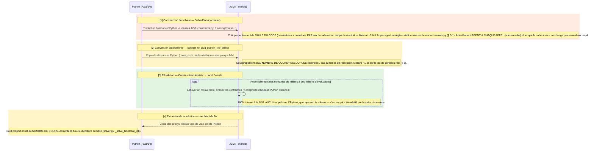
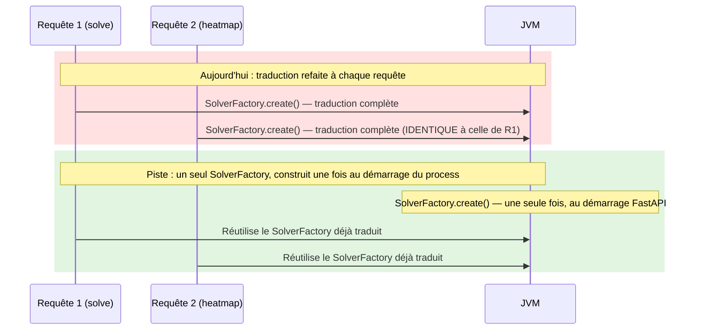
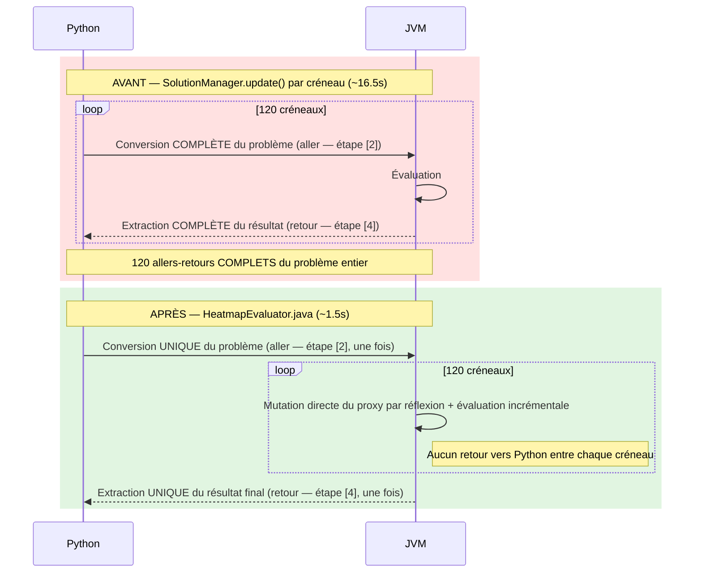

# Optimisation de la Heatmap (Expérimentation Java / Timefold Python)

## 1. Contexte et Objectif
L'interface de placement interactif nécessite de calculer une **Heatmap** (carte de chaleur) indiquant quels créneaux horaires sont compatibles ou conflictuels avec un cours spécifique. L'algorithme simule le placement du cours sur chaque créneau disponible (ex: 120 créneaux) et évalue l'impact sur le score global.

**Problème initial :**
Dans la librairie Timefold Python, la méthode native `SolutionManager.update(problem)` s'assure de maintenir la parfaite synchronisation entre les objets Python et le moteur Java interne via JPype. Bien que très robuste, cette synchronisation a un coût massif. Une simple boucle de 120 itérations en Python prenait **~16,5 secondes**, ce qui est inutilisable pour de l'interactivité en temps réel.

**L'Objectif :**
Contourner le pont Python/Java pour la boucle d'évaluation incrémentale en codant un contrôleur natif en Java (`HeatmapEvaluator.java`) qui manipule directement les objets internes de Timefold, réduisant l'overhead au strict minimum.

---

## 2. Architecture de la Solution

La solution s'appuie sur une interception de la requête au sein de `solver.py` pour rediriger le calcul vers `heatmap_proxy.py`, qui pilote le code Java compilé. 

### A. Le Pattern "Dual-ScoreDirector" (100% Isofonctionnel)
Demander au moteur d'expliquer l'origine exacte d'un conflit (avec `ConstraintMatchPolicy.ENABLED`) consomme énormément de CPU et de mémoire. Pour accélérer le processus, le code Java instancie **deux ScoreDirectors** :
1. **Un "Fast" ScoreDirector** : Parcourt les 120 créneaux sans activer l'analyse des raisons de conflit. C'est lui qui détecte les dégradations de score à une vitesse de l'ordre de quelques millisecondes.
2. **Un "Detailed" ScoreDirector** : N'est appelé en "lazy loading" **que si** le Fast ScoreDirector détecte un score négatif. Il isole alors les raisons métier du conflit (ex: `Teacher conflict`). 

*Note : Cette architecture est strictement isofonctionnelle avec la logique d'origine en Python. En Python, `solution_manager.update()` utilise en sous-marin un moteur rapide, tandis que `solution_manager.explain()` instancie un moteur lourd. Le code Java ne fait que cloner cette optimisation "lazy", prouvant que la comparaison des performances (1,5s vs 16,5s) se fait à algorithme parfaitement équivalent.* 

### B. Manipulation des Proxys JPype
Le domaine métier (ex: `PlanningCourse`) est défini en Python. Timefold génère dynamiquement des coquilles Java ("Proxys") pour représenter ces entités.
Le script `heatmap_proxy.py` récupère les proxys Java des créneaux (via `java_problem.getTimeslots()`) et les transmet au module Java. 
En Java, le changement de créneau est forcé par la réflexion :
```java
setTimeslotMethod.invoke(targetCourse, timeslotProxy);
```
Il est ensuite impératif d'informer manuellement le moteur des changements pour que le flux de contraintes (Bavet) se déclenche de manière incrémentale :
```java
fastScoreDirector.beforeVariableChanged(targetCourse, "timeslot");
// ... application du changement ...
fastScoreDirector.afterVariableChanged(targetCourse, "timeslot");
```

### C. Contournement des classes masquées (Le Parsing du Score)
Une difficulté majeure rencontrée fut l'extraction du score. La méthode `fastScoreDirector.calculateScore()` retourne une classe interne (`InnerScore`) qui n'expose pas publiquement ses méthodes `hardScore()` et `softScore()` à la réflexion Java, provoquant des `NoSuchMethodException`.
**La solution :** Le module Java parse directement la chaîne générée par la méthode `toString()` du score (qui est garantie par le format Timefold, ex: `"-36init/-2hard/0soft"`). Cela évite de dépendre d'interfaces internes instables ou de librairies supplémentaires.

### D. Régression corrigée : cours sans salle invisibles aux contraintes

**Symptôme rapporté** : pour un cours sans salle assignée (`classroom = None`, l'état le plus courant en pratique — la majorité des cours n'ont pas encore de salle avant leur premier passage par le solveur), la Heatmap n'affichait **aucun** impact des préférences de ressources ni des conflits avec des cours déjà placés — grille entièrement neutre, quel que soit le créneau testé.

**Cause** : cette architecture (§ A-C) appelle directement `setWorkingSolution()` puis `calculateScore()` sur les données telles que chargées depuis la base — **sans jamais exécuter la phase de Construction Heuristic (CH)** du solveur (§ 12.A d'`architecture.md`), qui est normalement ce qui assigne une valeur à chaque variable de planification non encore décidée. Un cours dont `classroom` vaut encore `None` reste donc "non initialisé" pendant toute la durée du calcul de la Heatmap. Or Timefold exclut purement et simplement une entité non initialisée des flux `for_each()`/`for_each_unique_pair()` ordinaires (contrairement à `for_each_including_unassigned()`, réservé aux contraintes de type "Overconstrained Planning", § 14 d'`architecture.md`) — **pas seulement pour les contraintes qui s'intéressent à `classroom`, pour TOUTES** (`teacher_conflict`, `division_conflict`, `resource_preference_*`...). Un cours sans salle — qu'il s'agisse du cours ciblé ou d'un AUTRE cours déjà placé avec lequel il pourrait entrer en conflit — devient donc invisible à l'ensemble du moteur de contraintes pour la durée du calcul.

Vérifié directement (`SolutionManager.explain()`, sans passer par le hook Java) : un cours avec `classroom=None` ne déclenche aucun `ConstraintMatch` pour une préférence pourtant définie sur sa division ; la même contrainte redevient visible dès qu'une salle, même arbitraire, lui est assignée.

**Correctif** (`heatmap_proxy.py`, avant l'appel à `convert_to_java_python_like_object`) : tout cours du problème dont `classroom` vaut encore `None` reçoit une salle **virtuelle** (même mécanisme que pour l'épinglage multi-établissement, voir `architecture.md` § 12.E — `id` négatif dérivé de l'id du cours, jamais partagé, jamais dans `classroomRange`). Cette valeur reste identique pendant tout le calcul (score de base et chaque créneau testé) : le bruit qu'elle introduirait entre deux AUTRES cours est donc constant et s'annule déjà dans le delta calculé côté Java — seul compte de rendre les cours visibles au moteur de contraintes, pas la salle précise qui leur est temporairement associée. Purement en mémoire, jamais committé.

---

## 3. Résultats et Performances

- **Temps initial (Boucle Python `SolutionManager.update`)** : ~16.5 secondes.
- **Temps actuel (Java Hook)** : **~1.5 seconde**.

**Gains :**
L'accélération est de l'ordre de **x10**. La vaste majorité du temps de calcul restant (~1.2s) est désormais consommée une seule fois en amont par la fonction `convert_to_java_python_like_object` pour instancier les proxys. La boucle de 120 créneaux en Java pur ne prend quant à elle qu'environ **200 à 300 millisecondes**.

---

## 4. Instructions de Compilation et de Déploiement

Si des modifications sont apportées à `HeatmapEvaluator.java`, le JAR doit être recompilé et injecté dans l'environnement virtuel Python utilisé par FastAPI.

Depuis le répertoire racine du projet, exécuter :

```bash
cd backend/experimental_java_heatmap
# 1. Nettoyer et compiler le projet Maven
./apache-maven-3.9.6/bin/mvn clean package

# 2. Remplacer l'ancien JAR par le nouveau dans les dossiers JPype
cp target/heatmap-1.0-SNAPSHOT.jar ../.venv/lib/python3.12/site-packages/timefold/solver/jars/

# 3. Redémarrer le serveur FastAPI pour que le Classloader JPype prenne en compte la modification.
```

## 5. Perspectives d'Avenir et Limites de l'Hybride

Bien que l'expérimentation soit un succès massif pour la réactivité de l'application, ce code "hybride" reste une solution de contournement (hack).

### Où sont réellement les allers-retours Python/Java ?

> **Correction** : une version antérieure de ce document affirmait que le ScoreDirector Java "invoque l'interpréteur Python en sous-marin pour chaque évaluation, à cause des lambdas". **C'est faux, vérifié empiriquement** (méthode détaillée plus bas) — et ça change la conclusion de ce chapitre.

`ai.timefold.jpyinterpreter` n'est pas un pont qui rappelle Python à chaque appel : c'est un **compilateur** qui traduit le bytecode CPython de `constraints.py` (et des classes `Planning*`) en véritables classes JVM, **une seule fois**, à la construction du solveur (`SolverFactory.create(...)`). Un `lambda` et une fonction `def` équivalente produisent un bytecode CPython **strictement identique** (`dis.dis` le confirme, seul le nom diffère) — le traducteur ne peut donc structurellement pas les traiter différemment. Une fois traduite, la boucle de résolution (Construction Heuristic + Local Search) tourne à 100% dans la JVM, y compris pour évaluer des lambdas Python à l'origine, **sans jamais rappeler CPython** — qu'il y ait 10 ou 10 millions d'évaluations.



**Ce que ce schéma change concrètement** : le volume de contraintes évaluées pendant la résolution ([3], potentiellement énorme) n'a **aucun** coût d'aller-retour — il est structurellement gratuit côté frontière Python/Java. Les seuls coûts réels sont aux étapes [1], [2] et [4], et ils ne dépendent PAS du nombre d'évaluations mais de la taille du code ([1]) et du volume de données ([2], [4]).

**Méthode de vérification** (pas de fichier dédié dans ce repo — script de spike autonome, exécuté contre le `timefold` réel du projet) : une contrainte dont le filtre incrémente un compteur Python global (`CALL_COUNTER["n"] += 1`, un objet Python bien réel, hors de toute classe `@planning_entity`) a été soumise à un solve de 5 secondes sur 30 entités à choix libre. Résultat : `CALL_COUNTER` reste à `0` après le solve — la preuve directe qu'aucune évaluation de contrainte n'exécute réellement du code côté CPython, malgré des milliers de mouvements essayés.

### 5.1 Piste d'optimisation non implémentée : mettre en cache le SolverFactory

Conséquence directe du schéma ci-dessus : l'étape [1] (traduction bytecode, indépendante des données) est **actuellement refaite à chaque appel** — `_get_solver_factory()` (`backend/app/solver/solver.py`) appelle `SolverFactory.create(solver_config)` sans aucun cache, à chaque `_solve_timetable_job()` et à chaque `calculate_course_heatmap()`. Le code source de `constraints.py` ne changeant pas entre deux requêtes dans le même process, cette retraduction est un travail redondant.



**Mesuré directement sur le vrai `constraints.py`** (isolé, `_get_solver_factory()` appelé plusieurs fois dans le même process) :

| Appel | Temps |
|---|---|
| 1er appel (inclut l'échauffement JIT/JVM, payé une seule fois au démarrage du process) | 1.65s |
| 2e appel | 0.61s |
| 3e appel | 0.68s |

**Confirmé par une mesure bout-en-bout réelle**, sur la base de démo fraîchement réinitialisée (`init_db`, jeu d'essai V2 : 2 établissements, 36 cours de premier niveau, 40 profs, 216 créneaux), en appelant directement `calculate_course_heatmap()` — pas un modèle jouet :

| Phase (appel réel, régime stationnaire) | Temps |
|---|---|
| `_build_planning_problem` (Python pur, requêtes DB) | ~0.06-0.10s |
| `SolverFactory.create()` (traduction bytecode) | **~0.6-0.9s** |
| `convert_to_java_python_like_object` (conversion des données, mesurée par le hook Java lui-même) | ~0.06-0.15s |
| Boucle Java (120 créneaux, isofonctionnelle) | ~0.01-0.05s |
| **Total bout-en-bout `calculate_course_heatmap()`** | **~0.6-1.2s** |

Sur ce jeu de données réel, `SolverFactory.create()` domine largement — **5 à 10 fois plus cher que la conversion des données**, pas comparable comme je l'estimais plus haut à partir de la seule mesure isolée. C'est de loin le plus gros poste de la Heatmap une fois la boucle Java en place. Le mettre en cache (le construire une seule fois au démarrage du process FastAPI plutôt qu'à chaque requête) diviserait potentiellement le temps de réponse de la Heatmap par 2 à 5. Aucun changement de code n'a été fait pour cette piste — proposée pour discussion, pas implémentée.

*Nuance* : `SolverFactory.create()` dépend de la taille du CODE (constraintes + domaine), pas du volume de données — son coût est donc à peu près constant quel que soit le nombre de cours. `convert_to_java_python_like_object`, lui, dépend du volume de DONNÉES et grossira avec le nombre de cours/ressources. Sur un établissement bien plus grand que ce jeu de démo, l'écart mesuré ici pourrait se resserrer, voire s'inverser — cette mesure est un point de référence sur les données actuelles, pas une loi universelle.

*Bug découvert en cours de mesure (non corrigé ici, hors périmètre)* : `calculate_course_heatmap()` avec un `school_id` explicite échoue silencieusement (retourne un résultat vide, sans erreur visible) dès qu'une AUTRE école possède un cours sans salle assignée — le mécanisme multi-établissement force ces cours en `is_pinned=True`, un état illégal pour Timefold quand la salle n'est jamais renseignée (`classroom` n'autorise pas l'absence de valeur, contrairement à `timeslot`). Reproduit sur le jeu de démo (15 cours sur 18 sans salle, dans chacune des 2 écoles). Signalé séparément pour correction.

### Pourquoi ne pas écrire les contraintes directement en Java ?

Étant donné que l'évaluation des contraintes ne coûte déjà rien en aller-retour (voir ci-dessus), réécrire `constraints.py` en Java n'apporterait **aucun gain sur ce point précis**. La vraie raison qui justifierait une réécriture complète en Java serait de supprimer les étapes [1], [2] et [4] elles-mêmes : si le modèle de domaine (`Course`, `Teacher`, `Timeslot`) était nativement écrit en Java, il n'y aurait plus de bytecode Python à traduire, ni de proxys à construire/extraire à chaque solve.

**Ce que cela signifierait concrètement :**
Il faudrait adopter une **Architecture Core-Java / Wrapper-Python** :
1. **Domaine en Java :** Recréer les classes `Course.java`, `Teacher.java`, `Timeslot.java` en pur Java avec les annotations `@PlanningEntity`.
2. **Contraintes en Java :** Traduire intégralement `constraints.py` en `TimetableConstraintProvider.java`.
3. **Pont Python :** Côté FastAPI, utiliser JPype pour injecter les données SQLAlchemy directement dans les objets Java, et lancer le solveur Java.

### Conclusion
**Est-ce une bonne idée ?**
- **OUI**, si les étapes [1]/[2]/[4] (traduction + marshaling de données, pas l'évaluation des contraintes) deviennent un vrai goulot mesuré — typiquement à très grande échelle (milliers de cours) où le volume de données à convertir à chaque solve devient significatif.
- **NON** pour "accélérer l'évaluation des contraintes" — ce problème n'existe pas (voir schéma ci-dessus). Et **NON** si l'on souhaite conserver une base de code 100% Python permettant à n'importe quel développeur de modifier les règles métier sans jamais compiler de Java.

La librairie `timefold-solver-python` a été créée précisément pour éviter d'avoir à faire du Java, et le fait que l'évaluation des contraintes soit déjà 100% native JVM (sans round-trip) confirme qu'elle atteint son objectif. Cette expérimentation (le Dual-ScoreDirector en Java pilotant des proxys Python) reste donc **le meilleur compromis** pour le cas d'usage réel où un coût existe : la conversion répétée de tout le problème lors d'une boucle Python (`SolutionManager.update()` × 120, voir § 3), pas l'évaluation des contraintes elle-même.

## 6. FAQ : Pourquoi ne pas réécrire `_solve_timetable_job` en Java ?

On pourrait logiquement se demander : *si la Heatmap a gagné un facteur x10 en migrant la boucle en Java, obtiendrait-on les mêmes gains monumentaux en déplaçant la fonction de résolution globale (`_solve_timetable_job` / `solver.solve()`) en Java natif ?*

La réponse est **NON** (le gain direct serait de 0%). 

Voici pourquoi la situation est fondamentalement différente de celle de la Heatmap :

**Le défaut de la Heatmap d'origine :**
L'ancienne Heatmap Python exécutait une boucle (`for ts in timeslots`) et appelait `SolutionManager.update(problem)` 120 fois. Cette fonction spécifique force le pont JPype à rescanner et resynchroniser l'intégralité du planning (tous les cours, toutes les salles) depuis Python vers Java à **chaque tour de boucle**. C'est ce travail de traduction massif et répété qui prenait 16 secondes. Notre `HeatmapEvaluator` Java a fait sauter cette étape en effectuant de la mutation locale incrémentale.



Le gain x10 ne vient donc pas d'avoir "évité des lambdas" — il vient d'avoir réduit 120 allers-retours complets (étapes [2]+[4] répétées) à un seul aller-retour, en gardant toute la boucle de mutation/évaluation côté JVM.

**Le fonctionnement de `solver.solve()` :**
Lorsque l'on appelle `solver.solve(problem)` depuis Python, la librairie confie immédiatement le contrôle total au moteur Java interne de Timefold. Toute la boucle de résolution (les milliers d'itérations, la recherche locale, les mouvements) **tourne déjà de manière 100% atomique et incrémentale à l'intérieur de la JVM**, exactement comme la boucle de notre Heatmap expérimentale — `solver.solve()` ne fait déjà QU'UN SEUL aller-retour (conversion en entrée, étape [2] ; extraction en sortie, étape [4]), jamais 120 comme l'ancienne Heatmap.

**Le véritable goulot d'étranglement de la résolution globale :**
Ce ne sont PAS les contraintes (`constraints.py`) : elles sont traduites en bytecode JVM une fois pour toutes à la construction du solveur, puis évaluées nativement dans la JVM sans jamais rappeler l'interpréteur Python — voir la vérification empirique au § 5. Le coût réel de `solver.solve()` se limite à ses DEUX allers-retours complets, déjà minimaux (un en entrée, un en sortie) — il n'y a pas de boucle de 120 conversions à supprimer ici, contrairement à l'ancienne Heatmap.

Déplacer l'appel `solver.solve()` du côté Java ne changerait donc rien : il n'y a pas de travail répété à éliminer sur ce chemin, l'architecture actuelle y est déjà optimale. Seule la migration complète du modèle de domaine en Java (§ 5) réduirait encore le coût des deux allers-retours restants (en le faisant disparaître), mais pour du gain sur la conversion de données, pas sur l'évaluation des contraintes.
