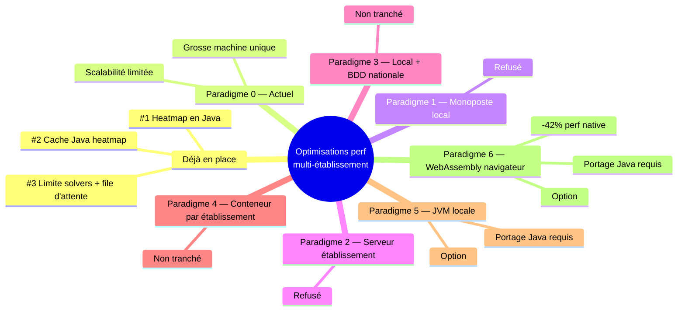

# Idées d'optimisation — hébergement multi-établissement

Document de réflexion : comment faire tenir Klepsydrix à l'échelle d'un grand nombre
d'établissements sans que la contention de ressources (CPU/RAM, en particulier pour le solveur
Timefold) ne devienne un problème. Les décisions ici ne sont **pas tranchées** sauf mention
explicite — c'est un inventaire de pistes, pas une feuille de route engagée.

## 1. Optimisations déjà en place

Dans le paradigme actuel (client-serveur, tous les calculs sur le serveur) :

| # | Optimisation | Statut |
|---|---|---|
| 1 | Heatmap calculée en Java (pas en Python pur) | ✅ Faite |
| 2 | Cache Java pour la heatmap | ✅ Faite |
| 3 | Nombre de résolutions Timefold limité (résolution d'EDT, pas la heatmap) + file d'attente | ✅ Faite — voir `architecture.md` §9.G |

## 2. Pistes pour le futur — vue d'ensemble (mindmap)

## 3. Comparatif des paradigmes

| Paradigme | Poste utilisateur | Serveur | Avantages | Inconvénients | Décision |
|---|---|---|---|---|---|
| **0 — Actuel** (très grosse machine) | Navigateur web uniquement | Une seule instance API/BDD/Java | — | Scalabilité très limitée → peu de threads parallèles disponibles pour le solveur | En place |
| **1 — Monoposte local** | BDD, API, solveur | Néant | Pas besoin d'optimisation pour un grand volume d'établissements | Installation à gérer par l'utilisateur ; pas de backup des données ; partage de la base de données comme un fichier bureautique ; pas de travail collaboratif entre les différents constructeurs d'emploi du temps au sein d'un établissement ; pas de publication | **Refusé** |
| **2 — Serveur d'établissement** | Navigateur web uniquement | BDD, API, solveur | Pas besoin d'optimisation pour un grand volume d'établissements ; travail collaboratif entre constructeurs d'EDT possible au sein d'un établissement | Installation/administration gérée par l'établissement ; pas de backup des données | **Refusé** |
| **3 — Local + BDD nationale partagée** | API, solveur | Base de données (accès brut) | Contention de ressources limitée au driver de la base de données | Installation gérée par l'utilisateur ; nécessite une autre instance de l'application pour la consultation | Non tranché |
| **4 — Conteneur par établissement** | Navigateur web uniquement | Un container/VM par établissement, géré de manière centralisée | *(non détaillé)* | *(non détaillé)* | Non tranché |
| **5 — JVM locale** (option) | Une JVM + le solveur | BDD, API | Contention de ressources limitée à l'API/BDD | Installation de la JVM et du solver Java gérée par l'utilisateur | Non tranché — voir prérequis §4.1 |
| **6 — WebAssembly navigateur** (option) | Le solveur dans le bac à sable WASM du navigateur | BDD, API | Contention de ressources limitée à l'API/BDD | Transparent pour  l'utilisateur qui n'a aucune installation à gérer | Non tranché — voir prérequis §4.2 |

## 4. Détail des paradigmes à prérequis (5 et 6)

### 4.1. Paradigme 5 — Déport du solveur seul dans une JVM locale

**Prérequis** :
- Créer un mini-serveur Java dédié qui expose une interface REST/JSON.
- Intégrer aux paramètres globaux de l'application un choix entre « calcul serveur » et
  « calcul JVM locale ».
- Portage/traduction en Java des fichiers `constraints.py` et `solver.py`.

**⚠️ Points d'attention** :
- Le coût des étapes de (dé)sérialisation JSON pourrait être significatif — **à objectiver**
  avant de trancher (mesurer, pas supposer).
- Afin de ne pas « payer » ce coût de sérialisation **lorsque le calcul est fait sur le
  serveur** : le serveur Java dédié n'est alors PAS utilisé — on continue d'utiliser le
  pontage Python/Java existant. Cependant, `constraints.py` n'est plus maintenu en double
  techno (Python ET Java) — seulement en Java. Le point de connexion Python/Java est déplacé : Python construit directement le dict des données du problème (celui qui serait sérialisé en JSON si le serveur dédié était utilisé) et le transmet directement au pontage Python/Java,  sans passer par une sérialisation JSON dans ce cas précis.

### 4.2. Paradigme 6 — Déport du solveur seul dans un module WebAssembly local

**Prérequis** :
- Portage/traduction en Java de `constraints.py` et `solver.py` — nécessaire car la
  compilation doit être **statique** pour être compilable avec GraalVM Web Image.
- Compiler ce code Java (+ moteur Timefold) en module WebAssembly (`.wasm`) via GraalVM Web
  Image. **Pas de mini-serveur REST/JSON ici** (contrairement au Paradigme 5) : le module
  `.wasm` n'est pas un process séparé, il est chargé directement dans l'onglet du navigateur,
  dans le même contexte JS que le reste du frontend — le JS appelle ses fonctions exportées en
  local, sans réseau, sans port, sans HTTP.
- Intégrer aux paramètres globaux de l'application un choix entre « calcul serveur » et
  « calcul WebAssembly dans le navigateur ».

**⚠️ Points d'attention** :
- La compilation « native » induit une perte mesurée de **~42 % de la performance de calcul
  brute** de Timefold (source : [How to speed up Timefold Solver Startup Time by 20x with
  native images](https://timefold.ai/blog/how-to-speed-up-timefold-solver-startup-time-by-20x-with-native-images)).
- **Deux frontières de transfert de données distinctes, pas une seule** — à ne pas confondre :
  1. **Serveur Python → navigateur** : un vrai aller-retour réseau (le problème vit en base
     côté serveur) — coût de sérialisation incompressible, quel que soit le mode de calcul
     choisi ensuite. **Voir le paragraphe 5** : minimisation des aller-retour serveur pour la heatmap.
  2. **JS du navigateur → module WASM** : **pas d'aller-retour réseau** (même onglet, même  process) — mais pas gratuit pour autant. La frontière WASM↔JS ne sait faire passer que des types numériques (`i32`/`i64`/`f32`/`f64`) : impossible de passer un objet JS complexe directement à une fonction WASM. Toute donnée structurée (le problème de planning) doit être encodée en octets et copiée dans la mémoire linéaire du module, qui ne reçoit qu'un pointeur + une longueur. Le coût réseau disparaît, pas le coût de marshalling — même s'il peut être bien moins cher que du JSON texte (encodage binaire compact possible), et pas nécessairement automatisé aujourd'hui pour un module produit par GraalVM Web Image  (technologie encore expérimentale, voir plus haut).

**Pour les calculs côté serveur :**
- **OPTION 1 : comme pour le paradigme 5, on continue d'utiliser le pontage Python/Java existant.**
 `constraints.py` n'est maintenu qu'en Java (pas en double techno). Le point de connexion Python/Java est déplacé : Python construit directement le dictionnaire des données du problème (celui qui serait sérialisé si le serveur dédié était utilisé) et le transmet directement au pontage Python/Java.
	* Avantage : Gain du temps de sérialisation, pas de serveur java
	* Inconvénient : La JVM est dans un thread du processus système de Klepsydrix, donc partage les mêmes ressources système. Si timefold plante, tout plante (à vérifier) 
		
- **OPTION 2 : exposer le code java au travers de deux interface et de deux modes de compilation différents (double stack) :**
	* A/ Pour le clacul local : code java exposé au travers de fonctions compatibles wasm et compilé en web-native avec GraalVM
	* B/ Pour le calcul server : code java exposé au travers d'une interface gRPC et compilé pour la JVM classique (pas de perte de 42% de performance de calcul liée à webnative) 
	
Comparaison :
  * Avantage : ça permettrait d'isoler Timefold dans un processus système séparé, et donc de réserver formellement des ressources CPU/RAM pour l'API, et de préserver le serveur API si timefold plante. Par ailleurs, gRPC utilise Protocol Buffers (au lieu de JSON pour une API REST classique), et permet du streaming bidirectionel (le service Java pourrait pousser la progression au python).
  * Inconvénient : Deux fichiers d'interface à gérer, et double compilation java à chaque modification du solver.

**Étape pour mettre en place ce paradigme 6** :
1. **Chantier préalable de réorganisation du code et traduction des contraintes en java :**
  1.1 S'assurer que les tests unitaire de constriant.py et solver.py sont robustes et totalement couvrants. Les compléter si nécessaire.
  1.2 Traduire contraint.py en contraint.java et solver.py en solver.java. Exécuter tous les tests unitaires pour s'assurer de la non régression lors dde la traduction Python > Java. **Point à clarifier : peut-on garder tous les tests unitaires côté python ou faut-il en recoder une partie en java (ne agrder que les tests d'intégration côté Python), et si oui pour quel coût en temps lors de la modif du code java ?**
  1.3 Adapter solver.py pour qu'il soit réduit à construire le dictionnaire du problème et à appeler le solveur Java (en local), et à écrire les résultats en base, et à faire passe-plat vers le solver.java pour les fonctions stop / step...
  1.4 S'assurer que tout fonctionne correctement.
2. **Chantier d'implémentation de l'option 1 : solving local wasm**
  2.1 Dans la classe Global settings du backend, ajouter un attribut qui permet de choisir si le solving se fait en local (wasm dans le navigateur) ou sur le serveur.
  2.2 Dans le frontend, créer une couche d'abstration qui gère le choix de l'utilisateur et appelle le solveur local ou le solveur serveur. Conformément au chapitre 5, si le solving se fait en local, et que l'on souhaite calculer la heatmap, le frontend construit lui-même le dictionnaire du problème. Sinon, il demande au serveur le dictionnaire du problème.
  2.3 Ajouter un mécanisme qui permet au frontend de recharger le module wasm s'il a évoluer (gérer un hash ou un numéro de version du module wasm)
  2.4 Ajouter au code java l'interface pour wasm.
  2.5 Compiler le code java en wasm en utilisant graalvm
  2.6 Tester le solving en local et coder un test Playright qui vérifie que les deux modes de calcul (local ou serveur) fonctionnent.
  2.7 Calculer et documenter le **gain** de temps de réponse de bout en bout pour la heatmap entre le solving serveur et le solving local via un ensemble de test Playright (moyenne des gains sur 20 répétitions).
3. **Chantier d'extention à l'option 2 : solving server avec mini-serveur gRPC**
  3.1 Ajouter au code java l'interface gRPC.
  3.2 Adapter solver.py pour qu'il appelle le solver java via gRPC (au lieu de l'appeler via le pontage Python/Java existant).
  3.3 Ajouter un mécanisme qui permet au solver Java de pousser la progression du calcul au solver.py.
  3.4 Compiler le code java en .jar de façon optimale pour la JVM.
  3.5 Adapter le script start_services.sh pour qu'il lance le server java.
  3.6 Tester le solving en utilisant le mini-serveur java. Les tests python existant permettent déjà de garantir la non régression.
  3.7 Garantir des ressources CPU/RAM au processus sytème Pyhton qui porte l'API.
  3.8 Calculer et documenter la **perte** de temps de réponse de bout en bout pour la heatmap entre le solving serveur via gRPC et le solving serveur via le pontage Python/Java existant (moyenne des gains sur 20 répétitions). Faire la mesure dans le code Python.

## 5. Notes transversales aux paradigmes 5 et 6

**Obtention des données selon le type de calcul, quand celui-ci est fait en local** (sur le poste
 de l'utilisateur (dans un JVM local pour le paradigme 5 et dans un le navigateur pour le paradigme 6) :
- **Heatmap** : le résultat doit être quasi-instantané → le navigateur construit le
  dictionnaire du problème à partir de son store local, avec un petit risque que la donnée en
  cache ne soit pas la plus fraîche.
- **Résolution automatique globale de l'emploi du temps** (placement automatique, affectation
  des salles, optimisation globale) : le navigateur demande les données au serveur, et passe
  en mode exclusif pour une durée pré-établie — si le navigateur plante, la sortie du mode
  exclusif se fait automatiquement à la date prévue.

## 6. Option concernant la gestion de l'API/BDD

Au-delà de la problématique du solver Timefold, si un très grand nombre d'établissements (une dizaine ou plus) utilise Klepsydrix, la performance de l'API et de la BDD pourrait devenir un facteur limitant.

Ces trois options sont mutuellement exclusives (on choisit l'une des trois, pas une combinaison).

* Option 1 : créer N instances du serveur Klepsydrix (API+Postgres+Timefold) et distribuer les établissements entre ces instances (un établissement va toujours vers la même instance, qu'il partage avec d'autres établissements). La gestion du multi-établissement se ferait donc au niveau infrastructure (sous-domaine > load balancer > instances).

* Option 2 : créer N instances de l'application Python (API+Timefold), avec un serveur Postgres unique partagé (un établissement n'est pas toujours redirigé vers la même instance).

* Option 3 : créer N instances de l'application Python (API+Timefold), toutes partagées par tous les établissements, mais avec :
  - UN serveur Postgres en écriture qui réplique les données sur un pool de Y serveurs Postgres en lecture.
  - les instances applicatives Python routent les requêtes en écriture vers le serveur Postgres en écriture et les requêtes en lecture vers le pool de serveurs Postgres en lecture.
  - **Mécanisme concret** : réplication physique **native de PostgreSQL** (« streaming replication »,
    basée sur le WAL), asynchrone par défaut (petit risque de lecture légèrement périmée) ou
    synchrone (cohérence stricte lecture-après-écriture, au prix de latence). Ce n'est pas une
    techno propre à Odoo — Odoo 19 (2025) a seulement ajouté un **routage applicatif** par-dessus
    cette réplication standard (paramètre `read_only=True` sur les contrôleurs web, décorateur
    `@api.readonly` sur les méthodes de modèle, retombée automatique sur le primaire si une écriture
    est tentée dans une transaction censée être en lecture seule — chaque appel HTTP/RPC reste une
    transaction unique, jamais scindée entre primaire et réplica). Pour Klepsydrix, le même patron
    serait transposable au niveau des endpoints génériques : choisir l'engine SQLAlchemy (primaire
    ou pool de lecture) selon que l'endpoint est un `GET` ou un `POST`/`PUT`/`DELETE`. Voir [Odoo 19 —
    lecture sur réplicas](https://oduist.com/blog/odoo-experience-2025-ai-summaries-2/355-multiple-postgresql-servers-behind-odoo-356)
    et [réplication en streaming PostgreSQL](https://www.postgresql.fastware.com/postgresql-insider-ha-str-rep).
    (Historique : les index Hash n'étaient pas journalisés dans le WAL avant PostgreSQL 10, rendant
    la réplication en streaming incompatible avec leur usage — voir
    [odoo/odoo#5](https://github.com/odoo/odoo/issues/5) — résolu depuis 2017.)

**⚠️ Point d'attention** (concerne les Options 2 et 3 — aucune des deux ne garantit qu'un
  établissement reste toujours sur la même instance, contrairement à l'Option 1) : l'état d'une
  résolution Timefold en cours (statut, score, position dans la file d'attente — `SolverState`,
  `_SOLVE_SEMAPHORE`) vit aujourd'hui **en mémoire, dans le process Python qui a démarré la
  résolution**, contrairement à `exclusive_mode_state` qui, lui, vit en base — limite déjà assumée
  et documentée (voir [architecture.md](architecture.md) §16.C « `SolverState` par base »). Avec
  plusieurs instances Python derrière un même établissement, un `GET /api/timetable/status` qui
  atterrit sur une instance différente de celle qui a démarré la résolution verrait un état
  incorrect (`NOT_SOLVING` au lieu de `SOLVING`/`QUEUED`). Ces options supposent donc soit un
  routage « collant » par établissement (une base toujours dirigée vers la même instance — ce qui
  réduit l'élasticité réelle de la répartition de charge à un simple partitionnement statique),
  soit de déplacer `SolverState` en base de données, sur le même modèle qu'`exclusive_mode_state`.