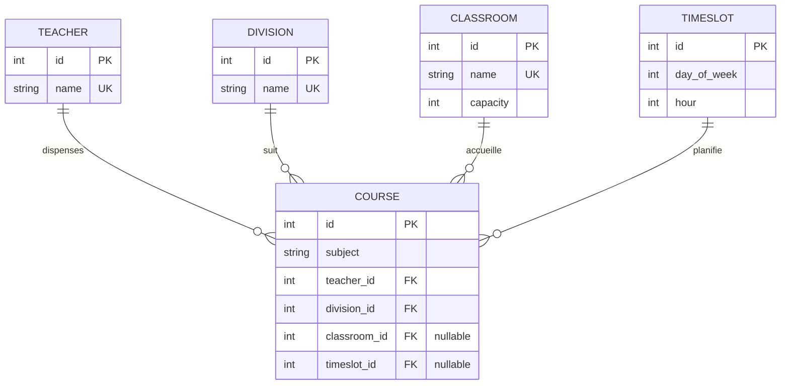

# Modèle de Données : Klepsydrix V1

Ce document spécifie le schéma relationnel physique de la base de données SQLite/PostgreSQL et la correspondance avec les modèles ORM de la tranche verticale V1.

---

## 1. Schéma Relationnel et Tables

Le schéma relationnel comporte 5 tables principales. Les relations clés étrangères garantissent la cohérence des jointures.

---

## 2. Description des Tables et Attributs

### A. Table `teachers` (Enseignants)
Représente les professeurs dispensant des enseignements.
- `id` : `INTEGER` | Clé Primaire (Auto-incrémentée).
- `name` : `VARCHAR(100)` | Non nul, unique (ex: "M. Martin").

### B. Table `classrooms` (Salles de classe)
Représente les espaces physiques d'enseignement.
- `id` : `INTEGER` | Clé Primaire (Auto-incrémentée).
- `name` : `VARCHAR(50)` | Non nul, unique (ex: "Salle 104").
- `capacity` : `INTEGER` | Non nul, capacité d'accueil par défaut de 35.

### C. Table `divisions` (Classes d'élèves)
Représente les groupes d'élèves homogènes.
- `id` : `INTEGER` | Clé Primaire (Auto-incrémentée).
- `name` : `VARCHAR(50)` | Non nul, unique (ex: "6ème A", "3ème B").

### D. Table `timeslots` (Créneaux temporels)
Représente les séquences horaires uniformes d'une heure sur la semaine scolaire (du lundi au samedi).
- `id` : `INTEGER` | Clé Primaire (Auto-incrémentée).
- `day_of_week` : `INTEGER` | Non nul, index du jour de la semaine (1 = Lundi, 6 = Samedi).
- `hour` : `INTEGER` | Non nul, heure de début du cours (comprise entre 8 et 17 pour représenter les créneaux de 8h à 18h).
- *Contrainte d'Unicité* : Un index unique composé est posé sur `(day_of_week, hour)`.

### E. Table `courses` (Cours à planifier)
Représente l'association structurée d'un enseignement. C'est l'entité de planification.
- `id` : `INTEGER` | Clé Primaire (Auto-incrémentée).
- `subject` : `VARCHAR(100)` | Non nul, nom de la matière (ex: "Mathématiques").
- `teacher_id` : `INTEGER` | Non nul, Clé Étrangère référençant `teachers(id)`.
- `division_id` : `INTEGER` | Non nul, Clé Étrangère référençant `divisions(id)`.
- `classroom_id` : `INTEGER` | Nullable, Clé Étrangère référençant `classrooms(id)`. Un cours non encore affecté à une salle porte la valeur `NULL`.
- `timeslot_id` : `INTEGER` | Nullable, Clé Étrangère référençant `timeslots(id)`. Un cours non encore planifié (dans le panneau latéral) porte la valeur `NULL`.

---

## 3. Règles de Validation & Contraintes ORM

- **Intégrité Référentielle (SQLAlchemy)** :
  - La suppression d'un enseignant (`teacher`), d'une salle (`classroom`) ou d'une division (`division`) doit être interdite (`RESTRICT` ou `NO ACTION`) si des cours y sont rattachés, pour éviter des données orphelines.
- **Validation Pydantic** :
  - La longueur du champ `name` pour les enseignants et salles doit être comprise entre 2 et 100 caractères.
  - La capacité d'une salle doit être strictement supérieure à 0.
  - Le `day_of_week` doit être un entier compris strictement entre 1 (lundi) et 6 (samedi).
  - L'heure `hour` doit être comprise entre 8 et 17.

---

## 4. États de Planification d'un Cours

Un cours (`Course`) peut transiter entre deux états principaux :
1. **Non Placé** (`timeslot_id IS NULL` et `classroom_id IS NULL`) : Le cours figure dans la barre latérale "Cours à planifier".
2. **Placé** (`timeslot_id IS NOT NULL` et `classroom_id IS NOT NULL`) : Le cours est positionné sur la grille horaire dans un créneau et une salle spécifiques.

*Note : La transition s'effectue soit de manière automatique via le solveur (qui attribue des valeurs non nulles), soit par glisser-déposer manuel de l'utilisateur.*
