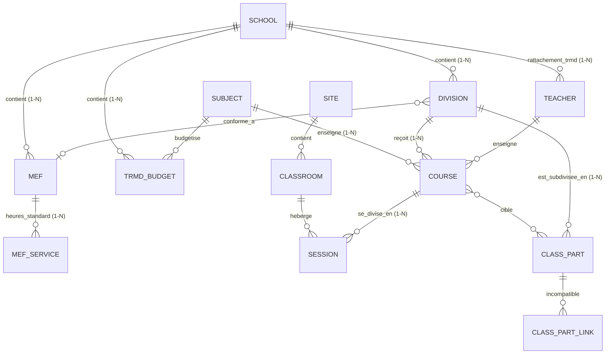

# Évolution du Modèle de Données et Schéma de Migration (V2)

Ce document décrit le schéma relationnel SQLite de Klepsydrix en version 2 (V2) et détaille le plan de migration pour passer de la structure V1 à la V2 sans perte de données.

---

## 1. Schéma Relationnel SQLite Évolué

La base de données SQLite `timetable.db` intègre désormais le cloisonnement multi-établissement (Cité Scolaire), le découpage des cours en séances physiques multiples, et la gestion des vœux et des incompatibilités de groupes.



---

## 2. Plan de Migration : Passage de V1 à V2

Pour faire évoluer la base de données SQLite `timetable.db` de la V1 vers la V2 sans altérer le jeu d'essai ni perturber le code existant, nous mettons en œuvre une migration SQL séquentielle et transactionnelle.

### Étape 1 : Création des nouvelles tables de base
1. **`schools`** :
   ```sql
   CREATE TABLE schools (
       id INTEGER PRIMARY KEY AUTOINCREMENT,
       uai VARCHAR(8) UNIQUE NOT NULL, -- Code UAI unique
       name VARCHAR(100) NOT NULL,
       type VARCHAR(30) NOT NULL, -- COLLEGE, LYCEE, LYCEE_PRO, AUTRE
       city VARCHAR(100) NOT NULL,
       postal_code VARCHAR(10) NOT NULL, -- Code postal requis
       standard_timeslot_duration INTEGER NOT NULL DEFAULT 30 -- En minutes
   );
   ```

2. **`disciplines`** (Disciplines nationales pour STSWEB et TRMD) :
   ```sql
   CREATE TABLE disciplines (
       id INTEGER PRIMARY KEY AUTOINCREMENT,
       code VARCHAR(10) UNIQUE NOT NULL, -- ex: 'L0100' (Maths), 'L1400' (Techno)
       name VARCHAR(100) NOT NULL
   );
   ```

3. **`families`** (Regroupements transversaux de ressources) :
   ```sql
   CREATE TABLE families (
       id INTEGER PRIMARY KEY AUTOINCREMENT,
       code VARCHAR(20) UNIQUE NOT NULL, -- ex: 'SCIENCES', 'LANGUES'
       name VARCHAR(100) NOT NULL,
       resource_type VARCHAR(20) NOT NULL -- 'Subject', 'Course', 'Teacher', 'Classroom'
   );
   ```

4. **`subjects`** (Matières avec Disciplines et Familles) :
   ```sql
   CREATE TABLE subjects (
       id INTEGER PRIMARY KEY AUTOINCREMENT,
       code VARCHAR(15) UNIQUE NOT NULL, -- ex: 'MATHS', 'SVT'
       code_nomenclature VARCHAR(20) UNIQUE NOT NULL, -- ex: '006600'
       short_label VARCHAR(30) NOT NULL,
       long_label VARCHAR(100) NOT NULL,
       color VARCHAR(7) NOT NULL DEFAULT '#CCCCCC',
       is_etp BOOLEAN NOT NULL DEFAULT 1,
       is_specialty BOOLEAN NOT NULL DEFAULT 0,
       pedagogic_weight FLOAT NOT NULL DEFAULT 1.0, -- Nouveau : poids pédagogique pour répartition
       discipline_id INTEGER NOT NULL,
       family_id INTEGER,
       FOREIGN KEY (discipline_id) REFERENCES disciplines(id) ON DELETE RESTRICT,
       FOREIGN KEY (family_id) REFERENCES families(id) ON DELETE SET NULL
   );
   ```

5. **`mefs`** & **`mef_services`** (Gabarits d'heures par MEF) :
   ```sql
   CREATE TABLE mefs (
       id INTEGER PRIMARY KEY AUTOINCREMENT,
       school_id INTEGER NOT NULL,
       code_national VARCHAR(11) UNIQUE NOT NULL,
       label VARCHAR(100) NOT NULL,
       forecast_student_count INTEGER NOT NULL DEFAULT 0, -- Effectif prévisionnel
       max_students_per_class INTEGER NOT NULL DEFAULT 30, -- Limite d'élèves par division
       FOREIGN KEY (school_id) REFERENCES schools(id) ON DELETE CASCADE
   );

   CREATE TABLE mef_services (
       id INTEGER PRIMARY KEY AUTOINCREMENT,
       mef_id INTEGER NOT NULL,
       subject_id INTEGER NOT NULL,
       weekly_hours FLOAT NOT NULL DEFAULT 0.0,
       FOREIGN KEY (mef_id) REFERENCES mefs(id) ON DELETE CASCADE,
       FOREIGN KEY (subject_id) REFERENCES subjects(id) ON DELETE CASCADE
   );
   ```

6. **`trmd_budgets`** (Budgets alloués par Discipline) :
   ```sql
    CREATE TABLE trmd_budgets (
        id INTEGER PRIMARY KEY AUTOINCREMENT,
        school_id INTEGER NOT NULL,
        discipline_id INTEGER NOT NULL,
        allocated_hp FLOAT NOT NULL DEFAULT 0.0, -- Heures Postes
        allocated_hsa FLOAT NOT NULL DEFAULT 0.0, -- Heures Supplémentaires Annuelles
        allocated_posts FLOAT NOT NULL DEFAULT 0.0, -- ETP
        UNIQUE(school_id, discipline_id),
        FOREIGN KEY (school_id) REFERENCES schools(id) ON DELETE CASCADE,
        FOREIGN KEY (discipline_id) REFERENCES disciplines(id) ON DELETE CASCADE
    );
   ```

7. **`materials`** (Équipements et ressources réservables) :
   ```sql
   CREATE TABLE materials (
       id INTEGER PRIMARY KEY AUTOINCREMENT,
       code VARCHAR(20) UNIQUE NOT NULL, -- ex: 'KIT_IPAD'
       name VARCHAR(100) NOT NULL,
       quantity INTEGER NOT NULL DEFAULT 1
   );
   ```

8. **`missions`** (Missions complémentaires, PP, décharges) :
   ```sql
   CREATE TABLE missions (
       id INTEGER PRIMARY KEY AUTOINCREMENT,
       code VARCHAR(10) UNIQUE NOT NULL, -- ex: 'PP', 'COORD_MAT'
       name VARCHAR(100) NOT NULL,
       hours_allowance FLOAT NOT NULL DEFAULT 0.0
   );
   ```

9. **`election_methods`** (Modalités d'élection réglementaires) :
   ```sql
   CREATE TABLE election_methods (
       id INTEGER PRIMARY KEY AUTOINCREMENT,
       code VARCHAR(10) UNIQUE NOT NULL, -- ex: 'CG', 'DNL'
       name VARCHAR(100) NOT NULL,
       export_code VARCHAR(20) NOT NULL
   );
   ```

10. **`partitions`**, **`class_parts`** & **`class_part_links`** (Groupes & Incompatibilités) :
   ```sql
   CREATE TABLE partitions (
       id INTEGER PRIMARY KEY AUTOINCREMENT,
       code VARCHAR(20) NOT NULL,
       name VARCHAR(100) NOT NULL,
       division_id INTEGER NOT NULL,
       FOREIGN KEY (division_id) REFERENCES divisions(id) ON DELETE CASCADE
   );

   CREATE TABLE class_parts (
       id INTEGER PRIMARY KEY AUTOINCREMENT,
       division_id INTEGER NOT NULL,
       partition_id INTEGER NOT NULL,
       code VARCHAR(30) UNIQUE NOT NULL, -- ex: '6A_G1'
       name VARCHAR(50) NOT NULL,
       student_count INTEGER NOT NULL DEFAULT 0,
       color VARCHAR(7) NOT NULL DEFAULT '#CCCCCC', -- ex: '#E3A857'
       FOREIGN KEY (division_id) REFERENCES divisions(id) ON DELETE CASCADE,
       FOREIGN KEY (partition_id) REFERENCES partitions(id) ON DELETE CASCADE
   );

   CREATE TABLE class_part_links (
       id INTEGER PRIMARY KEY AUTOINCREMENT,
       class_part_a_id INTEGER NOT NULL,
       class_part_b_id INTEGER NOT NULL,
       link_type VARCHAR(20) NOT NULL, -- 'CoPlaned' ou 'Excluded'
       is_system_generated BOOLEAN NOT NULL DEFAULT 1,
       UNIQUE(class_part_a_id, class_part_b_id),
       CHECK(class_part_a_id < class_part_b_id),
       FOREIGN KEY (class_part_a_id) REFERENCES class_parts(id) ON DELETE CASCADE,
       FOREIGN KEY (class_part_b_id) REFERENCES class_parts(id) ON DELETE CASCADE
   );

   CREATE TABLE groups (
       id INTEGER PRIMARY KEY AUTOINCREMENT,
       code VARCHAR(20) UNIQUE NOT NULL, -- ex: 'GERMAN_LV2'
       name VARCHAR(100) NOT NULL,
       student_count INTEGER NOT NULL DEFAULT 0,
       color VARCHAR(7) NOT NULL DEFAULT '#CCCCCC', -- ex: '#9B59B6'
       is_variable_size BOOLEAN NOT NULL DEFAULT 0
   );

   CREATE TABLE group_class_parts (
       group_id INTEGER NOT NULL,
       class_part_id INTEGER NOT NULL,
       PRIMARY KEY (group_id, class_part_id),
       FOREIGN KEY (group_id) REFERENCES groups(id) ON DELETE CASCADE,
       FOREIGN KEY (class_part_id) REFERENCES class_parts(id) ON DELETE CASCADE
   );
   ```

6. **`periods`** (Découpages temporels calendaires) :
   ```sql
   CREATE TABLE periods (
       id INTEGER PRIMARY KEY AUTOINCREMENT,
       code VARCHAR(10) UNIQUE NOT NULL, -- ex: 'T1', 'T2', 'S1'
       name VARCHAR(100) NOT NULL, -- ex: 'Trimestre 1', 'Semaire 1'
       start_date DATE NOT NULL,
       end_date DATE NOT NULL
   );
   ```

6bis. **`alternations`** (Alternances cycliques d'application) :
   ```sql
   CREATE TABLE alternations (
       id INTEGER PRIMARY KEY AUTOINCREMENT,
       code VARCHAR(10) UNIQUE NOT NULL, -- ex: 'WEEK_A', 'WEEK_B'
       name VARCHAR(100) NOT NULL, -- ex: 'Semaine A', 'Semaine B', 'Hebdomadaire'
       color VARCHAR(7) -- ex: '#FFA500'
   );
   ```

7. **`sites`** & **`site_travel_times`** (Modélisation des Campus et des Temps de Trajet) :
   ```sql
   CREATE TABLE sites (
       id INTEGER PRIMARY KEY AUTOINCREMENT,
       code VARCHAR(10) UNIQUE NOT NULL, -- ex: 'SUD', 'NORD'
       name VARCHAR(100) NOT NULL
   );

   CREATE TABLE site_travel_times (
       id INTEGER PRIMARY KEY AUTOINCREMENT,
       from_site_id INTEGER NOT NULL,
       to_site_id INTEGER NOT NULL,
       duration_minutes INTEGER NOT NULL DEFAULT 15,
       UNIQUE(from_site_id, to_site_id),
       FOREIGN KEY (from_site_id) REFERENCES sites(id) ON DELETE CASCADE,
       FOREIGN KEY (to_site_id) REFERENCES sites(id) ON DELETE CASCADE
   );
   ```

8. **`resource_preferences`** & **`preference_periods`** (Vœux tricolores et Liaison Périodes) :
   ```sql
   CREATE TABLE resource_preferences (
       id INTEGER PRIMARY KEY AUTOINCREMENT,
       resource_type VARCHAR(30) NOT NULL, -- 'Teacher', 'Classroom', 'Division', 'Subject', 'Group', 'Material'
       resource_id INTEGER NOT NULL,
       timeslot_id INTEGER NOT NULL,
       preference_level VARCHAR(15) NOT NULL, -- 'Unsuited', 'Undesirable', 'Preferred', 'Neutral'
       UNIQUE(resource_type, resource_id, timeslot_id),
       FOREIGN KEY (timeslot_id) REFERENCES timeslots(id) ON DELETE CASCADE
   );

   CREATE TABLE preference_periods (
       preference_id INTEGER NOT NULL,
       period_id INTEGER NOT NULL,
       PRIMARY KEY (preference_id, period_id),
       FOREIGN KEY (preference_id) REFERENCES resource_preferences(id) ON DELETE CASCADE,
       FOREIGN KEY (period_id) REFERENCES periods(id) ON DELETE CASCADE
   );

   CREATE TABLE preference_alternations (
       preference_id INTEGER NOT NULL,
       alternation_id INTEGER NOT NULL,
       PRIMARY KEY (preference_id, alternation_id),
       FOREIGN KEY (preference_id) REFERENCES resource_preferences(id) ON DELETE CASCADE,
       FOREIGN KEY (alternation_id) REFERENCES alternations(id) ON DELETE CASCADE
   );
   ```

9. **`resource_constraints`** (Contraintes réglementaires/pédagogiques polymorphes globales) :
   ```sql
   CREATE TABLE resource_constraints (
       id INTEGER PRIMARY KEY AUTOINCREMENT,
       resource_type VARCHAR(30) NOT NULL, -- 'Subject', 'Teacher', 'Division', 'Classroom', 'Site'
       resource_id INTEGER, -- Nullable : si NULL, la contrainte est globale à toutes les ressources de ce type
       
       -- Attributs Matières (Subject)
       target_subject_b_id INTEGER,
       incompatible_same_half_day BOOLEAN DEFAULT 0,
       incompatible_same_day BOOLEAN DEFAULT 0,
       incompatible_two_consecutive_days BOOLEAN DEFAULT 0,
       min_free_half_days_between INTEGER,
       prevent_consecutive_a_then_b BOOLEAN DEFAULT 0,
       prevent_consecutive_b_then_a BOOLEAN DEFAULT 0,
       max_hours_per_day FLOAT,
       max_hours_per_half_day FLOAT,
       weekly_order_a_before_b BOOLEAN DEFAULT 0,
       weekly_order_b_before_a BOOLEAN DEFAULT 0,
       group_course_order VARCHAR(30) DEFAULT 'NONE', -- 'NONE', 'GROUP_BEFORE', 'GROUP_AFTER', 'GROUP_BEFORE_OR_AFTER', 'GROUP_BEFORE_OR_AFTER_FORTNIGHT'

       -- Attributs Profs et Classes (Teacher / Division)
       max_hours_per_am FLOAT,
       max_hours_per_pm FLOAT,
       max_presence_days_per_week INTEGER,
       max_presence_hours_per_day FLOAT,
       late_start_days_per_week INTEGER,
       late_start_time VARCHAR(5), -- ex: '09:00'
       early_end_days_per_week INTEGER,
       early_end_time VARCHAR(5), -- ex: '16:30'
       min_free_days_per_week INTEGER,
       min_free_half_days_per_week INTEGER,
       max_worked_am_per_week INTEGER,
       max_worked_pm_per_week INTEGER,
       only_one_half_day_per_day BOOLEAN DEFAULT 0,
       max_gap_hours_per_week INTEGER DEFAULT 2,

       -- Attributs Site
       max_travel_trips_per_day INTEGER,

       FOREIGN KEY (target_subject_b_id) REFERENCES subjects(id) ON DELETE CASCADE
   );

   CREATE TABLE constraint_alternations (
       constraint_id INTEGER NOT NULL,
       alternation_id INTEGER NOT NULL,
       PRIMARY KEY (constraint_id, alternation_id),
       FOREIGN KEY (constraint_id) REFERENCES resource_constraints(id) ON DELETE CASCADE,
       FOREIGN KEY (alternation_id) REFERENCES alternations(id) ON DELETE CASCADE
   );
   ```

### Étape 2 : Évolution des tables existantes (Teacher, Division, Classroom)
1. **Établissement par défaut** : Pour préserver l'existant, un établissement par défaut (ex: `UAI: 0000000X`, `"Établissement Pilote"`) est inséré et associé à toutes les divisions et enseignants existants.
2. **`teachers`** :
   * Ajouter `primary_school_id` (INTEGER, nullable au départ, puis mis à jour vers l'établissement pilote, puis contraint `NOT NULL`).
   * Ajouter `color` (VARCHAR(7) DEFAULT `"#4A90E2"`).
   * Ajouter `code` (VARCHAR(30) UNIQUE).
   * Ajouter `last_name` (VARCHAR(50)).
   * Ajouter `first_name` (VARCHAR(50)).
   * Ajouter `max_weekly_hours` (FLOAT DEFAULT 18.0).
   * **Stratégie de migration de `name` (V1) vers V2** :
     - Pour chaque professeur existant (ex: `name = 'M. Martin'`), extraire :
       - `first_name` = `'M.'` (premier mot)
       - `last_name` = `'Martin'` (second mot)
       - `code` = `'MARTIN.M'` (nom de famille en majuscule suivi de l'initiale du prénom)
       - `max_weekly_hours` = `18.0` par défaut (obligation réglementaire standard).
3. **`divisions`** :
   * Ajouter `school_id` (INTEGER, mis à jour vers l'établissement pilote).
   * Ajouter `mef_id` (INTEGER, FK vers `mefs.id` ON DELETE SET NULL).
   * Ajouter `code` (VARCHAR(30) UNIQUE).
   * Ajouter `student_count` (INTEGER DEFAULT 0).
   * Ajouter `color` (VARCHAR(7) DEFAULT `"#CCCCCC"`).
   * **Stratégie de migration de `divisions`** :
     - Le champ `code` est initialisé à partir de `name` nettoyé (ex: `'6EME_A'` pour `'6ème A'`).
     - Le champ `student_count` est initialisé par défaut à `25` (ou `0`).
     - Le champ `color` reçoit un code hexadécimal harmonieux par défaut.
4. **`classrooms`** :
   * Ajouter `site_id` (INTEGER, FK vers la nouvelle table `sites` facultative).
   * Ajouter `quantity` (INTEGER DEFAULT 1). Si `quantity > 1`, la salle est un groupe de salles.
   * Ajouter `code` (VARCHAR(30) UNIQUE).
   * **Stratégie de migration de `classrooms`** :
     - Le champ `code` est initialisé à partir de `name` nettoyé (ex: `'S101'` pour `'Salle 101'`).
   * Créer la table d'association ordonnée **`classroom_group_members`** :
     ```sql
     CREATE TABLE classroom_group_members (
         group_classroom_id INTEGER NOT NULL,
         member_classroom_id INTEGER NOT NULL,
         sequence_order INTEGER NOT NULL DEFAULT 0,
         PRIMARY KEY (group_classroom_id, member_classroom_id),
         FOREIGN KEY (group_classroom_id) REFERENCES classrooms(id) ON DELETE CASCADE,
         FOREIGN KEY (member_classroom_id) REFERENCES classrooms(id) ON DELETE CASCADE
     );
     ```

### Étape 3 : Transition de la table Course vers Course + Session

En V1, la table `courses` contient les champs `timeslot_id`, `classroom_id`, `is_pinned` et le nom de la matière sous forme de chaîne de caractères (`subject`).
En V2, nous devons séparer ces données pour permettre à un cours de posséder plusieurs séances et de se lier proprement à la table `subjects` :

1. **Extraction des Matières Distinctes & Discipline par défaut** :
   * Une discipline par défaut (ex: `code = 'GEN'`, `name = 'Enseignement Général'`) est créée dans la nouvelle table `disciplines` pour satisfaire la clé étrangère requise.
   * Toutes les matières présentes sous forme textuelle dans la table `courses` de la V1 sont extraites. Pour chaque libellé distinct (ex: `'Mathématiques'`), un enregistrement est inséré dans `subjects` avec :
     - `code` = `upper(substr(subject, 1, 15))` (ex: `'MATHEMATIQUES'`)
     - `code_nomenclature` = `'NOM_' || upper(subject)` (ex: `'NOM_MATHEMATIQUES'`)
     - `short_label` = `substr(subject, 1, 30)`
     - `long_label` = `subject`
     - `color` = un code hexadécimal harmonieux par défaut
     - `pedagogic_weight` = `1.0`
     - `discipline_id` = l'ID de la discipline par défaut.
2. **Création de la nouvelle table `courses_v2`** :
   ```sql
     CREATE TABLE courses_v2 (
         id INTEGER PRIMARY KEY AUTOINCREMENT,
         subject_id INTEGER NOT NULL,
         teacher_id INTEGER,
         division_id INTEGER, -- Nullable : un cours peut s'adresser à un groupe à la place
         group_id INTEGER, -- Nouveau : lien vers la table groups
         duration_minutes INTEGER NOT NULL DEFAULT 55,
         label VARCHAR(100),
         memo TEXT,
         is_complex BOOLEAN NOT NULL DEFAULT 0, -- Nouveau : indicateur de cours complexe
         lock_sessions BOOLEAN NOT NULL DEFAULT 0, -- Nouveau : verrouillage de la répartition
         mission_id INTEGER,
         election_method_id INTEGER,
         family_id INTEGER,
         FOREIGN KEY (subject_id) REFERENCES subjects(id) ON DELETE CASCADE,
         FOREIGN KEY (teacher_id) REFERENCES teachers(id) ON DELETE SET NULL,
         FOREIGN KEY (division_id) REFERENCES divisions(id) ON DELETE CASCADE,
         FOREIGN KEY (group_id) REFERENCES groups(id) ON DELETE CASCADE,
         FOREIGN KEY (mission_id) REFERENCES missions(id) ON DELETE SET NULL,
         FOREIGN KEY (election_method_id) REFERENCES election_methods(id) ON DELETE SET NULL,
         FOREIGN KEY (family_id) REFERENCES families(id) ON DELETE SET NULL
     );
   ```
3. **Création de la table `sessions` (Planification)** :
   ```sql
   CREATE TABLE sessions (
       id INTEGER PRIMARY KEY AUTOINCREMENT,
       course_id INTEGER NOT NULL,
       timeslot_id INTEGER,
       classroom_id INTEGER,
       week_type VARCHAR(1) NOT NULL DEFAULT 'T', -- A, B, T
       is_pinned BOOLEAN NOT NULL DEFAULT 0,
       is_co_teaching BOOLEAN NOT NULL DEFAULT 0, -- Indicateur de co-enseignement
       FOREIGN KEY (course_id) REFERENCES courses_v2(id) ON DELETE CASCADE,
       FOREIGN KEY (timeslot_id) REFERENCES timeslots(id) ON DELETE SET NULL,
       FOREIGN KEY (classroom_id) REFERENCES classrooms(id) ON DELETE SET NULL
   );
   ```

3bis. **Liaisons Co-ressources et Co-destinataires (`session_teachers`, `session_classrooms`, `session_materials`, `session_divisions`, `session_class_parts`, `session_groups`)** :
   ```sql
   CREATE TABLE session_teachers (
       session_id INTEGER NOT NULL,
       teacher_id INTEGER NOT NULL,
       PRIMARY KEY (session_id, teacher_id),
       FOREIGN KEY (session_id) REFERENCES sessions(id) ON DELETE CASCADE,
       FOREIGN KEY (teacher_id) REFERENCES teachers(id) ON DELETE CASCADE
   );

   CREATE TABLE session_classrooms (
       session_id INTEGER NOT NULL,
       classroom_id INTEGER NOT NULL,
       PRIMARY KEY (session_id, classroom_id),
       FOREIGN KEY (session_id) REFERENCES sessions(id) ON DELETE CASCADE,
       FOREIGN KEY (classroom_id) REFERENCES classrooms(id) ON DELETE CASCADE
   );

   CREATE TABLE session_materials (
       session_id INTEGER NOT NULL,
       material_id INTEGER NOT NULL,
       PRIMARY KEY (session_id, material_id),
       FOREIGN KEY (session_id) REFERENCES sessions(id) ON DELETE CASCADE,
       FOREIGN KEY (material_id) REFERENCES materials(id) ON DELETE CASCADE
   );

   CREATE TABLE session_divisions (
       session_id INTEGER NOT NULL,
       division_id INTEGER NOT NULL,
       PRIMARY KEY (session_id, division_id),
       FOREIGN KEY (session_id) REFERENCES sessions(id) ON DELETE CASCADE,
       FOREIGN KEY (division_id) REFERENCES divisions(id) ON DELETE CASCADE
   );

   CREATE TABLE session_class_parts (
       session_id INTEGER NOT NULL,
       class_part_id INTEGER NOT NULL,
       PRIMARY KEY (session_id, class_part_id),
       FOREIGN KEY (session_id) REFERENCES sessions(id) ON DELETE CASCADE,
       FOREIGN KEY (class_part_id) REFERENCES class_parts(id) ON DELETE CASCADE
   );

   CREATE TABLE session_groups (
       session_id INTEGER NOT NULL,
       group_id INTEGER NOT NULL,
       PRIMARY KEY (session_id, group_id),
       FOREIGN KEY (session_id) REFERENCES sessions(id) ON DELETE CASCADE,
       FOREIGN KEY (group_id) REFERENCES groups(id) ON DELETE CASCADE
   );
   ```
4. **Migration des données** :
   * Pour chaque enregistrement de la table `courses` V1, nous créons un enregistrement dans `courses_v2` en résolvant la clé `subject_id` depuis la table `subjects`.
   * Nous créons une `session` rattachée à ce cours portant son ancien `timeslot_id`, son ancien `classroom_id` et son indicateur `is_pinned`.
5. **Nettoyage** :
   * Supprimer l'ancienne table `courses`.
   * Renommer `courses_v2` en `courses`.
