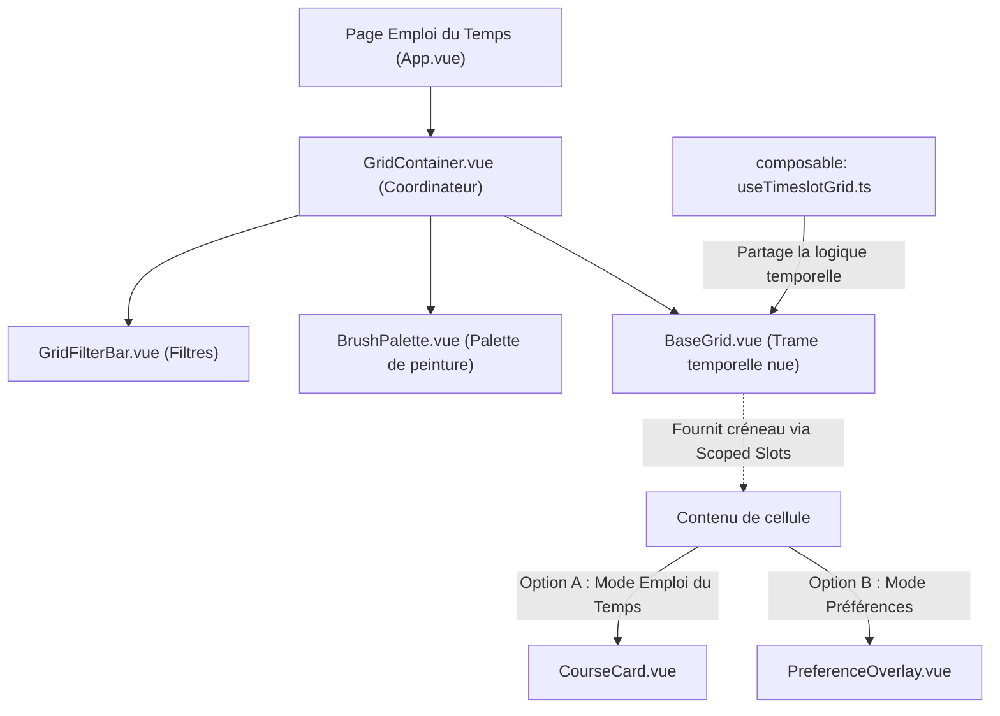

# Feature Specification: Améliorations Fonctionnelles et Socle Technique pour l'Emploi du Temps Annuel

**Feature Branch**: `002-yearly-timetabling-core`

**Created**: 2026-05-17

**Status**: Draft

## Clarifications

### Session 2026-05-17
- Q: Mode d'interaction et filtrage pour la gestion multi-établissement (Cité Scolaire) → A: Option A (Affichage contextuel : un menu déroulant global permet de sélectionner l'établissement actif. La grille et les listes n'affichent par défaut que ses ressources/classes/cours, tout en préservant la visibilité et la protection contre les conflits des professeurs et salles partagés).
- Q: Échelle et volume de données cibles (Stress-test & Performance) → A: Option B (Structure pilote / Petite taille : jusqu'à 500 élèves, 40 enseignants, 30 salles, 20 classes).
- Q: Déclarations de Hors-Scope (Out-of-Scope) → A: Option A (Exclusion de l'affectation nominative/individuelle des élèves dans les groupes, et de la synchronisation collaborative temps réel).
- Q: Résolution des conflits lors de la modification de structures déjà planifiées → A: Option A (Dépositionnement automatique des cours impactés vers le statut UNPLACED avec boîte de dialogue de confirmation et historique de diagnostic).
- Q: Consolidation visuelle des attributs divergents dans la Fiche T (Fiche Cours Cumulée) → A: Option A (Consolidation par Chips stylisées : les attributs communs s'affichent normalement et les attributs divergents sont regroupés sous forme de pastilles/chips avec un indicateur visuel de divergence et un badge de proportion comme `[2/3]`).
- Q: Positionnement de la Fiche T sur l'écran → A: Popin déplaçable (draggable) par glisser-déposer de son en-tête pour ne pas masquer la grille horaire en dessous.

## Out of Scope
Pour cette itération, les fonctionnalités suivantes sont explicitement exclues du périmètre technique et fonctionnel :
1. **Affectation nominative individuelle des élèves** : Le système gère uniquement les structures (Divisions, ClassParts, Groupes) avec leurs effectifs numériques globaux. Aucun suivi nominatif individuel ou gestion d'inscriptions d'élèves par fiche n'est inclus.
2. **Synchronisation collaborative temps réel** : La gestion des conflits d'édition simultanée par plusieurs utilisateurs (type Google Docs) est exclue. Le verrouillage standard de la base SQLite et des sessions utilisateur classiques suffit.

## User Scenarios & Testing *(mandatory)*

### User Story 1 - Saisie et gestion du socle via le CRUD Générique (Priority: P1)

En tant qu'administrateur scolaire, je veux pouvoir ajouter, modifier, lister et supprimer l'ensemble des ressources de base de l'établissement (Matières, Professeurs, Groupes, Salles, Classes, Parties de classe, Alternances, Sites, Matériels, Créneaux) via des formulaires et des listes unifiés et génériques, afin de ne pas avoir à réimplémenter du code répétitif pour chaque nouvel écran de saisie.

**Why this priority**: C'est le fondement indispensable de l'application. Sans saisie propre de l'ensemble de ces données de base interconnectées, aucun emploi du temps ne peut être planifié ou calculé.

**Independent Test**: L'utilisateur peut ajouter n'importe quelle ressource (ex: un nouveau Site ou un nouveau Matériel) via le système de formulaires génériques, et la voir instantanément dans la table générique associée, prête à être rattachée à des cours.

**Acceptance Scenarios**:

1. **Given** un formulaire générique de création vide pour n'importe quelle entité de base, **When** l'utilisateur remplit les champs requis et valide, **Then** la ressource est enregistrée en base de données et listée dynamiquement.
2. **Given** un cours existant, **When** le planificateur consulte sa fiche ou sa popin, **Then** il peut y rattacher de manière optionnelle ou obligatoire les différentes ressources correspondantes (Matières, Professeurs, Groupes, Salles, Classes, Parties de classe, Alternances, Sites, Matériels), et l'affecter à au plus 1 créneau (0 ou 1) de la grille.

---

### User Story 2 - Planification avancée annuelle (Alternances A/B, Groupes) (Priority: P1)

En tant que planificateur, je veux pouvoir définir des alternances (Semaine A / Semaine B) pour les cours en quinzaine, et découper mes divisions (classes) en sous-groupes (ex: demi-classes, groupes de spécialités), afin de gérer la complexité réelle d'un établissement scolaire.

**Why this priority**: C'est ce qui distingue un prototype d'un véritable outil d'emploi du temps annuel pour collèges et lycées.

**Independent Test**: L'utilisateur peut diviser la classe de "3ème A" en deux groupes "Groupe 1" et "Groupe 2", et planifier un cours de TP de Physique pour le "Groupe 1" uniquement en Semaine A, et un autre pour le "Groupe 2" en Semaine B.

**Acceptance Scenarios**:

1. **Given** une division existante, **When** l'utilisateur définit un découpage en groupes, **Then** ces sous-groupes deviennent éligibles comme destinataires d'un cours.
2. **Given** un cours de quinzaine, **When** le cours est assigné à la Semaine A, **Then** le solveur s'assure qu'aucun conflit n'est généré sur la semaine B pour les mêmes ressources.

---

### User Story 3 - IHM Métier : La Fiche Cours Cumulée "Fiche T" (Priority: P2)

En tant que planificateur, lorsque je sélectionne plusieurs cours sur ma grille ou dans ma liste, je veux voir apparaître une popin unifiée (sous forme de Fiche T à l'ancienne) qui résume visuellement toutes les données de ces cours, par type d'objet lié (matière, enseignant, salle, division, créneau), afin d'avoir une vision synthétique claire de ma sélection sans pouvoir la modifier directement depuis cet écran. Je veux pouvoir déplacer (glisser-déposer de son en-tête) cette popin de petite taille sur l'écran afin de ne pas masquer la grille horaire située en dessous.

**Why this priority**: Permet un diagnostic et une consultation rapide des détails d'une sélection complexe de cours (enseignants, salles, divisions, créneaux) sans surcharger l'écran principal.

**Independent Test**: Sélectionner 3 cours distincts sur la grille, ouvrir la Fiche T, déplacer la popin à un autre endroit de l'écran par drag-and-drop, et valider que l'ensemble de leurs détails consolidés (matières, enseignants, salles) s'affiche fidèlement.

**Acceptance Scenarios**:

1. **Given** plusieurs cours sélectionnés, **When** l'utilisateur ouvre la Fiche T cumulée, **Then** les attributs communs (ex: même matière) s'affichent normalement et les attributs divergents (ex: salles différentes) sont clairement identifiés et consolidés.
2. **Given** la Fiche T affichée, **When** l'utilisateur clique-glisse l'en-tête de la popin, **Then** la popin suit le mouvement de la souris et se repositionne à l'endroit désigné, sans interférer avec la grille d'emploi du temps sous-jacente.

---

### User Story 4 - Saisie et Gestion Générique des Vœux et Indisponibilités (Priority: P2)

En tant que planificateur ou enseignant, je veux pouvoir colorer une grille horaire réutilisable pour définir les préférences et indisponibilités de *n'importe quelle ressource* (enseignants, classes, groupes, salles, équipements) : rouge pour "Indisponible" (strictement bloquant), orange pour "Souhait d'absence" (pénalisé par le solveur), et vert pour "Souhait de présence" (favorisé/récompensé par le solveur), afin que l'emploi du temps généré respecte toutes les contraintes de l'établissement.

*(Cette user story est implémentée via l'architecture modulaire de Grille Temporelle unifiée décrite dans la section "Spécifications de l'Architecture de la Grille Temporelle", en configurant la grille avec `preferenceMode = 'edit'` et `coursesMode = 'none'`)*

**Why this priority**: C'est une fonctionnalité essentielle pour la flexibilité et la qualité globale de l'emploi du temps. La gestion générique évite de devoir réécrire un modèle de contrainte pour chaque type de ressource.

**Independent Test**: Définir une salle de sport (Gymnase) indisponible le lundi matin (Rouge), un enseignant souhaitant ne pas travailler le mardi après-midi (Orange), et une classe de Terminale souhaitant être libérée le mercredi matin (Orange) mais favorisant le jeudi matin (Vert). Lancer le solveur et valider que toutes ces règles de ressources diverses sont arbitrées et respectées.

**Acceptance Scenarios**:

1. **Given** la grille des vœux générique d'une ressource sélectionnée, **When** l'utilisateur clique-glisse avec le pinceau (rouge, orange, vert), **Then** les créneaux horaires stockent la préférence correspondante pour cette ressource.
2. **Given** une ressource affectée à un cours sur un créneau marqué en rouge pour elle, **When** le solveur tente de placer le cours, **Then** une contrainte dure (Hard Constraint) bloque ce placement.
3. **Given** une ressource affectée à un cours sur un créneau marqué en orange ou vert, **When** le solveur arbitre la solution, **Then** le score souple (Soft Constraint) est respectivement pénalisé ou récompensé en fonction de la préférence.

### User Story 4b - Grille de Vœux en Multi-sélection et Légende Interactive (Priority: P2)

En tant que planificateur, je veux pouvoir sélectionner plusieurs enseignants (ou autres ressources) simultanément et visualiser une synthèse de leurs vœux sur la grille horaire du milieu :

*(Cette user story est implémentée via le composant de filtrage multi-critères "GridFilterBar.vue" et la superposition des couches de la grille temporelle décrits dans la section "Spécifications de l'Architecture de la Grille Temporelle")*

- Si un créneau a la même couleur (vert, orange, rouge ou neutre) pour tous les enseignants sélectionnés, le créneau s'affiche dans cette couleur pleine.
- Si le créneau a des préférences différentes ou partielles, il s'affiche dans un motif hachuré :
  - **Hachuré rouge** : au moins un enseignant est indisponible (rouge) sur ce créneau et les autres sont neutres.
  - **Hachuré orange** : au moins un enseignant souhaite éviter ce créneau (orange) et les autres sont neutres.
  - **Hachuré vert** : au moins un enseignant préfère ce créneau (vert) et les autres sont neutres.
  - **Hachuré bleu** : les contraintes diffèrent entre les enseignants (mélange de différentes couleurs actives, par exemple vert + orange, vert + rouge, etc.).
- Si je peins un créneau de la grille en multi-sélection, le vœu s'applique simultanément à l'ensemble des enseignants sélectionnés (ce qui le transforme en couleur pleine lors de l'actualisation).
- Je veux pouvoir ouvrir une popin d'aide contenant la légende complète de la grille en cliquant sur un bouton d'aide (point d'interrogation ❓) en haut à droite du composant.
- **Sélection obligatoire de période** : Lorsqu'un type de période est sélectionné (par exemple Trimestre), l'application sélectionne par défaut toutes les périodes de ce type. Pour assurer la cohérence logique des vœux, l'utilisateur ne peut pas décocher toutes les périodes : si la dernière période cochée restante est décochée par l'utilisateur, l'action est annulée et la période reste cochée.
- **Compteur numérique en multi-sélection** : Pour les cases hachurées (divergences/préférences partielles en multi-sélection), un compteur au format `X/Y` (ex: `2/3`) est affiché au centre de la case pour indiquer la proportion de ressources ayant une préférence active (non-neutre) sur ce créneau.
- **Tooltip détaillé dynamique** : Au survol d'une case de la grille, si et seulement si celle-ci présente une hétérogénéité (case hachurée indiquant des divergences temporelles ou entre ressources), un tooltip contextuel affiche le détail nominatif des vœux de chaque ressource sélectionnée par semaine (A/B/W) et par période d'application. Si les préférences sont parfaitement uniformes, le tooltip ne s'affiche pas pour ne pas surcharger l'interface. Ce tooltip se masque également automatiquement lors d'une action de dessin (clic enfoncé) pour libérer la vue lors de la saisie.

**Acceptance Scenarios**:
1. **Given** plusieurs enseignants sélectionnés, **When** la grille des vœux est affichée, **Then** les créneaux avec des préférences identiques sont colorés en couleur pleine, et les créneaux avec des préférences mixtes/partielles s'affichent sous forme hachurée (rouge, orange, vert ou bleu selon la règle).
2. **Given** plusieurs enseignants sélectionnés, **When** l'utilisateur clique ou glisse pour peindre un créneau, **Then** le vœu est sauvegardé en base de données pour chacun des enseignants sélectionnés en parallèle.
3. **Given** la grille de vœux, **When** l'utilisateur clique sur le bouton d'aide ❓ en haut à droite, **Then** une popin d'aide s'ouvre, affichant la légende des couleurs, des hachures, et le compteur numérique de multisélection.
4. **Given** un type de période actif, **When** l'utilisateur essaie de décocher toutes les périodes, **Then** la dernière période restante est maintenue cochée pour forcer au moins une période sélectionnée.
5. **Given** la grille de vœux en multi-sélection, **When** l'utilisateur survole une cellule hachurée (non uniforme), **Then** un tooltip s'affiche avec la répartition détaillée par ressource, et **When** la cellule survolée est uniforme (couleur pleine ou neutre) ou que le bouton de la souris est enfoncé (mode dessin/peinture), le tooltip disparaît immédiatement.

### User Story 5 - Navigation fluide et structurée via Notebooks Imbriqués et Multi-panneaux (Priority: P2)

En tant que planificateur, je veux naviguer dans l'application via une interface structurée sous forme d'onglets (notebooks) imbriqués configurables dynamiquement, et pouvoir diviser mes écrans de travail les plus bas en plusieurs panneaux redimensionnables verticalement par glisser-déposer, afin de visualiser et d'éditer simultanément différentes données (par exemple, afficher la liste des enseignants à côté de leur formulaire d'édition).

**Why this priority**: Cette ergonomie moderne élimine la navigation complexe par menus séparés, améliore la productivité en permettant le multi-panneaux côte à côte (ex: liste + formulaire), et standardise le squelette visuel complet de l'application sous forme de configuration déclarative.

**Independent Test**:
Charger une configuration JSON décrivant un arbre de notebooks avec au niveau 1 "Emploi du temps" (pleine largeur) et "Paramètres". Dans "Paramètres", accéder au sous-onglet "Enseignants" divisé verticalement en 2 panneaux : la liste générique à gauche et le formulaire générique à droite. Cliquer sur la barre de séparation entre les deux panneaux et la faire glisser pour modifier leur largeur respective. Vérifier que la nouvelle largeur est appliquée de façon fluide.

**Acceptance Scenarios**:

1. **Given** une structure JSON de configuration valide fournie à l'application, **When** l'application démarre, **Then** elle génère dynamiquement l'arbre complet des onglets à un ou plusieurs niveaux de profondeur, avec le titre, la couleur de fond ou la couleur de liseré supérieur définie pour chaque onglet.
2. **Given** un onglet feuille contenant plusieurs panneaux verticaux juxtaposés, **When** l'utilisateur clique-glisse sur la barre de séparation (splitter) située entre deux panneaux, **Then** la largeur des deux panneaux adjacents est mise à jour dynamiquement selon la position de la souris sans altérer leur rendu fonctionnel.
3. **Given** un onglet avec fond coloré défini dans le JSON, **When** l'onglet est rendu à l'écran, **Then** son en-tête affiche la couleur de fond spécifiée et son texte s'affiche en gras et en blanc.
4. **Given** un onglet avec liseré supérieur coloré défini dans le JSON, **When** l'onglet est rendu à l'écran, **Then** son en-tête affiche une bordure supérieure colorée de la couleur spécifiée.

---

### Edge Cases

- **Chevauchement de vœux et de cours verrouillés** : Si un cours est manuellement épinglé (pinned) sur un créneau qu'un professeur a marqué en rouge (Indisponible), le système doit alerter l'utilisateur de ce conflit direct.
- **Modification de groupes contenant des élèves / ressources planifiées** : Si un groupe, une division ou une ressource (professeur, salle) est supprimée ou modifiée en profondeur alors que des séances y sont déjà placées sur la grille, le système présente une boîte de dialogue de confirmation listant les cours impactés. Après validation de l'utilisateur, les cours affectés sont automatiquement dépositionnés sur la grille (leur statut repasse en `UNPLACED` et leur créneau est libéré) afin de maintenir la cohérence de la base.

## Requirements *(mandatory)*

### Functional Requirements

- **FR-001**: **Moteur CRUD Générique (Socle)** : Le système doit fournir un mécanisme générique côté backend et frontend pour générer les formulaires et les listes pour toutes les entités de base (y compris les nomenclatures) : *Matières, Professeurs, Groupes, Salles, Classes, Parties de classe, Alternances, Sites, Matériels, Créneaux, MEFs, Disciplines, Missions, Méthodes d'élection et Périodes*.
- **FR-002**: **APIs Génériques** : Le backend doit exposer des points d'accès API unifiés, typés et réutilisables pour les opérations CRUD de chaque type de ressource de base. Les mises à jour s'effectuent via la méthode HTTP `PATCH` (au lieu de `PUT`) pour permettre des modifications partielles et groupées (bulk updates). Le serveur ne met à jour en base de données que les champs qui ont été explicitement fournis dans le corps de la requête JSON (grâce à l'utilisation de `exclude_unset=True` sur le schéma Pydantic de validation). Seules les champs modifiés dans la vue formulaire (ou la vue liste si elle est en mode édition) sont envoyés au serveur.
- **FR-003**: **Composants Frontend Réutilisables** : Le frontend doit utiliser des composants de tableau (`GenericList`) et de formulaire (`GenericForm`) paramétrables pour éviter la duplication de code pour tous les types de ressources.
Concernant le composant `GenericList`, il doit offrir nativement les fonctionnalités suivantes :
  1. Pagination (par défaut 30 éléments par page, avec possibilité de modifier ce nombre).
  2. Redimensionnement manuel de la largeur des colonnes.
  3. Réordonnancement des colonnes via glisser-déposer (drag-and-drop) de leurs en-têtes.
  4. Sélecteur de colonnes accessible via un bouton icône dans l'en-tête Action permettant de cocher/décocher les colonnes à afficher.
  5. Tri des données en cliquant sur l'en-tête de n'importe quelle colonne.
  6. Recherche / filtrage spécifique sur chaque colonne.
  7. **Multisélection par cases à cocher** : Une colonne de cases à cocher à gauche de la liste, avec une case à cocher globale dans l'en-tête pour tout cocher/décocher.
  8. **Mise en surbrillance** : Toute ligne sélectionnée par sa case à cocher ou via les raccourcis se colore de manière distincte en surbrillance.
  9. **Badge de comptage de sélection** : Dès qu'au moins un élément est sélectionné, un badge affiche le nombre d'éléments sélectionnés en bas dans la zone de pagination.
  10. **Raccourcis de sélection** :
      - *Maj + Clic* : Sélectionne tous les éléments contigus entre le premier et le dernier élément cliqué.
      - *Ctrl + Clic / Cmd + Clic* : Sélectionne/désélectionne des éléments non contigus.
      - *Ctrl + A / Cmd + A* : Sélectionne d'un coup tous les éléments affichés de la liste.
  11. **Bulle d'aide Markdown (attribut `help`)** : Les colonnes peuvent être configurées avec un attribut optionnel `help` contenant du texte d'aide au format Markdown. Un point d'interrogation en exposant (couleur bleue `rgba(1, 128, 165)`) s'affiche alors à droite du libellé de l'en-tête de colonne. Au survol de la souris, un tooltip sur fond sombre s'affiche avec le texte d'aide formaté en HTML (Markdown converti, respectant les sauts de ligne).
Concernant le composant `GenericList`, il doit offrir nativement les fonctionnalités suivantes :
  12. **Structure de configuration optionnelle (`listConfig`)** :
      - `editableInline` : booléen indiquant si l'on peut éditer les enregistrements directement dans la liste (par défaut `true`).
      - `allowMultiSelect` : booléen permettant ou non d'activer la multisélection/les cases à cocher (par défaut `true`).
      - `columns` : configuration fine pour chaque colonne, comprenant :
        - `visibleByDefault` : booléen (par défaut `true`) coché par défaut dans le sélecteur de colonnes.
        - `overrideLabel` : intitulé optionnel surchargé (s'il est spécifié).
        - `readOnly` : booléen (par défaut `false`) pour rendre un champ ou une colonne non modifiable en ligne.
        - `required` : booléen (par défaut `false`) indiquant si la saisie est obligatoire pour cette colonne lors de l'édition en ligne.
        - `help` : texte d'aide au format Markdown décrivant le rôle ou le fonctionnement de la colonne.
Concernant le composant `GenericForm`, il doit offrir les fonctionnalités suivantes :
  1. **Bulle d'aide Markdown (attribut `help`)** : Les champs de saisie peuvent être configurés avec un attribut optionnel `help` contenant du texte d'aide au format Markdown. Un point d'interrogation en exposant (couleur bleue `rgba(1, 128, 165)`) s'affiche à droite du libellé du champ. Au survol, un tooltip sur fond sombre affiche le texte Markdown formaté, y compris ses sauts de ligne.
  2. **Structure de configuration optionnelle (`formConfig`)** :
     - `editableForm` : booléen indiquant si l'on peut éditer les enregistrements dans le formulaire (par défaut `true`).
     - `fields` : configuration fine et structurée pour la mise en page et la sélection des éléments du formulaire. Si non spécifié, tous les attributs du modèle sont intégrés par défaut. Cette structure supporte les balises de structure de type Odoo suivantes pour organiser les formulaires de manière professionnelle :
       - **Champs standards** :
         - `key` : clé de l'attribut (ex: `code`, `last_name`).
         - `readOnly` : booléen (par défaut `false`) indiquant si l'attribut est en lecture seule dans le formulaire.
         - `required` : booléen (par défaut `false`) indiquant si la saisie de l'attribut est obligatoire dans le formulaire.
         - `overrideLabel` : intitulé textuel optionnel pour surcharger l'étiquette par défaut.
         - `help` : texte d'aide au format Markdown pour décrire le rôle ou le fonctionnement du champ.
       - **Structure `group`** : Définit un conteneur organisant ses enfants sous forme de colonnes (par exemple un layout sur 2 colonnes ou plus, avec un alignement soigné des étiquettes et des champs). Un groupe peut éventuellement porter une étiquette de titre (`string`). Les éléments enfants (`children`) d'un groupe peuvent être des champs ou d'autres sous-structures.
       - **Balise `separator`** : Ajoute un séparateur visuel horizontal (`<hr>`) accompagné d'un titre optionnel, idéal pour structurer les différentes sections logiques d'un formulaire dense.
       - **Balise `newline`** : Force un saut de ligne dans le layout en cours, permettant aux éléments suivants de commencer sur une nouvelle ligne de la grille (utile dans les mises en page multi-colonnes).
  3. **Comportement en Multi-sélection (Édition en masse)** : Lorsque plusieurs ressources sont sélectionnées dans la liste associée, le formulaire s'affiche en mode d'édition groupée :
     - **Champs identiques** : Si un champ possède la même valeur pour toutes les ressources sélectionnées, il est pré-rempli avec cette valeur commune.
     - **Champs divergents** : Si un champ possède des valeurs différentes parmi les ressources sélectionnées, il est affiché vide avec un fond grisé (et un placeholder indicatif) mais reste éditable.
     - **Indicateurs visuels de modification** : Lorsqu'un champ (qu'il soit identique ou divergent) est modifié par l'utilisateur, sa bordure se colore en vert et un badge vert `✏️ Modifié` s'affiche à côté de son libellé.
     - **Bandeau d'information contextuel** : Un bandeau d'explication clair s'affiche en haut du formulaire pour expliquer à l'utilisateur que seuls les champs modifiés (marqués du badge `✏️ Modifié` et de la bordure verte) seront enregistrés et appliqués en masse lors du clic sur le bouton "Enregistrer".
     - **Enregistrement partiel (PATCH)** : La soumission du formulaire envoie des requêtes HTTP `PATCH` contenant uniquement les champs explicitement modifiés, préservant ainsi les valeurs non éditées des autres champs pour chaque ressource sélectionnée.
- **FR-004**: **Gestion des Alternances (Quinzaine)** : Le modèle de données et le solveur doivent supporter les alternances temporelles (Semaine A / Semaine B / Toutes les semaines).
- **FR-005**: **Gestion des Groupes et Sous-groupes** : Les divisions doivent pouvoir être partitionnées en sous-groupes (ex: demi-classes, groupes de spécialités), avec support des conflits d'intersection d'élèves par le solveur.
- **FR-006**: **Fiche Cours Cumulée (Fiche T)** : Une popin métier unifiée doit permettre de visualiser et de consulter de manière synthétique et consolidée les caractéristiques d'une sélection multiple de cours. Les ressources communes (ex: même matière) s'affichent de façon standard, tandis que les ressources divergentes (ex: enseignants ou salles différents) sont regroupées sous forme de pastilles (chips) stylisées dotées d'un indicateur visuel de divergence (bordure ou couleur contrastée) et d'un badge de proportion (ex: `[2/3]`). **La popin doit être déplaçable (draggable) par glisser-déposer (drag-and-drop) de son en-tête**, afin de permettre au planificateur de dégager la vue sur la grille horaire sous-jacente.
- **FR-007**: **Grille de Vœux Générique** : L'IHM doit proposer une grille interactive réutilisable permettant de saisir graphiquement les indisponibilités (Rouge - contrainte dure), les souhaits d'absence (Orange - contrainte souple négative) et les souhaits de présence (Vert - contrainte souple positive) pour n'importe quelle ressource (Enseignants, Salles, Divisions, Équipements).
- **FR-008**: **Calcul Polymorphique des Vœux** : Le solveur Timefold doit intégrer les vœux et indisponibilités de manière générique dans son modèle de contraintes (Hard pour les créneaux rouges de toute ressource affectée, Soft pénalité pour les créneaux oranges, Soft bonus pour les créneaux verts).
- **FR-009**: **Objet Cours, Durée et Attributs Métiers** : Chaque cours doit porter des attributs propres définis en amont de son placement : une durée (exprimée en nombre de créneaux élémentaires ou minutes), un libellé (généré dynamiquement à partir des ressources rattachées), un mémo (texte libre) et une planification sur la grille horaire via des séances rattachées (0 ou 1 créneau de départ, avec extension contiguë sur la durée du cours).
- **FR-010**: **Données de Démo Réalistes** : La base de données SQLite doit être alimentée par défaut avec un jeu d'essai réaliste et complet couvrant les 9 types de ressources rattachables, plusieurs cours complexes N-à-N créés, et des grilles de vœux pré-remplies (avec créneaux rouges, oranges, verts) pour plusieurs profs/salles, afin de permettre un test direct.
- **FR-011**: **Filtrage Multi-Établissement (Cité Scolaire)** : L'interface utilisateur doit proposer un menu déroulant global permettant de sélectionner l'établissement actif (ex: Collège). La grille et les listes n'affichent par défaut que les ressources (classes, cours) de l'établissement actif, tout en préservant la protection contre les conflits et la visibilité des ressources partagées (professeurs, salles communes).
- **FR-012**: **Notebooks Imbriqués Génériques par Configuration JSON** : L'application doit structurer son ergonomie globale sous forme d'un arbre d'onglets (notebooks) à plusieurs niveaux de profondeur. Ce composant de navigation et de mise en page doit être entièrement générique et alimenté par une structure JSON décrivant l'arbre complet des onglets, leurs titres, leurs attributs de style (couleur de fond, liseré supérieur) et les panneaux qu'ils contiennent.
- **FR-013**: **Affichage Multi-Panneaux Verticaux** : Lorsqu'un onglet se situe au niveau le plus bas de la hiérarchie (une feuille de l'arbre), il peut être divisé verticalement en 1 à N panneaux. Chaque panneau doit pouvoir afficher au choix :
  1. Un composant liste générique (`GenericList`)
  2. Un composant formulaire générique (`GenericForm`)
  3. L'un des composants personnalisés de l'application (comme la grille d'emploi du temps `TimetableGrid` ou la grille de saisie des vœux/contraintes `PreferenceGrid`).
- **FR-014**: **Redimensionnement Dynamique des Panneaux (Splitter)** : Lorsqu'un onglet contient plusieurs panneaux verticaux juxtaposés, une barre de redimensionnement vertical (splitter) doit séparer chaque panneau. L'utilisateur doit pouvoir cliquer sur cette barre et la faire glisser (drag-and-drop) pour modifier en temps réel et de manière fluide la largeur des panneaux adjacents.
- **FR-015**: **Personnalisation Visuelle des Onglets via la Configuration JSON** : Chaque onglet défini dans la structure JSON de configuration peut porter des attributs de style spécifiques pour son en-tête (titre) :
  - **Option Fond Coloré** : L'en-tête de l'onglet est entièrement rempli avec une couleur de fond spécifiée. Le texte du titre de l'onglet s'affiche alors automatiquement en blanc et en gras.
  - **Option Liseré Supérieur Coloré** : L'en-tête de l'onglet conserve son fond neutre mais affiche un liseré (bordure supérieure colorée) d'une épaisseur de quelques pixels de la couleur spécifiée dans le JSON.
- **FR-016**: **Thème Général Clair bg-gray-300** : Le thème visuel de l'application doit être unifié vers une apparence claire et premium. L'arrière-plan de l'application doit utiliser un ton gris/blanc cassé doux correspondant à la teinte standard de design `bg-gray-300` (ou son équivalent hexadécimal/HSL clair), offrant un excellent contraste avec les textes sombres et les onglets colorés.


### Key Entities


- **Course (Cours)** : Le conteneur logique de planification. Il peut être de deux types :
  *   **Cours Simple** : Composé d'une seule **Séance** (Session).
  *   **Cours Complexe** : Regroupe plusieurs **Séances** s'organisant à l'intérieur de ce cours. Ces séances peuvent être placées en parallèle (alignements, ex: barrettes de langues, groupes de spécialités) ou à la suite (pour forcer leur succession temporelle).
- **Séance (Session)** : L'unité réelle de placement sur la grille horaire. Chaque séance possède ses propres ressources rattachées (matières, profs, classes, etc.) et est positionnée sur 0 ou 1 créneau.
- **Ressources de base rattachables à une séance (Relations N-à-N / Many-to-Many)** :
  *   **Subjects (Matières)** : La ou les matières enseignées lors de la séance (ex : Mathématiques, Physique-Chimie).
  *   **Teachers (Professeurs)** : Le ou les enseignants encadrant la séance (supportant le co-enseignement).
  *   **Divisions (Classes)** : La ou les classes d'élèves entières associées (regroupements de classes).
  *   **ClassParts (Parties de classe)** : Une ou plusieurs sous-parties de classes (ex : Demi-classe de 3ème A - Groupe 1).
  *   **Groups (Groupes)** : Un ou plusieurs regroupements d'élèves (ex : Groupe d'Allemand LV2, Spécialité Physique).
  *   **Sites** : Le ou les sites physiques ou campus géographiques associés à la séance.
  *   **Materials (Matériels / Équipements)** : Le ou les matériels mobiles ou fixes réservables (ex : Valise d'iPad, Projecteur 3D).
  *   **Classrooms (Salles)** : La ou les salles de classe affectées (ex : Salle 102, Labo SVT).
- **ResourcePreference** : Association polymorphique entre n'importe quel type de ressource listé ci-dessus, un créneau (Timeslot) et un niveau de préférence (Disponible [Blanc], Souhait d'absence [Orange], Indisponible [Rouge], Souhait de présence [Vert]), qualifiée par un type de semaine (Semaine A/B/Toutes) et associée à des périodes d'application.
- **Period (Période)** : Découpage temporel séquentiel de l'année scolaire (trimestres, semestres, etc.).
- **PeriodType (Type de Période)** : Catégorie ou modèle de découpage temporel de l'année scolaire (Trimestre, Semestre, etc.).
- **AlternationCalendar (Calendrier d'Alternance)** : Modélisation du rythme cyclique des semaines (Semaine A / Semaine B / Toutes) pour chaque établissement scolaire.
- **ResourceConstraint (Contrainte de Ressource)** : Définition globale pour toute l'année des contraintes réglementaires, pédagogiques ou géographiques rattachées à une ressource unique (matière, enseignant, classe, etc.). Les caractéristiques de ces contraintes s'adaptent dynamiquement selon le type de ressource.

## Spécification Détaillée des Objets et de leurs Attributs

Voici la définition formelle de chaque objet et de sa structure de données :

### 0. School (Établissement)
Représente une entité administrative scolaire autonome (un collège, un lycée général, un lycée professionnel) coexistant au sein de la même base de données (concept de **Cité Scolaire**). Cela permet aux établissements de partager les ressources communes (professeurs partagés, salles communes, même campus) tout en conservant une gestion budgétaire, des imports/exports STSWEB et des structures de classes strictement séparés.
*   `id` : Clé primaire (Entier)
*   `uai` : Code national unique de l'établissement (anciennement RNE) (Chaîne de 8 caractères, ex: "0751234A")
*   `name` : Nom officiel de l'établissement (Chaîne, ex: "Lycée Molière")
*   `type` : Type d'établissement (Enum : `COLLEGE`, `LYCEE`, `LYCEE_PRO`, `AUTRE`)
*   `city` : Ville (Chaîne)
*   `postal_code` : Code postal (Chaîne)
*   `student_start_date` : Date de rentrée des élèves (Date, e.g. "2026-09-02")
*   `student_end_date` : Date de sortie des élèves (Date, e.g. "2027-07-04")

> [!NOTE]
> **Gestion globale de la granularité et combinatoire :** 
> La durée standard d'un créneau élémentaire (`STANDARD_TIMESLOT_DURATION`) est un paramètre global commun à toute la base de données, configuré au niveau de l'application (valeurs autorisées : `15`, `30`, `60` minutes, par défaut `30`).
> Pour assurer une flexibilité maximale, la base de données est initialisée avec des créneaux temporels (`Timeslot`) au pas le plus fin (15 minutes, soit des incréments de `0.25`h). Lors de l'exécution, le solveur filtre immédiatement les créneaux disponibles (ex: uniquement les multiples de `0.5`h si la durée globale est de 30 minutes) avant de lancer l'optimisation. Ainsi, la combinatoire reste strictement limitée sans impact sur la performance.

### 1. Course (Cours)
Le conteneur logique de cours.
*   `id` : Clé primaire (Entier)
*   `subject_id` : Clé étrangère vers la **Matière** principale enseignée (Entier, relation N-à-1)
*   `teacher_id` : Clé étrangère optionnelle vers le **Professeur** principal (Entier, relation N-à-1)
*   `division_id` : Clé étrangère optionnelle vers la **Classe** principale visée (Entier, relation N-à-1)
*   `group_id` : Clé étrangère optionnelle vers le **Groupe** visé (Entier, relation N-à-1)
*   `label` : Libellé textuel calculé de manière dynamique à partir des séances et ressources rattachées (ex : `"{matières} - {profs} - {classes}"`)
*   `memo` : Texte libre (Chaîne optionnelle) pour les notes du planificateur
*   `duration_minutes` : Durée du cours définie en amont du placement (Entier, exprimée en minutes, ex: `55` pour un cours standard d'une heure)
*   `is_complex` : Indicateur s'il s'agit d'un cours complexe (Booléen, par défaut `False`)
*   `lock_sessions` : Si vrai, verrouille l'ordre ou la répartition des séances à l'intérieur du cours complexe (Booléen, par défaut `False`)
*   `mission_id` : Clé étrangère optionnelle vers une **Mission** (Entier, ex: pour lier un cours à un rôle spécifique comme Professeur Principal)
*   `election_method_id` : Clé étrangère optionnelle vers une **ElectionMethod** (Entier, ex: pour lier à un cours de type DNL)
*   `family_id` : Clé étrangère optionnelle vers une **Family** de type `Course` (Entier, ex: pour regrouper des cours d'une même option ou spécialité)
*   `status` : État du cours calculé de manière dynamique à partir du positionnement de ses séances et des contraintes (Chaîne, calculée) :
    *   `UNPLACED` : Aucune séance planifiée sur la grille.
    *   `PLACED` : Toutes ses séances sont planifiées sans aucun conflit.
    *   `PARTIALLY_PLACED` : Pour un cours complexe, seulement une partie de ses séances sont placées.
    *   `CONFLICT` : Conflit de ressources (double réservation de prof, salle, classe) ou non-respect d'une indisponibilité stricte (`RED`).
    *   `LOCKED` : Cours dont le placement a été explicitement verrouillé par le planificateur.
    *   `SUSPENDED` : Cours temporairement suspendu ou mis de côté.
*   *Relations (1-à-N)* : `sessions` (Liste des **Séances** rattachées à ce cours)

### 1bis. Session (Séance)
L'unité opérationnelle et planifiée d'un cours.
*   `id` : Clé primaire (Entier)
*   `course_id` : Clé étrangère vers le **Course** parent (Entier, relation 1-à-N)
*   `timeslot_id` : Clé étrangère optionnelle vers un **Timeslot** (0 ou 1 créneau). Dans le cas d'une séance planifiée sur la grille, `timeslot_id` désigne le créneau de départ (Start Timeslot), et la séance s'étend de manière contiguë sur une longueur égale à la `duration_minutes` du cours parent.
*   `classroom_id` : Clé étrangère optionnelle vers la **Salle** principale de la séance (Entier, relation N-à-1)
*   `week_type` : Type d'alternance de semaine (Chaîne, 'A', 'B' ou 'W' pour Toutes les semaines, par défaut 'W')
*   `is_pinned` : Indicateur si la séance est verrouillée statiquement sur ce créneau et cette salle, ignorée par le solveur (Booléen, par défaut `False`)
*   `is_co_teaching` : Indicateur si la séance est dispensée en co-enseignement (Booléen, par défaut `False`)
*   *Relations (N-à-N)* : `subjects`, `teachers`, `divisions`, `class_parts`, `groups`, `alternations`, `sites`, `materials`, `classrooms` (les ressources affectées à cette séance)

### 2. Subject (Matière)
*   `id` : Clé primaire (Entier)
*   `code` : Code abrégé interne ou de gestion pour l'affichage (Chaîne, e.g. "MATHS", "SVT", "ACCPE")
*   `code_nomenclature` : Code national réglementaire de la nomenclature issu de la base nationale (Chaîne, e.g. `006600` pour l'accompagnement personnalisé)
*   `short_label` : Libellé court abrégé utilisé pour l'affichage compact dans les grilles horaires (Chaîne, e.g. `ACCOMPAGNEMT. PERSO.`)
*   `long_label` : Libellé long national officiel de la matière (Chaîne, e.g. `ACCOMPAGNEMENT PERSONNALISE`)
*   `edition_label` : Libellé d'édition personnalisé pour l'impression des bulletins et documents (Chaîne, e.g. `Accompagnement personnalisé`)
*   `is_etp` : Indicateur si la matière est comptabilisée dans les Equivalents Temps Plein (ETP) pour les dotations et le TRMD (Booléen, par défaut `False`)
*   `is_specialty` : Indicateur si la matière est une spécialité (ou option) (Booléen, par défaut `False`). Cet attribut permet de filtrer l'interface utilisateur pour n'afficher que les matières de spécialité lors de la constitution des barrettes complexes d'alignement.
*   `color` : Code couleur d'affichage (Chaîne hexadécimale ou HSL pour la grille)
*   `pedagogic_weight` : Facteur de poids pédagogique (Réel, e.g. 1.5 pour matières dites « lourdes » nécessitant d'être réparties de manière équilibrée dans la semaine)
*   `discipline_id` : Clé étrangère vers la **Discipline** d'enseignement pour l'export national STSWEB (Entier, relation N-à-1)
*   `family_id` : Clé étrangère optionnelle vers une **Family** de type `Subject` (Entier, ex: pour regrouper les matières scientifiques)

### 2bis. Discipline
La nomenclature nationale des enseignements (discipline d'enseignement / de poste) indispensable pour l'export STSWEB et l'affectation budgétaire des professeurs.
*   `id` : Clé primaire (Entier)
*   `code` : Code national ou unique (Chaîne, e.g. "L0100" pour Philosophie, "L1400" pour Technologie)
*   `name` : Nom complet de la discipline (Chaîne, e.g. "Philosophie", "Technologie")

### 2ter. TRMDBudget (Budget de Répartition des Moyens par Discipline)
Représente la dotation budgétaire d'heures et de postes (issue de la Dotation Globale Horaire / DGH) allouée par le chef d'établissement à une discipline donnée. Cette entité constitue le socle du **TRMD** (Tableau de Répartition des Moyens par Discipline). 

Le système compare en temps réel :
1. **Les Besoins Prévisionnels (Requis)** : Volume total d'heures nécessaires pour assurer tous les enseignements. Il est calculé en faisant la somme pour chaque classe (`Division`) du volume horaire hebdomadaire défini par le `MEFService` de la matière de cette discipline (ex: `weekly_hours * nombre_de_classes`).
2. **Les Moyens Réels (Disponibles / Apports)** : Somme des heures de service hebdomadaires que les enseignants titulaires (`Teacher`) affectés à cette discipline doivent contractuellement assurer dans l'établissement (`max_weekly_hours`).
3. **La Balance Budgétaire (Écart)** : Différence dynamique calculée $\text{Moyens Réels} - \text{Besoins Prévisionnels}$. Une balance négative indique un sous-effectif nécessitant le recrutement de contractuels ou l'attribution d'heures supplémentaires, tandis qu'une balance positive indique un sur-effectif d'heures dans la discipline.

*   `id` : Clé primaire (Entier)
*   `discipline_id` : Clé étrangère vers la **Discipline** concernée (Entier, relation unique 1-à-1)
*   `allocated_hp` : Volume d'Heures Postes (HP) budgétées pour la discipline (Réel, ex: `180.0` heures régulières)
*   `allocated_hsa` : Volume d'Heures Supplémentaires Annuelles (HSA) budgétées pour la discipline (Réel, ex: `18.0` heures supplémentaires)
*   `allocated_posts` : Nombre de postes d'enseignants titulaires (Equivalent Temps Plein / ETP) alloués à la discipline (Réel, ex: `10.0`)

### 2quater. Family (Famille / Catégorie)
Regroupement transversal et hiérarchique de ressources permettant de mutualiser des contraintes ou de filtrer l'affichage (ex: familles de matières "Sciences", familles de cours "Spécialités Terminale", familles de professeurs "Sciences Humaines").
*   `id` : Clé primaire (Entier)
*   `code` : Code unique de la famille (Chaîne, e.g. "SCIENCES")
*   `name` : Libellé de la famille (Chaîne, e.g. "Sciences Expérimentales")
*   `resource_type` : Type de ressource concernée par ce regroupement (Enum : `Subject`, `Course`, `Teacher`, `Classroom`)

### 3. Teacher (Professeur)
Un professeur est défini globalement au niveau de la cité scolaire (permettant le partage de service entre collège et lycée), mais possède un établissement principal de rattachement administratif.
*   `id` : Clé primaire (Entier)
*   `code` : Trigronyme ou identifiant unique (Chaîne, e.g. "DUPONT.J")
*   `last_name` : Nom de famille (Chaîne)
*   `first_name` : Prénom (Chaîne)
*   `color` : Code couleur d'affichage (Chaîne)
*   `max_weekly_hours` : Nombre maximum d'heures d'enseignement autorisées par semaine (Réel)
*   `primary_school_id` : Clé étrangère optionnelle vers sa **School** de rattachement administratif principal (Entier, relation N-à-1)

### 4. MEF (Module Élémentaire de Formation / Niveau de formation)
Représente une formation ou un niveau d'enseignement réglementaire national défini par le ministère (ex: "Troisième Générale", "Seconde Générale et Technologique", "Première Spécialité"). C'est le socle technique indispensable pour l'import de la structure depuis STSWEB et pour calculer les dotations horaires globales.

Le MEF est un concept structurant pour :
1. **L'intégration nationale** : Il porte le code national obligatoire à 11 chiffres requis pour l'exportation réglementaire de rentrée vers STSWEB/SIECLE.
2. **Le calcul automatique des besoins** : En modifiant les services d'un MEF, le planificateur met à jour instantanément les besoins de l'ensemble des classes associées, évitant de ressaisir les matières et volumes horaires classe par classe.
3. **La gestion des structures composites** : Il permet de distinguer les élèves de formations différentes réunis au sein d'une même classe physique (ex: double-niveau ou classe de 3ème réunissant des élèves de MEF Général et MEF SEGPA).

*   `id` : Clé primaire (Entier)
*   `school_id` : Clé étrangère vers la **School** concernée (Entier, relation N-à-1)
*   `code` : Code national unique standardisé sur 11 caractères (Chaîne, e.g. "20310010110" pour une 3ème Générale)
*   `name` : Libellé complet de la formation (Chaîne, e.g. "Troisième Générale")
*   `forecast_student_count` : Nombre prévisionnel d'élèves affectés à cette formation dans l'établissement (Entier)
*   `max_students_per_class` : Limite conseillée ou réglementaire d'élèves par division (Entier, ex: `30` pour le collège, `35` pour le lycée)
*   *Relations (1-à-N)* : `mef_services` (Liste des dotations d'heures réglementaires par matière pour ce niveau)

### 4bis. MEFService (Service standard de formation)
Modèle de service d'enseignement lié à un MEF. Il sert de « gabarit » ou de patron pour générer automatiquement les cours requis d'une classe (Division) de ce niveau, évitant la saisie manuelle répétitive pour chaque classe. Lors de l'association d'une classe (`Division`) à un `MEF`, celle-ci hérite automatiquement de l'ensemble des `MEFServices` sous forme de cours prévisionnels.
*   `id` : Clé primaire (Entier)
*   `mef_id` : Clé étrangère vers le **MEF** parent (Entier, relation 1-à-N)
*   `subject_id` : Clé étrangère vers la **Subject** (Matière) enseignée (Entier, relation N-à-1)
*   `weekly_hours` : Volume horaire hebdomadaire réglementaire dû aux élèves (Réel, ex: `3.5` pour 3h30 de Mathématiques en 3ème)
*   `is_divided` : Si vrai, indique que tout ou partie de cet enseignement se déroule en effectif réduit (cours en groupe) (Booléen, par défaut `False`)

### 4ter. Division (Classe)
*   `id` : Clé primaire (Entier)
*   `school_id` : Clé étrangère vers la **School** à laquelle la classe appartient (Entier, relation N-à-1)
*   `code` : Code unique de la classe (Chaîne, e.g. "3EME_A")
*   `name` : Libellé de la classe (Chaîne, e.g. "Troisième A")
*   `student_count` : Nombre total d'élèves de la classe (Entier)
*   `color` : Code couleur d'affichage (Chaîne)
*   `mef_id` : Clé étrangère optionnelle vers le **MEF** principal de la classe (Entier, relation N-à-1). Si la classe est composite (multi-MEF ou double-niveau), elle est liée à son MEF de référence majoritaire.

### 5. ClassPart (Partie de classe)
Une composante élémentaire issue d'une partition de classe (ex : Demi-classe 1, Esp1, Latin).
*   `id` : Clé primaire (Entier)
*   `code` : Code unique (Chaîne, e.g. "3A_G1")
*   `name` : Libellé (Chaîne, e.g. "Groupe 1 (Demi-classe)")
*   `partition_id` : Clé étrangère vers la **Partition** parente (Entier, relation 1-à-N)
*   `student_count` : Nombre d'élèves de cette partie (Entier)

### 5bis. Partition (Partition de classe)
Découpage logique disjoint des élèves d'une Division (ex : la partition "Langues" contient les parties Esp1, Esp2, All ; la partition "Demi-classe" contient G1, G2).
*   `id` : Clé primaire (Entier)
*   `code` : Code unique de la partition (Chaîne, e.g. "LV2", "AP", "OPTIONS")
*   `name` : Libellé de la partition (Chaîne, e.g. "Langue Vivante 2", "Accompagnement Personnalisé")
*   `division_id` : Clé étrangère vers la classe parente **Division** (Entier, relation 1-à-N)

### 6. Group (Groupe)
Regroupement d'élèves (éventuellement à effectif variable) constitué par l'assemblage d'une ou plusieurs **ClassParts** (parties de classe) issues d'une ou plusieurs Divisions (ex : le groupe "Allemand LV2" associe la partie "All" de la 3ème A et la partie "All" de la 3ème B).
*   `id` : Clé primaire (Entier)
*   `code` : Code unique du groupe (Chaîne, e.g. "GERMAN_LV2")
*   `name` : Libellé (Chaîne, e.g. "Allemand LV2")
*   `student_count` : Nombre total d'élèves participant au groupe (Entier)
*   `is_variable_size` : Indicateur si le groupe est à effectif variable en cours d'année (Booléen, par défaut `False`)
*   *Relations (N-à-N)* : `class_parts` (Les parties de classe composant ce groupe)

### 6bis. ClassPartLink (Lien entre parties de classe)
Lien d'incompatibilité logique. L'existence d'un lien entre deux parties de classe indique qu'elles ont (ou peuvent avoir) des élèves en commun. Par conséquent, le solveur de conflits s'assure que deux séances affectées à ces deux parties respectives ne peuvent pas être planifiées en même temps.
*   `id` : Clé primaire (Entier)
*   `class_part_a_id` : Clé étrangère vers la première **ClassPart** (Entier)
*   `class_part_b_id` : Clé étrangère vers la seconde **ClassPart** (Entier)
*   `is_system_generated` : Vrai si le lien a été généré automatiquement par précaution par le système lors de la création de partitions croisées (Booléen, par défaut `True`)


### 7. AlternationCalendar (Calendrier d'Alternance)
Modélise pour un établissement donné le découpage hebdomadaire de l'année scolaire en attribuant à chaque semaine calendaire réelle un type de semaine spécifique.
*   `id` : Clé primaire (Entier)
*   `school_id` : Clé étrangère vers l'**School** (Entier, relation 1-à-N)
*   `start_date` : Date de début de la semaine (Date)
*   `end_date` : Date de fin de la semaine (Date)
*   `week_type` : Type d'alternance de semaine (Chaîne: 'A' pour Semaine A, 'B' pour Semaine B, ou 'W' pour Toutes les semaines / Hebdomadaire, par défaut 'W')

> [!NOTE]
> **Croisement Périodes vs Alternances :**
> * **La Période (Découpage horizontal séquentiel)** : Tranche de dates continue dans l'année (ex: Trimestre 1 de Septembre à Décembre).
> * **L'Alternance (Découpage vertical cyclique)** : Rythme cyclique récurrent des semaines (ex: Semaine A, Semaine B).
>
> Chaque semaine réelle de l'année appartient à **une (ou plusieurs) période(s)** et possède **un type d'alternance**. Les séances et les vœux de ressources s'appliquent sur des ensembles de semaines réelles par intersection. Par exemple, un vœu lié à la période "Trimestre 1" et à la semaine "A" s'appliquera uniquement lors des semaines de type A comprises entre septembre et décembre.

### 8. Site
*   `id` : Clé primaire (Entier)
*   `code` : Code unique (Chaîne, e.g. "CAMPUS_A")
*   `name` : Nom du site géographique (Chaîne, e.g. "Campus Nord")

### 8b. SiteTravelTime (Temps de trajet inter-sites)
Matrice relationnelle des temps de trajet définissant la durée nécessaire pour se déplacer d'un site à un autre. Le solveur utilise ces durées pour bloquer tout enchaînement direct de cours sans ce délai de battement.
*   `id` : Clé primaire (Entier)
*   `from_site_id` : Clé étrangère vers le **Site** de départ (Entier)
*   `to_site_id` : Clé étrangère vers le **Site** d'arrivée (Entier)
*   `duration_minutes` : Durée de déplacement en minutes (Entier, ex: `30` pour `0h30`)

### 9. Material (Matériel / Équipement)
*   `id` : Clé primaire (Entier)
*   `code` : Code abrégé unique (Chaîne, e.g. "KIT_IPAD")
*   `name` : Nom de l'équipement (Chaîne, e.g. "Chariot de Tablettes Tactiles")
*   `quantity` : Nombre total d'unités disponibles en stock (Entier)

### 10. Classroom (Salle)
Représente soit une salle simple (ordinaire), soit un **Groupe de salles** interchangeables (ex: "Laboratoires sciences") permettant une réservation générique lors de la saisie des cours (avec affectation finale automatique).
*   `id` : Clé primaire (Entier)
*   `code` : Code unique de la salle ou du groupe (Chaîne, e.g. "S102", "GR_LABOS")
*   `name` : Libellé de la salle ou du groupe (Chaîne, e.g. "Salle 102 - Physique", "Laboratoires sciences")
*   `capacity` : Capacité maximale d'accueil d'élèves (Entier, optionnel pour les groupes)
*   `site_id` : Clé étrangère vers le **Site** géographique (Entier, relation 1-à-N)
*   `quantity` : Nombre de salles physiques représentées (Entier, par défaut `1`).
    *   Si `quantity == 1` : C'est une **salle simple**.
    *   Si `quantity > 1` : L'entité est un **Groupe de salles**.
*   *Relations (N-à-N ordonnée)* : `contained_classrooms` (Pour les groupes de salles (`quantity > 1`), liste ordonnée des salles simples de même capacité et situées obligatoirement sur le **même site** composant ce groupe. L'ordre d'affectation au sein du groupe est défini de manière séquentielle pour prioriser l'utilisation de certaines salles simples par rapport à d'autres).

### 11. ResourcePreference (Vœux / Préférence)
Association polymorphique entre n'importe quel type de ressource, un créneau (Timeslot), un niveau de préférence (Disponible, Vœu, Indisponible), rattachée obligatoirement à **1 à N périodes** (Trimestre, Période spécifique).
*   `id` : Clé primaire (Entier)
*   `resource_type` : Type de ressource concernée (Chaîne : `Teacher`, `Classroom`, `Division`, `Group`, `Material`, `ClassPart`, `Site`, `Subject`)
*   `resource_id` : Identifiant de la ressource concernée (Entier)
*   `timeslot_id` : Clé étrangère vers le créneau **Timeslot** (Entier)
*   `level` : Niveau de vœu (Enum : `RED` (Indisponibilité impérative / Rouge), `ORANGE` (Indisponibilité optionnelle / Orange), `GREEN` (Souhait de présence / Vert), `WHITE` (Disponible / Blanc))
*   `week_type` : Type d'alternance de semaine (Chaîne: 'A', 'B' ou 'W' pour Toutes les semaines, par défaut 'W')
*   *Relations (N-à-N)* : `periods` (Liaison vers **1 à N périodes** d'application de ce vœu ou indisponibilité)

### 12. Mission
Mission d'enseignement ou d'accompagnement rattachée à un cours (ex : Professeur Principal).
*   `id` : Clé primaire (Entier)
*   `code` : Code unique (Chaîne, e.g. "PP", "COORD_MAT", "TUTO")
*   `name` : Libellé de la mission (Chaîne, e.g. "Professeur Principal", "Coordonnateur de Matière")
*   `hours_allowance` : Décharge horaire ou volume d'heures forfaitaire attribué (Réel)

### 13. ElectionMethod (Modalité d'élection)
Modalité pédagogique et administrative indispensable pour la reconnaissance des services de DNL et l'export STSWEB / LSL / Parcoursup.
*   `id` : Clé primaire (Entier)
*   `code` : Code unique de la modalité (Chaîne, e.g. "CG", "DNL", "AP")
*   `name` : Libellé complet (Chaîne, e.g. "Cours Général", "Discipline Non Linguistique", "Accompagnement Personnalisé")
*   `export_code` : Code technique d'exportation vers STSWEB (Chaîne)

### 14. Period (Période)
Découpage temporel de l'année d'enseignement (ex: Semestres, Trimestres, Périodes de stage).
*   `id` : Clé primaire (Entier)
*   `period_type_id` : Clé étrangère vers le **PeriodType** (Entier, relation N-à-1)
*   `school_id` : Clé étrangère vers l'**School** (Entier, relation N-à-1)
*   `code` : Code abrégé unique (Chaîne, e.g. "T1", "T2", "T3", "S1", "S2")
*   `name` : Libellé de la période (Chaîne, e.g. "Trimestre 1", "Semestre 1")
*   `start_date` : Date de début de la période (Date)
*   `end_date` : Date de fin de la période (Date)

### 14bis. PeriodType (Type de Période)
Représente une catégorie ou un modèle de découpage de l'année scolaire de l'établissement (e.g. Trimestres, Semestres).
*   `id` : Clé primaire (Entier)
*   `label` : Libellé du type de période (Chaîne, e.g. "Trimestre", "Semestre")

> [!IMPORTANT]
> **Contraintes de cohérence temporelle pour un type de période et un établissement :**
> Pour chaque type de période (ex: "Trimestre") de l'établissement sélectionné :
> 1. **Couverture complète de l'année scolaire** : L'union temporelle de toutes les périodes rattachées à ce type pour cet établissement doit couvrir exactement son année scolaire. La date de début de la première période doit correspondre à la `student_start_date` de l'établissement, et la date de fin de la dernière période doit correspondre à la `student_end_date` de l'établissement.
> 2. **Absence de recouvrement et de trou** : Il ne doit y avoir aucun trou ni aucun recouvrement entre les périodes d'un même type pour cet établissement (l'intersection deux à deux des plages de dates doit être vide, et les périodes doivent être contiguës).
> 3. **Types par défaut à l'initialisation** : Par défaut, à la création de la base de données, deux types de périodes doivent être créés : "Trimestre" et "Semestre".
>
> **Facilitation de saisie dans l'IHM (UX) pour respecter ces contraintes :**
> Afin de garantir le respect strict et sans effort de ces contraintes par l'utilisateur :
> * Un sélecteur d'établissement est présent en haut du panel de droite pour filtrer les périodes configurées.
> * Les dates de début et de fin individuelles de chaque période ne sont pas saisies de manière indépendante en texte libre.
> * L'utilisateur édite uniquement les **dates de transition** (les dates de basculement entre deux périodes successives).
> * La modification d'une date de fin d'une période $N$ met à jour automatiquement la date de début de la période suivante $N+1$ au jour suivant.
> * Les bornes extérieures (début de la première période et fin de la dernière période) sont verrouillées sur les dates de rentrée (`student_start_date`) et de sortie (`student_end_date`) de l'établissement sélectionné.

### 15. ResourceConstraint (Contrainte de Ressource)
L'objet générique portant les contraintes spécifiques à une ressource, définies de manière globale pour toute l'année d'enseignement (sans liaison temporelle avec les périodes).
*   `id` : Clé primaire (Entier)
*   `resource_type` : Type de ressource concernée (Chaîne : `Subject`, `Teacher`, `Division`, `Classroom`, `Site`)
*   `resource_id` : Identifiant de la ressource concernée (Entier)


#### Attributs spécifiques dynamiques selon le type de ressource :

##### A. Contraintes sur les Matières (`resource_type == 'Subject'`)
Sert à définir l'espacement, la succession, la charge horaire maximale et l'ordre hebdomadaire des matières dans l'emploi du temps des élèves. Chaque ligne de contrainte s'applique à un couple de matières (Matière A et Matière B, ou Matière A vers elle-même si `target_subject_b_id` est nul) pour une classe donnée :

*   `target_subject_b_id` : Clé étrangère optionnelle vers un second **Subject** (Entier). Si nul, la contrainte s'applique de la matière A vers elle-même (ex: deux cours de Français).
*   **Incompatibilités** (Espacement temporel requis entre les cours de A et B) :
    *   `incompatible_same_half_day` : Si vrai, interdit d'avoir des cours de A et B sur la même demi-journée (Booléen, par défaut `False`)
    *   `incompatible_same_day` : Si vrai, interdit d'avoir des cours de A et B le même jour (Booléen, par défaut `True` pour une matière vers elle-même)
    *   `incompatible_two_consecutive_days` : Si vrai, interdit d'avoir des cours de A et B sur deux jours consécutifs (Booléen, par défaut `False`)
    *   `min_free_half_days_between` : Nombre minimum de demi-journées libres d'espacement forcé entre un cours de A et de B (Entier, optionnel, ex: `2`)
*   **Succession Interdite** (Interdiction d'enchaînement immédiat sans pause ou sans autre cours intermédiaire) :
    *   `prevent_consecutive_a_then_b` : Si vrai, interdit qu'un cours de B succède immédiatement à un cours de A (Booléen, par défaut `False`)
    *   `prevent_consecutive_b_then_a` : Si vrai, interdit qu'un cours de A succède immédiatement à un cours de B (Booléen, par défaut `False`)
*   **Max Horaire** (Limitation de la charge d'heures de la matière A pour la classe) :
    *   `max_hours_per_day` : Limite horaire maximale autorisée de cette matière par jour pour la classe (Réel, optionnel, ex: `2h00`)
    *   `max_hours_per_half_day` : Limite horaire maximale autorisée par demi-journée (Réel, optionnel)
*   **Ordre Hebdomadaire** (Contraintes de préséance chronologique sur la semaine) :
    *   `weekly_order_a_before_b` : Si vrai, impose que le cours de la matière A ait lieu chronologiquement avant celui de la matière B dans la semaine (Booléen, par défaut `False`)
    *   `weekly_order_b_before_a` : Si vrai, impose que le cours de la matière B ait lieu chronologiquement avant celui de la matière A dans la semaine (Booléen, par défaut `False`)
*   **Cours en Groupe vs Classe Entière** (Gestion des séances dédoublées par rapport aux cours complets) :
    *   `group_course_order` : Force un ordre spécifique pour les séances en groupe par rapport aux séances en classe entière de cette matière (Enum : `NONE` (Aucun), `GROUP_BEFORE` (Groupe avant dans la semaine), `GROUP_AFTER` (Groupe après dans la semaine), `GROUP_BEFORE_OR_AFTER` (Groupe avant ou après dans la semaine, interdit d'avoir les deux le même jour), `GROUP_BEFORE_OR_AFTER_FORTNIGHT` (Groupe avant ou après sur deux semaines))

##### B. Contraintes sur les Enseignants (`resource_type == 'Teacher'`)
Garantit les conditions de service et l'aménagement du temps de travail des professeurs. Ces contraintes régissent la planification de leur temps de travail :

*   **Max Horaire** (Limitation de la charge de cours effective) :
    *   `max_hours_per_day` : Nombre maximum d'heures de cours par journée (Réel, optionnel)
    *   `max_hours_per_am` : Nombre maximum d'heures de cours par matinée (Réel, optionnel)
    *   `max_hours_per_pm` : Nombre maximum d'heures de cours par après-midi (Réel, optionnel)

*   **Maximum Présentiel / Amplitude** (Limitation de la durée globale de présence dans la journée, de la première à la dernière heure de cours) :
    *   `max_presence_days_per_week` : Nombre de jours concernés par semaine (Entier, ex: `2` jours)
    *   `max_presence_hours_per_day` : Amplitude horaire de présence maximale pour ces jours (Réel, ex: faire des journées d'au plus `6h00`)

*   **Horaires Aménagés** (Aménagements pour arrivées tardives ou départs précoces certains jours) :
    *   `late_start_days_per_week` : Nombre de jours par semaine concernés par l'arrivée tardive (Entier)
    *   `late_start_time` : Heure minimale de début de journée pour ces jours (Sélection via une liste déroulante allant de `08h00` à `18h00` au format `HHhMM` avec un pas basé sur la durée standard d'un créneau de l'établissement, stockée en base sous la forme `HH:MM`, ex : `09:00`)
    *   `early_end_days_per_week` : Nombre de jours par semaine concernés par le départ anticipé (Entier)
    *   `early_end_time` : Heure maximale de fin de journée pour ces jours (Sélection via une liste déroulante allant de `08h00` à `18h00` au format `HHhMM` avec un pas basé sur la durée standard d'un créneau de l'établissement, stockée en base sous la forme `HH:MM`, ex : `17:00`)

*   **Plages Libres Garanties** (Garanties de repos et de jours libres) :
    *   `min_free_days_per_week` : Nombre minimal de journées libres garanties par semaine (Entier)
    *   `min_free_half_days_per_week` : Nombre de demi-journées libres garanties par semaine (Entier, ex: `2`)

*   **Maximum de Demi-journées de Travail** (Répartition des demi-journées de service) :
    *   `max_worked_am_per_week` : Nombre maximum de matinées travaillées par semaine (Entier)
    *   `max_worked_pm_per_week` : Nombre maximum d'après-midis travaillés par semaine (Entier)
    *   `only_one_half_day_per_day` : Si vrai, interdit de travailler plus d'une demi-journée par jour (Booléen, par défaut `False`)

*   **Préférences d'Optimisation** (Seuils tolérés lors du calcul automatique) :
    *   `max_gap_hours_per_week` : Nombre d'heures de trous tolérées par semaine (Heures de Trou Tolérées / H.T.T.) (Entier, par défaut `2`)

##### C. Contraintes sur les Classes (`resource_type == 'Division'`)
Délimite les conditions de travail des élèves d'une division (classe entière). Ces contraintes régissent le rythme scolaire hebdomadaire des élèves :

*   **Max Horaire** (Limitation de la charge d'enseignement quotidienne pour les élèves) :
    *   `max_hours_per_day` : Nombre maximum d'heures de cours par journée (Réel, optionnel)
    *   `max_hours_per_am` : Nombre maximum d'heures de cours par matinée (Réel, optionnel)
    *   `max_hours_per_pm` : Nombre maximum d'heures de cours par après-midi (Réel, optionnel)

*   **Horaires Aménagés** (Limitation pour préserver le rythme biologique et de travail des élèves) :
    *   `late_start_days_per_week` : Nombre de jours par semaine concernés par l'arrivée tardive (Entier)
    *   `late_start_time` : Heure minimale de début de journée pour ces jours (Timeslot / Heure, ex: pas avant `09h00`)
    *   `early_end_days_per_week` : Nombre de jours par semaine concernés par le départ anticipé (Entier)
    *   `early_end_time` : Heure maximale de fin de journée pour ces jours (Timeslot / Heure, ex: pas après `16h30`)

*   **Maximum de Demi-journées de Travail** (Répartition des demi-journées travaillées par la classe) :
    *   `max_worked_am_per_week` : Nombre maximum de matinées travaillées par semaine (Entier)
    *   `max_worked_pm_per_week` : Nombre maximum d'après-midis travaillés par semaine (Entier)
    *   `only_one_half_day_per_day` : Si vrai, interdit d'avoir des cours sur plus d'une demi-journée le même jour (Booléen, par défaut `False`)

*   **Préférences d'Optimisation** (Trous / Permanence des élèves) :
    *   `max_gap_hours_per_week` : Nombre d'heures de trous tolérées par semaine pour la classe (Entier, par défaut `2`)

##### D. Contraintes de Trajet et Site (`resource_type == 'Site'`)
Gère les contraintes logistiques liées aux déplacements des professeurs ou élèves sur les différents campus :
*   `max_travel_trips_per_day` : Nombre maximum de déplacements / trajets inter-sites autorisés par jour pour une même ressource (enseignant ou division/élèves) (Entier, optionnel). Si le nombre de déplacements réels dépasse ce seuil lors de la planification d'un jour donné, une alerte est levée ou le placement automatique échoue.

### 16. Configuration JSON de l'Arbre des Notebooks
La structure générale de l'interface de l'application est définie par un arbre JSON de configuration dynamique. Cet arbre est composé de nœuds (Notebooks) de niveau 1 à N, où les feuilles décrivent la disposition des panneaux de travail.

**Schéma de la structure JSON d'un nœud d'onglet :**
*   `id` : Identifiant unique de l'onglet (Chaîne, ex: "timetable", "settings_teachers")
*   `title` : Titre textuel affiché sur l'onglet (Chaîne, ex: "Emploi du temps", "Enseignants")
*   `backgroundColor` : Code couleur (hexadécimal ou CSS standard, ex: "#4F46E5") optionnel pour remplir le fond de l'onglet. Si défini, le texte est rendu en blanc et en gras.
*   `borderColor` : Code couleur (hexadécimal ou CSS standard, ex: "#ef4444") optionnel pour le liseré supérieur de l'onglet.
*   `children` : Liste optionnelle de sous-onglets (nœuds enfants) pour les niveaux imbriqués (ex: les menus de gestion du socle dans "Paramètres").
*   `layout` : Type de disposition des panneaux de l'onglet feuille (Enum : `VERTICAL`, `HORIZONTAL`, par défaut `VERTICAL`).
*   `panels` : Liste optionnelle de panneaux de contenu pour les onglets feuilles (niveau le plus bas). Chaque panneau possède :
    *   `id` : Identifiant unique du panneau (Chaîne)
    *   `width` : Largeur initiale en pourcentage ou pixels (ex: "50%")
    *   `component` : Type de composant logique à afficher dans le panneau. Valeurs supportées :
        *   `GenericList` : Le tableau dynamique introspectif avec la clé d'entité correspondante.
        *   `GenericForm` : Le formulaire dynamique d'édition.
        *   `TimetableGrid` : La grille métier de l'emploi du temps.
        *   `PreferenceGrid` : La grille de saisie des vœux et indisponibilités tricolores.
    *   `resourceKey` : Clé d'entité pour les composants génériques (`GenericList` ou `GenericForm`), désignant l'entité à charger (ex: "teachers", "classrooms").

**Exemple de structure de configuration JSON par défaut de l'application :**
```json
[
  {
    "id": "timetable_root",
    "title": "📅 Emploi du temps",
    "borderColor": "#6366F1",
    "panels": [
      {
        "id": "main_grid",
        "component": "TimetableGrid",
        "width": "100%"
      }
    ]
  },
  {
    "id": "settings_root",
    "title": "⚙️ Paramètres",
    "backgroundColor": "#1E293B",
    "children": [
      {
        "id": "teachers_setting",
        "title": "👨‍🏫 Enseignants",
        "layout": "VERTICAL",
        "panels": [
          {
            "id": "teachers_list",
            "component": "GenericList",
            "resourceKey": "teachers",
            "width": "50%"
          },
          {
            "id": "teachers_form",
            "component": "GenericForm",
            "resourceKey": "teachers",
            "width": "50%"
          }
        ]
      },
      {
        "id": "divisions_setting",
        "title": "🎒 Classes (Divisions)",
        "layout": "VERTICAL",
        "panels": [
          {
            "id": "divisions_list",
            "component": "GenericList",
            "resourceKey": "divisions",
            "width": "50%"
          },
          {
            "id": "divisions_form",
            "component": "GenericForm",
            "resourceKey": "divisions",
            "width": "50%"
          }
        ]
      },
      {
        "id": "classrooms_setting",
        "title": "🏢 Salles",
        "layout": "VERTICAL",
        "panels": [
          {
            "id": "classrooms_list",
            "component": "GenericList",
            "resourceKey": "classrooms",
            "width": "50%"
          },
          {
            "id": "classrooms_form",
            "component": "GenericForm",
            "resourceKey": "classrooms",
            "width": "50%"
          }
        ]
      },
      {
        "id": "preferences_setting",
        "title": "🎨 Vœux",
        "panels": [
          {
            "id": "preferences_grid",
            "component": "PreferenceGrid",
            "width": "100%"
          }
        ]
      }
    ]
  }
]
```

---

## Spécifications de l'Architecture de la Grille Temporelle (Multi-Couches & Composants)

Afin d'assurer la convergence des besoins de planification (emploi du temps) et de configuration des contraintes (vœux) de manière cohérente, le système adopte une architecture modulaire multi-couches :

### 1. Structure du Composant Grille (`BaseGrid.vue`)
Le composant de rendu physique de la grille horaire est purement présentational (Dumb). Il est structuré en plusieurs couches superposées (Grid Stack) pour chaque sous-cellule :
*   **Couche d'Arrière-plan (Background Layer)** : Dédiée à l'affichage des contraintes et préférences colorées (Vert, Orange, Rouge, Hachures).
*   **Couche de Premier plan (Foreground Layer)** : Dédiée à l'affichage des cours assignés (Cartes de cours) et à l'interaction de déplacement (drag-and-drop).

### 2. Paramétrage des Modes d'Interaction
Le comportement de la grille est piloté par des axes de configuration orthogonaux :
*   **`preferenceMode` (Axe Vœux & Contraintes)** :
    *   `'none'` : La couche arrière reste neutre (classique).
    *   `'readonly'` : Affiche les couleurs de préférence des ressources concernées pour guider le placement sans permettre le dessin.
    *   `'edit'` : Affiche les couleurs de vœux, permet de peindre de nouvelles préférences (mode pinceau) et change le curseur en forme de pinceau au survol.
*   **`coursesMode` (Axe Emploi du Temps)** :
    *   `'none'` : Aucun cours n'est rendu au premier plan.
    *   `'readonly'` : Affiche les cours de manière statique pour information uniquement.
    *   `'edit'` : Affiche les cours et permet leur manipulation interactive (glisser-déposer, suppression rapide, pin).
*   **`showSidebar` (Axe Layout)** :
    *   `true` : Un panneau latéral (`Sidebar.vue`) contenant la liste des cours non planifiés est affiché à gauche (via le `SplitPanel.vue`).
    *   `false` : La liste latérale est masquée, et la grille temporelle s'étire sur 100% de la largeur de l'écran.

### 3. Correspondance des Modes d'Interaction avec les User Stories
Le comportement unifié de la grille temporelle se configure selon le besoin métier :
*   **Visualisation / Saisie des Vœux (US 4 & US 4b)** : `preferenceMode = 'edit'` (permet la peinture des cellules et change le curseur) et `coursesMode = 'none'` (ou `readonly` pour info).
*   **Placement Opérationnel / Emploi du Temps (US 1)** : `preferenceMode = 'readonly'` (pour afficher en arrière-plan les contraintes et guider le placement sans pouvoir les modifier) et `coursesMode = 'edit'` (permet le déplacement des cartes par drag-and-drop).
*   **Consultation simple de l'Emploi du Temps** : `preferenceMode = 'none'` et `coursesMode = 'readonly'`.

### 4. Schéma d'Architecture (Composants et Flux)



### 5. Filtres Cumulatifs (`GridFilterBar.vue`)
L'IHM de filtrage est isolée et permet de filtrer simultanément la grille temporelle selon les axes suivants :
*   **L'alternance de semaine (Semaine A / Semaine B / Toutes)** : Sélecteur simple.
*   **La période scolaire active (Sélection dynamique)** : 
    *   Comportement : Sélection d'un type de période par menu déroulant, puis affichage de cases à cocher pour chaque période de ce type.
    *   *Règles fonctionnelles associées* : Sélection obligatoire d'au moins une période (voir détails dans l'US 4b).
*   **L'établissement** : Menu déroulant (ex: Collège Jean Jaurès, Lycée Jean Jaurès).
*   **Les ressources cibles (Multi-sélection)** : Liste déroulante multi-sélection (avec des cases à cocher) par type de ressource (enseignant, classe, partie de classe, groupe, matériel, salle, personnel). Seules les ressources appartenant aux établissements sélectionnés s'affichent dans cette liste déroulante.

---

## Success Criteria *(mandatory)*


### Measurable Outcomes

- **SC-001**: Le temps nécessaire à un développeur pour ajouter un nouvel écran de saisie basique (ex: matières) est réduit de 70% grâce au socle CRUD générique.
- **SC-002**: L'utilisateur peut visualiser et analyser d'un coup d'œil les caractéristiques consolidées de 5 cours sélectionnés en moins de 1 seconde via la Fiche T.
- **SC-003**: Le solveur respecte à 100% les indisponibilités strictes (créneaux rouges) saisies sur la grille pour l'ensemble des ressources (enseignants, salles, classes, équipements).
- **SC-004**: Les souhaits d'absence (oranges, évités) et de présence (verts, favorisés) sont respectés à plus de 90% sur l'ensemble des ressources lors de la résolution automatique.
- **SC-005**: Navigation fluide : l'utilisateur peut basculer entre n'importe quel onglet configuré de l'arbre en moins de 100ms.
- **SC-006**: Redimensionnement précis : les largeurs des panneaux verticaux s'adaptent de façon pixel-perfect par rapport aux mouvements de souris (glisser-déposer) sur la barre de séparation (splitter).

## Assumptions
 
- L'interface s'intègre harmonieusement avec le design existant en utilisant TailwindCSS et Vue 3.
- Les données de vœux et d'alternance sont persistées dans la base SQLite existante via des migrations adaptées.
- Le solveur de base reste performant (recherche d'une solution stable et valide en < 10s) sous le volume cible de la structure pilote (jusqu'à 500 élèves, 40 enseignants, 30 salles, 20 classes / divisions).
- Le thème visuel de l'application est unifié sous une apparence claire haut de gamme en gris/blanc cassé bg-gray-300 pour offrir une base de contraste soignée.

