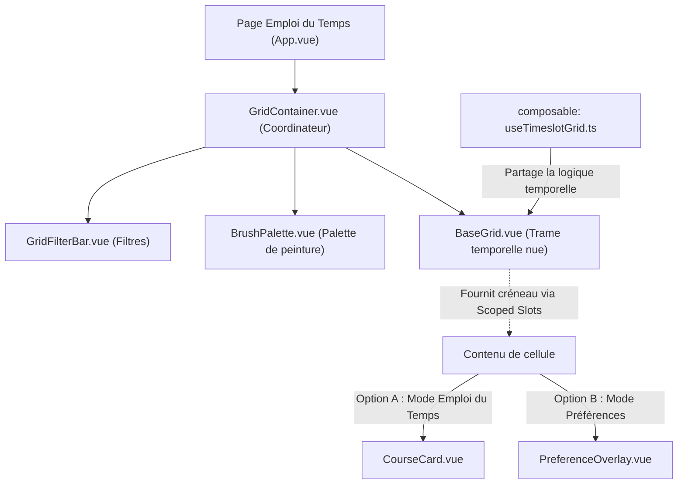

# Feature Specification: Améliorations Fonctionnelles et Socle Technique pour l'Emploi du Temps Annuel

**Feature Branch**: `002-yearly-timetabling-core`

**Created**: 2026-05-17

**Status**: Draft

## Clarifications

### Session 2026-05-17
- Q: Mode d'interaction et filtrage pour la gestion multi-établissement (Cité Scolaire) → A: Option A (Affichage contextuel : un menu déroulant global permet de sélectionner l'établissement actif. La grille et les listes n'affichent par défaut que ses ressources/classes/cours, tout en préservant la visibilité et la protection contre les conflits des professeurs et salles partagés).
- Q: Échelle et volume de données cibles (Stress-test & Performance) → A: Option B (Structure pilote / Petite taille : jusqu'à 500 élèves, 40 enseignants, 30 salles, 20 classes).
- Q: Déclarations de Hors-Scope (Out-of-Scope) → A: Option A (Exclusion de l'affectation nominative/individuelle des élèves dans les groupes, et de la synchronisation collaborative temps réel).
- Q: Résolution des conflits lors de la modification de structures déjà planifiées → A: Option A (Dépositionnement automatique des cours impactés vers le statut UNPLACED avec boîte de dialogue de confirmation et historique de diagnostic).
- Q: Consolidation visuelle des attributs divergents dans la Fiche T (Fiche Cours Cumulée) → A: Option A (Consolidation par Chips stylisées : les attributs communs s'affichent normalement et les attributs divergents sont regroupés sous forme de pastilles/chips avec un indicateur visuel de divergence et un badge de proportion comme `[2/3]`).
- Q: Positionnement de la Fiche T sur l'écran → A: Popin déplaçable (draggable) par glisser-déposer de son en-tête pour ne pas masquer la grille horaire en dessous.

## Out of Scope
Pour cette itération, les fonctionnalités suivantes sont explicitement exclues du périmètre technique et fonctionnel :
1. **Affectation nominative individuelle des élèves** : Le système gère uniquement les structures (Divisions, ClassParts, Groupes) avec leurs effectifs numériques globaux. Aucun suivi nominatif individuel ou gestion d'inscriptions d'élèves par fiche n'est inclus.
2. **Synchronisation collaborative temps réel** : La gestion des conflits d'édition simultanée par plusieurs utilisateurs (type Google Docs) est exclue. Le verrouillage standard de la base SQLite et des sessions utilisateur classiques suffit.

## User Scenarios & Testing *(mandatory)*

### User Story 1 - Saisie et gestion du socle via le CRUD Générique (Priority: P1)

En tant qu'administrateur scolaire, je veux pouvoir ajouter, modifier, lister et supprimer l'ensemble des ressources de base de l'établissement (Matières, Professeurs, Groupes, Salles, Classes, Parties de classe, Alternances, Sites, Matériels, Créneaux) via des formulaires et des listes unifiés et génériques, afin de ne pas avoir à réimplémenter du code répétitif pour chaque nouvel écran de saisie.

**Why this priority**: C'est le fondement indispensable de l'application. Sans saisie propre de l'ensemble de ces données de base interconnectées, aucun emploi du temps ne peut être planifié ou calculé.

**Independent Test**: L'utilisateur peut ajouter n'importe quelle ressource (ex: un nouveau Site ou un nouveau Matériel) via le système de formulaires génériques, et la voir instantanément dans la table générique associée, prête à être rattachée à des cours.

**Acceptance Scenarios**:

1. **Given** un formulaire générique de création vide pour n'importe quelle entité de base, **When** l'utilisateur remplit les champs requis et valide, **Then** la ressource est enregistrée en base de données et listée dynamiquement.
2. **Given** un cours existant, **When** le planificateur consulte sa fiche ou sa popin, **Then** il peut y rattacher de manière optionnelle ou obligatoire les différentes ressources correspondantes (Matières, Professeurs, Groupes, Salles, Classes, Parties de classe, Alternances, Sites, Matériels), et l'affecter à au plus 1 créneau (0 ou 1) de la grille.

---

### User Story 2 - Planification avancée annuelle (Alternances A/B, Groupes) (Priority: P1)

En tant que planificateur, je veux pouvoir définir des alternances (Semaine A / Semaine B) pour les cours en quinzaine, et découper mes divisions (classes) en sous-groupes (ex: demi-classes, groupes de spécialités), afin de gérer la complexité réelle d'un établissement scolaire.

**Why this priority**: C'est ce qui distingue un prototype d'un véritable outil d'emploi du temps annuel pour collèges et lycées.

**Independent Test**: L'utilisateur peut diviser la classe de "3ème A" en deux groupes "Groupe 1" et "Groupe 2", et planifier un cours de TP de Physique pour le "Groupe 1" uniquement en Semaine A, et un autre pour le "Groupe 2" en Semaine B.

**Acceptance Scenarios**:

1. **Given** une division existante, **When** l'utilisateur définit un découpage en groupes, **Then** ces sous-groupes deviennent éligibles comme destinataires d'un cours.
2. **Given** un cours de quinzaine, **When** le cours est assigné à la Semaine A, **Then** le solveur s'assure qu'aucun conflit n'est généré sur la semaine B pour les mêmes ressources.

---

### User Story 3 - IHM Métier : La Fiche T (Priority: P2)

En tant que planificateur, lorsque je sélectionne un ou plusieurs cours sur ma grille ou dans ma liste latérale, je veux voir apparaître une popin qui résume visuellement toutes les données de ces cours, par type de ressource liée (matière, enseignant, division, groupe, partie de classe, salle, personnel, matériel), afin d'avoir une vision synthétique claire de ma sélection. Si je n'ai sélectionné qu'un seul cours, je veux pouvoir modifier directement chacune de ces ressources depuis la Fiche T, sans avoir à ouvrir un autre écran. Je veux pouvoir déplacer (glisser-déposer de son en-tête) cette popin de petite taille sur l'écran afin de ne pas masquer la grille horaire en dessous, et je veux qu'elle disparaisse dès que je quitte l'écran du Visualiseur (elle ne doit pas rester affichée, avec une sélection obsolète, derrière un autre écran de l'application).

**Why this priority**: Permet un diagnostic, une consultation et une correction rapide des ressources d'un cours (ou d'une sélection complexe de cours) sans surcharger l'écran principal ni multiplier les allers-retours vers un formulaire séparé.

**Independent Test**: Sélectionner un seul cours sur la grille, modifier directement l'une de ses ressources (ex: ajouter un enseignant) depuis la Fiche T, et valider que le changement est persisté et immédiatement répercuté sur la grille. Sélectionner ensuite 3 cours distincts, ouvrir la Fiche T, déplacer la popin par drag-and-drop, et valider que l'ensemble de leurs détails consolidés s'affiche fidèlement en lecture seule. Enfin, changer d'écran (ex: vers la liste des Enseignants) et valider que la Fiche T disparaît.

**Acceptance Scenarios**:

1. **Given** un seul cours sélectionné, **When** l'utilisateur ajoute ou retire une ressource (enseignant, division, groupe, partie de classe, salle, personnel, matériel) depuis la Fiche T, **Then** le changement est enregistré côté serveur (soumis aux mêmes règles de validation et de détection de conflit que toute autre modification de cours) et la Fiche T se met à jour avec l'objet cours complet renvoyé par le serveur (une modification pouvant en cascader une autre, ex: cascade `groups` ↔ `class_parts`).
2. **Given** un cours composé sélectionné dont `decomposition_status` n'est pas `FULLY_VENTILATED`, **When** la Fiche T affiche ses ressources, **Then** les ressources listées dans `underventilated_resource_ids` (absentes de tous ses enfants) sont visuellement signalées (fond rouge) dans leur étiquette respective.
3. **Given** plusieurs cours sélectionnés, **When** l'utilisateur ouvre la Fiche T, **Then** les attributs communs (ex: même matière) s'affichent normalement et les attributs divergents (ex: salles différentes) sont clairement identifiés et consolidés, en lecture seule (l'édition directe n'est proposée qu'à 1 seul cours sélectionné).
4. **Given** la Fiche T affichée, **When** l'utilisateur clique-glisse l'en-tête de la popin, **Then** la popin suit le mouvement de la souris et se repositionne à l'endroit désigné, sans interférer avec la grille d'emploi du temps sous-jacente.
5. **Given** la Fiche T affichée avec une sélection de cours, **When** l'utilisateur navigue vers un autre écran de l'application, **Then** la sélection est vidée et la Fiche T disparaît.

---

### User Story 4 - Saisie et Gestion Générique des Vœux et Indisponibilités (Priority: P2)

En tant que planificateur ou enseignant, je veux pouvoir colorer une grille horaire réutilisable pour définir les préférences et indisponibilités de *n'importe quelle ressource* (enseignants, classes, groupes, salles, équipements) : rouge pour "Indisponible" (strictement bloquant), orange pour "Souhait d'absence" (pénalisé par le solveur), et vert pour "Souhait de présence" (favorisé/récompensé par le solveur), afin que l'emploi du temps généré respecte toutes les contraintes de l'établissement.

*(Cette user story est implémentée via l'architecture modulaire de Grille Temporelle unifiée décrite dans la section "Spécifications de l'Architecture de la Grille Temporelle", en configurant la grille avec `preferenceMode = 'edit'` et `coursesMode = 'none'`)*

**Why this priority**: C'est une fonctionnalité essentielle pour la flexibilité et la qualité globale de l'emploi du temps. La gestion générique évite de devoir réécrire un modèle de contrainte pour chaque type de ressource.

**Independent Test**: Définir une salle de sport (Gymnase) indisponible le lundi matin (Rouge), un enseignant souhaitant ne pas travailler le mardi après-midi (Orange), et une classe de Terminale souhaitant être libérée le mercredi matin (Orange) mais favorisant le jeudi matin (Vert). Lancer le solveur et valider que toutes ces règles de ressources diverses sont arbitrées et respectées.

**Acceptance Scenarios**:

1. **Given** la grille des vœux générique d'une ressource sélectionnée, **When** l'utilisateur clique-glisse avec le pinceau (rouge, orange, vert), **Then** les créneaux horaires stockent la préférence correspondante pour cette ressource.
2. **Given** une ressource affectée à un cours sur un créneau marqué en rouge pour elle, **When** le solveur tente de placer le cours, **Then** une contrainte dure (Hard Constraint) bloque ce placement.
3. **Given** une ressource affectée à un cours sur un créneau marqué en orange ou vert, **When** le solveur arbitre la solution, **Then** le score souple (Soft Constraint) est respectivement pénalisé ou récompensé en fonction de la préférence.

### User Story 4b - Grille de Vœux en Multi-sélection et Légende Interactive (Priority: P2)

En tant que planificateur, je veux pouvoir sélectionner plusieurs enseignants (ou autres ressources) simultanément et visualiser une synthèse de leurs vœux sur la grille horaire du milieu :

*(Cette user story est implémentée via le composant de filtrage multi-critères "GridFilterBar.vue" et la superposition des couches de la grille temporelle décrits dans la section "Spécifications de l'Architecture de la Grille Temporelle")*

- Si un créneau a la même couleur (vert, orange, rouge ou neutre) pour tous les enseignants sélectionnés, le créneau s'affiche dans cette couleur pleine.
- Si le créneau a des préférences différentes ou partielles, il s'affiche dans un motif hachuré :
  - **Hachuré rouge** : au moins un enseignant est indisponible (rouge) sur ce créneau et les autres sont neutres.
  - **Hachuré orange** : au moins un enseignant souhaite éviter ce créneau (orange) et les autres sont neutres.
  - **Hachuré vert** : au moins un enseignant préfère ce créneau (vert) et les autres sont neutres.
  - **Hachuré bleu** : les contraintes diffèrent entre les enseignants (mélange de différentes couleurs actives, par exemple vert + orange, vert + rouge, etc.).
- Si je peins un créneau de la grille en multi-sélection, le vœu s'applique simultanément à l'ensemble des enseignants sélectionnés (ce qui le transforme en couleur pleine lors de l'actualisation).
- Je veux pouvoir ouvrir une popin d'aide contenant la légende complète de la grille en cliquant sur un bouton d'aide (point d'interrogation ❓) en haut à droite du composant.
- **Sélection obligatoire de période** : Lorsqu'un type de période est sélectionné (par exemple Trimestre), l'application sélectionne par défaut toutes les périodes de ce type. Pour assurer la cohérence logique des vœux, l'utilisateur ne peut pas décocher toutes les périodes : si la dernière période cochée restante est décochée par l'utilisateur, l'action est annulée et la période reste cochée.
- **Compteur numérique en multi-sélection** : Pour les cases hachurées (divergences/préférences partielles en multi-sélection), un compteur au format `X/Y` (ex: `2/3`) est affiché au centre de la case pour indiquer la proportion de ressources ayant une préférence active (non-neutre) sur ce créneau.
- **Tooltip détaillé dynamique** : Au survol d'une case de la grille, si et seulement si celle-ci présente une hétérogénéité (case hachurée indiquant des divergences temporelles ou entre ressources), un tooltip contextuel affiche le détail nominatif des vœux de chaque ressource sélectionnée par semaine (A/B/W) et par période d'application. Si les préférences sont parfaitement uniformes, le tooltip ne s'affiche pas pour ne pas surcharger l'interface. Ce tooltip se masque également automatiquement lors d'une action de dessin (clic enfoncé) pour libérer la vue lors de la saisie.

**Acceptance Scenarios**:
1. **Given** plusieurs enseignants sélectionnés, **When** la grille des vœux est affichée, **Then** les créneaux avec des préférences identiques sont colorés en couleur pleine, et les créneaux avec des préférences mixtes/partielles s'affichent sous forme hachurée (rouge, orange, vert ou bleu selon la règle).
2. **Given** plusieurs enseignants sélectionnés, **When** l'utilisateur clique ou glisse pour peindre un créneau, **Then** le vœu est sauvegardé en base de données pour chacun des enseignants sélectionnés en parallèle.
3. **Given** la grille de vœux, **When** l'utilisateur clique sur le bouton d'aide ❓ en haut à droite, **Then** une popin d'aide s'ouvre, affichant la légende des couleurs, des hachures, et le compteur numérique de multisélection.
4. **Given** un type de période actif, **When** l'utilisateur essaie de décocher toutes les périodes, **Then** la dernière période restante est maintenue cochée pour forcer au moins une période sélectionnée.
5. **Given** la grille de vœux en multi-sélection, **When** l'utilisateur survole une cellule hachurée (non uniforme), **Then** un tooltip s'affiche avec la répartition détaillée par ressource, et **When** la cellule survolée est uniforme (couleur pleine ou neutre) ou que le bouton de la souris est enfoncé (mode dessin/peinture), le tooltip disparaît immédiatement.

### User Story 5 - Navigation fluide et structurée via Notebooks Imbriqués et Multi-panneaux (Priority: P2)

En tant que planificateur, je veux naviguer dans l'application via une interface structurée sous forme d'onglets (notebooks) imbriqués configurables dynamiquement, et pouvoir diviser mes écrans de travail les plus bas en plusieurs panneaux redimensionnables verticalement par glisser-déposer, afin de visualiser et d'éditer simultanément différentes données (par exemple, afficher la liste des enseignants à côté de leur formulaire d'édition).

**Why this priority**: Cette ergonomie moderne élimine la navigation complexe par menus séparés, améliore la productivité en permettant le multi-panneaux côte à côte (ex: liste + formulaire), et standardise le squelette visuel complet de l'application sous forme de configuration déclarative.

**Independent Test**:
Charger une configuration JSON décrivant un arbre de notebooks avec au niveau 1 "Emploi du temps" (pleine largeur) et "Paramètres". Dans "Paramètres", accéder au sous-onglet "Enseignants" divisé verticalement en 2 panneaux : la liste générique à gauche et le formulaire générique à droite. Cliquer sur la barre de séparation entre les deux panneaux et la faire glisser pour modifier leur largeur respective. Vérifier que la nouvelle largeur est appliquée de façon fluide.

**Acceptance Scenarios**:

1. **Given** une structure JSON de configuration valide fournie à l'application, **When** l'application démarre, **Then** elle génère dynamiquement l'arbre complet des onglets à un ou plusieurs niveaux de profondeur, avec le titre, la couleur de fond ou la couleur de liseré supérieur définie pour chaque onglet.
2. **Given** un onglet feuille contenant plusieurs panneaux verticaux juxtaposés, **When** l'utilisateur clique-glisse sur la barre de séparation (splitter) située entre deux panneaux, **Then** la largeur des deux panneaux adjacents est mise à jour dynamiquement selon la position de la souris sans altérer leur rendu fonctionnel.
3. **Given** un onglet avec fond coloré défini dans le JSON, **When** l'onglet est rendu à l'écran, **Then** son en-tête affiche la couleur de fond spécifiée et son texte s'affiche en gras et en blanc.
4. **Given** un onglet avec liseré supérieur coloré défini dans le JSON, **When** l'onglet est rendu à l'écran, **Then** son en-tête affiche une bordure supérieure colorée de la couleur spécifiée.

---

### Edge Cases

- **Chevauchement de vœux et de cours verrouillés** : Si un cours est manuellement épinglé (pinned) sur un créneau qu'un professeur a marqué en rouge (Indisponible), le système doit alerter l'utilisateur de ce conflit direct.
- **Modification de groupes contenant des élèves / ressources planifiées** : Si un groupe, une division ou une ressource (professeur, salle) est supprimée ou modifiée en profondeur alors que des séances y sont déjà placées sur la grille, le système présente une boîte de dialogue de confirmation listant les cours impactés. Après validation de l'utilisateur, les cours affectés sont automatiquement dépositionnés sur la grille (leur statut repasse en `UNPLACED` et leur créneau est libéré) afin de maintenir la cohérence de la base.

## Requirements *(mandatory)*

### Functional Requirements

- **FR-001**: **Moteur CRUD Générique (Socle)** : Le système doit fournir un mécanisme générique côté backend et frontend pour générer les formulaires et les listes pour toutes les entités de base (y compris les nomenclatures) : *Matières, Professeurs, Groupes, Salles, Classes, Parties de classe, Alternances, Sites, Matériels, Créneaux, MEFs, Disciplines, Missions, Méthodes d'élection et Périodes*.
- **FR-002**: **APIs Génériques** : Le backend doit exposer des points d'accès API unifiés, typés et réutilisables pour les opérations CRUD de chaque type de ressource de base. Les mises à jour s'effectuent via la méthode HTTP `PATCH` (au lieu de `PUT`) pour permettre des modifications partielles et groupées (bulk updates). Le serveur ne met à jour en base de données que les champs qui ont été explicitement fournis dans le corps de la requête JSON (grâce à l'utilisation de `exclude_unset=True` sur le schéma Pydantic de validation). Seules les champs modifiés dans la vue formulaire (ou la vue liste si elle est en mode édition) sont envoyés au serveur.
- **FR-003**: **Composants Frontend Réutilisables** : Le frontend doit utiliser des composants de tableau (`GenericList`) et de formulaire (`GenericForm`) dynamiques pour éviter la duplication de code pour tous les types de ressources.
- **FR-004**: **Génération Dynamique Low-Code via OpenAPI** : Les formulaires (`GenericForm`) et les listes (`GenericList`) du panneau d'administration doivent être générés dynamiquement par le frontend en introspectant le schéma OpenAPI (`/openapi.json`) exposé par le backend (à l'adresse http://localhost:8000/api/docs). Les champs, types de données, validations (requis, min, max, format) et métadonnées UI (label, placeholder, type de composant, info-bulles d'aide) sont déduits automatiquement des modèles Pydantic via l'attribut `json_schema_extra`. Cela élimine totalement le besoin de définir statiquement "en dur" la structure des entités ou leurs formulaires dans le code frontend.
Concernant le composant `GenericList`, il doit offrir nativement les fonctionnalités suivantes :
  1. Pagination (par défaut 30 éléments par page, avec possibilité de modifier ce nombre).
  2. Redimensionnement manuel de la largeur des colonnes.
  3. Réordonnancement des colonnes via glisser-déposer (drag-and-drop) de leurs en-têtes.
  4. Sélecteur de colonnes accessible via un bouton icône dans l'en-tête Action permettant de cocher/décocher les colonnes à afficher.
  5. Tri des données en cliquant sur l'en-tête de n'importe quelle colonne.
  6. Recherche / filtrage spécifique sur chaque colonne.
  7. **Multisélection par cases à cocher** : Une colonne de cases à cocher à gauche de la liste, avec une case à cocher globale dans l'en-tête pour tout cocher/décocher.
  8. **Mise en surbrillance** : Toute ligne sélectionnée par sa case à cocher ou via les raccourcis se colore de manière distincte en surbrillance.
  9. **Badge de comptage de sélection** : Dès qu'au moins un élément est sélectionné, un badge affiche le nombre d'éléments sélectionnés en bas dans la zone de pagination.
  10. **Raccourcis de sélection** :
      - *Maj + Clic* : Sélectionne tous les éléments contigus entre le premier et le dernier élément cliqué.
      - *Ctrl + Clic / Cmd + Clic* : Sélectionne/désélectionne des éléments non contigus.
      - *Ctrl + A / Cmd + A* : Sélectionne d'un coup tous les éléments affichés de la liste.
  11. **Bulle d'aide Markdown (attribut `help`)** : Les colonnes peuvent être configurées avec un attribut optionnel `help` contenant du texte d'aide au format Markdown. Un point d'interrogation en exposant (couleur bleue `rgba(1, 128, 165)`) s'affiche alors à droite du libellé de l'en-tête de colonne. Au survol de la souris, un tooltip sur fond sombre s'affiche avec le texte d'aide formaté en HTML (Markdown converti, respectant les sauts de ligne).
Concernant le composant `GenericList`, il doit offrir nativement les fonctionnalités suivantes :
  12. **Structure de configuration optionnelle (`listConfig`)** :
      - `editableInline` : booléen indiquant si l'on peut éditer les enregistrements directement dans la liste (par défaut `true`).
      - `allowMultiSelect` : booléen permettant ou non d'activer la multisélection/les cases à cocher (par défaut `true`).
      - `columns` : configuration fine pour chaque colonne, comprenant :
        - `visibleByDefault` : booléen (par défaut `true`) coché par défaut dans le sélecteur de colonnes.
        - `overrideLabel` : intitulé optionnel surchargé (s'il est spécifié).
        - `readOnly` : booléen (par défaut `false`) pour rendre un champ ou une colonne non modifiable en ligne.
        - `required` : booléen (par défaut `false`) indiquant si la saisie est obligatoire pour cette colonne lors de l'édition en ligne.
        - `help` : texte d'aide au format Markdown décrivant le rôle ou le fonctionnement de la colonne.
Concernant le composant `GenericForm`, il doit offrir les fonctionnalités suivantes :
  1. **Bulle d'aide Markdown (attribut `help`)** : Les champs de saisie peuvent être configurés avec un attribut optionnel `help` contenant du texte d'aide au format Markdown. Un point d'interrogation en exposant (couleur bleue `rgba(1, 128, 165)`) s'affiche à droite du libellé du champ. Au survol, un tooltip sur fond sombre affiche le texte Markdown formaté, y compris ses sauts de ligne.
  2. **Structure de configuration optionnelle (`formConfig`)** :
     - `editableForm` : booléen indiquant si l'on peut éditer les enregistrements dans le formulaire (par défaut `true`).
     - `fields` : configuration fine et structurée pour la mise en page et la sélection des éléments du formulaire. Si non spécifié, tous les attributs du modèle sont intégrés par défaut. Cette structure supporte les balises de structure de type Odoo suivantes pour organiser les formulaires de manière professionnelle :
       - **Champs standards** :
         - `key` : clé de l'attribut (ex: `code`, `last_name`).
         - `readOnly` : booléen (par défaut `false`) indiquant si l'attribut est en lecture seule dans le formulaire.
         - `required` : booléen (par défaut `false`) indiquant si la saisie de l'attribut est obligatoire dans le formulaire.
         - `overrideLabel` : intitulé textuel optionnel pour surcharger l'étiquette par défaut.
         - `help` : texte d'aide au format Markdown pour décrire le rôle ou le fonctionnement du champ.
       - **Structure `group`** : Définit un conteneur organisant ses enfants sous forme de colonnes (par exemple un layout sur 2 colonnes ou plus, avec un alignement soigné des étiquettes et des champs). Un groupe peut éventuellement porter une étiquette de titre (`string`). Les éléments enfants (`children`) d'un groupe peuvent être des champs ou d'autres sous-structures.
       - **Balise `separator`** : Ajoute un séparateur visuel horizontal (`<hr>`) accompagné d'un titre optionnel, idéal pour structurer les différentes sections logiques d'un formulaire dense.
       - **Balise `newline`** : Force un saut de ligne dans le layout en cours, permettant aux éléments suivants de commencer sur une nouvelle ligne de la grille (utile dans les mises en page multi-colonnes).
  3. **Comportement en Multi-sélection (Édition en masse)** : Lorsque plusieurs ressources sont sélectionnées dans la liste associée, le formulaire s'affiche en mode d'édition groupée :
     - **Champs identiques** : Si un champ possède la même valeur pour toutes les ressources sélectionnées, il est pré-rempli avec cette valeur commune.
     - **Champs divergents** : Si un champ possède des valeurs différentes parmi les ressources sélectionnées, il est affiché vide avec un fond grisé (et un placeholder indicatif) mais reste éditable.
     - **Indicateurs visuels de modification** : Lorsqu'un champ (qu'il soit identique ou divergent) est modifié par l'utilisateur, sa bordure se colore en vert et un badge vert `✏️ Modifié` s'affiche à côté de son libellé.
     - **Bandeau d'information contextuel** : Un bandeau d'explication clair s'affiche en haut du formulaire pour expliquer à l'utilisateur que seuls les champs modifiés (marqués du badge `✏️ Modifié` et de la bordure verte) seront enregistrés et appliqués en masse lors du clic sur le bouton "Enregistrer".
     - **Enregistrement partiel (PATCH)** : La soumission du formulaire envoie des requêtes HTTP `PATCH` contenant uniquement les champs explicitement modifiés, préservant ainsi les valeurs non éditées des autres champs pour chaque ressource sélectionnée.
- **FR-004**: **Gestion des Alternances (Quinzaine)** : Le modèle de données et le solveur doivent supporter les alternances temporelles (Semaine A / Semaine B / Toutes les semaines).
- **FR-005**: **Gestion des Groupes et Sous-groupes** : Les divisions doivent pouvoir être partitionnées en sous-groupes (ex: demi-classes, groupes de spécialités), avec support des conflits d'intersection d'élèves par le solveur.
- **FR-006**: **Fiche T** : Une popin métier unifiée doit permettre de visualiser, et — lorsqu'un seul cours est sélectionné — de modifier directement les ressources d'un cours (matière, enseignants, divisions, groupes, parties de classe, salles, personnel, matériels) via les mêmes widgets génériques que les vues génériques (sélecteur simple pour la matière, multiselect avec étiquette + croix de suppression + recherche pour les autres). Avec 2 cours sélectionnés ou plus, l'affichage repasse en consultation synthétique et consolidée en lecture seule : les ressources communes (ex: même matière) s'affichent de façon standard, tandis que les ressources divergentes (ex: enseignants ou salles différents) sont regroupées sous forme de pastilles (chips) stylisées dotées d'un indicateur visuel de divergence (bordure ou couleur contrastée) et d'un badge de proportion (ex: `[2/3]`). Un compteur de ressources distinctes est affiché à gauche de chaque type. Pour un cours composé pas encore `FULLY_VENTILATED`, les ressources listées dans `underventilated_resource_ids` sont surlignées. **La popin doit être déplaçable (draggable) par glisser-déposer (drag-and-drop) de son en-tête**, afin de permettre au planificateur de dégager la vue sur la grille horaire sous-jacente, et disparaît dès que le planificateur quitte l'écran du Visualiseur.
- **FR-007**: **Grille de Vœux Générique** : L'IHM doit proposer une grille interactive réutilisable permettant de saisir graphiquement les indisponibilités (Rouge - contrainte dure), les souhaits d'absence (Orange - contrainte souple négative) et les souhaits de présence (Vert - contrainte souple positive) pour n'importe quelle ressource (Enseignants, Salles, Divisions, Équipements).
- **FR-008**: **Calcul Polymorphique des Vœux** : Le solveur Timefold doit intégrer les vœux et indisponibilités de manière générique dans son modèle de contraintes (Hard pour les créneaux rouges de toute ressource affectée, Soft pénalité pour les créneaux oranges, Soft bonus pour les créneaux verts).
- **FR-009**: **Objet Cours, Durée et Attributs Métiers** : Chaque cours doit porter des attributs propres définis en amont de son placement : une durée (exprimée en nombre de créneaux élémentaires ou minutes), un libellé (généré dynamiquement à partir des ressources rattachées), un mémo (texte libre) et une planification sur la grille horaire via des séances rattachées (0 ou 1 créneau de départ, avec extension contiguë sur la durée du cours).
- **FR-010**: **Données de Démo Réalistes** : La base de données SQLite doit être alimentée par défaut avec un jeu d'essai réaliste et complet couvrant les 9 types de ressources rattachables, plusieurs cours complexes N-à-N créés, et des grilles de vœux pré-remplies (avec créneaux rouges, oranges, verts) pour plusieurs profs/salles, afin de permettre un test direct.
- **FR-011**: **Filtrage Multi-Établissement (Cité Scolaire)** : L'interface utilisateur doit proposer un menu déroulant global permettant de sélectionner l'établissement actif (ex: Collège). La grille et les listes n'affichent par défaut que les ressources (classes, cours) de l'établissement actif, tout en préservant la protection contre les conflits et la visibilité des ressources partagées (professeurs, salles communes).
- **FR-012**: **Notebooks Imbriqués Génériques par Configuration JSON** : L'application doit structurer son ergonomie globale sous forme d'un arbre d'onglets (notebooks) à plusieurs niveaux de profondeur. Ce composant de navigation et de mise en page doit être entièrement générique et alimenté par une structure JSON décrivant l'arbre complet des onglets, leurs titres, leurs attributs de style (couleur de fond, liseré supérieur) et les panneaux qu'ils contiennent.
- **FR-013**: **Affichage Multi-Panneaux Verticaux** : Lorsqu'un onglet se situe au niveau le plus bas de la hiérarchie (une feuille de l'arbre), il peut être divisé verticalement en 1 à N panneaux. Chaque panneau doit pouvoir afficher au choix :
  1. Un composant liste générique (`GenericList`)
  2. Un composant formulaire générique (`GenericForm`)
  3. L'un des composants personnalisés de l'application (comme la grille d'emploi du temps `TimetableGrid` ou la grille de saisie des vœux/contraintes `PreferenceGrid`).
- **FR-014**: **Redimensionnement Dynamique des Panneaux (Splitter)** : Lorsqu'un onglet contient plusieurs panneaux verticaux juxtaposés, une barre de redimensionnement vertical (splitter) doit séparer chaque panneau. L'utilisateur doit pouvoir cliquer sur cette barre et la faire glisser (drag-and-drop) pour modifier en temps réel et de manière fluide la largeur des panneaux adjacents.
- **FR-015**: **Personnalisation Visuelle des Onglets via la Configuration JSON** : Chaque onglet défini dans la structure JSON de configuration peut porter des attributs de style spécifiques pour son en-tête (titre) :
  - **Option Fond Coloré** : L'en-tête de l'onglet est entièrement rempli avec une couleur de fond spécifiée. Le texte du titre de l'onglet s'affiche alors automatiquement en blanc et en gras.
  - **Option Liseré Supérieur Coloré** : L'en-tête de l'onglet conserve son fond neutre mais affiche un liseré (bordure supérieure colorée) d'une épaisseur de quelques pixels de la couleur spécifiée dans le JSON.
- **FR-016**: **Thème Général Clair bg-gray-300** : Le thème visuel de l'application doit être unifié vers une apparence claire et premium. L'arrière-plan de l'application doit utiliser un ton gris/blanc cassé doux correspondant à la teinte standard de design `bg-gray-300` (ou son équivalent hexadécimal/HSL clair), offrant un excellent contraste avec les textes sombres et les onglets colorés.

### Business Rules & Solver Logic

Cette section documente les lois fondamentales que le solveur (Timefold) et les validateurs backend (SQLAlchemy) doivent respecter de manière absolue ou prioriser selon le type de contrainte.

**Typologie des règles :**
- 🔴 **Hard Rule (Stricte)** : Règle absolue. Le solveur n'a pas le droit de l'enfreindre. Toute violation rend l'emploi du temps "irréalisable" ou "invalide".
- 🟢 **Soft Rule (Souple / Facultative)** : Règle d'optimisation. Le solveur doit faire le maximum pour la respecter (en pénalisant ou récompensant le score), mais est autorisé à l'enfreindre si c'est le seul moyen d'obtenir une grille complète.

**BR-001: Règle Globale d'Exclusivité des Ressources (Grille Hebdomadaire)**
> **Nature : 🔴 Hard Rule (Stricte)**
> **Principe d'interdiction :** Il est strictement interdit à deux cours distincts d'occuper simultanément une même ressource (Enseignant, Salle, Division, Personnel) sur une même case de la grille de modélisation hebdomadaire. *Cas particulier de la Salle : voir « Domaines de résolution du solveur » ci-dessous — l'exclusivité d'une salle-feuille précise déjà résolue est vérifiée dès le placement horaire, tandis qu'un simple besoin de groupe (pas encore résolu en salle précise) n'est vérifié qu'en capacité agrégée à ce stade, la résolution précise étant déportée à une résolution automatique dédiée.*
> 
> **Exceptions (Principe d'Orthogonalité) :** Ce chevauchement virtuel sur la grille est autorisé si et seulement si les deux cours satisfont l'une des trois conditions d'orthogonalité suivantes :
> 1. **Orthogonalité Structurelle (Inclusion - Cours Composés) :** Les deux cours représentent le même événement physique (ex: l'un est le cours composé parent et l'autre est son cours simple enfant, ou il s'agit de deux cours simples enfants issus du même cours composé). Leurs ressources sont donc naturellement partagées et ne sont pas en double réservation.
> 2. **Orthogonalité Hebdomadaire (Alternance) :** Les cours n'ont jamais lieu la même semaine (ex: Semaine A vs Semaine B).
> 3. **Orthogonalité Périodique (Calendrier) :** Les cours n'ont jamais lieu au cours de la même période de l'année (ex: Semestre 1 vs Semestre 2).
> 
> **Mécanisme d'Incompatibilité Transitive (Classes, Parties et Groupes) :**
> Si les ressources simples (enseignant, salle) sont naturellement exclusives, les entités d'élèves nécessitent une évaluation spécifique en raison de leurs imbrications. La `ClassPart` (ou `Division` si non subdivisée) agit comme la ressource atomique standard, mais son exclusivité s'étend via :
> - **Lien d'Incompatibilité (`ClassPartLink`)** : Deux parties de classe distinctes ne peuvent avoir cours en même temps si elles partagent un lien d'incompatibilité (indiquant des élèves en commun) ou si elles appartiennent à la même division sans être issues de partitions orthogonales.
> - **Transitivité sur les Groupes** : Un `Group` n'étant qu'un conteneur abstrait agrégeant plusieurs `ClassParts`, le solveur interdit automatiquement le placement simultané de deux groupes si au moins une `ClassPart` du premier groupe est en conflit avec une `ClassPart` du second. Il n'y a donc aucun "lien de groupe" en base de données : tout se déduit par transitivité.

**BR-002: Politique d'Arbitrage des Vœux (Préférences Temporelles des Ressources)**
> **Nature : Hybride (🔴 Hard & 🟢 Soft)**
> La grille de vœux permet d'exprimer des desiderata temporels pour chaque ressource (enseignant, salle, classe, etc.) ainsi que pour chaque **Cours** directement. Le solveur doit appliquer le traitement suivant :
> - **Indisponibilité Stricte (Rouge) :** 🔴 **Hard Rule**. Le solveur n'a jamais le droit de placer un cours (ou une ressource impliquée) sur ce créneau.
> - **Souhait d'Absence (Orange) :** 🟢 **Soft Rule (Pénalité)**. Le solveur doit faire le maximum pour éviter ce créneau. S'il est forcé de l'utiliser, le score global de qualité de l'emploi du temps diminue.
> - **Souhait de Présence (Vert) :** 🟢 **Soft Rule (Bonus)**. Le solveur doit être encouragé à utiliser ce créneau préférentiellement aux autres créneaux neutres.
>
> **Cas particulier des préférences de Cours** :
> Une préférence associée directement à un cours (`resource_type == 'Course'`) s'applique obligatoirement à **toutes les semaines** (`week_type = 'W'`, non modifiable pour ce type de ressource) et à **l'année entière** (aucune `Period` associée — liste `periods` vide). Ce n'est plus une valeur héritée du `Course` référencé et resynchronisée à chaque modification de celui-ci (cette propagation automatique existait dans une version antérieure de ce document et a été retirée : elle reposait sur une incompréhension du besoin réel) — c'est une contrainte fixe sur ce type de ressource, imposée dès la création et à toute modification ultérieure.

**BR-003: Respect des Limites de Travail et Logistiques (ResourceConstraints)**
> **Nature : Majoritairement 🔴 Hard Rule (Stricte)**
> Les contraintes structurelles définies par ressource (ex: Max heures par jour, limitation du nombre de demi-journées, temps de trajet inter-sites) garantissent la viabilité légale, logistique et physiologique de l'emploi du temps. 
> Ces plafonds sont des règles absolues que le solveur doit respecter intégralement sous peine d'échec de la validation.
> *Note d'optimisation : Seuls certains paramètres qualitatifs liés au confort (ex: `max_gap_hours_per_week` / trous dans l'emploi du temps) agissent comme des règles souples (🟢 Soft).*

**BR-004: Option de Non-Chevauchement des Récréations (`Course.forbid_break_overlap`)**
> **Nature : 🔴 Hard Rule (Stricte, opt-in par cours)**
> Un cours peut activer l'option `forbid_break_overlap` pour interdire qu'il chevauche une récréation (matin et/ou après-midi) définie au niveau système (`SystemSetting.HOUR_MORNING_BREAK_START_MINUTES_AFTER_MIDNIGHT` / `HOUR_AFTERNOON_BREAK_START_MINUTES_AFTER_MIDNIGHT`, voir « Grille horaire » ci-dessous).
>
> **Sémantique du chevauchement** : la récréation n'est stockée en base que par sa minute de *début* (aucune durée). Un cours est donc considéré en chevauchement s'il **contient strictement** cet instant (heure de début du cours strictement antérieure à la récréation ET heure de fin strictement postérieure) — bornes strictes : un cours qui démarre ou se termine exactement à la minute de la récréation est autorisé. Chaque récréation (matin, après-midi) est évaluée indépendamment, et ignorée si elle n'est pas définie au niveau système.
>
> **Application** : vérifié à la fois en placement manuel (`Course.validate_placement_conflicts`, rejet immédiat côté API) et par le solveur automatique (contrainte dure `course_break_overlap`) — un cours avec l'option activée pour lequel aucun créneau valide n'existe reste non placé plutôt que d'être forcé sur un créneau qui chevauche la récréation.

### Domaines de résolution du solveur : Placement des cours et Attribution des salles

Contrairement à une hypothèse initiale de conception, la salle n'est **pas** une variable résolue dans la même passe Timefold que le créneau horaire et la semaine d'alternance. Une étude comparative de logiciels concurrents plus matures (UnDeuxTEMPS, EDT/Index Éducation, Charlemagne/Aplim) a montré qu'ils séparent structurellement le placement horaire de l'attribution précise des salles — et que ce découplage répond à un problème réel : les préférences de salle (fines, volatiles) ne doivent influencer qu'un choix secondaire, une fois la grille horaire posée, plutôt que de polluer le score qui pilote l'acceptation des mouvements du solveur principal. La salle est donc, pendant le placement horaire, une **ressource contrainte** (une exigence de quantité sur un groupe de salles, garantissant qu'« au moins une salle du groupe sera libre », voir **CourseClassroomRequirement**, section 10bis) plutôt qu'une variable résolue directement — le choix de la salle précise est déporté vers une résolution dédiée, ultérieure, pilotée par les préférences (professeur, division, ordre, capacité).

Deux domaines Timefold distincts en résultent, désignés `COURSE_PLACEMENT` (créneau + semaine) et `CLASSROOM_ASSIGNMENT` (salle précise) dans tout ce document, plus un troisième point d'entrée (Optimisation) qui rejoue ces deux domaines à la suite — ce n'est pas un troisième domaine indépendant :

| # | Point d'entrée | Domaine / ce qui est résolu | Population des cours concernés | Conditions d'arrêt | Sémaphore/file | Mode exclusif |
|---|---|---|---|---|---|---|
| 1 | Heatmap (aide au placement, voir plus bas) | Aucune résolution — évaluation de score répétée sur le domaine `COURSE_PLACEMENT` | Cours sans parent (même domaine que `COURSE_PLACEMENT`) | N/A | Non (exempté) | Non |
| 2 | Bouton « Placement automatique » (remplace l'ancien « Générer ») | `COURSE_PLACEMENT` : créneau + semaine | Cours sans parent | 1ère solution faisable OU 5 min — le premier atteint | Oui | Oui |
| 3 | Bouton « Attribuer les salles » | `CLASSROOM_ASSIGNMENT` : la salle précise, sur les besoins de groupe | Tous les cours (parent ou enfant, quiconque porte une exigence de groupe à quantité > 0) | Durée max (5 min) + sans-amélioration (10 s) | Oui | Oui |
| 4a | Wizard « Optimiser l'emploi du temps », étape 1/1 ou 1/2 | `COURSE_PLACEMENT` | Cours sans parent | Durée max paramétrable par l'utilisateur (≤ 12h, défaut 1h) OU sans-amélioration paramétrable (défaut 15 min) | Oui | Oui |
| 4b | Wizard « Optimiser l'emploi du temps », étape 2/2 (si la case « remettre les salles à l'état groupe » est cochée) | `CLASSROOM_ASSIGNMENT` | Tous les cours | Durée max + sans-amélioration paramétrables (repli sur les valeurs de la ligne 3 si non renseignées) | Oui | Oui |

Un seul solve actif par base à la fois, quel que soit son type (pas de résolution `COURSE_PLACEMENT` et `CLASSROOM_ASSIGNMENT` en parallèle sur la même base) — la Heatmap est la seule exemption : elle continue de tourner indépendamment de tout solve en cours. Entre les étapes 4a et 4b du wizard d'optimisation, la remise à l'état groupe des salles déjà attribuées (si la case est cochée) est une simple opération de données, pas un solve Timefold — un arrêt demandé par l'utilisateur à cet instant précis est pris en compte explicitement avant de lancer l'étape 4b, pour ne jamais laisser des salles remises à l'état groupe sans être réattribuées.

**Pourquoi Timefold plutôt qu'un algorithme classique pour l'attribution des salles (`CLASSROOM_ASSIGNMENT`)**

Sans la notion de continuité (limiter les déplacements — réutiliser autant que possible la même salle pour un même professeur ou une même division à travers ses différentes séances), l'attribution des salles serait un **problème d'affectation biparti classique** par créneau : associer, pour chaque créneau, les besoins de salle aux salles libres du groupe, avec un coût = préférence + rang. Ce cas-là se résoudrait exactement et instantanément par un algorithme classique (matching biparti pondéré, type Hongrois), un par créneau, indépendamment des autres — optimal garanti, déterministe, trivial à expliquer à l'utilisateur.

**La continuité casse cette décomposition.** Elle couple les créneaux entre eux : minimiser le nombre de salles distinctes utilisées par un même professeur sur la semaine n'est plus un coût additif par affectation individuelle, c'est plus proche d'un problème de type facility-location imbriqué dans un assignment — un algorithme « classique » qui le prendrait en compte correctement (flot à coûts fixes, ILP dédié) n'a plus rien de simple à écrire ni à maintenir.

Le choix retenu est donc de rester dans Timefold pour cette résolution, pour trois raisons concrètes :
1. C'est exactement le type de contrainte molle, transversale, pondérée que les Constraint Streams savent exprimer nativement (regroupement par professeur/division, pénalisation du nombre de salles distinctes) — un algorithme classique réinventerait une partie du même mécanisme, sans l'outillage déjà en place (scoring, tests, infrastructure de solve).
2. Le sous-problème reste petit : le créneau et la semaine sont déjà figés par `COURSE_PLACEMENT` avant d'entrer dans `CLASSROOM_ASSIGNMENT`.
3. Coût de maintenance : un seul paradigme à faire évoluer dans le temps plutôt que deux en parallèle — chaque futur critère reste une ligne de contrainte en plus, pas une reformulation potentielle d'un algorithme spécialisé.

Le déterminisme et l'explicabilité qu'un algorithme classique aurait apportés sur le cas simple ne sont pas sacrifiés pour autant : l'heuristique de construction reproduit un comportement glouton par ordre/priorité (première salle-feuille libre du groupe dans l'ordre) comme point de départ — la recherche locale n'intervenant qu'ensuite, brièvement, pour améliorer la continuité.

**Affectation automatique des besoins aux professeurs — pourquoi un algorithme classique, pas Timefold**

Contrairement au placement horaire (`COURSE_PLACEMENT`/`CLASSROOM_ASSIGNMENT` ci-dessus), l'affectation d'un professeur à un `Service` non verrouillé n'est pas un problème de planification temporelle mais un **problème de transport / affectation généralisée sous capacité** : des besoins pondérés (`Service` × volume horaire, typés par discipline) à faire correspondre à des professeurs à capacité bornée (apport déclaré par discipline, puis HSA), avec un coût par correspondance (priorité de niveau, compatibilité horaire) et des exclusions dures (qualification, incompatibilités entre professeurs). Même sans aucun couplage, ce n'est déjà pas un matching biparti pur comme pour les salles par créneau : la capacité d'un professeur se consomme à travers plusieurs besoins simultanément — le baseline est donc déjà un problème de transport, classique, exactement soluble par un flot à coût minimal.

**Exigence produit qui a déterminé l'algorithme** : l'établissement doit minimiser globalement le volume d'HSA généré — si un besoin peut être couvert sans en demander à personne, il doit l'être. Un glouton qui traiterait les besoins un par un dans l'ordre de priorité ne le garantit pas (un premier besoin peut accaparer le seul professeur disponible en capacité normale et forcer un besoin suivant, de la même discipline, à déborder inutilement en HSA). Un flot à coût minimal à deux paliers de capacité par professeur (capacité normale à coût quasi nul, capacité HSA à coût volontairement écrasant) garantit cette minimisation **par construction** : il sature nécessairement tout le palier normal disponible avant de faire passer la moindre unité par le palier HSA, quel que soit l'ordre de traitement des besoins.

Les incompatibilités entre professeurs (portée : jamais dans la même équipe pédagogique, voir 3.) sont le seul couplage non représentable proprement dans ce flot — traitées par une passe de réparation après résolution (interdire l'arête du professeur en conflit et relancer une résolution complète ; si le conflit persiste, tenter l'inverse ; seulement si les deux tentatives échouent, il est surfacé comme avertissement à l'utilisateur, une certitude garantie par l'optimalité du flot et non une estimation).

Contrairement à l'attribution des salles, ce sous-problème n'a pas de sous-problème captif dans un solve Timefold déjà en cours : il a lieu **en amont de toute la chronologie de résolution** (phase pré-rentrée, avant que `Course`/`Timeslot` existent). Introduire Timefold ici serait donc un second solveur autonome à maintenir (nouvelle entité de planification, nouvelle configuration de score, nouvelle orchestration), pas une ligne de contrainte en plus dans le pipeline existant. Voir `architecture.md` §20 pour l'implémentation (graphe de flot, paliers de capacité, passe de réparation) et `specs/002-yearly-timetabling-core/teacher-assignment-proposal.md` pour l'historique complet de la conception.

Ce module ne vérifie pas la faisabilité agrégée multi-professeurs d'une même classe (ex. trois matières confiées chacune à un professeur disponible un seul jour, pour une classe fermée ce jour-là) — cette vérification reste le rôle de `COURSE_PLACEMENT`, en aval, qui dispose déjà de toutes les contraintes réelles.

**Génération des groupes de spécialité (réforme du lycée) — pourquoi aucun alignement précalculé n'est nécessaire**

À partir des vœux de spécialité saisis par élève (**StudentSpecialtyChoice**, 6quater), un wizard dédié (`wizard_specialty_group_generation.py`) répartit les élèves en groupes par matière (bin-packing glouton respectant **SpecialtyGroupConfig**, 4octies), génère les **Group**/**Partition**/**ClassPart** cross-division correspondants, puis un **MefService**/**Service** par groupe (jamais recréé si déjà présent pour ce couple MEF/matière, voir 4bis). Contrairement à ce que suggère l'usage du mot « barrette » chez les éditeurs concurrents, aucun **Alignment** (§4septies) n'est construit par ce wizard : la non-collision entre les spécialités d'un même élève est entièrement garantie par le mécanisme générique déjà en place (`ClassPartLink` auto-généré entre partitions d'une même division, contrainte solveur `group_link_conflict`) — un alignement précalculé resterait un raffinement optionnel (compacité des grilles élèves), pas une condition de correction. Voir `architecture.md` §21 pour le détail complet (comparatif des trois éditeurs étudiés, modèle de données, algorithme).

### Key Entities


- **Course (Cours)** : Un cours porte des attributs propres définis en amont de son placement : une durée (exprimée en nombre de créneaux élémentaires ou minutes), un libellé (généré dynamiquement à partir des ressources rattachées), un mémo (texte libre), une liste de ressources rattachables (voir ci-dessous) et une planification sur la grille horaire via des séances rattachées (0 ou 1 créneau de départ, avec extension contiguë sur la durée du cours).
  *   **Cours Simple** : Un cours qui n'est pas décomposé en cours simples enfants. Il est affiché comme un seul bloc sur la grille horaire.
  *   **Cours Composé** : Un cours dont le détail des ressources est subdivisé en plusieurs **cours simples enfants** pour l'affichage. Ces cours simples enfants peuvent être organisées en parallèle (alignements, ex : barrettes de langues, groupes de spécialités) ou en succession temporelle contrainte.
  **Le solveur automatique travaille toujours au niveau du cours de premier niveau (CoursSimple ou CoursComposé). Il place et déplace ces cours de premier niveau sur la grille horaire.**
  La cinémaique de définition des cours simples enfants est souple et permet :
  *   **Cinématique top-down** : Définir les ressources au niveau du cours → le marquer comme composé → créer ses cours simples enfants dans un second temps.
  *   **Cinématique bottom-up** : Créer des cours simples indépendants non placés → les regrouper en cours composé. **Contrainte** : un cours simple déjà placé sur un créneau ne peut pas être intégré dans un cours composé ; il doit d'abord être dépositionné.
  *   **Ajout post-placement** : Il est possible d'ajouter des ressources à un cours composé déjà positionné. La ventilation de ces ressources dans les cours simples enfants pourra être complété ultérieurement.
- **Ressources de base rattachables à une séance (Relations N-à-N / Many-to-Many)** :
  *   **Subjects (Matières)** : La ou les matières enseignées lors de la séance (ex : Mathématiques, Physique-Chimie).
  *   **Teachers (Professeurs)** : Le ou les enseignants encadrant la séance (supportant le co-enseignement).
  *   **Divisions (Classes)** : La ou les classes d'élèves entières associées (regroupements de classes).
  *   **ClassParts (Parties de classe)** : Une ou plusieurs sous-parties de classes (ex : Demi-classe de 3ème A - Groupe 1).
  *   **Groups (Groupes)** : Un ou plusieurs regroupements d'élèves (ex : Groupe d'Allemand LV2, Spécialité Physique).
  *   **Sites** : Le ou les sites physiques ou campus géographiques associés à la séance.
  *   **Materials (Matériels / Équipements)** : Le ou les matériels mobiles ou fixes réservables (ex : Valise d'iPad, Projecteur 3D).
  *   **Classroom requirements (Exigences de salle)** : Les besoins de salle du cours, chacun ciblant soit une salle précise (ex : Salle 102), soit un groupe de salles interchangeables (ex : Labo SVT) assorti d'une quantité — voir **CourseClassroomRequirement** (section 10bis). L'attribution d'une salle précise à partir d'un besoin de groupe est résolue par une résolution automatique dédiée, distincte du placement horaire (voir « Domaines de résolution du solveur » ci-dessous).
- **ResourcePreference** : Association polymorphique entre n'importe quel type de ressource listé ci-dessus, un créneau (Timeslot) et un niveau de préférence (Disponible [Blanc], Souhait d'absence [Orange], Indisponible [Rouge], Souhait de présence [Vert]), qualifiée par un type de semaine (Semaine A/B/Toutes) et associée à des périodes d'application.
- **Period (Période)** : Découpage temporel séquentiel de l'année scolaire (trimestres, semestres, etc.).
- **PeriodType (Type de Période)** : Catégorie ou modèle de découpage temporel de l'année scolaire (Trimestre, Semestre, etc.).
- **AlternationCalendar (Calendrier d'Alternance)** : Modélisation du rythme cyclique des semaines (Semaine A / Semaine B / Toutes) pour chaque établissement scolaire.
- **ResourceConstraint (Contrainte de Ressource)** : Définition globale pour toute l'année des contraintes réglementaires, pédagogiques ou géographiques rattachées à une ressource unique (matière, enseignant, classe, etc.). Les caractéristiques de ces contraintes s'adaptent dynamiquement selon le type de ressource.

## Spécification Détaillée des Objets et de leurs Attributs

Voici la définition formelle de chaque objet et de sa structure de données :

> [!IMPORTANT]
> **Convention transverse : toute colonne nommée `code` est déclarée `unique=True` et
> `nullable=False`**, dans tous les modèles qui en portent une — sans exception, quel que soit le
> périmètre auquel l'objet appartient. Un `code` n'est jamais un libellé local : c'est un
> identifiant, et il doit pouvoir désigner l'objet partout — impressions, imports, exports
> STS-web, URL profondes.
>
> **Un code n'est jamais suffixé ni réécrit pour contourner une collision.** Aucun mécanisme de
> génération « code libre le plus proche » n'existe dans le projet : ce serait détruire la
> propriété même qui fait d'un code une clé. Une collision est une donnée en conflit, pas un
> incident à absorber — elle est refusée par la contrainte, ou signalée à l'utilisateur.
>
> Un code **auto-généré** est donc construit pour être unique **par construction**, en reprenant
> ce sur quoi porte la recherche de l'objet. La partition de la classe `6A` couvrant les matières
> MATHS et SVT se code `6A-SCI-MATHS+SVT` : code de division (déjà unique), libellé, puis ce qui
> distingue la partition de ses sœurs de la même division (voir `_partition_code`).

### 0. School (Établissement)
Représente une entité administrative scolaire autonome (un collège, un lycée général, un lycée professionnel) coexistant au sein de la même base de données (concept de **Cité Scolaire**). Cela permet aux établissements de partager les ressources communes (professeurs partagés, salles communes, même campus) tout en conservant une gestion budgétaire, des imports/exports STSWEB et des structures de classes strictement séparés.
*   `id` : Clé primaire (Entier)
*   `uai` : Code national unique de l'établissement (anciennement RNE) (Chaîne de 8 caractères, ex: "0751234A")
*   `name` : Nom officiel de l'établissement (Chaîne, ex: "Lycée Molière")
*   `type` : Type d'établissement (Enum : `COLLEGE`, `LYCEE`, `LYCEE_PRO`, `AUTRE`)
*   `city` : Ville (Chaîne)
*   `postal_code` : Code postal (Chaîne)
*   `student_start_date` : Date de rentrée des élèves (Date, e.g. "2026-09-02")
*   `student_end_date` : Date de sortie des élèves (Date, e.g. "2027-07-04")
*   `max_pedagogic_weight_per_day` : Limite du poids pédagogique cumulé autorisé par jour (Flottant, optionnel)
*   `max_pedagogic_weight_per_morning` : Limite du poids pédagogique cumulé autorisé par matinée (Flottant, optionnel)
*   `max_pedagogic_weight_per_afternoon` : Limite du poids pédagogique cumulé autorisé par après-midi (Flottant, optionnel)

> [!NOTE]
> **Gestion globale de la granularité et combinatoire :**
> La durée standard d'un créneau élémentaire (`STANDARD_TIMESLOT_DURATION`) est un paramètre global commun à toute la base de données, configuré au niveau de l'application (entier compris entre 5 et 60 minutes, diviseur de 60, par défaut `30`).
> Une base neuve démarre **sans aucun `Timeslot`** (voir §0bis ci-dessous) : contrairement à l'ancienne version de ce paramétrage (grille initialisée d'office au pas le plus fin), la grille est désormais paramétrée explicitement via le wizard « Grille horaire », qui génère les `Timeslot` réellement nécessaires (jours ouverts × pas horaire courant) plutôt qu'une combinatoire fixe au quart d'heure.

### 0bis. Grille horaire (`SystemSetting`, `GridDaySettings`, `Timeslot`)
Paramétrage de la grille horaire de l'établissement — premier jour de la semaine, pas horaire, heures d'ouverture par jour, récréations, horaires affichés au public —, saisi via le wizard **« Grille horaire »** (menu Paramètres, `WizardGridSettings`, 6 étapes : premier jour + pas horaire → heures d'ouverture par jour → récréations → aperçu des horaires publics → confirmation chiffrée → résultat). Rien n'est écrit en base avant la confirmation de l'avant-dernière étape : les étapes 1 à 4 ne font que calculer des aperçus en mémoire. L'étape « heures d'ouverture » valide néanmoins les heures saisies dès sa propre soumission (`rpc_validate_day_rows`, mêmes règles que `GridDaySettings`, sur une instance jamais persistée) — l'erreur (ex: fermeture antérieure à l'ouverture) apparaît donc à l'étape où l'utilisateur peut la corriger, pas seulement à la toute dernière étape de confirmation.

**Nouveaux `SystemSetting`** (voir `architecture.md` §15.F pour le mécanisme des champs calculés-stockés, non applicable ici — ce sont de simples réglages globaux) :
*   `FIRST_DAY_OF_THE_WEEK` : premier jour de la semaine affiché sur la grille (Entier 1-7, 1=lundi, repli sur `1` tant que non saisi). Pilote uniquement l'ORDRE d'affichage des colonnes jour (écran et rapports imprimés) — aucun impact sur les données elles-mêmes.
*   `HOUR_MORNING_BREAK_START_MINUTES_AFTER_MIDNIGHT` / `HOUR_AFTERNOON_BREAK_START_MINUTES_AFTER_MIDNIGHT` : heure de début (minutes depuis minuit) des deux récréations, optionnelles (absentes = pas de récréation), multiples du pas horaire courant, comprises entre l'heure d'ouverture la plus matinale et l'heure de fermeture la plus tardive de `GridDaySettings`, la récréation du matin devant strictement précéder celle de l'après-midi quand les deux sont définies. Marquage visuel par défaut (ligne grise en surimpression sur la grille) — depuis **BR-004** ci-dessous, également consommé par le solveur et par la validation de placement manuel pour tout cours ayant activé `Course.forbid_break_overlap`, sinon sans effet sur le placement. L'ACTIVATION de l'affichage (ligne grise) n'est pas un réglage système : voir `BaseGrid.vue::displayBreaks` ci-dessous, un simple paramètre du composant graphique, indépendant de l'effet sur le solveur.
*   `PUBLIC_DISPLAY_HOURS_BY_SEQUENCE` : JSON `{"<numéro_séquence>": [<début_minutes>, <fin_minutes>], ...}` — les horaires à afficher (écran/impression) pour chaque numéro de séquence intra-journée, éventuellement différents de l'heure réelle du créneau (ex: un créneau réel à 8h05 affiché "8h00"). Une séquence absente de ce réglage retombe sur son heure réelle. **Lecture seule** dans la vue générique « Paramètres système » (`readOnlyExpr`) : ce JSON n'est écrit que par l'étape de confirmation du wizard « Grille horaire » (`rpc_apply`), jamais à la main.

**`GridDaySettings`** — une ligne par jour de la semaine (7 lignes fixes, seedées par `init_db.py`, aucune création/suppression possible via l'ORM ni l'IHM) :
*   `day_of_week` : jour de la semaine (Entier 1-7, 1=lundi, unique, lecture seule)
*   `hour_day_start_minutes_after_midnight` : heure d'ouverture (Entier, minutes depuis minuit, optionnel — `null` = jour fermé, ex: dimanche)
*   `hour_day_end_minutes_after_midnight` : heure de fermeture (Entier, minutes depuis minuit ; obligatoire dès que l'heure d'ouverture est renseignée, interdite sinon ; postérieure à l'heure d'ouverture, multiple du pas horaire, ≤ 23h59)
*   `display_name` : jour en toutes lettres (calculé, ex: "Lundi")

Défauts seedés : lundi-vendredi 8h-18h, samedi 8h-12h (fermé l'après-midi), dimanche entièrement fermé.

**Affichage des récréations sur la grille** : `BaseGrid.vue` accepte une prop `displayBreaks` (Booléen, défaut `true`) qui active/désactive le rendu des lignes de récréation — ce n'est pas une donnée métier (pas de `SystemSetting` dédié), seulement un paramètre du composant graphique.

**Réconciliation des `Timeslot` (`Timeslot.update_timeslot_on_weekgrid_change(db, day_of_week)`)** : appelée automatiquement à chaque modification d'une ligne `GridDaySettings` (heure d'ouverture/fermeture) — et par le wizard pour les 7 jours quand seul le pas horaire change. **Différentielle**, pas un « tout supprimer / tout recréer » : un créneau dont la minute reste dans la nouvelle amplitude (et multiple du pas courant) garde son `id` inchangé, donc les `Course.timeslot_id` qui le référencent restent posés — seuls les créneaux qui disparaissent réellement (hors nouvelle amplitude, ou non multiples du nouveau pas) dépositionnent les cours qui les occupaient avant d'être supprimés. Élargir une amplitude, ou réduire le pas horaire vers un sous-multiple du précédent, ne dépositionne donc aucun cours.

**Nouveaux champs calculés de `Timeslot`** (non stockés, calculés à la demande) :
*   `intraday_sequence_number` : numéro de séquence dans la journée — `(minutes_from_midnight - <plus petite heure d'ouverture parmi tous les GridDaySettings>) / STANDARD_TIMESLOT_DURATION + 1`. Calculé sur l'heure d'ouverture la plus matinale TOUS JOURS confondus : le premier créneau d'un jour n'ouvrant que l'après-midi n'a donc pas la séquence 1.
*   `public_display_start_minutes_after_midnight` / `public_display_end_minutes_after_midnight` : horaires à afficher pour ce créneau, lus dans `PUBLIC_DISPLAY_HOURS_BY_SEQUENCE` via `intraday_sequence_number` ; repli sur l'heure réelle du créneau si la séquence est absente de ce réglage.

**Auto-lancement** : si aucun `Timeslot` n'existe et que l'utilisateur a le droit d'écriture sur `wizard_grid_settings`, le wizard s'ouvre automatiquement à la connexion.

### 1. Course (Cours)
Le conteneur logique de cours — l'entité effectivement placée par le solveur sur la grille. Contrairement à une ancienne version de ce document, les ressources (professeurs, classes, groupes) sont portées par de vraies relations N-à-N, pas par des clés étrangères singulières : un cours simple en porte typiquement une seule de chaque, mais un cours composé parent ou un cours en co-enseignement peut en porter plusieurs. **Ces deux notions sont indépendantes** : `is_composed` (voir ci-dessous) ne dépend que de la présence de cours enfants, jamais du nombre de ressources liées — un cours multi-ressource (ex: co-enseignement à 2 profs) n'est pas nécessairement composé, et réciproquement.
*   `id` : Clé primaire (Entier)
*   `parent_id` : Clé étrangère optionnelle vers un **Course** parent (Entier, relation N-à-1). Renseigné uniquement sur les cours enfants issus de la décomposition d'un cours composé.
*   `subject_id` : Clé étrangère vers la **Matière** enseignée (Entier, relation N-à-1). Optionnelle uniquement pour un cours composé parent sans matière propre (ex: "Pôle Sciences") — **obligatoire dès que `parent_id` est renseigné** : un cours enfant doit toujours porter sa propre matière (`validate_child_requires_subject`).
*   `timeslot_id` : Clé étrangère optionnelle vers le **Timeslot** de départ du placement (Entier, relation N-à-1). Le cours occupe ensuite ce créneau et les suivants de manière contiguë, sur une durée totale de `duration_minutes`.
*   `parent_timeslot_offset` : Décalage en nombre de créneaux standard par rapport au créneau du cours parent (Entier, par défaut `0`), utilisé pour les cours enfants d'un cours composé dont le placement est décalé (ex: rotation de sous-groupes en barrette).
*   `week_type` : Type d'alternance de semaine (Enum `CourseWeekType`, distincte de l'enum `WeekType` de **ResourcePreference** : `A`, `B`, `W` pour Toutes les semaines, ou `Q` pour Quinzaine à déterminer, par défaut `W`). Libellés d'affichage (Hebdomadaire / Quinzaine à déterminer / Semaine A / Semaine B) portés par `options` dans le dict `info` de la colonne (mécanisme générique déjà utilisé pour tout champ `select`, ex: `CourseToCourseConstraintScope.scope`), donc automatiquement exposés dans le schéma OpenAPI plutôt que dupliqués côté frontend — consommés par le badge de semaine de l'en-tête de la Fiche T (User Story 3). `Q` matérialise qu'un cours aura lieu en quinzaine sans que la semaine A/B soit encore choisie (résolution différée au placement manuel ou automatique, voir section « Synchronisation Service ↔ ServiceRepartition » et `Q` ci-dessous) :
    *   Un cours dont `timeslot_id` est renseigné ne peut jamais avoir `week_type = Q` — un placement (création ou mise à jour) tentant cette combinaison est rejeté.
    *   **Agrégation d'un cours composé parent (`_sync_parent_week_type`)** — pseudo-code de référence :
        ```
        if au moins un enfant est W                    -> parent = W
        elif au moins un enfant A ET au moins un enfant B -> parent = W
        elif tous les enfants sont A                    -> parent = A
        elif tous les enfants sont B                    -> parent = B
        else                                             -> parent = Q
        # c'est-à-dire :
        #   soit tous les enfants sont Q
        #   soit les enfants sont une combinaison de A et Q
        #   soit les enfants sont une combinaison de B et Q
        ```
        | Ensemble des valeurs des enfants | `parent.week_type` |
        |---|---|
        | `{A}` | `A` |
        | `{B}` | `B` |
        | `{Q}` | `Q` |
        | `{A, Q}` | `Q` |
        | `{B, Q}` | `Q` |
        | `{A, B}` (avec ou sans `Q`), `{W}`, ou tout ensemble contenant `W` | `W` |

        Un parent affichant `Q` (que ses enfants soient tous Q, ou un mélange de A+Q / B+Q) peut être résolu par le solveur (§ ci-dessous) : la lettre choisie est alors reportée à TOUS ses enfants, y compris ceux déjà individuellement résolus dans l'état précédent — un enfant déjà `A`, mélangé à un enfant encore `Q`, peut donc se retrouver basculé en `B` si c'est le choix retenu pour l'ensemble du groupe. Seul un vrai conflit (`A` et `B` déjà tous deux présents parmi les enfants, ou un enfant `W`) bloque toute résolution automatique (`W`, jamais de choix).

        **Limite assumée** : un cours composé déjà placé (son `timeslot_id`, cascadé à chacun de ses enfants) ne peut pas recevoir un nouvel enfant `Q`, ni voir un enfant existant repasser à `Q` — la règle ci-dessus ("un cours dont `timeslot_id` est renseigné ne peut jamais avoir `week_type = Q`") s'applique à CET enfant lui-même, qui porte déjà le `timeslot_id` cascadé de son parent placé, et rejette donc la tentative. Il faut d'abord déplacer/déposer le cours composé (`timeslot_id = None`) avant de pouvoir y ajouter ou y repasser un enfant en `Q`.
    *   `Q` n'existe que sur **Course** — l'enum `WeekType` de **ResourcePreference** ne le contient pas. Une préférence de type Course n'hérite d'ailleurs plus du `week_type` (ni des `periods`) de son cours : elle s'applique toujours à toutes les semaines et à l'année entière, quel que soit l'état du cours (voir BR-002, "Cas particulier des préférences de Cours").
    *   Un cours en semaine `A` ou `B` peut librement basculer vers l'autre lors d'un déplacement (placement manuel via glisser-déposer scindé, voir section « Structure du Composant Grille » ci-dessous, ou résolution automatique par le solveur).
    *   Un cours en semaine `W` (Toutes) ne peut en revanche jamais basculer vers `A` ou `B` **lors d'un placement** (créneau posé en même temps que la semaine, dans le même appel) — garde dédiée, indépendante de la garde `Q` ci-dessus. Changer la semaine d'un cours `W` hors placement (sans toucher au créneau dans le même appel) reste libre.
    *   **Résolution automatique par le solveur** : tout cours — simple OU composé — dont le `week_type` (agrégat, pour un composé) vaut `A`, `B` ou `Q` se voit offrir un vrai choix `{A, B}` par Timefold ; seul `W` reste hors de portée du solveur (jamais de choix). Voir `architecture.md` § 12.D pour le mécanisme (`ValueRangeProvider` à portée entité) et la cascade de write-back qui reporte la lettre choisie par le solveur à tous les enfants d'un cours composé (sûr grâce à l'uniformité garantie par `_sync_parent_week_type` ci-dessus). Un cours déjà résolu (`A`/`B`) peut donc être rebasculé par le solveur si c'est meilleur — ce n'est plus réservé aux cours nés `Q`.
*   `period_type_id` : Clé étrangère optionnelle vers le **PeriodType** (Entier, relation N-à-1) définissant le type de période du cours
*   `periods` : Relation N-à-N vers les **Périodes** scolaires sur lesquelles s'applique ce cours (les périodes associées doivent toutes être du type défini par `period_type_id`)
*   `name` : Libellé du cours, saisi librement (Chaîne optionnelle, ex: "Pôle Sciences" pour un cours composé sans matière propre)
*   `memo` : Texte libre (Chaîne optionnelle) pour les notes du planificateur
*   `duration_minutes` : Durée du cours définie en amont du placement (Entier, exprimée en minutes, ex: `55` pour un cours standard d'une heure)
*   `weighting_coefficient` : Coefficient de pondération (Réel, défaut `1.0`) — copié depuis `Service.weighting_coefficient` au moment de la génération (voir `wizard_course_generation.py`), reste à `1.0` pour un cours créé manuellement sans **Service** d'origine. `Course` n'a et ne doit pas avoir de lien de retour vivant vers **Service** (cohérent avec le reste de la génération, qui copie plutôt que référence).
*   `weighted_duration_minutes` : `duration_minutes` × `weighting_coefficient`, calculé à la demande (non stocké). Consommé par `Teacher.hsa_duration_minutes` (voir 3. plus haut).
*   `is_composed` : Indicateur s'il s'agit d'un cours composé (Booléen, par défaut `False`)
*   `is_co_teaching` : Indicateur si le cours est dispensé en co-enseignement (Booléen, par défaut `False`)
*   `lock_structure` : Si vrai, verrouille l'ordre ou la répartition des cours enfants à l'intérieur du cours composé (Booléen, par défaut `False`)
*   `mission_id` : Clé étrangère optionnelle vers une **Mission** (Entier, ex: pour lier un cours à un rôle spécifique comme Professeur Principal)
*   `election_method_id` : Clé étrangère optionnelle vers une **ElectionMethod** (Entier, ex: pour lier à un cours de type DNL)
*   `family_id` : Clé étrangère optionnelle vers une **Family** de type `Course` (Entier, ex: pour regrouper des cours d'une même option ou spécialité)
*   `school_id` : Clé étrangère vers la **School** de rattachement (Entier, relation N-à-1)
*   `is_pinned` : Indicateur si le cours est verrouillé de manière permanente sur son créneau (et sa salle) par le planificateur, empêchant tout déplacement — aussi bien manuel (glisser-déposer sur la grille, désactivé côté IHM et rejeté côté serveur pour un cours qui reste épinglé après l'appel) qu'automatique (solveur, via `@PlanningPin`) — (Booléen, par défaut `False`)
*   `forbid_break_overlap` : Si vrai, interdit à ce cours de chevaucher une récréation (matin et/ou après-midi) définie au niveau système — voir **BR-004** ci-dessous pour la sémantique exacte (Booléen, par défaut `False`)
*   `status` : État de planification du cours (simple ou composé) matérialisé en base de données, mis à jour lors de chaque modification (Chaîne, par défaut `UNPLACED`) :
    *   `UNPLACED` : Le cours n'est pas planifié (`timeslot_id = None`).
    *   `PLACED` : Le cours est planifié (`timeslot_id` renseigné).

*   `decomposition_status` : État structurel de ventilation des ressources d'un cours composé (`is_composed = True`) matérialisé ou calculé en base (Chaîne, par défaut `UNVENTILATED`) — mesure uniquement la répartition des ressources du parent vers ses enfants, indépendamment de leur état de placement sur la grille (voir `status` ci-dessus, un diagnostic distinct) :
    *   `UNVENTILATED` : Le cours composé ne possède aucun cours enfant.
    *   `PARTIALLY_VENTILATED` : Le cours composé possède des cours enfants, mais certaines ressources du cours composé n'ont pas encore été ventilées vers au moins un enfant.
    *   `FULLY_VENTILATED` : Toutes les ressources du cours composé ont été ventilées dans des cours enfants — que ces enfants soient ou non déjà placés sur la grille (`status`).

*   `underventilated_resource_ids` : Détail par type de ressource des IDs insuffisamment ventilés (JSON, nullable), recalculé au même moment que `decomposition_status` (même méthode `recompute_status`) — un dict `{champ_ressource: [ids présents sur ce cours composé mais absents de TOUS ses enfants]}` (ex: `{"teacher_ids": [12]}`), ne listant que les types réellement en défaut. Exception : pour `classroom_requirement_ids` (voir ci-dessous), la valeur est `{classroom_id: quantité restant à ventiler}` (ex: `{"classroom_requirement_ids": {4: 2}}`) plutôt qu'une simple liste — la seule des relations de ressources à porter une quantité. `None` si le cours n'est pas composé, n'a aucun enfant, ou est `FULLY_VENTILATED`. Consommé par la Fiche T (User Story 3) pour surligner les ressources concernées.
*   `has_conflict` : Indique si le cours présente un conflit de ressources (double réservation d'enseignant, salle, classe) ou le non-respect d'une indisponibilité stricte (`RED`). Cette information dynamique est séparée du statut matérialisé et calculée uniquement à la demande.
*   *Relations hiérarchiques* : `parent` (le **Course** composé parent, le cas échéant), `children` (Liste des **Course** enfants issus de la décomposition — suppression en cascade)
*   *Relations (N-à-N)* : `teachers` (Professeur(s) affecté(s) — plusieurs en cas de co-enseignement), `divisions` (Classe(s) visée(s)), `groups` (Groupe(s) visé(s)), `class_parts` (Partie(s) de classe visée(s)), `materials` (Matériel(s)), `non_teaching_staffs` (Personnel(s) non-enseignant(s))
*   *Relation possédée (1-à-N)* : `classroom_requirements` — voir **CourseClassroomRequirement** (section 10bis). Remplace une ancienne relation N-à-N simple `classrooms` : contrairement aux 6 relations ci-dessus (simple présence/absence par id), une exigence de salle porte une quantité et peut cibler soit une salle précise, soit un groupe de salles interchangeables dont l'attribution précise est résolue par une résolution automatique dédiée (voir « Domaines de résolution du solveur » ci-dessus).

    **Cascade de membership `groups` ↔ `class_parts`** — un **Group** « est composé de » une ou plusieurs **ClassPart** (voir section 6). Cette composition impose une propagation à sens unique lors de tout ajout/retrait sur un **Course**, appliquée en un seul passage atomique avant écriture (`Course._apply_group_class_part_cascade`) :
    1. **Ajout d'un `Group` au cours** → ajoute automatiquement toutes ses `ClassPart` au cours.
    2. **Ajout d'une `ClassPart` au cours** → **aucun effet** sur les `groups` du cours (pas de cascade inverse : posséder une des parties d'un groupe ne signifie pas posséder le groupe entier).
    3. **Retrait d'un `Group` du cours** → retire du cours toutes ses `ClassPart`, **sauf** celles encore requises par un autre `Group` demeurant sur le cours (un `Group` présent doit toujours voir la totalité de ses `ClassPart` présentes, invariant posé par la règle 1).
    4. **Retrait d'une `ClassPart` du cours** → retire du cours tout `Group` composé de cette `ClassPart` — mais **sans réaction en chaîne** : ce retrait de `Group` ne provoque pas à son tour le retrait de ses AUTRES `ClassPart` (la règle 3 ne s'applique qu'à un retrait de `Group` explicitement demandé par l'appelant, jamais à un retrait de `Group` déclenché par la règle 4 elle-même).

    **Contraintes structurelles parent/enfant (`validate_child_constraints`)** — appliquées à tout `Course` portant un `parent_id` :
    *   **Profondeur** : un enfant ne peut pas lui-même avoir des enfants, et ne peut pas avoir pour parent un cours qui est lui-même un enfant — 2 niveaux maximum (parent composé + enfants simples, jamais de petit-enfant).
    *   **Fenêtre temporelle** : le créneau effectif de l'enfant (`parent.timeslot` décalé de `parent_timeslot_offset`) doit tomber le même jour que le parent, ne peut pas commencer avant le début du parent, ni finir après la fin du parent (`parent.timeslot.minutes_from_midnight + parent.duration_minutes`).

    **Cascade de membership des ressources parent/enfant** — s'applique à `teachers`, `non_teaching_staffs`, `divisions`, `groups`, `materials` et `class_parts` (**pas** à `subject_id`, qui suit sa propre règle ci-dessus, indépendante et non cascadée) :
    1. **Ajout d'une ressource à un enfant** → ajoutée aussi au parent si celui-ci ne l'avait pas déjà (`Course._cascade_resources_to_parent`). Rattacher un cours déjà pourvu de ressources à un nouveau parent (`parent_id` posé après coup) fait remonter la TOTALITÉ de ses ressources existantes, pas seulement celles ajoutées dans le même appel.
    2. **Ajout d'une ressource au parent** → **aucun effet** sur les enfants (pas de cascade inverse, symétrique à la règle 2 de la cascade Group/ClassPart ci-dessus).
    3. **Retrait d'une ressource sur un enfant** → **aucun effet** sur le parent (les autres enfants, ou le parent lui-même, peuvent toujours en avoir besoin).
    4. **Retrait d'une ressource sur le parent** → retire cette ressource de TOUS ses enfants (`Course._cascade_resource_removal_to_children`). Si ce retrait en cascade viderait complètement un enfant de toute ressource, l'opération entière est rejetée (voir règle « dernière ressource » ci-dessous) — le retrait sur le parent doit alors être précédé d'un retrait manuel sur l'enfant concerné.

    `classroom_requirements` (section 10bis) suit une variante consciente de la quantité de cette même cascade, plutôt que les 4 règles ci-dessus telles quelles : voir **CourseClassroomRequirement** pour le détail (la décrémentation y remplace la simple présence/absence d'id).

    **Règle de la dernière ressource (`validate_has_at_least_one_resource`)** : un `Course` (parent, enfant, ou simple) doit toujours conserver au moins une ressource, tous types confondus (`teachers` + `non_teaching_staffs` + `classroom_requirements` + `divisions` + `groups` + `materials` + `class_parts`) — un retrait qui viderait complètement ces 7 relations est rejeté. Cette règle ne se déclenche que si l'appelant touche explicitement l'un de ces champs : elle n'a donc aucun effet rétroactif sur un cours existant modifié sans toucher ses ressources, ni sur la création d'un cours « coquille » sans aucune ressource (avant sa première affectation).


### 2. Subject (Matière)
*   `id` : Clé primaire (Entier)
*   `code` : Code abrégé interne ou de gestion pour l'affichage (Chaîne, e.g. "MATHS", "SVT", "ACCPE")
*   `code_nomenclature` : Code national réglementaire de la nomenclature issu de la base nationale (Chaîne, e.g. `006600` pour l'accompagnement personnalisé)
*   `short_label` : Libellé court abrégé utilisé pour l'affichage compact dans les grilles horaires (Chaîne, e.g. `ACCOMPAGNEMT. PERSO.`)
*   `long_label` : Libellé long national officiel de la matière (Chaîne, e.g. `ACCOMPAGNEMENT PERSONNALISE`)
*   `edition_label` : Libellé d'édition personnalisé pour l'impression des bulletins et documents (Chaîne, e.g. `Accompagnement personnalisé`)
*   `is_etp` : Indicateur si la matière est comptabilisée dans les Equivalents Temps Plein (ETP) pour les dotations et le TRMD (Booléen, par défaut `False`)
*   `is_specialty` : Indicateur si la matière est une spécialité (ou option) (Booléen, par défaut `False`). Cet attribut permet de filtrer l'interface utilisateur pour n'afficher que les matières de spécialité lors de la constitution des barrettes complexes d'alignement.
*   `color` : Code couleur d'affichage (Chaîne hexadécimale ou HSL pour la grille)
*   `pedagogic_weight` : Facteur de poids pédagogique (Réel, e.g. 1.5 pour matières dites « lourdes » nécessitant d'être réparties de manière équilibrée dans la semaine)
*   `discipline_id` : Clé étrangère vers la **Discipline** d'enseignement pour l'export national STSWEB (Entier, relation N-à-1)
*   `family_id` : Clé étrangère optionnelle vers une **Family** de type `Subject` (Entier, ex: pour regrouper les matières scientifiques)

### 2bis. Discipline
La nomenclature nationale des enseignements (discipline d'enseignement / de poste) indispensable pour l'export STSWEB et l'affectation budgétaire des professeurs.
*   `id` : Clé primaire (Entier)
*   `code` : Code national ou unique (Chaîne, e.g. "L0100" pour Philosophie, "L1400" pour Technologie)
*   `name` : Nom complet de la discipline (Chaîne, e.g. "Philosophie", "Technologie")

### 2ter. TRMDBudget (Budget de Répartition des Moyens par Discipline)
Représente la dotation budgétaire d'heures et de postes (issue de la Dotation Globale Horaire / DGH) allouée par le chef d'établissement à une discipline donnée. Cette entité constitue le socle du **TRMD** (Tableau de Répartition des Moyens par Discipline). 

Le système compare en temps réel :
1. **Les Besoins Prévisionnels (Requis)** : Volume total d'heures nécessaires pour assurer tous les enseignements. Il est calculé en faisant la somme pour chaque classe (`Division`) du volume horaire hebdomadaire défini par le `MEFService` de la matière de cette discipline (ex: `weekly_hours * nombre_de_classes`).
2. **Les Moyens Réels (Disponibles / Apports)** : Somme des heures de service hebdomadaires que les enseignants titulaires (`Teacher`) affectés à cette discipline doivent contractuellement assurer dans l'établissement (`max_weekly_hours`).
3. **La Balance Budgétaire (Écart)** : Différence dynamique calculée $\text{Moyens Réels} - \text{Besoins Prévisionnels}$. Une balance négative indique un sous-effectif nécessitant le recrutement de contractuels ou l'attribution d'heures supplémentaires, tandis qu'une balance positive indique un sur-effectif d'heures dans la discipline.

*   `id` : Clé primaire (Entier)
*   `discipline_id` : Clé étrangère vers la **Discipline** concernée (Entier, relation unique 1-à-1)
*   `allocated_hp` : Volume d'Heures Postes (HP) budgétées pour la discipline (Réel, ex: `180.0` heures régulières)
*   `allocated_hsa` : Volume d'Heures Supplémentaires Annuelles (HSA) budgétées pour la discipline (Réel, ex: `18.0` heures supplémentaires)
*   `allocated_posts` : Nombre de postes d'enseignants titulaires (Equivalent Temps Plein / ETP) alloués à la discipline (Réel, ex: `10.0`)

### 2quinquies. TrmdLine (Synthèse TRMD calculée)
Modèle virtuel (`TransientModel`, non stocké — voir `architecture.md` §5.A), une ligne calculée par **Discipline**, comparant en temps réel le besoin théorique en heures d'enseignement (issu de `MEFService`/`Service`/`ServiceRepartition`) aux moyens humains réellement affectés (`Teacher`, définitifs et provisoires). Distinct de **TRMDBudget** (2ter, ci-dessus) : `TRMDBudget` porte une dotation budgétaire saisie manuellement par le chef d'établissement (HP/HSA/postes alloués), `TrmdLine` calcule le besoin et la ressource RÉELS à partir des données de structure — les deux sont complémentaires pour piloter le TRMD, ni l'un ni l'autre ne remplace l'autre.

*   `id` : Identifiant de ligne (Entier, pas une clé stockée — juste un compteur de restitution)
*   `discipline_id` : La **Discipline** de cette ligne (Entier)
*   `need_ids` : Les **ServiceRepartition** dont le `Service.mef_service.discipline_id` correspond à cette discipline — dédupliquées si mutualisées entre plusieurs divisions (voir « Mutualisation de l'effectif réduit » ci-dessus : ne garder que la ligne dont la division est l'id minimal du pool `{division propre} ∪ shared_divisions`, calculé sur l'ensemble des `MEFService` de la discipline, pas MEFService par MEFService — un partage n'est pas restreint à un même MEFService).
*   `def_teacher_ids` / `temp_teacher_ids` : Les **Teacher** rattachés à cette discipline via `TeacherDiscipline`, répartis selon `is_temporary_support` (définitifs / provisoires)
*   `need_raw_duration_minutes` : Heures enseignées — somme des `raw_need_weekly_duration_minutes` des lignes de `need_ids`
*   `need_weighted_duration_minutes` : Heures pondérées — somme des `weighted_need_weekly_duration_minutes` des lignes de `need_ids`
*   `are_duration_minutes` : ARE — somme de `teacher.are_duration_minutes` (contexte `filter_discipline_id`) pour tous les `Teacher` de la discipline (définitifs + provisoires)
*   `total_needs` : Besoins totaux = `need_weighted_duration_minutes + are_duration_minutes`
*   `def_teacher_count` / `temp_teacher_count` : Nombre de postes définitifs / provisoires
*   `def_teached_duration_minutes` / `temp_teached_duration_minutes` : Heures enseignées définitives / provisoires = somme de `teacher.discipline_duration_minutes - teacher.ara_duration_minutes` (contexte `filter_discipline_id`)
*   `def_given_duration_minutes` / `temp_given_duration_minutes` : Heures données à un autre établissement, définitives / provisoires = somme de `teacher.other_school_duration_minutes` (contexte `filter_discipline_id`) — comptées de la même façon pour les deux statuts (rien n'empêche en pratique de saisir un `TeacherOtherSchool` pour un professeur à statut temporaire)
*   `def_gap_duration_minutes` : Écart ressources déf. − besoins déf. = `def_teached_duration_minutes - def_given_duration_minutes - total_needs`
*   `total_ressource_duration_minutes` : Moyens totaux = `(def_teached - def_given) + (temp_teached - temp_given)`
*   `total_gap_duration_minutes` : Ressource > besoin = `max(0, total_ressource_duration_minutes - total_needs)`
*   `total_hsa_duration_minutes` : HSA, ressource < besoin = `max(0, total_needs - total_ressource_duration_minutes)`
*   `imp_duration_minutes` : IMP (Indemnité pour Mission Particulière) — somme de `teacher.particular_mission_duration_minutes` (contexte `filter_discipline_id`) ; pas de modèle dédié, `RefParticularMission`/`TeacherParticularMission` (3ter) porte déjà ce concept.

**Pas de filtre par école pour cette itération** : `TrmdLine.read()` traite l'intégralité de la base. Aucune interface frontend ne consomme encore cette ressource (menu/écran de restitution à construire séparément).

### 2quater. Family (Famille / Catégorie)
Regroupement transversal et hiérarchique de ressources permettant de mutualiser des contraintes ou de filtrer l'affichage (ex: familles de matières "Sciences", familles de cours "Spécialités Terminale", familles de professeurs "Sciences Humaines").
*   `id` : Clé primaire (Entier)
*   `code` : Code unique de la famille (Chaîne, e.g. "SCIENCES")
*   `name` : Libellé de la famille (Chaîne, e.g. "Sciences Expérimentales")
*   `resource_type` : Type de ressource concernée par ce regroupement (Enum : `Subject`, `Course`, `Teacher`, `Classroom`)

### 3. Teacher (Professeur)
Un professeur est défini globalement au niveau de la cité scolaire (permettant le partage de service entre collège et lycée), mais possède un établissement principal de rattachement administratif. Au-delà des données de planification (matières, contraintes), la fiche porte l'ensemble du dossier RH utile au planificateur : état civil, coordonnées, données administratives et de carrière.
*   `id` : Clé primaire (Entier)
*   `code` : Trigronyme ou identifiant unique (Chaîne, e.g. "DUPONT.J")
*   `last_name` : Nom de famille (Chaîne, requis)
*   `first_name` : Prénom (Chaîne optionnelle)
*   `max_hsa_duration_minutes` : Plafond d'heures supplémentaires annuelles (HSA) — palier 2 de capacité pour l'affectation automatique des besoins aux professeurs (voir « Affectation automatique des besoins aux professeurs » plus bas et `architecture.md` §20). Entier (minutes), défaut 120 (2h00). Remplace l'ancien `max_weekly_hours` (scorie historique, retiré — la capacité « normale » d'un professeur n'est plus un plafond scalaire séparé, elle découle directement de l'apport déclaré par discipline, voir `TeacherDiscipline` en 3ter).
*   `school_id` : Clé étrangère vers la **School** de rattachement principal (Entier, relation N-à-1)
*   `preferred_subject_id` : Clé étrangère optionnelle vers la **Subject** préférée (Entier, relation N-à-1, `RESTRICT`). Calculée et stockée automatiquement (`_sync_preferred_subject`) lorsqu'une seule matière enseignée est déclarée ; librement éditable sinon.
*   *Relations (N-à-N)* : `subject_ids` (Matières enseignées, table de jointure `teacher_subjects`)
*   `grade_preference_line_ids` : relation 1-à-N possédée vers **TeacherGradePreference** (voir 3quinquies) — une ligne générée automatiquement par niveau de formation existant.
*   `incompatible_teacher_ids` : relation N-à-N indépendante et symétrique vers **Teacher** lui-même (table `teacher_incompatibilities`, stockée dans un seul sens en base mais maintenue symétrique en écriture — voir `Teacher._mirror_incompatibilities`) — professeurs qui ne doivent jamais se retrouver affectés à la même division (portée « équipe pédagogique », consommée par l'algorithme d'affectation automatique). Un professeur ne peut pas être déclaré incompatible avec lui-même.

> **État civil** : `title_id` (Clé étrangère optionnelle vers **RefTitle**), `birth_last_name` (Nom de naissance, Chaîne optionnelle), `birth_date` (Date optionnelle), `birth_city_id` (Clé étrangère optionnelle vers **RefCity**), `photo` (champ binaire générique, voir `architecture.md` §15.Q — `widget: "image"`), `photo_diffusion_authorized` (Booléen, défaut `False`).

> **Coordonnées** : `phone` (Chaîne optionnelle), `phone_diffusion_authorized` (Booléen, défaut `False`), `email` (Chaîne optionnelle), `email_diffusion_authorized` (Booléen, défaut `False`), `address_line1` à `address_line4` (Chaîne optionnelle), `address_zipcode` (Chaîne optionnelle — sert uniquement à filtrer dynamiquement les options de `address_city_id`, voir `architecture.md` §15.R), `address_city_id` (Clé étrangère optionnelle vers **RefCity**), `address_country_id` (Clé étrangère optionnelle vers **RefCountry**, pré-rempli automatiquement à la sélection de `address_city_id` via `@onchange`, librement modifiable ensuite).

> **Données administratives** : `epp_id` (Chaîne optionnelle, **unique** dans la base), `is_epp` (Booléen, défaut `True`), `is_board_member` (Membre du conseil d'administration, Booléen, défaut `False`).
>
> `epp_id` est l'**identifiant STS de l'individu** — `INDIVIDU/@ID` du flux `sts_emp`, dit
> « identifiant EPP ». C'est la clé d'appariement de l'enseignant avec la base académique, et
> donc la clé de la remontée : Charlemagne classe « enseignant sans identifiant Sts » parmi ses
> quatre anomalies bloquantes. Anciennement nommé `numen`, renommé parce que le NUMEN est un
> autre identifiant, qui ne circule pas dans ce flux.
>
> `is_epp` porte `INDIVIDU/@TYPE` : `True` pour un personnel géré dans la base académique
> (`epp`), `False` pour un personnel saisi directement dans STS par l'établissement (`local`).
> Non reconstructible depuis nos données, donc conservé tel que reçu pour être rendu à
> l'identique à la remontée. Volontairement **pas** dérivé de `epp_id is None` : rien n'établit
> qu'un individu `local` soit dépourvu d'identifiant.

> **Données propres à l'enseignement** : `function_id` (Clé étrangère optionnelle vers **RefFunction**), `support_id` (Clé étrangère optionnelle vers **RefSupport**), `support_type_id` (Clé étrangère optionnelle vers **RefSupportType**), `is_temporary_support` (Support temporaire/suppléant, Booléen, défaut `False`), `support_comment` (Chaîne optionnelle).

> **Dossier administratif — données propres au poste** : `degree_id` (Diplôme le plus élevé, Clé étrangère optionnelle vers **RefDegree**), `administrative_group_id` (Corps, Clé étrangère optionnelle vers **RefAdministrativeGroup**), `administrative_group_entry_date` (Date optionnelle), `level_id` (Grade, Clé étrangère optionnelle vers **RefLevel**), `level_entry_date` (Date optionnelle), `step` (Échelon, Entier optionnel — nombre libre, sans table de référence), `step_entry_date` (Date optionnelle), `recruit_discipline_id` (Discipline de recrutement, Clé étrangère optionnelle vers **Discipline**), `affectation_mode_id` (Clé étrangère optionnelle vers **RefAffectationMode**), `affectation_date` (Date optionnelle).

> **Dossier administratif — dernière inspection** : `last_inspection_date` (Date optionnelle), `last_inspection_note` (Chaîne optionnelle — texte libre, les grilles de notation ayant beaucoup évolué avec PPCR), `last_inspection_inspector_id` (Clé étrangère optionnelle vers **RefInspector**), `service_mode_id` (Modalité de service, Clé étrangère optionnelle vers **RefServiceMode**).

> **Volumes horaires annexes** (voir 3ter ci-dessous) : `ara_line_ids`, `are_line_ids`, `discipline_line_ids`, `particular_mission_line_ids`, `pacte_mission_line_ids`, `other_school_line_ids` — relations 1-à-N possédées vers les objets **TeacherAra**/**TeacherAre**/**TeacherDiscipline**/**TeacherParticularMission**/**TeacherPacteMission**/**TeacherOtherSchool**.

> **Discipline obligatoire** : un enseignant doit toujours être rattaché à au moins une **TeacherDiscipline** (évite une ligne "Sans discipline" dans le TRMD). Garantie en deux temps, aucune des deux seule n'étant suffisante : côté backend, la suppression de la DERNIÈRE `TeacherDiscipline` restante d'un professeur est bloquée (mais la suppression du `Teacher` lui-même, qui supprime forcément toutes ses lignes en cascade, reste possible) ; côté IHM, `discipline_line_ids` bloque la soumission du formulaire tant que la collection est vide, y compris si le champ est placé sur un onglet non actif. **Limite assumée** : un `Teacher` fraîchement créé reste transitoirement sans discipline le temps que le planificateur ajoute sa première ligne dans le même formulaire, avant le premier enregistrement — impossible à empêcher autrement, le panneau détail créant les lignes après coup.

> **Champs calculés pour le TRMD** (non stockés, voir 2quinquies ci-dessous et `architecture.md` §15.V) : `discipline_duration_minutes` (somme des `discipline_line_ids.duration_minutes`, filtrée ligne à ligne par un contexte ambiant `filter_discipline_id` si posé), `are_duration_minutes`, `ara_duration_minutes`, `particular_mission_duration_minutes`, `pacte_mission_duration_minutes`, `other_school_duration_minutes` (mêmes lignes annexes que ci-dessus, mais attribuées en bloc à la **discipline majeure** du professeur — celle de sa `discipline_line` au `duration_minutes` le plus élevé — plutôt que filtrées ligne à ligne, puisqu'elles ne portent elles-mêmes aucune discipline propre). Sans contexte actif (utilisation normale hors TRMD), ces 6 champs renvoient la somme totale du professeur, sans filtre.

> **Champs calculés HSA/sous-service réels** (non stockés, portée globale — jamais filtrée par discipline, contrairement aux champs TRMD ci-dessus — voir `architecture.md` §20) : `taught_raw_duration_minutes` (somme des `duration_minutes` des `Course` sans enfant rattachés au professeur, placés ou non), `taught_weighted_duration_minutes` (même somme, en `weighted_duration_minutes`, voir Course en 1.), `hsa_duration_minutes` = `taught_weighted_duration_minutes` + `are_duration_minutes` + `ara_duration_minutes` + `other_school_duration_minutes` − `discipline_duration_minutes`. Positif : surservice, HSA à payer. Négatif : sous-service. ARE et ARA sont toutes deux **ajoutées** (jamais décrémentées) : ce sont deux crédits qui comptent comme du service déjà rendu sans passer par un vrai `Course`.

> **Contrainte d'intégrité** : le triplet (`last_name`, `first_name`, `birth_date`) doit être unique dans la base — vérifié uniquement quand `birth_date` est renseignée (contrainte applicative, pas une `UniqueConstraint` SQL, `birth_date` étant nullable).

### 3bis. Tables de référence RH (`ref_*`)
Ensemble de tables de référence en texte libre alimentant la fiche Enseignant, toutes construites sur le même gabarit minimal : `id`, `name` (Chaîne, requis, unique). Aucune ne peut être supprimée tant qu'au moins un enregistrement y fait encore référence (suppression protégée générique, voir `architecture.md` §15.H) :

`RefAra`, `RefAre`, `RefParticularMission`, `RefPacteMission`, `RefExternalSchool`, `RefTitle`, `RefCountry`, `RefDegree`, `RefAdministrativeGroup`, `RefLevel`, `RefAffectationMode`, `RefInspector`, `RefServiceMode`, `RefFunction`, `RefSupport`, `RefSupportType`.

**Cas particulier `RefCity`** : `name` (Chaîne, requis), `country_id` (Clé étrangère optionnelle vers **RefCountry**, `RESTRICT`), `zip_code` (Chaîne optionnelle, un seul code postal par ville). **Contrainte d'intégrité** : le couple (`name`, `zip_code`) doit être unique dans la base.

### 3ter. Volumes horaires annexes de l'enseignant (`teacher_*`)
Six objets de liaison, tous construits sur le même gabarit : `id`, `teacher_id` (Clé étrangère, `CASCADE` — supprimé automatiquement à la suppression de l'enseignant), un champ de référence (Clé étrangère, `RESTRICT` — la suppression de la référence est bloquée tant qu'une ligne l'utilise), `duration_minutes` (Entier, défaut `0`) :

| Objet | Champ de référence |
|---|---|
| `TeacherAra` | `ref_ara_id` → **RefAra** |
| `TeacherAre` | `ref_are_id` → **RefAre** |
| `TeacherDiscipline` | `discipline_id` → **Discipline** |
| `TeacherParticularMission` | `ref_particular_mission_id` → **RefParticularMission** |
| `TeacherPacteMission` | `ref_pacte_mission_id` → **RefPacteMission** |
| `TeacherOtherSchool` | `ref_external_school_id` → **RefExternalSchool** |

`TeacherDiscipline` est indépendant du lien `Teacher.subject_ids` (matières enseignées) — il permet de suivre un volume horaire par discipline distinct de l'affectation pédagogique aux matières.

### 3quater. RefGrade (Niveau de formation)
Nomenclature nationale des niveaux de formation (ex: 6ème, 5ème, ..., Terminale), seedée dans toute base de production (`init_db.py`, au même titre que `STANDARD_TIMESLOT_DURATION` — contrairement aux tables `ref_*` RH du §3bis, laissées vides). Sert de **frontière de mutualisation de l'effectif réduit** entre `Service` de `MEF` différents (voir « Mutualisation de l'effectif réduit » plus bas) : deux MEF différents peuvent mutualiser un groupe à effectif réduit dès lors qu'ils portent le même niveau (ex: MEF Général et MEF SEGPA de 6ème, cf. point 3 ci-dessous) — jamais entre deux niveaux différents.
*   `id` : Clé primaire (Entier)
*   `name` : Libellé du niveau (Chaîne, unique, e.g. "6EME", "TERMINALE")
*   `specialty_choice_limit` : Plafond de vœux de spécialité pour ce niveau (Entier optionnel, `NULL` = niveau non concerné par les enseignements de spécialité) — 3 en Première, 2 en Terminale selon le référentiel officiel. Voir **StudentSpecialtyChoice** (6quater) et `architecture.md` §21.
*   **Suppression protégée** : `RESTRICT` — un `RefGrade` référencé par au moins un `MEF` ne peut pas être supprimé (garde-fou générique piloté par le schéma, voir `architecture.md` §15.H).

### 3quinquies. TeacherGradePreference (Préférences d'affectation par niveau)
Préférences d'un professeur pour un niveau de formation donné — priorité d'affectation et plafond optionnel de classes distinctes — consommées par l'algorithme d'affectation automatique des besoins aux professeurs (voir « Affectation automatique des besoins aux professeurs » plus bas et `architecture.md` §20). Une ligne par couple (`teacher_id`, `ref_grade_id`), générée automatiquement à la création de l'un ou l'autre (voir « Cascade de création » ci-dessous) — même patron que MEFService/MefDivision → Service (voir 4bis).
*   `id` : Clé primaire (Entier)
*   `teacher_id` : Clé étrangère vers **Teacher** (Entier, relation N-à-1, `CASCADE`)
*   `ref_grade_id` : Clé étrangère vers **RefGrade** (Entier, relation N-à-1, `CASCADE`)
*   `priority` : Priorité d'affectation sur ce niveau (Entier, 1 à 5, défaut `2`) — 1 = à affecter en priorité, 5 = en dernier ; plusieurs niveaux peuvent partager la même priorité.
*   `max_class_count` : Nombre maximum de classes distinctes de ce niveau que le professeur souhaite porter (Entier optionnel, défaut vide = aucun plafond).
*   **Contrainte d'intégrité** : le couple (`teacher_id`, `ref_grade_id`) doit être unique dans la base.

> **Cascade de création** (même patron que MEFService/MefDivision → Service, voir `architecture.md` §15.G) : créer un `Teacher` génère automatiquement une ligne `TeacherGradePreference` (priorité 2, aucun plafond) pour chaque `RefGrade` déjà existant ; créer un `RefGrade` génère symétriquement une ligne pour chaque `Teacher` déjà existant. Le seed (`init_db.py`/`init_demo.py`), insérant en SQL brut, ne passe jamais par `create()` — la cascade ne s'y déclenche donc pas ; `init_demo.py` reproduit à la main le produit cartésien professeurs × niveaux qu'elle aurait généré.

### 4. MEF (Module Élémentaire de Formation / Niveau de formation)
Représente une formation ou un niveau d'enseignement réglementaire national défini par le ministère (ex: "Troisième Générale", "Seconde Générale et Technologique", "Première Spécialité"). C'est le socle technique indispensable pour l'import de la structure depuis STSWEB et pour calculer les dotations horaires globales.

Le MEF est un concept structurant pour :
1. **L'intégration nationale** : Il porte le code national obligatoire à 11 chiffres requis pour l'exportation réglementaire de rentrée vers STSWEB/SIECLE.
2. **Le calcul automatique des besoins** : En modifiant les services d'un MEF, le planificateur met à jour instantanément les besoins de l'ensemble des classes associées, évitant de ressaisir les matières et volumes horaires classe par classe.
3. **La gestion des structures composites** : Il permet de distinguer les élèves de formations différentes réunis au sein d'une même classe physique (ex: double-niveau ou classe de 3ème réunissant des élèves de MEF Général et MEF SEGPA).

*   `id` : Clé primaire (Entier)
*   `school_id` : Clé étrangère vers la **School** concernée (Entier, relation N-à-1)
*   `code_national` : Code national unique standardisé sur 11 caractères (Chaîne, e.g. "20310010110" pour une 3ème Générale)
*   `name` : Libellé complet de la formation (Chaîne, e.g. "Troisième Générale")
*   `ref_grade_id` : Clé étrangère **obligatoire** vers le **RefGrade** (niveau) de ce MEF (Entier, relation N-à-1, `RESTRICT`, voir 3quater) — frontière de mutualisation de l'effectif réduit entre MEF différents.
*   `forecast_student_count` : Nombre prévisionnel d'élèves affectés à cette formation dans l'établissement (Entier)
*   `max_students_per_class` : Limite conseillée ou réglementaire d'élèves par division (Entier, ex: `30` pour le collège, `35` pour le lycée)
*   *Relations (1-à-N)* : `mef_services` (Liste des dotations d'heures réglementaires par matière pour ce niveau), `division_links` (Liste des **MefDivision** rattachant ce MEF à une ou plusieurs classes)

### 4bis. MEFService (Service standard de formation)
Gabarit réglementaire d'enseignement lié à un MEF. Il sert de « patron » pour générer un **Service** (opérationnel) par classe (`Division`) associée au MEF, évitant la saisie manuelle répétitive pour chaque classe. La propagation entre `MEFService` et `Service` n'est symétrique que dans un sens : le gabarit est **autoritaire** sur les champs miroirs (voir 4quinquies) de tous ses `Service` générés, à la création comme à toute modification ultérieure ; l'inverse n'est jamais vrai, modifier un `Service` n'impacte jamais son `MEFService` d'origine.

> **Génération automatique (création)** : la création d'un `MEFService` génère automatiquement un `Service` pour chaque `MefDivision` déjà rattachée à son MEF ; symétriquement, la création d'un `MefDivision` génère automatiquement un `Service` pour chaque `MEFService` déjà existant de son MEF (voir `Service.generate_from_mef_service`).

> **Propagation forcée (modification)** : toute modification d'un `MEFService` répercute ses champs miroirs sur **tous** les `Service` déjà générés à partir de lui, **y compris ceux ayant déjà divergé manuellement** (`is_synced_with_mef_service` à `False`) — ces derniers perdent alors leurs ajustements locaux, écrasés par le gabarit. `student_count` est exclu de cette propagation (voir ci-dessous).

> **Suppression en cascade** : supprimer un `MEFService` supprime aussi tous les `Service` (et leurs `ServiceRepartition`) générés à partir de lui. Un `Service` référence toujours un `MEFService` (voir 4quinquies) — il ne peut donc jamais y avoir de `Service` orphelin après cette suppression.

> **Unicité `(mef_id, subject_id)`** : un seul `MEFService` par couple MEF/matière — condition nécessaire à la recherche "find-or-create" du wizard de génération des groupes de spécialité (voir `architecture.md` §21), qui réutilise le `MEFService` existant plutôt que d'en créer un doublon.
*   `id` : Clé primaire (Entier)
*   `mef_id` : Clé étrangère vers le **MEF** parent (Entier, relation 1-à-N)
*   `ref_grade_id` : Niveau du MEF d'origine (Entier, related field en lecture seule dérivé de `mef_id.ref_grade_id`)
*   `subject_id` : Clé étrangère vers la **Subject** (Matière) enseignée (Entier, relation N-à-1)
*   `discipline_id` : Clé étrangère **obligatoire** vers la **Discipline** (Entier, relation N-à-1) — peut diverger du `discipline_id` par défaut de la matière, pour une déclaration budgétaire différente du rattachement pédagogique usuel, mais ne peut jamais être vide (voir « Discipline obligatoire partout » plus bas — le TRMD ne doit jamais gérer de ligne "Sans discipline"). Si omis à la création, dérivé automatiquement de `Subject.discipline_id`.
*   `election_method_id` : Clé étrangère optionnelle vers une **ElectionMethod** (Entier, ex: classification réglementaire/export STSWEB)
*   `student_count` : Effectif attendu par division (Entier). Sert de valeur par défaut copiée dans chaque `Service` généré ; n'est volontairement pas comparé par `is_synced_with_mef_service` sur `Service`, l'effectif réel divergeant naturellement d'une division à l'autre.
*   `weighting_coefficient` : Pondération (Réel, ex: coefficient de type HSA/HP). Distinct de `Subject.pedagogic_weight`, qui sert lui à l'équilibrage de la grille par le solveur.
*   `weekly_duration_full_class_minutes` : Durée hebdomadaire en classe entière, en minutes (Entier, affiché en heures côté IHM)
*   `weekly_duration_reduced_minutes` : Durée hebdomadaire en effectif réduit, en minutes (Entier, mêmes règles)
*   `weekly_duration_split_minutes` : Durée hebdomadaire en effectif dédoublé, en minutes (Entier, mêmes règles)
*   `reduced_group_student_count` : Nombre d'élèves concernés par l'effectif réduit sur ce service (Entier)
*   `total_weekly_duration_minutes` : Durée hebdomadaire totale (Entier, propriété calculée non stockée) = somme des trois durées précédentes
*   *Relations (1-à-N)* : `services` (Liste des **Service** générés à partir de ce gabarit)

> **Note historique** : `weekly_hours` (volume horaire unique) et `is_divided` (booléen) ont été remplacés par cette décomposition en trois types de comptage, un même volume horaire pouvant se répartir différemment entre classe entière, effectif réduit et effectif dédoublé (ex: 2h30 = 2h en classe entière + 30min en effectif dédoublé).

### 4ter. Division (Classe)
*   `id` : Clé primaire (Entier)
*   `school_id` : Clé étrangère vers la **School** à laquelle la classe appartient (Entier, relation N-à-1)
*   `code` : Code unique de la classe (Chaîne, e.g. "3EME_A")
*   `name` : Libellé de la classe (Chaîne, e.g. "Troisième A")
*   `student_count` : Nombre total d'élèves de la classe (Entier)
*   `color` : Code couleur d'affichage (Chaîne)
*   `main_teacher_id` : Clé étrangère optionnelle vers le **Teacher** professeur principal (Entier, relation N-à-1, `SET NULL`)
*   *Relations (1-à-N)* : `mef_links` (Liste des **MefDivision** rattachant cette classe à un ou plusieurs MEF — voir ci-dessous), `partitions`, `courses`
*   `mefs` : Raccourci en lecture seule vers les **MEF** liés (Relation N-à-N traversant `mef_links`, `viewonly`). La gestion réelle du lien passe par `mef_links`/`MefDivision`, pas par ce raccourci.
*   `services` : Raccourci en lecture seule vers tous les **Service** de tous les MEF liés à cette classe (Relation N-à-N traversant `Division → MefDivision → Service` en un seul saut, `viewonly`). Permet d'afficher tous les services d'une classe indépendamment du nombre de MEF auxquels elle est rattachée.
*   `total_forecast_student_count` : Effectif prévisionnel total de la classe (Entier, propriété calculée non stockée) = somme des `forecast_student_count` de tous les `mef_links`
*   `total_computed_student_count` : Effectif calculé total de la classe (Entier, propriété calculée non stockée) = somme des `computed_student_count` de tous les `mef_links`

### 4quater. MefDivision (Effectif MEF / Division)
Objet de liaison porté par la relation N-à-N entre **MEF** et **Division**. Une classe physique peut réunir des élèves de plusieurs MEF différents (ex: double-niveau, ou classe de 3ème réunissant des élèves de MEF Général et MEF SEGPA) ; chaque couple (MEF, Division) possède donc son propre effectif attendu.
*   `id` : Clé primaire (Entier)
*   `mef_id` : Clé étrangère vers le **MEF** concerné (Entier, relation N-à-1)
*   `division_id` : Clé étrangère vers la **Division** concernée (Entier, relation N-à-1)
*   `forecast_student_count` : Effectif prévu pour ce couple MEF/Division, saisi manuellement par le planificateur (Entier)
*   `computed_student_count` : Effectif réellement affecté, calculé automatiquement en comptant les **Student** partageant à la fois cette division (`division_id`) et ce MEF (`mef_id`) — propriété non stockée, toujours à jour. Sur une division composite (double-niveau), chaque `MefDivision` ne compte donc que les élèves de son propre MEF.
*   `display_name` : Libellé d'affichage composite (Chaîne, ex: "6EME GENERALE - 6ème A") = `"{nom du MEF} - {nom de la Division}"`

> **Suppression bloquée si un Service en dépend encore** (comportement confirmé explicitement, par opposition à une suppression en cascade) : contrairement à `MEFService` (suppression en cascade, voir 4bis), supprimer un `MefDivision` ne supprime jamais les `Service` qui le référencent — leur `mef_division_id` est mis à `NULL`. Si un `Service` ainsi affecté ne dispose d'aucun `group_id` de repli, il se retrouverait sans aucune structure (violation de l'exclusivité de structure, voir 4quinquies), donc la suppression du `MefDivision` est **refusée** tant que ce cas se présente. Choix délibéré : `MefDivision` représente une classe réelle (potentiellement déjà porteuse de professeurs assignés, de répartitions et de cours placés), au rayon d'action de suppression plus large et plus risqué que celui d'un gabarit `MEFService` encore en cours de paramétrage — on préfère forcer un traitement explicite (supprimer le `Service` ou lui donner un `Group` de repli) plutôt que de risquer une perte de configuration accidentelle en cascade.

### 4quinquies. Service (Service opérationnel)
L'affectation réelle qui lie une structure (Division via **MefDivision**, ou **Group**), un ou plusieurs professeurs, et une matière. Toujours généré à partir d'un **MEFService** (un `Service` par Division associée au MEF), jamais créé ni supprimé directement — uniquement via la propagation MEFService/MefDivision (voir 4bis) — mais librement modifiable ensuite sans impact sur son gabarit d'origine, la propagation MEFService → Service étant à sens unique. **L'IHM ne propose ni création ni suppression directe d'un `Service`** ; seule l'édition de ses champs reste possible.
*   `id` : Clé primaire (Entier)
*   `mef_service_id` : Clé étrangère **obligatoire** vers le **MEFService** d'origine (Entier, relation N-à-1) — un `Service` sans gabarit réglementaire n'est pas permis.
*   `mef_division_id` : Clé étrangère optionnelle vers un **MefDivision** (Entier, relation N-à-1). Mutuellement exclusif avec `group_id` — un service cible soit une Division (via son lien MEF), soit un Groupe, jamais les deux, jamais aucun des deux.
*   `division_id` : Division ciblée (Entier, propriété calculée non stockée, dérivée de `mef_division_id.division_id`)
*   `mef_id` : MEF ciblé (Entier, propriété calculée non stockée, dérivée de `mef_division_id.mef_id`)
*   `ref_grade_id` : Niveau du MEFService d'origine (Entier, related field en lecture seule dérivé de `mef_service_id.ref_grade_id`, lui-même dérivé du MEF) — frontière de mutualisation de l'effectif réduit (voir « Mutualisation de l'effectif réduit » plus bas).
*   `group_id` : Clé étrangère optionnelle vers un **Group** (Entier, relation N-à-1)
*   `subject_id` : Clé étrangère vers la **Subject** enseignée (Entier, relation N-à-1). Copiée du MEFService à la génération, éditable ensuite.
*   `discipline_id`, `election_method_id`, `student_count`, `weighting_coefficient`, `weekly_duration_full_class_minutes`, `weekly_duration_reduced_minutes`, `weekly_duration_split_minutes`, `total_weekly_duration_minutes` : mêmes définitions que sur **MEFService** (voir 4bis), copiées à la génération puis librement éditables. `discipline_id` obligatoire, comme sur MEFService.
*   `reduced_group_student_count` : **N'est plus un champ propre au Service** — related field en lecture seule vers `mef_service_id.reduced_group_student_count` (Entier). Le nombre d'élèves en effectif réduit n'est modifiable QUE sur le MEFService, jamais localement sur un Service généré — élimine ce champ de toute divergence possible.
*   `alignment_id` : Clé étrangère optionnelle vers un **Alignment** (Entier, relation N-à-1)
*   `teachers_locked` : Verrouillage explicite pour l'algorithme d'affectation automatique des besoins aux professeurs (Booléen, défaut `False`, voir `architecture.md` §20) — quand `True`, l'algorithme n'écrit jamais dans `teacher_ids` pour cette ligne, qu'elle soit vide ou déjà pourvue (couvre aussi le verrouillage partiel d'un co-enseignement). Purement une consigne pour cet algorithme précis — n'empêche pas une édition manuelle de `teacher_ids` via l'IHM/l'API.
*   *Relations (N-à-N)* : `teacher_ids` (Professeur(s) affecté(s) à ce service — plusieurs en cas de co-enseignement)
*   *Relations (1-à-N)* : `repartitions` (Liste des **ServiceRepartition** décomposant ce service — voir ci-dessous)
*   `is_synced_with_mef_service` : Indicateur de dérive (Booléen, propriété calculée non stockée). Compare `subject_id`, `discipline_id`, `weighting_coefficient`, `election_method_id` et les trois durées hebdomadaires du service à son `MEFService` d'origine (`reduced_group_student_count` en est exclu depuis qu'il n'est plus un champ mirroré mais une lecture directe — il ne peut plus diverger). La dérive n'est **jamais durable** : toute modification ultérieure du `MEFService` d'origine réécrase ces champs sur le service (voir 4bis, « Propagation forcée »), ce qui repasse l'indicateur à vrai.

> **Contraintes d'intégrité de Service :**
> - **Gabarit obligatoire :** `mef_service_id` doit toujours être renseigné — un `Service` sans `MEFService` d'origine n'est pas permis (voir aussi « L'IHM ne propose ni création ni suppression directe » ci-dessus).
> - **Exclusivité de structure :** `mef_division_id` et `group_id` ne peuvent pas être renseignés simultanément, et l'un des deux est obligatoire.
> - **Cohérence MEF :** Si `mef_division_id` est renseigné, il doit porter sur le même MEF que `mef_service_id` (`mef_service.mef_id == mef_division.mef_id`).
> - **Unicité du couple MEFService/MefDivision :** il ne peut exister qu'un seul `Service` par couple (`mef_service_id`, `mef_division_id`) — empêche la création d'un doublon en plus de celui déjà généré automatiquement.
> - **Homogénéité d'alignement :** Un service ne peut rejoindre un `Alignment`, ni voir ses `ServiceRepartition` modifiées ensuite, que si l'ensemble de ses lignes de répartition reste strictement identique à celui des autres services du même alignement (voir Alignment ci-dessous).

### 4sexies. ServiceRepartition (Ligne de répartition)
Décompose un `Service` en occurrences de créneaux hebdomadaires, servant de patron à la génération des `Course`. Un service de 2h30 peut par exemple se décomposer en 2 lignes : 2 occurrences d'1h chaque semaine, et 1 occurrence d'1h une semaine sur deux.
*   `id` : Clé primaire (Entier)
*   `service_id` : Clé étrangère vers le **Service** parent (Entier, relation 1-à-N)
*   `mef_service_id` : MEFService d'origine (Entier, related field en lecture seule dérivé de `service_id.mef_service_id`)
*   `occurrence_count` : Nombre de séances **par élève** générées par cette ligne chaque semaine (Entier, ex: `2`) — depuis la séparation avec `group_count` ci-dessous, ne représente plus le nombre de `Course` à générer (voir `group_count`).
*   `group_count` : Nombre de **groupes parallèles** nécessaires pour délivrer cette ligne (Entier, calculé et stocké) — `1` pour `FULL_CLASS`, `2` pour `SPLIT` (fixe : deux demi-classes sont toujours deux cours parallèles avec deux professeurs distincts, jamais fusionnées), variable pour `REDUCED` (voir « Mutualisation de l'effectif réduit » ci-dessous). Le nombre réel de `Course` générés par cette ligne est `occurrence_count × group_count`.
*   `duration_minutes` : Durée de chaque occurrence (Entier, doit être un multiple exact du créneau standard de l'établissement — même validation que `Course.duration_minutes`)
*   `periodicity` : Périodicité (Enum : `WEEKLY` chaque semaine, `BIWEEKLY` une semaine sur deux). Une ligne `BIWEEKLY` ne précise pas encore si l'occurrence tombera en semaine A ou B — ce choix se fait à la génération du `Course` (`week_type`).
*   `raw_need_weekly_duration_minutes` : Besoin brut en heures-professeur hebdomadaires de cette ligne (Entier, calculé et stocké) = `occurrence_count × duration_minutes × (0.5 si BIWEEKLY sinon 1) × group_count`. Consommé par le TRMD (voir plus bas).
*   `weighted_need_weekly_duration_minutes` : Besoin pondéré (Entier, calculé et stocké) = `raw_need_weekly_duration_minutes × Service.weighting_coefficient`.
*   `shared_divisions` : Divisions avec lesquelles cette ligne (uniquement si `group_type=REDUCED`) mutualise son effectif réduit (Relation N-à-N, calculée et stockée, **jamais éditée manuellement** — voir « Mutualisation de l'effectif réduit »).
*   `name` : Nom d'affichage calculé et stocké en base (Chaîne, ex: `2x1h(H)` ou `1x1h30(Q)`), recalculé automatiquement à chaque création/modification à partir de `occurrence_count`, de `duration_minutes` (converti en heures via l'utilitaire générique `minutes_to_hours` — heure non paddée, minutes omises si nombre exact d'heures) et de `periodicity` (`H` pour hebdomadaire, `Q` pour quinzaine)

### Synchronisation Service ↔ ServiceRepartition

Synchronisation entre les objets Service et ServiceRepartition, dans les deux sens.

Synchronisation dans le sens Service ==> ServiceRepartition :
-------------------------------------------------------------
Si je change la valeur de weekly_duration_full_class_minutes :
	return generate_repartitionService(service_id, group_type='FULL_CLASS', target_weekly_duration=weekly_duration_full_class_minutes, group_count=1)

Si je change la valeur de weekly_duration_split_minutes :
	return generate_repartitionService(service_id, group_type='SPLIT', target_weekly_duration=weekly_duration_split_minutes, group_count=2)

Si je change la valeur de weekly_duration_reduced_minutes, student_count, reduced_group_student_count, ou l'alignment_id du service :
	pool = reduced_pool_services(service_id)  # voir « Mutualisation de l'effectif réduit »
	pool_student_count = student_count + somme(student_count des services du pool)
	groups_need = 1 si reduced_group_student_count vide, sinon ceil(pool_student_count / reduced_group_student_count)
	return generate_repartitionService(service_id, group_type='REDUCED', target_weekly_duration=weekly_duration_reduced_minutes, group_count=groups_need, shared_divisions=[divisions du pool])
	# propagé récursivement (garde de réentrance) à chaque service du pool : leur group_count/shared_divisions dépendent aussi de ce même pool.


def generate_repartitionService(service_id, group_type, target_weekly_duration, group_count, shared_divisions=[]):
	- On supprime les ServiceRepartition de type group_type liés à ce service_id
	- Si target_weekly_duration > 0 : # on regénère les ServiceRepartition
		nombre_cours_heures_pleine = target_weekly_duration // 60
		reste = target_weekly_duration %% 60
		Si reste > 0 :
			Si nombre_cours_heures_pleine > 0 :
				créer un ServiceRepartition : service_id=service_id, group_type=group_type, periodicity=WEEKLY, duration_minutes=60+reste, occurrence_count=1, group_count=group_count, shared_divisions=shared_divisions
				nombre_cours_heures_pleine -= 1
			Sinon :
				créer un ServiceRepartition : service_id=service_id, group_type=group_type, periodicity=WEEKLY, duration_minutes=reste, occurrence_count=1, group_count=group_count, shared_divisions=shared_divisions

		Si nombre_cours_heures_pleine > 0 :
			créer un ServiceRepartition : service_id=service_id, group_type=group_type, periodicity=WEEKLY, duration_minutes=60, occurrence_count=nombre_cours_heures_pleine, group_count=group_count, shared_divisions=shared_divisions

FULL_CLASS et SPLIT ont un group_count fixe (1 et 2), imposé même sur une ligne créée/éditée directement hors de cette synchronisation (édition en ligne du tableau de répartitions).


Synchronisation dans le sens ServiceRepartition ==> Service :
-------------------------------------------------------------
Si je supprime, crée ou modifie un objet ServiceRepartition, on actualise les valeurs de l'objet Service lié — formule désormais UNIFORME pour les 3 group_type (plus de division par un nombre de groupes, ni de validation de divisibilité : occurrence_count et group_count varient indépendamment) :
	tmp_weekly_duration_full_class_minutes = 0
	tmp_weekly_duration_split_minutes = 0
	tmp_weekly_duration_reduced_minutes = 0

	for repartition in ServiceRepartition_ids :
		inverse_periodicity_multiple = 0.5 si periodicity==BIWEEKLY sinon 1
		tmp_weekly_duration_<group_type> += duration_minutes * occurrence_count * inverse_periodicity_multiple

	Service.weekly_duration_full_class_minutes = tmp_weekly_duration_full_class_minutes
	Service.weekly_duration_split_minutes = tmp_weekly_duration_split_minutes
	Service.weekly_duration_reduced_minutes = tmp_weekly_duration_reduced_minutes

### Mutualisation de l'effectif réduit (`reduced_pool_services`)

Le nombre de groupes réduits nécessaires pour un Service peut dépendre de l'effectif d'AUTRES Service, quand plusieurs classes/divisions mutualisent le même effectif réduit (ex: une option rare partagée entre deux classes, ou entre deux MEF d'un même niveau — ex: MEF Général et MEF SEGPA de 6ème). Le "pool" d'un Service (les autres Service avec lesquels il mutualise) dépend du paramètre système `MUTUALIZE_REDUCED_GROUPS_WITHOUT_ALIGNMENT` (Booléen texte `"true"`/`"false"`, défaut `"false"`) :

*   Si `"true"` : le pool = tous les Service ayant la même discipline_id ET le même niveau (`ref_grade_id` identique, voir 3quater), indépendamment de tout Alignment et de leur MEF respectif.
*   Si `"false"` (défaut) : le pool = les Service du même Alignment que ce Service, partageant la même subject_id (matière) ET le même niveau (`ref_grade_id`).

Dans les deux cas : **jamais de mutualisation entre deux NIVEAUX différents** (`ref_grade_id` différent), même entre services alignés ou du même MEF — en revanche, deux services de **MEF différents** peuvent mutualiser dès lors qu'ils portent le même niveau (c'est précisément le rôle de `RefGrade`, distinct d'une frontière par MEF). Seuls les Service utilisant eux-mêmes l'effectif réduit (`weekly_duration_reduced_minutes > 0`) entrent dans un pool.

`ServiceRepartition.shared_divisions` (les divisions des autres membres du pool) et `group_count` sont recalculés pour CHAQUE membre du pool à chaque changement affectant l'un d'eux (garde de réentrance par ensemble d'ids, pour éviter la boucle infinie). Ce champ n'est **jamais saisi manuellement** dans l'IHM.

### 4septies. Alignment (Alignement / Barrette)
Regroupe plusieurs **Service** devant avoir lieu strictement au même moment (ex: barrette de LV2, groupes de spécialités). Tous les services d'un même alignement doivent partager un modèle de répartition rigoureusement identique (même ensemble de lignes `ServiceRepartition`) pour être alignables. Lorsqu'un alignement est rempli, un `Course` composé (`is_composed=True`) est généré par occurrence de répartition, avec une ligne de mapping par service aligné — décomposé selon le Mode 1 de `composition_mode.py` (un cours enfant par professeur).
*   `id` : Clé primaire (Entier)
*   `code` : Code unique (Chaîne, ex: `BARRETTE_LV2_3EME`)
*   `name` : Libellé (Chaîne, ex: `Barrette LV2 - Niveau 3ème`)
*   *Relations (1-à-N)* : `services` (Les **Service** membres de cet alignement)

### 4octies. SpecialtyGroupConfig (Seuil de groupe de spécialité)
Seuils de constitution des groupes de spécialité (réforme du lycée), pour un couple (**Subject**, **RefGrade**) — jamais par **MEF** : un établissement propose en général une seule offre de spécialités pour tous ses MEF d'un même niveau (voir `architecture.md` §21).
*   `id` : Clé primaire (Entier)
*   `subject_id` : Clé étrangère vers la **Subject** de spécialité (Entier, `CASCADE`) — doit obligatoirement être marquée `is_specialty=True`.
*   `ref_grade_id` : Clé étrangère vers le **RefGrade** concerné (Entier, `CASCADE`)
*   `max_students_per_group` : Effectif maximal accepté par groupe (Entier, obligatoire, strictement > 0)
*   `max_groups_count` : Nombre maximal de groupes acceptable (Entier optionnel, `NULL` = aucun plafond) — si le besoin calculé le dépasse, le nombre de groupes est plafonné et un avertissement explicite est renvoyé au wizard (jamais une troncature silencieuse).
*   **Contrainte d'intégrité** : le couple (`subject_id`, `ref_grade_id`) doit être unique dans la base.

### 5. ClassPart (Partie de classe)
Une composante élémentaire issue d'une partition de classe (ex : Demi-classe 1, Esp1, Latin).
*   `id` : Clé primaire (Entier)
*   `code` : Code unique (Chaîne, e.g. "3A_G1")
*   `name` : Libellé (Chaîne, e.g. "Groupe 1 (Demi-classe)")
*   `partition_id` : Clé étrangère vers la **Partition** parente (Entier, relation 1-à-N)
*   `student_count` : Nombre d'élèves de cette partie (Entier)

> **Suppression (Surcharge delete) :** Impossible de supprimer une `ClassPart` rattachée à au moins un `Course` "réel" (`is_composed = False`, directement ou via un `Group` qui la contient) — l'erreur retournée précise le nombre de cours concernés et leurs noms. Un cours composé PARENT qui la référence encore en transit (cascade de ressources enfant → parent, voir section **1. Course**) n'est PAS compté, même exclusion que pour le nettoyage automatique ci-dessous. Une `ClassPart` d'une `Partition` typée (`special_type`, voir 5bis) ne peut de plus jamais être ajoutée ni retirée manuellement — seul le retrait de la `Partition` entière l'emporte (composition).

### 5bis. Partition (Partition de classe)
Découpage logique disjoint des élèves d'une Division (ex : la partition "Langues" contient les parties Esp1, Esp2, All ; la partition "Demi-classe" contient G1, G2).
*   `id` : Clé primaire (Entier)
*   `code` : Code unique de la partition (Chaîne, e.g. "LV2", "AP", "OPTIONS")
*   `name` : Libellé de la partition (Chaîne, e.g. "Langue Vivante 2", "Accompagnement Personnalisé")
*   `division_id` : Clé étrangère vers la classe parente **Division** (Entier, relation 1-à-N)
*   `special_type` : Type spécial d'une partition entièrement générée et gérée par le système (Enum `PartitionSpecialType`, optionnel, `None` par défaut) :
    *   `HALF_ALPHA` : dédoublement en 2 parties fixes ("P1"/"P2").
    *   `HALF_GENDER` : répartition filles/garçons en 2 parties fixes ("Garçons"/"Filles").
    *   **Écriture système uniquement** : ce champ ne peut jamais être défini ni modifié depuis l'IHM/l'API — seul un point d'entrée interne (voir `find_or_create_partition` ci-dessous) peut l'attribuer.
    *   **Verrouillage structurel** : une `Partition` dont `special_type` n'est pas `None` ne peut plus être renommée (`name`/`code`), et ses `ClassPart` ne peuvent plus être ajoutées ni retirées manuellement (ni via `Partition.class_part_ids`, ni via `ClassPart.create`/`delete` direct) — sa structure (nombre et rôle fixes de ses parties) est entièrement gérée par le système. Seule la suppression de la `Partition` entière (composition, voir ci-dessous) échappe à ce verrou.
*   *Relations (1-à-N)* : `class_parts` (Les parties de classe qui composent cette partition)

> **Composition avec ClassPart :** Supprimer une `Partition` supprime automatiquement toutes ses `ClassPart` (relation de composition, `ondelete=CASCADE`) — y compris pour une `Partition` typée (`special_type`), le verrouillage structurel ci-dessus ne s'appliquant qu'au retrait MANUEL d'une partie isolée, jamais à la suppression de la partition qui la contient.

> **Résolution dynamique (`find_or_create_partition`, `backend/app/models/group.py`) :** point d'entrée réutilisable (composition de cours, mais pas seulement) pour trouver ou créer, pour une Division donnée, la `Partition` correspondant à exactement UNE des trois stratégies mutuellement exclusives :
> - `subject_ids` (liste de matières) : réutilise la première `Partition` de cette Division dont les `ClassPart` couvrent AU MOINS ces matières (des matières supplémentaires sur la partition existante sont tolérées) ; sinon en crée une nouvelle (non typée), avec une `ClassPart` par matière (`is_system_generated=True`).
> - `special_type` : réutilise la `Partition` de cette Division déjà typée avec ce `special_type` ; sinon en crée une nouvelle avec ses deux `ClassPart` fixes (voir ci-dessus), `is_system_generated=True`.
> - `part_count` (nombre de parties) : réutilise la `Partition` de cette Division qui possède exactement ce nombre de `ClassPart` ; sinon en crée une nouvelle (non typée) avec N `ClassPart` (`is_system_generated=True`).

### 6. Group (Groupe)
Regroupement d'élèves (éventuellement à effectif variable) constitué par l'assemblage d'une ou plusieurs **ClassParts** (parties de classe) issues d'une ou plusieurs Divisions (ex : le groupe "Allemand LV2" associe la partie "All" de la 3ème A et la partie "All" de la 3ème B).
*   `id` : Clé primaire (Entier)
*   `name` : Identifiant du groupe (Chaîne, **unique**, 8 caractères maximum, e.g. "6GALL1")
*   `student_count` : Nombre total d'élèves participant au groupe (Entier)
*   `is_variable_size` : Indicateur si le groupe est à effectif variable en cours d'année (Booléen, par défaut `False`)
*   *Relations (N-à-N)* : `class_parts` (Les parties de classe composant ce groupe)

> [!IMPORTANT]
> **Le `name` du groupe EST son identifiant STS** : c'est lui qui part dans `GROUPE/@CODE` du
> flux. Le modèle n'a délibérément pas de champ `code` distinct, qui ferait doublon. Il porte
> donc les trois contraintes de STS-web, toutes **dures** et vérifiées à la saisie
> (`Group._check_sts_name`, `backend/app/core/sts_naming.py`) :
> 1. **8 caractères au maximum.** EDT tronque silencieusement au-delà, à l'export ; on préfère
>    refuser à la création plutôt que découvrir la troncature au moment de la remontée.
> 2. **Jeu de caractères restreint** : lettres, chiffres, point, tiret, souligné. UnDeuxTEMPS
>    classe « nom de groupe non conforme (caractères spéciaux) » parmi ses points bloquants.
> 3. **Unicité dans l'espace de noms partagé avec `Division.code`.** Une classe et un groupe ne
>    peuvent pas porter le même identifiant, bien qu'ils vivent dans deux tables distinctes —
>    d'où une règle partagée (`check_structure_name_is_unique`) appelée depuis les deux modèles
>    plutôt que dupliquée. UnDeuxTEMPS : « Toutes les classes, groupes et regroupements n'ont pas
>    un nom unique » est un point bloquant à l'export.
>
> `compute_group_name` produit par construction un nom conforme : assainissement, puis
> troncature du préfixe en réservant la place du suffixe, puis incrémentation jusqu'à trouver un
> identifiant libre dans l'espace de noms partagé.

> Voir section **1. Course**, « Cascade de membership `groups` ↔ `class_parts` » pour la propagation de cette composition lors de l'ajout/retrait d'un `Group` sur un `Course`.

> **Méthodes et logique métier de Group :**
> - **Recherche des groupes liés (`get_linked_groups`) :** Retourne tous les autres groupes qui possèdent une partie de classe incompatible avec l'une des parties du groupe actuel.
>   * *Définition du lien* : Un groupe $G'$ est lié à $G$ s'il contient au moins une partie de classe $CP'$ qui est liée (via `ClassPartLink`) à l'une des parties de classe $CP$ de $G$.
>   * Un groupe n'est jamais lié à lui-même (le groupe actuel est exclu du résultat).
> - **Résolution dynamique (`find_or_create_group`, `backend/app/models/group.py`) :** point d'entrée réutilisable (composition de cours, mais pas seulement) qui, à partir d'une liste de `ClassPart` et d'une matière, cherche le `Group` composé EXACTEMENT de ces `ClassPart` (même ensemble, ordre indifférent — jamais un `Group` qui en contiendrait un sous-ensemble ou un sur-ensemble) ; s'il n'existe pas, en crée un nouveau (`is_system_generated=True`).

> **Partition** : son `code` est unique dans toute la base comme n'importe quel autre `code`
> (voir la convention en tête de section), et unique **par construction** : `_partition_code` le
> compose du code de division, du libellé, puis de ce qui distingue la partition de ses sœurs de
> la même division — l'ensemble des matières couvertes (`6A-SCI-MATHS+SVT`) ou le nombre de
> parties. Le libellé seul n'y suffit pas : deux partitions d'une même division peuvent porter le
> nom de la matière chapeau d'un même cours composé tout en couvrant des matières différentes.

### 6bis. ClassPartLink (Lien entre parties de classe)
Lien d'incompatibilité logique. L'existence d'un lien entre deux parties de classe indique qu'elles ont (ou peuvent avoir) des élèves en commun. Par conséquent, le solveur de conflits s'assure que deux séances affectées à ces deux parties respectives ne peuvent pas être planifiées en même temps.
*   `id` : Clé primaire (Entier)
*   `class_part_a_id` : Clé étrangère vers la première **ClassPart** (Entier)
*   `class_part_b_id` : Clé étrangère vers la seconde **ClassPart** (Entier)
*   `is_system_generated` : Vrai si le lien a été généré automatiquement par le système lors de la création de partitions croisées (Booléen, par défaut `True`)

> **Contraintes et règles métier de ClassPartLink :**
> - **Tri des IDs :** La base de données impose `class_part_a_id < class_part_b_id` afin d'éviter les doublons de paires désordonnées.
> - **Unicité :** Il existe une contrainte d'unicité sur le couple `(class_part_a_id, class_part_b_id)`.
> - **Orthogonalité stricte (@constrains) :** Il est strictement interdit de lier deux `ClassPart` appartenant à la même `Partition`. Au sein d'une même partition, les parties sont disjointes par nature.
> - **Immutabilité (Surcharge update) :** Il est strictement impossible de modifier un `ClassPartLink` après sa création. Pour changer un lien, il faut le supprimer et le recréer.
> - **Validation de suppression (Surcharge delete) :** Un utilisateur ne peut supprimer un lien d'incompatibilité que si et seulement si l'intersection des élèves inscrits dans les deux parties de classe est vide (aucun élève n'est membre des deux parties à la fois).

### 6ter. Student (Élève)
Représente un élève physique inscrit dans l'établissement, rattaché à une division, à un MEF (sa formation propre), et éventuellement à plusieurs parties de classe.
*   `id` : Clé primaire (Entier)
*   `first_name` : Prénom de l'élève (Chaîne, max 50 car.)
*   `last_name` : Nom de l'élève (Chaîne, max 50 car.)
*   `division_id` : Clé étrangère vers la **Division** (Entier)
*   `mef_id` : Clé étrangère vers le **MEF** (formation) de l'élève (Entier). Distinct de la Division : c'est ce qui permet de distinguer, au sein d'une même classe physique, les élèves de formations différentes (ex: double-niveau, MEF Général / MEF SEGPA).
*   `tutor_id` : Clé étrangère optionnelle vers le **Teacher** tuteur de l'élève (Entier, relation N-à-1, `SET NULL`)

> **Contraintes d'intégrité de Student :**
> - **Unicité de partition :** Un élève ne peut pas appartenir à deux parties de classe différentes de la même partition (les parties d'une même partition étant disjointes par nature).
> - **Cohérence de division :** Un élève ne peut appartenir qu'à des parties de classe associées à sa propre division (c'est-à-dire que le `division_id` de la partition d'attachement doit correspondre au `division_id` de l'élève).
> - **Cohérence MEF/Division :** Le `mef_id` de l'élève doit obligatoirement correspondre à l'un des MEF liés à sa Division via un enregistrement **MefDivision** existant.

### 6quater. StudentSpecialtyChoice (Vœu de spécialité)
Vœu de spécialité d'un élève (réforme du lycée) : une matière de spécialité classée par rang de préférence — alimente le calcul des parcours et la génération des groupes de spécialité (voir `architecture.md` §21). Exposé sur **Student** via le widget générique `many2many_ordered_list` (même patron que `Mef.mef_services`, 4bis).
*   `id` : Clé primaire (Entier)
*   `student_id` : Clé étrangère vers l'**Student** (Entier, `CASCADE`)
*   `subject_id` : Clé étrangère vers la **Subject** de spécialité (Entier, `RESTRICT`) — doit obligatoirement être marquée `is_specialty=True`.
*   `rank` : Rang de préférence (Entier, ≥ 1) — ne peut pas dépasser `RefGrade.specialty_choice_limit` du niveau de l'élève (via `Student.mef.ref_grade`) ; erreur explicite si ce plafond n'est pas configuré pour ce niveau.

> **Contraintes d'intégrité de StudentSpecialtyChoice :**
> - **Matière de spécialité obligatoire :** la `Subject` visée doit avoir `is_specialty=True`.
> - **Plafond de rang :** `rank` ne peut pas dépasser le plafond du niveau de l'élève (voir 3quater) ; le niveau doit avoir un plafond configuré.
> - **Unicité :** le couple (`student_id`, `subject_id`) doit être unique — un élève ne peut avoir qu'un seul vœu par matière.

> [!NOTE]
> **Règles d'intégrité de la structure des groupes (déjà implémentées dans `group.py`) :**
> - **Partition :** Il est strictement interdit de modifier l'association `division_id` d'une partition après sa création (immutabilité de la division d'attachement).
> - **ClassPart :** Il est strictement interdit de modifier l'association `partition_id` d'une partie de classe après sa création (immutabilité de la partition d'attachement).
> - **Génération automatique de liens à la création (Surcharge create) :** Lors de la création d'une nouvelle `ClassPart`, le système génère automatiquement des liens `ClassPartLink` avec toutes les autres parties de classe déjà existantes appartenant aux autres partitions de la même division (orthogonalité).

> [!NOTE]
> **Pourquoi n'y a-t-il pas de lien d'incompatibilité direct entre les Groupes (`GroupLink`) ?**
> Le Groupe n'est qu'un conteneur (un agrégateur) de parties de classe (`ClassPart`), qui sont les véritables briques élémentaires du système.
> Puisque le solveur raisonne toujours au niveau de ces briques élémentaires, l'incompatibilité entre deux Groupes se déduit mathématiquement de l'incompatibilité de leurs parties sous-jacentes. Si une `ClassPart` du Groupe A est en conflit (via `ClassPartLink` ou par appartenance à la même division sans orthogonalité) avec une `ClassPart_B` du Groupe B, le solveur saura interdire le placement simultané de ces deux groupes.
> Modéliser un lien d'incompatibilité explicitement au niveau du Groupe serait donc redondant et source d'incohérences de données.

### 7. AlternationCalendar (Calendrier d'Alternance)
Modélise pour un établissement donné le découpage hebdomadaire de l'année scolaire en attribuant à chaque semaine calendaire réelle un type de semaine spécifique.
*   `id` : Clé primaire (Entier)
*   `school_id` : Clé étrangère vers l'**School** (Entier, relation 1-à-N)
*   `start_date` : Date de début de la semaine (Date)
*   `end_date` : Date de fin de la semaine (Date)
*   `week_type` : Type d'alternance de semaine (Chaîne: 'A' pour Semaine A, 'B' pour Semaine B, ou 'W' pour Toutes les semaines / Hebdomadaire, par défaut 'W')

> [!NOTE]
> **Croisement Périodes vs Alternances :**
> * **La Période (Découpage horizontal séquentiel)** : Tranche de dates continue dans l'année (ex: Trimestre 1 de Septembre à Décembre).
> * **L'Alternance (Découpage vertical cyclique)** : Rythme cyclique récurrent des semaines (ex: Semaine A, Semaine B).
>
> Chaque semaine réelle de l'année appartient à **une (ou plusieurs) période(s)** et possède **un type d'alternance**. Les séances et les vœux de ressources s'appliquent sur des ensembles de semaines réelles par intersection. Par exemple, un vœu lié à la période "Trimestre 1" et à la semaine "A" s'appliquera uniquement lors des semaines de type A comprises entre septembre et décembre.

### 8. Site
*   `id` : Clé primaire (Entier)
*   `code` : Code unique (Chaîne, e.g. "CAMPUS_A")
*   `name` : Nom du site géographique (Chaîne, e.g. "Campus Nord")

### 8b. SiteTravelTime (Temps de trajet inter-sites)
Matrice relationnelle des temps de trajet définissant la durée nécessaire pour se déplacer d'un site à un autre. Le solveur utilise ces durées pour bloquer tout enchaînement direct de cours sans ce délai de battement.
*   `id` : Clé primaire (Entier)
*   `from_site_id` : Clé étrangère vers le **Site** de départ (Entier)
*   `to_site_id` : Clé étrangère vers le **Site** d'arrivée (Entier)
*   `duration_minutes` : Durée de déplacement en minutes (Entier, ex: `30` pour `0h30`)

### 9. Material (Matériel / Équipement)
*   `id` : Clé primaire (Entier)
*   `code` : Code abrégé unique (Chaîne, e.g. "KIT_IPAD")
*   `name` : Nom de l'équipement (Chaîne, e.g. "Chariot de Tablettes Tactiles")
*   `quantity` : Nombre total d'unités disponibles en stock (Entier)

### 10. Classroom (Salle)
Représente une salle physique unique, ou un **groupe de salles** interchangeables (ex : "Laboratoires sciences") permettant de saisir un besoin générique lors de la création d'un cours, avec attribution précise différée à une résolution dédiée (voir « Domaines de résolution du solveur » ci-dessus). Contrairement à une version antérieure de ce document, un groupe n'est pas une salle fictive porteuse d'un simple compteur de disponibilité : c'est un nœud d'un **arbre de salles**, dont les enfants directs sont soit des salles physiques réelles (les « feuilles »), soit d'autres groupes (imbrication à profondeur arbitraire — un cours peut référencer un groupe à n'importe quel niveau de l'arbre, pas seulement les groupes-feuilles).
*   `id` : Clé primaire (Entier)
*   `code` : Code unique de la salle ou du groupe (Chaîne, e.g. "S102", "GRP-LABOS")
*   `name` : Libellé de la salle ou du groupe (Chaîne, e.g. "Salle 102 - Physique", "Laboratoires sciences")
*   `capacity` : Capacité maximale d'accueil d'élèves (Entier, optionnel — `NULL` signifie une capacité illimitée, jamais vérifiée par le solveur lors de l'attribution). Toutes les salles d'un même groupe (mêmes enfants directs d'un même parent) doivent être homogènes en capacité : soit toutes à `NULL`, soit toutes à la même valeur numérique — jamais un mélange.
*   `parent_classroom_id` : Clé étrangère optionnelle vers une autre **Classroom** (Entier, relation N-à-1, suppression du parent → `NULL` sur les enfants plutôt que suppression en cascade) — désigne le groupe dont cette salle ou ce sous-groupe est membre direct. `NULL` pour une salle ou un groupe racine. Une salle devient un **groupe** dès qu'elle reçoit au moins un enfant, et redevient une salle simple dès qu'elle n'en a plus aucun — c'est purement dérivé de la présence d'enfants, pas un champ séparé. Toute tentative de cycle (rattacher une salle comme sa propre descendante, directement ou via un ancêtre commun) est rejetée.
*   `ref_classroom_type_id` : Clé étrangère optionnelle vers **RefClassroomType** (section 10ter) — le type pédagogique de la salle (ex : Salle scientifique, CDI, Atelier). Réservé aux salles-feuilles : dès qu'une salle gagne son premier enfant (devient un groupe), ce champ est silencieusement remis à `NULL` (jamais un rejet de l'opération de rattachement).
*   `site_id` : Clé étrangère vers le **Site** géographique (Entier, relation 1-à-N)
*   *Relations hiérarchiques* : `parent_classroom` (le groupe parent, le cas échéant), `children_classrooms` (Liste des salles ou sous-groupes membres directs)

### 10bis. CourseClassroomRequirement (Exigence de salle d'un cours)
Table de liaison entre un **Course** et une **Classroom**, portant une quantité — remplace une ancienne relation N-à-N simple `classrooms` sur **Course**, qui ne permettait aucune multiplicité. Une exigence de salle peut être saisie sur un cours composé **parent**, y compris avant même que ses enfants n'existent — exactement comme les 6 autres relations de ressources d'un cours (voir section 1, « Cascade de membership des ressources parent/enfant ») : le parent porte ses propres ressources déclarées, potentiellement plus riches que l'union de ses enfants à un instant donné, précisément parce que la décomposition (`decomposition_status`) peut être incomplète.
*   `id` : Clé primaire (Entier)
*   `course_id` : Clé étrangère vers le **Course** (Entier, relation N-à-1, suppression en cascade)
*   `classroom_id` : Clé étrangère vers la **Classroom** demandée — une salle-feuille précise, ou un groupe à n'importe quel niveau de l'arbre (Entier, relation N-à-1, suppression en cascade)
*   `quantity` : Nombre de salles du groupe nécessaires (Entier, par défaut `1`, borné à `[1, 20]`). Une exigence sur une salle-feuille précise (pas un groupe) ne peut porter que sur `quantity = 1`.
*   Contrainte d'unicité sur `(course_id, classroom_id)` : au plus une ligne par couple cours / salle-ou-groupe — la multiplicité passe par `quantity`, jamais par des lignes dupliquées.
*   **Cascade de décrémentation** : quand un cours (typiquement un enfant) reçoit une nouvelle exigence — salle-feuille précise ou groupe, y compris un sous-groupe — qui est un descendant-ou-égal (au sens de l'arbre de salles) d'un groupe déjà déclaré sur son cours **parent** avec une quantité restante non nulle, la ligne de groupe du parent est décrémentée d'autant (supprimée si elle atteint 0). Si la nouvelle exigence de l'enfant est elle-même une salle-feuille précise, elle est en plus recopiée sur le parent (comme pour les 6 autres relations de ressources). Grâce à cette cascade, la quantité stockée sur chaque ligne reste en permanence la quantité **réellement restant à pourvoir** — c'est ce qui alimente `underventilated_resource_ids` (section 1) pour cette relation, sous la forme `{classroom_id: quantité restante}` plutôt qu'une simple liste d'ids comme pour les 6 autres relations.
*   **Résolution automatique (domaine `CLASSROOM_ASSIGNMENT`, voir « Domaines de résolution du solveur » ci-dessus)** : toute ligne à `quantity > 0` pointant vers un groupe, portée par n'importe quel cours (parent ou enfant), est un besoin candidat à la résolution automatique de la salle précise. Le résultat transforme la ligne en salle-feuille précise (si elle ne portait qu'une seule unité), ou la scinde en une nouvelle ligne précise plus une décrémentation de la ligne de groupe d'origine (si elle en portait plusieurs) — sans jamais dépasser la quantité initialement demandée, et sans jamais réapparaître comme besoin non résolu au run suivant une fois consommée.

### 10ter. RefClassroomType (Type de salle)
Nomenclature de référence (ministérielle) des types pédagogiques de salle (ex : Salle scientifique, CDI, Atelier de maintenance), rattachable uniquement aux salles-feuilles (voir **Classroom**, `ref_classroom_type_id`).
*   `id` : Clé primaire (Entier)
*   `code` : Code de la nomenclature (Chaîne — non unique dans le référentiel source, plusieurs types y partagent le même code)
*   `name` : Nom court (Chaîne)
*   `long_name` : Libellé long (Chaîne)

### 11. ResourcePreference (Vœux / Préférence)
Association polymorphique entre n'importe quel type de ressource, un créneau (Timeslot), un niveau de préférence (Disponible, Vœu, Indisponible), rattachée obligatoirement à **1 à N périodes** (Trimestre, Période spécifique).
*   `id` : Clé primaire (Entier)
*   `resource_type` : Type de ressource concernée (Chaîne : `Teacher`, `NonTeachingStaff`, `Classroom`, `Division`, `Course`). Les `Group`, `ClassPart`, `Subject`, `Site` et `Material` sont exclus de cette table : il n'est pas possible de créer des vœux pour ces ressources.
*   `resource_id` : Identifiant de la ressource concernée (Entier)
*   `timeslot_id` : Clé étrangère vers le créneau **Timeslot** (Entier)
*   `level` : Niveau de vœu (Enum : `RED` (Indisponibilité impérative / Rouge), `ORANGE` (Indisponibilité optionnelle / Orange), `GREEN` (Souhait de présence / Vert), `WHITE` (Disponible / Blanc))
*   `week_type` : Type d'alternance de semaine (Chaîne: 'A', 'B' ou 'W' pour Toutes les semaines, par défaut 'W'). Pour `resource_type = 'Course'`, obligatoirement `'W'` (voir BR-002, "Cas particulier des préférences de Cours").
*   *Relations (N-à-N)* : `periods` (Liaison vers **1 à N périodes** d'application de ce vœu ou indisponibilité). Pour `resource_type = 'Course'`, obligatoirement vide (préférence annuelle).

### 12. Mission
Mission d'enseignement ou d'accompagnement rattachée à un cours (ex : Professeur Principal).
*   `id` : Clé primaire (Entier)
*   `code` : Code unique (Chaîne, e.g. "PP", "COORD_MAT", "TUTO")
*   `name` : Libellé de la mission (Chaîne, e.g. "Professeur Principal", "Coordonnateur de Matière")
*   `hours_allowance` : Décharge horaire ou volume d'heures forfaitaire attribué (Réel)

### 13. ElectionMethod (Modalité d'élection)
Modalité pédagogique et administrative indispensable pour la reconnaissance des services de DNL et l'export STSWEB / LSL / Parcoursup.
*   `id` : Clé primaire (Entier)
*   `code` : Code unique de la modalité (Chaîne, e.g. "CG", "DNL", "AP")
*   `name` : Libellé complet (Chaîne, e.g. "Cours Général", "Discipline Non Linguistique", "Accompagnement Personnalisé")
*   `export_code` : Code technique d'exportation vers STSWEB (Chaîne)

### 14. Period (Période)
Découpage temporel de l'année d'enseignement (ex: Semestres, Trimestres, Périodes de stage).
*   `id` : Clé primaire (Entier)
*   `period_type_id` : Clé étrangère vers le **PeriodType** (Entier, relation N-à-1)
*   `school_id` : Clé étrangère vers l'**School** (Entier, relation N-à-1)
*   `code` : Code abrégé unique (Chaîne, e.g. "T1", "T2", "T3", "S1", "S2")
*   `name` : Libellé de la période (Chaîne, e.g. "Trimestre 1", "Semestre 1")
*   `start_date` : Date de début de la période (Date)
*   `end_date` : Date de fin de la période (Date)

### 14bis. PeriodType (Type de Période)
Représente une catégorie ou un modèle de découpage de l'année scolaire de l'établissement (e.g. Trimestres, Semestres).
*   `id` : Clé primaire (Entier)
*   `label` : Libellé du type de période (Chaîne, e.g. "Trimestre", "Semestre")

> [!IMPORTANT]
> **Contraintes de cohérence temporelle pour un type de période et un établissement :**
> Pour chaque type de période (ex: "Trimestre") de l'établissement sélectionné :
> 1. **Couverture complète de l'année scolaire** : L'union temporelle de toutes les périodes rattachées à ce type pour cet établissement doit couvrir exactement son année scolaire. La date de début de la première période doit correspondre à la `student_start_date` de l'établissement, et la date de fin de la dernière période doit correspondre à la `student_end_date` de l'établissement.
> 2. **Absence de recouvrement et de trou** : Il ne doit y avoir aucun trou ni aucun recouvrement entre les périodes d'un même type pour cet établissement (l'intersection deux à deux des plages de dates doit être vide, et les périodes doivent être contiguës).
> 3. **Types par défaut à l'initialisation** : Par défaut, à la création de la base de données, deux types de périodes doivent être créés : "Trimestre" et "Semestre".
>
> **Facilitation de saisie dans l'IHM (UX) pour respecter ces contraintes :**
> Afin de garantir le respect strict et sans effort de ces contraintes par l'utilisateur :
> * Un sélecteur d'établissement est présent en haut du panel de droite pour filtrer les périodes configurées.
> * Les dates de début et de fin individuelles de chaque période ne sont pas saisies de manière indépendante en texte libre.
> * L'utilisateur édite uniquement les **dates de transition** (les dates de basculement entre deux périodes successives).
> * La modification d'une date de fin d'une période $N$ met à jour automatiquement la date de début de la période suivante $N+1$ au jour suivant.
> * Les bornes extérieures (début de la première période et fin de la dernière période) sont verrouillées sur les dates de rentrée (`student_start_date`) et de sortie (`student_end_date`) de l'établissement sélectionné.

### 14ter. Modality (Modalité de cours)
Type d'enseignement dispensé, issu de la Base Académique des Nomenclatures. C'est le
`CODE_MOD_COURS` porté par chaque service du flux STS-web. Donnée de référence **nationale** :
seedée par `init_db.py`, présente dans toute base de production, au même titre que `RefGrade`.
*   `id` : Clé primaire (Entier)
*   `code` : Code officiel sur 2 caractères (Chaîne, unique, e.g. "CG", "TD", "TP")
*   `name` : Libellé court (Chaîne, e.g. "COURS", "TD")
*   `long_name` : Libellé long (Chaîne, e.g. "COURS GENERAL", "TRAVAUX DIRIGES")

Les neuf valeurs seedées sont, dans l'ordre : `CG` (cours général), `EC` (enseignement
complémentaire), `AT` (atelier), `TD` (travaux dirigés), `AP` (atelier de pratique), `TP`
(travaux pratiques), `AI` (aide individualisée — soutien), `PL` (pluridisciplinaire), `MO`
(module mono-disciplinaire).

> [!IMPORTANT]
> `CG` est inséré **en premier**, et `Course.modality_id` vaut `1` par défaut : c'est la
> modalité par défaut d'un cours, comme chez EDT dont la documentation précise qu'un cours de
> modalité inconnue est exporté en `CG`. Réordonner la liste du seed casserait ce défaut.
>
> À ne pas confondre avec `RefServiceMode` (« modalité de service »), qui qualifie le service de
> l'enseignant et non le type d'enseignement.

### 15. ResourceConstraint (Contrainte de Ressource)
L'objet générique portant les contraintes spécifiques à une ressource, définies de manière globale pour toute l'année d'enseignement (sans liaison temporelle avec les périodes).
*   `id` : Clé primaire (Entier)
*   `resource_type` : Type de ressource concernée (Chaîne : `Teacher`, `Division`, `Classroom`, `Site`)
*   `resource_id` : Identifiant de la ressource concernée (Entier)

#### Attributs spécifiques dynamiques selon le type de ressource :

##### A. Contraintes sur les Enseignants (`resource_type == 'Teacher'`)
Garantit les conditions de service et l'aménagement du temps de travail des professeurs. Ces contraintes régissent la planification de leur temps de travail :

*   **Max Horaire** (Limitation de la charge de cours effective) :
    *   `max_hours_per_day` : Nombre maximum d'heures de cours par journée (Réel, optionnel)
    *   `max_hours_per_am` : Nombre maximum d'heures de cours par matinée (Réel, optionnel)
    *   `max_hours_per_pm` : Nombre maximum d'heures de cours par après-midi (Réel, optionnel)

*   **Maximum Présentiel / Amplitude** (Limitation de la durée globale de présence dans la journée, de la première à la dernière heure de cours) :
    *   `max_presence_days_per_week` : Nombre de jours concernés par semaine (Entier, ex: `2` jours)
    *   `max_presence_hours_per_day` : Amplitude horaire de présence maximale pour ces jours (Réel, ex: faire des journées d'au plus `6h00`)

*   **Horaires Aménagés** (Aménagements pour arrivées tardives ou départs précoces certains jours) :
    *   `late_start_days_per_week` : Nombre de jours par semaine concernés par l'arrivée tardive (Entier)
    *   `late_start_time` : Heure minimale de début de journée pour ces jours (Sélection via une liste déroulante allant de `08h00` à `18h00` au format `HHhMM` avec un pas basé sur la durée standard d'un créneau de l'établissement, stockée en base sous la forme `HH:MM`, ex : `09:00`)
    *   `early_end_days_per_week` : Nombre de jours par semaine concernés par le départ anticipé (Entier)
    *   `early_end_time` : Heure maximale de fin de journée pour ces jours (Sélection via une liste déroulante allant de `08h00` à `18h00` au format `HHhMM` avec un pas basé sur la durée standard d'un créneau de l'établissement, stockée en base sous la forme `HH:MM`, ex : `17:00`)

*   **Plages Libres Garanties** (Garanties de repos et de jours libres) :
    *   `min_free_days_per_week` : Nombre minimal de journées libres garanties par semaine (Entier)
    *   `min_free_half_days_per_week` : Nombre de demi-journées libres garanties par semaine (Entier, ex: `2`)

*   **Maximum de Demi-journées de Travail** (Répartition des demi-journées de service) :
    *   `max_worked_am_per_week` : Nombre maximum de matinées travaillées par semaine (Entier)
    *   `max_worked_pm_per_week` : Nombre maximum d'après-midis travaillés par semaine (Entier)
    *   `only_one_half_day_per_day` : Si vrai, interdit de travailler plus d'une demi-journée par jour (Booléen, par défaut `False`)

*   **Préférences d'Optimisation** (Seuils tolérés lors du calcul automatique) :
    *   `max_gap_hours_per_week` : Nombre d'heures de trous tolérées par semaine (Heures de Trou Tolérées / H.T.T.) (Entier, par défaut `2`)

##### C. Contraintes sur les Classes (`resource_type == 'Division'`)
Délimite les conditions de travail des élèves d'une division (classe entière). Ces contraintes régissent le rythme scolaire hebdomadaire des élèves :

*   **Max Horaire** (Limitation de la charge d'enseignement quotidienne pour les élèves) :
    *   `max_hours_per_day` : Nombre maximum d'heures de cours par journée (Réel, optionnel)
    *   `max_hours_per_am` : Nombre maximum d'heures de cours par matinée (Réel, optionnel)
    *   `max_hours_per_pm` : Nombre maximum d'heures de cours par après-midi (Réel, optionnel)

*   **Horaires Aménagés** (Limitation pour préserver le rythme biologique et de travail des élèves) :
    *   `late_start_days_per_week` : Nombre de jours par semaine concernés par l'arrivée tardive (Entier)
    *   `late_start_time` : Heure minimale de début de journée pour ces jours (Timeslot / Heure, ex: pas avant `09h00`)
    *   `early_end_days_per_week` : Nombre de jours par semaine concernés par le départ anticipé (Entier)
    *   `early_end_time` : Heure maximale de fin de journée pour ces jours (Timeslot / Heure, ex: pas après `16h30`)

*   **Maximum de Demi-journées de Travail** (Répartition des demi-journées travaillées par la classe) :
    *   `max_worked_am_per_week` : Nombre maximum de matinées travaillées par semaine (Entier)
    *   `max_worked_pm_per_week` : Nombre maximum d'après-midis travaillés par semaine (Entier)
    *   `only_one_half_day_per_day` : Si vrai, interdit d'avoir des cours sur plus d'une demi-journée le même jour (Booléen, par défaut `False`)

*   **Préférences d'Optimisation** (Trous / Permanence des élèves) :
    *   `max_gap_hours_per_week` : Nombre d'heures de trous tolérées par semaine pour la classe (Entier, par défaut `2`)

##### D. Contraintes de Trajet et Site (`resource_type == 'Site'`)
Gère les contraintes logistiques liées aux déplacements des professeurs ou élèves sur les différents campus :
*   `max_travel_trips_per_day` : Nombre maximum de déplacements / trajets inter-sites autorisés par jour pour une même ressource (enseignant ou division/élèves) (Entier, optionnel). Si le nombre de déplacements réels dépasse ce seuil lors de la planification d'un jour donné, une alerte est levée ou le placement automatique échoue.

### 15bis. SubjectToSubjectConstraint (Contrainte Matière à Matière)
Sert à définir l'espacement, la succession, la charge horaire maximale et l'ordre hebdomadaire des matières dans l'emploi du temps des élèves. Chaque ligne de contrainte s'applique à un couple de matières (Matière A et Matière B) :

*   `id` : Clé primaire (Entier)
*   `target_subject_a_id` : Clé étrangère **obligatoire** vers un premier **Subject** (Entier).
*   `target_subject_b_id` : Clé étrangère **obligatoire** vers un second **Subject** (Entier). Si elle pointe vers la même matière que `target_subject_a_id`, la contrainte s'applique de la matière A vers elle-même.
*   `is_optional` : Si vrai, la contrainte agit comme un voeu (pénalité soft). Si faux, c'est une contrainte stricte (pénalité hard). (Booléen, par défaut `True`).
*   `divisions` : Relation Many2Many vers **Division**. Si vide (null), la contrainte s'applique à **toutes** les classes. Sinon, uniquement aux classes listées.
*   **Incompatibilités** (Espacement temporel requis entre les cours de A et B). **Règle d'exclusivité** : Un seul de ces 4 attributs peut être actif à la fois :
    *   `incompatible_same_half_day` : Si vrai, interdit d'avoir des cours de A et B sur la même demi-journée
    *   `incompatible_same_day` : Si vrai, interdit d'avoir des cours de A et B le même jour. **Comportement par défaut :** S'il n'existe *aucune* contrainte spécifiée pour une même matière (`target_subject_a_id == target_subject_b_id`), alors le solveur automatique interdit par défaut de placer deux cours de cette matière le même jour pour les mêmes élèves (limite "Hard"). Cela peut bien sûr être forcé en placement manuel ou désactivé en créant explicitement une contrainte avec cette case décochée.
    *   `incompatible_two_consecutive_days` : Si vrai, interdit d'avoir des cours de A et B sur deux jours consécutifs
    *   `min_free_half_days_between` : Nombre minimum de demi-journées libres d'espacement forcé entre un cours de A et de B
*   **Succession Interdite** :
    *   `prevent_consecutive_a_then_b` : Interdit B suivant A
    *   `prevent_consecutive_b_then_a` : Interdit A suivant B
*   **Max Horaire** :
    *   `max_hours_per_day` : Limite horaire maximale autorisée de cette matière par jour
    *   `max_hours_per_half_day` : Limite horaire maximale autorisée par demi-journée
*   **Ordre Hebdomadaire** :
    *   `weekly_order` : Force un ordre spécifique (`NONE`, `A_BEFORE_B`, `B_BEFORE_A`).
    *   `group_course_order` : Force un ordre spécifique entre les séances en groupe (ex: TP/TD) et les séances en classe entière d'une même matière. Valeurs possibles :
        *   `NONE` : Aucun ordre imposé.
        *   `GROUP_BEFORE` : Tous les cours en groupe doivent avoir lieu **avant** le(s) cours en classe entière.
        *   `GROUP_AFTER` : Tous les cours en groupe doivent avoir lieu **après** le(s) cours en classe entière.
        *   `GROUP_BEFORE_OR_AFTER` : Les cours en groupe doivent être placés de manière cohérente : soit **tous avant**, soit **tous après** le cours en classe entière, sans être mélangés.
        *   `GROUP_BEFORE_OR_AFTER_FORTNIGHT` : Pour les cours en groupe alternés sur quinzaine (ex: Semaine A / Semaine B). Impose une répartition "en miroir" autour du cours en classe entière. Si le groupe A est avant, le groupe B doit être après (ou inversement).
*   **Séparation Max** :
    *   `max_separation` : Empêcher l'espacement excessif de deux cours d'une même matière.

**Règles Métier de Validation (API / ORM)** :
*   **1/ Immuabilité** : Il n'est pas possible de modifier `target_subject_a_id` ni `target_subject_b_id` après la création.
*   **2/ Exclusivité des Incompatibilités** : Les attributs `incompatible_same_half_day`, `incompatible_same_day`, `incompatible_two_consecutive_days` et `min_free_half_days_between` sont exclusifs.
*   **3/ Synchronisation de Succession** : Si `target_subject_a_id == target_subject_b_id` (matière sur elle-même), `prevent_consecutive_a_then_b` et `prevent_consecutive_b_then_a` ont toujours la même valeur.
*   **4/ Ordre Hebdomadaire Neutre** : Si `target_subject_a_id == target_subject_b_id`, alors `weekly_order` est forcé à `NONE`.
*   **5/ Limitation des Groupes et Espacements** : Si `target_subject_a_id != target_subject_b_id`, alors les attributs `group_course_order` et `max_separation` sont forcés à `NONE`.

### 15ter. CourseToCourseConstraint (Contrainte cours à cours)
Représente une contrainte spécifique reliant directement plusieurs instances de cours précises entre elles.
*   `id` : Clé primaire (Entier)
*   `type` : Type de contrainte temporelle à appliquer (Chaîne, valeurs autorisées). Ne peut pas être modifié après la création :
    *   `FORCE_SAME_SCOPE` : **Placement dans la même période** — Impose que les cours associés soient planifiés sur la même période de référence (définie par le paramètre `scope`).
    *   `FORBID_SAME_SCOPE` : **Interdire le placement dans la même période** — Interdit que les cours associés soient planifiés sur la même période de référence (définie par le paramètre `scope`).
    *   `ORDER` : **Ordre chronologique** — Impose un ordre de passage strict au cours de la semaine selon l'ordre défini dans la liste `courses` (le cours $N$ doit se terminer avant le début du cours $N+1$).
    *   `FORBID_CONSECUTIVE` : **Interdire la succession** — Interdit que les cours liés soient planifiés sur des créneaux horaires consécutifs directs. Force une pause ou un autre cours intermédiaire entre eux.
*   `scope` : Période de référence pour l'évaluation de la simultanéité/exclusion (Chaîne, optionnel, par défaut `SLOT`). **Obligatoire** si le type est `FORCE_SAME_SCOPE` ou `FORBID_SAME_SCOPE`, et **interdit (null)** sinon. Ne peut pas être modifié après la création :
    *   `SLOT` : Même créneau horaire et même type de semaine.
    *   `DAY` : Même journée de la semaine.
    *   `HALF_DAY` : Même demi-journée (matinée ou après-midi).
    *   `QUINZAINE` : Vérifie que les cours appartiennent au même cycle d'alternance hebdomadaire (semaines compatibles ou identiques A/B/T).
    *   `CUSTOM_HALF_DAYS` : Calcule l'index séquentiel de demi-journée de la semaine pour chaque cours, puis vérifie qu'ils tombent dans le même bloc personnalisé de $N$ demi-journées (ex: $N=4$ pour regrouper par tranches de 2 jours consécutifs).
*   `custom_half_days` : Nombre personnalisé de demi-journées ($N$) à utiliser si le scope est `CUSTOM_HALF_DAYS` (Entier, optionnel). **Obligatoire et strictement positif** si le scope est `CUSTOM_HALF_DAYS`, et **interdit (null)** sinon.
*   `label` : Libellé descriptif optionnel de la contrainte (Chaîne)
*   `is_optional` : Vrai si la contrainte est optionnelle (peut être levée par le solveur en cas d'échec), Faux si elle est impérative (Booléen, par défaut `True`)

*Relations (N-à-N)* :
*   `courses` : Liste ordonnée des cours associés à cette contrainte. Pour le type `ORDER`, l'ordre de la liste définit l'ordre chronologique attendu des cours dans la semaine. Le widget `many2many_ordered_list` est utilisé dans l'interface pour permettre l'ordonnancement manuel des cours impliqués, tout en affichant les colonnes (Classe, Prof, Matière) via les données brutes (`rawData`).

### 16. Configuration JSON de l'Arbre des Notebooks
La structure générale de l'interface de l'application est définie par un arbre JSON de configuration dynamique. Cet arbre est composé de nœuds (Notebooks) de niveau 1 à N, où les feuilles décrivent la disposition des panneaux de travail.

**Schéma de la structure JSON d'un nœud d'onglet :**
*   `id` : Identifiant unique de l'onglet (Chaîne, ex: "timetable", "settings_teachers")
*   `title` : Titre textuel affiché sur l'onglet (Chaîne, ex: "Emploi du temps", "Enseignants")
*   `backgroundColor` : Code couleur (hexadécimal ou CSS standard, ex: "#4F46E5") optionnel pour remplir le fond de l'onglet. Si défini, le texte est rendu en blanc et en gras.
*   `borderColor` : Code couleur (hexadécimal ou CSS standard, ex: "#ef4444") optionnel pour le liseré supérieur de l'onglet.
*   `children` : Liste optionnelle de sous-onglets (nœuds enfants) pour les niveaux imbriqués (ex: les menus de gestion du socle dans "Paramètres").
*   `layout` : Type de disposition des panneaux de l'onglet feuille (Enum : `VERTICAL`, `HORIZONTAL`, par défaut `VERTICAL`).
*   `panels` : Liste optionnelle de panneaux de contenu pour les onglets feuilles (niveau le plus bas). Chaque panneau possède :
    *   `id` : Identifiant unique du panneau (Chaîne)
    *   `width` : Largeur initiale en pourcentage ou pixels (ex: "50%")
    *   `component` : Type de composant logique à afficher dans le panneau. Valeurs supportées :
        *   `GenericList` : Le tableau dynamique introspectif avec la clé d'entité correspondante.
        *   `GenericForm` : Le formulaire dynamique d'édition.
        *   `TimetableGrid` : La grille métier de l'emploi du temps.
        *   `PreferenceGrid` : La grille de saisie des vœux et indisponibilités tricolores.
    *   `resourceKey` : Clé d'entité pour les composants génériques (`GenericList` ou `GenericForm`), désignant l'entité à charger (ex: "teachers", "classrooms").

**Exemple de structure de configuration JSON par défaut de l'application :**
```json
[
  {
    "id": "timetable_root",
    "title": "📅 Emploi du temps",
    "borderColor": "#6366F1",
    "panels": [
      {
        "id": "main_grid",
        "component": "TimetableGrid",
        "width": "100%"
      }
    ]
  },
  {
    "id": "settings_root",
    "title": "⚙️ Paramètres",
    "backgroundColor": "#1E293B",
    "children": [
      {
        "id": "teachers_setting",
        "title": "👨‍🏫 Enseignants",
        "layout": "VERTICAL",
        "panels": [
          {
            "id": "teachers_list",
            "component": "GenericList",
            "resourceKey": "teachers",
            "width": "50%"
          },
          {
            "id": "teachers_form",
            "component": "GenericForm",
            "resourceKey": "teachers",
            "width": "50%"
          }
        ]
      },
      {
        "id": "divisions_setting",
        "title": "🎒 Classes (Divisions)",
        "layout": "VERTICAL",
        "panels": [
          {
            "id": "divisions_list",
            "component": "GenericList",
            "resourceKey": "divisions",
            "width": "50%"
          },
          {
            "id": "divisions_form",
            "component": "GenericForm",
            "resourceKey": "divisions",
            "width": "50%"
          }
        ]
      },
      {
        "id": "classrooms_setting",
        "title": "🏢 Salles",
        "layout": "VERTICAL",
        "panels": [
          {
            "id": "classrooms_list",
            "component": "GenericList",
            "resourceKey": "classrooms",
            "width": "50%"
          },
          {
            "id": "classrooms_form",
            "component": "GenericForm",
            "resourceKey": "classrooms",
            "width": "50%"
          }
        ]
      },
      {
        "id": "preferences_setting",
        "title": "🎨 Vœux",
        "panels": [
          {
            "id": "preferences_grid",
            "component": "PreferenceGrid",
            "width": "100%"
          }
        ]
      }
    ]
  }
]
```

---

## Spécifications de l'Architecture de la Grille Temporelle (Multi-Couches & Composants)

Afin d'assurer la convergence des besoins de planification (emploi du temps) et de configuration des contraintes (vœux) de manière cohérente, le système adopte une architecture modulaire multi-couches :

### 1. Structure du Composant Grille (`BaseGrid.vue`)
Le composant de rendu physique de la grille horaire est purement présentational (Dumb). Sa structure s'adapte dynamiquement selon la mise en page (ex: "Une colonne par ressource" qui scinde chaque jour en sous-colonnes). Il est structuré en plusieurs couches superposées (Grid Stack) pour chaque sous-cellule :
*   **Couche d'Arrière-plan (Background Layer)** : Dédiée à l'affichage des contraintes et préférences colorées (Vert, Orange, Rouge, Hachures). Dans le mode par ressource, cet arrière-plan est évalué spécifiquement pour la ressource de la sous-colonne.
*   **Couche de Premier plan (Foreground Layer)** : Dédiée à l'affichage des cours assignés (Cartes de cours) et à l'interaction de déplacement (drag-and-drop). Dans le mode par ressource, seuls les cours de la ressource cible sont rendus dans sa sous-colonne.
*   **Couche de Résolution de Semaine (Split A/B Layer)** : Uniquement lorsque le filtre de semaine actif est "Toutes" (`W`) **et** que le cours actuellement glissé n'est pas lui-même de type `W` (donc `A`, `B` ou `Q`, voir `Course.week_type`) — chaque sous-cellule se scinde alors en deux zones de dépose superposées (gauche = Semaine A, droite = Semaine B), délimitées par un simple contour (aucun fond coloré, pour ne jamais masquer la couche d'arrière-plan). Déposer le cours sur une moitié fixe sa semaine à `A` ou `B` en même temps que son créneau. Un cours `W` ne déclenche jamais ce split (il occupe intrinsèquement les deux semaines) et ne peut de toute façon jamais basculer vers `A`/`B` via un placement (voir la règle sur `Course.week_type` ci-dessus). Cette couche disparaît intégralement dès la fin du glisser (dépôt réussi, annulation, ou relâchement hors zone valide). Une ombre portée grisée et transparente (jamais colorée, même logique de non-superposition avec la couche d'arrière-plan) indique en survolant une zone de dépose — qu'elle soit une moitié scindée ou une cellule entière pour un cours `W` — où le cours atterrira au relâchement.

### 2. Paramétrage des Modes d'Interaction
Le comportement de la grille est piloté par des axes de configuration orthogonaux :
*   **`preferenceMode` (Axe Vœux & Contraintes)** :
    *   `'none'` : La couche arrière reste neutre (classique).
    *   `'readonly'` : Affiche les couleurs de préférence des ressources concernées pour guider le placement sans permettre le dessin.
    *   `'edit'` : Affiche les couleurs de vœux, permet de peindre de nouvelles préférences (mode pinceau) et change le curseur en forme de pinceau au survol.
*   **`coursesMode` (Axe Emploi du Temps)** :
    *   `'none'` : Aucun cours n'est rendu au premier plan.
    *   `'readonly'` : Affiche les cours de manière statique pour information uniquement.
    *   `'edit'` : Affiche les cours et permet leur manipulation interactive (glisser-déposer, suppression rapide, pin).
*   **`showSidebar` (Axe Layout)** :
    *   `true` : Un panneau latéral (`Sidebar.vue`) contenant la liste des cours non planifiés est affiché à gauche (via le `SplitPanel.vue`).
    *   `false` : La liste latérale est masquée, et la grille temporelle s'étire sur 100% de la largeur de l'écran.

### 3. Correspondance des Modes d'Interaction avec les User Stories
Le comportement unifié de la grille temporelle se configure selon le besoin métier :
*   **Visualisation / Saisie des Vœux (US 4 & US 4b)** : `preferenceMode = 'edit'` (permet la peinture des cellules et change le curseur) et `coursesMode = 'none'` (ou `readonly` pour info).
*   **Placement Opérationnel / Emploi du Temps (US 1)** : `preferenceMode = 'readonly'` (pour afficher en arrière-plan les contraintes et guider le placement sans pouvoir les modifier) et `coursesMode = 'edit'` (permet le déplacement des cartes par drag-and-drop).
*   **Consultation simple de l'Emploi du Temps** : `preferenceMode = 'none'` et `coursesMode = 'readonly'`.

### 4. Schéma d'Architecture (Composants et Flux)


```mermaid
graph TD
    Parent["Page Emploi du Temps (App.vue)"] --> Container["GridContainer.vue (Coordinateur)"]
    Container --> FilterBar["GridFilterBar.vue (Filtres)"]
    Container --> BrushPalette["BrushPalette.vue (Palette de peinture)"]
    Container --> BaseGrid["BaseGrid.vue (Trame temporelle nue)"]
    
    BaseGrid -.-> |"Fournit créneau via Scoped Slots"| SlotContent["Contenu de cellule"]
    SlotContent --> |"Option A : Mode Emploi du Temps"| CourseCard["CourseCard.vue"]
    SlotContent --> |"Option B : Mode Préférences"| PreferenceCell["PreferenceOverlay.vue"]
    
    useTimeslotGrid["composable: useTimeslotGrid.ts"] --> |"Partage la logique temporelle"| BaseGrid
```

### 5. Filtres Cumulatifs (`GridFilterBar.vue`)
L'IHM de filtrage est isolée et permet de filtrer simultanément la grille temporelle selon les axes suivants :
*   **L'alternance de semaine (Semaine A / Semaine B / Toutes)** : Sélecteur simple. En position "Toutes", déposer un cours non-`W` déclenche la Couche de Résolution de Semaine (voir section « Structure du Composant Grille » ci-dessus) ; en position "Semaine A" ou "Semaine B", aucune ambiguïté n'existe (une seule semaine affichée) et la cellule entière est le seul point de dépose.
*   **La période scolaire active (Sélection dynamique)** : 
    *   Comportement : Sélection d'un type de période par menu déroulant, puis affichage de cases à cocher pour chaque période de ce type.
    *   *Règles fonctionnelles associées* : Sélection obligatoire d'au moins une période (voir détails dans l'US 4b).
*   **L'établissement** : Menu déroulant (ex: Collège Jean Jaurès, Lycée Jean Jaurès).
*   **Les ressources cibles (Multi-sélection)** : Liste déroulante multi-sélection (avec des cases à cocher) par type de ressource (enseignant, classe, partie de classe, groupe, matériel, salle, personnel). Seules les ressources appartenant aux établissements sélectionnés s'affichent dans cette liste déroulante.
*   **Mise en page (Assemblé sur la grille / Une colonne par ressource / Une grille par ressource)** : Menu déroulant permettant de changer l'organisation spatiale de la grille :
    *   *Assemblé sur la grille (Défaut)* : Affiche tous les cours correspondants aux ressources sélectionnées sur une même grille standard (les jours forment les seules colonnes).
    *   *Une colonne par ressource* : Divise chaque jour en sous-colonnes (une par ressource active sélectionnée), permettant de visualiser la journée de chaque ressource en parallèle. L'en-tête de la grille affiche le jour sur la première ligne, et le nom de chaque ressource sur la deuxième ligne.
    *   *Une grille par ressource* : Divise la zone principale en plusieurs quadrants (jusqu'à 4 grilles affichées simultanément sous la forme 2x2). Chaque grille affiche indépendamment l'emploi du temps complet d'une des ressources sélectionnées. S'il y a plus de 4 ressources sélectionnées, seules les 4 premières sont affichées.
*   **Ciblage automatique (Toggle On/Off)** : Interrupteur permettant, lorsqu'il est activé, de filtrer automatiquement la grille temporelle sur toutes les ressources du cours sur lequel l'utilisateur clique. Il s'applique rétroactivement au dernier cours sélectionné s'il est activé a posteriori, et vide les filtres lors d'une désélection.
*   **Mode d'affichage (Compact / Détaillé)** : Interrupteur permettant d'alterner entre une vue compacte (où l'on voit les cours composés) et une vue détaillée (où l'on voit le détail des composants pour chaque cours composé).
*   **Aide au placement (Heatmap)** : Interrupteur (activable ou masquable via paramétrage du composant) permettant, lorsqu'activé et qu'un seul cours est sélectionné, d'afficher une carte de chaleur en arrière-plan de la grille. Elle colore chaque créneau selon le score du solveur (Vert, Orange, Rouge) et liste au survol (tooltip) les contraintes violées ou respectées en cas de placement à ce créneau (évaluation dynamique via appel API en RAM). **Note d'intelligence du moteur** : La heatmap ne se contente pas de vérifier la disponibilité du créneau unitaire ciblé ; elle simule le démarrage complet du cours sélectionné à ce créneau précis. Si le cours possède une durée (`step`, ex: 1 heure) supérieure à la durée d'un créneau de base (ex: 30 minutes), la heatmap anticipe les débordements. Elle colorera ainsi en rouge (conflit) un créneau apparemment libre à l'instant T, s'il s'avère que le cours, en se prolongeant, entrera en collision avec une ressource occupée (salle, professeur, classe) sur le créneau suivant.

### 6. Sélection des Cours (Grille et Liste Latérale)
L'interaction de sélection sur les cartes de cours (`CourseCard`) obéit aux standards d'interface utilisateur pour faciliter la visualisation consolidée via la Fiche T :
*   **Sélection simple (Clic standard)** : Un clic sur une carte de cours remplace la sélection active par ce seul cours (s'il était déjà l'unique élément sélectionné, l'action le désélectionne, agissant comme un toggle).
*   **Multisélection (Clic avec modificateur)** : Un clic combiné à la touche `Ctrl` (ou `Cmd` sur macOS) ajoute le cours à la sélection existante ou l'en retire s'il y figurait déjà, permettant d'accumuler plusieurs cours pour une consultation groupée dans la Fiche T.
*   **Réinitialisation au changement d'écran** : La sélection est vidée dès que le planificateur navigue vers un autre point du menu (même en dehors du Visualiseur) — la Fiche T ne doit jamais rester affichée, avec une sélection obsolète, derrière un autre écran de l'application.

---

## Échanges avec STS-web

STS-web est l'application du ministère qui porte la structure pédagogique et les services des
enseignants. L'échange se fait par **deux fichiers XML dont les noms sont anagrammes l'un de
l'autre**, à ne jamais confondre :

| Fichier | Racine | Sens | Contenu |
|---|---|---|---|
| `sts_emp_<RNE>_<ANNÉE>.xml` | `STS_EDT` | descendant, STS-web → Klepsydrix | établissement, année, matières, MEF, enseignants, classes, groupes |
| `emp_sts_<RNE>_<ANNÉE>.xml` | `EDT_STS` | montant, Klepsydrix → STS-web | services, ARE, indemnités, cours et alternances |

Le format n'est pas publié par le ministère. La reconstitution utilisée est déduite du code de GEPI et CDT.

### Import du flux descendant — implémenté

Menu **Pré-rentrée > Importer un flux STS-web**, assistant en quatre étapes
(`wizard_sts_import.py`) : *Fichier et contenu à importer* → *Correspondances* → *Aperçu* →
*Résultat*. La lecture du XML est isolée dans un module pur sans accès base
(`backend/app/core/sts_flux.py`), donc testable sur fichier seul et remplaçable sans risque.

> [!IMPORTANT]
> **Un encart bleu, en tête de la première étape, annonce que la fonction est expérimentale** :
> le ministère ne publie pas les normes d'échange STS sur son site public et l'auteur ne dispose
> d'aucun fichier réel ; la structure a été déduite du code de GEPI et de CDT, et elle est
> probablement incomplète. L'encart invite à transmettre les spécifications officielles ou des
> fichiers pseudonymisés.

**Le contenu à importer se coche dès la première étape**, un type par case : données communes
de l'établissement, disciplines, matières, MEF, enseignants, classes, groupes, services. **Tout
est coché sauf les services.**

Les **données communes de l'établissement** viennent de `PARAMETRES/UAJ` et `ANNEE_SCOLAIRE` :
dénominations, sigle, codes nature/catégorie, statut, établissement sensible, adresse complète,
téléphone, et les dates de rentrée et de sortie des élèves. Deux référentiels sont alimentés **à
la demande** plutôt que seedés — `RefAcademie` (apparié sur son code) et `RefCity` (apparié sur
le couple nom + code postal). L'import ne crée jamais d'établissement : il complète celui que le
RNE a désigné. Une balise absente du fichier laisse le champ de la base intact, elle ne l'efface
pas.

Trois référentiels supplémentaires sont appariés **sur leur code** et complétés à la demande :
`RefLevel` (`INDIVIDU/GRADE`), `RefFunction` (`INDIVIDU/FONCTION`) et `RefAcademie`. Perdre
l'information parce qu'un code n'est pas seedé serait pire que d'ajouter une ligne, dont
l'utilisateur peut toujours corriger le libellé.

> [!IMPORTANT]
> **Deux garde-fous bloquants, avant toute écriture :**
> 1. **L'année du fichier doit être celle de la base** (`SystemSettingKey.SCHOOL_YEAR`). Une base
>    Klepsydrix vaut pour une année et une seule, comme une base EDT.
> 2. **Le RNE du fichier doit être celui d'un établissement de la base**, et c'est cet
>    établissement qui reçoit tous les objets créés. Un fichier par RNE : une cité scolaire
>    s'importe en autant de passes qu'elle compte d'établissements. Le message d'erreur liste les
>    RNE connus de la base.
>
> Charger le fichier montant par erreur est détecté par sa racine (`EDT_STS`) et signalé avec le
> nom du fichier réellement attendu — c'est la confusion la plus fréquente.

**Politique d'écriture : créer ce qui manque, mettre à jour ce qui existe, ne jamais supprimer.**
Annoncée à l'utilisateur dès la première étape de l'assistant. L'appariement se fait sur le code
national de chaque objet — `Subject.code_nomenclature`, `Mef.code_national`, `Teacher.epp_id`,
`Division.code`, `Group.name` — ce qui rend une table d'appariement inutile tant que la base est
alimentée par le flux lui-même. Les champs saisis localement et absents du flux (l'effectif d'une
classe, par exemple) ne sont jamais écrasés.

**L'écart avec la base est affiché**, à l'aperçu comme au bilan : une colonne « Absents du
fichier » et le détail des objets déjà en base que le flux ne mentionne pas. Rien ne leur arrive,
mais c'est cet écart qui révèle un départ, une fermeture de classe, ou un fichier qui n'est pas
celui qu'on croyait. Les enseignants **sans identifiant EPP y figurent aussi** : faute de clé
d'appariement ils ne peuvent pas être dans le fichier, et ne remonteront jamais vers STS-web.
L'écart est calculé **avant** l'écriture, sinon il ne dirait plus rien.

#### Étape « Correspondances » — deux informations que le flux ne porte pas

`Subject.discipline_id` et `Mef.ref_grade_id` sont obligatoires ; le flux ne les contient pas.
Ils sont **pré-remplis par déduction quand c'est possible, puis soumis à l'utilisateur** dans une
liste éditable — jamais devinés en silence. Une ligne laissée vide n'est pas importée et figure
dans le rapport avec sa raison.

* **Discipline d'une matière** : remontée par la chaîne matière → services qui la référencent →
  enseignants de ces services → disciplines de ces enseignants ; retenue seulement si elle est
  unique. Cette déduction **échoue souvent** — une part significative des établissements ne
  saisit pas ses services dans STS-web, et sans service la chaîne est vide. Repli : dans les flux
  où les deux nomenclatures coïncident, la discipline porte le même code que la matière.
* **Niveau d'un MEF** : déduit par inclusion du libellé de `RefGrade` dans celui du MEF
  (« 6EME SECTION SPORTIVE » porte le niveau « 6EME »), du plus long au plus court pour que
  « TERMINALE » l'emporte sur un préfixe plus court. Échoue sur les libellés abrégés (« 6ESPOR »).

Seuls les objets **à créer** sont soumis : ceux déjà en base ont leur rattachement, l'import ne
le remet pas en cause.

#### Import des services — possible, décoché par défaut

Le flux porte les services, mais un `Service` Klepsydrix descend obligatoirement d'un
`MefService`, que le flux ne contient pas : ni volume horaire par MEF, ni répartition classe
entière / effectif réduit / dédoublé.

L'import **crée donc le gabarit manquant à volumes nuls**, laisse la cascade native du modèle
engendrer les `Service` (`MefService.create()` → `Service.generate_from_mef_service`), et n'y
ajoute que les enseignants du flux. Il ne crée jamais un `Service` directement.

> [!IMPORTANT]
> Trois conséquences, toutes annoncées dans le rapport :
> 1. **Les volumes horaires restent à saisir en pré-rentrée** — sauf si le fichier porte une
>    section `NOMENCLATURES/PROGRAMMES`, voir ci-dessous.
> 2. **Créer un gabarit engendre un service pour toutes les classes du MEF**, y compris celles
>    dont le fichier ne mentionne pas cette matière. C'est la cascade du modèle, pas une décision
>    de l'import. Sur le jeu d'exemple à 20 classes : 311 lignes de service au fichier → 75
>    gabarits créés → 425 `Service` engendrés.
> 3. **Les services portés par un groupe ne sont pas importés** : quand le groupe couvre
>    plusieurs classes, le MEF de rattachement du gabarit n'est pas déterminable. Ils sont listés.
>
> Quand une classe appartient à plusieurs MEF, le **premier déclaré dans le fichier** porte le
> gabarit — règle déterministe faute de mieux, le flux n'indiquant pas lequel est principal.

EDT fait le même choix de défaut : il sait importer les services et les transformer en cours
(*Éditer > Transformer la sélection*), mais « dans la plupart des cas, vous importez uniquement
les MEF, les enseignants et les classes », les services n'étant à reprendre que « s'ils sont à
jour et que vous souhaitez les transformer en cours ».

#### `PROGRAMMES` — la source des volumes, mais pas dans ce fichier

`PROGRAMME` associe un `CODE_MEF` à un `CODE_MATIERE`, avec `CODE_MODALITE_ELECT` et surtout
`HORAIRE` — heures hebdomadaires décimales de 0.00 à 8.00. C'est **exactement la définition d'un
`MefService`**, volume compris.

> [!WARNING]
> Cette section est **PROUVÉE dans `Nomenclature.xml`** — fichier **SIECLE**, racine
> `BEE_NOMENCLATURES` — attestée par le référentiel ministériel authentique `DONNEES_REF.xml` et
> ses 1267 programmes. Elle n'a **jamais été observée dans un `sts_emp`** : ni le schéma
> reconstitué, ni les deux fichiers d'exemple ne la portent. La seule trace côté STS est un bloc
> **entièrement commenté** du lecteur de GEPI (`lecture_xml_sts_emp.php:1024-1073`), vraisem-
> blablement recopié du lecteur SIECLE puis désactivé faute de trouver quoi que ce soit.

L'import la lit donc **de façon défensive** : si un `sts_emp` en porte une, l'horaire alimente
`weekly_duration_full_class_minutes` du gabarit et la modalité d'élection le complète ; sinon le
gabarit est créé à volumes nuls comme avant. Aucune dépendance, aucun coût.

Les deux jeux d'exemple du dossier d'analyse en portent désormais une, reprise de leur propre
`Nomenclature.xml`. Sur le jeu à 20 classes, cela donne **116 gabarits sur 174 avec un volume
horaire** et une modalité d'élection, au lieu de 174 à zéro. C'est une illustration, pas une
attestation : le niveau de preuve de cette section dans un `sts_emp` réel reste SUPPOSÉ.

L'horaire va **entièrement en classe entière** : le programme donne un volume total, jamais sa
répartition entre classe entière, effectif réduit et dédoublé — c'est au planificateur de la
ventiler. Il est arrondi au pas horaire de la grille, faute de quoi la contrainte de multiple du
modèle le refuserait.

Obtenir les volumes de façon fiable suppose donc d'aller les chercher dans `Nomenclature.xml`,
c'est-à-dire **un import SIECLE distinct**, avec son propre fichier et son propre geste — pas un
second fichier réclamé par l'import STS.

#### Les codes du flux sont des clés

Un code reçu du flux est repris **tel quel**, jamais réécrit ni suffixé : le `CODE_GESTION` d'une
matière devient son `Subject.code`, l'identifiant EPP devient le `Teacher.code`. Les suffixer
leur ferait perdre leur qualité de clé, et le prochain import ne retrouverait plus
l'enregistrement.

Si le code est déjà porté par un **autre** enregistrement de la base, c'est un conflit de données
et non un doublon à contourner : l'objet est laissé de côté et le rapport nomme l'occupant du
code, à l'utilisateur de trancher.

### Alternances — conception retenue, non implémentée

L'alternance attendue par STS n'est pas une fraction (le « 36/36 » qu'affiche EDT est une
présentation dérivée) mais un **calendrier nommé** : la liste explicite des semaines pendant
lesquelles ses cours ont lieu. Côté Klepsydrix elle correspond à la **combinatoire du `week_type`
d'un cours et de la liste de ses périodes**.

Trois objets, dont deux à créer :

*   **`Holidays`** (nouveau) : `name`, `begin_date`, `end_date`, avec contrôle `begin_date < end_date`.
*   **`WeekCalendar`** (nouveau) : `begin_date` (**unique**) et `week_type` (`A` ou `B`).
    `end_date` vaut `begin_date + 6` intersecté avec les vacances et la fin d'année.
    `begin_date` ne peut être ni antérieur au début d'année, ni situé pendant des vacances.
*   **`Alternation`** (aujourd'hui une coquille vide : `code`, `name`, `color`, référencée nulle
    part) devient `code`, `name`, `long_name`, `week_type` et `period_ids`.
    `Alternation.week_calendar_ids` est un **many-to-many calculé non stocké** vers `WeekCalendar`
    qui retourne toutes les `WeekCalendar` de même `week_type` que l'alternance **et** intersectant
    au moins l'une des périodes de `period_ids`.

Sur le cours, `alternation_id` devient un champ **calculé et stocké** (§15.F), alimenté par
`Alternation.search_or_create(week_type, period_list)` qui retourne l'alternance existante ou la
crée — **l'ordre des périodes dans `period_list` n'est pas discriminant**.

> [!IMPORTANT]
> **Le solveur ne doit rien savoir de tout cela.** C'est un solveur **annuel** : il raisonne sur
> une semaine type et sur `CourseWeekType` (`A`/`B`/`W`/`Q`), et il n'a pas à connaître la
> déclinaison en semaines calendaires précises. `WeekCalendar` et `Alternation` servent
> exclusivement à produire ce que STS-web attend et à l'affichage ; ils n'entrent jamais dans les
> faits passés à Timefold.
>
> `Course.week_type` reste donc l'entrée du solveur, inchangée, et la résolution automatique de
> `Q` en `A`/`B` reste son affaire. `alternation_id` est un champ dérivé, calculé après coup.
> Ce lot est délibérément séparé de l'import, qui n'en dépend pas.

### Export du flux montant — non implémenté

Trois des quatre familles de données que STS-web attend (services avec volumes, ARE, indemnités)
ont des balises **inconnues** : aucune source disponible ne les documente. Seuls les cours et
leurs alternances le sont. L'export attend donc un `emp_sts` réel produit par un établissement.

L'audit d'anomalies préalable à la remontée, lui, a de la valeur indépendamment du fichier —
tous les logiciels comparés en ont un — et reste à construire.

---

## Success Criteria *(mandatory)*


### Measurable Outcomes

- **SC-001**: Le temps nécessaire à un développeur pour ajouter un nouvel écran de saisie basique (ex: matières) est réduit de 70% grâce au socle CRUD générique.
- **SC-002**: L'utilisateur peut visualiser et analyser d'un coup d'œil les caractéristiques consolidées de 5 cours sélectionnés en moins de 1 seconde via la Fiche T.
- **SC-003**: Le solveur respecte à 100% les indisponibilités strictes (créneaux rouges) saisies sur la grille pour l'ensemble des ressources (enseignants, salles, classes, équipements).
- **SC-004**: Les souhaits d'absence (oranges, évités) et de présence (verts, favorisés) sont respectés à plus de 90% sur l'ensemble des ressources lors de la résolution automatique.
- **SC-005**: Navigation fluide : l'utilisateur peut basculer entre n'importe quel onglet configuré de l'arbre en moins de 100ms.
- **SC-006**: Redimensionnement précis : les largeurs des panneaux verticaux s'adaptent de façon pixel-perfect par rapport aux mouvements de souris (glisser-déposer) sur la barre de séparation (splitter).

## Assumptions
 
- L'interface s'intègre harmonieusement avec le design existant en utilisant TailwindCSS et Vue 3.
- Les données de vœux et d'alternance sont persistées dans la base SQLite existante via des migrations adaptées.
- Le solveur de base reste performant (recherche d'une solution stable et valide en < 10s) sous le volume cible de la structure pilote (jusqu'à 500 élèves, 40 enseignants, 30 salles, 20 classes / divisions).
- Le thème visuel de l'application est unifié sous une apparence claire haut de gamme en gris/blanc cassé bg-gray-300 pour offrir une base de contraste soignée.