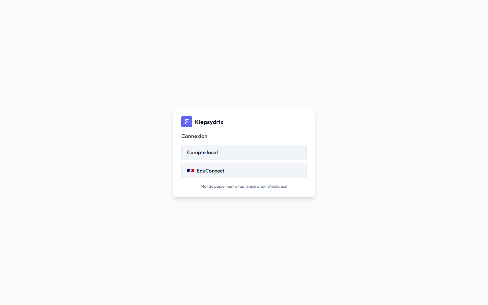
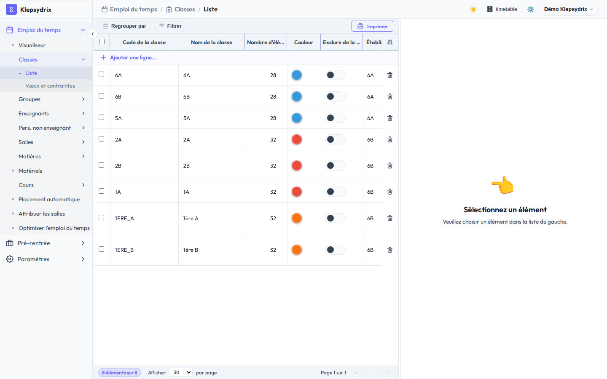
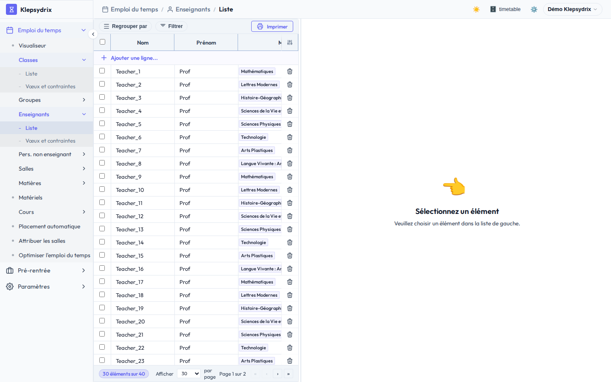
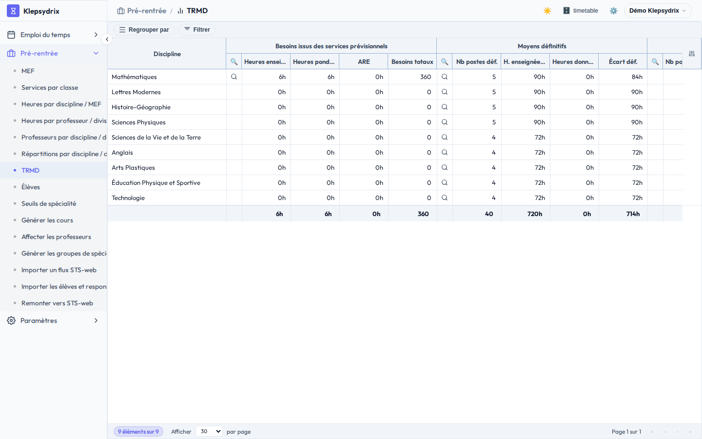
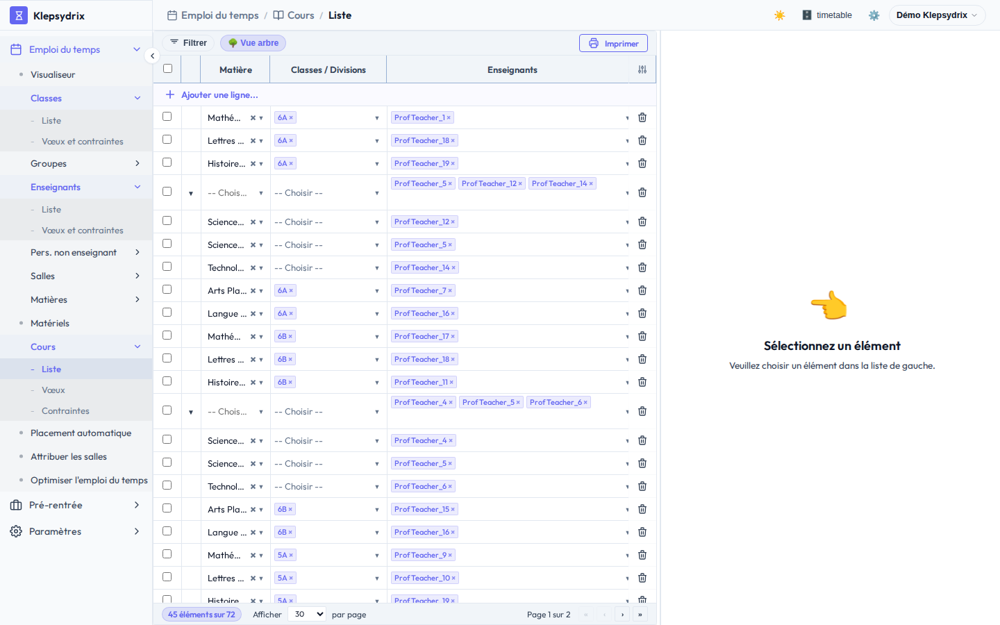
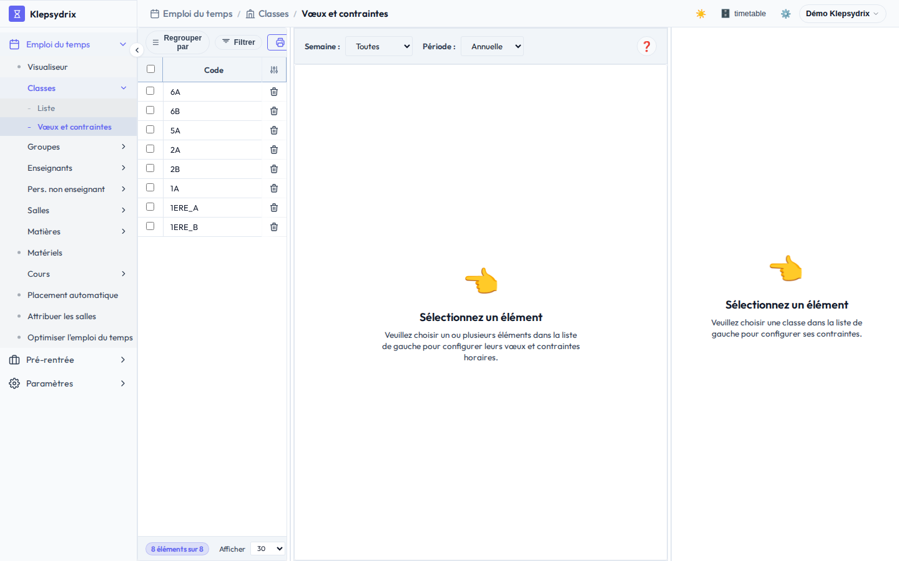
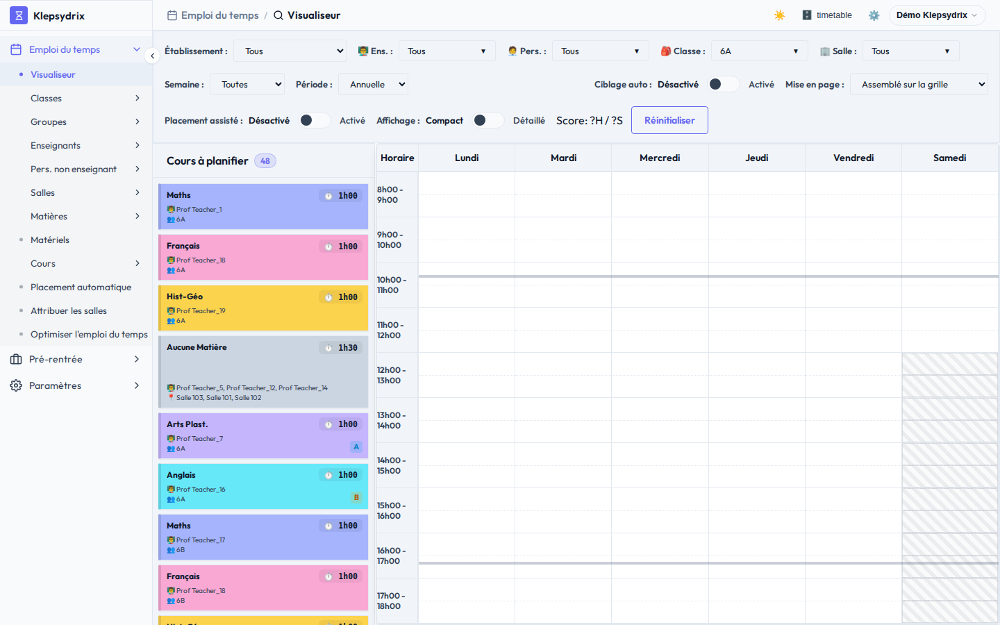
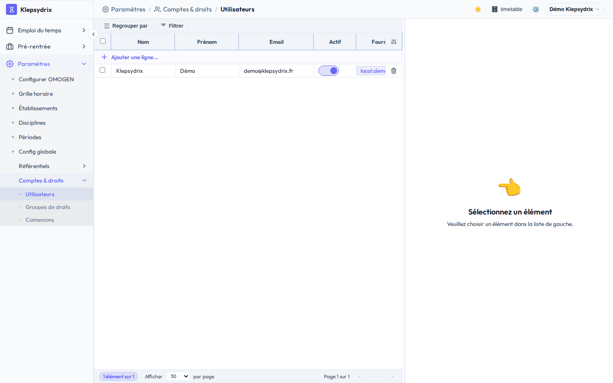

# Guide utilisateur — Chef d'établissement

Ce document s'adresse au chef d'établissement (ou à toute personne disposant du profil
**admin** sur une base Klepsydrix), utilisateur principal de l'application au quotidien : c'est
lui qui construit, ajuste et publie l'emploi du temps de son établissement.

Pour la gestion du serveur lui-même (installation, création de bases, super-administration),
voir [superadmin_doc.md](superadmin_doc.md) — un profil distinct, généralement tenu par une
autre personne.

> Les captures d'écran de ce document sont générées automatiquement depuis la base de
> démonstration par `frontend/scripts/doc-screenshots/capture-chef-etablissement.mjs`. Ne pas
> les remplacer à la main : relancer le script après une évolution de l'interface.

## Sommaire

1. [Introduction](#1-introduction)
2. [Connexion et compte](#2-connexion-et-compte)
3. [Prise en main de l'interface](#3-prise-en-main-de-linterface)
4. [Paramétrer l'établissement (Étape 1)](#4-paramétrer-létablissement-étape-1)
5. [Constituer les données de base (Étape 2)](#5-constituer-les-données-de-base-étape-2)
6. [Préparer la rentrée (Étape 3)](#6-préparer-la-rentrée-étape-3)
7. [Définir les vœux et contraintes (Étape 4)](#7-définir-les-vœux-et-contraintes-étape-4)
8. [Construire l'emploi du temps (Étape 5)](#8-construire-lemploi-du-temps-étape-5)
9. [Consulter et exploiter l'emploi du temps (Étape 6)](#9-consulter-et-exploiter-lemploi-du-temps-étape-6)
10. [Administrer les comptes et les référentiels](#10-administrer-les-comptes-et-les-référentiels)
11. [Scénarios pas à pas](#11-scénarios-pas-à-pas)
12. [FAQ / Dépannage](#12-faq--dépannage)

## 1. Introduction

### Qu'est-ce que Klepsydrix

Klepsydrix est une application de gestion des emplois du temps scolaires. Elle couvre
l'ensemble du cycle : modélisation des ressources de l'établissement (classes, groupes,
enseignants, salles, matières, matériels), préparation de la rentrée (TRMD, services,
génération automatique des cours et des groupes), construction de l'emploi du temps annuel à
l'aide d'un moteur de contraintes (placement automatique des cours, attribution des salles,
optimisation), puis son exploitation au quotidien.

### À qui s'adresse ce manuel

Ce manuel s'adresse au **chef d'établissement**, ou plus largement à toute personne disposant du
profil **admin** sur une base Klepsydrix (une base = un établissement). C'est l'utilisateur
principal de l'application : il paramètre l'établissement, saisit ou importe ses ressources, et
construit l'emploi du temps. Un même établissement peut avoir plusieurs comptes admin (ex. un
adjoint en charge des emplois du temps) — voir [§10.1](#101-comptes--droits) pour en créer.

### Le parcours en un coup d'œil

Ce manuel suit l'ordre dans lequel un établissement construit concrètement son emploi du temps,
d'une base toute neuve jusqu'à l'emploi du temps publié :

1. **[Paramétrer l'établissement](#4-paramétrer-létablissement-étape-1)** — calendrier de
   l'année, grille horaire, disciplines.
2. **[Constituer les données de base](#5-constituer-les-données-de-base-étape-2)** — importer
   depuis STS-web ou saisir classes, enseignants, salles, matières.
3. **[Préparer la rentrée](#6-préparer-la-rentrée-étape-3)** — MEF, TRMD, élèves, génération
   automatique des cours et des groupes.
4. **[Définir les vœux et contraintes](#7-définir-les-vœux-et-contraintes-étape-4)** — souhaits
   et contraintes de chaque ressource, avant placement.
5. **[Construire l'emploi du temps](#8-construire-lemploi-du-temps-étape-5)** — placement
   automatique, salles, optimisation.
6. **[Consulter et exploiter l'emploi du temps](#9-consulter-et-exploiter-lemploi-du-temps-étape-6)**
   — le visualiseur, au quotidien.

Les comptes utilisateurs et les référentiels RH
([§10](#10-administrer-les-comptes-et-les-référentiels)) se gèrent à part, au besoin — pas comme
une étape obligatoire de ce parcours.

L'application n'a pas d'écran d'accueil/tableau de bord séparé : à la connexion, c'est
directement le [Visualiseur](#91-visualiseur-grille-edt) (grille de l'emploi du temps) qui
s'affiche.

## 2. Connexion et compte

L'écran de connexion (`/login`) récupère la liste des fournisseurs d'identité actifs sur
l'instance (`GET /api/auth/providers`) et adapte son affichage :

- **Un seul fournisseur fédéré actif** (ex. EduConnect uniquement) : redirection automatique
  vers ce fournisseur, aucun formulaire n'est affiché.
- **Le fournisseur local est actif** (seul ou aux côtés d'un fournisseur fédéré) : un formulaire
  apparaît avec trois champs — **Base** (le nom technique de la base, ex. `timetable` —
  pré-rempli si l'URL contient `?db=...`), **Identifiant** et **Mot de passe**.
- **Plusieurs fournisseurs fédérés** : un bouton par fournisseur, avec son logo/libellé.

Un bandeau s'affiche si vous êtes redirigé ici parce que votre compte a été désactivé
(`?reason=inactive`).

<!-- SCREENSHOT: login -->

**Changer son mot de passe** : lien « Changer mon mot de passe » en pied de l'arborescence
(§3) — accessible à tout moment une fois connecté, ou imposé automatiquement à la connexion si
un administrateur a coché « Doit changer son mot de passe à la prochaine connexion » sur votre
compte (voir [§10.1](#101-comptes--droits)).

**Mot de passe oublié** (compte local uniquement) : lien de réinitialisation en self-service
depuis l'écran de connexion — un email contenant un lien à usage unique est envoyé, à condition
que le super-administrateur ait configuré un serveur SMTP sur l'instance (voir
[superadmin_doc.md §8](superadmin_doc.md#8-emails-sortants-smtp)). Sans SMTP configuré, seul un
autre administrateur de la base peut vous aider — mais il ne peut pas non plus fixer votre mot
de passe à votre place (voir [§10.1](#101-comptes--droits), le champ mot de passe n'est jamais
éditable depuis l'écran Comptes).

## 3. Prise en main de l'interface

L'application s'organise en une arborescence à gauche et un ou plusieurs panneaux à droite selon
l'écran sélectionné.

**Arborescence** (barre latérale, repliable via le bouton en haut à gauche) : trois groupes de
premier niveau — **Emploi du temps**, **Pré-rentrée**, **Paramètres** — chacun dépliable/repliable
en cliquant sur son en-tête. À l'intérieur, certaines entrées sont elles-mêmes des sous-groupes à
onglets (ex. « Classes » → « Liste » / « Vœux et contraintes »), d'autres sont des écrans directs
(ex. « Matériels ») ou des actions qui ouvrent un assistant plutôt qu'un écran de consultation
(ex. « Placement automatique »). L'entrée active est surlignée.

**Panneaux et le mode maître/détail** : la plupart des écrans de type « Liste » affichent un
panneau **maître** (la liste des enregistrements, à gauche ou en haut) et un panneau **détail**
(la fiche complète de l'élément sélectionné, à droite) — sélectionner une ligne dans la liste
remplit le formulaire de détail en face. Certains écrans combinent trois panneaux (ex. « Vœux et
contraintes » : liste des ressources, grille de préférences, et formulaire de contraintes
numériques). D'autres écrans (visualiseur, tableaux croisés de la pré-rentrée) sont autonomes et
ne suivent pas ce schéma.

**Pied de l'arborescence** : icônes pour changer de thème (clair/sombre/contraste), le nom de la
base courante (cliquer dessus ouvre le sélecteur de base — utile si votre compte a accès à
plusieurs bases), un lien « Console d'administration » (visible seulement si votre compte est
administrateur — voir [superadmin_doc.md §7](superadmin_doc.md#7-console-dadministration)),
« Changer mon mot de passe », et « Se déconnecter ».

## 4. Paramétrer l'établissement (Étape 1)

Avant de saisir la moindre classe ou le moindre enseignant, quelques réglages structurent tout
le reste : le calendrier de l'année, les horaires de la grille, la liste des disciplines
enseignées. C'est la première chose à faire à l'ouverture d'une nouvelle base — vous pouvez aussi
dès maintenant créer des comptes pour vos collègues (voir [§10.1](#101-comptes--droits)).

### 4.1 Grille horaire

L'écran « Grille horaire » (Paramètres) est un **assistant guidé en 6 étapes**, pas un simple
formulaire — chaque étape ne fait que calculer un aperçu, rien n'est écrit tant que l'étape de
confirmation n'est pas validée :

1. **Premier jour et pas horaire** — le premier jour de la semaine, et le pas horaire (durée
   minimale d'un créneau, en minutes) sur lequel se cale toute la grille.
2. **Heures d'ouverture de l'établissement** — un tableau éditable, une ligne par jour de la
   semaine (7 jours fixes, non ajoutables/supprimables), avec l'heure d'ouverture et de fermeture.
   Renseigner une heure de fermeture est obligatoire dès qu'une heure d'ouverture est saisie pour
   ce jour, et réciproquement ; les deux doivent être des multiples du pas horaire choisi
   à l'étape 1.
3. **Heure des récréations** — récréation du matin et récréation de l'après-midi (la première
   doit précéder la seconde).
4. **Aperçu des horaires affichés** — tableau en lecture seule montrant, séquence par séquence,
   les horaires publics qui seront affichés dans la grille.
5. **Confirmation** — l'assistant annonce explicitement le nombre de cours qui seraient
   **dépositionnés** (créneau supprimé) si vous validez ces changements. **Opération
   irréversible** : à traiter avec précaution une fois des cours déjà placés.
6. **Résultat**.

Modifier ces réglages régénère les créneaux horaires (`Timeslot`) de la base en conséquence.
Le pas horaire et le premier jour de semaine restent aussi visibles (en lecture assistée) dans
« Config globale » (§4.4), mais c'est bien cet assistant qui est le point d'entrée pour les
modifier en toute sécurité.

### 4.2 Établissements

Fiche établissement (« Établissements », Paramètres) — champs principaux :

- **Identité** : Code UAI (RNE), Nom de l'établissement, Dénomination complète, Sigle, Académie,
  Code nature / Code catégorie / Statut, Établissement sensible.
- **Coordonnées** : Adresse, Commune, Code postal, Boîte postale, Cedex, Téléphone.
- **Rentrée** : Date de rentrée des élèves / Date de sortie des élèves — ces deux dates
  conditionnent directement l'écran « Périodes » (§4.4 ci-dessous), qui verrouille sa première et
  sa dernière période sur elles.
- **Pédagogie** : poids pédagogique maximum par jour / par matinée / par après-midi (bornes
  utilisées ailleurs, ex. par les contraintes de vœux des classes/enseignants).

Si vous importez depuis STS-web (§5.1), la plupart de ces champs sont renseignés automatiquement
et n'ont pas besoin d'être ressaisis à la main.

### 4.3 Disciplines

Ne pas confondre avec « Matières » (§5.7) : ce sont deux écrans et deux modèles distincts.

- **Discipline** (cet écran, sous Paramètres) : une classification pédagogique large (ex.
  « Mathématiques »), identifiée par un code — c'est le niveau utilisé pour les synthèses
  d'ensemble comme le TRMD (§6.3).
- **Matière** (sous Emploi du temps, §5.7) : l'entité réellement utilisée dans les cours et
  l'emploi du temps (ex. « Maths 6ème »). **Chaque matière appartient obligatoirement à une
  discipline** (relation N:1) ; une discipline peut regrouper plusieurs matières (ex. la
  discipline « Lettres » peut regrouper les matières « Français » et « Latin »). Une discipline
  ne peut pas être supprimée tant qu'une matière y est encore rattachée.

Créez donc vos disciplines avant vos matières.

### 4.4 Périodes

Écran à deux panneaux : à gauche la liste des **types de période** (ex. « Trimestre »,
« Semestre » — un simple libellé) ; à droite, pour le type sélectionné, le découpage réel de
l'année en **périodes** contiguës pour l'établissement choisi.

Fonctionnement du panneau de droite :
- La première période commence obligatoirement à la date de rentrée de l'établissement (§4.2) et
  la dernière se termine à sa date de sortie — ces deux bornes sont verrouillées, non éditables.
  Si les dates de rentrée/sortie ne sont pas encore renseignées sur la fiche établissement, un
  message bloque l'édition.
- **« Ajouter une période »** coupe en deux la dernière période existante (refusé si l'intervalle
  restant est trop court, ≤ 2 jours).
- Modifier la date de fin d'une période **recale automatiquement** la date de début de la période
  suivante — c'est ce mécanisme de « transition » qui donne son nom à l'écran.
- Supprimer une période fusionne son intervalle avec la période voisine.
- Un bouton « Enregistrer » valide l'ensemble des changements en une fois.

À ne pas confondre avec les **Alternances** (semaines A/B, sous « Référentiels », §10.2) : les
Périodes découpent le calendrier (trimestres/semestres), les Alternances gèrent la parité des
semaines — les deux se combinent mais sont deux notions indépendantes.

## 5. Constituer les données de base (Étape 2)

Deux façons de peupler la base avec les classes, enseignants, salles et matières de
l'établissement : importer un flux STS-web existant (le plus rapide si l'académie le fournit),
ou saisir manuellement chaque ressource.

### 5.1 Importer depuis STS-web (recommandé)

**Fonctionnalité expérimentale** : le format d'échange STS-web n'est pas publié officiellement
par le Ministère : l'import est reconstitué à partir de l'analyse d'autres logiciels d'emploi du
temps. Un bandeau d'avertissement le rappelle dans l'assistant.

**Fichier attendu** : un export STS-web *descendant*, nommé `sts_emp_<RNE>_<ANNEE>.xml`
(obtenu depuis STS-web via *Exports > Emploi du temps*). Un fichier de type *montant* (produit
par un logiciel d'emploi du temps, racine `EDT_STS`) est rejeté avec un message dédié.

**Deux vérifications bloquantes avant tout import** :
- l'année scolaire du fichier doit correspondre au millésime configuré dans la base
  (« Config globale », §4.4) ;
- le RNE du fichier doit correspondre à un établissement **déjà créé** dans la base (§4.2)
  — l'import ne crée jamais d'établissement. Une cité scolaire (plusieurs UAI) s'importe en
  plusieurs passes, une par établissement.

**Déroulé de l'assistant (4 étapes)** :
1. **Fichier et périmètre** — dépôt du fichier XML, puis choix de ce qu'on souhaite importer
   (données de l'établissement, disciplines, matières, MEF, enseignants, classes, groupes,
   services) — tout est coché par défaut, sauf « Services » (voir piège ci-dessous).
2. **Correspondances** — à compléter manuellement ce que STS-web ne fournit pas : le **niveau**
   de chaque nouveau MEF, et la **discipline** de chaque nouvelle matière (l'assistant propose
   une valeur déduite quand c'est possible, à vérifier).
3. **Aperçu** — récapitulatif par type d'objet (à créer / à mettre à jour / laissés de côté /
   présents en base mais absents du fichier — ceux-ci ne sont **jamais** supprimés).
4. **Résultat**.

**Politique d'import** : crée ce qui manque, met à jour ce qui existe, ne supprime jamais.
L'appariement se fait par les codes du flux (code matière, code MEF, identifiant enseignant,
code classe, nom de groupe) — un code déjà utilisé par un autre enregistrement est signalé comme
conflit et l'objet correspondant est laissé de côté plutôt que renommé automatiquement.

⚠️ **Piège à connaître sur l'import des Services (case décochée par défaut)** : le flux STS-web
ne porte aucun volume horaire. Le cocher crée des gabarits d'heures **à zéro**, ce qui engendre
automatiquement un service sur **toutes** les classes du MEF concerné (pas seulement celles
citées dans le fichier) — les volumes horaires réels restent de toute façon à saisir ensuite en
pré-rentrée (§6.2). Dans le doute, laissez cette case décochée et saisissez les services
manuellement en pré-rentrée.

### 5.2 Classes

<!-- SCREENSHOT: divisions-list -->

Une **classe** (Division) regroupe un ensemble d'élèves suivant le même parcours. Colonnes
principales de la liste : Code de la classe, Nom de la classe, Nombre d'élèves, Couleur,
Établissement.

Une classe peut être découpée en **parties de classe** — un découpage (Partition) de la classe
en parts (ex. dédoublement en deux, LV2, spécialités), chaque part étant elle-même une
« ClassPart ». Ce découpage sert ensuite de brique pour constituer des **Groupes** (§5.3) qui
peuvent mélanger des parties de classes différentes (ex. un groupe de LV2 allemand rassemblant
des élèves de plusieurs classes).

### 5.3 Groupes

Un **Groupe** est un regroupement d'élèves transversal aux classes, composé d'une ou plusieurs
parties de classe (voir §5.2) — c'est ce qui permet de représenter un enseignement en commun
entre plusieurs classes (LV2, spécialités, options). Champs principaux : Nom du groupe (c'est
aussi le code utilisé pour la remontée STS-web, 8 caractères maximum), Libellé long, Nombre
d'élèves, Couleur, Taille variable.

Un groupe peut être créé manuellement ou généré automatiquement par l'application (par exemple
lors de la génération des groupes de spécialité, §6.6) — un groupe auto-généré qui ne contient
plus aucune partie de classe est automatiquement supprimé.

*L'onglet « Vœux et contraintes » de cet écran est présent dans le menu mais son panneau n'est pas
encore implémenté dans cette version — voir [§7.2](#72-groupes--vœux-et-contraintes).*

### 5.4 Enseignants

<!-- SCREENSHOT: teachers-list -->

La fiche enseignant, particulièrement riche, est organisée en plusieurs onglets : état civil,
coordonnées, dossier administratif (corps, grade, fonction, quotité de service...), en plus du
rattachement à une ou plusieurs disciplines (utilisé notamment par la synthèse TRMD, §6.3).
Un enseignant dispose d'une action d'impression de son propre emploi du temps (PDF).

### 5.5 Personnel non enseignant

Ressource dédiée aux personnels de la vie scolaire (surveillance, AESH...) — champs : Prénom, Nom
de famille, Rôle/Fonction (ex. « AESH »), Établissement, Compte utilisateur associé. Un membre du
personnel non enseignant peut être rattaché à un ou plusieurs cours (ex. accompagnement d'un
cours par un AESH) et bénéficie lui aussi d'une action d'impression de son emploi du temps.

### 5.6 Salles

Champs principaux : Code de la salle, Nom de la salle, Capacité (laisser vide = capacité
illimitée), Type de salle (référentiel dédié), Groupe de salle (rattachement à une salle
« parente », pour représenter par exemple un gymnase divisible), Établissement, Site/Bâtiment.

Points d'attention : une salle qui regroupe des salles filles (« groupe de salles ») ne peut pas
avoir de type propre ; toutes les salles d'un même groupe doivent partager la même capacité (ou
être toutes à capacité illimitée). La liste s'affiche sous forme d'arbre pour refléter cette
hiérarchie.

### 5.7 Matières

Champs principaux : Code de la matière, Code nomenclature (code officiel SIECLE/STS), Libellé
court, Libellé long, Code couleur, Matière ETP, **Matière de Spécialité** (utilisée pour les
vœux et groupes de spécialité, §6.4/§6.6), Poids pédagogique, Exclure de la remontée STS,
**Discipline** de rattachement (obligatoire — voir §4.3 pour la distinction Discipline/Matière),
Famille.

Un second onglet « Contraintes 2 à 2 » gère les incompatibilités entre paires de matières — voir
[§7.6](#76-matières--contraintes-deux-à-deux).

### 5.8 Matériels

Ressource simple (Code du matériel, Nom, Quantité disponible) rattachée aux cours/séances qui en
ont besoin (vidéoprojecteur, matériel de sport...), indépendamment des salles. Une action
d'impression de l'emploi du temps par matériel est disponible.

## 6. Préparer la rentrée (Étape 3)

Une fois les ressources de base en place, la pré-rentrée détermine les besoins en heures
d'enseignement et génère automatiquement l'essentiel des cours et des groupes à placer. Ordre
logique recommandé : **MEF** → rattacher les classes et saisir les **Services** → contrôler via
les tableaux croisés et le **TRMD** → **seuils de spécialité** et vœux des **élèves** (lycée) →
**générer les groupes de spécialité** si besoin → **générer les cours** → **affecter les
professeurs**.

### 6.1 MEF

Un **MEF** (Modalité d'Enseignement/Formation, référentiel officiel de l'Éducation nationale)
représente une structure pédagogique officielle (ex. « 6EME », une section SEGPA, une section
sportive). C'est le **gabarit réglementaire de dotation horaire** : chaque MEF porte, via ses
lignes « MefService », le volume horaire par matière que doit recevoir chaque classe qui lui est
rattachée. Champs du MEF : Établissement, Code National (MEF10), Libellé, **Niveau** (obligatoire
— frontière de mutualisation des groupes à effectif réduit), Effectif prévisionnel d'élèves,
Capacité maximale par classe.

⚠️ **Effet en cascade à connaître** : ajouter une ligne d'heures (MefService) au gabarit MEF crée
automatiquement un Service pour chaque classe déjà rattachée à ce MEF ; rattacher une nouvelle
classe au MEF crée automatiquement un Service pour chaque ligne déjà définie. Et si vous modifiez
ensuite une ligne du gabarit MEF, ce changement **se répercute sur tous les Services déjà
générés — y compris ceux que vous auriez déjà ajustés manuellement**. Pensez donc à finaliser le
gabarit MEF avant d'affiner les Services classe par classe (§6.2).

### 6.2 Services

Un **Service** est l'affectation opérationnelle réelle (matière + classe ou groupe +
professeur(s)), toujours dérivée d'un MefService (§6.1) — jamais créé ou supprimé directement.
Cinq écrans, à utiliser dans cet ordre :

1. **Services par classe** (écran principal de saisie) — panneau maître/détail : la liste des
   classes à gauche (avec Nom, MEF, Effectif prévisionnel, Effectif calculé), et à droite tous
   les Services de la classe sélectionnée, éditables en ligne (matière, discipline, effectif, les
   3 durées hebdomadaires — classe entière / effectif réduit / dédoublé —, pondération,
   professeurs affectés, verrouillage). C'est ici que l'on ajuste les volumes horaires réels et
   qu'on affecte les professeurs, service par service.
2. **Heures par discipline / MEF** — tableau croisé en lecture seule, pour contrôler le total
   d'heures programmées par discipline et par MEF.
3. **Heures par professeur / division** — tableau croisé de la charge de chaque professeur par
   classe, une fois les affectations faites.
4. **Professeurs par discipline / division** — tableau croisé de contrôle des affectations.
5. **Répartitions par discipline / division** — tableau croisé de contrôle du découpage horaire
   fin (classe entière / dédoublé / effectif réduit).

Une action groupée « Aligner »/« Désaligner » (depuis une sélection multiple de Services) permet
de regrouper plusieurs Services qui doivent partager le même modèle de répartition horaire (ex.
une « barrette » LV2 commune à plusieurs classes).

### 6.3 TRMD

Le TRMD (Tableau de Répartition des Moyens par Discipline) est un écran de **synthèse calculée**
(rien n'y est saisi directement) : une ligne par discipline, comparant les **besoins** (agrégés
depuis les Services saisis en §6.2) aux **moyens définitifs et provisoires** (agrégés depuis les
enseignants rattachés à chaque discipline, §5.4), avec un bilan d'écart (excédent de ressource,
ou HSA si les moyens sont inférieurs aux besoins).

<!-- SCREENSHOT: trmd -->

À consulter après avoir saisi les Services (§6.2) et avant de lancer les actions de génération
automatique (§6.6) — c'est le meilleur indicateur pour repérer un déséquilibre entre le nombre
d'heures programmées et le nombre d'enseignants réellement disponibles par discipline.

### 6.4 Élèves

Fiche élève : Prénom, Nom, Division (classe), MEF, Tuteur, Responsables légaux 1 et 2, compte
utilisateur associé (pour un accès éventuel à un futur portail). Le MEF renseigné sur l'élève
doit obligatoirement faire partie des MEF liés à sa classe. Un élève ne peut pas appartenir à deux
parties de classe (§5.2) qui proviennent du même découpage (Partition) — par exemple, pas dans
deux groupes de dédoublement simultanément.

Pour les niveaux concernés (lycée), un élève peut saisir des **vœux de spécialité classés par
rang** — chaque vœu doit porter sur une matière marquée « Matière de Spécialité » (§5.7), et le
rang ne peut pas dépasser le plafond de vœux configuré pour son niveau (référentiel « Niveaux »,
[§10.2](#102-référentiels)).

### 6.5 Seuils de spécialité

Configure, pour chaque couple **(matière de spécialité, niveau)**, le seuil de constitution des
groupes utilisé par la génération automatique (§6.6) : effectif maximum par groupe, et
optionnellement un nombre maximum de groupes. C'est volontairement paramétré par niveau (et non
par MEF) : un établissement propose en général une seule offre de spécialités par niveau, tous
MEF confondus. Une configuration doit exister pour chaque matière de spécialité/niveau que vous
souhaitez traiter — sinon la génération automatique ignore cette matière (avec avertissement).

### 6.6 Génération automatique des cours et des groupes

Trois actions, chacune sous forme d'un assistant :

- **Générer les groupes de spécialité** (à lancer *avant* « Générer les cours » si vous avez des
  spécialités lycée) — 3 étapes : sélection du niveau, aperçu des groupes qui seraient créés à
  partir des vœux des élèves (§6.4), puis génération. Nécessite qu'un plafond de vœux soit défini
  pour le niveau (référentiel « Niveaux ») et qu'une configuration de seuil existe (§6.5). La
  répartition se fait au fil de l'eau (« glouton »), sans corréler les différents vœux de
  spécialité d'un même élève entre eux — relancer l'assistant après un changement d'effectif peut
  faire migrer un élève d'un groupe à un autre.
- **Générer les cours** — **supprime tous les cours existants** puis régénère l'intégralité des
  cours à partir des Services (§6.2) saisis. L'assistant affiche explicitement le nombre de cours
  qui seraient supprimés avant de confirmer. À ne lancer qu'une fois les Services stabilisés.
- **Affecter les professeurs** — 3 étapes : simulation (aucune écriture), résultat de la
  simulation sous forme de propositions que vous pouvez cocher/décocher individuellement, puis
  application. Ne porte que sur les Services non verrouillés.

### 6.7 Cours — consulter et ajuster la liste générée

<!-- SCREENSHOT: courses-list -->

Après génération, chaque cours peut être ajusté individuellement : ressources rattachées
(professeur(s), classe(s)/groupe(s), salle souhaitée, matériel), durée, type de semaine
(y compris « Quinzaine à déterminer », laissée au solveur pour trancher A ou B).

**Décomposer un cours** (bouton disponible tant que le cours n'est pas encore placé) : un cours
peut être « composé », c'est-à-dire regroupé plusieurs sous-enseignements sous un même cours
parent (ex. un pôle de plusieurs matières positionnées ensemble) — seul le cours parent est
positionné par le solveur, jamais les enfants séparément. L'assistant de décomposition se déroule
en 2 étapes : répartition des enseignants/classes/groupes/salles vers des cours enfants (modes
disponibles : partie de classe, classe entière, dédoublement F/G, dédoublement alpha, avec
plusieurs modes de répartition temporelle), puis validation d'un aperçu des cours enfants
générés. Un indicateur (« ventilé » / « partiellement ventilé » / « non ventilé ») signale si
toutes les ressources du cours parent ont bien été réparties sur au moins un enfant. Un cours
composé ne peut avoir qu'un seul niveau d'enfants (pas de sous-décomposition d'un enfant).

## 7. Définir les vœux et contraintes (Étape 4)

Avant de lancer le placement automatique, indiquez les souhaits (créneaux préférés) et
contraintes (indisponibilités, interdictions) de chaque ressource — c'est ce qui guide le
solveur vers un emploi du temps réellement exploitable.

**Le principe commun à toutes les grilles de vœux** : un seul outil, le pinceau, avec 4 niveaux
que l'on applique aux cases de la grille horaire :

| Couleur | Niveau | Sens |
|---|---|---|
| 🔴 Rouge | Indisponible | **Contrainte dure** — le solveur ne peut pas placer de cours sur ce créneau pour cette ressource |
| 🟠 Orange | Indésirable | Vœu négatif (pénalité) |
| 🟢 Vert | Préféré | Vœu positif (bonus) |
| ⚪ Gomme | Neutre | Efface la case (aucun effet) |

Sélectionnez un pinceau puis cliquez sur une case (ou cliquez-glissez pour peindre plusieurs
cases d'affilée). Si plusieurs ressources sont sélectionnées dans la liste de gauche, peindre une
case s'applique à toutes en même temps. Une case **hachurée** signale un état non homogène pour
la sélection courante (ex. vœu différent selon la semaine A/B) — la survoler affiche le détail ;
peindre alors une valeur homogène fusionne à nouveau l'affichage. Peindre un vœu sur une semaine
précise (A ou B) alors qu'un vœu « Toutes les semaines » existait déjà le scinde automatiquement
en A/B, sans perdre l'autre semaine.

En complément de la grille, un second panneau porte des **contraintes numériques globales** par
ressource (heures maximum par jour, demi-journée, jours de présence...) — voir le détail par
ressource ci-dessous, ces deux mécanismes sont indépendants.

### 7.1 Classes — vœux et contraintes

<!-- SCREENSHOT: divisions-preferences -->

Grille de vœux horaires, plus un panneau de contraintes numériques : maximum horaire par jour,
horaires aménagés, maximum de demi-journées de présence, trous tolérés dans la journée.

### 7.2 Groupes — vœux et contraintes

*Cet onglet est présent dans le menu mais son panneau n'est pas encore implémenté dans cette
version de l'application — pas de vœux/contraintes possibles sur un Groupe pour l'instant (les
vœux des classes qui le composent, §7.1, s'appliquent indirectement via leurs parties de
classe).*

### 7.3 Enseignants — vœux et contraintes

Même grille de vœux horaires que les Classes, avec un panneau de contraintes numériques plus
riche : maximum horaire par jour/demi-journée, **maximum présentiel** (nombre de jours de
présence dans l'établissement), et **plages libres garanties** (demi-journées à préserver
systématiquement libres).

### 7.4 Personnel non enseignant — vœux

Grille de vœux horaires uniquement (pas de panneau de contraintes numériques, à la différence des
Classes/Enseignants).

### 7.5 Salles — vœux

Grille de vœux horaires uniquement (occupations à éviter/préférer par créneau, ex. salle
réservée en priorité à certains cours).

### 7.6 Matières — contraintes deux à deux

Écran différent des précédents : pas de grille horaire (une matière n'a pas d'emploi du temps
propre), mais un formulaire de contraintes **entre deux matières précises**, éventuellement
restreint à certaines classes. Groupes de réglages :

- **Incompatibilités** (un seul choix actif à la fois) : même demi-journée interdite, même jour
  interdit (coché par défaut), deux jours consécutifs interdits, ou un nombre minimum de
  demi-journées d'écart à respecter.
- **Empêchement de consécutivité** : interdire que la matière A soit immédiatement suivie de la
  matière B (et/ou réciproquement).
- **Horaires maximum** : nombre d'heures maximum par jour / par demi-journée pour ce couple de
  matières.
- **Ordre** : imposer que A soit toujours placée avant B dans la semaine (ou l'inverse) ; si les
  deux matières sont identiques (contrainte sur une même matière), régler plutôt l'ordre et
  l'écart maximum entre ses propres occurrences.
- Une contrainte peut être marquée « souple » (pénalité) plutôt que « dure » (interdiction stricte
  pour le solveur).

### 7.7 Cours — vœux et contraintes

Deux onglets séparés, pour deux mécanismes différents :

- **Vœux** : la même grille de vœux horaires que les autres ressources, mais **toujours à
  l'échelle de l'année entière et de toutes les semaines** — les sélecteurs Semaine/Période sont
  masqués sur cet écran, un vœu sur un cours ne peut pas être différent d'une semaine A à une
  semaine B.
- **Contraintes** : un formulaire de contraintes **entre deux cours précis** (même principe que
  les contraintes deux à deux entre matières, §7.6, mais appliqué à des cours individuels plutôt
  qu'à des matières entières) — ex. imposer ou interdire qu'ils partagent le même créneau,
  contraindre leur ordre dans la semaine, ou empêcher qu'ils se suivent immédiatement.

## 8. Construire l'emploi du temps (Étape 5)

Les ressources, cours, vœux et contraintes en place, place à la construction proprement dite de
l'emploi du temps — dans cet ordre : **Placement automatique** → **Attribuer les salles** →
(au besoin) **Optimiser l'emploi du temps**.

### 8.1 Placement automatique

Un simple assistant de confirmation (« Voulez-vous placer automatiquement l'ensemble des cours
non placés ? »), sans paramètre à régler. Il détermine le créneau (jour/heure, semaine A ou B) de
chaque cours non encore placé, mais **ne touche jamais aux salles** (voir §8.2). Le calcul
s'arrête dès qu'une première solution réalisable est trouvée (généralement en quelques secondes),
avec un plafond de sécurité de 5 minutes si aucune solution réalisable n'est trouvée.

**Comprendre le score affiché (`Score : ?H / ?S`)**, visible en permanence dans le Visualiseur
(§9.1) :
- **H (Hard)** = violations de contraintes **dures**. `0` = aucune violation dure — c'est
  l'objectif minimal. Un cours non placé ou une salle non résolue comptent chacun pour un point
  « bon marché » ; toute autre violation dure (ex. un vœu « Indisponible » non respecté) pèse
  1000 fois plus lourd dans le score — un Hard très négatif signale donc presque toujours un vrai
  conflit de ressources plutôt que de simples cours non placés.
- **S (Soft)** = pénalités liées aux vœux non respectés (créneaux « Indésirable », trous dans
  l'emploi du temps...). Plus proche de 0 est meilleur.
- La liste des cours **encore non placés** reste visible dans le panneau latéral du Visualiseur —
  c'est elle qu'il faut positionner à la main si le placement automatique n'a pas tout résolu.

### 8.2 Attribuer les salles

Un seul réglage : **priorité de continuité des salles**, soit « Minimiser les déplacements des
professeurs » (par défaut), soit « Minimiser les déplacements des divisions ». Cette action
recherche une salle concrète et libre pour chaque cours déjà placé dont l'exigence de salle
pointe encore vers un simple *groupe* de salles (ex. « une salle informatique », sans préciser
laquelle) — elle ne modifie jamais le créneau horaire d'un cours, seulement sa salle. À lancer
après le Placement automatique (§8.1).

### 8.3 Optimiser l'emploi du temps

À la différence du Placement automatique (qui s'arrête dès la première solution réalisable),
cette action relance une recherche **avec un budget de temps complet**, pour continuer à réduire
le score Soft (mieux respecter les vœux, réduire les trous) sur un emploi du temps déjà
globalement placé. Paramètres réglables :

- **Durée de calcul maximale** (défaut 1 h, plafond 12 h).
- **Arrêt si aucune amélioration** pendant une durée donnée (défaut 15 min).
- **Remettre les salles déjà attribuées à l'état groupe avant de les réattribuer** (décoché par
  défaut) — utile si des changements de créneau pendant l'optimisation ont rendu une salle déjà
  assignée sous-optimale ; dans ce cas, une seconde passe d'attribution des salles s'enchaîne
  automatiquement.

Usage typique : relancer périodiquement cette action pour affiner un emploi du temps déjà
fonctionnel, plutôt que comme étape de mise en place initiale (rôle du Placement automatique).

## 9. Consulter et exploiter l'emploi du temps (Étape 6)

Une fois l'emploi du temps construit, le visualiseur est l'écran que vous et vos équipes
consulterez le plus souvent au quotidien.

### 9.1 Visualiseur (grille EDT)

<!-- SCREENSHOT: timetable-grid -->

**Filtres de ressources** (menus déroulants à cases à cocher, cumulatifs) : Établissement,
👨‍🏫 Enseignants, 🧑‍💼 Personnel non enseignant, 🎒 Classes, 🏢 Salles — si aucune ressource
n'est cochée, tous les cours s'affichent. **Semaine** (Toutes / A / B) et **Période** filtrent en
plus par découpage temporel.

**Options d'affichage** :
- **Ciblage auto** : en cliquant sur un cours, sélectionne automatiquement ses ressources
  (classe, enseignant...) pour filtrer la vue sur elles.
- **Placement assisté** : n'agit que si un seul cours est sélectionné — colore chaque créneau de
  la grille selon le score qu'obtiendrait ce cours s'il y était déplacé (vert = optimal, orange =
  sous-optimal, rouge = conflit), avec le détail des contraintes respectées/violées au survol.
  Pratique pour trouver à la main une bonne place à un cours non placé ou à déplacer.
- **Affichage Compact / Détaillé** : en Compact, les cours composés masquent leurs enfants
  (§6.7) ; en Détaillé, ce sont les cours parents composés qui sont masqués au profit du détail
  de leurs enfants.
- **Mise en page** : assemblé sur la grille / une colonne par ressource / une grille par
  ressource — utile en particulier avec plusieurs ressources sélectionnées à la fois.

**Score et réinitialisation** : le score `?H / ?S` (voir [§8.1](#81-placement-automatique) pour
son interprétation) reste affiché en permanence. Le bouton « Réinitialiser » dépose tous les
cours de la grille — à utiliser avec précaution.

**Imprimer un emploi du temps** : il n'y a pas de bouton d'impression sur le Visualiseur
lui-même. L'impression se fait ressource par ressource, depuis un bouton « Imprimer » présent sur
les écrans de liste (Classes, Enseignants, Salles, Groupes, Personnel non enseignant, Matériels,
Parties de classe) — chaque impression produit un PDF de la grille hebdomadaire de la ressource
choisie. La liste des cours (§6.7) dispose elle aussi de sa propre impression, sous forme de
tableau plutôt que de grille.

### 9.2 Remonter vers STS-web

Symétrique de l'import (§5.1) : une fois l'emploi du temps construit, Klepsydrix peut renvoyer
vers STS-web les données qu'il gère (groupes, affectations des élèves, emploi du temps) sous
forme d'un flux montant (`emp_sts_<RNE>_<ANNEE>.xml`). Fonctionnalité récente de l'application —
ce manuel sera complété avec le détail pas à pas de cet assistant dans une prochaine mise à jour.

## 10. Administrer les comptes et les référentiels

Tâches d'administration ponctuelles, pas des étapes du parcours de construction : gérer qui a
accès à la base, et tenir à jour les tables de référence RH utilisées ailleurs dans
l'application.

### 10.1 Comptes & droits

<!-- SCREENSHOT: accounts-users -->

Trois onglets :

**Utilisateurs** : Nom, Prénom, Email, Actif, Groupes (droits). Pour créer un compte :
1. Créer la fiche utilisateur (nom, prénom, email), cocher « Actif », et lui affecter au moins un
   groupe de droits.
2. Dans l'onglet « Connexions » (ci-dessous), créer sa ligne de connexion (fournisseur + son
   identifiant de connexion).

⚠️ **Le mot de passe n'est jamais éditable depuis cet écran** — ni à la création, ni ensuite : un
administrateur ne peut pas fixer lui-même le mot de passe d'un compte local. La personne doit
utiliser le flux de réinitialisation en self-service (§2) avec l'identifiant que vous avez saisi.
Deux garde-fous protègent aussi la base contre un blocage accidentel : impossible de retirer le
dernier compte du groupe « Admin », et impossible de vider l'email d'un utilisateur une fois
renseigné (c'est le seul canal de réinitialisation de mot de passe).

**Groupes de droits** : un ensemble nommé d'utilisateurs, auquel sont associés des droits
Lecture/Écriture/Création/Suppression par type de donnée — un droit peut être restreint aux
enregistrements correspondant à une condition (ex. un enseignant ne voit que ses propres cours).
Un groupe peut « impliquer » un autre groupe (héritage de ses droits). Par défaut, **une donnée
sans aucun droit déclaré n'est visible par personne** — c'est un système restrictif par défaut.
Deux groupes systèmes existent (« Admin » et « Consultation », lecture seule) : leurs droits ne
sont pas modifiables, seule leur liste de membres l'est.

**Connexions** : la table qui relie un utilisateur à un moyen de se connecter (fournisseur +
identifiant externe). Un compte nouvellement créé par un administrateur (ex. lors de la création
d'une base, voir [superadmin_doc.md §7](superadmin_doc.md#7-console-dadministration)) démarre
« en attente » : à sa toute première connexion via un fournisseur fédéré dont l'email correspond,
cette ligne « en attente » est automatiquement remplacée par la vraie identité de connexion,
plutôt que de créer un second compte en double.

### 10.2 Référentiels

Ensemble de listes de référence (données RH ou nomenclatures officielles STS-web), utilisées
comme listes de choix ailleurs dans l'application plutôt que comme objets métier autonomes :

| Écran | Sert pour |
|---|---|
| Corps, Grades, Fonctions, Modalités de service, Missions Pacte, Missions particulières, Supports, Types de support, Inspecteurs | Dossier administratif des enseignants |
| ARA, ARE, Modalités d'affectation, Modes d'élection, Pondérations, Diplômes, Civilités | Données RH complémentaires |
| Villes, Pays, Autres établissements, Académies | Coordonnées (établissement, personnes) |
| Modalités de cours | Type d'enseignement (à ne pas confondre avec « Modalités de service », qui qualifie le service de l'enseignant) |
| Vacances scolaires, Calendrier des semaines, Alternances | Calendrier de l'année et parité des semaines A/B |
| Niveaux | Niveaux scolaires (avec le plafond de vœux de spécialité, §6.4) |

Points d'attention :
- Créer un nouveau **Niveau** déclenche automatiquement la création d'une préférence par
  enseignant existant, sans action manuelle nécessaire.
- Plusieurs référentiels (Modes d'élection, Modalités de cours, Pondérations) portent un indicateur
  « Conforme STS-web » en lecture seule sur les valeurs préexistantes — seules des lignes ajoutées
  localement peuvent être non conformes (et ne remonteront alors pas vers l'académie).
- Le **Calendrier des semaines** n'est normalement pas à saisir ligne par ligne : il se génère
  automatiquement (alternance A/B sur toute l'année, en sautant les vacances). Ni lui ni les
  Alternances ne sont utilisés par le solveur — ils ne servent qu'à l'affichage et à l'export
  STS-web.

## 11. Scénarios pas à pas

### Créer une classe de A à Z

1. Vérifiez que l'établissement (§4.2) et au moins une discipline/matière (§4.3, §5.7) existent.
2. **Classes > Liste** (§5.2) : ajoutez une ligne (code, nom, nombre d'élèves, couleur,
   établissement).
3. Si la classe doit être partagée en parties (dédoublement, LV2, spécialités) : configurez son
   découpage, puis créez les **Groupes** (§5.3) qui rassemblent les parties concernées.
4. **Pré-rentrée > MEF** (§6.1) : rattachez la classe à son MEF — un Service à volume nul est créé
   automatiquement pour chaque ligne d'heures déjà définie sur ce MEF.
5. **Services par classe** (§6.2) : ajustez les volumes horaires réels de la classe et affectez
   les professeurs.
6. **Vœux et contraintes** de la classe (§7.1) si nécessaire, puis lancez ou relancez la
   génération des cours (§6.6) pour que la nouvelle classe soit prise en compte.

### De la pré-rentrée à l'emploi du temps placé

1. **Paramétrer l'établissement** (§4) — grille horaire, périodes.
2. **Constituer les données de base** (§5) — import STS-web ou saisie manuelle des classes,
   enseignants, salles, matières.
3. **Pré-rentrée** (§6) : MEF → Services (à contrôler via les tableaux croisés et le TRMD) →
   seuils de spécialité et vœux des élèves si lycée → générer les groupes de spécialité si besoin
   → **Générer les cours** → **Affecter les professeurs**.
4. **Vœux et contraintes** (§7) sur les classes, enseignants, salles, matières et cours.
5. **Placement automatique** (§8.1), puis **Attribuer les salles** (§8.2).
6. Consultez le score et la liste des cours non placés dans le **Visualiseur** (§9.1) ; ajustez à
   la main si besoin (le mode « Placement assisté » aide à trouver un bon créneau).
7. Au besoin, lancez **Optimiser l'emploi du temps** (§8.3) pour affiner le respect des vœux.

## 12. FAQ / Dépannage

**J'ai modifié un Service à la main, et mes changements ont disparu.** Vous avez probablement
retouché ensuite le gabarit MEF (§6.1) correspondant : toute modification d'une ligne MEF se
répercute sur tous les Services déjà générés à partir d'elle, même ajustés manuellement.
Finalisez le gabarit MEF avant d'affiner les Services classe par classe.

**Un élève ne peut pas saisir de vœu pour une spécialité.** Vérifiez que la matière est bien
marquée « Matière de Spécialité » (§5.7), et qu'un plafond de vœux est configuré pour le niveau de
l'élève (référentiel « Niveaux », §10.2) — sans ce plafond, aucun vœu n'est accepté pour ce
niveau.

**Le placement automatique ne place pas tous les cours.** Regardez le score `?H` (§8.1) : s'il
est proche de 0, il ne reste que quelques cours non placés à positionner à la main (liste dans le
panneau latéral du Visualiseur, §9.1 — le mode « Placement assisté » aide à trouver un créneau
compatible). S'il est très négatif, cherchez plutôt un vrai conflit de contraintes dures (vœu
« Indisponible » trop restrictif, salle manquante...).

**J'ai importé un flux STS-web et je me retrouve avec des services à zéro heure sur des classes
que je n'avais pas prévues.** Piège connu (§5.1) : importer les « Services » depuis STS-web crée
un gabarit d'heures à zéro qui engendre un Service sur toutes les classes du MEF concerné. Les
Services superflus peuvent être supprimés (ou leurs volumes ajustés) depuis « Services par
classe » (§6.2) ; à l'avenir, préférez laisser cette case décochée à l'import.

**Je ne trouve pas comment fixer le mot de passe d'un utilisateur que je viens de créer.** C'est
normal, ce champ n'est jamais éditable depuis l'écran Comptes (§10.1) — la personne doit utiliser
le lien de réinitialisation en self-service (§2), qui suppose qu'un serveur SMTP soit configuré
sur l'instance (à demander à votre super-administrateur, voir
[superadmin_doc.md §8](superadmin_doc.md#8-emails-sortants-smtp)).

**Impossible de retirer un utilisateur du groupe « Admin ».** Garde-fou volontaire (§10.1) : il
doit toujours rester au moins un compte Admin sur la base. Ajoutez d'abord un autre administrateur
avant d'en retirer un.

**Je suis redirigé vers l'écran de connexion en boucle, ou vers le sélecteur de base.** Ce sont
des soucis de session/sélection de base au niveau de l'instance plutôt que de vos données — voir
la table des erreurs courantes de
[superadmin_doc.md §10](superadmin_doc.md#10-dépannage--logs).
