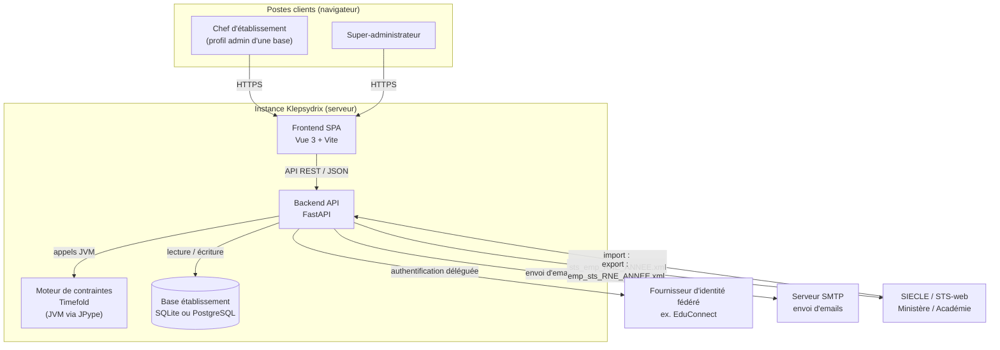
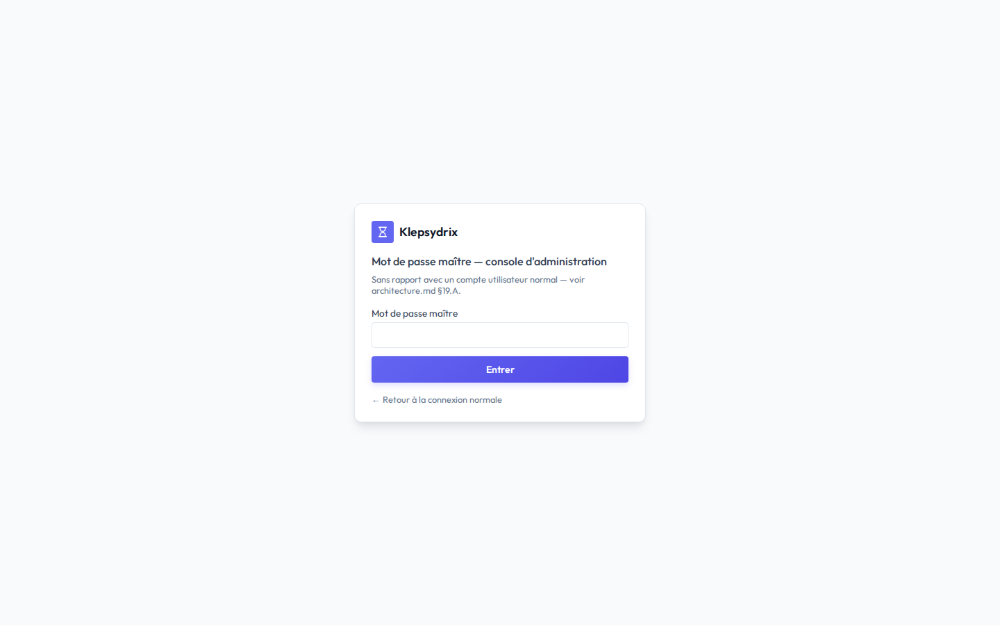
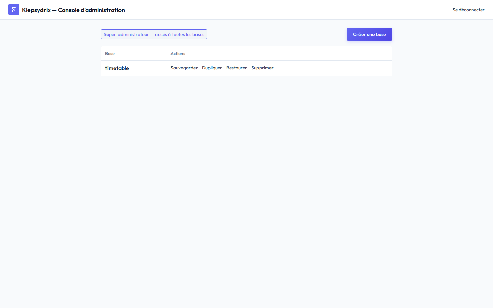
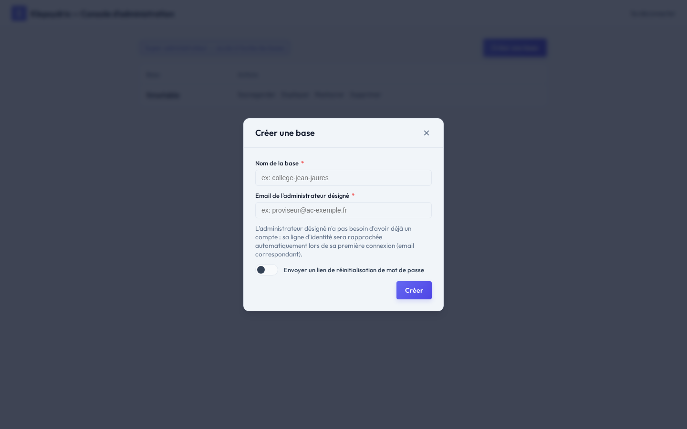

# Guide super-administrateur

Ce document s'adresse au **super-administrateur** de l'instance Klepsydrix : la personne qui
héberge et exploite le serveur, distincte du chef d'établissement (voir
[chef_etablissement_doc.md](chef_etablissement_doc.md)), qui n'a lui accès qu'aux données de sa
propre base.

Un super-administrateur agit au niveau de l'**instance** (le serveur, potentiellement partagé par
plusieurs établissements/bases) ; un admin de base n'agit que sur **sa** base (sauvegarde,
restauration, suppression — ni création, ni duplication).

> Les captures d'écran de ce document sont générées automatiquement par
> `frontend/scripts/doc-screenshots/capture-superadmin.mjs`. Ne pas les remplacer à la main :
> relancer le script après une évolution de l'interface.

## Sommaire

1. [Introduction](#1-introduction)
2. [Installation et démarrage](#2-installation-et-démarrage)
3. [Configuration de l'instance (`instance.yaml`)](#3-configuration-de-linstance-instanceyaml)
4. [Sécurité](#4-sécurité)
5. [Fournisseurs d'identité](#5-fournisseurs-didentité)
6. [Accès à la console super-admin](#6-accès-à-la-console-super-admin)
7. [Console d'administration](#7-console-dadministration)
8. [Emails sortants (SMTP)](#8-emails-sortants-smtp)
9. [Sauvegardes — bonnes pratiques](#9-sauvegardes--bonnes-pratiques)
10. [Dépannage / logs](#10-dépannage--logs)

## 1. Introduction

### Architecture globale

Vue d'ensemble de l'instance Klepsydrix et de ses échanges avec l'extérieur, notamment avec
SIECLE / STS-web (l'échange de données d'établissement utilisé dans l'Éducation nationale) :



- **Import descendant** (`sts_emp_<RNE>_<ANNEE>.xml`) : classes, groupes, enseignants, MEF...
  récupérés depuis STS-web via l'assistant d'import (voir
  [chef_etablissement_doc.md §5.5](chef_etablissement_doc.md#55-import-sts-web)).
- **Export montant** (`emp_sts_<RNE>_<ANNEE>.xml`) : groupes, affectations d'élèves et emploi du
  temps renvoyés vers STS-web.
- Ces échanges sont des **fichiers XML transmis par l'utilisateur** (dépôt/téléchargement manuel
  dans l'IHM) : Klepsydrix n'établit aucune connexion réseau directe vers SIECLE/STS-web.
- Une même instance peut héberger **plusieurs bases** (une par établissement), chacune isolée des
  autres (voir §7) — le schéma ne représente qu'une seule base pour rester lisible.

Pour le détail technique de chaque composant, voir `architecture.md` à la racine du dépôt.

### Qu'est-ce que Klepsydrix

Klepsydrix est une application de gestion des emplois du temps scolaires. Elle est déployée sous
forme d'une **instance** de serveur qui peut héberger plusieurs **bases** indépendantes, une base
par établissement, chacune avec ses propres ressources (classes, enseignants, salles, emplois du
temps) et ses propres comptes.

### À qui s'adresse ce manuel

Ce manuel s'adresse au **super-administrateur** : la personne qui installe, configure et
maintient le serveur (souvent un service informatique académique ou un prestataire
d'hébergement), par opposition au chef d'établissement (voir
[chef_etablissement_doc.md](chef_etablissement_doc.md)) qui, lui, ne travaille qu'à l'intérieur
d'une base pour construire l'emploi du temps de son établissement. Le super-administrateur n'a
normalement pas vocation à modifier les données métier d'une base — son rôle porte sur
l'instance : création/duplication/suppression des bases, fournisseurs d'identité, sécurité,
sauvegardes.

## 2. Installation et démarrage

### 2.1 Prérequis (communs à tous les systèmes)

| Dépendance | Version | Pourquoi |
|---|---|---|
| Git | — | cloner le dépôt |
| Python | 3.11+ (3.12 utilisé en développement) | backend FastAPI |
| JDK | **17 ou supérieur**, avec `JAVA_HOME` positionné | le solveur Timefold démarre une JVM via JPype |
| Node.js / npm | Node **20+** | build et exécution du frontend Vue 3 / Vite |
| Bibliothèques Pango/cairo/harfbuzz | — | rendu PDF par WeasyPrint (impression des emplois du temps) |
| PostgreSQL | — (optionnel) | uniquement si `database.backend: postgresql` dans `instance.yaml` — SQLite (par défaut) ne demande rien de plus |

Le serveur applicatif lui-même (FastAPI, SQLAlchemy, Timefold...) s'installe entièrement via
`pip` dans un environnement virtuel Python (`.venv`) propre au backend — aucune dépendance
globale sur le système. Le frontend s'installe de la même façon, nativement isolé par
`node_modules` (voir `architecture.md` §3).

### 2.2 Installation — Linux (Debian / Ubuntu)

```bash
# 1. Dépendances système
sudo apt-get update
sudo apt-get install -y \
  git \
  python3 python3-venv python3-pip \
  default-jdk \
  nodejs npm \
  libpango-1.0-0 libpangoft2-1.0-0 libharfbuzz0b

# 2. Récupération du code
git clone <url-du-dépôt> klepsydrix
cd klepsydrix

# 3. Backend : environnement virtuel + dépendances Python
python3 -m venv backend/.venv
source backend/.venv/bin/activate
pip install --upgrade pip
pip install -r backend/requirements.txt
deactivate

# 4. Frontend : dépendances npm
cd frontend && npm install && cd ..

# 5. Configuration de l'instance
cp instance.example.yaml instance.yaml
# éditer instance.yaml — voir §3
```

⚠️ Le paquet `nodejs` des dépôts Debian/Ubuntu est parfois ancien (bien en-dessous de la version
20 requise). Si `node -v` affiche moins que `v20`, installer Node.js via
[NodeSource](https://github.com/nodesource/distributions) ou [nvm](https://github.com/nvm-sh/nvm)
plutôt que le paquet `apt` par défaut.

### 2.3 Installation — macOS

```bash
# 1. Dépendances système (Homebrew : https://brew.sh)
brew install git python@3.12 openjdk@17 node pango

# openjdk@17 n'est pas lié au PATH par défaut sur macOS :
export JAVA_HOME="$(brew --prefix openjdk@17)/libexec/openjdk.jdk/Contents/Home"
export PATH="$JAVA_HOME/bin:$PATH"
# (ajouter ces deux lignes à ~/.zshrc pour les rendre permanentes)

# 2. Récupération du code
git clone <url-du-dépôt> klepsydrix
cd klepsydrix

# 3. Backend
python3 -m venv backend/.venv
source backend/.venv/bin/activate
pip install --upgrade pip
pip install -r backend/requirements.txt
deactivate

# 4. Frontend
cd frontend && npm install && cd ..

# 5. Configuration
cp instance.example.yaml instance.yaml
```

### 2.4 Installation — Windows (via WSL2)

Il n'existe pas de chemin d'installation natif Windows : `start_services.sh`, `install.sh` et les
scripts d'outillage sont tous des scripts bash, et l'activation d'un venv Python en PowerShell
diverge du reste de cette documentation. La voie recommandée — et la seule testée — est
**WSL2** (Windows Subsystem for Linux) avec une distribution Ubuntu :

```powershell
# Dans PowerShell (administrateur), une seule fois :
wsl --install -d Ubuntu
```

Une fois dans le terminal Ubuntu (WSL2), suivre exactement la procédure **Linux (Debian/Ubuntu)**
ci-dessus (§2.2). Le code peut être cloné directement dans le système de fichiers Linux de WSL2
(`~/klepsydrix`, pas `/mnt/c/...`) pour de meilleures performances de démarrage (`--reload`,
`node_modules`).

### 2.5 Script d'installation automatisé

Le script [`install.sh`](../install.sh) (racine du dépôt) automatise les étapes ci-dessus pour
Linux (Debian/Ubuntu, via `apt`) et macOS (via Homebrew) : dépendances système, venv backend,
`pip install`, `npm install`, copie d'`instance.yaml`. Idempotent — peut être relancé sans risque.

```bash
./install.sh
```

Sous Windows, le lancer **depuis un terminal WSL2** (voir §2.4).

### 2.6 Premier démarrage et vérification

Avant le tout premier démarrage, la base par défaut (`timetable`) doit exister — `resolve_database`
refuse toute connexion sur une base inconnue (404 `DATABASE_UNKNOWN`, voir §10) :

```bash
source backend/.venv/bin/activate

# Base de démonstration (jeu de données complet, pratique pour découvrir l'application) :
python -m backend.app.core.init_demo

# — OU — base vide de production (schéma + réglages système uniquement, sans données métier) :
python -m backend.app.core.init_db

deactivate
```

Pour créer d'autres bases par la suite (un vrai établissement supplémentaire), préférer la
console d'administration (§7, action **Créer une base**) plutôt que rejouer `init_db.py` en ligne
de commande — c'est le chemin qui gère aussi la création du compte admin désigné.

Démarrage des services :

```bash
./start_services.sh start
./start_services.sh status
```

Vérification :
- Backend : [http://localhost:8000/api/docs](http://localhost:8000/api/docs) (Swagger UI) doit
  répondre.
- Frontend : [http://localhost:3000](http://localhost:3000) doit afficher l'écran de connexion.
- `./start_services.sh logs` en cas de doute — voir aussi §10 pour les erreurs courantes.

## 3. Configuration de l'instance (`instance.yaml`)

Fichier à la racine du dépôt (gitignoré, jamais commité — il peut contenir des secrets), copié
depuis `instance.example.yaml` (le gabarit documenté et versionné). Le chemin peut être surchargé
via la variable d'environnement `KLEPSYDRIX_CONFIG`.

```yaml
database:
  backend: sqlite            # sqlite | postgresql
  directory: .                # obligatoire si backend=sqlite (répertoire des fichiers *.db)
  # host: /var/run/postgresql # obligatoire si backend=postgresql (socket local si commence par "/")
  # port: 5432
  # user: klepsydrix
  # password: ${env:PGPASSWORD}
  # database_prefix: klepsydrix_

server:
  allowed_origins:
    - http://localhost:3000
  # trusted_proxies:          # IP/CIDR du reverse proxy en production (voir §4) — vide par défaut
  #   - 127.0.0.1
  public_base_url: http://localhost:3000   # URL publique de CETTE instance (liens d'emails)

# Signe les cookies de session — voir §4, à changer impérativement en production.
secret_key: ${env:KLEPSYDRIX_SECRET_KEY}

identity_providers:
  - key: local
    label: Compte local
    protocol: local_password
    active: true
  # - key: educonnect             # fournisseur OIDC fédéré — voir §5
  #   ...

super_admins: []                  # paires OIDC nommées — voir §6
# - provider_key: educonnect
#   subject: 1234567890abcdef

master_db_local_auth:             # voie de secours super-admin sans OIDC — voir §6
  enabled: false
  password_hash: ${env:KLEPSYDRIX_MASTER_PASSWORD_HASH}
  ip_allowlist: []

smtp:                             # voir §8
  host: smtp.example.com
  port: 587
  user: noreply@klepsydrix.example.com
  password: ${env:SMTP_PASSWORD}
  from_address: noreply@klepsydrix.example.com
  use_tls: true

auth:
  password_reset_ttl_minutes: 60
  session_idle_timeout_minutes: 43200   # 30 jours par défaut
```

- La convention `${env:NOM_VAR}` substitue la variable d'environnement correspondante — utile
  pour tout secret (mot de passe SMTP, `secret_key`...) sans l'écrire en clair dans le fichier.
- **Cas PostgreSQL** : renseigner `database.host` (chemin de socket local commençant par `/`, ou
  hôte/IP distant), `port`, `user`, `password`, `database_prefix` (préfixé à chaque nom de base —
  ex. `klepsydrix_timetable`). L'authentification "peer" (socket Unix, sans mot de passe) convient
  pour un PostgreSQL local. Chaque base logique Klepsydrix devient alors une base PostgreSQL
  distincte, nommée `<database_prefix><slug>`.
- Le fichier grandit au fil des chantiers (voir `instance.example.yaml` pour la version la plus à
  jour et entièrement commentée) — une seule section par domaine, jamais de fichier de config
  supplémentaire.

## 4. Sécurité

- **`secret_key`** : signe les cookies de session (instance et OIDC) — la valeur de démonstration
  du dépôt est **publique**. `core/startup_checks.py` refuse de démarrer avec elle dès que
  `server.public_base_url` désigne autre chose qu'un hôte local : en pratique, impossible d'oublier
  de la changer en production.
- **`server.trusted_proxies`** : à renseigner dès qu'un reverse proxy (nginx, Caddy...) est placé
  devant l'application pour terminer le HTTPS — sinon `master_db_local_auth.ip_allowlist` filtrerait
  sur l'IP du proxy plutôt que celle du client réel (toujours accepté ou toujours refusé selon les
  cas, voir le commentaire dans `instance.example.yaml`).
- **`master_db_local_auth.ip_allowlist`** : restreint par IP/CIDR l'accès au mot de passe maître —
  vide par défaut (aucune restriction).
- **`auth.session_idle_timeout_minutes`** : durée d'inactivité avant expiration d'une session
  instance (30 jours par défaut) — chaque requête authentifiée fait glisser cette fenêtre.
- **`deploy/fail2ban/`** : filtres et exemples de jails fail2ban pour la connexion locale
  (`klepsydrix-local-login.conf`) et le mot de passe maître (`klepsydrix-master-auth.conf`).
  **Non optionnel en production** : Klepsydrix ne verrouille jamais un compte applicativement après
  plusieurs échecs (choix assumé, voir `architecture.md` §17.H) — fail2ban est la SEULE protection
  anti-brute-force. Les jails attendent les logs au format écrit par `main.py`
  (`WARNING [db=...] backend.app.api.auth_endpoints: Échec de connexion...`), typiquement dans
  `/var/log/klepsydrix/backend.log` en production (à adapter selon la façon dont le process est
  supervisé — `start_services.sh` n'est qu'un outil de développement, pas un gestionnaire de
  process de production : prévoir un service systemd ou équivalent qui redirige ses logs à cet
  emplacement).
- **HTTPS obligatoire en production**, terminé par un reverse proxy en amont du backend/frontend.

### Checklist avant mise en production

- [ ] `secret_key` remplacé par une valeur générée aléatoirement (ex.
      `python -c "import secrets; print(secrets.token_hex(32))"`), fournie via `${env:...}`.
- [ ] `server.public_base_url` pointe vers le vrai nom de domaine public (pas `localhost`).
- [ ] `server.trusted_proxies` renseigné si un reverse proxy est utilisé.
- [ ] Au moins un fournisseur d'identité fédéré (§5) actif, avec une paire `super_admins` (§6)
      nommée pour au moins une personne.
- [ ] `master_db_local_auth.enabled` repassé à `false` une fois la voie OIDC opérationnelle (un
      second point d'entrée permanent affaiblirait l'authentification fédérée déjà en place).
- [ ] Jails fail2ban (`deploy/fail2ban/`) installées et actives, `logpath` cohérent avec
      l'emplacement réel des logs en production.
- [ ] SMTP configuré (§8) — sans lui, aucune réinitialisation de mot de passe self-service n'est
      possible pour les comptes locaux.
- [ ] Sauvegardes testées (§9), pas seulement programmées.

## 5. Fournisseurs d'identité

Déclarés dans `instance.yaml::identity_providers` — un provider `local` actif par défaut, et des
fournisseurs OIDC fédérés (ex. EduConnect) à configurer avec de vrais paramètres pour la
production.

### Ajouter un fournisseur OIDC fédéré

1. Auprès du fournisseur (ex. EduConnect), enregistrer une application cliente pour cette instance
   et récupérer : `client_id`, `client_secret`, et l'URL de découverte OIDC
   (`server_metadata_url`, un document `.well-known/openid-configuration`).
2. Ajouter une entrée dans `identity_providers` :
   ```yaml
   identity_providers:
     - key: educonnect          # identifiant technique interne, utilisé dans les URLs de login
       label: EduConnect        # libellé affiché sur l'écran de connexion
       logo: https://...        # optionnel
       active: true
       protocol: oidc
       params:
         server_metadata_url: https://<fournisseur>/.well-known/openid-configuration
         client_id: ${env:EDUCONNECT_CLIENT_ID}
         client_secret: ${env:EDUCONNECT_CLIENT_SECRET}
         scopes: [openid, profile, email]
         claim_mapping:
           sub: external_subject     # claim OIDC -> champ interne (voir core/oidc.py)
           given_name: first_name
           family_name: last_name
           email: email
   ```
3. Redémarrer le backend. Authlib ne récupère le document de découverte qu'au moment réel d'une
   tentative de connexion — activer un fournisseur ne déclenche aucun appel réseau immédiat.
4. `claim_mapping` : associe les noms de claims renvoyés par CE fournisseur précis à nos champs
   internes (`external_subject` est le seul obligatoire — c'est l'identifiant utilisé pour
   apparier ou créer le compte). Deux fournisseurs OIDC différents peuvent nommer différemment le
   même concept (ex. `sub` vs `id`) : `claim_mapping` absorbe cette différence sans code
   supplémentaire.
5. Un seul fournisseur actif et non-local redirige automatiquement l'utilisateur dessus (aucun
   écran de choix affiché) ; avec plusieurs fournisseurs actifs, `/login` affiche un bouton par
   fournisseur.

## 6. Accès à la console super-admin

Deux voies, non exclusives :

- **Mot de passe maître** (`instance.yaml::master_db_local_auth`) : voie de secours/dev, un
  secret partagé, désactivée par défaut.
- **Paires `super_admins` nommées** (`provider_key` + `subject` OIDC) : voie normale en
  production, nécessite un fournisseur fédéré actif.

<!-- SCREENSHOT: master-login -->


### Générer le hash du mot de passe maître

`master_db_local_auth.password_hash` attend un hash **Argon2id**, jamais le mot de passe en
clair :

```bash
source backend/.venv/bin/activate
python -c "from argon2 import PasswordHasher; print(PasswordHasher().hash('mon-mot-de-passe'))"
```

Coller le résultat dans `instance.yaml` (ou, mieux, dans une variable d'environnement référencée
via `${env:KLEPSYDRIX_MASTER_PASSWORD_HASH}`), puis passer `enabled: true`.

### Nommer un super-admin via un fournisseur OIDC

Une paire `super_admins` identifie une personne par son `subject` (`sub`) OIDC — **jamais** par
son adresse email, qui peut changer. `provider_key: local` est explicitement refusé (un admin de
base pourrait sinon se créer un compte local avec le même identifiant et usurper un statut
super-admin instance-wide).

1. La personne se connecte **une première fois normalement**, via ce fournisseur, sur n'importe
   quelle base où elle a (ou obtient) un compte — son identité OIDC est alors enregistrée.
2. Un admin de cette base consulte **Paramètres > Comptes & droits > Connexions**
   (voir [chef_etablissement_doc.md §6.3](chef_etablissement_doc.md#63-comptes--droits)) et relève
   la valeur `external_subject` de la ligne correspondant à cette personne et à ce fournisseur.
3. Ajouter la paire dans `instance.yaml` :
   ```yaml
   super_admins:
     - provider_key: educonnect
       subject: "<external_subject relevé à l'étape 2>"
   ```
4. Redémarrer le backend. La personne obtient le statut super-admin à sa prochaine connexion via
   ce même fournisseur — sans action de sa part.

## 7. Console d'administration

Accessible sur `/admin` une fois authentifié. Liste les bases administrables et propose, selon le
niveau d'accès : sauvegarder, dupliquer, restaurer, supprimer, et (super-admin uniquement) créer
une base.

<!-- SCREENSHOT: admin-console -->


Deux niveaux d'accès à cette console (bandeau en haut de page) :
- **Super-administrateur** : voit et administre **toutes** les bases de l'instance.
- **Admin d'une base** (membre du groupe "Admin" dans cette base précise) : ne voit que cette
  base, et seulement les actions Sauvegarder/Restaurer/Supprimer (jamais Créer ni Dupliquer).

### Créer une base

<!-- SCREENSHOT: admin-console-create -->


Réservé au super-administrateur. Renseigner :
- **Nom de la base** (`slug`) : identifiant technique de la base (ex. `college-jean-jaures`),
  utilisé ensuite dans les URLs et pour retrouver le fichier `*.db` (SQLite) ou la base PostgreSQL.
- **Email de l'admin désigné** : un compte est créé pour cette adresse, membre du groupe "Admin"
  de la nouvelle base. Par défaut il reste "en attente" (`provider_key: pending`) et se rattache
  automatiquement au premier fournisseur d'identité (local ou OIDC) avec lequel cette personne se
  connecte réellement.
- **Envoyer un lien de réinitialisation** (case à cocher) : uniquement pertinent si le provider
  `local` est actif sur l'instance. Si coché, crée directement un compte local (sans mot de passe)
  pour cet email et lui envoie un lien de réinitialisation par SMTP (§8) — nécessaire si `local`
  est le SEUL fournisseur disponible (sans lien, personne ne pourrait jamais se connecter à ce
  compte local créé sans mot de passe).

Créer une base reconstruit tout le schéma depuis zéro (`init_db.py::init_prod_data`) — sensiblement
plus lent (quelques secondes) que les autres actions.

### Dupliquer une base

Réservé au super-administrateur. Copie intégrale d'une base existante (schéma + données) vers un
nouveau `slug` — utile pour préparer un environnement de test à partir de données réelles, ou
comme filet de sécurité avant une opération risquée sur une base de production.

### Sauvegarder / Restaurer

- **Sauvegarder** : télécharge un fichier contenant l'état complet de la base au moment présent.
  À stocker hors du serveur (voir §9).
- **Restaurer** : ré-importe un fichier de sauvegarde sur une base existante — **remplace
  entièrement** son contenu actuel. Demande de confirmer explicitement le nom de la base cible
  (garde-fou contre un clic sur la mauvaise ligne).

### Supprimer

Suppression **définitive** et irréversible d'une base et de toutes ses données. Demande de saisir
à nouveau le nom exact de la base pour confirmer (le bouton seul ne suffit pas) — aucun moyen de
récupération après coup en dehors d'une sauvegarde préalable (§9).

## 8. Emails sortants (SMTP)

Configuré dans `instance.yaml::smtp`. Utilisé pour les emails de réinitialisation de mot de passe
(demande self-service `/password-reset/request`, et création de base avec admin désigné + case
"envoyer un lien de réinitialisation", §7).

Paramètres attendus :

```yaml
smtp:
  host: smtp.example.com
  port: 587          # 587 = STARTTLS (use_tls: true) ; 465 = SSL implicite (use_tls: false)
  user: noreply@klepsydrix.example.com
  password: ${env:SMTP_PASSWORD}
  from_address: noreply@klepsydrix.example.com
  use_tls: true
```

Comportement en cas de configuration absente ou incomplète (`host`/`user`/`password`/
`from_address` manquant) : l'envoi échoue avec une **erreur explicite** au moment où il est
tenté — jamais de repli silencieux qui laisserait croire à tort qu'un email a été envoyé. Un test
simple : déclencher `/password-reset/request` pour un compte local connu et vérifier dans
`backend.log` que l'envoi réussit (ou lire le message d'erreur précis sinon).

## 9. Sauvegardes — bonnes pratiques

- **Fréquence** : au minimum quotidienne pour une base en production active (les emplois du temps
  et affectations évoluent en continu pendant les périodes de construction/ajustement).
- **Où stocker** : jamais sur le même disque/serveur que l'instance elle-même — la sauvegarde
  téléchargée depuis la console (§7) doit être rapatriée vers un stockage distinct (autre machine,
  stockage objet, etc.). Une automatisation simple : un job planifié qui appelle
  `GET /api/instance/admin/databases/{slug}/backup` (authentifié) et dépose le résultat sur ce
  stockage distant.
- **Procédure de restauration testée** : une sauvegarde jamais restaurée pour de vrai n'est qu'une
  hypothèse. Périodiquement, restaurer une sauvegarde récente sur une base **jetable** (créée pour
  l'occasion, jamais sur une base de production) pour vérifier que le fichier est exploitable et
  que la procédure (§7, Restaurer) est bien comprise par l'équipe qui l'exécutera un jour en
  urgence.
- **Avant toute opération risquée** (montée de version, restauration, suppression) sur une base de
  production : prendre une sauvegarde immédiate, même hors du cycle planifié.

## 10. Dépannage / logs

`backend.log` et `frontend.log` à la racine du dépôt en développement (voir `start_services.sh
logs`) ; en production, rediriger les logs du process backend vers un emplacement stable (voir
§4, prérequis des jails fail2ban). Les crashs de la JVM du solveur (rares, réels si Timefold est
mal configuré) écrivent un fichier `hs_err_pid*.log` dans `log_jvm/`.

### Erreurs courantes côté instance

| Symptôme | Code | Cause / résolution |
|---|---|---|
| Redirection vers `/login` en boucle | 401 `NOT_AUTHENTICATED` | Session instance absente ou expirée (voir `auth.session_idle_timeout_minutes`) — reconnexion normale, rien à corriger côté serveur. |
| Redirection vers `/select-database` | 404 `DATABASE_UNKNOWN` | Le slug de base (cookie `klepsydrix_db`) ne correspond à aucune base connue — base supprimée, ou fichier `*.db` absent (voir §2.6, `init_demo`/`init_db`). |
| Erreur 428 sur tout appel API | `DATABASE_REQUIRED` | Aucune base sélectionnée côté client (cookie absent) — l'utilisateur doit repasser par `/select-database`. |
| Connecté mais aucune action possible | 403 `MASTER_IDENTITY_FORBIDDEN` | Identité issue du mot de passe maître utilisée en dehors de la console `/admin` — cette identité ne correspond à aucun vrai compte dans aucune base, c'est attendu : se reconnecter avec un vrai compte pour travailler dans une base. |
| Compte bloqué à la connexion | 403 `USER_INACTIVE` | Compte désactivé (`User.active = false`) — à réactiver depuis Comptes & droits (dans la base concernée) si c'est une erreur. |
| Redirigé vers `/password-change` de force | 403 `PASSWORD_CHANGE_REQUIRED` | `must_change_password` posé sur ce compte — comportement voulu (ex. après création par un admin), pas une anomalie. |
| Écriture rejetée juste après une résolution automatique | 409 (jeton d'écriture périmé) | Une autre opération (résolution, import...) a changé l'état de la base entretemps — recharger la page (l'IHM le fait généralement seule) et réessayer l'action. |
| Le solveur ne démarre jamais / erreur JPype au premier appel | — | JDK absent, version < 17, ou `JAVA_HOME` mal positionné — voir §2.1/§2.2. |
| PDF d'emploi du temps vide ou en erreur | — | Bibliothèques Pango/cairo/harfbuzz absentes du système (WeasyPrint) — voir §2.1. |
